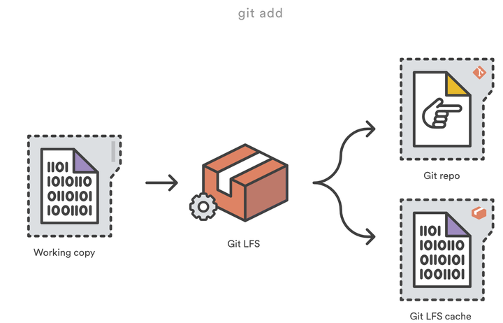
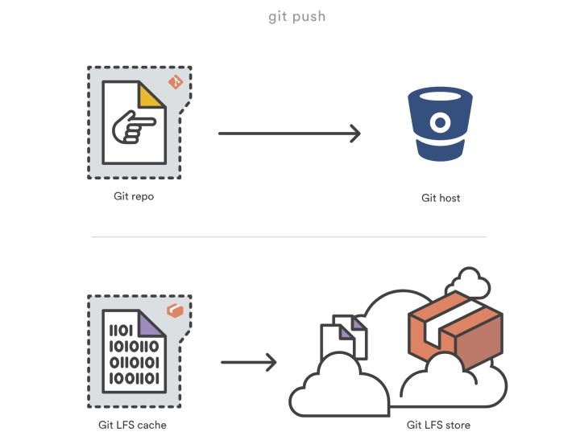
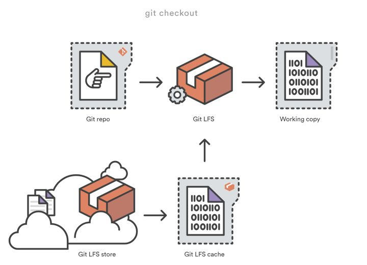
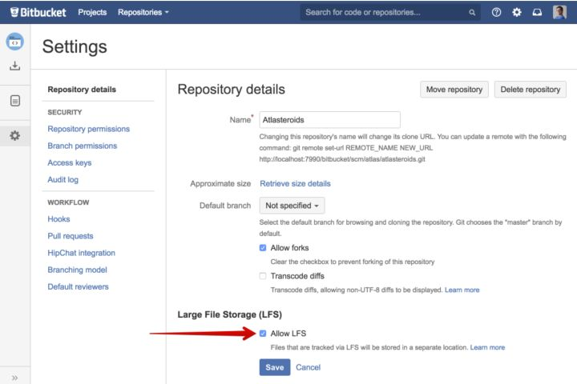
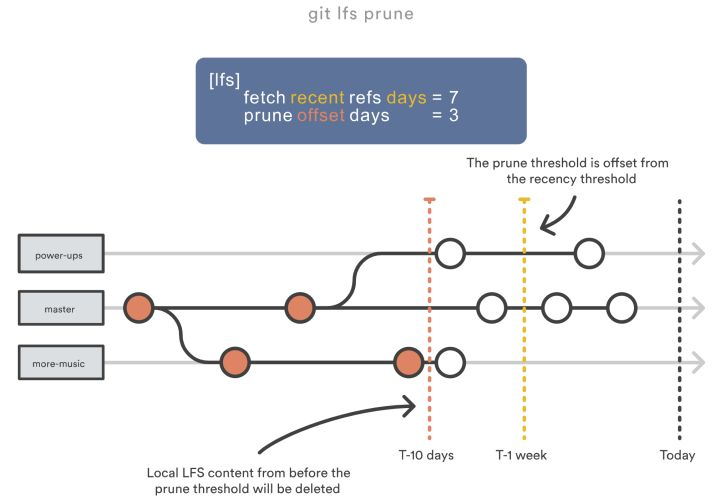
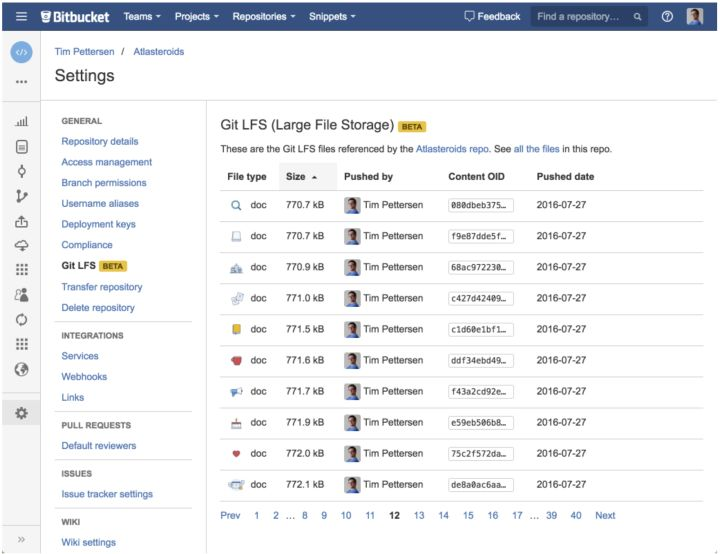

# 详解 Git 大文件存储（Git LFS)


>  中文原文链接：https://www.cnblogs.com/cangqinglang/p/13097777.html)
>


本文主要讲解在 Git 仓库中如何管理大的二进制文件，详细介绍了什么是 Git LFS，Git LFS 是如何工作的，以及如何使用 Git LFS。

本文翻译自 Atlassian 官方介绍 Git LFS 的文章，Atlassian 是 Git LFS 的主要开发者之一，这篇介绍 Git LFS 的文章比较权威，讲的也很详细。原文地址：

[https://www.atlassian.com/git/tutorials/git-lfs](https://link.zhihu.com/?target=https%3A//www.atlassian.com/git/tutorials/git-lfs)

本文同时也加了我个人的一些注释，注释内容会明确用加粗字体标识出来。

## 什么是 Git LFS？

Git 是*分布式* 版本控制系统，这意味着在克隆过程中会将仓库的整个历史记录传输到客户端。对于包涵大文件（尤其是经常被修改的大文件）的项目，初始克隆需要大量时间，因为客户端会下载每个文件的每个版本。Git LFS（Large File Storage）是由 Atlassian, GitHub 以及其他开源贡献者开发的 Git 扩展，它通过延迟地（lazily）下载大文件的相关版本来减少大文件在仓库中的影响，具体来说，大文件是在 checkout 的过程中下载的，而不是 clone 或 fetch 过程中下载的（这意味着你在后台定时 fetch 远端仓库内容到本地时，并不会下载大文件内容，而是在你 checkout 到工作区的时候才会真正去下载大文件的内容）。

Git LFS 通过将仓库中的大文件替换为微小的*指针（pointer）* 文件来做到这一点。在正常使用期间，你将永远不会看到这些指针文件，因为它们是由 Git LFS 自动处理的：

1. 当你添加（执行 `git add` 命令）一个文件到你的仓库时，Git LFS 用一个指针替换其内容，并将文件内容存储在本地 Git LFS 缓存中（本地 Git LFS 缓存位于仓库的 `.git/lfs/objects` 目录中）。



2. 当你推送新的提交到服务器时，新推送的提交引用的所有 Git LFS 文件都会从本地 Git LFS 缓存传输到绑定到 Git 仓库的远程 Git LFS 存储（即 LFS 文件内容会直接从本地 Git LFS 缓存传输到远程 Git LFS 存储服务器）。



3. 当你 checkout 一个包含 Git LFS 指针的提交时，指针文件将替换为本地 Git LFS 缓存中的文件，或者从远端 Git LFS 存储区下载。



关于 LFS 的指针文件：

LFS 的指针文件是一个文本文件，存储在 Git 仓库中，对应大文件的内容存储在 LFS 服务器里，而不是 Git 仓库中，下面为一个图片 LFS 文件的指针文件内容：

```
version https://git-lfs.github.com/spec/v1
oid sha256:5b62e134d2478ae0bbded57f6be8f048d8d916cb876f0656a8a6d1363716d999
size 285
```

 

指针文件很小，小于 1KB。其格式为 key-value 格式，第一行为指针文件规范 URL，第二行为文件的对象 id，也即 LFS 文件的存储对象文件名，可以在.git/lfs/objects 目录中找到该文件的存储对象，第三行为文件的实际大小（单位为字节）。所有 LFS 指针文件都是这种格式。

Git LFS 是无缝的：在你的工作副本中，你只会看到实际的文件内容。这意味着你不需要更改现有的 Git 工作流程就可以使用 Git LFS。你只需按常规进行 git checkout、编辑文件、git add 和 git commit。git clone 和 git pull 将明显更快，因为你只下载实际检出的提交所引用的大文件版本，而不是曾经存在过的文件的每一个版本。

为了使用 Git LFS，你将需要一个支持 Git LFS 的托管服务器，例如[Bitbucket Cloud](https://link.zhihu.com/?target=https%3A//bitbucket.org/)或[Bitbucket Server](https://link.zhihu.com/?target=https%3A//www.atlassian.com/software/bitbucket/server)（[G](https://link.zhihu.com/?target=https%3A//github.com/)[itHub](https://link.zhihu.com/?target=https%3A//github.com/)、[GitLab](https://link.zhihu.com/?target=https%3A//about.gitlab.com/)也都支持 Git LFS）。仓库用户将需要[安装 Git LFS 命令行客户端](https://link.zhihu.com/?target=https%3A//www.atlassian.com/git/tutorials/git-lfs%23installing-git-lfs)（参考[这里](https://link.zhihu.com/?target=https%3A//git-lfs.github.com/)其实更好），或支持 Git LFS 的 GUI 客户端，例如[Sourcetree](https://link.zhihu.com/?target=https%3A//www.sourcetreeapp.com/)。

## 安装 Git LFS

1. 有三种简单的方式来安装 Git LFS：
    + a. 用你最喜欢的软件包管理器来安装它。git-lfs 软件包在 Homebrew，MacPorts，dnf 和[packagecloud](https://link.zhihu.com/?target=https%3A//github.com/github/git-lfs/blob/master/INSTALLING.md)中都是可用的；或者
    + b. 从项目网站下载并安装[Git LFS](https://link.zhihu.com/?target=https%3A//git-lfs.github.com/)；
    + c. 安装 Sourcetree，它是捆绑了 Git LFS 的一个免费的 Git GUI 客户端。

2. 一旦安装好了 Git LFS，请运行 git lfs install 来初始化 Git LFS（如果你安装了 Sourcetree，可以跳过此步骤）：

```sh
$ git lfs install
Git LFS initialized.
```

你只需要运行 git lfs install 一次。为你的系统初始化后，当你克隆包含 Git LFS 内容的仓库时，Git LFS 将自动进行自我引导启用。

## 创建一个新的 Git LFS 仓库

要创建一个新的支持 Git LFS 的仓库，你需要在创建仓库后运行 git lfs install：


```sh
# initialize Git
$ mkdir Atlasteroids
$ cd Atlasteroids
$ git init
Initialized empty Git repository in /Users/tpettersen/Atlasteroids/.git/
# initialize Git LFS
$ git lfs install
Updated pre-push hook.
Git LFS initialized.
```

这将在你的仓库中安装一个特殊的 pre-push [Git 钩子](https://link.zhihu.com/?target=https%3A//www.atlassian.com/git/tutorials/git-hooks)，该钩子将在你执行 git push 的时候传输 Git LFS 文件到服务器上。

所有[Bitbucket Cloud](https://link.zhihu.com/?target=https%3A//bitbucket.org/)仓库已自动启用 Git LFS 。对于[Bitbucket Server](https://link.zhihu.com/?target=https%3A//www.atlassian.com/software/bitbucket/server)，你需要在仓库设置中启用 Git LFS：



当你的仓库初始化了 Git LFS 后，你可以通过使用 git lfs track 来指定要跟踪的文件。

## 克隆现有的 Git LFS 仓库

安装 Git LFS 后，你可以像往常一样使用 git clone 命令来克隆 Git LFS 仓库。在克隆过程的结尾，Git 将检出默认分支（通常是 master），并且将自动为你下载完成检出过程所需的所有 Git LFS 文件。例如：

```sh
$ git clone git@bitbucket.org:tpettersen/Atlasteroids.gitCloning into 'Atlasteroids'...
remote: Counting objects: 156, done.
remote: Compressing objects: 100% (154/154), done.
remote: Total 156 (delta 87), reused 0 (delta 0)
Receiving objects: 100% (156/156), 54.04 KiB | 31.00 KiB/s, done.
Resolving deltas: 100% (87/87), done.
Checking connectivity... done.
Downloading Assets/Sprites/projectiles-spritesheet.png (21.14 KB)
Downloading Assets/Sprites/productlogos_cmyk-spritesheet.png (301.96 KB)
Downloading Assets/Sprites/shuttle2.png (1.62 KB)
Downloading Assets/Sprites/space1.png (1.11 MB)
Checking out files: 100% (81/81), done
```


仓库里有 4 个 PNG 文件被 Git LFS 跟踪。执行 git clone 命令时，在从仓库中检出指针文件的时候，Git LFS 文件被一个一个下载下来。

## 加快克隆速度

如果你正在克隆包含大量 LFS 文件的仓库，显式使用 git lfs clone 命令可提供更好的性能：

```sh
$ git lfs clone git@bitbucket.org:tpettersen/Atlasteroids.git
Cloning into 'Atlasteroids'...
remote: Counting objects: 156, done.
remote: Compressing objects: 100% (154/154), done.
remote: Total 156 (delta 87), reused 0 (delta 0)
Receiving objects: 100% (156/156), 54.04 KiB | 0 bytes/s, done.
Resolving deltas: 100% (87/87), done.
Checking connectivity... done.
Git LFS: (4 of 4 files) 1.14 MB / 1.15 MB
```

git lfs clone 命令不会一次下载一个 Git LFS 文件，而是等到检出（checkout）完成后再批量下载所有必需的 Git LFS 文件。这利用了并行下载的优势，并显著减少了产生的 HTTP 请求和进程的数量（这对于提高 Windows 的性能尤为重要）。

## 拉取并检出

就像克隆一样，你可以使用常规的 git pull 命令拉取 Git LFS 仓库。拉取完成后，所有需要的 Git LFS 文件都会作为自动检出过程的一部分而被下载。

```shell
$ git pull
Updating 4784e9d..7039f0a
Downloading Assets/Sprites/powerup.png (21.14 KB)
Fast-forward
Assets/Sprites/powerup.png | 3 +
Assets/Sprites/powerup.png.meta | 4133 ++++++++++++++++++++++++++++++++++++++++++++++++++++++++++++++++++++
2 files changed, 4136 insertions(+)
create mode 100644 Assets/Sprites/projectiles-spritesheet.png
create mode 100644 Assets/Sprites/projectiles-spritesheet.png.meta
```


不需要显式的命令即可获取 Git LFS 内容。然而，如果检出因为意外原因而失败，你可以通过使用 git lfs pull 命令来下载当前提交的所有丢失的 Git LFS 内容：

```sh
$ git lfs pull
Git LFS: (4 of 4 files) 1.14 MB / 1.15 MB
```

## 加快拉取速度

像 git lfs clone 命令一样，git lfs pull 命令批量下载 Git LFS 文件。如果你知道自上次拉取以来已经更改了大量文件，则不妨显式使用 git lfs pull 命令来批量下载 Git LFS 内容，而禁用在检出期间自动下载 Git LFS。这可以通过在调用 git pull 命令时使用-c 选项覆盖 Git 配置来完成：

```sh
$ git -c filter.lfs.smudge= -c filter.lfs.required=false pull && git lfs pull
```


由于输入的内容很多，你可能希望创建一个简单的[Git 别名](https://link.zhihu.com/?target=https%3A//blogs.atlassian.com/2014/10/advanced-git-aliases/)来为你执行批处理的 Git 和 Git LFS 拉取：

```sh
$ git config --global alias.plfs "\!git -c filter.lfs.smudge= -c filter.lfs.required=false pull && git lfs pull"
$ git plfs
```


当需要下载大量的 Git LFS 文件时，这将大大提高性能（同样，尤其是在 Windows 上）。

## 使用 Git LFS 跟踪文件

当向仓库中添加新的大文件类型时，你需要通过使用 git lfs track 命令指定一个模式来告诉 Git LFS 对其进行跟踪：

```shell
$ git lfs track "*.ogg"
Tracking *.ogg
```

请注意，"*.ogg"周围的引号很重要。省略它们将导致通配符被 shell 扩展，并将为当前目录中的每个.ogg 文件创建单独的条目：

```sh
# probably not what you want
$ git lfs track *.ogg
Tracking explode.ogg
Tracking music.ogg
Tracking phaser.ogg
```

Git LFS 支持的模式与.gitignore 支持的模式相同，例如：

```sh
# track all .ogg files in any directory
$ git lfs track "*.ogg"
# track files named music.ogg in any directory
$ git lfs track "music.ogg"
# track all files in the Assets directory and all subdirectories
$ git lfs track "Assets/"
# track all files in the Assets directory but *not* subdirectories
$ git lfs track "Assets/*"
# track all ogg files in Assets/Audio
$ git lfs track "Assets/Audio/*.ogg"
# track all ogg files in any directory named Music
$ git lfs track "**/Music/*.ogg"
# track png files containing "xxhdpi" in their name, in any directory
$ git lfs track "*xxhdpi*.png
```

这些模式是相对于你运行 git lfs track 命令的目录的。为了简单起见，最好是在仓库根目录运行 git lfs track。需要注意的是，Git LFS 不支持像.gitignore 那样的负模式（negative patterns）。

运行 git lfs track 后，你会在你的运行命令的仓库中发现名为.gitattributes 的新文件。.gitattributes 是一种 Git 机制，用于将特殊行为绑定到某些文件模式。Git LFS 自动创建或更新.gitattributes 文件，以将跟踪的文件模式绑定到 Git LFS 过滤器。但是，你需要将对.gitattributes 文件的任何更改自己提交到仓库：

```sh
$ git lfs track "*.ogg"
Tracking *.ogg
$ git add .gitattributes
$ git diff --cached
diff --git a/.gitattributes b/.gitattributes
new file mode 100644
index 0000000..b6dd0bb
--- /dev/null
+++ b/.gitattributes
@@ -0,0 +1 @@
+*.ogg filter=lfs diff=lfs merge=lfs -text
$ git commit -m "Track ogg files with Git LFS"
```

为了便于维护，通过始终从仓库的根目录运行 git lfs track，将所有 Git LFS 模式保持在单个.gitattributes 文件中是最简单的。然而，你可以通过调用不带参数的 git lfs track 命令来显示 Git LFS 当前正在跟踪的所有模式的列表（以及它们在其中定义的.gitattributes 文件）：

```sh
$ git lfs track
Listing tracked paths
*.stl (.gitattributes)
*.png (Assets/Sprites/.gitattributes)
*.ogg (Assets/Audio/.gitattributes)
```

你可以通过从.gitattributes 文件中删除相应的行，或者通过运行 git lfs untrack 命令来停止使用 Git LFS 跟踪特定模式：

```sh
$ git lfs untrack "*.ogg"
Untracking *.ogg
$ git diff
diff --git a/.gitattributes b/.gitattributes
index b6dd0bb..e69de29 100644
--- a/.gitattributes
+++ b/.gitattributes
@@ -1 +0,0 @@
-*.ogg filter=lfs diff=lfs merge=lfs -text
```

运行 git lfs untrack 命令后，你自己必须再次提交.gitattributes 文件的更改。

## 提交和推送

你可以按常规方式提交并推送到包含 Git LFS 内容的仓库。如果你已经提交了被 Git LFS 跟踪的文件的变更，则当 Git LFS 内容传输到服务器时，你会从 git push 中看到一些其他输出：

```sh
$ git push
Git LFS: (3 of 3 files) 4.68 MB / 4.68 MB
Counting objects: 8, done.
Delta compression using up to 8 threads.
Compressing objects: 100% (8/8), done.
Writing objects: 100% (8/8), 1.16 KiB | 0 bytes/s, done.
Total 8 (delta 1), reused 0 (delta 0)
To git@bitbucket.org:tpettersen/atlasteroids.git
7039f0a..b3684d3 master -> master
```

如果由于某些原因传输 LFS 文件失败，推送将被终止，你可以放心地重试。与 Git 一样，Git LFS 存储也是*内容寻址* 的（而不是按文件名寻址）：内容是根据密钥存储的，该密钥是内容本身的 SHA-256 哈希。这意味着重新尝试将 Git LFS 文件传输到服务器总是安全的；你不可能用错误的版本意外覆盖 Git LFS 文件的内容。

## 在主机之间移动 Git LFS 仓库

要将 Git LFS 仓库从一个托管提供者迁移到另一个托管提供者序，你可以结合使用指定了-all 选项的 git lfs fetch 和 git lfs push 命令。

例如，要将所有 Git 和 Git LFS 仓库从名为`github`的远端移动到名为`bitbucket` 的远端：

```sh
# create a bare clone of the GitHub repository
$ git clone --bare git@github.com:kannonboy/atlasteroids.git
$ cd atlasteroids
# set up named remotes for Bitbucket and GitHub
$ git remote add bitbucket git@bitbucket.org:tpettersen/atlasteroids.git
$ git remote add github git@github.com:kannonboy/atlasteroids.git
# fetch all Git LFS content from GitHub
$ git lfs fetch --all github
# push all Git and Git LFS content to Bitbucket
$ git push --mirror bitbucket
$ git lfs push --all bitbucket
```

## 获取额外的 Git LFS 历史记录

Git LFS 通常仅下载你实际在本地检出的提交所需的文件。但是，你可以使用 git lfs fetch --recent 命令强制 Git LFS 为其他最近修改的分支下载额外的内容：

```sh
$ git lfs fetch --recent
Fetching master
Git LFS: (0 of 0 files, 14 skipped) 0 B / 0 B, 2.83 MB skipped Fetching recent branches within 7 days
Fetching origin/power-ups
Git LFS: (8 of 8 files, 4 skipped) 408.42 KB / 408.42 KB, 2.81 MB skipped
Fetching origin/more-music
Git LFS: (1 of 1 files, 14 skipped) 1.68 MB / 1.68 MB, 2.83 MB skipped
```

这对于在外出午餐时批量下载新的 Git LFS 内容很有用，或者如果你打算与队友一起审查工作，并且由于网络连接受限而无法在以后下载内容时，这将非常有用。 例如，你可能希望在上飞机之前先运行 git lfs fetch --recent！

Git LFS 会考虑包含最近提交超过 7 天的提交的任何分支或标签。 你可以通过设置 lfs.fetchrecentrefsdays 属性来配置被视为最近的天数：

```sh
# download Git LFS content for branches or tags updated in the last 10 days
$ git config lfs.fetchrecentrefsdays 10
```

默认情况下，git lfs fetch --recent 将仅在最近分支或标记的最新提交下载 Git LFS 内容。


但是，你可以通过配置 lfs.fetchrecentcommitsdays 属性，将 Git LFS 配置为在最近的分支和标签上下载更早提交的内容：

```sh
# download the latest 3 days of Git LFS content for each recent branch or tag
$ git config lfs.fetchrecentcommitsdays 3
```

请谨慎使用此设置：如果分支移动很快，则可能会导致下载大量数据。 但是，如果你需要查看分支上的插页式更改，跨分支的 cherry-pick 提交或重写历史记录，它可能会很有用。


如[在主机之间移动 Git LFS 仓库](https://link.zhihu.com/?target=http%3A//km.oa.com/group/41444/articles/show/424020%3Fkmref%3Dtop_1week%23moving-between-hosts)中所述，你还可以选择使用 git lfs fetch --all 获取仓库的所有 Git LFS 内容：

```sh
$ git lfs fetch --all
Scanning for all objects ever referenced...
✔ 23 objects found
Fetching objects...
Git LFS: (9 of 9 files, 14 skipped) 2.06 MB / 2.08 MB, 2.83 MB skipped
```

## 删除本地 Git LFS 文件

你可以使用 git lfs prune 命令从本地 Git LFS 缓存中删除文件：

```sh
$ git lfs prune
✔ 4 local objects, 33 retained
Pruning 4 files, (2.1 MB)
✔ Deleted 4 files
```

这将删除所有被认为是旧的本地 Git LFS 文件。 旧文件是以下未被引用的任何文件：

- 当前检出的提交
- 尚未推送（到 origin，或任何 lfs.pruneremotetocheck 设置的）的提交
- 最近一次提交

默认情况下，最近的提交是最近十天内创建的任何提交。 通过添加以下内容计算得出：

- [获取额外的 Git LFS 历史记录](https://link.zhihu.com/?target=http%3A//km.oa.com/group/41444/articles/show/fetching-history)中讨论的 lfs.fetchrecentrefsdays 属性的值（默认为 7）； 至
- lfs.pruneoffsetdays 属性的值（默认为 3）




你可以配置 prune 偏移量以将 Git LFS 内容保留更长的时间：

```sh
# don't prune commits younger than four weeks (7 + 21)
$ git config lfs.pruneoffsetdays 21
```

与 Git 的内置垃圾收集不同，Git LFS 内容不会自动修剪，因此，定期运行 git lfs prune 命令是保持本地仓库大小减小的好主意。

你可以使用 git lfs prune --dry-run 来测试修剪操作将产生什么效果：

```sh
$ git lfs prune --dry-run
✔ 4 local objects, 33 retained
4 files would be pruned (2.1 MB)
```

以及使用 git lfs prune --verbose --dry-run 命令精确查看哪些 Git LFS 对象将被修剪：

```sh
$ git lfs prune --dry-run --verbose
✔ 4 local objects, 33 retained
4 files would be pruned (2.1 MB)
* 4a3a36141cdcbe2a17f7bcf1a161d3394cf435ac386d1bff70bd4dad6cd96c48 (2.0 MB)
* 67ad640e562b99219111ed8941cb56a275ef8d43e67a3dac0027b4acd5de4a3e (6.3 KB)
* 6f506528dbf04a97e84d90cc45840f4a8100389f570b67ac206ba802c5cb798f (1.7 MB)
* a1d7f7cdd6dba7307b2bac2bcfa0973244688361a48d2cebe3f3bc30babcf1ab (615.7 KB)
```

--verbose 模式输出的长十六进制字符串是要修剪的 Git LFS 对象的 SHA-256 哈希（也称为对象 ID 或 OID）。 你可以使用[“查找路径”](https://link.zhihu.com/?target=http%3A//km.oa.com/group/41444/articles/show/finding-references)中描述的技术或引用 Git LFS 对象的提交来查找有关将被修剪的对象的更多信息。

作为附加的安全检查，你可以使用--verify-remote 选项在删除之前，检查远程 Git LFS 存储区是否具有你的 Git LFS 对象的副本：

```sh
$ git lfs prune --verify-remote
✔ 16 local objects, 2 retained, 12 verified with remote
Pruning 14 files, (1.7 MB)
✔ Deleted 14 files
```


这将使修剪过程明显变慢，但是你可以从服务器上恢复所有修剪的对象，从而使你高枕无忧。 你可以通过全局配置 lfs.pruneverifyremotealways 属性为系统永久启用--verify-remote 选项：

```sh
$ git config --global lfs.pruneverifyremotealways true
```


或者，你可以通过省略上述命令中的--global 选项，仅对当前仓库启用远端校验。

## 从服务器删除远端 Git LFS 文件

Git LFS 命令行客户端不支持删除服务器上的文件，因此如何删除他们取决于你的托管服务提供商。

在 Bitbucket Cloud 中，你可以通过仓库设置> Git LFS查看和删除 Git LFS 文件：



请注意，每个 Git LFS 文件均通过其 SHA-256 OID 进行索引； 通过 UI 看不到引用每个文件的路径。这是因为在许多不同的提交中，可能对应有许多引用对象的不同路径，因此查找它们将是一个非常缓慢的过程。

要确定给定的 Git LFS 文件实际包含什么，你有三个选项可用：

- 在 Bitbucket Git LFS UI 的左栏中查看文件预览图像和文件类型
- 使用 Bitbucket Git LFS UI 右栏中的链接下载文件-搜索引用 Git LFS 对象的 SHA-256 OID 的提交，如下一节所述

## 查找引用 Git LFS 对象的路径或提交

如果你有一个 Git LFS SHA-256 OID，你可以使用 git log --all -p -S 命令确定哪些提交引用了它：

```sh
$ git log --all -p -S 3b6124b8b01d601fa20b47f5be14e1be3ea7759838c1aac8f36df4859164e4cc
commit 22a98faa153d08804a63a74a729d8846e6525cb0
Author: Tim Pettersen <tpettersen@atlassian.com>
Date: Wed Jul 27 11:03:27 2016 +1000
Projectiles and exploding asteroids
diff --git a/Assets/Sprites/projectiles-spritesheet.png
new file mode 100755
index 0000000..49d7baf
--- /dev/null
+++ b/Assets/Sprites/projectiles-spritesheet.png
@@ -0,0 +1,3 @@
+version https://git-lfs.github.com/spec/v1
+oid sha256:3b6124b8b01d601fa20b47f5be14e1be3ea7759838c1aac8f36df4859164e4cc
+size 21647
```

此 git log 咒语会通过添加或删除包含指定字符串（Git LFS SHA-256 OID）的行（-S）的任何分支（--all）上的提交生成补丁（-p）。

该补丁将向你显示 LFS 对象的提交和路径，以及添加它的人和提交时间。 你可以简单地检出提交，Git LFS 将在需要时下载文件并将其放置在你的工作副本中。

如果你怀疑特定的 Git LFS 对象位于当前的 HEAD 或特定的分支中，则可以使用 git grep 查找引用它的文件路径：

```sh
# find a particular object by OID in HEAD
$ git grep 3b6124b8b01d601fa20b47f5be14e1be3ea7759838c1aac8f36df4859164e4cc HEAD
HEAD:Assets/Sprites/projectiles-spritesheet.png:oid sha256:3b6124b8b01d601fa20b47f5be14e1be3ea7759838c1aac8f36df4859164e4cc
# find a particular object by OID on the "power-ups" branch
$ git grep e88868213a5dc8533fc9031f558f2c0dc34d6936f380ff4ed12c2685040098d4 power-ups
power-ups:Assets/Sprites/shield2.png:oid sha256:e88868213a5dc8533fc9031f558f2c0dc34d6936f380ff4ed12c2685040098d4
```

你可以用任何包含 Git LFS 对象的 ref，commit 或 tree 替换 HEAD 或 power-ups。

## 包含/排除 Git LFS 文件

在某些情况下，你可能指向为特定提交下载可用的 Git LFS 内容的子集。例如，在配置 CI 构建以运行单元测试时，你可能只需要源代码，因此可能要排除构建代码不需要的重量级文件。

你可以使用`git lfs fetch -X`（或`--exclude`）排除模式或子目录：

```sh
$ git lfs fetch -X "Assets/**"
```

或者，你可能只想包含特定的模式或子目录。例如，音频工程师可以使用`git lfs fetch -I` (或 `--include`)命令仅获取 ogg 和 wav 文件：

```sh
$ git lfs fetch -I "*.ogg,*.wav"
```

如果你将包含和排除合并在一起使用，则只会获取与包含模式匹配，但与排除模式不匹配的文件。例如，你可以使用以下方法获取 Assets 目录中除 gif 文件之外的所有内容：

```sh
$ git lfs fetch -I "Assets/**" -X "*.gif"
```

排除和包含支持与 git lfs track 和.gitignore 相同的模式。 你可以通过设置 lfs.fetchinclude 和 lfs.fetchexclude 配置属性，使这些模式对于特定仓库来说永久生效：

```sh
$ git config lfs.fetchinclude "Assets/**"
$ git config lfs.fetchexclude "*.gif"
```

通过附加--global 选项，也可以将这些设置应用于系统上的每个仓库。

## 锁定 Git LFS 文件

不幸的是，没有解决二进制合并冲突的简便方法。 使用 Git LFS 文件锁定，你可以按扩展名或文件名锁定文件，并防止二进制文件在合并期间被覆盖。

为了利用 LFS 的文件锁定功能，你首先需要告诉 Git 哪些类型的文件是可锁定的。 在下面的示例中，在 git lfs track 命令后附加了--lockable 标志，该命令既将 PSD 文件存储在 LFS 中，又将它们标记为可锁定。

```sh
$ git lfs track "*.psd" --lockable
```

然后将以下内容添加到.gitattributes 文件中：

```shell
*.psd filter=lfs diff=lfs merge=lfs -text lockable
```

在准备对 LFS 文件进行更改时，你将使用 lock 命令以便将文件在 Git 服务器上注册为锁定的文件。

```sh
$ git lfs lock images/foo.psd
Locked images/foo.psd
```

一旦不再需要文件锁定，你可以使用 Git LFS 的 unlock 命令将其移除。

```shell
$ git lfs unlock images/foo.psd
```

与 git push 类似，可以使用--force 标志覆盖 Git LFS 文件锁。 除非你完全确定自己在做什么，否则不要使用--force 标志。

```sh
$ git lfs unlock images/foo.psd --force
```

## Git LFS 如何工作

如果你想了解有关 clean 和 smudge filter，pre-push 钩子以及 Git LFS 背后的其他有趣的计算机科学的更多信息，请查看来自 Atlassian 在 LinuxCon 2016 的 Git LFS 的演示文稿。

作者：terryshchen，腾讯 IEG 应用开发工程师

