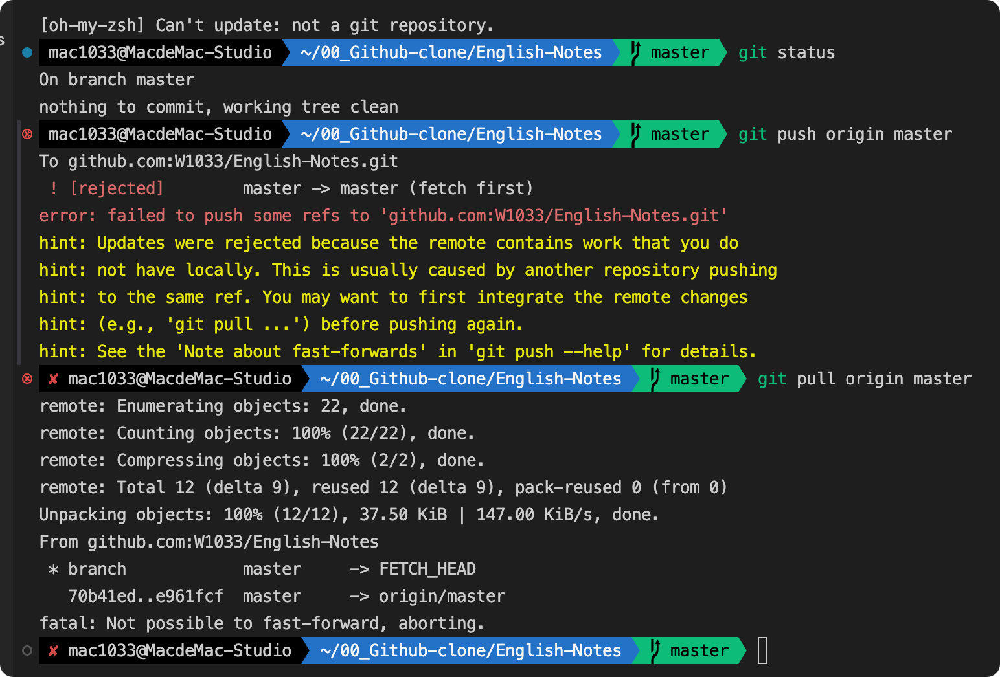
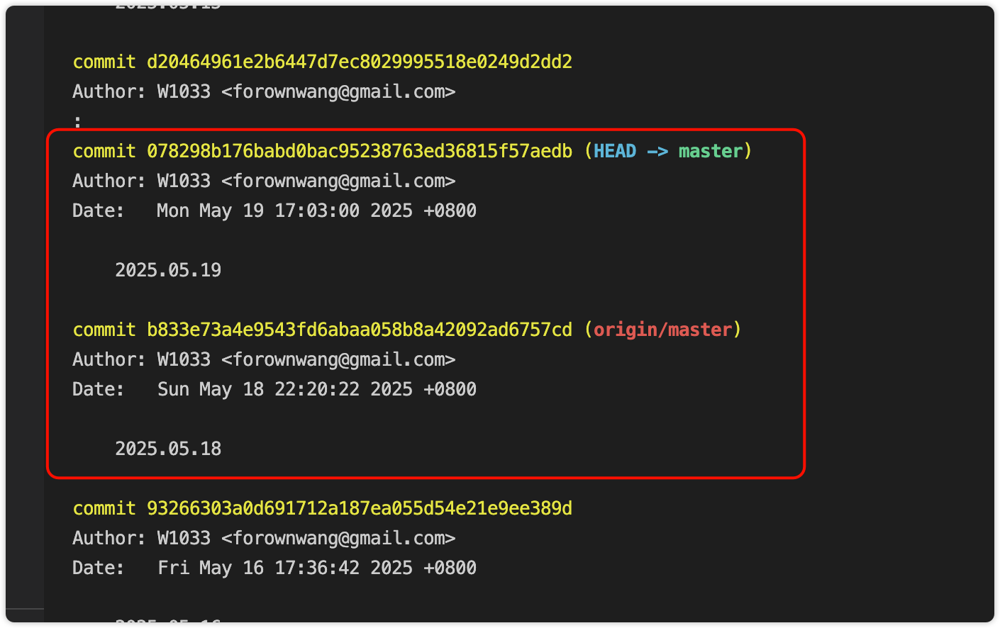
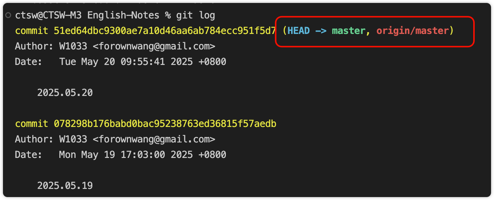
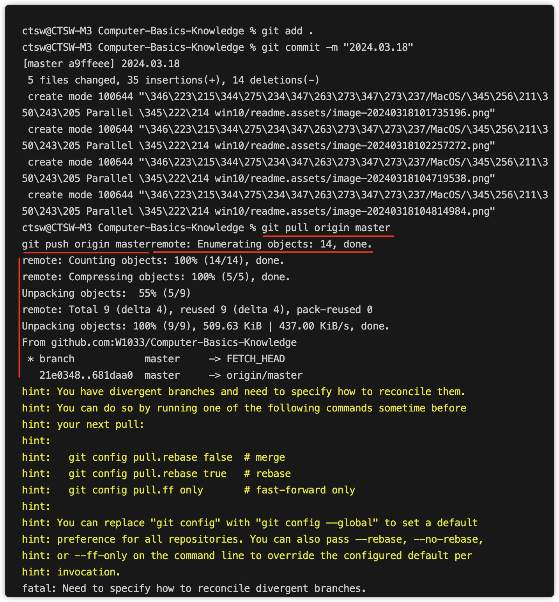
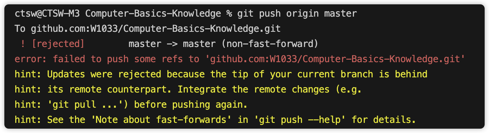
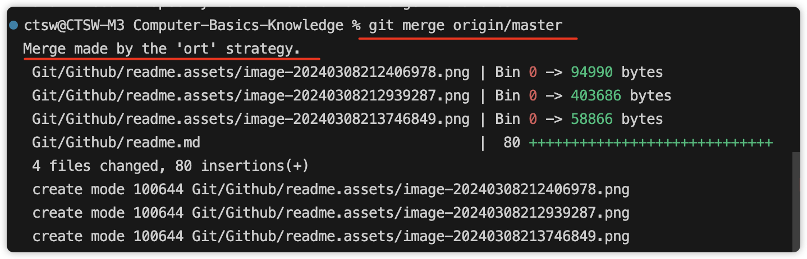
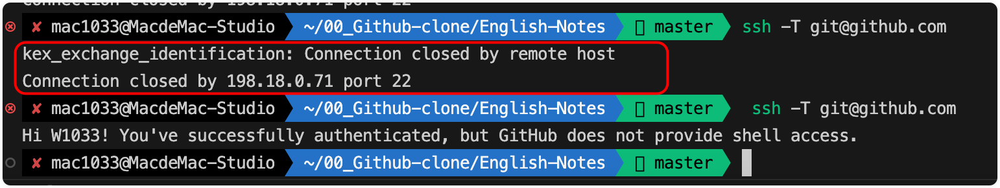
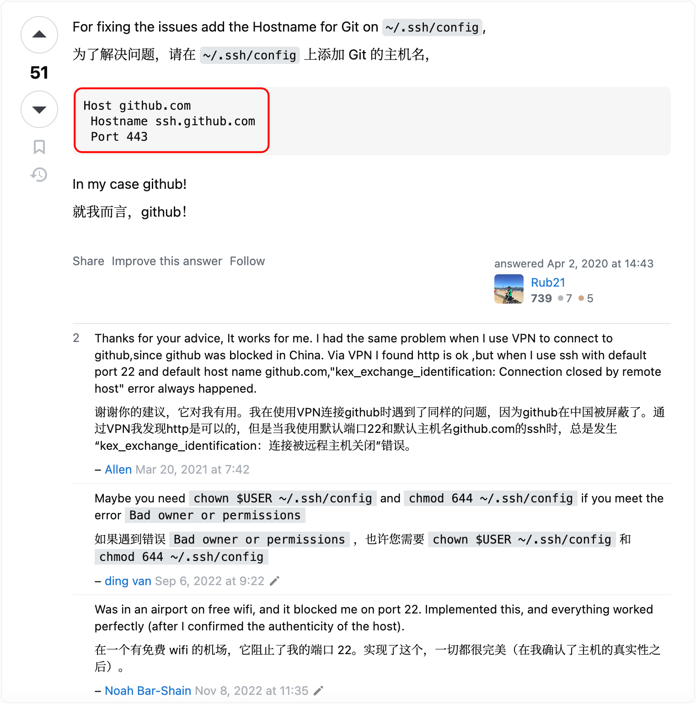
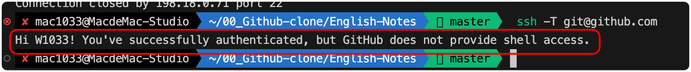
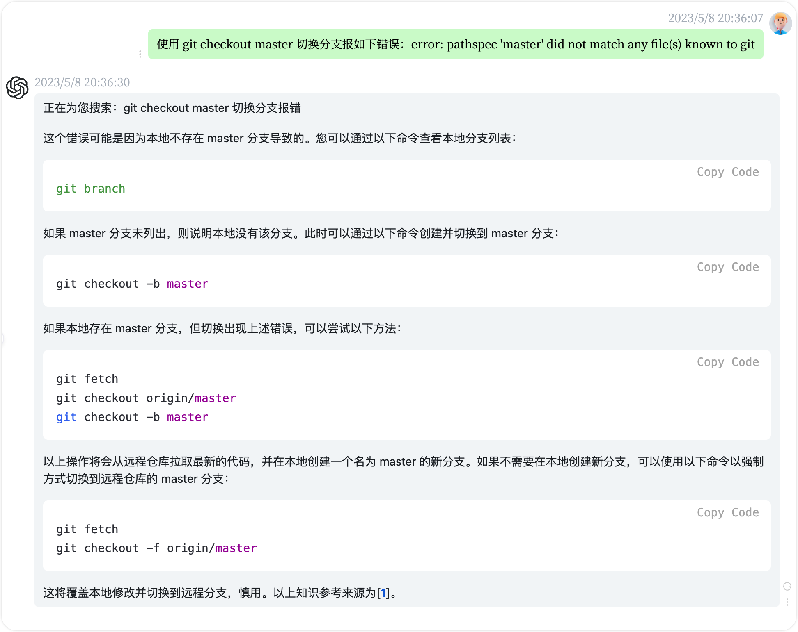

# Github

## New Words

- **ambiguous `/æmˈbɪɡjuəs/` --adjective**
  
  ```css
  ├── adj
  │   ├── (1) something that is ambiguous is unclear, confusing, or not certain, 
  │   │    especially because it can be understood in more than one way. 模棱两可的; 不明确的
  │   │   ├── OPP(opposite`/'ɒpəzɪt/`) unambiguous: 
  │   │   ├── The language in the Minister’s statement is highly ambiguous.部长的声明措辞很含糊。
  │   │   ├── His role in the affair is ambiguous.他在这起事件中的角色并不明确。
  │   ├── Register(说明)
  │   │   ├── In everyday English, people also use the phrase you can take something two ways instead of saying it is ambiguous: ~What she says is ambiguous.~ ➔ You can take what she says two ways. 她的话模棱两可。在日常英语中﹐人们也会用短语 you can take sth two ways 来代替ambiguous
  ```


## ▲ Git  Push 被拒绝, Pull 失败的解决方法

> [!Tip]
>
> *Added: 2025.09.01*
>
> Source: Gemini  对话 `Git 推送被拒绝的解决办法`

原因：*Gemini， 我昨晚在家里的 mac studio 更新了笔记，当时已经 `git add .` 和 `git commit -m "2025.08.31"` 了，但是忘记 `git push origin master` 了，今天白天上班我用公司的 macbook pro 又更新了仓库文档笔记，提交到 github 了，现在我 push 被 reject, 但是  pull 又报错 "fatal: Not possible to fast-forward, aborting." ；我应该如何解决啊，请帮我解答一下，我会把你的回答记到笔记上，谢谢，辛苦你啦。错误见下图：*



```markdown
 ! [rejected]        master -> master (fetch first)
error: failed to push some refs to 'github.com:W1033/English-Notes.git'
hint: Updates were rejected because the remote contains work that you do not have locally. This is usually caused by another repository pushing to the same ref. You may want to first integrate the remote changes  (e.g., 'git pull ...') before pushing again. See the 'Note about fast-forwards' in 'git push --help' for details.

! [被拒绝] master -> master (需先获取)
错误：推送部分引用至 'github.com:W1033/English-Notes.git' 失败
提示：更新被拒绝，因为远程仓库包含了本地没有的工作。这通常是由于另一个仓库推送到了相同的引用。在再次推送前，你可能需要先整合远程的变更（例如，执行 'git pull ...'）。详情请参阅 'git push --help' 中的 '关于快进推送的说明'。


remote: Enumerating objects: 22, done.
remote: Counting objects: 100% (22/22), done.
remote: Compressing objects: 100% (2/2), done.
remote: Total 12 (delta 9), reused 12 (delta 9), pack-reused 0 (from 0)
Unpacking objects: 100% (12/12), 37.50 KiB | 147.00 KiB/s, done.
From github.com:W1033/English-Notes
 * branch            master     -> FETCH_HEAD
   70b41ed..e961fcf  master     -> origin/master
fatal: Not possible to fast-forward, aborting.

远程：正在枚举对象：22个，完成。
远程：正在计数对象：100%（22/22），完成。
远程：正在压缩对象：100%（2/2），完成。
远程：总计12个（差异9个），复用12个（差异9个），打包复用0个（来自0个）
正在解包对象：100%（12/12），37.50 KiB | 147.00 KiB/秒，完成。
来自github.com:W1033/English-Notes
 * 分支 master -> FETCH_HEAD
 70b41ed..e961fcf master -> origin/master
致命错误：无法快进，中止。
```

**Gemini: **

您好，请别担心，您遇到的这个问题是使用 Git 时非常经典且常见的一个场景。这并不是错误操作，而是 Git 为了保护您的代码历史不被意外覆盖而设计的正常行为。您的描述非常清晰，这让我能准确地帮您分析和解决。

### 问题根源分析

这个问题的内核原因是：**您本地（Mac Studio）和远程（GitHub）的提交历史在同一个起点上走向了不同的方向，也就是所谓的“历史分叉 (Diverged History)”。**

我们可以把提交历史想象成一条线：

1. **初始状态**：您的 Mac Studio 和 GitHub 上的 `master` 分支都指向同一个提交，我们称之为 `Commit A`。
    - `GitHub: ... -> Commit A`
    - `Mac Studio: ... -> Commit A`
2. **您在公司操作**：您在公司的 MacBook Pro 上提交了新的笔记（我们称之为 `Commit B`）并推送到了 GitHub。现在 GitHub 的历史向前走了一步。
    - `GitHub: ... -> Commit A -> Commit B`
    - `Mac Studio: ... -> Commit A` ( 家里的电脑对此一无所知 )
3. **您在家里的操作**：您昨晚在 Mac Studio 上提交了 `2025.08.31` ( 我们称之为 `Commit C`)，但没有推送。所以您本地的历史也向前走了一步，但是走向了和 `Commit B` 不同的方向。
    - `GitHub: ... -> Commit A -> Commit B`
    - `Mac Studio: ... -> Commit A -> Commit C`

现在，`Commit B` 和 `Commit C` 都是基于 `Commit A` 的新提交。当您今天试图在 Mac Studio 上 `git push` 时，Git 发现您想用 `Commit C` 覆盖 GitHub 上的 `Commit B`，为了防止数据丢失，它拒绝了您的推送（`! [rejected]`）。

接着您尝试 `git pull`，`git pull` 的默认行为是 `fetch` ( 抓取 ) + `merge` ( 合并 )。Git 抓取了 `Commit B`，然后试图将 `Commit B` 和 `Commit C` 合并，但发现这两条历史线已经分叉，无法进行“快进式合并 (Fast-forward)”，所以它中止了操作并提示 `fatal: Not possible to fast-forward, aborting.`。

### 解决方案

要解决这个问题，您需要将分叉的两条历史线重新集成到一起。主要有两种方法：`Rebase` ( 变基 ) 和 `Merge` ( 合并 )。对于个人笔记这种线性工作流，我更推荐使用 `Rebase`，因为它能让您的提交历史保持为一条直线，非常清晰。

### 方案一：使用 `Rebase` ( 变基 ) ( 推荐 )

**原理**：`Rebase` 的意思是“重新设置基础”。它会先将您在本地的提交 (Commit C) 暂时“收起来”，然后拉取远端的最新提交 (Commit B)，最后再将您本地的提交 (Commit C) 应用在远端提交的后面。

历史变化过程：

A -> C + A -> B  => A -> B -> C'

`C'` 是一个新的提交，但内容和您原来的 `C` 完全一样。

**操作步骤**：

1. 在您的项目目录中，执行以下命令。这个命令包含了拉取和变基两个动作：

    Bash

    ```
    git pull --rebase origin master
    ```

2. 执行后，Git 会自动完成上述的“收起 -> 拉取 -> 应用”过程。如果没有文档冲突，它会直接成功。

3. 现在，您本地的历史记录已经包含了远端的所有更新，并且您自己的提交也完好地接在了最后。您可以检查一下日志确认：

    Bash

    ```
    git log --oneline --graph
    ```

4. 最后，将整理好的历史推送到 GitHub。这次推送会以 "fast-forward" 模式成功。

    Bash

    ```
    git push origin master
    ```

### 方案二：使用 `Merge` ( 合并 ) ( 备选方案 )

**原理**：`Merge` 会将远端的历史和您本地的历史进行合并，并创建一个全新的“合并提交 (Merge Commit)”来记录这次合并操作。

历史变化过程：

它会创建一个 Commit D，这个提交同时拥有 Commit B 和 Commit C 两个父提交。历史图看起来会有分叉和汇合。

**操作步骤**：

1. 首先，获取远端仓库的最新历史，但先不合并。

    Bash

    ```
    git fetch origin
    ```

2. 然后，手动将远端的 `master` 分支合并到您本地的 `master` 分支。

    Bash

    ```
    git merge origin/master
    ```

    执行后，Git 可能会弹出一个编辑器让您填写合并提交的信息，通常直接保存并退出即可。

3. 合并完成后，同样地，将包含了合并提交的新历史推送到 GitHub。

    Bash

    ```
    git push origin master
    ```

### **关于可能出现的“冲突 (Conflict)”**

无论您使用 `Rebase` 还是 `Merge`，如果“公司电脑的提交”和“家里电脑的提交”修改了**同一个文档的同一行**，Git 将无法自动决定使用哪个版本，此时就会发生**合并冲突**。

如果发生冲突，终端会提示您：`CONFLICT (content): Merge conflict in <file_name>`。

您需要手动解决冲突：

1. 打开提示有冲突的文档。

2. 在文档中找到类似下面的标记：

    ```
    <<<<<<< HEAD
    这是您在家里 Mac Studio 上做的修改。
    =======
    这是您在公司 MacBook Pro 上做的修改，并且已经推送到 GitHub。
    >>>>>>> some-commit-hash...
    ```

3. 您需要手动编辑这部分内容，决定最终保留哪些内容。删除 `<<<<<<< HEAD`，`=======`，和 `>>>>>>> ...` 这些特殊标记。

4. 保存文档后，将文档标记为已解决状态：

    Bash

    ```
    git add .
    ```

5. **继续后续操作**：

    - 如果您之前用的是 `Rebase`，则执行：`git rebase --continue`
    - 如果您之前用的是 `Merge`，则执行：`git commit` ( 通常 Git 已经准备好了提交信息，您只需保存即可 )

6. 解决所有冲突后，再执行最后的 `git push origin master`。

### 总结

对于您当前的情况，最直接、最推荐的解决命令是：

Bash

```
# 步骤一：拉取远程更新并把你的本地提交应用在最新版本之后
git pull --rebase origin master

# (如果出现冲突，先解决冲突，然后 git add .，再 git rebase --continue)

# 步骤二：将整理好的、包含所有历史的本地分支推送到远程
git push origin master
```

希望这个解释对您有帮助！把这个过程记录下来是个非常好的习惯，这是每一位使用 Git 的开发者都会反复遇到的场景。

---


**ASK:** *Gemini, 谢谢你的详细讲解，我个人更喜欢第二个 merge 的方式，但是我有个疑问，如果文档有冲突，vscode 文档名会变红给出冲突提示吗？还是说只在 vscode 的终端中给出冲突提示？*

**Gemini:**

您提的这个问题非常好，这关系到日常开发中的实际体验。

是的，当 Git `merge` 发生冲突时，VS Code 会在多个地方给出非常直观的、可视化的提示，而**不仅仅是在终端里**。这正是 VS Code 作为 Git 强大的图形化客户端的优势之一。

具体来说，您会看到以下几种提示：

1. **文档列表中的颜色和标记**：
    - 在 VS Code 左侧的“源代码管理”(Source Control) 面板（就是那个分叉图标）中，所有存在冲突的文档名都会**以红色或橙色高亮显示**，并且旁边会有一个 `C` 字母标记，代表 "Conflict"。
    - 在文档资源管理器 (Explorer) 中，冲突的文档名也会变色，通常是红色。
2. **文档内容中的可视化编辑器**：
    - 当您打开那个有冲突的文档时，VS Code 会自动识别出冲突区域，并提供一个特别的“合并冲突编辑器”(Merge Conflict Editor)。
    - 您会清晰地看到类似这样的界面：
        - `<<<<<<< HEAD (Current Change)` 下面是您本地的修改（即您在 Mac Studio 上做的修改）。
        - `>>>>>>> INCOMING CHANGE` 下面是远端拉下来的修改（即您在公司 MacBook Pro 上做的修改）。
        - 在每个冲突块的上方，VS Code 会提供几个可点击的按钮 / 链接，例如：
            - **Accept Current Change** ( 接受当前更改 )
            - **Accept Incoming Change** ( 接受传入的更改 )
            - **Accept Both Changes** ( 接受双方的更改 )
            - **Compare Changes** ( 比较差异 )
    - 这种可视化的方式让您无需手动去删除 `<<<<<<<`, `=======`, `>>>>>>>` 这些标记。您只需要点击按钮，选择您想要保留的版本，VS Code 就会自动帮您整理好代码。当然，您也可以直接在编辑器里手动修改，达到一个最终你想要的效果。
3. **概览标尺 (Overview Ruler) 中的提示**：
    - 在编辑器右侧的滚动条区域，也会有红色的标记指示出文档中冲突的具体位置，方便您快速跳转。

**总结一下流程就是：**

1. 您在终端执行 `git merge origin/master`。
2. 终端提示 `CONFLICT`。
3. 您切换到 VS Code 界面，会立刻在左侧的源代码管理面板看到标红的、带 `C` 标记的文档。
4. 您点击该文档，在编辑器中利用 VS Code 提供的 "Accept Current/Incoming/Both" 按钮来解决冲突。
5. 解决完所有冲突并保存文档后，回到源代码管理面板，点击文档名旁边的 `+` 号（等同于执行 `git add <file_name>`），将解决后的文档暂存起来。
6. 当所有冲突文档都暂存后，VS Code 会提示您可以输入提交信息来完成这次合并提交。您填写信息并提交。
7. 最后，执行 `git push`。

所以，请放心使用 `merge` 的方式。VS Code 提供了非常强大和友好的支持，让解决冲突这个过程变得直观和简单很多。


## ▲ 本地分支未 push 到远程仓库和 push 到远程仓库的状态显示

> [!Note]
>
> Added: 2025.05.20
>
> Answered: Gemini 2.5 pro (preview)

比如在 `English-Notes` 仓库下，在命令行中输入 `git log` 显示的分支状态如下：

> [!Tip]
>
> Git 查看当前分支的版本历史的命令，见同仓库：[显示当前分支的版本历史](../Git全栈开发使用指南/readme.md#my-stable-git-log-anchor)



> 图片中红框标出的两项是 Git 版本控制系统中常见的指针或引用，它们代表了仓库中特定的提交节点。
>
> 1. **(HEAD -> master)**
>     - `HEAD`：在 Git 中，`HEAD` 是一个特殊的指针，它通常指向当前工作分支的最新提交。当你进行新的提交时，`HEAD` 会随之移动到这个新的提交上。简单来说，`HEAD` 代表你当前所在的位置。
>     - `master`：`master` 是 Git 仓库中默认的主分支名称。当然，现在更推荐使用 `main` 作为主分支的名称。
>     - `-> master`：这个箭头表示 `HEAD` 当前正指向 `master` 分支。这意味着你目前检出（checked out）的是 `master` 分支，并且你所做的任何新提交都将添加到 `master` 分支上。
> 2. **(origin/master)**
>     - `origin`：`origin` 是 Git 中远程仓库的默认名称。当你从一个远程仓库克隆（clone）项目时，Git 会自动将这个远程仓库命名为 `origin`。
>     - `master`：同样，这里的 `master` 指的是名为 `master` 的分支。
>     - `origin/master`：这代表了名为 `origin` 的远程仓库上的 `master` 分支的最新状态。这个指针记录了你最后一次与远程仓库同步（例如通过 `git fetch` 或 `git pull`）时，远程 `master` 分支的位置。它不会随着你本地的提交而移动，只会在你与远程仓库交互时更新。
>
> **总结来说：**
>
> - `commit 078298b176babd0bac95238763ed36815f57aedb (HEAD -> master)` 这一行表示：
>     - `078298...` 是这次提交的唯一哈希值（commit hash）。
>     - 你当前的工作目录正处于 `master` 分支的这个提交上 (`HEAD` 指向 `master`)。
>     - 这次提交的作者是 `W1033 <forownwang@gmail.com>`。
>     - 提交日期是 `Mon May 19 17:03:00 2025 +0800`。
> - `commit b833e73a4e9543fd6abaa058b8a42092ad6757cd (origin/master)` 这一行表示：
>     - `b833e7...` 是另一次提交的唯一哈希值。
>     - 这个提交是你本地仓库记录的远程仓库 `origin` 上 `master` 分支的最新提交。
>     - 这次提交的作者和日期也显示在下方。
>
> 从图中可以看出，你本地的 `master` 分支 (`HEAD -> master`) 比远程的 `origin/master` 分支领先一次提交 (`commit 078298...` 是更新的提交 )。这意味着你在本地做了一次提交，但还没有把它推送到远程仓库。

执行 `git push origin master` 之后为下面这样：



> 在这种状态下，`(HEAD -> master, origin/master)` 表示：
>
> - **`HEAD -> master`**: 和之前一样，`HEAD` 指向你本地的 `master` 分支。这意味着你当前检出的是 `master` 分支，并且这是你正在工作的分支。
> - **`origin/master`**: 这代表名为 `origin` 的远程仓库上的 `master` 分支。
>
> 关键在于，现在 `HEAD -> master` 和 `origin/master` **都指向同一个提交** (`commit 51ed64dbc9300ae7a10d46aa6ab784ecc951f5d7`)。
>
> 这通常意味着以下几种情况之一：
>
> 1. **你刚刚克隆（clone）了远程仓库**：当你克隆一个仓库时，你的本地 `master` 分支会自动跟踪远程的 `master` 分支，并且它们会指向相同的最新提交。
> 2. **你刚刚拉取（pull）了远程仓库的最新更改**：如果你执行了 `git pull` ( 或者 `git fetch` 后跟 `git merge origin/master` 或 `git rebase origin/master`)，并且远程仓库没有新的提交，或者你本地已经是最新的，那么 `HEAD -> master` 和 `origin/master` 都会指向最新的共同提交。
> 3. **你刚刚推送（push）了本地的提交到远程仓库**：如果你在本地做了一些提交，然后成功地将这些提交推送到了 `origin/master`，那么你本地的 `master` 和远程的 `origin/master` 就会同步，指向相同的最新提交。
>
> **总结来说：**
>
> `commit 51ed64dbc9300ae7a10d46aa6ab784ecc951f5d7 (HEAD -> master, origin/master)` 这一行表示：
>
> - `51ed64...` 是这次提交的唯一哈希值。
> - 你当前的工作目录正处于 `master` 分支的这个提交上 (`HEAD` 指向 `master`)。
> - 这个提交同时也是你本地仓库记录的远程仓库 `origin` 上 `master` 分支的最新提交 (`origin/master`)。
> - 这意味着你本地的 `master` 分支与远程的 `origin/master` 分支在这一点上是完全同步的。
>
> 根据截图中的日期 (`Tue May 20 09:55:41 2025`)，这很可能是你刚刚进行了一次同步操作（比如 `git pull` 或 `git push`），或者你刚刚克隆了这个仓库，并且没有新的本地提交。


## ▲ 提交代码时 git pull origin master  没有执行完毕就直接执行了 git push origin master 出现的错误

*Added: 2024.3.18* 

原因：如标题所示，直接在命令行里写完 `git pull origin master` 后立马就写了 `git push origin master`  pull 的命令没有执行，直接执行了 git push,  终端内的执行图是下面着这样：



> <span style="color:#b5b405;">hint: You have divergent branches and need to specify how to reconcile them. You can do so by running one of the following commands sometime before your next pull:</span>
>
> 提示：您有分叉的分支，需要指定如何协调它们。您可以在下次拉取之前运行以下命令之一：

此时如果再次 `git push origin master` 就会报如下的错误：



如果我们此时使用 `git show-ref` 查看不同，会显示如下：

```git
a9ffeee5cec7009ccf223ee6282320ac18dffa1d refs/heads/master
681daa0f2ddafebc064debeacf0565f7ccd3330c refs/remotes/origin/master
```

此时需要做的就是 merge 合并冲突，因为当前仓库已经提交了，但是并没有成功，使用 `git merge origin/master` 来合并冲突，图示如下：



> `git merge origin/master` 是一个 Git 命令，用于将远程主分支（通常称为 `master` 或 `main`）的最新更改合并到当前工作分支中。这里，`origin/master` 表示远程仓库 `origin` 的 `master` 分支。下面是这个命令的详细解释：
>
> - `git`: 这是调用 Git 程序的命令。
> - `merge`: 这个子命令用于合并两个或多个开发历史。
> - `origin/master`: 指定要合并的分支。在这个例子中，它引用远程仓库 `origin` 中的 `master` 分支。
>
> 当你执行 `git merge origin/master` 时，Git 会尝试自动合并远程分支 `master` 的更改到你当前所在的本地分支。合并过程中可能会出现以下几种情况：
>
> 1. **无冲突自动合并**：如果远程分支的更改与你的本地分支不冲突，Git 将自动合并这些更改。
> 2. **冲突需要手动解决**：如果远程分支的更改与本地分支在相同的文件中有不同的更改，会产生冲突，需要手动解决后才能完成合并。
>
> “Merge made by the 'ort' strategy” 表示 Git 使用了 'ort' 策略*`(1)`*来合并分支。'ort' 策略是 Git 用于处理合并的一种内部机制，旨在优化合并过程，减少合并冲突的发生。
>
> 总的来说，`git merge origin/master` 命令用于将远程主分支的更新合并到你的当前分支，以确保你的工作是基于最新的项目状态。
>
>
> (1) `ort` 策略是 Git 合并策略中的一种，其中 `ort` 代表 "Ostensibly Recursive's Twin"。这是 Git 中较新的合并策略之一，旨在取代老旧的 `recursive` 合并策略。`ort` 策略在处理合并冲突和计算合并结果时更高效，尤其是在处理大型项目或复杂的合并历史时。它旨在改进性能并减少错误，同时保持与 `recursive` 策略相似的合并结果。
>
> "Ostensibly Recursive's Twin" 可以翻译为“表面上递归的双胞胎”。这里的“表面上”指的是它看起来和旧的递归策略类似，但实际上已经做了改进和优化。


## ▲ 拉取 github 仓库报错：

错误如下：

```md
kex_exchange_identification: Connection closed by remote host
Connection closed by 140.82.114.4 port 22
fatal: Could not read from remote repository.
```

首先问了一下 ChatGPT 4.0，他的回答如下：

> 你遇到的错误信息 "kex_exchange_identification: Connection closed by remote host" 表明你本地机器和 GitHub 服务器之间的 SSH 连接存在问题。这个错误通常发生在 SSH 密钥交换出现问题时。
>
> 以下是解决此问题的一些步骤：
>
> 1. **检查 SSH 配置**：确保你的 SSH 配置设置正确。确保你的 GitHub 账户关联了正确的 SSH 密钥，并且公钥已经添加到 GitHub 账户的设置中。
>
> 2. **验证 SSH 密钥权限**：确保 SSH 密钥文件的权限设置正确。私钥（`id_rsa`）的权限应设置为 `600`（仅对所有者可读和可写）。
>
>    你可以使用以下命令设置正确的权限：
>    ```bash
>    chmod 600 ~/.ssh/id_rsa
>    ```
>
> 3. **检查 SSH 连接**：使用以下命令测试你与 GitHub 服务器的 SSH 连接：
>    
>    ```bash
>    ssh -T git@github.com
>    ```
>    这个命令应该建立连接并显示一条消息，确认你已成功验证身份。
>    
> 4. **防火墙或网络问题**：如果你身处防火墙之后或者使用受限制的网络，可能连接会被阻止。检查防火墙设置，或尝试使用不同的网络看是否问题仍然存在。
>
> 5. **GitHub 状态**：有时，GitHub 的服务器可能会出现临时问题。你可以在他们的状态页面上检查 GitHub 服务的状态。
>
> 6. **更新 SSH 客户端**：确保你的 SSH 客户端已经更新到最新版本。有时，过时的 SSH 客户端版本可能会导致兼容性问题。
>
> 7. **检查 SSH 配置文件**：验证你的 SSH 配置文件（`~/.ssh/config`）是否有任何可能干扰连接到 GitHub 的冲突设置。
>
> 8. **查看 SSH 日志**：检查 SSH 日志，以获取可能提供有关连接失败原因的更详细的错误消息。你可以在 Linux 系统中通常在 `/var/log/auth.log` 找到 SSH 日志。
>
> 通过遵循这些步骤，你应该能够诊断和解决从 GitHub 拉取代码时遇到的 "kex_exchange_identification: Connection closed by remote host" 错误。
>
> 参考资料：
> - GitHub SSH 故障排除指南：https://docs.github.com/en/github/authenticating-to-github/troubleshooting-ssh
> - GitHub 状态页面：https://www.githubstatus.com/
>

我使用上面的第 3 步的 `ssh -T git@github.com` 命令，在当前仓库测试的结果是这样的，即下图红色方框内的：

```md
kex_exchange_identification: Connection closed by remote host
Connection closed by 198.18.0.71 port 22
```



然后我直接在在谷歌里搜索："错误：kex_exchange_identification: Connection closed by remote host
Connection closed by 198.18.0.71 port 22"，在检索页面的第一个 StackOverflow 的见面中见到如下回答：

> 原文：https://stackoverflow.com/questions/10127818/ssh-exchange-identification-connection-closed-by-remote-host-under-git-bash



原因请看上图的评论，所以这个没有什么好说的，按照截图修改就行了，我自己电脑的 `~/.ssh/config` 文件修改后为：

```bash
Host github.com
 Hostname ssh.github.com
 Port 443
IgnoreUnknown UseKeychain
AddKeysToAgent yes
IdentityFile ~/.ssh/id_ed25519
```

最后添加完之后再使用上面 ChatGPT 回答中的第 3 步 `ssh -T git@github.com` 命令测试，出现如下提示几表示可以正常访问了。




## ▲ 在 Github 仓库中启用 Web VSCode

在当前仓库中的任何一个页面点击键盘上的 `.` 按键，直接进入 web vscode


## ▲ Git 常用命令

**基本命令见同级目录的：`../Git全栈开发使用指南/readme.md`**

1. 初始化仓库
2. 配置
3. 增加/删除文件
4. 代码提交
5. 分支
6. 标签
7. 查看信息
8. 远程同步
9. 撤销

**详细命令讲解见同级目录的:**

- `../《Pro-Git》/01-起步.md`
- `../《Pro-Git》/02-Git基础.md`

**简要命令：**、

```sh
$ git push origin master
```

省略了 `<dst>` 等价于

```sh
$ git push origin master:master
```

其中 `origin` 指定了你要 `push` 到哪个 `remote`. 一般形式为:

```sh
$ git push origin <src>:<dst>
```

冒号前面表示 本地分支(local branch) 的名字，冒号后表示 远程仓库(remote repository) 下 branch 的名字。
注意，如果省略了 `<dst>`, git 会认为你想 push 到 remote repository 下和 local branch 相同名字的 branch.

```sh
# 刷新远程分支列表
$ git remote update origin --prune
```


## ▲git 中文路径乱码处理

```shell
#支持中文路径名

git config --global core.quotepath false
```


## ▲ 分支切换

要切换到一个已存在的分支，你需要使用 `git checkout` 命令，例如从一个分支切换到 master 分支：`git checkout master`


> 上图的参考[1] ： https://git-scm.com/book/zh/v2 （注：直接参考的 git pro 哈哈哈哈）


## ▲ VSCode-git 中的 U, M 和 D 文件标记含义

- **M (modified):** 你已经在 github 中添加过该文件，然后你对这个文件进行了修改，就会文件后标记 M
- **U (untracked):** 你在本地新建了这个文件，还未提交到 github 上，就会标记 U
- **D (delete):** 你删除了这个文件，vscode-git 会记录下这个状态


## ▲ 解决 fatal: unable to connect to github.com  errno=连接超时

created: 2023.03.22

> https://www.cnblogs.com/happystudyeveryday/p/17015297.html

解决fatal: unable to connect to github.com: github.com[0: 20.205.243.166]: errno=连接超时

解决方法：输入命令

```
git config --global url.``"https://github.com"``.insteadOf git://github.com
```


## ▲ 使用 git pull 强制覆盖本地文件的方式

```sh
# 如果你不想要本地的所有修改的情况下，这条命令特别好用
# 请谨慎使用，这条命令会删除你本地仓库的所有内容，如果当前内容还没有同步到远程仓库的话
git fetch --all
git reset --hard origin/master
git pull origin master
```


## ▲ 删除本地 Git 仓库中的某个提交（commit）

如果要删除（/撤销）本地 Git 仓库中的 commit 提交，有下面 3 种方式：

**(1) 回到上一个版本：删除工作区的代码，撤销 commit 和 `git add .`，回到上一次 commit 的状态。**

```sh
git reset --hard HEAD~1
```

其中，`HEAD~1`表示将会重置到最近的前一个提交。如果想要重置到更早的提交，请将数字 1 更改为相应的值。

需要注意的是，这个命令将会永久性地删除提交，并清除该提交及其后的所有更改。请确保在执行此操作之前进行备份，并且谨慎使用该命令。

**(2) 回到上一个版本：不删除本地工作区改动的代码，只撤销最近的 commit，不撤销 `git add .`**

```sh
git reset --soft HEAD~1
```

它将回滚到最近的一次提交，并将它们作为更改保留在本地代码库中。这意味着您可以修改或添加新的文件，并重新提交它们。

**(3) 回到上一个版本：不删除工作区改动的代码，撤销 commit 和 `git add .`**

```
git reset --mixed HEAD~1
```


## ▲ 推送代码报错：Updated were rejected because a pushed branch tip is behind its remote counterpart.

```
To github.com:W1033/English-Notes.git
 ! [rejected]        master -> master (non-fast-forward)
error: failed to push some refs to 'github.com:W1033/English-Notes.git'
hint: Updates were rejected because a pushed branch tip is behind its remote
hint: counterpart(副本). Check out this branch and integrate(整合) the remote changes
hint: (e.g. 'git pull ...') before pushing again.
hint: See the 'Note about fast-forwards' in 'git push --help' for details.
```

这个错误在 StackOverflow 上最高赞的回答是这样的:

> 原问答：https://stackoverflow.com/questions/39399804/updates-were-rejected-because-the-tip-of-your-current-branch-is-behind-its-remot
> 
> The `-f` **is** actually required because of the rebase. Whenever you do a rebase you would need to do a force push because the remote branch cannot be fast-forwarded to your commit. You'd **always** want to make sure that you do a pull before pushing, but if you don't like to force push to master or dev for that matter, you can create a new branch to push to and then merge or make a PR.
> 
> (事实上，由于 rebase 的缘故，需要 `-f`。每当你做 rebase 时，你需要做一个强制推送，因为远程分支不能快速转到你的提交。你总是想确保在推送之前做一次拉取，但如果你不喜欢强制推送到 master 或 dev ，你可以创建一个新的分支来推送，然后合并或做一个PR。)

在发生这个错误之前，我确实 merge 了拉取远程仓库产生的 conflict，按照上面的回答，只需要使用 `-f` 强制推送即可：`git push -f origin master`


## ▲ Pull 代码报错：

```sh
Your branch and 'origin/master' have diverged,
and have 1 and 1 different commits each, respectively.
  (use "git pull" to merge the remote branch into yours)
```

> 详细讲解件：https://stackoverflow.com/questions/2452226/master-branch-and-origin-master-have-diverged-how-to-undiverge-branches/2452610#2452610
>
> 下面的笔记来自上面链接的精简：
>
> #### Merge
>
> Use the `git merge` command:
>
> ```
> $ git merge origin/main
> 
> # old repositories
> $ git merge origin/master
> ```
>
> This tells Git to integrate the changes from `origin/main` into your work and create a merge commit.
> The graph of history now looks like this:
>
> ```
> ... o ---- o ---- A ---- B  origin/main (upstream work)
>                    \      \
>                     C ---- M  main (your work)
> ```
>
> The new merge, commit `M`, has *two* parents, each representing one path of development that led to the content stored in that commit.
>
> Note that the history behind `M` is now non-linear.
>
> 
>
> #### Rebase
>
> Use the `git rebase` command:
>
> ```
> $ git rebase origin/main
> 
> # old repositories
> $ git rebase origin/master
> ```
>
> This tells Git to replay commit `C` (your work) as if you had based it on commit `B` instead of `A`.
> CVS and Subversion users routinely rebase their local changes on top of `upstream` work when they update before commit.
> Git just adds explicit separation between the commit and rebase steps.
>
> The graph of history now looks like this:
>
> ```
> ... o ---- o ---- A ---- B  origin/main (upstream work)
>                           \
>                            C'  main (your work)
> ```
>
> Commit `C'` is a new commit created by the `git rebase` command.
> It is different from `C` in two ways:
>
> 1. It has a different history: `B` instead of `A`.
> 2. Its content accounts for changes in both `B` and `C`; it is the same as `M` from the merge example.
>
> Note that the history behind `C'` is still linear.
> We have chosen (for now) to allow only linear history in `cmake.org/cmake.git`.
> This approach preserves the CVS-based workflow used previously and may ease the transition.
> An attempt to push `C'` into our repository will work (assuming you have permissions and no one has pushed while you were rebasing).
>
> The `git pull` command provides a shorthand way to `fetch` from `origin` and `rebase` local work on it:
>
> ```
> $ git pull --rebase
> ```
>
> This combines the above `fetch` and `rebase` steps into one command.
>
> 


## ▲ Rebase 语法及使用场景

*Edited: 2024.01.23, ChatGPT4 answer* -> *Added: 2023.06.28*

> 在 Git 中，“rebase”这个术语的汉语翻译通常是“变基”。这个词是从“re-”（再次）和“base”（基础）两个英文词汇组合而成的，意在表达这个操作是在改变一个分支的基础提交点。
>
> 在 Git 中进行 rebase（变基）操作时，实际上是将一个分支上的一系列提交“摘下”来，然后再“接”（或者说“重新应用”）到另一个分支的顶端。这样做的目的是为了创建一个更为清晰、直线的提交历史，使其看起来就像是顺序发生的，即使在不同分支上进行了并行的开发工作。

> Git 中的 rebase 是一个非常强大的工具，用于调整和优化提交历史。我将详细解释 rebase 的语法以及它的使用场景。
>
> ### 什么是 Rebase？
>
> 在 Git 中，rebase 是一种将一个分支上的更改合并到另一个分支的方法。与 merge 相比，rebase 的主要优势在于它可以创造一个更清晰、更直线的提交历史。
>
> ### Rebase 语法
>
> 基本的 rebase 命令是这样的：
>
> ```bash
> git rebase <base_branch>
> ```
>
> 其中 `<base_branch>` 是你想要你当前分支基于其重新整理提交的目标分支。
>
> ### 使用场景和步骤
>
> 1. **代码整理**：在将功能分支合并到主分支之前，你可以使用 rebase 来整理（squash）或重写（reword）提交。这样做可以保持主分支的历史干净和简洁。
>
> 2. **避免无关的合并提交**：当你的分支落后于主分支时，使用 rebase 而不是 merge 可以避免在历史中出现无关的合并提交。
>
> 3. **线性历史**：Rebase 提供了一个线性的项目历史视图，这对于理解项目的历史变化非常有帮助。
>
> ### Rebase 使用示例
>
> 假设你正在一个名为 `feature` 的分支上工作，而主分支是 `main`。你想把 `main` 分支的最新更改整合到你的 `feature` 分支上。
>
> 首先，切换到 `feature` 分支：
>
> ```bash
> git checkout feature
> ```
>
> 然后执行 rebase 命令：
>
> ```bash
> git rebase main
> ```
>
> 这会将 `main` 分支上自你上次从中分出 `feature` 分支以来的所有提交应用到 `feature` 分支上。
>
> ### 冲突解决
>
> 在 rebase 过程中，可能会出现冲突。如果发生这种情况，Git 会暂停 rebase 并允许你解决冲突。解决完冲突后，你可以使用以下命令继续 rebase：
>
> ```bash
> git add <file>
> git rebase --continue
> ```
>
> 如果你决定不进行 rebase，可以使用以下命令终止 rebase 过程：
>
> ```bash
> git rebase --abort
> ```
>
> ### 注意事项
>
> - **不要在公共分支上使用 rebase**：在公共分支上使用 rebase 可能会导致问题，因为它会改变历史。如果其他人也在这个分支上工作，他们将不得不处理复杂的合并问题。
>
> - **理解你的变更**：在使用 rebase 之前，确保你完全理解你的更改及其与基础分支的关系。
>
> 使用 rebase 可以使你的 Git 历史更加清晰和管理，但它需要谨慎使用，特别是在协作环境中。


## ▲ 使用 git checkout master 切换分支报如下错误：

pathspec: Path specification

Explanation(说明)： 下面的问题出在当晚我把 cct-files 仓库删除重新创建后，默认创建的分支是 main(注: 实际上默认创建的一直都是 main, 但我远程仓库的默认分支是 master) ，我在本地执行完 `git init` 和 `git remote add origin url` 后，使用 git checkout master 想切换到 master 分支，以前都这样操作都可以正常切换过去没，但今天报下面的错误，具体原因不知道为什么，我想有可能是因为当前 cct-files 仓库内有 git LFS 大文件或者当前仓库的文件太多（> 1G），但是具体是什么原因不知道，当然也不排除下面 chatGPT 说的，需要使用 -b 来创建 master 分支，不管怎么说下面的回答是可以解决问题的。




## ▲ 拉取代码报错：Local changes to following files will be overwritten

> > 笔记来源：https://appuals.com/how-to-fix-git-error-your-local-changes-to-the-following-files-will-be-overwritten-by-merge/
>
> ## Fixed: Fixed: ‘Local changes to following files will be overwritten’
>
> Git Error 修复：“以下文件的本地更改将被覆盖” Git 错误
>
> 
>
> The error message “**Your local changes to the following files will be overwritten by merge**” occurs in Git version control mechanism. This error occurs if you have modified a file which also has modifications in the remote repository.
> Git版本控制机制中会出现“您对以下文件的本地更改将被合并覆盖”的错误消息。如果您修改了一个在远程仓库中也有修改的文件，则会出现此错误。
>
> This error message is avoided IF there are no uncommitted files that also have modifications in the remote repository. When experiencing this message, it is best to consult your other team members and ask for their opinion. Whether you want to merge your local changes or keep the version present in the repository, it is best to keep everyone on board.
> 如果在远程存储库中没有未提交的文件也有修改，则可以避免此错误消息。遇到此消息时，最好咨询您的其他团队成员并征求他们的意见。无论您是想合并本地更改还是将版本保留在存储库中，最好让每个人都参与进来。
>
> ### How to fix ‘Your local changes to the following files will be overwritten by merge’?
>
> 如何修复“您对以下文件的本地更改将被合并覆盖”？
>
> The resolution of this error message depends on what you want to do. You can discard your local changes and pull the ones in the repository or you can save your local changes into a stash and pull the version from the repository. It all depends on your preference.
> 此错误消息的解决方案取决于您要执行的操作。您可以放弃本地更改并拉取存储库中的更改，或者可以将本地更改保存到存储中并从存储库中拉取版本。这完全取决于您的喜好。
>
> Hence, we recommend that you consult with your team members and make sure that you all are on the **same page** before moving forward. If you commit wrongly or push the wrong version, it could affect the entire team.
> 因此，我们建议您与您的团队成员协商，并确保你们在继续前进之前都在同一页面上。如果您错误地提交或推送了错误的版本，则可能会影响整个团队。
>
> #### Method 1: Forcing a pull to overwrite local changes
>
>  方法 1：强制拉取以覆盖本地更改
>
> If you **don’t care about the changes done locally** and want to obtain the code from the repository, you can force a pull. This will overwrite all the local changes done on your computer a duplicate copy of the version in the repository will appear.
> 如果您不关心本地所做的更改并希望从存储库中获取代码，您可以强制拉取。这将覆盖在您的计算机上完成的所有本地更改，将出现存储库中版本的副本。
>
> Execute the following commands in your IDE:
> 在您的 IDE 中执行以下命令：
>
> ```sh
> git reset -- hard
> 
> git pull
> ```
>
> This will instantly destroy all your local changes so make sure that you know what you are doing and don’t need your local changes.
> 这将立即破坏您所有的本地更改，因此请确保您知道自己在做什么并且不需要本地更改。
>
> #### Method 2: Keeping both changes (local and from the repo)
>
>  方法 2：保留两个更改（本地和来自回购）
>
> If you want to keep both changes (changes done locally and changes present in the repository), you can add and commit your changes. When you pull, there will obviously be a merge conflict. Here you can use the tools in your IDE (such as Difftool and mergetool) to compare the two pieces of code and determine which changes to keep and which to remove. This is the middle way; no changes will be lost until you manually remove them.
> 如果您想保留这两项更改（本地完成的更改和存储库中存在的更改），您可以添加并提交您的更改。当你拉的时候，显然会出现合并冲突。在这里，您可以使用您的 IDE 中的工具（例如 Difftool 和 mergetool）来比较两段代码，并确定保留哪些更改以及删除哪些更改。这是中道；在您手动删除它们之前，不会丢失任何更改。
>
> ```sh
> git add $the_file_under_error
> 
> git commit
> 
> git pull
> ```
>
> When you get a merge conflict, pop those conflict resolving tools and check line by line.
> 当您遇到合并冲突时，弹出那些冲突解决工具并逐行检查。
>
> #### Method 3: Keeping both changes BUT not committing 方法 3：保留两个更改但不提交
>
> This situation happens from time to time where developers are not ready to commit because there is some partly broken code which you are debugging. Here we can stash the changes safely, pull the version from the repository, and then unstash your code.
> 这种情况时常发生，开发人员还没有准备好提交，因为您正在调试一些部分损坏的代码。在这里我们可以安全地存储更改，从存储库中提取版本，然后取消存储您的代码。
>
> ```sh
> git stash save --keep-index
> ```
>
> or
>
> ```sh
> git stash
> git pull
> 
> git stash pop
> ```
>
> If there are some conflicts after you pop the stash, you should resolve them in the usual way. You can also use the command:
> 如果弹出存储后有一些冲突，你应该以通常的方式解决它们。您还可以使用以下命令：
>
> ```sh
> git stash apply
> ```
>
> instead of pop if you are not ready to lose the stashed code due to conflicts.
> 如果您还没有准备好因冲突而丢失隐藏的代码，而不是弹出。
>
> If merge doesn’t seem like a viable option for you, consider doing a rebase. Rebasing is the process of moving or combining a sequence of commits to a new base commit. In the case of rebasing, change the code to:
> 如果合并对您来说似乎不是一个可行的选择，请考虑进行变基。变基是将一系列提交移动或组合到新的基础提交的过程。在变基的情况下，将代码更改为：
>
> ```sh
> git stash
> 
> git pull --rebase origin master
> 
> git stash pop
> ```
>
> #### Method 4: Make changes to ‘specific’ parts of your code 方法 4：更改代码的“特定”部分
>
> If you want to make changes to specific parts of the code and don’t want to replace everything, you can **commit** everything that you don’t want to overwrite and then follow method 3. You can use the following command for the changes which you want to overwrite from the version present in the repository:
> 如果您想更改代码的特定部分并且不想替换所有内容，您可以提交您不想覆盖的所有内容，然后按照方法 3。您可以使用以下命令进行更改想要从存储库中存在的版本覆盖：


## ▲ 本地仓库 commit 失败，删除 100M 大文件后，如何再次提交

Q：  我本地的一个 github 仓库添加了几个文件，使用 `git add .` 和 `git commit -m "2023.05.29 add"` 保存到本地仓库了，但是使用 `git push origin master` 时候，提示其中一个文件大于 100M 了，所以我接着从本地仓库把那个大于 100M 的文件删除了，接着我再次执行 `git add .` 和 `git commit -m "2023.05.29 02"`，然后 `git push origin master` 推送到 github，此时我提交的时候，我第一次 commit 的版本会直接跳过吗？git 在处理这种情况的原理还是什么？你能详细的给我解说一下吗？我想问下你理解了我说的问题了吗?

**chatGPT**: 是的，我理解您的问题了。在您第一次提交时，其中一个文件大于100M，因此在执行`git push origin master`时遇到问题，导致您的推送失败。接着您删除了大小超过100M的文件，并再次进行了`git add .`和`git commit -m "2023.05.29 02"`操作，然后再次执行`git push origin master`推送到 github。您现在想知道，此时第一次提交的版本是否会被跳过，以及 Git 在处理这种情况时的原理是什么。

首先，我们需要了解 Git 的工作原理。Git 是一个分布式版本控制系统，它通过对代码库副本进行管理来跟踪代码的变化。每次您对代码库进行更改时，Git 会将这些更改保存在您的本地代码库中，直到您执行`git push`命令将这些更改推送到远程存储库（如 GitHub）。

当您在第一次提交中遇到错误并尝试推送时，Git 应该已经发出了错误提示，告诉您哪个文件太大了。此时，您应该将该文件从提交中删除并使用命令

```shell
# amend `/əˈmend/` v. 修改，修正，改正。
git commit --amend
```

修改您之前的提交，而不是创建新的提交。这样做可以将您的所有更改保存在单个提交中，而不是在两个独立的提交中。

如果你想要创建一个新的提交，可以使用

```shell
git push --force 
```

命令将您的更改强制推送到远程存储库。这样做会覆盖您之前提交的版本，从而导致第一次提交被跳过。

- 提示：使用上面的 `git push --force` 报错，命令行给的提示：

    ```sh
    fatal: The current branch master has no upstream branch.      
    To push the current branch and set the remote as upstream, use
    致命错误：当前分支主分支没有上游分支。
    要推送当前分支并将远程设置为上游，请使用
    
    git push --set-upstream origin master
    ```

总之，您在 Git 中的每个提交都是一个独立的版本，Git 对于不同版本之间的处理是通过每个版本差异来进行的。如果您在制作第一次提交时遇到问题，然后删除了一个文件并创建了第二次提交，第一次提交将不再存在于代码库中，并且 Git 在处理这些提交时将忽略它。


## ▲ I am using Git. I did a pull from a remote repo and got an error message:

```md
Please enter a commit message to explain why this merge is necessary,
especially if it merges an updated upstream into a topic branch.
```

I try to type a message and press Enter but nothing happens.

How do I tell Git/Terminal I am done typing in my message?

I am using Terminal on OS X.

**Answer:**
It's not a Git error message, it's the editor as git uses your default editor.

To solve this:

1. press "i" (i for insert)
2. write your merge message
3. press "esc" (escape)
4. write ":wq" (write & quit)
5. then press enter

## ▲ src ref spec master does not match any 的解决方法

```md
error: src ref spec master does not match any.  
# 错误：源参考规范主不符合任何内容。

error: failed to push some refs to 'ssh://xxxxx.com/project.git'
```

1. Try `git show-ref` to see what refs you have. Is there a `refs/heads/master`?

> Due to the recent "Replacing master with main in GitHub" action, you may notice that there is a `refs/heads/main`. As a result, the following command may change from `git push origin HEAD:master` to `git push origin HEAD:main`

2. You can try `git push origin HEAD:master` as a more local-reference-independent solution. This explicitly states that you want to push the local ref `HEAD` to the remote ref `master` (see the [git-push ref spec](https://git-scm.com/docs/git-push#git-push-ltrefspecgt82308203) documentation).
2. 

## ▲ "Remote origin already exists" error

The error `fatal: remote origin already exists` is caused when you attempt to create a link to a remote repository called “origin” when a remote link with that name is already configured.

The solution is to update the URL of the remote repository with the name “origin” to the URL of the remote repository you want to add, instead of trying to create a new remote repository with that name.

You can do that with this command:

```shell
git remote set-url origin https://github.com/your/repository
```

## ▲ 通过命令行在本地仓库中删除远程 github 仓库中的文件/夹

前几天在 webstorm 中修改了仓库中几个文件夹, 最后提交到 github 后, 有一个
名为 `《SQL基础教程》` 的文件夹一直存在(注意: 此文件夹内部为空),
因为 github 网站不提供在线删除的功能,
所以只能通过命令行来解决, 下面贴出执行命令:

```shell
  # 打开 iTerm 进入到相对应的本地仓库
  # (1) 删除本地 git 缓存
  git rm -r --cached <filename>

  # (2) 重新 track(跟踪) 文件
  git add -A
  git commit -m '《SQL基础教程》'

  # (3) 推送到远程仓库 (确保当前代码是最新的)
  git push origin master
```


## ▲ 使用 `Git` 回退到 `Github` 的某个历史版本：

**1. 进入到项目文件夹，**

命令行中输入 `git log` 查看所有历史版本，获取 git 的某个历史版本的 commit id, (id 为 40 位的 16 进制数字，通过 SHA1 计算得到). 如果命令行窗口过小，不会一次显示完所有的历史版本，根据提示按下 return 便可以一直回退到最原始的版本。

Tip: 可以从 github 的 commits 提交记录对比找到想要的历史版本。

**1-1. 如果只想显示提交的历史版本的 commit id 号和对应的注释。可以在命令行中输入:**

`git log --pretty=oneline`     

**2. 把本地项目中的文件恢复到历史版本**

`git reset --hard id` (id 即为上面的 40 位随机字符)

执行完 `git reset --hard id` 之后当前本地项目中的内容既是历史版本中的内容了。

**3. 把当前本地得到的历史版本推到远程服务器：**

`git push -f -u origin master` (Tip: `-u` 可以省略)

如果执行完上面的输入后，命令行提示 `Everything up-to-data` 文件并没有提交，原因可能是当前文件夹并没有执行过用 git 提交代码到 github 的操作，可以重新执行下面命令:

- `git add .`
- `git commit -m "message"`
- `git push -f origin master`

## ▲ git pull 和 git pull --rebase 区别理解

```sh
[root@master GitTest]# git pull
warning: Pulling without specifying how to reconcile divergent branches is discouraged. You can squelch this message by running one of the following commands sometime before your next pull:

git config pull.rebase false  # merge (the default strategy)
git config pull.rebase true   # rebase
git config pull.ff only       # fast-forward only
```

```sh
git config pull.rebase false  # merge (the default strategy)
git pull = git fetch + git merge

git config pull.rebase true   # rebase
git pull = git fetch + git rebase
```

> 参考文章：https://blog.csdn.net/TomorrowAndTuture/article/details/107677939

==待做笔记==

> 待做笔记：[详解git rebase，让你走上git大神之路](https://zhuanlan.zhihu.com/p/271677627)

## ▲ 拉取代码时报如下黄色提示：

```md
hint: Pulling without specifying(vt.详细说明；规定；指定) how to reconcile(vt.调和，和解) divergent(不同的；分歧的) branches is discouraged(使气馁；阻止). You can squelch(v. 压制；镇压；使无声无息) this message by running one of the following commands sometime before your next pull:
(不指定如何调和不同的分支进行拉取是不被鼓励的。您可以通过在下一次拉取之前运行以下命令之一来压制此消息：)
hint: 
hint:   git config pull.rebase false  # merge (the default strategy)
hint:   git config pull.rebase true   # rebase
hint:   git config pull.ff only       # fast-forward only
hint: 
hint: You can replace "git config" with "git config --global" to set a default
hint: preference for all repositories. You can also pass --rebase, --no-rebase,
hint: or --ff-only on the command line to override the configured default per
hint: invocation.
```

解决方法就是上面 hint 中的 3 个 `git config pull.xxxx`，然后 push 时候使用 `git push -f origin master`


## ▲ 解决git clone速度太慢的问题

> 参考文章：https://segmentfault.com/a/1190000039768491

#### 1. 思路：

git clone 特别慢是因为 `github.global.ssl.fastly.net` 域名被限制了。

只要找到这个域名对应的 ip 地址，然后在 hosts 文件中加上 ip –> 域名的映射，刷新 DNS 缓存便可。

#### 2. 什么是 Hosts 文件？

一般来说，当用户在电脑浏览器里输入网址(域名)后，系统需要通过查询网络上的 DNS 服务器，才能将域名 (e.g.: https://www.google.com) 解析成对应的 IP 地址，浏览器通过 IP 地址才能找到该网站所在的服务器并进行访问。

而操作系统的 hosts 文件则是有着“类似本地 DNS 服务器”的作用，而且比网络上的 DNS 具有更高的优先级。如果你在 hosts 里面配置了某个域名和IP的对应关系 (比如 127.0.0.1 http://iplaysoft.com)，那么当你在「本机」访问 http://iplaysoft.com 时，系统首先会从 hosts 里面解析出 127.0.0.1 这个 IP，而不会再去查询网络上的 DNS 服务器。注意：hosts 文件仅对本机生效，对其他电脑和网站本身不造成任何影响。

> 更多讲述参考：https://zhuanlan.zhihu.com/p/140536871

#### 3. 实施：

在 ipaddress 网站 https://www.ipaddress.com分别搜索：

`github.global.ssl.fastly.net` 和 `github.com`  得到 2 个 IP. 

- 2022.11.09 更新：在 ipaddress  中输入 `github.global.ssl.fastly.net` 后查询的 IP 地址有 4 个了。如下：
  
  > | 🇺🇸 github.global.ssl.fastly.net | A   | 151.101.1.194   |
  > | --------------------------------- | --- | --------------- |
  > | 🇺🇸 github.global.ssl.fastly.net | A   | 151.101.65.194  |
  > | 🇺🇸 github.global.ssl.fastly.net | A   | 151.101.129.194 |
  > | 🇺🇸 github.global.ssl.fastly.net | A   | 151.101.193.194 |

**2022.05.16 添加**

起因是发现在浏览器中预览笔记内的图片都无法打开，通过 google 查到网友说把 `raw.githubusercontent.com` 的 ipaddress 内对应的 IP 添加到 hosts 中，05.16 查询对应的四个 IP 如下：

```md
# raw.githubusercontent.com resolves to 4 IPv4 addresses and 4 IPv6 addresses:

185.199.108.133
185.199.109.133
185.199.110.133
185.199.111.133
2606:50c0:8000::154
2606:50c0:8001::154
2606:50c0:8002::154
2606:50c0:8003::154
```

#### 4. 打开hosts文件

- Windows 上的 hosts 文件路径在: `C:\Windows\System32\drivers\etc`
- Linux的hosts文件路径在：`sudo vim /etc/hosts`
- Mac 中
  - 点击 "Finder (访达)" 图标打开, 然后点击屏幕上面的 "前往" --> "前往文件夹"
      输入 `/private/etc/` 点击前往按钮, 即可找到 hosts 文件夹.
      (或者: - 打开Finder，按快捷键组合 `Shift+Command+G` 查找文件,
      输入`/etc/hosts` 确认前往.)
  - 修改: 将hosts文件复制到其它位置（如桌面），之后再打开，编辑并保存后，将其拖拽回原来的文件夹，替换原文件即可。

#### 5. 在hosts文件末尾添加两行(对应上面查到的ip)

```access
# 下面更新日期是 2022.11.09

151.101.1.194 github.global-ssl.fastly.net
151.101.65.194 github.global-ssl.fastly.net
151.101.129.194 github.global-ssl.fastly.net
151.101.193.194 github.global-ssl.fastly.net

140.82.112.4 github.com

# 重点提示：不知道 sb government 对 140.82.112.4:22 做了什么限制，即使添加了 ip,也不可能提交仓库。建议打开 v2r 的全局代理模式即可提交。
```

#### 6. 保存并 更新DNS

Widows 系统的做法：打开CMD，输入 `ipconfig /flushdns`

CentOS 的做法：在终端输入 `nscd -i hosts`

MacOS 的刷新方法见这篇文章：https://www.zhihu.com/question/19679715

- Tip: MacOS 刷新 DNS 的命令真的是各种各样，给出最多的一句是 `sudo killall -HUP mDNSResponder`(OS > 10.10.4)，由于不知道到底管不管用，所以建议使用下面这种方式修改 hosts 和刷新的方式。

```md
1. 打开终端
2. 输入sudo vi /etc/hosts
3. 输入密码
4. 进入文件hosts，然后按“i”，进入编辑模式
5. 把你的host添加到最后
6. control+c推出编辑模式
7. 输入:wq，保存退出
···
```
