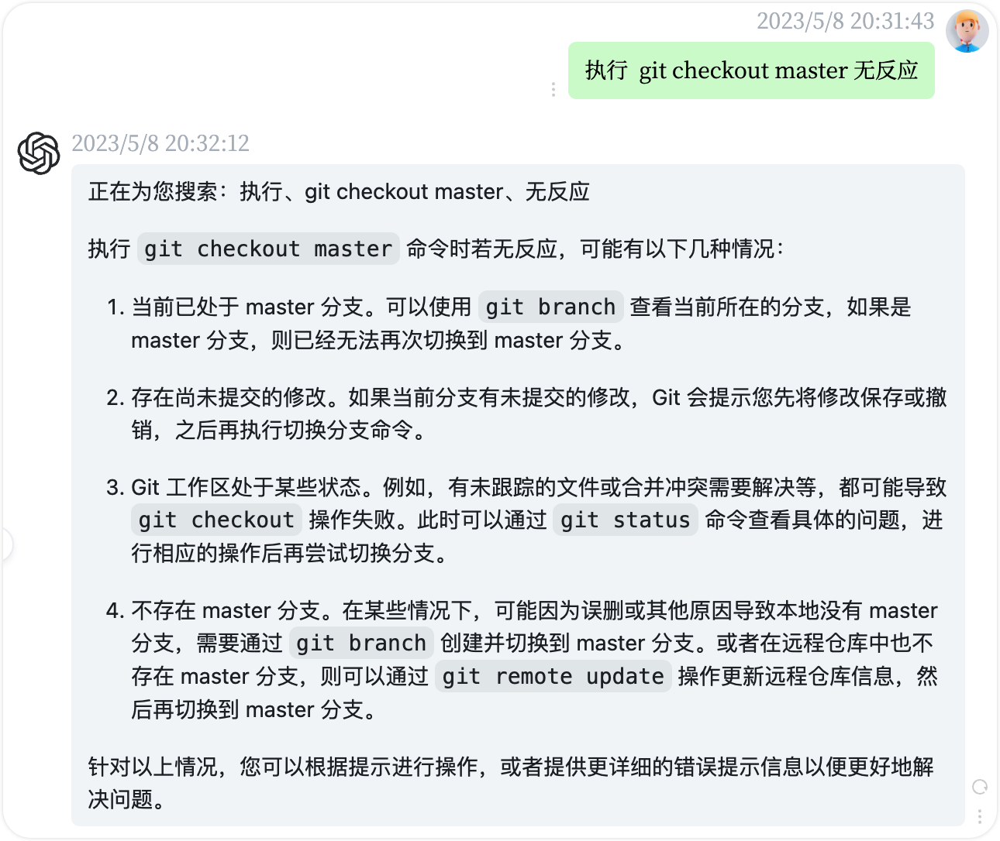
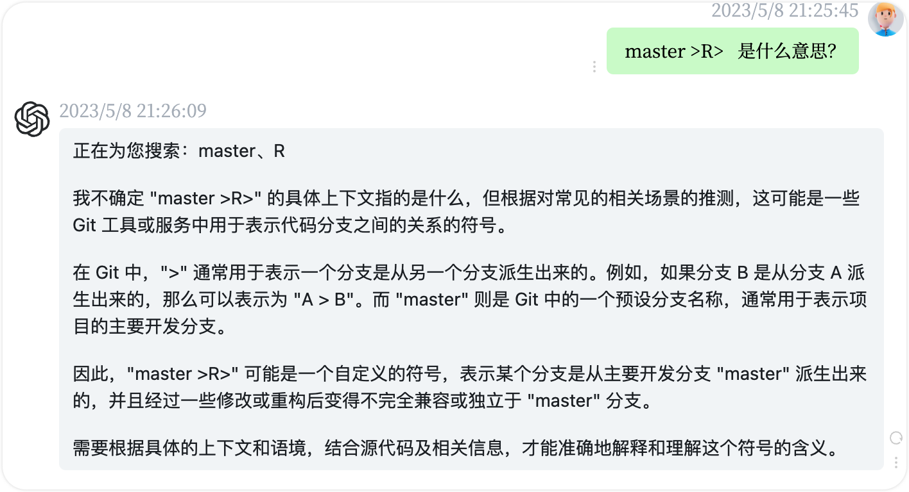
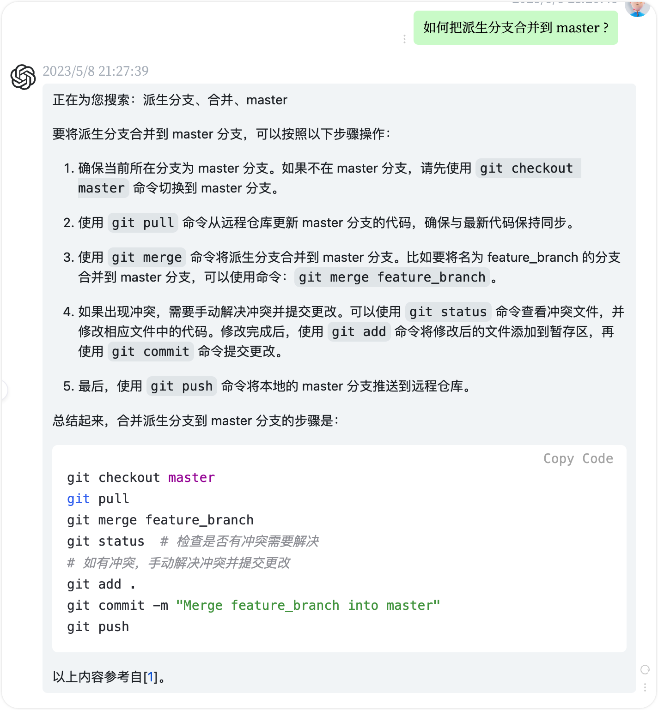
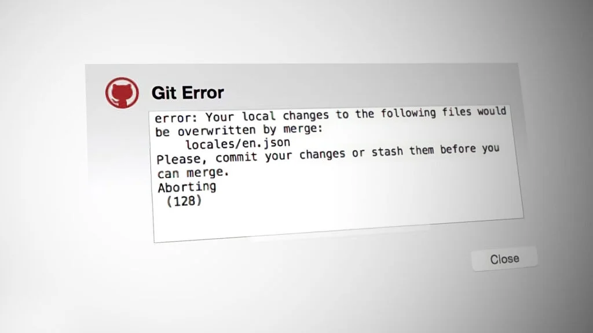

# Github

## New Words

- **ambiguous `/æmˈbɪɡjuəs/` --adjective**
  
  ```css
  ├── adj
  │   ├── (1) something that is ambiguous is unclear, confusing, or not certain, 
  │   │    especially because it can be understood in more than one way. 模棱两可的; 不明确的
  │   │   ├── OPP(opposite`/'ɒpəzɪt/`) unambiguous: 
  │   │   ├── The language in the Minister’s statement is highly ambiguous.部长的声明措辞很含糊。
  │   │   ├── His role in the affair is ambiguous.他在这起事件中的角色并不明确。
  │   ├── Register(说明)
  │   │   ├── In everyday English, people also use the phrase you can take something two ways instead of saying it is ambiguous: ~What she says is ambiguous.~ ➔ You can take what she says two ways. 她的话模棱两可。在日常英语中﹐人们也会用短语 you can take sth two ways 来代替ambiguous
  ```


## ▲ 在 Github 仓库中启用 Web VSCode

在当前仓库中的任何一个页面点击键盘上的 `.` 按键，直接进入 web vscode


## ▲ Git 常用命令

**基本命令见同级目录的：`../Git全栈开发使用指南/readme.md`**

1. 初始化仓库
2. 配置
3. 增加/删除文件
4. 代码提交
5. 分支
6. 标签
7. 查看信息
8. 远程同步
9. 撤销

**详细命令讲解见同级目录的:**

- `../《Pro-Git》/01-起步.md`
- `../《Pro-Git》/02-Git基础.md`

**简要命令：**、

```sh
$ git push origin master
```

省略了 `<dst>` 等价于

```sh
$ git push origin master:master
```

其中 `origin` 指定了你要 `push` 到哪个 `remote`. 一般形式为:

```sh
$ git push origin <src>:<dst>
```

冒号前面表示 本地分支(local branch) 的名字，冒号后表示 远程仓库(remote repository) 下 branch 的名字。
注意，如果省略了 `<dst>`, git 会认为你想 push 到 remote repository 下和 local branch 相同名字的 branch.

```sh
# 刷新远程分支列表
$ git remote update origin --prune
```

## ▲ 分支切换

要切换到一个已存在的分支，你需要使用 `git checkout` 命令，例如从一个分支切换到 master 分支：`git checkout master`









> 上图的参考[1] ： https://git-scm.com/book/zh/v2 （注：直接参考的 git pro 哈哈哈哈）


## ▲ VSCode-git 中的 U, M 和 D 文件标记含义

- **M (modified):** 你已经在 github 中添加过该文件，然后你对这个文件进行了修改，就会文件后标记 M
- **U (untracked):** 你在本地新建了这个文件，还未提交到 github 上，就会标记 U
- **D (delete):** 你删除了这个文件，vscode-git 会记录下这个状态


## ▲ 解决fatal: unable to connect to github.com  errno=连接超时

created: 2023.03.22

> https://www.cnblogs.com/happystudyeveryday/p/17015297.html

解决fatal: unable to connect to github.com: github.com[0: 20.205.243.166]: errno=连接超时

解决方法：输入命令

```
git config --global url.``"https://github.com"``.insteadOf git://github.com
```


## ▲ 使用 git pull 强制覆盖本地文件的方式

```sh
# 如果你不想要本地的所有修改的情况下，这条命令特别好用
# 请谨慎使用，这条命令会删除你本地仓库的所有内容，如果当前内容还没有同步到远程仓库的话
git fetch --all
git reset --hard origin/master
git pull origin master
```


## ▲ 删除本地 Git 仓库中的某个提交（commit）

如果要删除（/撤销）本地 Git 仓库中的 commit 提交，有下面 3 种方式：

**(1) 回到上一个版本：删除工作区的代码，撤销 commit 和 `git add .`，回到上一次 commit 的状态。**

```sh
git reset --hard HEAD~1
```

其中，`HEAD~1`表示将会重置到最近的前一个提交。如果想要重置到更早的提交，请将数字 1 更改为相应的值。

需要注意的是，这个命令将会永久性地删除提交，并清除该提交及其后的所有更改。请确保在执行此操作之前进行备份，并且谨慎使用该命令。

**(2) 回到上一个版本：不删除本地工作区改动的代码，只撤销最近的 commit，不撤销 `git add .`**

```sh
git reset --soft HEAD~1
```

它将回滚到最近的一次提交，并将它们作为更改保留在本地代码库中。这意味着您可以修改或添加新的文件，并重新提交它们。

**(3) 回到上一个版本：不删除工作区改动的代码，撤销 commit 和 `git add .`**

```
git reset --mixed HEAD~1
```


## ▲ 推送代码报错：Updated were rejected because a pushed branch tip is behind its remote counterpart.

```
To github.com:W1033/English-Notes.git
 ! [rejected]        master -> master (non-fast-forward)
error: failed to push some refs to 'github.com:W1033/English-Notes.git'
hint: Updates were rejected because a pushed branch tip is behind its remote
hint: counterpart(副本). Check out this branch and integrate(整合) the remote changes
hint: (e.g. 'git pull ...') before pushing again.
hint: See the 'Note about fast-forwards' in 'git push --help' for details.
```

这个错误在 StackOverflow 上最高赞的回答是这样的:

> 原问答：https://stackoverflow.com/questions/39399804/updates-were-rejected-because-the-tip-of-your-current-branch-is-behind-its-remot
> 
> The `-f` **is** actually required because of the rebase. Whenever you do a rebase you would need to do a force push because the remote branch cannot be fast-forwarded to your commit. You'd **always** want to make sure that you do a pull before pushing, but if you don't like to force push to master or dev for that matter, you can create a new branch to push to and then merge or make a PR.
> 
> (事实上，由于 rebase 的缘故，需要 `-f`。每当你做 rebase 时，你需要做一个强制推送，因为远程分支不能快速转到你的提交。你总是想确保在推送之前做一次拉取，但如果你不喜欢强制推送到 master 或 dev ，你可以创建一个新的分支来推送，然后合并或做一个PR。)

在发生这个错误之前，我确实 merge 了拉取远程仓库产生的 conflict，按照上面的回答，只需要使用 `-f` 强制推送即可：`git push -f origin master`


## ▲ Pull 代码报错：Error "Fatal: Not possible to fast-forward, aborting"

*Added: 2023.05.02*

> 笔记来源：https://stackoverflow.com/questions/13106179/error-fatal-not-possible-to-fast-forward-aborting

**Disclaimer**: these commands will bring changes from the remote branch into yours.
免责声明：这些命令会将远程分支的更改带到您的分支中。

`git pull --rebase`. Unlike the other solution, you don't need to know the name of your destination branch.
`git pull --rebase` 。与其他解决方案不同，您不需要知道目标分支的名称。

If your upstream branch is not set, try `git pull origin <branch> --rebase` (credit to @Rick in the comments)
如果您的上游分支未设置，请尝试 `git pull origin <branch> --rebase` （在评论中归功于@Rick）

<p style="border-left:4px solid red; padding:10px 15px; background-color:#feeeee;">Annotation: 当日我使用这行代码解决了这个报错的问题，我的情况是：我先修改了本地仓库的文件，然后执行 add 和 commit 之后再 pull 的时候报上面的错误，上面说的 if your upstream branch is not set 是什么意思我也没有理解，一般情况下我也不太敢 rebase 代码，害怕把本地的改动给 rebase 没有了，但是执行完上面的代码之后，本地的改动还在。具体的原因估计也只能等学些 Pro git 才能搞明白了。</p>

To set this option globally, use `git config --global pull.rebase true` (credit to @Artur Mustafin below)
要全局设置此选项，请使用 `git config --global pull.rebase true` （以下归功于@Artur Mustafin）


## ▲ 使用 git checkout master 切换分支报如下错误：

pathspec: Path specification

Explanation(说明)： 下面的问题出在当晚我把 cct-files 仓库删除重新创建后，默认创建的分支是 main(注: 实际上默认创建的一直都是 main, 但我远程仓库的默认分支是 master) ，我在本地执行完 `git init` 和 `git remote add origin url` 后，使用 git checkout master 想切换到 master 分支，以前都这样操作都可以正常切换过去没，但今天报下面的错误，具体原因不知道为什么，我想有可能是因为当前 cct-files 仓库内有 git LFS 大文件或者当前仓库的文件太多（> 1G），但是具体是什么原因不知道，当然也不排除下面 chatGPT 说的，需要使用 -b 来创建 master 分支，不管怎么说下面的回答是可以解决问题的。


## ▲ 拉取代码报错：Local changes to following files will be overwritten

> > 笔记来源：https://appuals.com/how-to-fix-git-error-your-local-changes-to-the-following-files-will-be-overwritten-by-merge/
>
> ## Fixed: Fixed: ‘Local changes to following files will be overwritten’
>
> Git Error 修复：“以下文件的本地更改将被覆盖” Git 错误
>
> 
>
> The error message “**Your local changes to the following files will be overwritten by merge**” occurs in Git version control mechanism. This error occurs if you have modified a file which also has modifications in the remote repository.
> Git版本控制机制中会出现“您对以下文件的本地更改将被合并覆盖”的错误消息。如果您修改了一个在远程仓库中也有修改的文件，则会出现此错误。
>
> This error message is avoided IF there are no uncommitted files that also have modifications in the remote repository. When experiencing this message, it is best to consult your other team members and ask for their opinion. Whether you want to merge your local changes or keep the version present in the repository, it is best to keep everyone on board.
> 如果在远程存储库中没有未提交的文件也有修改，则可以避免此错误消息。遇到此消息时，最好咨询您的其他团队成员并征求他们的意见。无论您是想合并本地更改还是将版本保留在存储库中，最好让每个人都参与进来。
>
> ### How to fix ‘Your local changes to the following files will be overwritten by merge’?
>
> 如何修复“您对以下文件的本地更改将被合并覆盖”？
>
> The resolution of this error message depends on what you want to do. You can discard your local changes and pull the ones in the repository or you can save your local changes into a stash and pull the version from the repository. It all depends on your preference.
> 此错误消息的解决方案取决于您要执行的操作。您可以放弃本地更改并拉取存储库中的更改，或者可以将本地更改保存到存储中并从存储库中拉取版本。这完全取决于您的喜好。
>
> Hence, we recommend that you consult with your team members and make sure that you all are on the **same page** before moving forward. If you commit wrongly or push the wrong version, it could affect the entire team.
> 因此，我们建议您与您的团队成员协商，并确保你们在继续前进之前都在同一页面上。如果您错误地提交或推送了错误的版本，则可能会影响整个团队。
>
> #### Method 1: Forcing a pull to overwrite local changes
>
>  方法 1：强制拉取以覆盖本地更改
>
> If you **don’t care about the changes done locally** and want to obtain the code from the repository, you can force a pull. This will overwrite all the local changes done on your computer a duplicate copy of the version in the repository will appear.
> 如果您不关心本地所做的更改并希望从存储库中获取代码，您可以强制拉取。这将覆盖在您的计算机上完成的所有本地更改，将出现存储库中版本的副本。
>
> Execute the following commands in your IDE:
> 在您的 IDE 中执行以下命令：
>
> ```sh
> git reset -- hard
> 
> git pull
> ```
>
> This will instantly destroy all your local changes so make sure that you know what you are doing and don’t need your local changes.
> 这将立即破坏您所有的本地更改，因此请确保您知道自己在做什么并且不需要本地更改。
>
> #### Method 2: Keeping both changes (local and from the repo)
>
>  方法 2：保留两个更改（本地和来自回购）
>
> If you want to keep both changes (changes done locally and changes present in the repository), you can add and commit your changes. When you pull, there will obviously be a merge conflict. Here you can use the tools in your IDE (such as Difftool and mergetool) to compare the two pieces of code and determine which changes to keep and which to remove. This is the middle way; no changes will be lost until you manually remove them.
> 如果您想保留这两项更改（本地完成的更改和存储库中存在的更改），您可以添加并提交您的更改。当你拉的时候，显然会出现合并冲突。在这里，您可以使用您的 IDE 中的工具（例如 Difftool 和 mergetool）来比较两段代码，并确定保留哪些更改以及删除哪些更改。这是中道；在您手动删除它们之前，不会丢失任何更改。
>
> ```sh
> git add $the_file_under_error
> 
> git commit
> 
> git pull
> ```
>
> When you get a merge conflict, pop those conflict resolving tools and check line by line.
> 当您遇到合并冲突时，弹出那些冲突解决工具并逐行检查。
>
> #### Method 3: Keeping both changes BUT not committing 方法 3：保留两个更改但不提交
>
> This situation happens from time to time where developers are not ready to commit because there is some partly broken code which you are debugging. Here we can stash the changes safely, pull the version from the repository, and then unstash your code.
> 这种情况时常发生，开发人员还没有准备好提交，因为您正在调试一些部分损坏的代码。在这里我们可以安全地存储更改，从存储库中提取版本，然后取消存储您的代码。
>
> ```sh
> git stash save --keep-index
> ```
>
> or
>
> ```sh
> git stash
> git pull
> 
> git stash pop
> ```
>
> If there are some conflicts after you pop the stash, you should resolve them in the usual way. You can also use the command:
> 如果弹出存储后有一些冲突，你应该以通常的方式解决它们。您还可以使用以下命令：
>
> ```sh
> git stash apply
> ```
>
> instead of pop if you are not ready to lose the stashed code due to conflicts.
> 如果您还没有准备好因冲突而丢失隐藏的代码，而不是弹出。
>
> If merge doesn’t seem like a viable option for you, consider doing a rebase. Rebasing is the process of moving or combining a sequence of commits to a new base commit. In the case of rebasing, change the code to:
> 如果合并对您来说似乎不是一个可行的选择，请考虑进行变基。变基是将一系列提交移动或组合到新的基础提交的过程。在变基的情况下，将代码更改为：
>
> ```sh
> git stash
> 
> git pull --rebase origin master
> 
> git stash pop
> ```
>
> #### Method 4: Make changes to ‘specific’ parts of your code 方法 4：更改代码的“特定”部分
>
> If you want to make changes to specific parts of the code and don’t want to replace everything, you can **commit** everything that you don’t want to overwrite and then follow method 3. You can use the following command for the changes which you want to overwrite from the version present in the repository:
> 如果您想更改代码的特定部分并且不想替换所有内容，您可以提交您不想覆盖的所有内容，然后按照方法 3。您可以使用以下命令进行更改想要从存储库中存在的版本覆盖：


## ▲ 本地仓库 commit 失败，删除 100M 大文件后，如何再次提交

Q：  我本地的一个 github 仓库添加了几个文件，使用 `git add .` 和 `git commit -m "2023.05.29 add"` 保存到本地仓库了，但是使用 `git push origin master` 时候，提示其中一个文件大于 100M 了，所以我接着从本地仓库把那个大于 100M 的文件删除了，接着我再次执行 `git add .` 和 `git commit -m "2023.05.29 02"`，然后 `git push origin master` 推送到 github，此时我提交的时候，我第一次 commit 的版本会直接跳过吗？git 在处理这种情况的原理还是什么？你能详细的给我解说一下吗？我想问下你理解了我说的问题了吗?

**chatGPT**: 是的，我理解您的问题了。在您第一次提交时，其中一个文件大于100M，因此在执行`git push origin master`时遇到问题，导致您的推送失败。接着您删除了大小超过100M的文件，并再次进行了`git add .`和`git commit -m "2023.05.29 02"`操作，然后再次执行`git push origin master`推送到 github。您现在想知道，此时第一次提交的版本是否会被跳过，以及 Git 在处理这种情况时的原理是什么。

首先，我们需要了解 Git 的工作原理。Git 是一个分布式版本控制系统，它通过对代码库副本进行管理来跟踪代码的变化。每次您对代码库进行更改时，Git 会将这些更改保存在您的本地代码库中，直到您执行`git push`命令将这些更改推送到远程存储库（如 GitHub）。

当您在第一次提交中遇到错误并尝试推送时，Git 应该已经发出了错误提示，告诉您哪个文件太大了。此时，您应该将该文件从提交中删除并使用命令

```shell
# amend `/əˈmend/` v. 修改，修正，改正。
git commit --amend
```

修改您之前的提交，而不是创建新的提交。这样做可以将您的所有更改保存在单个提交中，而不是在两个独立的提交中。

如果你想要创建一个新的提交，可以使用

```shell
git push --force 
```

命令将您的更改强制推送到远程存储库。这样做会覆盖您之前提交的版本，从而导致第一次提交被跳过。

- 提示：使用上面的 `git push --force` 报错，命令行给的提示：

    ```sh
    fatal: The current branch master has no upstream branch.      
    To push the current branch and set the remote as upstream, use
    致命错误：当前分支主分支没有上游分支。
    要推送当前分支并将远程设置为上游，请使用
    
    git push --set-upstream origin master
    ```

总之，您在 Git 中的每个提交都是一个独立的版本，Git 对于不同版本之间的处理是通过每个版本差异来进行的。如果您在制作第一次提交时遇到问题，然后删除了一个文件并创建了第二次提交，第一次提交将不再存在于代码库中，并且 Git 在处理这些提交时将忽略它。


## ▲ I am using Git. I did a pull from a remote repo and got an error message:

```md
Please enter a commit message to explain why this merge is necessary,
especially if it merges an updated upstream into a topic branch.
```

I try to type a message and press Enter but nothing happens.

How do I tell Git/Terminal I am done typing in my message?

I am using Terminal on OS X.

**Answer:**
It's not a Git error message, it's the editor as git uses your default editor.

To solve this:

1. press "i" (i for insert)
2. write your merge message
3. press "esc" (escape)
4. write ":wq" (write & quit)
5. then press enter

## ▲ src ref spec master does not match any 的解决方法

```md
error: src ref spec master does not match any.  
# 错误：源参考规范主不符合任何内容。

error: failed to push some refs to 'ssh://xxxxx.com/project.git'
```

1. Try `git show-ref` to see what refs you have. Is there a `refs/heads/master`?

> Due to the recent "Replacing master with main in GitHub" action, you may notice that there is a `refs/heads/main`. As a result, the following command may change from `git push origin HEAD:master` to `git push origin HEAD:main`

2. You can try `git push origin HEAD:master` as a more local-reference-independent solution. This explicitly states that you want to push the local ref `HEAD` to the remote ref `master` (see the [git-push ref spec](https://git-scm.com/docs/git-push#git-push-ltrefspecgt82308203) documentation).

## ▲ "Remote origin already exists" error

The error `fatal: remote origin already exists` is caused when you attempt to create a link to a remote repository called “origin” when a remote link with that name is already configured.

The solution is to update the URL of the remote repository with the name “origin” to the URL of the remote repository you want to add, instead of trying to create a new remote repository with that name.

You can do that with this command:

```shell
git remote set-url origin https://github.com/your/repository
```

## ▲ 通过命令行在本地仓库中删除远程 github 仓库中的文件/夹

前几天在 webstorm 中修改了仓库中几个文件夹, 最后提交到 github 后, 有一个
名为 `《SQL基础教程》` 的文件夹一直存在(注意: 此文件夹内部为空),
因为 github 网站不提供在线删除的功能,
所以只能通过命令行来解决, 下面贴出执行命令:

```shell
  # 打开 iTerm 进入到相对应的本地仓库
  # (1) 删除本地 git 缓存
  git rm -r --cached <filename>

  # (2) 重新 track(跟踪) 文件
  git add -A
  git commit -m '《SQL基础教程》'

  # (3) 推送到远程仓库 (确保当前代码是最新的)
  git push origin master
```

## ▲ 使用 `Git` 回退到 `Github` 的某个历史版本：

**1. 进入到项目文件夹，**

命令行中输入 `git log` 查看所有历史版本，获取 git 的某个历史版本的 commit id, (id 为 40 位的 16 进制数字，通过 SHA1 计算得到). 如果命令行窗口过小，不会一次显示完所有的历史版本，根据提示按下 return 便可以一直回退到最原始的版本。

Tip: 可以从 github 的 commits 提交记录对比找到想要的历史版本。

**1-1. 如果只想显示提交的历史版本的 commit id 号和对应的注释。可以在命令行中输入:**

`git log --pretty=oneline`     

**2. 把本地项目中的文件恢复到历史版本**

`git reset --hard id` (id 即为上面的 40 位随机字符)

执行完 `git reset --hard id` 之后当前本地项目中的内容既是历史版本中的内容了。

**3. 把当前本地得到的历史版本推到远程服务器：**

`git push -f -u origin master` (Tip: `-u` 可以省略)

如果执行完上面的输入后，命令行提示 `Everything up-to-data` 文件并没有提交，原因可能是当前文件夹并没有执行过用 git 提交代码到 github 的操作，可以重新执行下面命令:

- `git add .`
- `git commit -m "message"`
- `git push -f origin master`

## ▲git pull 和 git pull --rebase 区别理解

```sh
[root@master GitTest]# git pull
warning: Pulling without specifying how to reconcile divergent branches is discouraged. You can squelch this message by running one of the following commands sometime before your next pull:

git config pull.rebase false  # merge (the default strategy)
git config pull.rebase true   # rebase
git config pull.ff only       # fast-forward only
```

```sh
git config pull.rebase false  # merge (the default strategy)
git pull = git fetch + git merge

git config pull.rebase true   # rebase
git pull = git fetch + git rebase
```

> 参考文章：https://blog.csdn.net/TomorrowAndTuture/article/details/107677939

==待做笔记==

> 待做笔记：[详解git rebase，让你走上git大神之路](https://zhuanlan.zhihu.com/p/271677627)

## ▲ 拉取代码时报如下黄色提示：

```md
hint: Pulling without specifying how to reconcile divergent branches is
hint: discouraged. You can squelch this message by running one of the following
hint: commands sometime before your next pull:
hint: 
hint:   git config pull.rebase false  # merge (the default strategy)
hint:   git config pull.rebase true   # rebase
hint:   git config pull.ff only       # fast-forward only
hint: 
hint: You can replace "git config" with "git config --global" to set a default
hint: preference for all repositories. You can also pass --rebase, --no-rebase,
hint: or --ff-only on the command line to override the configured default per
hint: invocation.
```

> 解决方案：https://stackoverflow.com/questions/62653114/how-can-i-deal-with-this-git-warning-pulling-without-specifying-how-to-reconci

总的来说就是上面 hint 中的 `git config pull.ff only`，然后 push 时候使用 `git push -f origin master`


## ▲ 解决git clone速度太慢的问题

> 参考文章：https://segmentfault.com/a/1190000039768491

#### 1. 思路：

git clone 特别慢是因为 `github.global.ssl.fastly.net` 域名被限制了。

只要找到这个域名对应的 ip 地址，然后在 hosts 文件中加上 ip –> 域名的映射，刷新 DNS 缓存便可。

#### 2. 什么是 Hosts 文件？

一般来说，当用户在电脑浏览器里输入网址(域名)后，系统需要通过查询网络上的 DNS 服务器，才能将域名 (e.g.: https://www.google.com) 解析成对应的 IP 地址，浏览器通过 IP 地址才能找到该网站所在的服务器并进行访问。

而操作系统的 hosts 文件则是有着“类似本地 DNS 服务器”的作用，而且比网络上的 DNS 具有更高的优先级。如果你在 hosts 里面配置了某个域名和IP的对应关系 (比如 127.0.0.1 http://iplaysoft.com)，那么当你在「本机」访问 http://iplaysoft.com 时，系统首先会从 hosts 里面解析出 127.0.0.1 这个 IP，而不会再去查询网络上的 DNS 服务器。注意：hosts 文件仅对本机生效，对其他电脑和网站本身不造成任何影响。

> 更多讲述参考：https://zhuanlan.zhihu.com/p/140536871

#### 3. 实施：

在 ipaddress 网站 https://www.ipaddress.com分别搜索：

`github.global.ssl.fastly.net` 和 `github.com`  得到 2 个 IP. 

- 2022.11.09 更新：在 ipaddress  中输入 `github.global.ssl.fastly.net` 后查询的 IP 地址有 4 个了。如下：
  
  > | 🇺🇸 github.global.ssl.fastly.net | A   | 151.101.1.194   |
  > | --------------------------------- | --- | --------------- |
  > | 🇺🇸 github.global.ssl.fastly.net | A   | 151.101.65.194  |
  > | 🇺🇸 github.global.ssl.fastly.net | A   | 151.101.129.194 |
  > | 🇺🇸 github.global.ssl.fastly.net | A   | 151.101.193.194 |

**2022.05.16 添加**

起因是发现在浏览器中预览笔记内的图片都无法打开，通过 google 查到网友说把 `raw.githubusercontent.com` 的 ipaddress 内对应的 IP 添加到 hosts 中，05.16 查询对应的四个 IP 如下：

```md
# raw.githubusercontent.com resolves to 4 IPv4 addresses and 4 IPv6 addresses:

185.199.108.133
185.199.109.133
185.199.110.133
185.199.111.133
2606:50c0:8000::154
2606:50c0:8001::154
2606:50c0:8002::154
2606:50c0:8003::154
```

#### 4. 打开hosts文件

- Windows 上的 hosts 文件路径在: `C:\Windows\System32\drivers\etc`
- Linux的hosts文件路径在：`sudo vim /etc/hosts`
- Mac 中
  - 点击 "Finder (访达)" 图标打开, 然后点击屏幕上面的 "前往" --> "前往文件夹"
      输入 `/private/etc/` 点击前往按钮, 即可找到 hosts 文件夹.
      (或者: - 打开Finder，按快捷键组合 `Shift+Command+G` 查找文件,
      输入`/etc/hosts` 确认前往.)
  - 修改: 将hosts文件复制到其它位置（如桌面），之后再打开，编辑并保存后，将其拖拽回原来的文件夹，替换原文件即可。

#### 5. 在hosts文件末尾添加两行(对应上面查到的ip)

```access
# 下面更新日期是 2022.11.09

151.101.1.194 github.global-ssl.fastly.net
151.101.65.194 github.global-ssl.fastly.net
151.101.129.194 github.global-ssl.fastly.net
151.101.193.194 github.global-ssl.fastly.net

140.82.112.4 github.com

# 重点提示：不知道 sb government 对 140.82.112.4:22 做了什么限制，即使添加了 ip,也不可能提交仓库。建议打开 v2r 的全局代理模式即可提交。
```

#### 6. 保存并 更新DNS

Widows 系统的做法：打开CMD，输入 `ipconfig /flushdns`

CentOS 的做法：在终端输入 `nscd -i hosts`

MacOS 的刷新方法见这篇文章：https://www.zhihu.com/question/19679715

- Tip: MacOS 刷新 DNS 的命令真的是各种各样，给出最多的一句是 `sudo killall -HUP mDNSResponder`(OS > 10.10.4)，由于不知道到底管不管用，所以建议使用下面这种方式修改 hosts 和刷新的方式。

```md
1. 打开终端
2. 输入sudo vi /etc/hosts
3. 输入密码
4. 进入文件hosts，然后按“i”，进入编辑模式
5. 把你的host添加到最后
6. control+c推出编辑模式
7. 输入:wq，保存退出
···
```
