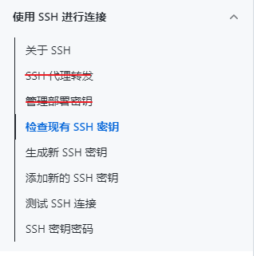

# 使用 SSH 拉取和提交代码到 GitHub


## ▲ 拉取和提交代码到 Github 步骤

<p style=" border-left: 4px solid red; padding: 10px 15px; background-color:#feeeee;">注：当前笔记是使用 SSH 拉取和提交代码到 Github，SSH 的配置方式见当前笔记的下部</p>

**1. 创建 git 仓库**
**注：** 如果是 Windows 上传代码之前请尽量把本地的 git 升级到最新版本，以防提交的时候出现莫名其妙的问题。

cd 到你的本地项目根目录下，执行 git 命令：

```sh
# 把这个目录变成Git可以管理的仓库
git init
```

**2. 将项目的所有文件添加到仓库中 **

**Notice：如果本地仓库为空，跳过第 2、3 步.**

```sh
# . 代表全部. 如果只想添加某个特定的文件，只需要把 . 换成特定的文件名即可  
git add .
```

**3. 将第二步添加的文件先提交(commit)到本地仓库**

```sh
git commit -m "注释语句"
```

**4. 去 github 上创建自己的 Repository (也可以使用现有的仓库)**

**5. 将本地的仓库关联到github上**

```sh
# url: 可以是 https 或 SSH 
# git 远程添加源
git remote add origin url
```

**5.1 如果本地仓库之前已经关联了在线仓库，重新配置的方式**

下图以 `Vue-learning` 仓库为例：


如果本地文件夹之前已经用 `git pull origin master` 拉取过在线的仓库了，

那么在本地仓库的 `.git` (默认隐藏, 点击当前窗口顶部的**查看** --> **隐藏的项目** 勾选) 文件夹内的 `config` 文件便可以看到  `url`  键后面的已有值了，

此时我们使用下面的命令更改 SSH 拉取方式

```sh
# 也可以设置为新的 https 地址
git remote set-url origin git@github.com:W1033/Vue-learning.git
```

更改完成后，可以使用如下命令查看当前的 origin 地址：

```
$ git remote -v
```

**6. 上传 github 之前，尽量先拉取(pull) 一下代码，以防远程仓库初始化时有 README.md 文档，代码如下：**

```sh
git pull origin master
```

如果下拉时提示错误 *Fatal:refusing to merge unrelated histories(拒绝合并最近的历史记录)*，

解决方法，把上面的代码改为:

```sh
# allow 前面有两个破折号(dash)
git pull origin master --allow-unrelated-histories
```

Added：2022.10.02.  下面的错误提示记录。

当天我从 github 创建了一个名为 "1033-english-docs"  的仓库，用来做英语笔记的静态文档以便在线预览，我在本地 Github-Clone 目录下新建了一个和线上同名的文件夹后里面并没有创建文件，接着我执行了第 1、2、3 步，然后执行 `git pull origin master` 后错误提示如下：

```bash
fatal: Updating an unborn branch with changes added to the index. (致命的：使用添加到索引的更改来更新未出生的分支。)
# 2023.05.02 此处笔记有待优化
```

这个问题我知道是什么原因，在 2022.10.02 之前我都是这样操作的，但为什么现在就不行了。。。

我的解决方法是：如果本地项目(/文件夹)为空，建议先略先略过第 2、3 步，先执行完第 5 步添加完 remote 仓库后 pull 远程文件，更新文件后再执行 `git add .`

**7. 最后一步上传代码到 github 远程仓库**

```sh
# 提示: github 在 2021 年把默认的 master 改为了 main
git push -u origin master
# or
git push -f origin master
```

执行完后如果没有异常就说明上传成功了，中间可能会让输入 Username 和 Password，输入 github 的账号和密码即可.

**2023.03.22 added:** 由于 github 的默认分支从 master 改为了 main, 所以在 vscode 的命令行中 `git init` 空仓库后，默认分支在 main, 使用 ssh 方式拉完笔记/代码之后，记得按照下图切换到 master 分支(注：前提是你在线仓库是 master 分支，如果在线仓库主分支是 main 了，那也无需切换了。)


## ▲ 配置 SSH 
您可以使用 Secure Shell Protocol (SSH) 连接到 GitHub ，该协议通过不安全的网络提供安全通道。

> 中文文档链接: https://docs.github.com/cn/authentication/connecting-to-github-with-ssh
> 
> 
> 
> 下面的笔记几乎就是上面这个截图的删减版。

### 1. 检查现有 SSH 密钥

#### (1) 打开终端。（windows: Git Bash）

##### (2) 输入 `ls -al ~/.ssh` 以查看是否存在现有的 SSH 密钥。

```shell
$ ls -al ~/.ssh
# Lists the files in your .ssh directory, if they exist. （列出 .ssh 目录中的文件(如果存在)） 
```

#### (3) 检查目录列表以查看是否已经有 SSH 公钥。 默认情况下，GitHub 的一个支持的公钥的文件名是以下之一。

- id_rsa.pub 
- id_ecdsa.pub
- id_ed25519.pub

提示：如果收到错误，指示 `~/.ssh` 不存在，则表明默认位置中没有现有的 SSH 密钥对。 您可以在下一步中创建新的 SSH 密钥对。

#### (4) 生成新的 SSH 密钥或上传现有密钥。

- 如果您没有受支持的公钥和私钥对，或者不希望使用任何可用的密钥对，请生成新的 SSH 密钥。
- 如果你看到列出了要用于连接到 GitHub 的现有公钥和私钥对（例如，id_rsa.pub 和 id_rsa），则可以将密钥添加到 ssh-代理 。

### 2. 生成新的 SSH 密钥并将其添加到 ssh-agent

#### 2.1 生成新的 SSH 秘钥

可在本地计算机上生成新的 SSH 密钥。 生成密钥后，可以将密钥添加到您在 GitHub.com 上的帐户，以启用通过 SSH 进行 Git 操作的身份验证。

##### (1) 打开终端。

##### (2) 粘贴下面的文本（替换为您的 GitHub 电子邮件地址）。

```shell
$ ssh-keygen -t ed25519 -C "your_email@example.com"
# ssh-keygen -t ed25519 -C "forownwang@gmail.com"
```

这将以提供的电子邮件地址为标签创建新 SSH 密钥。

```shell
> Generating public/private ALGORITHM key pair.
```

当系统提示您 "Enter a file in which to save the key（输入要保存密钥的文件）" 时，可以按 Enter 键接受默认文件位置。 请注意，如果以前创建了 SSH 密钥，则 ssh-keygen 可能会要求重写另一个密钥，在这种情况下，我们建议创建自定义命名的 SSH 密钥。 为此，请键入默认文件位置，并将 id_ssh_keyname 替换为自定义密钥名称。

```shell
> Enter a file in which to save the key (/c/Users/YOU/.ssh/id_ALGORITHM):[Press enter]
```

*Tip： 下面一步不需要，设置了密钥密码之后，每次提交代码到仓库都要输入密码，所以不需要。*

##### (3) 在提示符下，键入安全密码。

```shell
# 下面 2 个都直接按 enter 不要输入密码
> Enter passphrase (empty for no passphrase): [Type a passphrase]
> Enter same passphrase again: [Type passphrase again]
```

#### 2.2 将 SSH 密钥添加到 ssh-agent

ssh-agent： 这是一个在后台运行的程序，它将密钥加载到内存中，因此您不需要每次使用密钥时都输入密码。 最妙的是，你可以选择让服务器访问你的本地 `ssh-agent`，就像它们已经在服务器上运行一样。 这有点像要求朋友输入他们的密码，以便您可以使用他们的计算机。

##### (1) 确保 ssh-agent 正在运行。手动启动它的方式如下：

```shell
# start the ssh-agent in the background
$ eval "$(ssh-agent -s)"
> Agent pid 59566
```

根据您的环境，您可能需要使用不同的命令。 例如，在启动 ssh-agent 之前，你可能需要通过运行 sudo -s -H 根访问，或者可能需要使用 exec ssh-agent bash 或 exec ssh-agent zsh 运行 ssh-agent。

##### (2) 如果你使用的是 macOS Sierra 10.12.2 或更高版本，则需要修改 `~/.ssh/config` 文件以自动将密钥加载到 ssh-agent 中并在密钥链中存储密码。

- 首先，检查你的 `~/.ssh/config` 文件是否在默认位置。

```shell
$ open ~/.ssh/config
> The file /Users/YOU/.ssh/config does not exist.
```

- 如果文件不存在，请创建该文件。

```shell
$ touch ~/.ssh/config
```

- 打开你的 `~/.ssh/config` 文件，然后修改文件以包含以下行。 如果您的 SSH 密钥文件与示例代码具有不同的名称或路径，请修改文件名或路径以匹配您当前的设置。

```
Host github.com
AddKeysToAgent yes
~~UseKeychain yes~~
IdentityFile ~/.ssh/id_ed25519
```

**注意：**

- 如果你选择不向密钥添加密码，应该省略 `UseKeychain` 行。

- 如果看到 `Bad configuration option: usekeychain` 错误，请在配置的 `Host *.github.com` 部分添加额外的一行。
  
  ```
    Host github.com
    IgnoreUnknown UseKeychain
  ```

##### (3) 将 SSH 私钥添加到 ssh-agent 并将密码存储在密钥链中。 如果使用其他名称创建了密钥或要添加具有其他名称的现有密钥，请将命令中的 id_ed25519 替换为私钥文件的名称。

```shell
$ ssh-add --apple-use-keychain ~/.ssh/id_ed25519
```

注意：当你将 SSH 密钥添加到 ssh-agent 时，`--apple-use-keychain` 选项会将密码存储在你的密钥链中。 如果选择不向密钥添加密码，请运行命令，而不使用 `--apple-use-keychain` 选项。

选项 `--apple-use-keychain` 位于 Apple 的 `ssh-add` 标准版本中。 在 Monterey (12.0) 之前的 MacOS 版本中， `--apple-use-keychain` 和 `--apple-load-keychain` 标志分别使用语法 `-K` 和 `-A`。

如果您没有安装 Apple 的 `ssh-add` 标准版本，可能会收到错误消息。 有关详细信息，请参阅“[错误：ssh-add：非法选项 -- K](https://docs.github.com/zh/articles/error-ssh-add-illegal-option-k)”。

##### (4) 将 SSH 密钥添加到 GitHub 上的帐户

(1) 将 SSH 公钥复制到剪贴板。
如果您的 SSH 公钥文件与示例代码不同，请修改文件名以匹配您当前的设置。 在复制密钥时，请勿添加任何新行或空格。

```shell
$ pbcopy < ~/.ssh/id_ed25519.pub
# Copies the contents of the id_ed25519.pub file to your clipboard
```

提示：如果 `pbcopy` 不起作用，你可以找到隐藏的 `.ssh` 文件夹，在你最喜欢的文本编辑器中打开该文件，并将其复制到剪贴板。

(2) 在任何页面的右上角，单击个人资料照片，然后单击“设置 settings”。

(2) 在边栏的“访问”部分中，单击 “SSH 和 GPG 密钥”。

(3) 单击“新建 SSH 密钥”或“添加 SSH 密钥 (New SSH key)” 。

(4) 在 "Title"（标题）字段中，为新密钥添加描述性标签。 例如，如果使用的是个人笔记本电脑，则可以将此密钥称为“个人笔记本电脑”。

(5) 选择密钥类型（身份验证或签名）。 有关提交签名的详细信息，请参阅“[关于提交签名验证](https://docs.github.com/zh/authentication/managing-commit-signature-verification/about-commit-signature-verification)”。

(6) 将公钥粘贴到“密钥”字段。


(7) 单击“添加 SSH 密钥 (Add SSH key)”。

(8) 如果出现提示，请确认你的帐户是否拥有 GitHub 访问权限。 有关详细信息，请参阅“[Sudo 模式](https://docs.github.com/zh/authentication/keeping-your-account-and-data-secure/sudo-mode)”。

#### 4. 测试 SSH 连接

> https://docs.github.com/cn/authentication/connecting-to-github-with-ssh/testing-your-ssh-connection

众所周知在 clone GitHub 仓库时可以使用 HTTPS 或者 SSH 进行 clone，而 SSH 却没有 HTTPS 的网络连接问题，所以可以将 push/pull 的连接方式由 HTTPS 改为 SSH。

> 要求：你需要提前生成 SSH 公私钥对，并将公钥添加到你的 GitHub 账户中。关于这一部分的详细信息，请参阅 [Connecting to GitHub with SSH](https://docs.github.com/en/github/authenticating-to-github/connecting-to-github-with-ssh)。

进入仓库对应目录，执行如下命令：

```
$ git remote set-url origin git@github.com:xxx/xxx.git
```

更改完成后，可以使用如下命令查看当前的 origin 地址：

```
$ git remote -v
```
