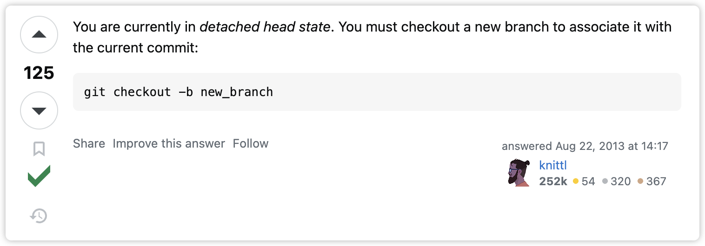
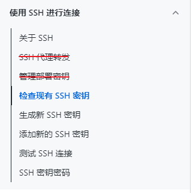

# 使用 SSH 方式拉取和提交代码到 GitHub


<p style=" border-left: 4px solid red; padding: 10px 15px; background-color:#feeeee;">注：如果是 Windows 上传代码之前请尽量把本地的 git 升级到最新版本，以防提交的时候出现莫名其妙的问题。</p>


<p style="background-color:#f9e2d2; padding:10px 15px;"><strong style="color:#dd5a2b;">备注：</strong>第一部分笔记使用的 SSH 拉取和提交代码到 Github，SSH 的配置方式见当前笔记的下部。</p>


## ▲ 拉取和提交文档到 GitHub 在线仓库

首先在 www. github.com 创建一个 CCT-FILES 的 公共/私人 仓库， 创建完之后在本地计算机拉取和提交文档到在线仓库。

**Reminder:** 此部分的笔记架构来源 GitHub 在线仓库创建完毕之后给的快速启动 (Quick up)。


> **Quick setup** — if you’ve done this kind of thing before
>
> Get started by [creating a new file](https://github.com/W1033/CCT-FILES/new/master) or [uploading an existing file](https://github.com/W1033/CCT-FILES/upload). We recommend every repository include a [README](https://github.com/W1033/CCT-FILES/new/master?readme=1), [LICENSE](https://github.com/W1033/CCT-FILES/new/master?filename=LICENSE.md), and [.gitignore](https://github.com/W1033/CCT-FILES/new/master?filename=.gitignore).
>
> 
>
> ### Create a new repository on the command line (在本地命令行创建一个新仓库)
>
> ```shell
> 前提：我们先在本地磁盘创建一个 CCT-FILES 文件夹，然后在当前文件夹内打开 Terminal 命令行，或者在 vscode 中打开命令行。
> 
> # - 整个命令的含义是：把字符串 "# CCT-FILES" 追加到名为 README.md 文件的末尾。如果该文件不存在，则会自动创建一个新文件。
> #    + `echo` 是一个命令，用于输出指定的字符串。
> #    + `>>` 是输出重定向符号，用于将输出内容追加到指定文件的末尾。
> #    + `README.md` 是一个文件名，表示要追加内容的目标文件。
> #    + `"# CCT-FILES"` 是要追加到文件末尾的字符串。 
> echo "# CCT-FILES" >> README.md
> 
> # - 把当前文档目录变成 Git 可以管理的仓库
> git init
> 
> # - . 代表全部. 如果只想添加某个特定的文件(e.g. README.md)，只需要把 . 换成特定的文件名即可 
> git add .
> 
> # - 将上一步添加的文件先提交(commit)到本地仓库
> git commit -m "first commit"
> 
> # - 将当前分支重命名为 master。-M 选项用于强制执行（即使有重名的分支存在），并且会更新任何其他参考
> #  （如其他分支和跟踪分支）来使用新名称。这个命令通常用于将默认分支从 `main` 改为 `master`。 
> # - 更多 git branch 命令详解见当前仓库：Git\《Pro-Git》\03-分支\readme.md
> # - 注：一般我们在本地创建完仓库之后，默认就在 main 分支，这一步就是从 main 分支切换到 master。
> git branch -M master
> 
> # - git remote add origin url
> #	+ remote add origin: 远程添加源
> #	+ url: 可以是 https 或 SSH 
> # - 下面命令行的 url 是 SSH，SSH 的配置见当前笔记的下半部分。
> git remote add origin url
> 
> git push -u origin master
> ```
>
> > Added: 2023.08.13
> >
> > 如果在本地 00_GITHUB-CLONE  文件夹下直接创建了一个 "Node.js" 的文件夹，直接拉去远程 Node.js 仓库，但是并没有在当前本地 Node.js 文件夹中创建 `readme.md` 文档，那么正确的拉取远程仓库的方式为：
> >
> > ```shell 
> > git init
> > 
> > git branch -M master
> > 
> > # remote add origin 远程添加 origin
> > git remote add origin git@github.com:W1033/Node.js.git
> > 
> > git pull origin master
> > ```
> >
> > 注意：不能使用 `git add .` 和 `git commit -m "xxx"` ，如果先提交了空白到本地，那么在下面使用 `git pull origin master` 拉取远程代码时就会报如下的错误：
> > ```
> > fatal: Updating an unborn branch with changes added to the index.
> > 致命错误：将更改添加到索引中的未出生分支进行更新。
> > ```
> >
>
> > Added: 2024.01.15
> >
> > 关于上面 *Added: 2023.08.13* 遇到的错误。
> >
> > 原因描述：我使用公司 M3 mbp 执行上面第二行 `git branch -M master` 命令时，遇到如下的错误
> >
> > ```sh
> > error: refname refs/heads/master not found
> > fatal: Branch rename failed
> > ```
> >
> > 解决方法如下：使用 
> >
> > ```sh
> > # 新建一个分支，并切换到该分支
> > $ git checkout -b [branch]
> > ```
> >
> > 下图来自：https://stackoverflow.com/questions/18382986/git-rename-local-branch-failed
> > 


> ### Push an existing repository from the command line (从本地命令行推送一个已有仓库)
>
> ```shell
>git remote add origin url
> git branch -M master
>git push -u origin master
> ```
>
> 如果本地文件夹之前已经用 `git pull origin master` 拉取过在线的仓库了，
> 
> 那么在本地仓库的 `.git` (默认隐藏, 点击当前窗口顶部的**查看** --> **隐藏的项目** 勾选) 文件夹内的 `config` 文件便可以看到  `url`  键后面的已有值了，
> 
> 此时我们使用下面的命令更改 SSH 拉取方式
> 
> ```sh
> # 也可以设置为新的 https 地址
> git remote set-url origin git@github.com:W1033/Vue-learning.git
> ```
> 
> 更改完成后，可以使用如下命令查看当前的 origin 地址：
> 
> ```shell
> $ git remote -v
> ```
> 
> 
> 
> ### Import code from another repository
> 
> You can initialize this repository with code from a Subversion, Mercurial, or TFS project.
> 
> 

## ▲ 配置 SSH

您可以使用 Secure Shell Protocol (SSH) 连接到 GitHub ，该协议通过不安全的网络提供安全通道。

> 中文文档链接: https://docs.github.com/cn/authentication/connecting-to-github-with-ssh
> 
> 
> 
> 下面的笔记几乎就是上面这个截图的删减版。

### 1. 检查现有 SSH 密钥

#### (1) 打开终端。（windows: Git Bash）

##### (2) 输入 `ls -al ~/.ssh` 以查看是否存在现有的 SSH 密钥。

```shell
$ ls -al ~/.ssh
# Lists the files in your .ssh directory, if they exist. （列出 .ssh 目录中的文件(如果存在)） 
```

#### (3) 检查目录列表以查看是否已经有 SSH 公钥。 默认情况下，GitHub 的一个支持的公钥的文件名是以下之一。

- id_rsa.pub 
- id_ecdsa.pub
- id_ed25519.pub

提示：如果收到错误，指示 `~/.ssh` 不存在，则表明默认位置中没有现有的 SSH 密钥对。 您可以在下一步中创建新的 SSH 密钥对。

#### (4) 生成新的 SSH 密钥或上传现有密钥。

- 如果您没有受支持的公钥和私钥对，或者不希望使用任何可用的密钥对，请生成新的 SSH 密钥。
- 如果你看到列出了要用于连接到 GitHub 的现有公钥和私钥对（例如，id_rsa.pub 和 id_rsa），则可以将密钥添加到 ssh-代理 。

### 2. 生成新的 SSH 密钥并将其添加到 ssh-agent

#### 2.1 生成新的 SSH 秘钥

可在本地计算机上生成新的 SSH 密钥。 生成密钥后，可以将密钥添加到您在 GitHub.com 上的帐户，以启用通过 SSH 进行 Git 操作的身份验证。

##### (1) 打开终端。

##### (2) 粘贴下面的文本（替换为您的 GitHub 电子邮件地址）。

```shell
$ ssh-keygen -t ed25519 -C "your_email@example.com"
# ssh-keygen -t ed25519 -C "forownwang@gmail.com"
```

这将以提供的电子邮件地址为标签创建新 SSH 密钥。

```shell
> Generating public/private ALGORITHM key pair.
```

当系统提示您 "Enter a file in which to save the key（输入要保存密钥的文件）" 时，可以按 Enter 键接受默认文件位置。 请注意，如果以前创建了 SSH 密钥，则 ssh-keygen 可能会要求重写另一个密钥，在这种情况下，我们建议创建自定义命名的 SSH 密钥。 为此，请键入默认文件位置，并将 id_ssh_keyname 替换为自定义密钥名称。

```shell
> Enter a file in which to save the key (/c/Users/YOU/.ssh/id_ALGORITHM):[Press enter]
```

*Tip： 下面一步不需要，设置了密钥密码之后，每次提交代码到仓库都要输入密码，所以不需要。*

##### (3) 在提示符下，键入安全密码。

```shell
# 下面 2 个都直接按 enter 不要输入密码
> Enter passphrase (empty for no passphrase): [Type a passphrase]
> Enter same passphrase again: [Type passphrase again]
```

#### 2.2 将 SSH 密钥添加到 ssh-agent

ssh-agent： 这是一个在后台运行的程序，它将密钥加载到内存中，因此您不需要每次使用密钥时都输入密码。 最妙的是，你可以选择让服务器访问你的本地 `ssh-agent`，就像它们已经在服务器上运行一样。 这有点像要求朋友输入他们的密码，以便您可以使用他们的计算机。

##### (1) 确保 ssh-agent 正在运行。手动启动它的方式如下：

```shell
# start the ssh-agent in the background
$ eval "$(ssh-agent -s)"
> Agent pid 59566
```

根据您的环境，您可能需要使用不同的命令。 例如，在启动 ssh-agent 之前，你可能需要通过运行 sudo -s -H 根访问，或者可能需要使用 exec ssh-agent bash 或 exec ssh-agent zsh 运行 ssh-agent。

##### (2) 如果你使用的是 macOS Sierra 10.12.2 或更高版本，则需要修改 `~/.ssh/config` 文件以自动将密钥加载到 ssh-agent 中并在密钥链中存储密码。

- 首先，检查你的 `~/.ssh/config` 文件是否在默认位置。

```shell
$ open ~/.ssh/config
> The file /Users/YOU/.ssh/config does not exist.
```

- 如果文件不存在，请创建该文件。

```shell
$ touch ~/.ssh/config
```

- 打开你的 `~/.ssh/config` 文件，然后修改文件以包含以下行。 如果您的 SSH 密钥文件与示例代码具有不同的名称或路径，请修改文件名或路径以匹配您当前的设置。

```
Host github.com
AddKeysToAgent yes
~~UseKeychain yes~~
IdentityFile ~/.ssh/id_ed25519
```

**注意：**

- 如果你选择不向密钥添加密码，应该省略 `UseKeychain` 行。(注: 如果执行下面 (3) 将 SSH 私钥添加到 ssh-agent ...，那 UseKeychain yes 就要取消注释）

- 如果看到 `Bad configuration option: usekeychain` 错误，请在配置的 `Host *.github.com` 部分添加额外的一行。
  
  ```
    Host github.com
    IgnoreUnknown UseKeychain
  ```

##### (3) 将 SSH 私钥添加到 ssh-agent 并将密码存储在密钥链中。 如果使用其他名称创建了密钥或要添加具有其他名称的现有密钥，请将命令中的 id_ed25519 替换为私钥文件的名称。

```shell
$ ssh-add --apple-use-keychain ~/.ssh/id_ed25519
```

注意：当你将 SSH 密钥添加到 ssh-agent 时，`--apple-use-keychain` 选项会将密码存储在你的密钥链中。 如果选择不向密钥添加密码，请运行命令，而不使用 `--apple-use-keychain` 选项。

选项 `--apple-use-keychain` 位于 Apple 的 `ssh-add` 标准版本中。 在 Monterey (12.0) 之前的 MacOS 版本中， `--apple-use-keychain` 和 `--apple-load-keychain` 标志分别使用语法 `-K` 和 `-A`。

如果您没有安装 Apple 的 `ssh-add` 标准版本，可能会收到错误消息。 有关详细信息，请参阅“[错误：ssh-add：非法选项 -- K](https://docs.github.com/zh/articles/error-ssh-add-illegal-option-k)”。

##### (4) 将 SSH 密钥添加到 GitHub 上的帐户

(1) 将 SSH 公钥复制到剪贴板。
如果您的 SSH 公钥文件与示例代码不同，请修改文件名以匹配您当前的设置。 在复制密钥时，请勿添加任何新行或空格。

```shell
$ pbcopy < ~/.ssh/id_ed25519.pub
# Copies the contents of the id_ed25519.pub file to your clipboard
```

提示：如果 `pbcopy` 不起作用，你可以找到隐藏的 `.ssh` 文件夹，在你最喜欢的文本编辑器中打开该文件，并将其复制到剪贴板。

(2) 在任何页面的右上角，单击个人资料照片，然后单击“设置 settings”。

(2) 在边栏的“访问”部分中，单击 “SSH 和 GPG 密钥”。

(3) 单击“新建 SSH 密钥”或“添加 SSH 密钥 (New SSH key)” 。

(4) 在 "Title"（标题）字段中，为新密钥添加描述性标签。 例如，如果使用的是个人笔记本电脑，则可以将此密钥称为“个人笔记本电脑”。

(5) 选择密钥类型（身份验证或签名）。 有关提交签名的详细信息，请参阅“[关于提交签名验证](https://docs.github.com/zh/authentication/managing-commit-signature-verification/about-commit-signature-verification)”。

(6) 将公钥粘贴到“密钥”字段。


(7) 单击“添加 SSH 密钥 (Add SSH key)”。

(8) 如果出现提示，请确认你的帐户是否拥有 GitHub 访问权限。 有关详细信息，请参阅“[Sudo 模式](https://docs.github.com/zh/authentication/keeping-your-account-and-data-secure/sudo-mode)”。

#### 4. 测试 SSH 连接

> https://docs.github.com/cn/authentication/connecting-to-github-with-ssh/testing-your-ssh-connection

众所周知在 clone GitHub 仓库时可以使用 HTTPS 或者 SSH 进行 clone，而 SSH 却没有 HTTPS 的网络连接问题，所以可以将 push/pull 的连接方式由 HTTPS 改为 SSH。

> 要求：你需要提前生成 SSH 公私钥对，并将公钥添加到你的 GitHub 账户中。关于这一部分的详细信息，请参阅 [Connecting to GitHub with SSH](https://docs.github.com/en/github/authenticating-to-github/connecting-to-github-with-ssh)。

进入仓库对应目录，执行如下命令：

```
$ git remote set-url origin git@github.com:xxx/xxx.git
```

更改完成后，可以使用如下命令查看当前的 origin 地址：

```
$ git remote -v
```


## ▲ 配置完 SSH 之后，拉取私人仓库报错

前提：问题出在 2024.01.12 用公司 M3 MBP 拉取私人仓库时报错（错误如下），但在拉取私人仓库之前已经配置好 SSH，并成功拉取了两个自己的公共仓库。

```md
kex_exchange_identification: Connection closed by remote host
fatal: Could not read from remote repository.

Please make sure you have the correct access rights
and the repository exists.
```

解决参考：https://github.com/orgs/community/discussions/55269#discussioncomment-5891234
