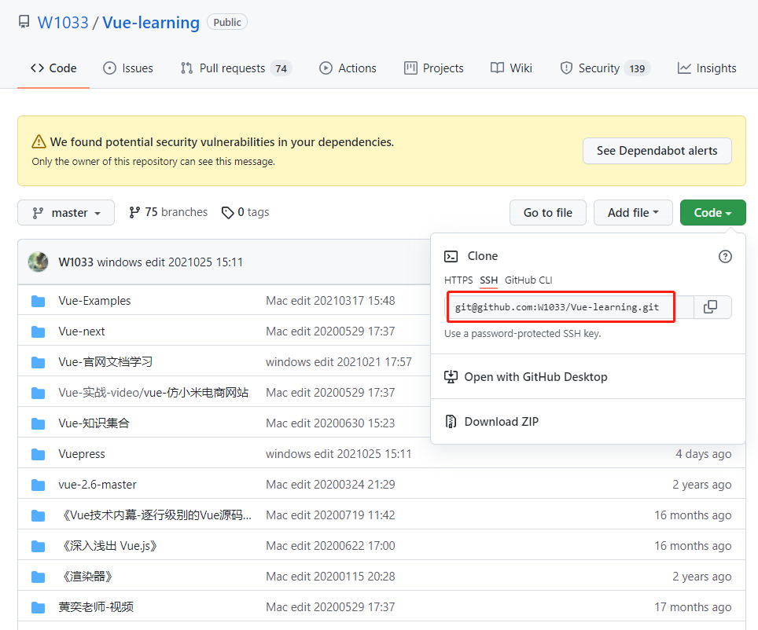

#  Github


## New Words

- **ambiguous `/æmˈbɪɡjuəs/` --adjective**
```css
├── adj
│   ├── (1) something that is ambiguous is unclear, confusing, or not certain, 
│   │    especially because it can be understood in more than one way. 模棱两可的; 不明确的
│   │   ├── OPP(opposite`/'ɒpəzɪt/`) unambiguous: 
│   │   ├── The language in the Minister’s statement is highly ambiguous.部长的声明措辞很含糊。
│   │   ├── His role in the affair is ambiguous.他在这起事件中的角色并不明确。
│   ├── Register(说明)
│   │   ├── In everyday English, people also use the phrase you can take something two ways instead of saying it is ambiguous: ~What she says is ambiguous.~ ➔ You can take what she says two ways. 她的话模棱两可。在日常英语中﹐人们也会用短语 you can take sth two ways 来代替ambiguous
```


## ▲ 在 Github 仓库中启用 Web VSCode

在当前仓库中的任何一个页面点击键盘上的 `.` 按键，直接进入 web vscode


## ▲ Git 常用命令

**基本命令见同级目录的：`../Git全栈开发使用指南/readme.md`**

1. 初始化仓库
1. 配置
1. 增加/删除文件
1. 代码提交
1. 分支
1. 标签
1. 查看信息
1. 远程同步
1. 撤销

**详细命令讲解见同级目录的:**
- `../《Pro-Git》/01-起步.md`
- `../《Pro-Git》/02-Git基础.md`

**简要命令：**、
```sh
$ git push origin master
```
省略了 `<dst>` 等价于
```sh
$ git push origin master:master
```
其中 `origin` 指定了你要 `push` 到哪个 `remote`. 一般形式为:
```sh
$ git push origin <src>:<dst>
```
冒号前面表示 本地分支(local branch) 的名字，冒号后表示 远程仓库(remote repository) 下 branch 的名字。
注意，如果省略了 `<dst>`, git 会认为你想 push 到 remote repository 下和 local branch 相同名字的 branch.

```sh
# 刷新远程分支列表
$ git remote update origin --prune
```


## ▲ VSCode-git 中的 U, M 和 D 文件标记含义 
- **M (modified):** 你已经在 github 中添加过该文件，然后你对这个文件进行了修改，就会文件后标记 M
- **U (untracked):** 你在本地新建了这个文件，还未提交到 github 上，就会标记 U
- **D (delete):** 你删除了这个文件，vscode-git 会记录下这个状态


## ▲ 提交代码到 `Github`

**1. 创建 git 仓库**
**注：** 如果是 Windows 上传代码之前请尽量把本地的 git 升级到最新版本，以防提交的时候出现莫名其妙的问题。

cd 到你的本地项目根目录下，执行 git 命令：
```sh
# 把这个目录变成Git可以管理的仓库
git init
```

**2. 将项目的所有文件添加到仓库中 **

**Notice：如果本地仓库为空，跳过第 2、3 步.**

```sh
# . 代表全部. 如果只想添加某个特定的文件，只需要把 . 换成特定的文件名即可  
git add .
```

**3. 将第二步添加的文件先提交(commit)到本地仓库**

```sh
git commit -m "注释语句"
```
**4. 去 github 上创建自己的 Repository (也可以使用现有的仓库)**

**5. 将本地的仓库关联到github上**
```sh
# url: 可以是 https 或 SSH 
git remote add origin url
```
**5.1 如果本地仓库之前已经关联了在线仓库，重新配置的方式**

下图以 `Vue-learning` 仓库为例：



如果本地文件夹之前已经用 `git pull origin master` 拉取过在线的仓库了，

那么在本地仓库的 `.git` (默认隐藏, 点击当前窗口顶部的**查看** --> **隐藏的项目** 勾选) 文件夹内的 `config` 文件便可以看到  `url`  键后面的已有值了，

此时我们使用下面的命令更改 SSH 拉取方式
```sh
# 也可以设置为新的 https 地址
git remote set-url origin git@github.com:W1033/Vue-learning.git
```
更改完成后，可以使用如下命令查看当前的 origin 地址：
```
$ git remote -v
```

**6. 上传 github 之前，尽量先拉取(pull) 一下代码，以防远程仓库初始化时有 README.md 文档，代码如下：**

```sh
git pull origin master
```
如果下拉时提示错误 *Fatal:refusing to merge unrelated histories(拒绝合并最近的历史记录)*，

解决方法，把上面的代码改为:
```sh
# allow 前面有两个破折号(dash)
git pull origin master --allow-unrelated-histories
```

Added：2022.10.02.  下面的错误提示记录。

当天我从 github 创建了一个名为 "1033-english-docs"  的仓库，用来做英语笔记的静态文档以便在线预览，我在本地 Github-Clone 目录下新建了一个和线上同名的文件夹后里面并没有创建文件，接着我执行了第 1、2、3 步，然后执行 `git pull origin master` 后错误提示如下：

```bash
fatal: Updating an unborn branch with changes added to the index. (致命的：使用添加到索引的更改来更新未出生的分支。)
```

这个问题我知道是什么原因，在 2022.10.02 之前我都是这样操作的，但为什么现在就不行了。。。

我的解决方法是：如果本地项目(/文件夹)为空，建议先略先略过第 2、3 步，先执行完第 5 步添加完 remote 仓库后 pull 远程文件，更新文件后再执行 `git add .`


**7. 最后一步上传代码到 github 远程仓库**

```sh
# 提示: github 在 2021 年把默认的 master 改为了 main
git push -u origin master
# or
git push -f origin master
```
执行完后如果没有异常就说明上传成功了，中间可能会让输入 Username 和 Password，输入 github 的账号和密码即可.


## ▲ 使用 git pull 强制覆盖本地文件的方式

```sh
# 如果你不想要本地的所有修改的情况下，这条命令特别好用
# 请谨慎使用，这条命令会删除你本地仓库的所有内容，如果当前内容还没有同步到远程仓库的话
git fetch --all
git reset --hard origin/master
git pull origin master
```


## ▲  推送代码报错：Updated were rejected because a pushed branch tip is behind its remote counterpart.

```
To github.com:W1033/English-Notes.git
 ! [rejected]        master -> master (non-fast-forward)
error: failed to push some refs to 'github.com:W1033/English-Notes.git'
hint: Updates were rejected because a pushed branch tip is behind its remote
hint: counterpart(副本). Check out this branch and integrate(整合) the remote changes
hint: (e.g. 'git pull ...') before pushing again.
hint: See the 'Note about fast-forwards' in 'git push --help' for details.
```

这个错误在 StackOverflow 上最高赞的回答是这样的:

> 原问答：https://stackoverflow.com/questions/39399804/updates-were-rejected-because-the-tip-of-your-current-branch-is-behind-its-remot
>
> The `-f` **is** actually required because of the rebase. Whenever you do a rebase you would need to do a force push because the remote branch cannot be fast-forwarded to your commit. You'd **always** want to make sure that you do a pull before pushing, but if you don't like to force push to master or dev for that matter, you can create a new branch to push to and then merge or make a PR.
>
> (事实上，由于 rebase 的缘故，需要 `-f`。每当你做 rebase 时，你需要做一个强制推送，因为远程分支不能快速转到你的提交。你总是想确保在推送之前做一次拉取，但如果你不喜欢强制推送到 master 或 dev ，你可以创建一个新的分支来推送，然后合并或做一个PR。)

在发生这个错误之前，我确实 merge 了拉取远程仓库产生的 conflict，按照上面的回答，只需要使用 `-f` 强制推送即可：`git push -f origin master`


## ▲ I am using Git. I did a pull from a remote repo and got an error message:

```md
Please enter a commit message to explain why this merge is necessary,
especially if it merges an updated upstream into a topic branch.
```
I try to type a message and press Enter but nothing happens.

How do I tell Git/Terminal I am done typing in my message?

I am using Terminal on OS X.

**Answer:**
It's not a Git error message, it's the editor as git uses your default editor.

To solve this:

1. press "i" (i for insert)
2. write your merge message
3. press "esc" (escape)
4. write ":wq" (write & quit)
5. then press enter


## ▲ 关于 `src ref spec master does not match any` 的解决方法

```md
error: src ref spec master does not match any.  
error: failed to push some refs to 'ssh://xxxxx.com/project.git'
```

1. Try `git show-ref` to see what refs you have. Is there a `refs/heads/master`?

> Due to the recent "Replacing master with main in GitHub" action, you may notice that there is a `refs/heads/main`. As a result, the following command may change from `git push origin HEAD:master` to `git push origin HEAD:main`

2. You can try `git push origin HEAD:master` as a more local-reference-independent solution. This explicitly states that you want to push the local ref `HEAD` to the remote ref `master` (see the [git-push refspec](https://git-scm.com/docs/git-push#git-push-ltrefspecgt82308203) documentation).


## ▲ "Remote origin already exists" error

The error `fatal: remote origin already exists` is caused when you attempt to create a link to a remote repository called “origin” when a remote link with that name is already configured.

The solution is to update the URL of the remote repository with the name “origin” to the URL of the remote repository you want to add, instead of trying to create a new remote repository with that name.

You can do that with this command:

```shell
git remote set-url origin https://github.com/your/repository
```


## ▲ 通过命令行在本地仓库中删除远程 github 仓库中的文件/夹

前几天在 webstorm 中修改了仓库中几个文件夹, 最后提交到 github 后, 有一个
名为 `《SQL基础教程》` 的文件夹一直存在(注意: 此文件夹内部为空),
因为 github 网站不提供在线删除的功能,
所以只能通过命令行来解决, 下面贴出执行命令:

```shell
  # 打开 iTerm 进入到相对应的本地仓库
  # (1) 删除本地 git 缓存
  git rm -r --cached <filename>

  # (2) 重新 track(跟踪) 文件
  git add -A
  git commit -m '《SQL基础教程》'

  # (3) 推送到远程仓库 (确保当前代码是最新的)
  git push origin master
```


## ▲ 使用 `Git` 回退到 `Github` 的某个历史版本：

**1. 进入到项目文件夹，**

命令行中输入 `git log` 查看所有历史版本，获取 git 的某个历史版本的 commit id, (id 为 40 位的 16 进制数字，通过 SHA1 计算得到). 如果命令行窗口过小，不会一次显示完所有的历史版本，根据提示按下 return 便可以一直回退到最原始的版本。

Tip: 可以从 github 的 commits 提交记录对比找到想要的历史版本。

**1-1. 如果只想显示提交的历史版本的 commit id 号和对应的注释。可以在命令行中输入:**

`git log --pretty=oneline`     

**2. 把本地项目中的文件恢复到历史版本**

`git reset --hard id` (id 即为上面的 40 位随机字符)

执行完 `git reset --hard id` 之后当前本地项目中的内容既是历史版本中的内容了。

**3. 把当前本地得到的历史版本推到远程服务器：**

`git push -f -u origin master` (Tip: `-u` 可以省略)

如果执行完上面的输入后，命令行提示 `Everything up-to-data` 文件并没有提交，原因可能是当前文件夹并没有执行过用 git 提交代码到 github 的操作，可以重新执行下面命令:
- `git add .`
- `git commit -m "message"`
- `git push -f origin master`


## ▲git pull 和 git pull --rebase 区别理解

```sh
[root@master GitTest]# git pull
warning: Pulling without specifying how to reconcile divergent branches is discouraged. You can squelch this message by running one of the following commands sometime before your next pull:

git config pull.rebase false  # merge (the default strategy)
git config pull.rebase true   # rebase
git config pull.ff only       # fast-forward only
```

```sh
git config pull.rebase false  # merge (the default strategy)
git pull = git fetch + git merge
 
git config pull.rebase true   # rebase
git pull = git fetch + git rebase
```

> 参考文章：https://blog.csdn.net/TomorrowAndTuture/article/details/107677939

==待做笔记==


## ▲ 使用 SSH 拉取和提交代码到 Github

SSH(Secure Shell Protocol)

> 中文文档链接: https://docs.github.com/cn/authentication/connecting-to-github-with-ssh

### 检查现有 SSH 密钥
> https://docs.github.com/cn/authentication/connecting-to-github-with-ssh/checking-for-existing-ssh-keys

### 生成新的 SSH key

> https://docs.github.com/cn/authentication/connecting-to-github-with-ssh/generating-a-new-ssh-key-and-adding-it-to-the-ssh-agent

生成的 3 个文件内容见 随笔记 备份

### 将 SSH 密钥添加到 ssh-agent

1. 在后台启动 ssh 代理。
```shell
eval "$(ssh-agent -s)"
> Agent pid 16559
```
根据您的环境，您可能需要使用不同的命令。 例如，您可能需要在启动 ssh 代理之前运行 sudo-s-H 来使用根访问，或者您可能需要使用 `exec ssh-agent bash` 或 `exec ssh-agent zsh` 来运行 ssh-agent。
2. 见在线文档
3. 见在线文档
4. 见在线文档

### 新增 SSH 密钥到 Github 账户

> https://docs.github.com/cn/authentication/connecting-to-github-with-ssh/adding-a-new-ssh-key-to-your-github-account


### 测试 SSH 连接
> https://docs.github.com/cn/authentication/connecting-to-github-with-ssh/testing-your-ssh-connection

众所周知在 clone GitHub 仓库时可以使用 HTTPS 或者 SSH 进行 clone，而 SSH 却没有 HTTPS 的网络连接问题，所以可以将 push/pull 的连接方式由 HTTPS 改为 SSH。

> 要求：你需要提前生成 SSH 公私钥对，并将公钥添加到你的 GitHub 账户中。关于这一部分的详细信息，请参阅 [Connecting to GitHub with SSH](https://docs.github.com/en/github/authenticating-to-github/connecting-to-github-with-ssh)。

进入仓库对应目录，执行如下命令：

```
$ git remote set-url origin git@github.com:xxx/xxx.git
```

更改完成后，可以使用如下命令查看当前的 origin 地址：

```
$ git remote -v
```


## ▲ 拉取代码时报如下黄色提示：

```md
hint: Pulling without specifying how to reconcile divergent branches is
hint: discouraged. You can squelch this message by running one of the following
hint: commands sometime before your next pull:
hint: 
hint:   git config pull.rebase false  # merge (the default strategy)
hint:   git config pull.rebase true   # rebase
hint:   git config pull.ff only       # fast-forward only
hint: 
hint: You can replace "git config" with "git config --global" to set a default
hint: preference for all repositories. You can also pass --rebase, --no-rebase,
hint: or --ff-only on the command line to override the configured default per
hint: invocation.
```


## ▲ 解决git clone速度太慢的问题

> 参考文章：https://segmentfault.com/a/1190000039768491

#### 1. 思路：
git clone 特别慢是因为 `github.global.ssl.fastly.net` 域名被限制了。

只要找到这个域名对应的 ip 地址，然后在 hosts 文件中加上 ip –> 域名的映射，刷新 DNS 缓存便可。


#### 2. 什么是 Hosts 文件？
一般来说，当用户在电脑浏览器里输入网址(域名)后，系统需要通过查询网络上的 DNS 服务器，才能将域名 (e.g.: https://www.google.com) 解析成对应的 IP 地址，浏览器通过 IP 地址才能找到该网站所在的服务器并进行访问。

而操作系统的 hosts 文件则是有着“类似本地 DNS 服务器”的作用，而且比网络上的 DNS 具有更高的优先级。如果你在 hosts 里面配置了某个域名和IP的对应关系 (比如 127.0.0.1 http://iplaysoft.com)，那么当你在「本机」访问 http://iplaysoft.com 时，系统首先会从 hosts 里面解析出 127.0.0.1 这个 IP，而不会再去查询网络上的 DNS 服务器。注意：hosts 文件仅对本机生效，对其他电脑和网站本身不造成任何影响。

> 更多讲述参考：https://zhuanlan.zhihu.com/p/140536871

#### 3. 实施：

在 ipaddress 网站 https://www.ipaddress.com分别搜索：

`github.global.ssl.fastly.net` 和 `github.com`  得到 2 个 IP. 

- 2022.11.09 更新：在 ipaddress  中输入 `github.global.ssl.fastly.net` 后查询的 IP 地址有 4 个了。如下：
  
  >  | 🇺🇸 github.global.ssl.fastly.net | A    | 151.101.1.194 |
  >  | ------------------------------- | ---- | -------------- |
  >  | 🇺🇸 github.global.ssl.fastly.net | A    | 151.101.65.194 |
  >  | 🇺🇸 github.global.ssl.fastly.net | A    | 151.101.129.194 |
  >  | 🇺🇸 github.global.ssl.fastly.net | A    | 151.101.193.194 |

**2022.05.16 添加**

起因是发现在浏览器中预览笔记内的图片都无法打开，通过 google 查到网友说把 `raw.githubusercontent.com` 的 ipaddress 内对应的 IP 添加到 hosts 中，05.16 查询对应的四个 IP 如下：

```md
# raw.githubusercontent.com resolves to 4 IPv4 addresses and 4 IPv6 addresses:

185.199.108.133
185.199.109.133
185.199.110.133
185.199.111.133
2606:50c0:8000::154
2606:50c0:8001::154
2606:50c0:8002::154
2606:50c0:8003::154
```


#### 4. 打开hosts文件

- Windows 上的 hosts 文件路径在: `C:\Windows\System32\drivers\etc`
- Linux的hosts文件路径在：`sudo vim /etc/hosts`
- Mac 中
    - 点击 "Finder (访达)" 图标打开, 然后点击屏幕上面的 "前往" --> "前往文件夹"
        输入 `/private/etc/` 点击前往按钮, 即可找到 hosts 文件夹.
        (或者: - 打开Finder，按快捷键组合 `Shift+Command+G` 查找文件,
        输入`/etc/hosts` 确认前往.)
    - 修改: 将hosts文件复制到其它位置（如桌面），之后再打开，编辑并保存后，将其拖拽回原来的文件夹，替换原文件即可。

#### 5. 在hosts文件末尾添加两行(对应上面查到的ip)

```access
# 下面更新日期是 2022.11.09

151.101.1.194 github.global-ssl.fastly.net
151.101.65.194 github.global-ssl.fastly.net
151.101.129.194 github.global-ssl.fastly.net
151.101.193.194 github.global-ssl.fastly.net

140.82.112.4 github.com

# 重点提示：不知道 sb government 对 140.82.112.4:22 做了什么限制，即使添加了 ip,也不可能提交仓库。建议打开 v2r 的全局代理模式即可提交。
```

#### 6. 保存并 更新DNS
Widows 系统的做法：打开CMD，输入 `ipconfig /flushdns`

CentOS 的做法：在终端输入 `nscd -i hosts`

MacOS 的刷新方法见这篇文章：https://www.zhihu.com/question/19679715

- Tip: MacOS 刷新 DNS 的命令真的是各种各样，给出最多的一句是 `sudo killall -HUP mDNSResponder`(OS > 10.10.4)，由于不知道到底管不管用，所以建议使用下面这种方式修改 hosts 和刷新的方式。

```md
1. 打开终端
2. 输入sudo vi /etc/hosts
3. 输入密码
4. 进入文件hosts，然后按“i”，进入编辑模式
5. 把你的host添加到最后
6. control+c推出编辑模式
7. 输入:wq，保存退出
···
```

