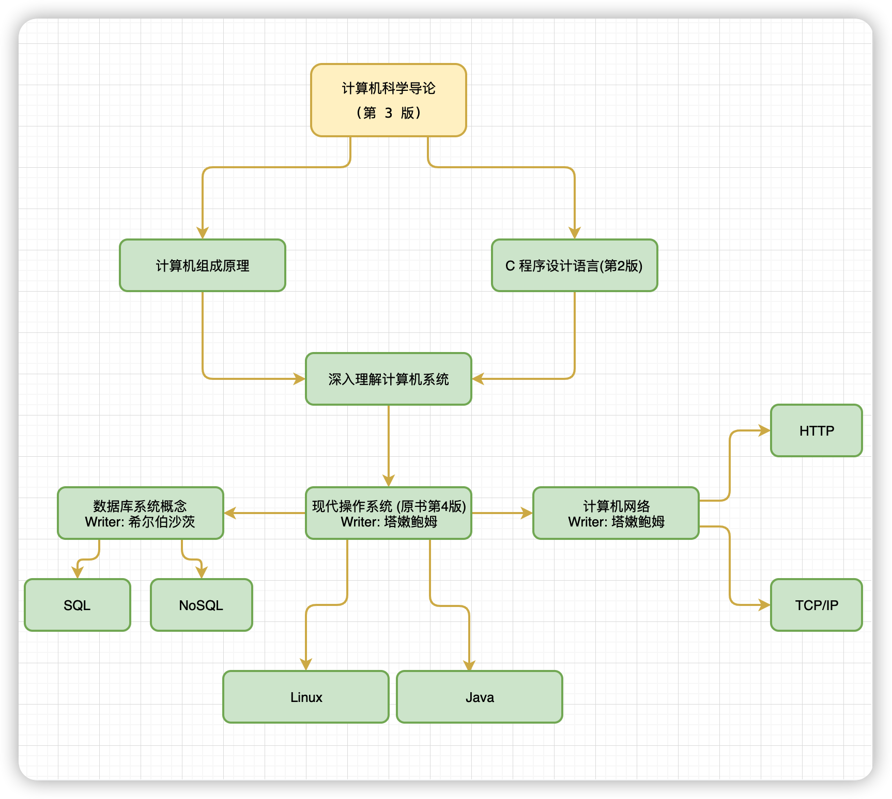
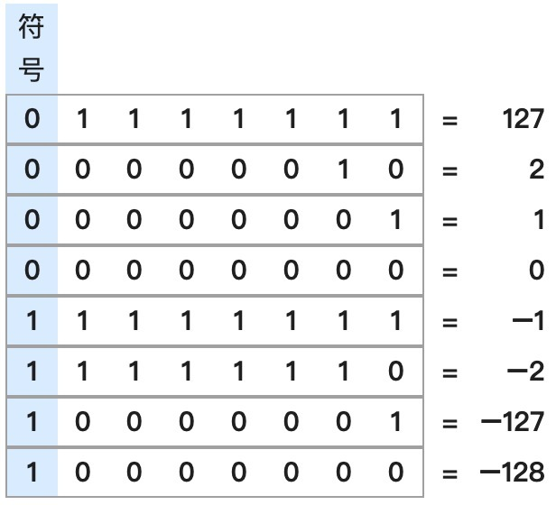

# Computer-Basics-Knowledge
计算机基础知识学习




## New Words
- **bit [bɪt] --n.(二进制) 位, 比特; 少量. --adj.很小的; 微不足道的.**
  **--vt.控制. --adv.相当; 有点儿. --v.咬(bite 的过去式和过去分词)**
    + 1Byte = 8 bit. 1字节 = 8 比特(位)
    + a bit(n) of paper. 纸片
    + come to bits(n) 破成碎片
    + a bit of land. 一小块土地.
    + He knows a little bit of everything. 他什么都知道一点点.
- **byte [baɪt] --n.[计]字节; 8位元组**
    + That is the address in memory in the heap of the first byte that
      the user typed in. 那是用户输入的第一个字节在内存中堆的地址.
    + Every byte in memory has to have an "address" for a process to
      be able to locate it. 内存中的每一个字节都必须有一个 "地址",
      以便让进程可以找到它.


1.B 

2.A 

3.C 

4.C 

5.A 

6.D 

7.B

8. A
9. D
10. B


>  https://www.educity.cn/zikao/69295.html


一、单项选择题

1. CPU中用来存放ALU运算结果的状态信息的寄存器是
- `A.程序计数器`
- B.指令寄存器
- C.通用寄存器
- D.标志寄存器

2. 在计算机内部，指令信息采用的表示形式是
- `A.二进制序列`
- B.八进制序列
- C.十进制序列
- D.十六进制序列

3. 二进制数-1101000的8位补码表示是
> 补码是一种用二进制表示有符号数的方法。正数和 0 的补码就是该数字本身。负数的补码则是将其对应正数按位取反再加 1。
- A.11101000
- B.10010111
- `C.10011000` (看过答案也是没明白怎么算出来的)
- D.10000100


> 计算机基础之位运算 | 按位取反 （待做笔记）
>
> https://blog.frytea.com/archives/424/


> 下面笔记来源：https://segmentfault.com/a/1190000021511009

### 三、原码、反码和补码

为运算方便，机器数有 3 种表示法，即原码、反码和补码。

#### 原码

原码是一种计算机中对数字的二进制定点表示法。原码表示法在数值前面增加了一位符号位（即最高位为符号位）：正数该位为 0，负数该位为 1（0 有两种表示：+0 和 -0），其余位表示数值的大小。举个例子，我们用 8 位二进制表示一个数，+12 的原码为 00001100，-12 的原码就是 10001100。

#### 反码

一个数字用原码表示是容易理解的，但是需要单独一个位来表示符号位，并且在进行加法时，计算机需要先识别某个二进制原码是正数还是负数，识别出来之后再进行相应的运算。这样效率不高，能不能让计算机在进行运算时不用去管符号位，也就是让符号位参与运算。要实现这个功能，我们就要用到反码。

反码是一种在计算机中数的机器码表示。对于单个数值（二进制的 0 和 1）而言，对其进行取反操作就是将 0 变为 1，1 变为 0。正数的反码和原码一样，负数的反码就是在原码的基础上符号位保持不变，其他位取反。

| 十进制 |   原码    |   反码    |
| :----: | :-------: | :-------: |
|   6    | 0000 0110 | 0000 0110 |
|   -3   | 1000 0011 | 1111 1100 |

下面我们来看一下，用反码直接运算会是什么情况，我们以 `6 - 3` 为例，`6 - 3` 等价于 `6 + (-3)`。

```asciidoc
6 - 3 ==> 6 + (-3)
  0000 0110 // 6(反码)
+ 1111 1100 // -3(反码)
----------------------
  0000 0010 // (反码)
  0000 0010 // 2(原码)   
```

很明显通过反码进行 `6 + (-3)` 加法运算时，输出值比预期值差了一个 1。接着我们再来看下 `1 + (-1)` 的运算结果：

```asciidoc
1 - 1 ==> 1 + (-1)
  0000 0001 // 1(反码)
+ 1111 1110 // -1(反码)
----------------------
  1111 1111 // (反码)
  1000 0000 // -0(原码)
```

由上可知 `1 + (-1)` 的运算结果为 `-0`，而我们预期的值是 `+0`。我们继续看个示例 `0 + 0`：

```asciidoc
0 + 0 ==> 0 + 0
  0000 0000 // 0(反码)
+ 0000 0000 // 0(反码)
----------------------
  0000 0000 // (反码)
  0000 0000 // 0(原码)
```

这里我们可以知道 -0 对应的原码是 `1000 0000`，而 +0 对应的原码是 `0000 0000`。虽然 -0 和 +0 代表的数值是一样的，但是在用原码和反码表示时它们是不同的。通过以上的多个示例，我们发现使用反码进行加法运算并不能保证得出正确的结果。原因是用一个字节表示数字的取值范围时，这些数字中多了一个 -0。为了解决反码出现的问题，就出现了补码。

#### 补码

补码是一种用二进制表示有符号数的方法。正数和 0 的补码就是该数字本身。负数的补码则是将其对应正数按位取反再加 1。补码系统的最大优点是可以在加法或减法处理中，不需因为数字的正负而使用不同的计算方式。**只要一种加法电路就可以处理各种有符号数加法，而且减法可以用一个数加上另一个数的补码来表示，因此只要有加法电路和补码电路即可以完成各种有符号数加法和减法，在电路设计上相当方便。**

另外，补码系统的 0 就只有一个表示方式，这和反码系统不同（在反码系统中，0 有两种表示方式），因此在判断数字是否为 0 时，只要比较一次即可。下图是一些 8 位补码系统的整数，它可表示的范围包括 -128 到 127，总共 256 个整数。



既然说补码可以解决反码在运算中遇到的问题，我们继续以 `6 + (-3)` 为例来验证一下这个结论。

| 十进制 |   原码    |   反码    |   补码    |
| :----: | :-------: | :-------: | :-------: |
|   6    | 0000 0110 | 0000 0110 | 0000 0110 |
|   -3   | 1000 0011 | 1111 1100 | 1111 1101 |

`6 + (-3)` 以补码形式的计算过程如下：

```asciidoc
6 - 3 ==> 6 + (-3)
  0000 0110 // 6(补码)
+ 1111 1101 // -3(补码)
----------------------
  0000 0011 // 3(补码)
```

很明显这时我们得到了正确的结果，那么我们再来看一下以补码形式计算 `1 - 1` 的计算过程：

```asciidoc
1 - 1 ==> 1 + (-1)
  0000 0001 // 1(补码)
+ 1111 1111 // -1(补码)
----------------------
  0000 0000 // 0(补码)
```

可以发现，补码完美解决了反码的问题，最后我们来介绍一下位移运算。


4. 字符B的AS1码为1000010，首位添加一位奇校验位组成8位编码，其表示为
- A.01000010
- B.11000010
- C.10000010
- D.10000100

5. 采用寄存器间接寻址方式的操作数存放在
- A.通用寄存器中
- B.`内存中` (本题考查指令系统-指令系统实例。**寄存器间接寻址方式的操作数存放在内存中**；寄存器**直接寻址方式的操作数在通用寄存器中**。简而言之就是，放在寄存器的不是操作数，而是操作数的地址，操作数放在内存里面。故本题选B。)
- C.硬盘中
- D.指令中

6. 采用RAM方式存取信息的存储器是
- A.硬盘
- B.光盘
- C.磁带
- D.`主存` （本题考查存储器层次结构-存储器概述。采用RAM方式存取信息的存储器是主存；磁带、硬盘、光盘为辅助存储器。存储单元都能按地址访问而且存取时间与存储单元物理位置无关的存储器，称为RAM，如半导体存储器等。现在主要作为主存、Cache、外设缓存来使用。）

7. 有一个32KB的主存储器。按字节编址需要地址线
- A.5条
- B.10条
- C.15条
- D.20条

8. 在中断控制方式的准备阶段，设置新屏蔽字的作用是
- A.暂停外设对主存的访问
- B.暂停CPU对某些中断的响应
- C.暂停CPU对一切中断的响应
- D.暂停CPU对主存的访问

9. 在DMA控制方式下，实现主存和高速外设之间的直接数据交换时，总线控制权归
- A.CPU掌控
- B.主存掌控
- C.程序员掌控
- D.DMA控制器掌控

10. 单地址指令
- A.只能对单操作数进行加工处理
- B.只能对双操作数进行加工处理
- C.既能对单操作数，也能对双操作数进行加工处理
- D.无处理双操作数的功能

非选择题部分

注意事项：用黑色字迹的签字笔或钢笔将答案写在答题纸上，不能答在试题卷上。

二、填空题：本大题共15空，每空1分，共15分。
11. 根据软件的用途，一般将软件分成系统软件和`应用`软件两大类。
12. CPU和主存储器之间通过一组总线相连，总线中有地址、三组信号线。
13. 计算机中常用的数据校险码有奇偶校验码、
14. 表示一个数值数据需要确定三个要素：进位记数制、
15. 根据指令显式给出的地址个数，指令可分为三地址指令、二地址指令、单地址指令和指令。
16. 按指令格式的复杂度来分，可分为C1SC与两种类型指令系统。
17. Intl将内部异常分为三类：分别是故障、陷阱和
18. 按存取方式分类，存储器分为随机存取存储器、存取存储器和存取存储器三类。
19. I/O 接口是介于I/O总线和___之间的硬件部分。
20. I/O 数据传送主要有三种不同的控制方式：程序直接控制、`___`控制和`___`控制


三、 名词解释题：本大题共5小题，每小题3分，共15分。
21. 数据通路
22. 控制器
23. 字长
24. 寄存器间接寻址
25. 指令译码器（ID）

四、 简答题：本大题共4小题，每小题5分，共20分。
26. 冯•诺依曼结构计算机的基本思想主要包括哪几个方面？
27. 一条指令中应该显式或隐式地给出哪些信息？
28. 通常一条指令的执行要经过哪些步骤？每条指令的执行步骤都一样？
29. SRAM 芯片和 DRAM 芯片各有哪些特点？各自用在哪些场合？

五、 计算题：本大题共3 小题，第30、31小题各6分 ,第32小题4分，共16分。
30. 假设某个频繁使用的程序 P 在机器 Ml 上运行需要 20s, Ml 的时钟频率为1GHz。设计人员想开发一台与 Ml 具有相同ISA 的新机器 M2。采用新技术可使 M2 的时钟频率增加，但同时也会使 CPI 增加。假定 P 在 M2 上执行时的时钟周期数是在 Ml 上的 2 倍 ,则 M2 的时钟频率至少达到多少才能使程序 P 在 M2 上的运行时间缩短为4s?
31. 将十进制数120转换为IEEE754的单精度（32位 ）浮点数格式，要求最后格式用十六进制数表示。注：IEEE754单精度浮点数的计数公式为（-D)^s xl.f x 2^(E-127)
32. 假定某何步总线在-个总线时钟周期内传送一个 8 字节的数据, 总线时钟频率为 50MHz,则总线带宽是多少？如果总线宽度改为128位，一个时钟周期能传送两次数据，总线时钟频率为100MHz.则总线带宽是多少？

六、 综合题：本大巍共2 小题,每小题12分，共24分。

```


## ◆ 冯·诺依曼结构计算机的基本思想主要包含那几个方面？

> 三分钟带你了解冯.诺依曼结构
>
> https://zhuanlan.zhihu.com/p/136748306


核心设计思想主要体现在如下三个方面：

- 程序、数据的最终形态都是二进制编码，程序和数据都是以二进制方式存储在存储器中的，二进制编码也是计算机能够所识别和执行的编码。（可执行二进制文件：.bin文件）
- 程序、数据和指令序列，都是事先存在主（内）存储器中，以便于计算机在工作时能够高速地从存储器中提取指令并加以分析和执行。
- 确定了计算机的五个基本组成部分：运算器、控制器、存储器、输入设备、输出设备


## 1. 计算机上常用的单位

### 1.1 数据单位
计算机中数据单位是 `bit(位/比特)`. 在计算机内部, 数据都是以二进制的形式存储和运行的.

> 二进制数据中的一个位(bit)简写为b, 音译为比特, 是计算机存储数据的最小单位. 一个二进制位只能表示0或1两种状态, 要表示更多的信息, 就要把多个位组合成一个整体, 一般以8位二进制组成一个基本单位. 

> 字节：计算机数据处理的最基本单位, 主要以字节为单位解释信息. 字节(Byte)简记为B, 规定一个字节为8位, 即1B=8bit. 每个字节由8个二进制位组成. 一般情况下, 一个ASCII码占用一个字节, 一个汉字国际码占用两个字节. 

> 字：一个字通常由一个或若干个字节组成. 字(Word)是计算机进行数据处理时, 一次存取、加工和传送的数据长度. 由于字长是计算机一次所能处理信息的实际位数, 所以, 它决定了计算机数据处理的速度, 是衡量计算机性能的一个重要指标, 字长越长, 性能越好. 

> 数据的换算关系
1Byte=8bit, 1KB=1024B, 1MB=1024KB, 1GB=1024MB. 
计算机型号不同, 其字长是不同的, 常用的字长有8、16、32和64位. 一般情况下, IBM PC/XT的字长为8位, 80286微机字长为16位, 80386/80486微机字长为32位, Pentium系列微机字长为64位. 

### 1.2 速度单位
CPU的运算速度使用的是 `MHz` 或者是 `GHz` 之类的单位. 而在网络传输上使用的是bit单位, 因此常使用的是Mbit/s.

举例: 大家常听到的 `8M/1M` 网速, 如果转换为文件容量的 `byte` 时,
其实理论上最大传输值为: 1MB/s / 125KB/s 的上传或下载速度. (tip: 下面
`### 2. xxx` 中有详细讲解.) 


## 2. `MB/S` 与 `Mbit/S` 的区别
内存的最小单位是`位 (bit)`(或称: 比特), 将 8 个位组合为一组,
称为字节(`byte`) (tip: 1byte(字节) = 8bit(比特)); 
每个字节都有唯一的地址, 字节地址从 0 开始, 第一位只能是 0 或 1.

计算机内存的常用单位是 
+ **千字节(KB)**: 1KB = 1024byte
+ **兆字节(MB)**: 1MB == 1024KB
+ **千兆字节(GB)**: 1GB = 1024MB
+ 大型磁盘驱动器使用 **兆兆字节(TB)**: 1TB = 1024GB

数据传输率的单位一般采用 `MB/S` 或 `Mbit/S`,
尤其在内部数据传输率上官方数据中更多的采用 `Mbit/S` 为单位.
此处有必要讲解一下两个单位二者之间的差异:
+ `MB/S`(mega byte 兆位) 的含义是**兆字节每秒**, `Mbit/S`
的含义是**兆比特每秒**, 前者是指每秒传输的字节数量, 后者是指每秒传输的比特位数.
`MB/S` 中的 `B` 字母是 `Byte` 的含义, Byte 是字节数, bit 是位数,
在计算机中每 **1Byte ＝ 8bit**, 是 1 : 8 的对应关系.
因此 **1MB/S = 8Mbit/S**. 

(1) 计算光纤传输的真实速度 
+ 使用光纤连接网络具有传输速度快. 衰减少等特点. 因此很多公司的网络出口都使用光纤.
  一般网络服务商声称光纤的速度为 "5M", 那么他的下载真实速度是多少那？
  
  我们来计算一下, 一般情况下, "5M" 实际上就是 5000Kbit/s(按千进位计算
  这就存在一个换算的问题. 因此电信所说的 "5M" 经过换算后就成为了
  (5000 / 8)KByte/s = 625KByte/s 这样我们平时下载速度最高就是 625KByte/s
  常常表示 625KB/S.
  
  在实际的情况中. 理论值最高为 625KB/S.
  那么还要排除网络损耗以及线路衰减等原因因此真正的下载速度可能还不到600KB/S 不过只要是550KB/S以上都算正常 

(2) 计算ADSL的真实速度ADSL是大家经常使用的上网方式.
那么电信和网通声称的“512K” ADSL 下载速度是多少那？ 
+ 换算方法为 512Kbit/s = (512/8)KByte/s = 64KByte/s,
  考虑线路等损耗实际的下载速度在 50KB/S 以上就算正常了 那么 "1MB" 呢?
  大家算算吧答案是125KByte/s 

(3) 计算内网的传输速度 
+ 1000MBPS 网卡的速度为: 1000MB/S＝1000000KByte/s =
  (1000000/8)KByte/s=125000KByte/s; 理论上 1 秒钟可以传输 125MB 的速度,
  考虑到干扰的因素每秒传输只要超过 100MB 就是正常了.
