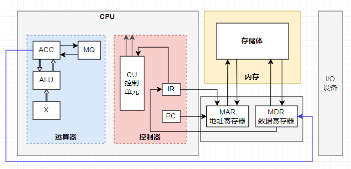

# [CPU基础知识-CPU的组成 运算器、控制器、寄存器](https://www.cnblogs.com/gnivor/p/15679241.html)

> ## 计算机组成详解（运算器、控制器、存储器、I/O部件）
>
> https://blog.csdn.net/qq_34745941/article/details/128174979
>
> 待做笔记

目录

- [0 参考资料](https://www.cnblogs.com/gnivor/p/15679241.html#0-参考资料)
- 1 运算器、控制器、寄存器
    - [1.1 控制器](https://www.cnblogs.com/gnivor/p/15679241.html#11-控制器)
    - [1.2 运算器](https://www.cnblogs.com/gnivor/p/15679241.html#12-运算器)
    - [1.3 寄存器](https://www.cnblogs.com/gnivor/p/15679241.html#13-寄存器)

## 0 参考资料

10分钟看懂CPU构造原理 https://new.qq.com/rain/a/20200511A0814P00

电脑硬件入门——基础之CPU架构解读 https://zhuanlan.zhihu.com/p/65840506

计算机硬件系统—CPU（运算器和控制器）（一） https://www.jianshu.com/p/defc60406dc1

Caffee Lake-英特尔CPU微架构 (第八代处理器) https://en.wikichip.org/wiki/intel/microarchitectures/coffee_lake

第一章 计算机系统概论 

CPU组成 https://wenku.baidu.com/view/410842cd2cc58bd63186bd6f.html

五分钟理解主存储器的基本组成结构 https://www.cnblogs.com/codevald/p/codevald2.html

CPU中的主要寄存器 https://blog.csdn.net/kwame211/article/details/77773621

## 1 运算器、控制器、寄存器

CPU内部主要由运算器、控制器、寄存器三大部分组成。

Combinator, controller, register

**运算器** 负责算术运算（+ - * / 基本运算和附加运算）和逻辑运算（包括 移位、逻辑测试或比较两个值等）。

**控制器** 负责应对所有的信息情况，调度运算器把计算做好。

**寄存器** 它们可用来暂存指令、数据和地址。既要对接控制器的命令，传达命令给运算器；还要帮运算器记录处理完或者将要处理的数据。

### 1.1 控制器

控制器由程序计数器（PC，Program Counter）、指令寄存器（IR，Instruction Register）、指令译码器（ID，Instruction Decoder）、时序产生器（Timing Generator）、操作控制器（Control Unit）组成。

- `指令寄存器IR`，是用来存放当前正在执行的的一条指令，存放的内容来自于数据寄存器（DR，Data Register）。当一条指令需要被执行时，先要把它从内存取到数据寄存器，然后再送到指令寄存器IR中。
- `指令译码器ID`，在计算机执行一条指定的指令时，必须首先分析这条指令的操作码是什么，以决定操作的性质和方法，然后控制计算机的其他各部件协同完成指令表达的功能，这中间的分析工作就是指令译码器ID完成的。
- `程序计数器PC`，用来存放下一条要执行指令的地址，它与存储器（内存）之间有一条直接通路。执行指令时，首先需要根据程序计数器PC中存放的指令地址，将指令由内存取到指令寄存器IR，完成“取指令”的操作。程序计数器PC本身具有自动加1的功能，可以自动给出下一条指令的地址，如此循环，执行每一条指令。
- `时序产生器`，类似于“时间作息表”，给计算机各部分提供工作所需的时间标志，一般是利用定时脉冲的顺序和不同的脉冲间隔来实现。
- `操作控制器`，根据指令所需完成的操作和信号，发出各种微操作命令序列，用以控制所有被控对象，完成指令的执行。

整个控制器的运行逻辑是先按照`程序计数器`所指出的指令地址，从内存中取出一条指令到`指令寄存器IR`，然后`指令译码器ID`对指令进行分析，之后`操作控制器`根据指令的功能向有关部件发出控制命令，执行控制指令的操作。完成操作之后，`程序计数器`加1，再重复执行上述操作。

### 1.2 运算器

运算器，一般最少包括3个`寄存器`和1个`算术逻辑单元(ALU)`，现代计算机内部往往设有通用寄存器组。

寄存器，一种有限存储容量的高速存储部件，可用来暂存指令、数据和位址。寄存器有很多种类，一般涉及到四则运算的有3类，ACC（Accumulator）为累加器，MQ（Multiplier-Quotient Register）为乘商寄存器，X为操作数寄存器，3类寄存器在完成不同运算时，所存放的操作数类别也各不相同。

关于乘积高位和乘积低位的概念，以十进制为例，百位就是十位的高位，十位是百位的低位。两个16位数相乘，结果可能会有32位，那左半部分的16位就是乘积高位，存储到ACC中，右半部分的16位就是乘积低位，存储到MQ中。
算术逻辑单元（ALU，Arithmetic and Logic Unit），是算术运算和逻辑运算的部件。算术运算包括加、减、乘的整数运算，逻辑运算是与、或、非和异或等逻辑操作，还有移位、比较和传送等操作。
移位运算，将一个字符向左或向右移动位，或是浮动特定位，包含带符号延伸和无符号延伸，在程序中应用很广泛。

### 1.3 寄存器

在CPU中至少要有六类寄存器：指令寄存器（IR）、程序计数器（PC）、地址寄存器（AR）、数据寄存器（DR）、累加寄存器（AC）、程序状态字寄存器（PSW）。这些寄存器用来暂存一个计算机字，其数目可以根据需要进行扩充。

#### 1.1 数据寄存器
数据寄存器（Data Register，`DR`）又称数据缓冲寄存器，其主要功能是作为CPU和主存、外设之间信息传输的中转站，用以弥补CPU和主存、外设之间操作速度上的差异。

数据寄存器用来暂时存放由主存储器读出的一条指令或一个数据字；反之，当向主存存入一条指令或一个数据字时，也将它们暂时存放在数据寄存器中。

数据寄存器的作用是 ：
- (1) 作为CPU和主存、外围设备之间信息传送的中转站；
- (2) 弥补CPU和主存、外围设备之间在操作速度上的差异；
- (3) 在单累加器结构的运算器中，数据寄存器还可兼作操作数寄存器。

#### 1.2 指令寄存器
指令寄存器（Instruction Register，`IR`）用来保存当前正在执行的一条指令。

当执行一条指令时，首先把该指令从主存读取到数据寄存器中，然后再传送至指令寄存器。

指令包括操作码和地址码两个字段，为了执行指令，必须对操作码进行测试，识别出所要求的操作，指令译码器（Instruction Decoder，ID）就是完成这项工作的。指令译码器对指令寄存器的操作码部分进行译码，以产生指令所要求操作的控制电位，并将其送到微操作控制线路上，在时序部件定时信号的作用下，产生具体的操作控制信号。

指令寄存器中操作码字段的输出就是指令译码器的输入。操作码一经译码，即可向操作控制器发出具体操作的特定信号。

#### 1.3 程序计数器
程序计数器（Program Counter，`PC`）用来指出下一条指令在主存储器中的地址。

在程序执行之前，首先必须将程序的首地址，即程序第一条指令所在主存单元的地址送入PC，因此PC的内容即是从主存提取的第一条指令的地址。

当执行指令时，CPU能自动递增PC的内容，使其始终保存将要执行的下一条指令的主存地址，为取下一条指令做好准备。若为单字长指令，则(PC)+1àPC，若为双字长指令，则(PC)+2àPC，以此类推。

但是，当遇到转移指令时，下一条指令的地址将由转移指令的地址码字段来指定，而不是像通常的那样通过顺序递增PC的内容来取得。

因此，程序计数器的结构应当是具有寄存信息和计数两种功能的结构。

#### 1.4 地址寄存器
地址寄存器（Address Register，`AR`）用来保存CPU当前所访问的主存单元的地址。

由于在主存和CPU之间存在操作速度上的差异，所以必须使用地址寄存器来暂时保存主存的地址信息，直到主存的存取操作完成为止。

当CPU和主存进行信息交换，即CPU向主存存入数据/指令或者从主存读出数据/指令时，都要使用地址寄存器和数据寄存器。

如果我们把外围设备与主存单元进行统一编址，那么，当CPU和外围设备交换信息时，我们同样要使用地址寄存器和数据寄存器。

#### 1.5 累加寄存器
累加寄存器通常简称累加器（Accumulator，`AC`），是一个通用寄存器。

累加器的功能是：当运算器的算术逻辑单元ALU执行算术或逻辑运算时，为ALU提供一个工作区，可以为ALU暂时保存一个操作数或运算结果。

显然，运算器中至少要有一个累加寄存器。

#### 1.6 程序状态字寄存器
程序状态字（Program Status Word，`PSW`）用来表征当前运算的状态及程序的工作方式。

程序状态字寄存器用来保存由算术/逻辑指令运行或测试的结果所建立起来的各种条件码内容，如运算结果进/借位标志（C）、运算结果溢出标志（O）、运算结果为零标志（Z）、运算结果为负标志（N）、运算结果符号标志（S）等，这些标志位通常用1位触发器来保存。

除此之外，程序状态字寄存器还用来保存中断和系统工作状态等信息，以便CPU和系统及时了解机器运行状态和程序运行状态。

因此，程序状态字寄存器是一个保存各种状态条件标志的寄存器。

注意：
- MAR/MDR 在CPU中
- MAR（地址寄存器）的作用是：用来存放预访问的存储单元的地址，其位数对应存储单元的个数。
- MDR（数据寄存器）的作用是：是存储器数据寄存器，用来存放从存储体某单元取出的代码。