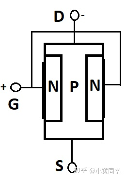

# 晶体管的简单介绍及工作原理

[Genosse Huang](https://www.zhihu.com/people/xue-wu-zhi-jing-14-39-72)

>原文链接：https://zhuanlan.zhihu.com/p/347523018

主要此处的晶体管是**电子元器件**，不是由曾制作《堡垒(Bastion)》的游戏开发商 Super Giant Games 研制开发的，在2014年上市的那款游戏。

打个简单的比喻，我们的大脑由 1000 亿个称为神经元的细胞组成，这些细胞用于思考和记忆事物。计算机也一样，也有数十亿个名为晶体管的微小脑细胞。。晶体管已经由JohnBardeen，WalterBrattain 和 WilliamS hockley进行了半个多世纪的设计，并成功地研制了出来，且目前晶体管技术仍然在不断地突破，更新。晶体管的诞生和发展，从根本上影响了电力电子学。

什么是晶体管？

晶体管（transistor）是一种固体半导体器件（包括二极管、三极管、场效应管、晶闸管等，有时特指双极型器件），具有检波、整流、放大、开关、稳压、信号调制等多种功能。晶体管作为一种可变电流开关，能够基于输入电压控制输出电流。与普通机械开关（如Relay、switch）不同，晶体管利用电信号来控制自身的开合，所以开关速度可以非常快，实验室中的切换速度可达100GHz以上。

- **transistor**  `/trænˈzɪstə/` -noun.晶体管
- 100GHz 中的 Hz 讲解见：`https://github.com/W1033/Computer-Basics-Knowledge/blob/19db8b92aa346e169304fc9ae956bc631252a022/编码_Book/Unit14.md#L72`
- 1 hertz (Hz) = 1000

2016年，劳伦斯伯克利国家实验室的一个团队打破了物理极限，将现有的最精尖的晶体管制程从14nm缩减到了1nm，完成了计算技术界的一大突破。

这些设备由通常用于放大或开关目的的半导体材料制成，也可以用于控制电压和电流的流动。它还用于将输入信号放大为扩展区输出信号。晶体管通常是由半导体材料制成的固态电子设备。电流的循环可以通过添加电子来改变。该过程使电压变化成比例地影响输出电流中的许多变化，从而使放大倍增。除了大多数电子设备外，并非所有的电子设备都包含一种或多种类型的晶体管。某些晶体管单独放置或通常放置在集成电路中，这些晶体管会根据状态应用而有所不同。
“晶体管是三脚昆虫型组件，在某些设备中单独放置但是在计算机中，它被封装成数以百万计的小芯片。”

晶体管由什么组成？

晶体管由三层半导体组成，它们具有保持电流的能力。诸如硅和锗之类的导电材料具有在导体和被塑料线包围的绝缘体之间传输电流的能力。半导体材料通过某种化学程序（称为半导体掺杂）进行处理。如果硅中掺有砷，磷和锑，它将获得一些额外的电荷载流子，即电子，称为N型或负半导体；而如果硅中掺有其他杂质（如硼），镓，铝，它将获得较少的电荷载流子，即空穴，被称为P型或正半导体。

晶体管如何工作？

工作原理是了解如何使用晶体管或晶体管的主要部分。它是如何工作的？晶体管中有三个端子：

•基极：它为晶体管电极提供基极。

•发射极：由此产生的电荷载流子。

•收集器：由此产生的电荷载流子。

如果晶体管为NPN型，我们需要施加0.7v的电压来触发它，并将该电压施加到基极管的晶体管tu正向偏置条件导通，电流开始流过集电极到发射极（也称为饱和区域）。当晶体管处于反向偏置状态或基极引脚接地或不带电压时，晶体管保持截止状态，并且不允许电流从集电极流向发射极（也称为截止区域））。

如果晶体管为PNP型，则通常处于ON状态，但不是可以说是完美的，直到基脚完全接地为止。将基极引脚接地后，晶体管将处于反向偏置状态或被称为导通状态。作为提供给基极引脚的电源，它停止了从集电极到发射极的电流传导，并且晶体管处于截止状态或正向偏置状态。

为保护晶体管，我们串联了一个[电阻](https://link.zhihu.com/?target=http%3A//www.elecfans.com/yuanqijian/dianzuqi/20171214603273_2.html)，使用以下公式查找该电阻的值：

RB=VBE/IB

晶体管的类型：

严格意义上讲，晶体管泛指一切以半导体材料为基础的单一元件，包括各种[半导体](https://link.zhihu.com/?target=https%3A//baike.baidu.com/item/%E5%8D%8A%E5%AF%BC%E4%BD%93)材料制成的二极管（二端子）、三极管、场效应管、[晶闸管](https://link.zhihu.com/?target=https%3A//baike.baidu.com/item/%E6%99%B6%E9%97%B8%E7%AE%A1)（后三者均为三端子）等。晶体管有时多指晶体三极管。

三端子晶体管主要分为两大类：[双极性晶体管](https://link.zhihu.com/?target=https%3A//baike.baidu.com/item/%E5%8F%8C%E6%9E%81%E6%80%A7%E6%99%B6%E4%BD%93%E7%AE%A1)（BJT）和[场效应晶体管](https://link.zhihu.com/?target=https%3A//baike.baidu.com/item/%E5%9C%BA%E6%95%88%E5%BA%94%E6%99%B6%E4%BD%93%E7%AE%A1)（FET，单极性）。晶体管有三个极（端子）；[双极性晶体管](https://link.zhihu.com/?target=https%3A//baike.baidu.com/item/%E5%8F%8C%E6%9E%81%E6%80%A7%E6%99%B6%E4%BD%93%E7%AE%A1)的三个极（端子），分别是由N型、P型半导体组成的[发射极](https://link.zhihu.com/?target=https%3A//baike.baidu.com/item/%E5%8F%91%E5%B0%84%E6%9E%81)（Emitter）、[基极](https://link.zhihu.com/?target=https%3A//baike.baidu.com/item/%E5%9F%BA%E6%9E%81)(Base) 和[集电极](https://link.zhihu.com/?target=https%3A//baike.baidu.com/item/%E9%9B%86%E7%94%B5%E6%9E%81)（Collector）；[场效应晶体管](https://link.zhihu.com/?target=https%3A//baike.baidu.com/item/%E5%9C%BA%E6%95%88%E5%BA%94%E6%99%B6%E4%BD%93%E7%AE%A1)的三个极（端子），分别是源极（Source）、[栅极](https://link.zhihu.com/?target=https%3A//baike.baidu.com/item/%E6%A0%85%E6%9E%81)（Gate）和[漏极](https://link.zhihu.com/?target=https%3A//baike.baidu.com/item/%E6%BC%8F%E6%9E%81)（Drain）。

晶体管因为有三个电极，所以也有三种的使用方式，分别是发射极接地（又称共射放大、CE组态）、[基极](https://link.zhihu.com/?target=https%3A//baike.baidu.com/item/%E5%9F%BA%E6%9E%81)接地（又称共基放大、CB组态）和集电极接地（又称共集放大、CC组态、发射极随耦器）。

也可以这样来简要的的划分：双极结型晶体管（BJT）和场效应晶体管（FET）。进一步我们可以如下划分：

双极结型晶体管（BJT）p双极结型晶体管由掺杂的半导体组成，具有三个端子，即基极，发射极和集电极。在该过程中，空穴和电子都被涉及。通过修改从基极到发射极端子的小电流，流入集电极到发射极的大量电流切换。这些也称为当前控制的设备。如前所述，NPN和PNP是BJT的两个主要部分。BJT通过将输入提供给基极来开启，因为它的所有晶体管[阻抗](https://link.zhihu.com/?target=http%3A//www.hqpcb.com/)都最低。所有晶体管的放大率也最高。

BJT的类型如下：

1.NPN晶体管：

在NPN晶体管的中间区域，即基极为p型，而在两个外部区域，即发射极和集电极为n型。

在正向活动模式下，NPN晶体管处于偏置状态。通过直流电源Vbb，基极到发射极的结点将被正向偏置。因此，在该结的耗尽区将减少。集电极至基极结被反向偏置，集电极至基极结的耗尽区将增加。多数电荷载流子是n型发射极的电子。基极发射极结正向偏置，因此电子向基极区域移动。因此，这会导致发射极电流Ie。基极区很薄，被空穴轻掺杂，形成了电子-空穴的结合，一些电子保留在基极区中。这会导致基本电流Ib非常小。基极集电极结被反向偏置到基极区域中的空穴和电子，而正偏向基极区域中的电子。集电极端子吸引的基极区域的剩余电子引起集电极电流Ic。在此处查看有关NPN晶体管的更多信息。

2.。PNP晶体管：

在PNP晶体管的中间区域（即基极为n型）和两个外部区域（即集电极）

我们在上面的NPN晶体管中讨论过，它也处于有源模式。大多数电荷载流子是用于p型发射极的孔。对于这些孔，基极发射极结将被正向偏置并朝基极区域移动。这导致发射极电流Ie。基极区很薄，被电子轻掺杂，形成了电子-空穴的结合，并且一些空穴保留在基极区中。这会导致基本电流Ib非常小。基极集电极结被反向偏置到基极区域中的孔和集电极区域中的孔，但是被正向偏置到基极区域中的孔。集电极端子吸引的基极区域的剩余孔引起集电极电流Ic。在此处查看有关PNP晶体管的更多信息。

什么是晶体管配置？

通常，共有三种类型的配置，其关于增益的描述如下：

共基（CB）配置：它没有当前增益，但具有

公共集电极（CC）配置：它具有电流增益，但是没有电压增益。

公共发射极（CE）配置：它同时具有电流增益和电压增益。

晶体管公共基极（CB）配置：

在此[电路](https://link.zhihu.com/?target=http%3A//www.hqpcb.com/)中，将基座放置在输入和输出共用的位置。它具有低输入阻抗（50-500欧姆）。它具有高输出阻抗（1-10兆欧）。相对于基础端子测得的电压。因此，输入电压和电流将为Vbe＆Ie，输出电压和电流将为Vcb＆Ic。

电流增益将小于1，即alpha（dc）=Ic/Ie

电压增益将很高。

功率增益将是平均水平。

晶体管公共发射极（CE）配置：

在此电路中，放置了发射极输入和输出通用。输入信号施加在基极和发射极之间，输出信号施加在集电极和发射极之间。Vbb和Vcc是电压。它具有高输入阻抗，即（500-5000欧姆）。它具有低输出阻抗，即（50-500千欧）。

电流增益将很高（98），即beta（dc）=Ic/Ie

功率增益高达37db。

输出将异相180度。

晶体管公共集电极配置：

在此电路中，集电极对输入和输出均通用。这也称为发射极跟随器。输入阻抗高（150-600千欧），输出阻抗低（100-1000欧）。

电流增益会很高（99）。

电压增益将小于1。

功率增益将是平均的。

场效应晶体管（FET）：

场效应晶体管包含三个区域，例如源极，栅极，漏极。它们被称为电压控制设备，因为它们可以控制电压水平。为了控制电气行为，可以选择外部施加的电场，这就是为什么被称为场效应晶体管的原因。在这种情况下，电流由于多数电荷载流子（即电子）而流动，因此也称为单极晶体管。它主要具有兆欧的高输入阻抗，漏极和源极之间的低频电导率受电场控制。场效应晶体管效率高，强度大，成本低。

场效应晶体管有两种类型，即结型场效应晶体管（JFET）和金属氧化物场效应晶体管（[MOSFET](https://link.zhihu.com/?target=http%3A//www.elecfans.com/tags/mosfet/)）。电流在名为n通道和p通道的两个通道之间通过。

结型场效应晶体管（JFET）

结型场效应晶体管没有[PN结](https://link.zhihu.com/?target=http%3A//m.elecfans.com/article/577144.html)，但代替了高电阻半导体材料，它们形成了n＆p型硅通道用于大多数电荷载流子的流动，其两个端子为漏极或源极端子。在n通道中，电流为负，而在p通道中，电流为正。

JFET的工作：

JFET中有两种类型的通道，称为：n通道JFET和p沟道JFET

N沟道JFET：

在这里，我们必须讨论以下两个条件下n沟道JFET的主要工作原理：

首先，当Vgs=0时，

在Vds为正的漏极端子上施加小的正电压。由于此施加的电压Vds，电子从源极流到漏极会导致漏极电流Id。漏极和源极之间的通道充当电阻。令n通道均匀。不同的电压电平由漏极电流Id设置，并从源极转移到漏极。漏极端电压最高，源极端电压最低。漏极反向偏置，因此此处的耗尽层更宽。

Vds增加，Vgs=0V

耗尽层增加，通道宽度减小。Vds在两个耗尽区接触的水平上增加，这种情况称为夹断过程，并导致夹断电压Vp。

此处，Id夹断–下降到0MA和Id达到饱和水平。具有Vgs=0的ID，称为漏极源饱和电流（Idss）。Vds以Vp增大，此时电流Id保持不变，JFET用作恒定电流源。

第二，当Vgs不等于0，

应用负Vgs和Vds会有所不同。耗尽区的宽度增加，沟道变窄并且电阻增加。较小的漏极电流流动并达到饱和水平。由于负Vgs，饱和度降低，Id降低。夹断电压持续下降。因此，它称为电压控制设备。

JFET的特征：

特性显示出不同的区域，如下所示：

欧姆区域：Vgs=0，耗尽层较小。

断开区域：由于通道电阻最大，也称为夹断区域。

饱和或有源区域：由栅源电压控制，漏源电压较小

[击穿](https://link.zhihu.com/?target=http%3A//www.hqpcb.com/zhuoluye11/%3Ftid%3D26%26plan%3Dfashaoyou)区域：漏极和源极之间的电压高，导致电阻沟道击穿。

P沟道JFET：

p沟道JFET与n沟道JFET的操作相同，但发生了一些例外，例如，由于空穴，沟道电流为正，偏置电压极性需要反转。

有源区中的漏极电流：

Id=Idss［1-Vgs/Vp］

漏极源极通道电阻：Rds=增量Vds/delt[aI](https://link.zhihu.com/?target=http%3A//www.elecfans.com/tags/ai/)d

金属氧化物场效应晶体管（MOSFET）

金属氧化物场效应晶体管也称为电压控制场效应晶体管。在这里，金属氧化物栅极电子通过称为玻璃的二氧化硅薄层与n沟道和p沟道电绝缘。

漏极和源极之间的电流与输入电压成正比

这是一个三端设备，即栅极，漏极和源极。根据沟道的功能，有两种类型的MOSFET，即p沟道MOSFET和n沟道MOSFET。

有两种形式的金属氧化物场效应晶体管，即耗尽型和增强型。

耗尽类型：需要Vgs，即栅极-源极电压要关闭，耗尽模式等于常闭开关。

Vgs=0，如果Vgs为正，则电子较多；如果Vgs为负，则电子较少。

增强类型：需要Vgs，即打开栅极电源和增强模式等于常开开关。

此处，附加端子为衬底》用于接地。

门电源电压（Vgs）大于[阈值电压](https://link.zhihu.com/?target=http%3A//www.elecfans.com/tags/%E9%98%88%E5%80%BC%E7%94%B5%E5%8E%8B/)（Vth）

晶体管偏置模式：forwardbiasing和反向偏置，而根据偏置，有四个不同的偏置电路，如下所示：

固定基准偏置和固定电阻偏置：

在图中，基极电阻Rb连接在基极和Vcc之间。基极发射极结由于电压降Rb而被正向偏置，导致流Ib通过它。在此从以下项获得Ib：

Ib=（Vcc-Vbe）/Rb

这将导致稳定性因子（beta+1），从而导致较低的热稳定性。这里的电压和电流的表达式，即

Vb=Vbe=Vcc-IbRb

Vc=Vcc-IcRc=Vcc-Vce

Ic=BetaIb

Ie=Ic

集电极反馈偏置：

在此图中，基极[电阻器](https://link.zhihu.com/?target=http%3A//www.elecfans.com/tags/%E7%94%B5%E9%98%BB%E5%99%A8/)Rb连接在集电极和晶体管的基极端子之间。因此，基极电压Vb和集电极电压Vc彼此相似

Vb=Vc-IbRb

Where，

Vb=Vcc-（Ib+Ic）Rc

通过这些等式，Ic会减小Vc，从而减小Ib，自动Ic减小。

（β+1）因子小于1，Ib导致[放大器](https://link.zhihu.com/?target=http%3A//www.elecfans.com/tags/%E6%94%BE%E5%A4%A7%E5%99%A8/)增益减小。

因此，电压和电流可以表示为-

Vb=Vbe

Ic=betaIb

Ieisalmos[te](https://link.zhihu.com/?target=http%3A//www.elecfans.com/tags/te/)qualstoIb

双反馈偏置：

在此图中，它是基于集电极反馈电路的改进形式。由于它具有附加电路R1，因此增加了稳定性。因此，基极电阻的增加导致beta的变化，即增益。

现在，

I1=0.1Ic

Vc=Vcc-（Ic+I（Rb）Rc

Vb=Vbe=I1R1=Vc-（I1+Ib）Rb

Ic=betaIb

IeisalmostequalstoIc

固定的带有发射电阻的偏置：

在此图中，它与固定偏置电路相同，但是还连接了一个附加的发射极电阻Re。Ic由于温度而增加，Ie也增加，这又增加了Re两端的电压降。这导致Vc减小，Ib减小，从而使iC恢复到其正常值。电压增益因Re的存在而降低。

现在，

Ve=IeRe

Vc=Vcc–IcRc

Vb=Vbe+Ve

Ic=betaIb

IeisalmostequalstoIc

发射器偏置：

在此图中，有两个电源电压Vcc和Vee相等但极性相反。这里，Vee正向偏置到基极Re＆Vcc的发射极结反向偏置到集电极基极结。

现在，

Ve=-Vee+IeRe

Vc=Vcc-IcRc

Vb=Vbe+Ve

Ic=betaIb

IeisalmostequaltoIb

Where，Re》》Rb/beta

Vee》》Vbe

给出稳定的工作点。

发射极反馈偏置：

在此图中，它同时使用了收集器作为反馈和发射极反馈以获得更高的稳定性。由于发射极电流Ie的流动，发射极电阻Re两端会出现电压降，因此发射极基极结将为正向偏置。在此，温度升高，Ic升高，Ie也升高。这导致Re处的电压降，集电极电压Vc降低，Ib也降低。这导致输出增益将降低。表达式可以表示为：

Irb=0.1Ic=Ib+I1

Ve=IeRe=0.1Vcc

Vc=Vcc-（Ic+Irb）Rc

Vb=Vbe+Ve=I1R1=Vc-（I1+Ib0Rb）

Ic=betaIb

IeisalmostequaltoIc

电压分压器偏置：

在该图中，它使用电阻器R1和R2的分压器形式对晶体管进行偏置。R2上形成的电压将是基极电压，因为它正向偏置了基极-发射极结。在这里，I2=10Ib。

这样做是为了忽略分压器电流，β值会发生变化。

Ib=VccR2/R1+R2

Ve=IeRe

Vb=I2R2=Vbe+Ve

Ic可以抵抗beta和Vbe的变化这导致稳定性因子为1。在这种情况下，Ic随着温度的升高而增加，Ie随着发射极电压Ve的增加而增加，从而降低了基极电压Vbe。这会导致基本电流ib和ic减小到其实际值。

一些常见的判别及计算：

**判别基极和管子的类型**

选用欧姆档的R*100（或R*1K）档，先用红表笔接一个管脚，黑表笔接另一个管脚，可测出两个电阻值，然后再用红表笔接另一个管脚，重复上述步骤，又测得一组电阻值，这样测3次，其中有一组两个阻值都很小的，对应测得这组值的红表笔接的为基极，且管子是PNP型的；反之，若用黑表笔接一个管脚，重复上述做法，若测得两个阻值都小，对应黑表笔为基极，且管子是NPN型的。

**判别集电极**

因为三极管发射极和集电极正确连接时β大（表针摆动幅度大），反接时β就小得多。因此，先假设一个集电极，用欧姆档连接，（对NPN型管，发射极接黑表笔，集电极接红表笔）。测量时，用手捏住基极和假设的集电极，两极不能接触，若指针摆动幅度大，而把两极对调后指针摆动小，则说明假设是正确的，从而确定集电极和发射极。

**电流放大系数β的估算**

选用欧姆档的R*100（或R*1K）档，对NPN型管，红表笔接发射极，黑表笔接集电极，测量时，只要比较用手捏住基极和集电极（两极不能接触），和把手放开两种情况小指针摆动的大小，摆动越大，β值越高。

最后我们谈一谈代换原则：

无论是专业无线电维修人员。还是业余无线电爱好者，在工作中都会碰到[晶体管](https://link.zhihu.com/?target=https%3A//baike.baidu.com/item/%E6%99%B6%E4%BD%93%E7%AE%A1)置换问题。

如果掌握了晶体管的代换原则，往往能使维修工作事半功倍，提高维修效率。晶体管的置换原则可概括为三条：即类型相同、特性相近、外形相似。

一、类型相同

1．材料相同。即锗管置换锗管，硅管置换硅管。

2．极性相同。即npn型管置换npn型管，pnp型管置换pnp型管。

二、特性相近

用于置换的晶体管应与原晶体管的特性相近，它们的主要参数值及特性曲线应相差不多。晶体管的主要参数近20个，要求所有这些参数都相近，不但困难，而且没有必要。一般来说，只要下述主要参数相近，即可满足置换要求。

1．集电板最大直流耗散功率(pcm)

一般要求用pcm与原管相等或较大的晶体管进行置换。但经过计算或测试，如果原晶体管在整机[电路](https://link.zhihu.com/?target=https%3A//baike.baidu.com/item/%E7%94%B5%E8%B7%AF)中实际直流耗散功率远小于其pcm，则可以用pcm较小的晶体管置换。

2．集电极最大允许直流电流(icm)

一般要求用icm与原管相等或较大的晶体管进行置换。

3．击穿电压

用于置换的晶体管，必须能够在整机中安全地承受最高工作电压；

来源：输配电设备网

4．频率特性

晶体管频率特性参数，常用的有以下2个：

(1)特征频率ft：它是指在测试频率足够高时，使晶体管共发射极电流放大系数时的频率。

(2)截止频率fb：

在置换晶体管时，主要考虑ft与fb。通常要求用于置换的晶体管，其ft与fb，应不小于原晶体管对应的ft与fb。

5。其他参数

除以上主要参数外，对于一些特殊的晶体管，在置换时还应考虑以下参数：

(1)对于低噪声晶体管，在置换时应当用噪声系数较小或相等的晶体管。

(2)对于具有自动增益控制性能的晶体管，在置换时应当用自动增益控制特性相同的晶体管。

(3)对于[开关](https://link.zhihu.com/?target=https%3A//baike.baidu.com/item/%E5%BC%80%E5%85%B3)管，在置换时还要考虑其开关参数。

三、外形相似

小[功率晶体管](https://link.zhihu.com/?target=https%3A//baike.baidu.com/item/%E5%8A%9F%E7%8E%87%E6%99%B6%E4%BD%93%E7%AE%A1)一般外形均相似，只要各个电极引出线标志明确，且引出线排列顺序与待换管一致，即可进行更换。[大功率晶体管](https://link.zhihu.com/?target=https%3A//baike.baidu.com/item/%E5%A4%A7%E5%8A%9F%E7%8E%87%E6%99%B6%E4%BD%93%E7%AE%A1)的外形差异较大，置换时应选择外形相似、安装尺寸相同的晶体管，以便安装和保持正常的散热条件。

希望这篇文章能让你对晶体管有更清晰的认识，也希望这篇文章能真正帮助到您！

【参考文献：1、电力电子技术（第五版王兆安）

2、百度搜索[晶体管（电子元件）_百度百科](https://link.zhihu.com/?target=https%3A//baike.baidu.com/item/%E6%99%B6%E4%BD%93%E7%AE%A1/569042%3Ffr%3Daladdin)

3、电子发烧友网站文章《晶体管的工作原理和实际作用》】

编辑于 2021-01-27 22:27