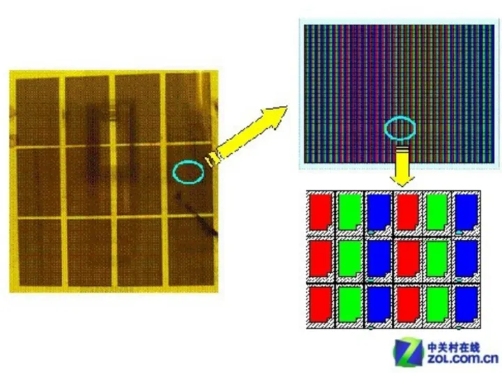
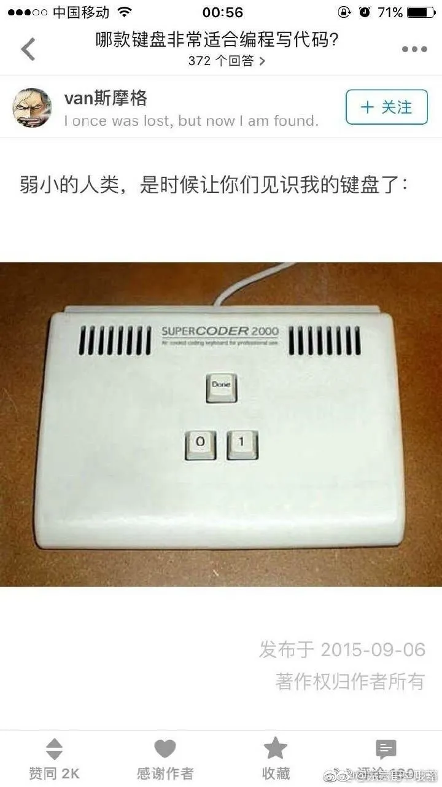

# 数据的流动——计算机是如何显示一个像素的

[一尾66](https://www.zhihu.com/people/tyw66)

> 原文链接：https://zhuanlan.zhihu.com/p/32136704

在计算机内部是怎么把一张照片显示到屏幕上的呢？

对于这个问题一直很好奇，这应该是也是图形学的一个最基础的问题吧。没上过计算机组成原理课，只好自行百度谷歌~ 发现网上的答案大多不完整，前段时间顺着问题一直搜索，从计算机的发明到显示器成像后来又到了电路，后来甚至工业革命的发展史，根本停不下来，有了一个主题后看历史也是真挺有意思的。在这里将我的理解大概记下来，不求细节精确，只求完整易懂。

一个从编程/输入设备输入到显示器显示到人眼的完整过程。分为**几个阶段：（应用程序/输入设备产生）数据与指令——>CPU——>显卡驱动程序——>显卡——>显示器——>人眼。**

让我们从尾端倒着看起。先说显示器显示与人眼混色的原理。

## **一、显示器阶段**

**1.1、显像原理**

拿常见的液晶显示器举例，显示器是的底部是一块发光白板灯，中间液晶，然后是一些滤光片。显示器的屏幕是由很多个“小块”组成的，每块后面都有红绿蓝三个**滤光片**，每个小块就是1个像素点。滤光片能够把显示器背后发出的白光过滤，留下单色光通过，白光经过三块滤光片后被分解成了红绿蓝三束光，进入人的眼睛。由于一个像素极其小，三个滤光片距离极其近，以至于透过它们的光进入人眼后，人眼分不清这是3束光，即光在人眼中发生**混色作用**，于是一个像素便“有了”颜色。这3束光强度如果一致的话，混色后人眼将会看到白色光，而想要看到五颜六色的话，混合前的红绿蓝三束光应该具有不同强度(亮度)，如何获得**不同亮度的三色光**呢？这就是液晶作用了。

显示器的每一个像素背后...

这里插一句，可能你会问光的三原色为什么是红绿蓝而不是紫色、粉色、或者屎黄色呢？是因为人类的视网膜上面的**视锥细胞**对红绿蓝三色最敏感，可能不同的人看见的世界颜色还真不一样。这有点生物学了。

说回液晶，液晶不是固态，也不是液态，而是一种中间的状态，其**分子在电压的控制下，形成不同的排列方式，所以可以控制光线的透过，形成不同明暗程度的画面**。这是一个非常重要的步骤，如果只能形成一明一暗是构成不了画面的.不管是显示器还是投影机，其实都是按这个原理进行显示的。当然如果只是进行了上述的过程，形成的画面仅仅是黑白画面，因为透过液晶分子的光线并没有颜色，需要滤色片来“上色”。[1]

有了光、有了人眼、有了滤光片、有了液晶，还差什么？当然是电，液晶控制光线通过的程度是由加在液晶上的电压强弱来控制的。现在我们知道了向显示器输入**一定规律的电压信号**能够控制液晶按一定规律排列，来控制红绿蓝RGB颜色分量，继而显示出特定颜色。

**1.2、数模转换**

由于电压信号是连续变化的（举个栗子，从200变为201是连续变化的，而不是跳跃地一下子从200变为201），而我们知道计算机只认识0和1，内部是由0和1二进制来表示的，表示的数据是离散化的(从200跳跃到201)，前者我们称之为模拟信号，后者称为数字信号。把**承载有计算机数据的数字信号转为显示器用的模拟信号**，这个过程就是数模转换了，而执行这个过程的设备，就是显卡了。

此外，简单直观地理解下，计算机内电路是靠高电平和低电平来表示0和1的，还有就是靠脉冲发送数字信号。

## **二、显卡阶段**

**2.1 显卡硬件**

关于显卡，这里直接引用下百度百科：

> 显卡全称显示接口卡，又称显示适配器，是计算机最基本配置、最重要的配件之一。显卡作为电脑主机里的一个重要组成部分，是电脑进行数模信号转换的设备，承担输出显示图形的任务。显卡接在电脑主板上，它将电脑的数字信号转换成模拟信号让显示器显示出来，同时显卡还是有图像处理能力，可协助CPU工作，提高整体的运行速度。

数据从离开CPU到达显示屏，中间必须通过如下4个步骤：

> 1．从总线进入GPU（图形处理器）：将CPU送来的数据送到北桥，再送到GPU里面进行处理。
> 2．将芯片处理完的数据送到显存。
> 3．从显存读取出数据再送到随机读写存储数—模转换器进行数模转换的工作。（但是如果是DVI接口类型的显卡，则不需要经过数字信号转模拟信号。而直接输出数字信号。）
> 4．从DAC进入显示器：将转换完的模拟信号送到显示屏。

显卡就是起数据处理和数模转换的作用，像数模转换、模数转换这些都是数字信号处理、数字电路之类的学科的知识了~

以上便是CPU到显卡再到显示器再到人眼的过程。不过这其中还有一点，显卡有不同类型，内部工作原理不尽相同，而同一个操作系统可以安装在不同显卡的机器上，如何识别它们，让不同显卡都能在此操作系统下正常工作，需要一个在操作系统与（显卡）硬件间沟通者的角色，这个就是（显卡）驱动程序了。

**2.2 显卡驱动**

它是硬件厂商根据操作系统编写的配置文件，是添加到操作系统中的一小块代码，其中包含有关硬件设备的信息。驱动程序扮演沟通的角色，**把硬件的功能告诉操作系统，并且也将系统的指令传达给硬件**，让它开始工作。

这一块偏硬件我就没有深究了，我的理解就是CPU通过操作系统中相应显卡驱动程序访问操纵显卡，向显存写入数据。这一块知乎上也有许多相关问题。

再贴两个链接：[显卡、显卡驱动、cuda 之间的关系是什么？ - 冬瓜哥的回答 - 知乎](https://www.zhihu.com/question/59184480/answer/166167659)

> 显卡驱动，分内核态和用户态两部分。内核态驱动只管将用户态驱动发过来的命令和数据准备好，通知GPU来拿，利用环形fifo来下发命令和数据指针，并追踪命令的完成状态。用户态部分，负责对shader程序的编译，编译成GPU的二进制代码指令。OS提供的D3D,OpenGL等函数库，屏蔽底层不同显卡的差异。上层程序比如游戏，在准备好对应的模型、贴图纹理、着色器程序等数据之后，调用统一的D3D/OpenGL接口发起绘制请求，D3D则调用显卡用户态驱动提供的回调函数将对应的数据传递给后者，后者进行运行时编译生成底层代码，然后传递给内核态驱动，内核态驱动将命令和数据发送给GPU。至于GPU怎么算的，那就是完全另外一回事了。

[计算机底层是如何访问显卡的？](https://www.zhihu.com/question/20722310)

以上部分便是将CPU里面的数据传递到人眼的过程。计算机如何显示的问题已经解决了，本文主要内容到这里应该就要结束了的，但是为了完整性....咳，接下来部分就接着讲CPU是怎样获取数据的。分为输入设备和应用程序两种情况来说。

## **三、数据输入**

**3.1 键盘**

先放一张图片↓

（图片来自网络）

计算机通过一系列输入设备来获取数据。获取图片可以用扫描仪、数码相机等，获取声音可以用麦克风、获取文字可以通过键盘，而这些设备的作用最终都是将这些数据转换为数字信号。计算机内只存在0和1，因此，无论是图片、文字还是声音等，理论上计算机的一切的数据、指令等都可以通过键盘输入来获得（见上图，笑）。

贴个链接： [键盘基本工作原理_图文_百度文库](https://link.zhihu.com/?target=https%3A//wenku.baidu.com/view/75681031b90d6c85ec3ac67f.html)

> 计算机键盘通常采用行列扫描法来确定按下键所在的行列位置。所谓行列扫描法是指，把键盘按键排列成n行×m列的n*m行列点阵，把行、列线分别连接到两个 并行接口双向传送的连接线上，点阵上的键一旦被按动，该键所在的行列点阵信号就被认为已接通。按键所排列成的矩阵，需要用硬件或软件的方法轮转顺序地对其行、列分别进行扫描，以查询和确认是否有键按动。如有键按动，键盘就会向主机发送被按键所在的行列点阵的位置编码，称为**键扫描码**。单片机通过周期性扫描行、列线，读回扫描信号结果，判断是否有键按下，并计算按键的位置以获得扫描码。键被按下时，单片机分两次将位置扫描码发送到键盘接口：按下一次，叫接通扫描码；按完释放一次，叫断开扫描码。这样，通过硬件或软件的方法对键盘分别进行行、列扫视，就可以确定按下键所在位置，获得并输出扫描位置码，然后转换为ASCII码，经过键盘I/O电路送入主机，并由显示器显示出来。

于是从理论上，我可以用上图的这种键盘按照一定的编码敲出一长串0、1数字序列，再加一个jpg/png的后缀名保存。打开文件时，是将这些数据送入内存，图片查看程序控制CPU，根据后缀名对数据进行解码、解压后得到图像本身的数据——每个像素的RGB等。再历经前面所述的一大串过程，CPU的数据再经过显卡和显示器，最终我就能看到一张滑稽的照片。（#滑稽）

上面介绍了如何直接获取具体的数据并呈现。在现实中，我们不太可能用键盘一像素一像素地敲出一副图片来(←这句删除)，（当然也可以，而且是个学入门图形学的好思路，见

[@Milo Yip](https://www.zhihu.com/people/1e2c9261b85996ccc3c5436850127e33)

大佬的svpng库一文 [极简的 PNG 编码函数 svpng()](https://zhuanlan.zhihu.com/p/26525083)）

有种图像格式叫ppm，很简单，无压缩，可以直接开个记事本写好图像长宽颜色深度，然后就是各像素的rgb值，挨着写完后，保存为ppm后缀，就可以图像查看软件查看咯，即用键盘敲了一张可以显示的图片出来。可以看到，虽然键盘产生了数据，但是如果要显示到屏幕上，还是得通过程序将数据送到CPU。

**3.2 应用程序**

除了我们直接用拍照的方式记录下一副图片的信息之外，还有另一种主要的方式，就是通过计算机程序。毕竟，计算机不是照相机。

例如，写了一个程序，实现了在屏幕画一条线，或者显示一个圆柱体，或者显示一个怪物模型。本质上我们都是要获得表示一幅二维图像的一串0和1的数字，而我们知道的一些数据，例如线段长度、圆柱体的半径高度、怪物表面部分点的坐标、我们从什么角度来观察这些物体，那么，怎样获得这幅图像的信息呢？这就是图形学的范畴了。

但本质上，图形学的API底层都会提供一个类似于drawPixel(int x, int y, Color color)的接口，用于实现将屏幕坐标为(x,y)的像素点颜色设置为color的功能。

## **四、结语**

简单来说，这个过程就是：在操作系统与硬件驱动程序的帮助下，用户通过输入设备或者程序向计算机CPU发送一系列的数据，这些数字信号再经过显卡变为不断变化的电压模拟信号，电压控制了液晶的滤光性，像素背后的白光被分成了强弱不同的三原色光，再经人眼的混色作用使得一个像素具有了千变万化的颜色。

本文力求过程的完整性，不追求细节的完整性。其实上过相关计算机、机电之类专业课的应该都知道这些东西。另外像GPU计算，shader这些我也就略过了。如果你也和我一样有着同样的疑惑，看过这篇文章后有了直观完整的认识，我自认为本文目的达到了，毕竟很多地方描述的不够专业准确。错误之处也请指正~

*P.S. 推荐书《编码，隐匿在计算机软硬件背后的语言》，这本书用通俗易懂的语言加上海量的配图，从编码说起，到搭建各种逻辑电路，再到一个CPU，最后到一个计算机。所以它又名：如何造一台计算机。计算机本来没有计算力，它只是一台机器，通电后在这种状态下，哪些电路应该连通，哪些“电灯”应该点亮，哪些电平应该高应该低，状态变了，电路的结果也变了，仅此而已。是我们人，人为地规定，比如一组“带编号的电灯”（可能是4个也可能是8个，由人来约定好）以这样的亮熄顺序出现的话，就是2333这个数，以另一种顺序出现的话又是6666这个数，都是来自于人规定的一套解释，这里的解释就是编码，A这套编码规则规定2333这个数在别的编码里就是250...*

***总之，计算机只认识电路，一些都是我们对电路结果的解释.......\***