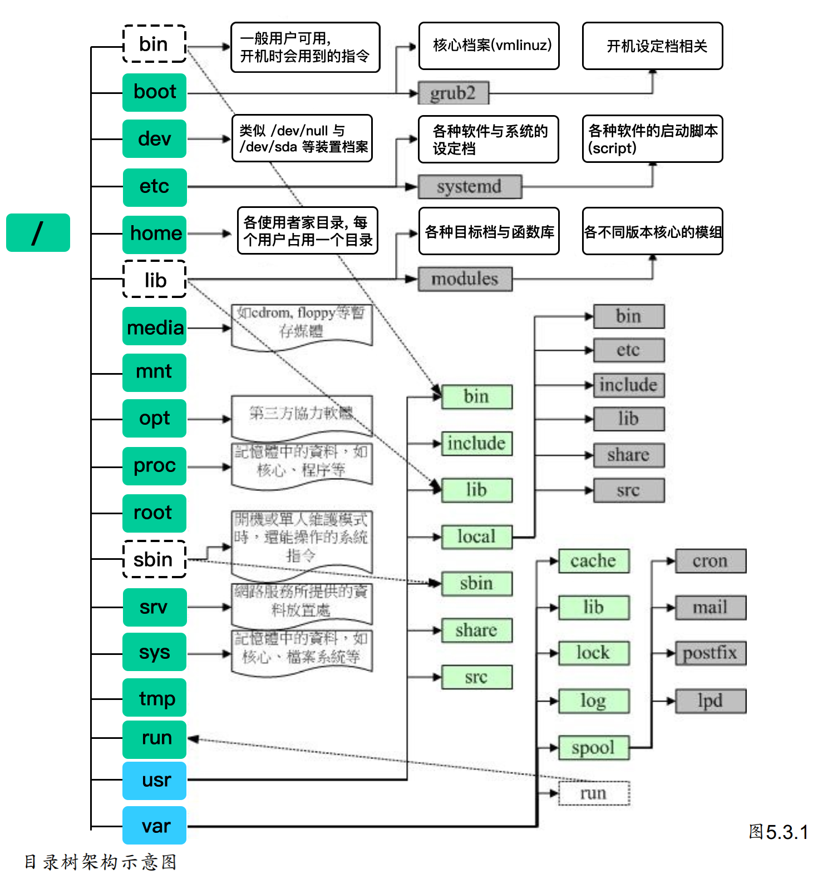

# Linux-Unix


## ▲ Linux 文件命名规范

> [!Note]
>
> Updated: 2025.06.25
>
> Source: 来源没有记录，但是使用 Gemini 2.5 pro 润色后如下

在 Linux 系统中，文件和目录的命名相当灵活，但遵循一些通用规范可以让你在管理文件时更加高效，并避免许多不必要的麻烦。

### 核心规则

1. **严格区分大小写**
    - 这一点与 Windows 系统不同。在 Linux 中，`File.txt`, `file.txt`, 和 `FILE.TXT` 是三个完全不同的文件。
2. **文件名长度限制**
    - 文件名本身最长可达 **255 个字节 (bytes)**。
    - 包含路径在内的全路径名最长可达 **4096 个字节 (bytes)**。
3. **特殊字符：根目录分隔符 `/`**
    - 文件名中 **绝对不能包含** 斜杠 `/`。因为 `/` 是用来分隔目录的特殊字符，例如 `/home/user/documents`。
4. **隐藏文件**
    - 以点号 `.` 开头的文件是隐藏文件。使用 `ls -a` 命令可以查看它们。例如 `.bashrc` 是一个常见的隐藏配置文件。

### 强烈建议遵循的规范

1. **避免使用特殊字符**
    - 虽然技术上除了 `/` 和 `NULL` 字符外，其他字符都是合法的，但强烈建议 **避免** 在文件名中使用以下字符，因为它们在 Shell 或特定程序中有特殊含义，直接使用可能会导致命令解析错误或非预期的行为：
        - **空格 (` `)**: 会导致文件名被分割，需要用引号或转义符处理。
        - **通配符**: `*`, `?`, `[` , `]`
        - **元字符**: `|`, `&`, `;`, `(`, `)`, `<`, `>`, `!`
        - **其他特殊符号**: `\`, `"`, `'`, `$`, ```, `~`, `#` 等。
    - **修改建议**: 如果需要分隔单词，推荐使用 **下划线 `_`** ( 例如 `my_report_2025.docx`) 或者 **连字符 `-`** ( 例如 `my-report-2025.docx`)，也可以使用驼峰命名法 ( 例如 `MyReport2025.docx`)。
2. **避免使用 `+`, `-` 作为普通文件名的开头字符**
    - 以 `-` 或 `+` 开头的文件名在执行 `ls`, `rm` 等命令时，可能会被误认为是命令的选项参数，从而导致操作失败或产生意想不到的后果。
    - **示例**: 如果你创建了一个名为 `-f` 的文件，执行 `rm -f` 时，系统会把后面的 `-f` 当作强制删除的选项，而不是文件名。如果非要处理这类文件，可以加上路径 `./-f` 来明确指定。


## ▲ Linux 或类 Linux 系统中, 打开终端显示的默认路径是什么?

终端启动后，它的默认路径在当前用户文件夹的根目录上，为了确定这一点，你可以输入 `pwd` 命令来查看当前路径.


## ▲ Linux 中的绝对和相对路径

在 Linux 中，简单的理解一个文件的路径，指的就是该文件存放的位置，例如，在《[Linux文件系统的层次结构](http://c.biancheng.net/view/3546.html)》中提到的 /home/cat 就表示的是 cat 文件所存放的位置。只要我们告诉 Linux 系统某个文件存放的准确位置，那么它就可以找到这个文件。

指明一个文件存放的位置，有 2 种方法，分别是使用绝对路径和相对路径。

我们知道，Linux 系统中所有的文件（目录）都被组织成以根目录 `/` 开始的倒置的树状结构，如图 1 所示。


图 1 Linux系统文件组织结构示意图

绝对路径一定是由根目录 `/ `开始写起。例如，使用绝对路径的表示方式指明 bin 文件所在的位置，该路径应写为 `/usr/bin`，测试代码如下：

``` shell
[root@localhost ~]  # bin
bash： bin： command not found  <-- 没有找到
[root@localhost ~]  # /usr/bin
bash: /usr/bin: is a directory  <-- 是一个文件
```

可以看到，如果仅传递给 Linux 系统一个文件名，它无法找到指定文件；而当将 bin 文件的绝对路径传递 Linux 系统时，它就可以成功找到。

和绝对路径不同，相对路径不是从根目录 / 开始写起，而是从当前所在的工作目录开始写起。使用相对路径表明某文件的存储位置时，经常会用到前面讲到的 2 个特殊目录，即当前目录（用 . 表示）和父目录（用 .. 表示）。

举个例子，当我们使用 root 身份登录 Linux 系统时，当前工作目录默认为 /root，如果此时需要将当前工作目录调整到 root 的子目录 Desktop 中，当然可以使用绝对路径，示例代码如下：

```shell
[root@localhost ~]# pwd   <-- 显示当前所在的工作路径
/root
[root@localhost ~]# cd /root/Desktop
[root@localhost Desktop]# pwd
/root/Desktop
```

> 注意，这里所使用的 pwd 和 cd 命令，目前只需知道它们的功能即可，具体用法会在后续文章中作详细讲解。

可以看到，通过使用绝对路径，我们成功地改变了当前工作路径。但除此之外，使用相对路径的方式会更简单。因为目前处于 /root 的位置，而 Desktop 就位于当前目录下，所以：

```shell
[root@localhost ~]# pwd  <-- 显示当前所在的工作路径
/root
[root@localhost ~]# cd ./Desktop
[root@localhost Desktop]# pwd
/root/Desktop
```

此代码中，./Desktop 表示的就是 Destop 文件相对于 /root 所在的路径。

再举一个例子，如果以 root 身份登录 Linux 系统，并实现将当前工作目录由 /root 转换为 /usr 目录，有以下 2 种方式：

```shell
# 使用绝对路径
[root@localhost ~]# pwd <-- 显示当前所在的工作路径
/root
[root@localhost ~]# cd /usr
[root@localhost ~]# pwd
/usr

#使用相对路径
[root@localhost ~]# pwd <-- 显示当前所在的工作路径
/root

[root@localhost ~]# cd ../usr <-- 相对 root，usr 位于其父目录 /，因此这里要用到 ..

[root@localhost ~]# pwd
/usr
```

总之，绝对路径是相对于根路径 / 的，只要文件不移动位置，那么它的绝对路径是恒定不变的；而相对路径是相对于当前所在目录而言的，随着程序的执行，当前所在目录可能会改变，因此文件的相对路径不是固定不变的。


## ▲ 查看登录到服务器后根目录结构

当我们使用 `ssh root@公网IP` 输入之前设定的服务器登录密码进入服务器后, 首次登录可能会询问公钥, `yes` 即可.

上述操作是使用 `root` 用户身份登陆, 会直接进入到下图加粗的 **`root`** 目录下, 先 `cd ..` 跳转到上层, 再 `ls -a`, 就可以看到类似下图的目录结构了.

`Linux` 目录树结构示意图 (图`1`和图`2`对比着看):



(图`1`)


(图`2`)


## ▲ ps -ef|grep tomcat 是啥意思呢？

`ps -ef` 是用标准的格式显示进程

显示的项目有：`UID , PID , PPID , C , STIME , TTY , TIME , CMD` ，如下图所示：


grep 命令是查找

中间的 `|` 是管道命令(/符)，是指 ps 命令与 grep 同时执行，

所以 `ps -ef|grep tomcat` 是显示有关 tomcat 的命令，

`ps -ef|grep xxx` 该命令用于查看进程 xxx 的相关信息。

