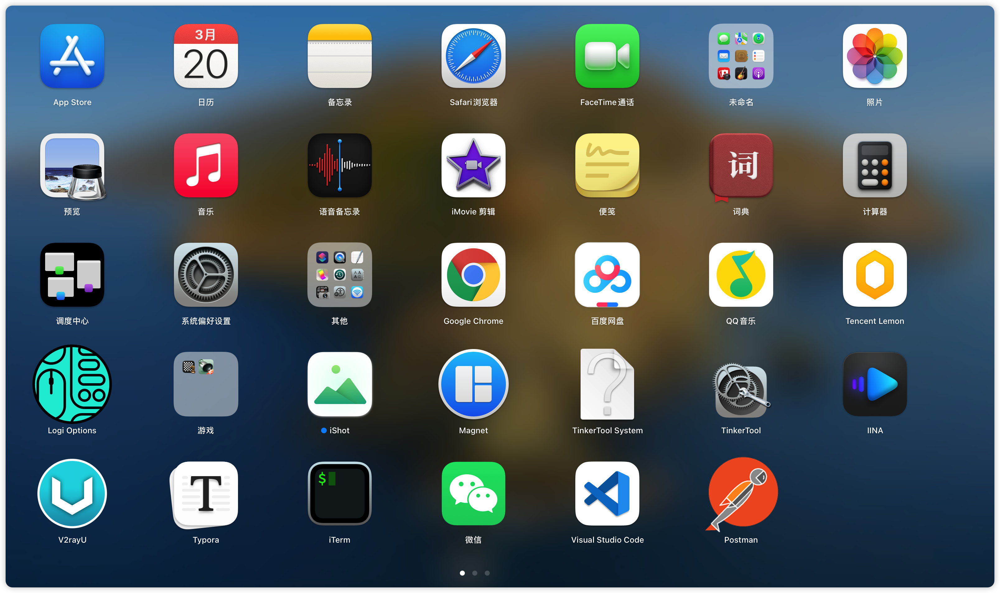
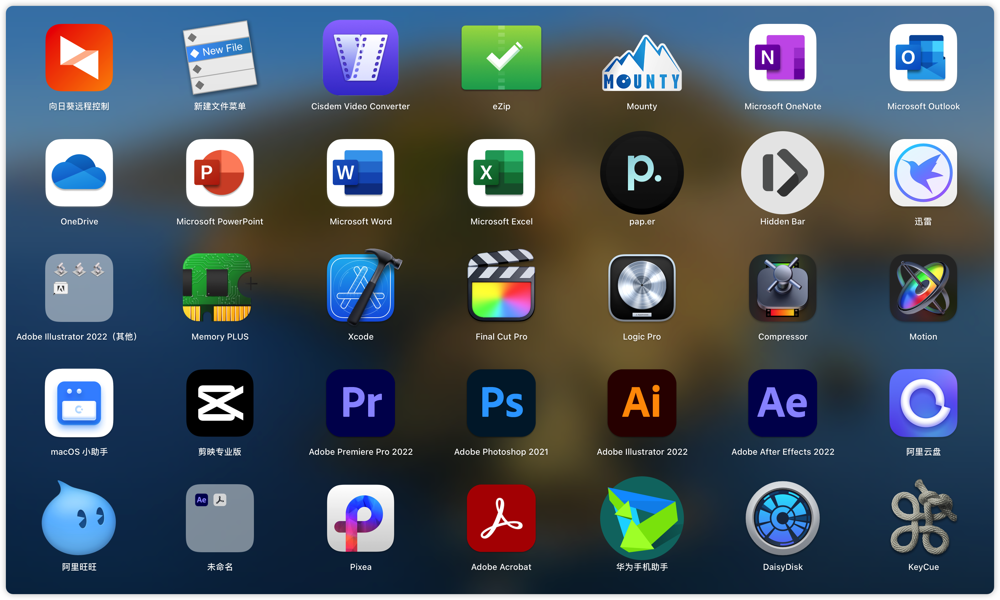
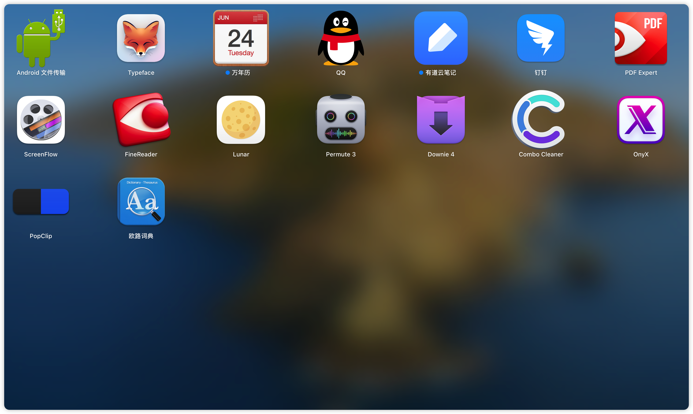

# MacOS 常用软件

##  ▲ 2022.10.08 看到的不错软件

### **Shazam**

苹果旗下「听歌识曲」是我接触所有**同类中最好的**，看电影时挂在后台，想要识别点击即可，可以通过 App Store 下载，**免费**。

### Runcat

非常有趣的菜单栏工具，当电脑 **CPU 占用率越高其动作越快**，可以选择多种「跑者」。商店可以下载，**免费**

###  Tickeys

打字音效，码字太无聊，这款配音软件有点意思。谷歌搜索下载，**免费。**

### **Maczip**

非常好用的 Mac 解压缩软件，各类都试过唯独喜欢这个，之前叫 eZip 改名后 UI 也美了好多。谷歌搜索下载，**免费。**

### **Gifski**

可以将视频转化成 GIF，非常好用。商店可以下载，**免费。**

### **PhtotScape X**

图片快速编辑软件，适合新媒体工作者，商店可以下载，**免费有内购。**

### Resilio Sync

这个算是「去中心化」文件同步分享工具，免费版只能下载他人全部文件，Pro 可以选择性下载同步，密钥您自己搜。谷歌搜索下载**，免费。**

### **Downie 4**

视频下载神器，支持平台更多，口碑更好。它姊妹 Permute 是非常不错的格式转换工具。**二者都需付费**。谷歌搜索下载，**视频下载的话还可以通过浏览器嗅探**，看这篇浏览器基础插件篇。

## ▲ 自己已安装的软件

### iShot Pro (截图工具)

> 下载路径：AppStore 购买
>
> 官网使用说明：https://www.better365.cn/ishot.html
>
> **`请一定要去官网看使用解说`**
>
> 截图快捷键： `Option + A`

注：iShot 截图自带 OCR (optical`/ˈɑːptɪkl/` character recognition 光学字符识别) 文字识别功能，截图的文字可以很容易得到。(tip：诚实的说 iShot 的 OCR 没有 白描准确。)

### 白描（OCR 光学字符）

### Magnet (分屏软件)

### IINA (视频播放软件)

### V2rayU (VPN 软件)

### Typora (markdown 编辑器)

### INNA 视频播放

### ScreenFlow 录屏

### Premute 视频转换

### Downie 下载所有网站的视频

### OnyX （mac系统维护工具）

>  下载：https://www.macwk.com/soft/onyx

