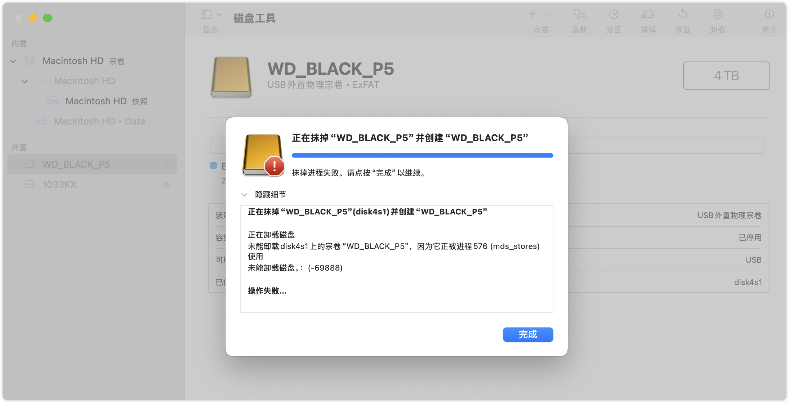
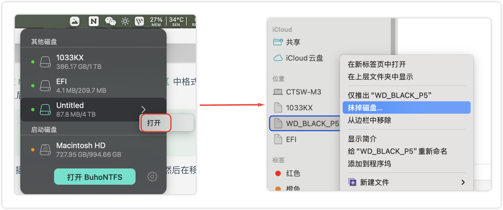
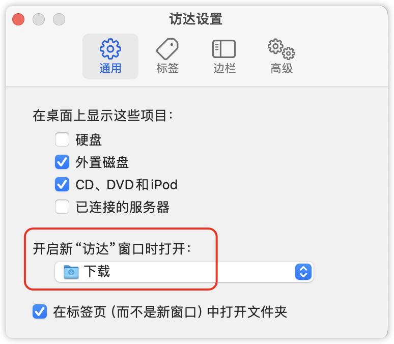
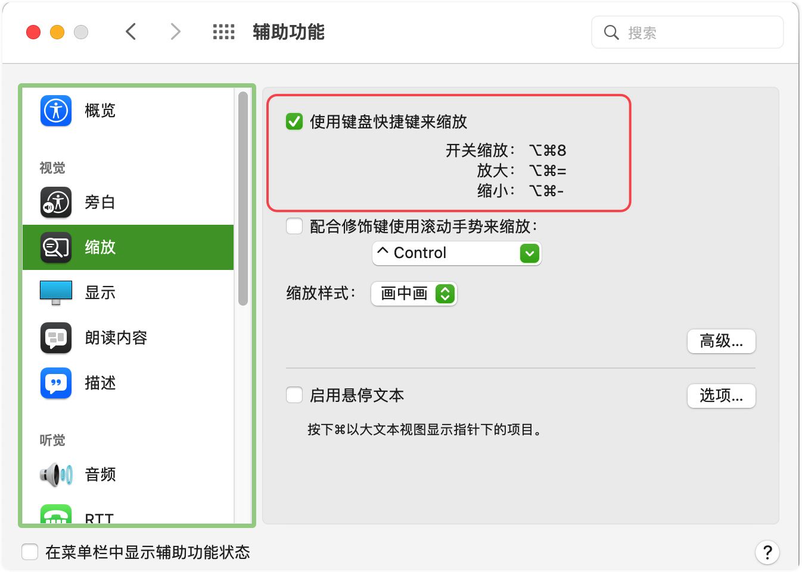
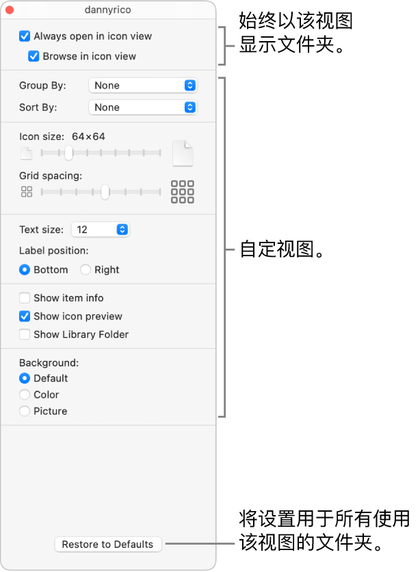
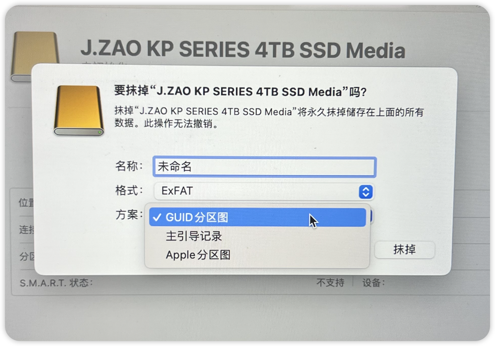
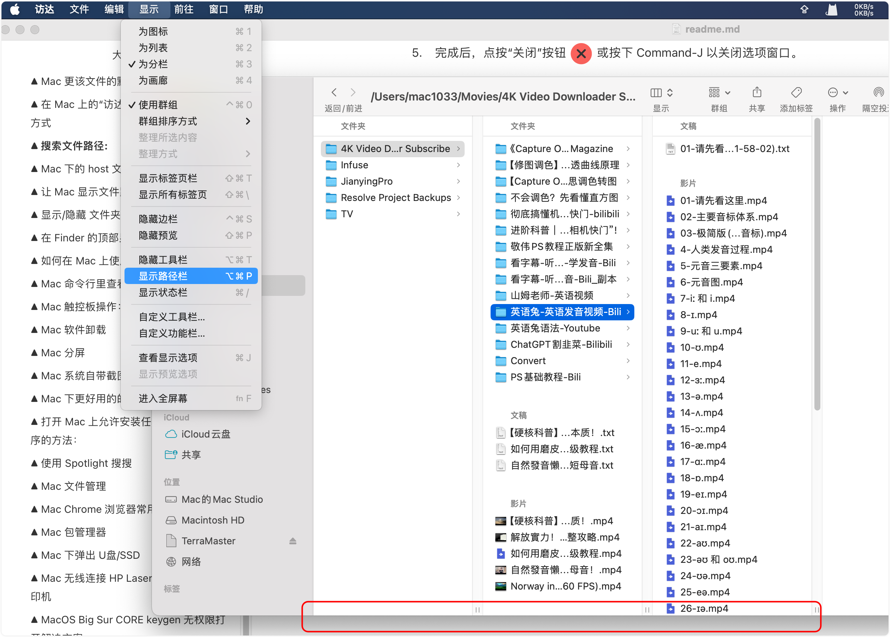
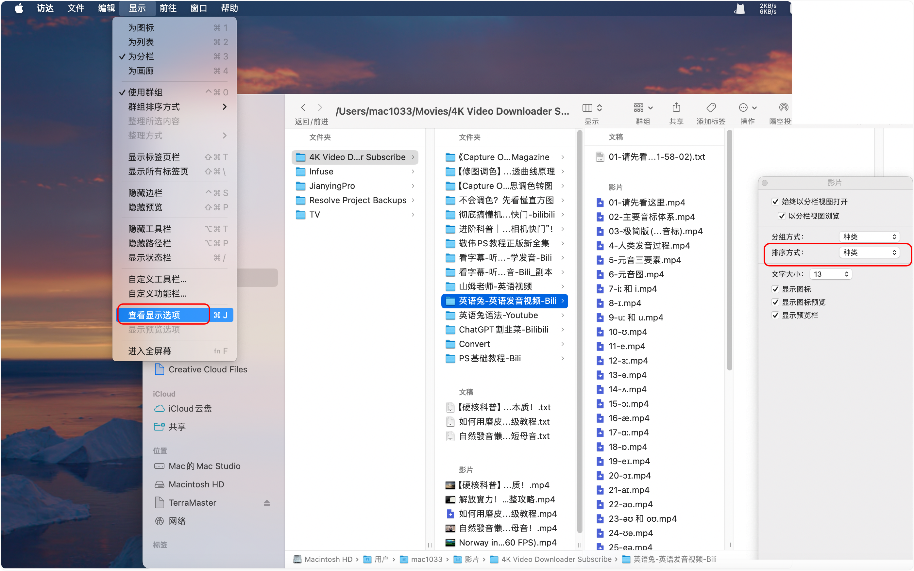

# MacOS 使用文档


## 生词(New Words)

| 单词    | 美式发音       | 词类 + 汉语释义                                              |
| ------- | -------------- | ------------------------------------------------------------ |
| remount | `/ˌriːˈmaʊnt/` | v. 重新挂载；重新安装                                        |
| cask    | `/kæsk/`       | n. 木桶；装酒的木桶<br />I need a cask of wine and some apples. 我需要一桶酒和一些苹果. |


## ▲ Mac 键盘符号说明:
| **`⌘`** |  Command |
| :-: |   ---   |
| **`⇧`** |  Shift |
| **`⌥`** |  Alt/Option |
| **`⌃`** |  Control |
| **`⇪`** |  Caps Lock |
| **`↩`** |  Return/Enter |
| **`⌫`** |  Delete |
| **`⌦`** |  向后删除键（Fn+Delete） |
| **`↑`** |  上箭头 |
| **`↓`** |  下箭头 |
| **`←`** |  左箭头 |
| **`→`** |  右箭头 |
| **`⇞`** |  Page Up（Fn+↑）|
| **`⇟`** |  Page Down（Fn+↓） |
| **`Home`** |  Fn + ← |
| **`End`** |  Fn + → |
| **`⇥`** |  右制表符（Tab键） |
| **`⇤`** |  左制表符（Shift+Tab） |
| **`⎋`** |  Escape (Esc) |
| **`⏏`** |  电源开关键 |

## ▲ Mac 程序界面快捷键

(1) 复制粘贴：`Command` + `C` --> `Command` + `V`

(2) 剪切粘贴：`Command` + `C` --> `Commadn` + `Option` + `V`

### (1) Command (`⌘`) 快捷键相关操作

| 单词 | 美式发音 | 词类 + 汉语释义     |
| ---- | -------- | ------------------- |
| quit | `/kwɪt/` | v. 退出；离开；停止 |
|      |          |                     |

| 新建访达窗口 | `Command` + `N` (new) |
| ---- | ---- |
| 新建标签页 | `Command` + `Tab` |
| 软件全屏 | `Command` + `Control` + `F` |
| 关闭程序 | `Command` + `Q` (quit) |
| 关闭当前窗口 / 关闭程序内部的多个标签页 | `Command` + `W` |
| 隐藏当前窗口 | `Command` + `H` |
| 最小化当前窗口 | `Command` + `M`(Mini size 最小化) |
| 切换程序 | `Command` + `Tab` |
| 关闭所有应用程序 | `Command` + `Tab` 显示所有打开的应用程序图标, 长按 `Command` 然后点击 `Q` 可快速关闭程序；遇到访达的时候会报错, 因为访达无法用 `Command` + `Q` 来关闭, 这个时候只需要再点击一下 `Tab`, 跳过访达就可以继续关闭程序了. |
| 强制退出 | `Command` + `Option` + `Esc` |

### (2) Option (`⌥`) 快捷键相关操作
| 一次关闭多个访达窗口 | `option` + 任意窗口的 x 号 |
| ---- | ---- |
| 快速查看文件的简介(属性) | `option + command + i` |
| 多层级文件夹展开 | 在Finder中，当文件夹以列表视图显示且排列方式为无时，<br />按住 Option 键，单击文件夹左侧的向右小箭头，即可快速展开该文件夹下的所有子文件夹和文件。 |
| 更快删除程序坞中的应用 | 常规方式是，鼠标左键选中应用按住一段时间至应用图标抖动。<br />你也可以直接按住 Option 键，使应用图标立即抖动，方便快速删除。 <br />- 此行及以下来源[此文章](https://juejin.cn/post/6944124897941520415) |
| 强制退出应用 | 住 Option 键，鼠标右键点击 Dock 栏，即可唤出「强制退出」选项。 |
| 快速设定文件永久打开方式 | 常规方式是，在文件上 **右键** - **显示简介** - **打开方式** - **全部更改**，<br />按住 Option 键后，右键菜单中变会出现 **始终以此方式打开** 选项，方便太多了。 |
| 复制文件 | 在 Finder 中，**按住 Option 键并拖拽文件**即可快速复制文件。 |
| 制作文件替身 | **同时按住 Option + Command 键并拖拽文件**可以快速制作该文件替身。 |
| 调整分栏比例 | 在 Finder 中，当文件夹以**分栏视图**显示时，拖动分栏线的同时按住Option键即可等比例调整所有分栏宽度。 |
| 显示资源库 | 打开 Finder，按住 Option 键，并在菜单栏单击“前往”按钮，将出现“资 源库”的快捷跳转链接。 |
| 全屏预览 | 选中一个文件后按 `Option + 空格键` 即可直接以全屏模式预览文件。比如一个txt文档 |


## ▲ MAC 格式化移动硬盘错误

*Time: 2024.11.07*

错误信息如下：

```md
正在抹掉“WD_BLACK_P5”(disk4s1)并创建“WD_BLACK_P5”

正在卸载磁盘
未能卸载disk4s1上的宗卷“WD_BLACK_P5”，因为它正被进程576 (mds_stores)使用未能卸载磁盘。：(-69888)
```



错误如上图，当前这个移动硬盘是 ExFAT 格式的，我按照苹果论坛这篇文章 [在 Mac 上的 “磁盘工具” 中将物理磁盘分区](https://support.apple.com/zh-cn/guide/disk-utility/dskutl14027/mac) 中格式化硬盘的操作，并不能格式化，错误仍然跟下图一样。但是下面的 "显示所有设备" 是需要打开的。我们下面正常格式化之后会用到。

> 1. 在 Mac 上前往 “磁盘工具” App 。
> 2. 选取 “显示”>“显示所有设备”，然后选择边栏中要抹掉的容器。

我从 google 上搜索没检索到可以用的方法，然后我打开电脑安装的 BuhoNTFS 插件，从软件里打开下面的移动硬盘，然后在移动硬盘的名称上抹除磁盘，如下图：



上面这种方式是可以抹除的，不知道是不是因为 BuhoNTFS 的权限给的高，在这里抹掉磁盘就没有问题，抹除后重新在磁盘工具中格式化即可。


## ▲ 在 Mac 上设置远程登录

```md
笔记来源：https://support.apple.com/zh-cn/guide/mac-help/mchlp1066/mac
Add: 2024.08.01
```

1. 在 Mac 上，选取苹果菜单  >“系统设置”，点按边栏中的 “通用” ，然后点按右侧的 “共享”。（你可能需要向下滚动。）

2. 打开 “远程登录”，然后点按右侧的 “信息” 按钮 。

3. 按需打开 “允许远程用户对磁盘进行完全访问”。

4. 点按 “允许访问” 弹出式菜单，然后执行以下一项操作：

    - *允许所有人登录你的电脑：*点按 “允许访问” 旁边的弹出式菜单，然后选取 “所有用户”。

    - *选取可登录你电脑的用户：*点按 “允许访问” 旁边的弹出式菜单，选取 “仅这些用户”，点按列表底部的添加按钮 ，选择可远程登录的用户，然后点按 “选择”。

        “用户与群组” 包含你 Mac 上的所有用户。“网络用户” 和 “网络群组” 包含你网络上的所有人。

        若要从列表中移除用户，请选择用户，然后点按移除按钮 。


## ▲ 开启新 "访达" 窗口时更改默认显示的 "最近使用" 标签页



## ▲ Mac 系统缩放



## ▲ Mac 一键返回到桌面

Method (1)：快捷键返回桌面: `Fn + F11`

Method (2)：在 macOS 14 系统之后，直接在 Docker(程序坞) 边上的空白点击一下桌面，也可以快速回到桌面。


## ▲ Mac 刷新 DNS 解析
(1st) 在 "iTerm/终端" 中输入: 
```shell
sudo Killall -HUP mDNSResponder 
echo macOS DNS Cache Reset
```

(2nd) 第二种方法是如果不想使用命令行可以安装 PowerMyMac 
+ 打开软件后点击 "TookKit (工具套装)" --> "Maintenance (维修, 保养)" 点击 "View" --> 单击左侧的 "Flush DNS" 然后点击右侧的 "Clean" 完成.


## ▲ 打开没有授权的 App

若要覆盖安全性设置, 从而仍打开应用：在 Mac 上的 "访达" 中, 找到想要打开的应用. 请勿使用启动台来执行此操作. 启动台不允许访问快捷菜单. 

- 按住 `Control` 键点按应用图标, 然后从快捷键菜单中选取 "打开". 点按“打开


## ▲ MacOS 下输入法选择
Hint: 我个人建议使用 - 搜狗/百度输入法

- 注：原因是我们在 windows 上使用的大小写切换键(caps lock)，在 macOS 中是用来切换自家的 中文/英文 输入法的，这点和 windows 不同，这点不同还可以接受无非就是把大小写切换键换成了苹果系统自带的 中文/英文 输入法切换键。
  
  但此处 macos 还有一个致命的缺点：因为 caps loack 按键被占用，我们怎么在 macos 系统的英文输入法下快速切换大小写呢？

  苹果的操作方式是*长按 shift 键*，是的，你妹听错，就是长按 shift 键，这个操作逻辑简直了...... 。关于这点，在网上有一些教程是教你安装软件然后改键的，但个人认为最简单的方式还是安装搜狗/百度中文输入就可以搞定了，虽然会有一点点不安全，但是这也是没办法的事情；

  如果你不想使用搜狗/百度这些输入法，要是懂双拼输入的话，那 github 也有很多好用的开源双拼输入法可够选择。

## ▲ 隐藏/显示程序坞快捷键
`Command + option(alt) + D`


## ▲ MacOS Dock 栏自动显示和隐藏取消延迟
使用OS X的时候都会选择将Dock隐藏（可以在系统偏好设置—Dock中选择），等使用时将光标向下划Dock会自动弹出显示。这个显示或隐藏会有一点点（大概1秒左右）的延迟，使用下面的方法可以消除这个延迟:

打开--终端(或 iTerm), 输入如下代码

`defaults write com.apple.Dock autohide-delay -float 0 && killall Dock`

当 Dock 再次隐藏或显示时会立即执行

如想恢复默认的延迟速度, 在终端中输入以下代码即可:

`defaults delete com.apple.Dock autohide-delay && killall Dock`


## ▲ Mac 更该文件的默认显示方式
在当前文件上单击右键 --> '显示简介' --> 打开方式 (点击选择需要的使用的默认软件) --> 点击 '全部更该' 


## ▲ 在 Mac 上的“访达”中更改文件夹的显示方式
> https://support.apple.com/zh-cn/guide/mac-help/mchldaafb302/mac
>
> 注意 Apple 官网这个并全部准确。

你可以自定义文件夹视图，例如，在图标视图中设定图标大小和网格间距。你还可以选择将视图始终用于该文件夹，以及用于其他文件夹。



1. 在 Mac 上，点按[程序坞](https://support.apple.com/zh-cn/guide/mac-help/aside/glosc3855c74/13.0/mac/13.0)中的“访达”图标  以打开“访达”窗口。

2. 选择要自定视图的文件夹，在当前文件夹列表空白处右键，选择 `查看显示选项` 或按下 Command-J。

3. 设定自己想要的 文件夹视图。

    每种视图的选项都有所不同。例如，你可以在列表视图中指定最近日期的显示方式，还可以在画廊视图中隐藏文件名。

4. 选择是否将此视图始终用于该文件夹和用于其他文件夹。

    - *始终将此视图用于该文件夹：*选择“始终在此打开”复选框。如果你想该文件夹包含的子文件夹也以此视图打开，请选择“以…浏览”复选框。

        *【注】*如果子文件夹仍以不同的视图打开，请选择该子文件夹，选取“显示”>“查看显示选项”，然后取消选择“始终以…打开”和“以…浏览”复选框。必须为主文件夹选择复选框，并为子文件夹取消选择复选框。

    - *将这些设置用于使用相同视图的任何文件夹：*点按“用作默认”。

5. 完成后，点按“关闭”按钮  或按下 Command-J 以关闭选项窗口。


## ▲ 苹果电脑格式化移动硬盘为 ExFAT

### Mac 上的“磁盘工具”中可用的分区方案

在 Mac 上的“磁盘工具”中抹掉和格式化储存设备时，系统会提示你选取要使用的方案。“磁盘工具”支持以下方案：

- *GUID 分区图：*为所有基于 Intel 和 Apple 芯片的 Mac 电脑选取此选项。部分基于 Microsoft Windows 的较新电脑还可以使用此方案。
- *主引导记录：*为兼容所有基于 Microsoft Windows 的电脑选取此选项。
- *Apple 分区图：*为兼容基于 PowerPC 的早期 Mac 电脑选取此选项。




## ▲ 搜索文件路径:

Mac 下 `/usr/local/...` 默认是隐藏状态, 所以需要打开 `/usr/local/...` 并更改文件的话, 只需打开 `Finder`, 按下 `Command + shift + G`, 在目录中搜索所需要的路径便可.


## ▲ Mac 下的 host 文件查找方式:
打开 Finder, 按快捷键组合 `Shift` + `Command` + `G` 查找文件, 输入 `/etc/hosts` 确认前往.

## ▲ 在访达中显示文件路径:




## ▲ 访达（Finder）中如何让文件按照数字大小排序？

访达 -> 显示 -> 查看显示选项 -> 排序方式：种类。

可以看到 mp4 视频的文件名是按照数字大小排序了。



## ▲ 显示/隐藏 文件夹中的 默认隐藏文件

使用快捷键：`Command + Shift + .` 来快速（在 Finder 中）显示和隐藏隐藏文件. 

## ▲ 在 Finder 的顶部显示文件路径:

打开终端(Terminal)输入: `defaults write com.apple.finder _FXShowPosixPathInTitle -bool YES` 便可在 Finder 的顶部显示路径了, 在显示的路径上右键, 还可以直接访问路径中的任意一层.

复制当前文件路径的快捷键: `Option + Command + C`.


## ▲ [如何在 Mac 上使用 "活动监视器"](https://support.apple.com/zh-cn/HT201464)
"活动监视器" 显示了 Mac 上正在运行的进程, 以便您可以管理这些进程并查看它们对 Mac 活动和性能的影响. "活动监视器" 它是一种任务管理器, 可让您查看应用和其他进程对您的 CPU、内存、能耗、磁盘和网络使用情况的影响. 

您可以从 "应用程序" 文件夹的 "实用工具" 文件夹中打开 "活动监视器"，或者使用 "聚焦" 进行查找. 


## ▲ Mac 命令行里查看 ip 的命令:
在终端中输入 `ifconfig` 在给出的信息中心查看 `inet` 后面的 `ip` 便是. 如下:

```sh
  en0: flags = 8863<UP,BROADCAST,SMART,RUNNING,SIMPLEX,MULTICAST> mtu 1500
      ether ac:bc:32:79:8f:61
      inet6 ......
      inet 10.4.23.150 ......
```

## ▲ Mac 触控板操作：
在 "文件夹/文件上" 双手按下触控板既可弹出操作文件的小弹框

## ▲ Mac 软件卸载
`腾讯柠檬` / `App Cleaner & Uninstall` 

腾讯柠檬是免费的，App Cleaner & Uninstall 从 https://macked.app/programs 下载破解版的 

## ▲ Mac 分屏

(1) 系统自带分屏操作: 分屏在 MacOS 里叫 Split View. 支持 Split View 的 app 中, 鼠标长按全屏键（就是每个窗口左上角的关闭、最小化、全屏这三个中的第三个）3秒, 就出现啦. 

(2) 更方便的操作是使用分屏软件 `Magnet` (magnet `/ˈmæɡnɪt/` n. 磁铁)，注意这个软件是收费的，如果不想使用付费下载，可以从 https://macked.app/magnet-pro.html 下载，但是软件本身也不贵，建议购买正版。

软件快捷键说明: 
- 左半屏: `Control(^) + Option(⌥) + 左箭头(←)`
- 右半屏: `Control(^) + Option(⌥) + 左箭头(→)`

## ▲ Mac 系统自带截图快捷键

`Command + Shift + 3` 截取整个屏幕, 保存图片在桌面

`Command + Shift + 4` 选取部分屏幕区域, 保存图片在桌面 

先 `Command + Shift + 4` 再按空格, 可以对指定的窗口或者菜单截屏

- 以上快捷键, 加上 Ctrl, 可以把截屏保存在剪贴板. 

## ▲ Mac 下更好用的的截图软件

 iShot Pro (可以截长图)，但是 pro 版是收费的，app store 中 iShot 是免费的。

## ▲ 打开 Mac 上允许安装任何来源的应用程序的方法：

打开终端 --> 输入: `sudo spctl --master-disable` 然后回车输入密码. 

- 打开偏好设置 --> 安全性与隐私 , 就可以看到有 `任何来源` 的选项了

## ▲ 使用 Spotlight 搜搜

打开 spotlight 的快捷键: `Command + 空格键(space bar)`

快速打开 spotlight 中搜索的文件的路径 `Command + 回车键(enter/return)

## ▲ Mac 文件管理

文件夹中的 4 种文件显式方式如下图，依次为：


1. 图标

2. 列表

3. 分栏

4. 画廊

    

**快速预览当前文件**:

+ 鼠标移动到当前文件上, 点击键盘的 `空格键` 就可以快速预览当前文件；还可以点击上下左右键快速切换文件, 找到当前需要的文件后, 再次点击空格即可关闭预览. 

- "文件/文件夹"重命名: 当前文件/夹点击选中后, 点击回车键(enter)即可快速修改文件或文件夹名。
- Spotlight 聚焦搜索 ('command + 空格' 唤醒聚焦搜索):
    - 输入搜索找到搜索内容后, 点击一下时打开；如果想打开文件所在的路径, 按下 Command + 双击搜索框下的文件名即可. 
- 显示文件夹中的隐藏文件快捷键：`shift + command + .`

## ▲ Mac Chrome 浏览器常用快捷键:

- Command + L = 光标移动到地址栏
- Command + R = 刷新页面
- Command + W = 关闭当前标签
- Command + D = 收藏当前页面
- Command + option + L = 打开下载内容页面
- Command + option + i = 开发者工具
- 空格 = 屏幕下滚一页

## ▲ Mac 包管理器

见当前同级目录 `./MacOS 包管理器 Homebrew`

## ▲ Mac 下弹出 U盘/SSD

直接在需要弹出的 SSD 上邮件，选择 "推出 XXX"；或选中要弹出的 U盘/SSD 然后按下 `Command` + `E`


## ▲ Mac 无线连接 HP Laser MFP 136nw 打印机

- (1) 首先确保打印机已启用 Wi-Fi Direct(wifi 直连).
- (2) 得到 Wi-Fi Direct 名称和密码(网络密钥),
  请按住打印机控制面板上的菜单按钮(`...`), 找到 `4 网络(NewWork)`
  接着按圆圈上 "上/右/下/左" 键中的 `左(箭头)` 键, 直到找到 --> `Wi-Fi`
  后, 按中间的 `OK` 键进入, 接下来仍按 `左(箭头)` 键, 找到 --> `Wi-Fi Direct`
  进入找到密钥, 然后记录(tip: 此机密钥为: Th0v8Gfz88 )
- (3) 打开 Mac, 把无线网络切换连到打印机. 
- (4) 将打印机作为 AirPrint 打印机添加至Mac. 打开 `系统偏好` 设置,
  并在 Mac 上选择打印机与扫描仪(打印与扫描). 选择 + 可显示打印机列表.
  选择打印机后, 等 Mac 自行设置完成后, 即可.

## ▲ MacOS Big Sur CORE keygen 无权限打开解决方案

使用UPX：
1. 安装upx
```ps1con
brew install upx
```
2. 使用UPX
```text
sudo upx -d /Applications/CORE\ Keygen.app/Contents/MacOS/CORE\ Keygen
```
3. 再打开CORE Keygen.app就可以使用了。


## ▲ 解决 App 打开时提示已损坏无法打开的问题
先打开 `系统偏好设置 -> 安全与隐私 -> 通用` 选项卡，检查是否已经启用了 `任何来源` 选项。

如果没有这个选项，复制以下面的命令：

```bash
sudo spctl --master-disable
```

打开`终端`：将刚刚复制的命令粘贴到终端中。然后按下键盘的回车键（return），输入密码，恭喜您，`您已成功开启任何来源`。

### 2. 移除应用的安全隔离属性

在终端中输入以下命令：`sudo xattr -d com.apple.quarantine`

然后打开 访达 - 应用程序 找到对应的应用程序拖进去，注意上面 quarantine 和应用之间有一个空格。

一般情况下，多余的扩展属性都可以清除（个别应用例外）：

可以直接输入：`sudo xattr -cr /Applications/*`

> macOS 提示：“应用程序” 已损坏，无法打开的解决方法总结
>
> https://sysin.org/blog/macos-if-crashes-when-opening/


## ▲ Mac 上移动硬盘无法拷贝或删除文件的最佳解决方案

~~点击 **软件列表图标** --> **其他** --> **磁盘工具** --> 左侧垂直栏点击移动硬盘选中，然后点击当前窗口右上角的 **抹去**，在当前较小的弹框的：格式：选择 ExFAT. (注意: 这会格式化硬盘，请提前备份硬盘。)~~

**Q：移动硬盘 / U盘插入Mac，可以打开里面的文件，却不能拷贝/删除/新建文件夹。怎么解决呢？**

出现这种情况很有可能是因为你的硬盘是 NTFS 格式。

**方法：给 Mac 装个 NTFS 插件**

插件安装后，在「系统偏好设置」里面可以查看到。

我自己是从闲鱼购买了 Paragon 和 Texture, 2023.11.06 闲鱼购买了 Texture, 激活码见 Google Keep 笔记。

| 单词    | 美式发音      | 词类 + 汉语释义 |
| ------- | ------------- | --------------- |
| paragon | `/ˈpærəɡən/`  | n. 模范；典范   |
| texture | `/ˈtɛkstʃər/` | n. 质地；纹理   |


## ▲ 关闭百度网盘后台(一到多个)同步进程 baiduNetdiskSync

打开 Finder, 按快捷键组合 `Shift` + `Command` + `G` 查找文件, 输入 `/Applications/BaiduNetdisk_mac.app/Contents/PlugIns/ ` 把下面的文件全部删除。
- 注：每次升级百度网盘后都要再次删除。

