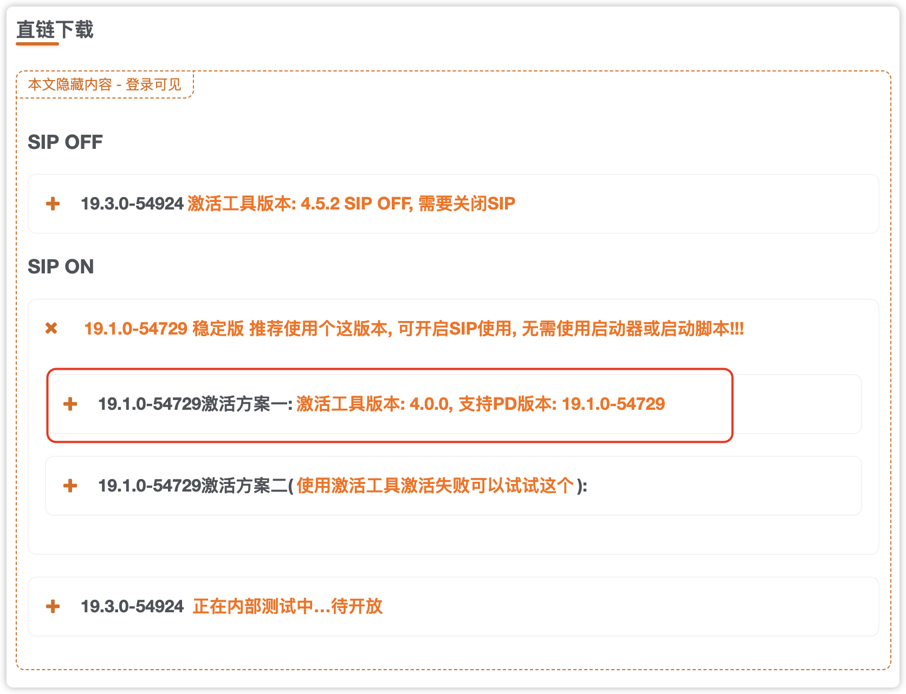
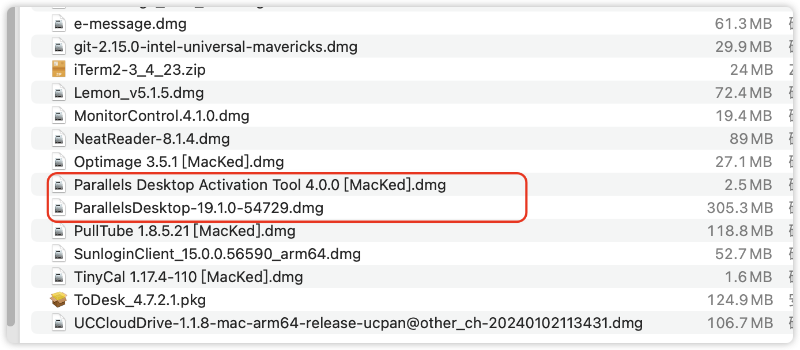
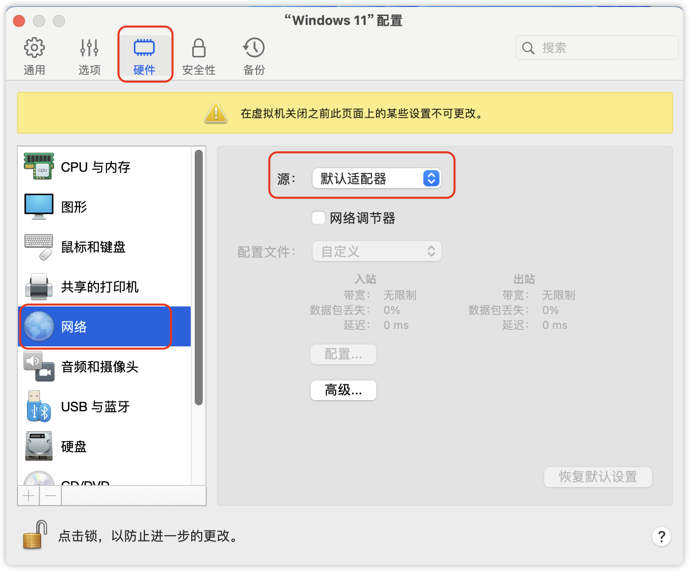

# Parallels Desktop 19.1.0 破解版

*Edited: 2024.03.18*

> 笔记来源：https://macked.app/parallels-desktop.html

下载的版本：Parallels Desktop 19.1.0-54729 破解版 – PD虚拟机激活工具/破解补丁

下载安装包和破解包，先安装，安装一上来提示会让你下载升级版，直接 x 掉就行，然后接着安装，按照要就下载 win11, 安装完 win11 之后会让激活或者注册，此时不用管，把窗口都关闭；接着打开破解包，安装破解包，首先点击破解包安装，接着拉入到右侧的应用程序内。

## ▲ 解决安装 win11 后无网络的问题

# ~~安装 Parallel 和 win10~~

## ~~购买标准版 Parallels Desktop~~

~~购买链接地址：https://pd.macsc.com/~~

~~机器码：C02Q5SK5G8WP~~

~~标准版激活码：6748C582~~

## ~~购买信息~~
~~订单名称：Parallels Desktop标准版~~

~~订单编号：2022080608572491251~~

~~邮箱：forownwang@gmail.com~~

~~已绑定机器序列号：C02Q5SK5G8WP~~

## ~~安装步骤~~ 
~~见上面的购买链接地址~~

~~安装 win10方式：我自己是是下载的 win10 镜像(Intel 芯片)~~

~~安装完毕后会提示登录 parellel，登录即可~~
