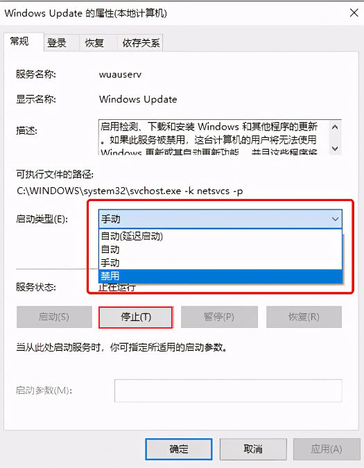
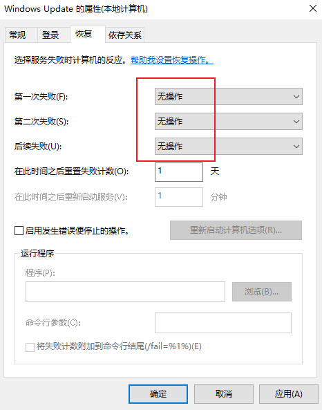
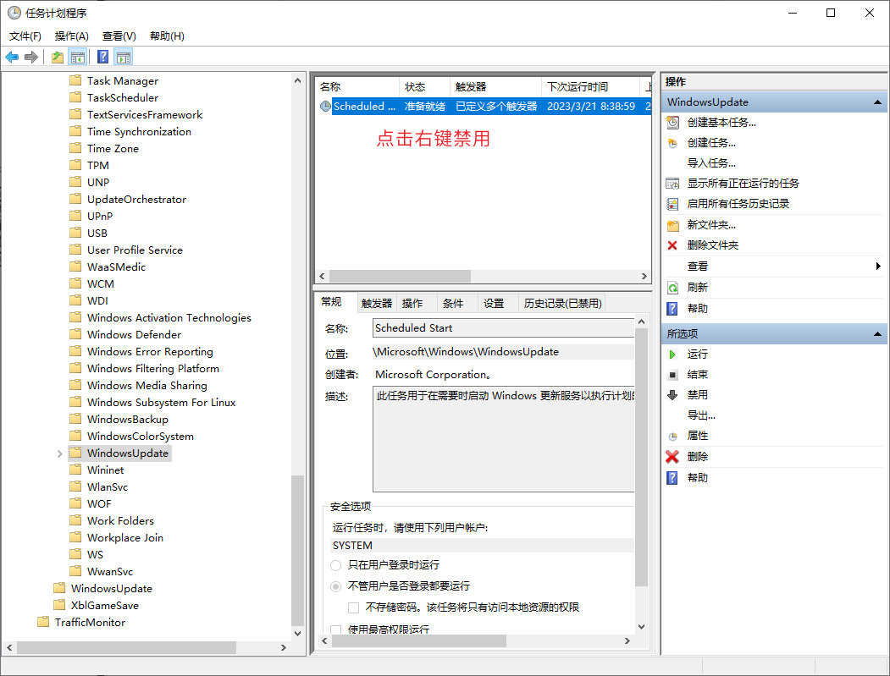
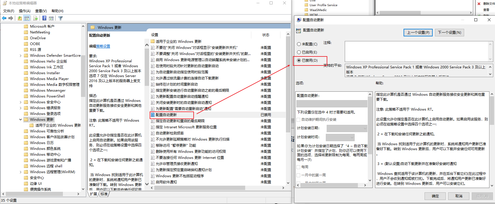

#  Windows 系统操作


## ▲ DOS 基本命令
1. 查看目录内容命令 `dir`
2. 指定可执行文件搜索目录 `path`
3. 创建目录命令 `md`
4. 改变当前目录命令 `cd` (一般都是进入到某个文件夹 cd xxx文件夹名)
5. 删除子目录命 `rd`
6. 改变当前盘符命令 `C:`
7. 文件复制命令 `copy`
8. 显示文本文件内容命令 `type`
9. 更改文件名命令 `ren`
10. 删除文件命令 `del`
11. 创建文件夹 `mkdir`
12. 返回到当前文件的根目录 `cd\`
13. 返回到上级目录: `cd..`
14. 删除文件夹命令 `rmdir`


## ▲ Win11 关闭 "显示更多选项"

点击 `Windows` 图标，在弹框中输入 cmd, 右键以管理员身份运行：

```sh
    # 第一步 copy 下面的命令，按 enter 执行
    reg.exe add "HKCU\Software\Classes\CLSID\{86ca1aa0-34aa-4e8b-a509-50c905bae2a2}\InprocServer32" /f /ve

    # 第二步，copy 之后 run, 然后 enter 执行
    # 即：重启资源管理器
    taskkill /f /im explorer.exe & start explorer.exe
```


## ▲ Win11 界面还原成 Win10 的方式

~~*Added: 2023.07.11*~~

~~使用 Explore Patcher (浏览器补丁程序)，下载地址如下：~~

> ~~https://github.com/valinet/ExplorerPatcher~~

~~使用教程如下:~~

> ~~https://www.51cto.com/article/707228.html~~


## ▲ Windows 系统截屏快捷键

- win10 系统截屏快捷键: Win+PrtSc
- win7: 点击左下角 `开始` 图标 --> 所有程序 --> 附件 --> 截图工具

## ▲ 如何打开注册表编辑器
Win + R 调出 “运行” 对话框， 输入 “regedit”


## ▲ Win 10 以管理员身份运行 cmd
在左下角的 windows 图标上点击右键, 点击 `搜索` -- > 在弹出的搜索框中输入 `cmd`, 搜索到匹配后, 在当前窗口的右侧中, 点击以 "管理员身份运行".

方法二：按下 `win + R` 打开运行窗口，输入 `cmd`，然后按 `Ctrl + Shift + Enter` 。


## ▲ Win 10 关闭系统更新
### 方法一：系统设置
在桌面点击鼠标右键（或者：点击左下角的开始菜单进入设置） --> 个性化 --> 在当前弹框中，点击左上角的 "主页" --> 点击(最后一行的) "更新与安全" --> 点击当前窗口中间最低部的 "高级选项（其他更新控制和设置）" --> 在当前窗口中把 "更新选项" 和 "更新通知" 的选项都关闭。

### 方法二：禁止Update服务
按下 `Win+R`组合键打开 **运行窗口**，输入 `services.msc` 启动 Windows 的服务窗口。

从中找到 "Windows Update" 双击打开，先停止服务状态后再将其中的启动类型设置为【禁用】。



在【恢复】选项卡中，将第一次失败、第二次失败和后续失败都设置为无操作。



### 方法三：关闭任务计划
按下 `Win+R` 组合键打开运行，输入命令 `taskschd.msc`，并点击下方的“确定”打开任务计划程序。

从任务计划程序库中依次展开任务计划程序库 -> Microsoft -> Windows -> WindowsUpdate，把里面的项目都设置为 [ 禁用 ] 就可以了。



### 方法四：组策略禁用
按下 `Win+R` 组合键打开运行，输入命令 `gpedit.msc`，依次展开 `计算机配置 -> 管理模板 -> Windows组件 -> Windows更新`，在右侧找到 `配置自动更新`，双击将其设置为“已禁用”。




## ▲ Windows 系统提示说这些字符不允许用在文件名或者目录中:
+ Tilde (`~`)
+ Number sign (`#`)
+ Percent (`%`)
+ Ampersand (`&`)
+ Asterisk (`*`)
+ Braces (`{ }`)
+ Backslash (`\`)
+ Colon (`:`)
+ Angle brackets (`< >`)
+ Question mark (`?`)
+ Slash (`/`)
+ Plus sign (`+`)
+ Pipe (`|`)
+ Quotation mark (`"`)


## ▲ Win10 调出任务管理器的快捷键: Ctrl + shift + Esc


## ▲ 如何更改 win10 的 powershell 为 cmd ？
https://www.ithome.com/html/win10/282909.htm  
答: 打开注册表编辑器，定位至： \HKEY_CLASSES_ROOT\Directory\Background\shell\Powershell\command


## ▲ Win10 禁止軟件開機啟動？
答: 屏幕左下角 windows 圖標右擊 --> 任務管理器 --> 啟動 --> 找到對應的軟件右擊 "禁止"


## ▲ 在 Windows 10 中显示桌面图标
答: 依次选择 “开始” 菜单  > “设置”  > “个性化” > “主题” > “桌面图标设置”。

## ▲ 如何删除Windows.old文件夹?

答: windows10 升级后产生的 Windows.old 文件夹，先按 C 盘属性-磁盘清理-清理系统文件流程清理一遍，剩下Windows.old文件夹残留，手动删除提示“权限不够”不允许删除，再进入该Windows.old文件夹属性授权，但是依然说授权不够。

了解到您遇到了关于Windows.old文件夹 。该文件夹会在10天后自动删除。您无需手动删除该文件夹。


## ▲ Win10系统 Win+E 快捷键改回打开我的电脑方法
答: 1、打开“这台电脑”  --> 点击左上方菜单 "查看" --> 在下拉菜单右边打开 "选项" --> 常规 -下的 "打开文件资源管理器时打开"点击下拉改为 "此电脑/本机" -- 应用 -- 确定。

## ▲ win10 更改密钥

答: 桌面"我的電腦"--> 右鍵“屬性” --> 右下角更改密鑰。


## ▲ WIN10系统如何完全获管理员权限
答:


## ▲ Win10 外接双显示屏遇到的问题？
答: GTX1060 支持 DVI 和 HDMI 的接口分别外接一个显示器，但是音频线必须要连接在 DIV 接口的显示屏上，如果连接在 HDMI 的接口上, 另外一个显示屏提示"电缆没有连接"


## ▲ 设置环境变量:
答: 此电脑 --> 属性 --> 高级系统设置 --> 高级 --> 环境变量 -->


## ▲ win10 版本号在哪里查看 ？
答: WIN+R 调出运行工具 --> 输入" dxdiag" 然后回车.


## ▲ Win10 待机不休眠方法:
答: 桌面右键 --> 个性化 --> (左侧)锁屏界面 --> (右侧)屏幕保护程序设置 --> 更改电源设置 --> 更改计算机睡眠时间 --> 使计算机进入睡眠状态: 从不。 保存。


## ▲ 打开/关闭 Windows Defender
答: 选择“开始” 按钮，然后依次选择 “设置”  > “更新和安全” >“Windows 安全中心” > “防火墙和网络保护”。

选择网络配置文件，然后在“Windows Defender 防火墙”下，将设置切换为“开”或“关”。

## ▲ Win10 字体文件夹路径：

A: `C:\Windows\Fonts`


## ▲ win10 分屏
**一分为二**: 只要在当前的窗口下按 [Widnows 键 + `← / →`]. 窗口就会自动向左或向右缩小为原来的一般. 然后你可以选择其他的正在运行的软件或者文档工具, 以填充剩下的空白屏幕.

**一分为四**: 在「两分屏」下，你还能通过按下 「Windows 键 + ↑/↓」。开启 第3个窗格甚至4个窗格。 每个窗格占 1/4 分屏。换言之，任意一个普通窗口，你想把它放到屏幕左上角，作为 1/4 分屏窗口话。只要连续按下 「Windows 键 + ← + ↑」即可   


## ▲  Windows 快捷键
1. 基本操作快捷键
    + `Ctrl + Z`：撤销
    + `Ctrl + Y`：重做
    + `Ctrl + S`：保存
    + `Ctrl + F`：查找
    + `Ctrl + F3`：查找上一个
    + `F3`：查找下一个
    + `Ctrl + R`：替换
2. 标选中快捷键
	
	+ `Shift + ← / → (方向键)`：光标向左/向右选中一个字符
	
	+ `Ctrl + Shift + ← / →` (方向键)：光标向左/向右选中一个单词
   + `Shift + Home`：光标从当前位置一直选中到行首
	+ `Shift + End`：光标从当前位置一直选中到行尾
	3、光标跳转快捷键
   + `Home`：光标跳转至行首
   + `End`： 光标跳转至行尾
    + `PgUp`：光标跳转至首行
    + `PgDn`：光标跳转至末行
    + `Ctrl + ← / →` (方向键)：光标向左/向右跳转一个单词
    + `Ctrl + Home`：光标跳转至首行首个字符前面(文件开头)
    + `Ctrl + End`：光标跳转至末行最后一个字符后面(文件结尾)

## ▲ win7 / win10 常用軟件推荐：

- (内存)監控軟件:
    + (1) TrafficMonitor (https://github.com/zhongyang219/TrafficMonitor/releases/tag/V1.80.3)
    + (2) Wise System Monitor
- 調節色溫 -- f.lux / win10 夜灯功能
- 安全软件+清理垃圾 -- 火絨
- 系统清理工具
    + Dism++ (http://www.chuyu.me/zh-Hans/index.html)
- 搜索軟件 -- everything / Listary
- 卸載工具 -- Geek uninstaller
- 數學公式編輯器 -- Mathtype (一般都是用網頁的，這個實際上並用不到)
- GIF录屏 -- ScreenToGif
- 压缩软件 -- Bandizip / 7ZIP
- 视频播放 -- Potplayer / VLC
- 下载工具 -- 百度雲盤 /  瀏覽器
- 文件恢复 -- DiskGinus；收费：EasyRecovery
- 剪切板加强工具 -- Ditto
- pdf 转 word -- ABBYYFineReader / smallPDF
- 英语词典 -- Google translate + 欧路词典
- 强制关闭卡死程序 -- superF4
- nTrun: Win + R 快捷启动工具 (https://zhuanlan.zhihu.com/p/35722313)
- 跨平台 todolist -- 小黄条
- Markdown 编辑器 -- Typora
- 截圖工具 -- Snipaste
- 壁纸切换软件:
    - win10 系统自带的主题，可以把多个主题的图片放到一个主题中即可。
    - ( John's Background Switcher): https://johnsad.ventures/software/backgroundswitcher/

- 录屏软件 -- oCam / ScreenToGif (开源便捷式捕获工具)
- 磁盘分析工具 -- TreeSize / WizTree


## ▲ win10 开机有两个系统怎么删除其中一个
1. 按下 `windwos + R` 快捷键打开运行窗口输入 `msconfig` 然后点击确定。
2. 在打开的**系统配置**窗口选择【引导】选项。 如图所示可以看到多**个系统**启动引导。
3. 选取没用的**系统**引导选项，再点击**删除**。

## ▲ 什么是Sysprep？有什么用？

Sysprep 应该为（system preparation 系统准备) 

系统准备工具（Sysprep）是一项技术，您可以将其与其他部署工具一起使用来安装Microsoft Windows操作系统，而无需管理员或技术人员的干预。Sysprep通常在大规模部署期间使用，因为这样会使管理员或技术人员在单个计算机上交互式安装操作系统太慢且成本很高。

基本上，它使您可以“准备”用于部署OS的系统。-所有正常的安装任务在安装过程中都会自动完成，因此您可以部署安装并轻松进行。

Sysprep实际上是为公司环境创建的映像，用于自动Windows安装，该映像允许创建唯一的SID。这在Active Directory域中非常重要，因为登录名和SID绑定在一起。在Active Directory之外，sysprep并不是非常有用。

如果您想在家中使用sysprep，则没有任何意义，因为它不会给您带来任何实际好处，除非您在家中运行AD（可疑）。Sysprep适用于系统管理员，而不是最终用户。

## ▲ msiexec.exe

msiexec.exe，系统进程，是Windows Installer的一部分。用于安装Windows Installer安装包（MSI），对系统的正常运行是非常重要的，一般在运行Microsoft Update安装更新或安装部分软件的时候出现，占用内存比较大。

## ▲ C 盘清理

#### 0. 安装 WizTree 查看 C 盘各个文件的大小

#### 1. C盘垃圾清理

(1)、在桌面打开【此电脑】，找到C盘单击右键选择【属性】后点击【磁盘清理】，之后系统会自动计算可以释放的空间量。

(2)、结束计算后会出现当前可以删除的文件内容及占用空间大小，此时只需勾选需要删除的内容，点击确定即可。

(3)、删除Windows更新文件，需要再点击当前页面的“清理系统文件”。

#### 2. 删除 `C:\Windows\Temp` 文件夹下的所有文件

#### 3. 删除 `C:\Windows\Prefetch` 下的所有文件

#### 4. 删除 `C:\Windows\winsxs\Backup` 备份文件夹下的内容
backup 主要用来存放装机软件在安装过程中的备份文件，一般是为了防止文件丢失而设置的，默认不会使用，可以删除。

#### 5. 根据内存大小使用 `Geek Uninstall` 删除不需要的软件。


#### Additional Info:

- C:WindowsPrefetch（用来存放系统已访问的文件预读信息。）
- C:WindowsWinSxSBackup（提供给装机软件在安装过程中进行备份文件的。）
- C:WindowsTemp（电脑在运行的时候一般都会产生各种无用的临时文件。）
- C:WindowsSystem32LogFiles（是记录系统和软件处理记录的日志文件。）
- C:WindowsHelp（是帮助用户解决问题的系统帮助文件。）


#### 一些系统文件介绍（理论上不建议动下面三个文件）：
1. hiberfil.sys（休眠文件）
2. pagefile.sys（虚拟内存文件）
3. System Volume Information（系统还原的备份文件）


## ▲ 如何判断电脑的 usb 接口是不是3.0?

1、看接口，USB3.0的接口外面是4个接触点，里面是5个。
USB3.0的图：[File:USB 3.0 A Buchse 13.jpg](https://link.zhihu.com/?target=http%3A//zh.wikipedia.org/wiki/File%3AUSB_3.0_A_Buchse_13.jpg)
USB2.0的图：[File:USB.svg](https://link.zhihu.com/?target=http%3A//zh.wikipedia.org/wiki/File%3AUSB.svg)
接口看着一样，里面完全不同。

2、看控制器，打开Windows设备管理器，右键点我的电脑-管理。

展开USB总线控制器，看到有这个东西，就是说明有3.0


3、看接口颜色，3.0的颜色是蓝色的，当然，这个最不靠谱，厂商可以做成蓝色的，还是以上面两条为准。其中第二条是无法造假的。

作者：时国怀
链接：https://www.zhihu.com/question/22343831/answer/21074124
来源：知乎
著作权归作者所有。


## ▲ 解决桌面鼠标右键不能新建`.txt`文件的问题

- (1) 点击桌面左下角的**开始**(Windows 图标)-->**所有程序**-->**附件**-->**记事本**
- (2) 点击新建一个 txt 文件，打开后输入下面代码：
  ```shell
  REGEDIT4 
  
  [HKEY_CLASSES_ROOT\.txt] 
  @="txtfile" 
  "PerceivedType"="text" 
  "Content Type"="text/plain" 
  
  [HKEY_CLASSES_ROOT\.txt\ShellNew] 
  "nullfile"=""
  ```
  点击保存，另存(e.g.: 桌面)为 `test.reg`，然后双击运行 `test.reg`。

  如果不成功，重启电脑。这样就可以了。 


## ▲ 更改文件后缀名
打开我的电脑，如图所示，按下 `alt`键出现菜单栏， 点击 **工具** --> **文件夹选项** --> **查看** --> 滑动滚动条到底部，找到隐藏已知文件类型的扩展名选项，取消选中状态，点击确定即可。

## ▲ windows 桌面图标错乱的解决方法

使用 `Win+R` 打开运行，输入命令 `ie4uinit -show` 回车进行图标缓存清理。


## ▲ 解决 win10 把 Chrome 设置为默认浏览器后，点击文档中的超链接无法调用

> 参考文章：https://answers.microsoft.com/zh-hans/windows/forum/all/%E8%B0%B7%E6%AD%8C%E6%B5%8F%E8%A7%88%E5%99%A8/b6e42028-c8d3-4582-a20a-45b8f834971b、

实测下面这种方式可以解决，但是几天后开机后可能仍然还会打不开，应该是个不完全的解决方案：

按 `Window + R`，运行 `msconfig`，点击 **服务 > 隐藏所有 Microsoft 服务 > 全部禁用**

然后点击 **启动 > 打开任务管理器**，将**所有启动项都禁用**。

然后重启电脑，尝试设置默认浏览器。


## ▲ 开机时键盘数字如何设置键默认开启

按 `Window + R`，打开运行窗口，输入 `regedit` 打开注册表。

找到注册表项 `HEKY_CURRENT-USER\Control Panel\Keyboard` ，此时双击右侧的 `InitialKeyboardIndicators`，把数值改为 `2`, 然后点击确定，此设置完毕后，以后每次开机 Num Lock 就会默认开启。


## ▲ Windows 从 Microsoft store 中下载的主题(Theme) 的保存目录

按 `Window + R`，打开运行窗口，输入 `AppData` 后回车，打开 AppData 文件夹，按如下路径：`\AppData\Local\Microsoft\Windows\Themes`  进入到 Themes 主题后显示的就是下载的各个主题的名称，选择一个主题点击进入后，`DesktopBackground`文件夹中即为保存的主题图片。

