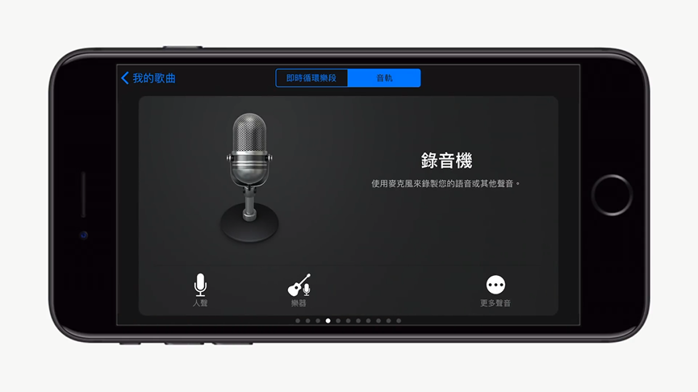

# ios

## ▲New Words

garage `/ɡəˈrɑːʒ/` -n. 车库；骑车修理厂；车库乐。 -v. 把车放入车库。

## 如果使用 爱思助手 电脑端给 iphone 制作铃声

## ▲ 如何用 iphone 制作铃声

首先下载音乐放到 `icloud Drive()` 内的 Drive , 然后安装 `文件 (Document)` App(如果没有的话)。

然后到 iCloud Drive 当中 并点选 Document 的资料夹,就可以看到我们的铃声在里面了 那我们先来试听看看 试听完没问题的话,我们就可以开始制作铃声了，首先回到 App Store 将 `GarageBand（库乐队）` 下载下来并且开启，打开之后点击右上角的 `(+)` 加号，

（滑动当前窗口）选择到`录音机模式`，点击等加载，

加载完毕后，接著点选左上角的`音轨`符号，

进到画面之后再选择右上角的 `Loop`，

点击 `从档案 App 浏览项目`,

然后我们要去 iCloud Drive 的 Document 资料夹当中把铃声加入，点选我们的铃声就会进来了，然后按住铃声，

拖拉到我们的音轨当中，

接著点选左上角的选单，回到我的歌曲的页面，

然后长按著歌曲，直到选单出现为止，

接著点选`分享`，并且选择铃声，然后将铃声的名称改为我们的歌曲名，

最后按下输出就完成了 输出好后，手机便会问你要如何使用铃声 有三种选项可以选择，

我们可以进到设定当中，在铃声的设定里面可以找到我们输出的铃声，直接选择之后就设定完成了，就是这么简单。

