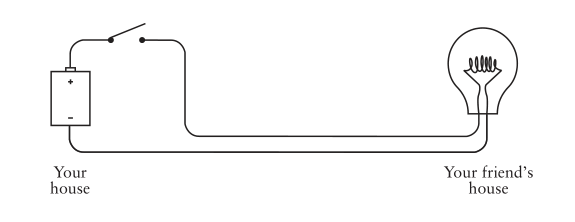
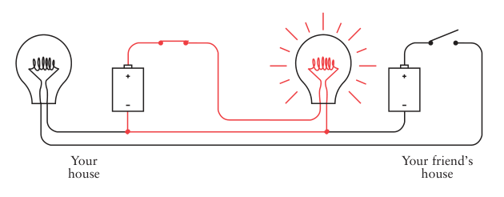
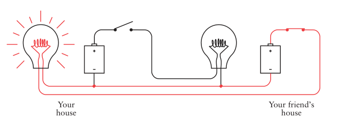
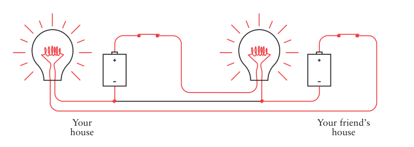
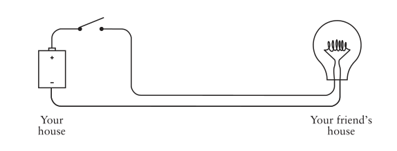
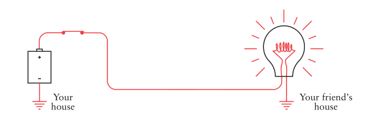

# Chapter Five: Seeing Around Corners (绕过拐角的通信)

## New Words

- potential `/pəˈtenʃəl/` -adj.潜在的，可能的。-noun.潜力，潜能，可能性。

- guage ` /ɡeɪdʒ/ ` -noun.测量仪，计量器; 〔电线等的〕直径﹔〔金属等的〕厚度﹐宽度:

## Content

你 12 岁了。在一个伤感的日子里，你最好的朋友跟随家人搬到别的镇子。从此以后你只能通过电话同他交谈了。但是电话交谈和深夜里用手电筒以莫尔斯码方法会谈是无法相比的。你另外的一个好朋友，也就是你的邻居，现在成了你新的密友。是时候该教给他一些莫尔斯码，让深夜的手电筒再次为你们闪烁了。

可是问题是，这位新朋友的卧室窗户和你卧室的窗户不是对着的。尽管两栋房子挨着，但是卧室窗户是朝向同一个方向的。除非你能想个办法，在室外摆上一面镜子，不然手电筒就不能用来夜谈了。

怎么办？

也许现在你已经懂得一些关于电学的知识了，所以你打算用电池、灯泡、开关和导线来自制一个 "手电筒" 。在第一次尝试中，你把电池还有开关在卧室中接好，然后从窗户引出两根导线，绕过围墙，接到你朋友的卧室里，在那里把它们接到一个灯泡上。

- Your house. 你的房子
- Your friend's house. 你朋友的房子

尽管图中只画了一节电池，不过实际应用中你也许要用两个。在以后的示意图中，下面的标志表示一个 "关" 状态（也称断开状态）的开关。

下图则表示开关是 "开" 的（也称作闭合状态）。

本章手电筒跟上一章中的手电筒的工作方式一样，尽管本章的手电筒中用来连接各个部件的导线比原来长了不少。当你把自己房间那端的开关闭合时，你朋友那儿的灯泡就会被点亮。

现在，你可以用莫尔斯码来发信息了。既然你已经成功地安装了这个 "手电筒" ，你就可以照样再安装另一套这样的 "远距离" 设备，好让你的朋友也能够给你发信息。

恭喜你！你已经架设好了一套双向电报系统！你可能注意到了，这个系统包含了两个相互独立但又完全相同的电路。理论上来说，在你给朋友发送信息的同时，他也可以给你发信息（不过同时阅读和发送电码对你的大脑来说或许是个挑战）。

聪明的你也许可以采用如下方式把这套系统加以改进，这样可以节省 25% 的导线。

注意，现在这两个电池的负极被连在一起。但是这两个回路（电池到开关到灯泡再到电池）依然是相互独立的，尽管现在它们看起来像连体婴儿一样。

这种接线方式被称为**公用连接（common）**。这个电路的公用部分，从最左端的灯泡和电池的连接点开始，到最右端的灯泡与电池的连接处结束。我们在图中用两个小圆点把这部分连线标示了出来。

我们来进一步检查一下这个电路，以确保使用时不会有意外发生。首先，当你在自己这端闭合开关的时候，你朋友屋里的灯泡就会点亮。红色的线表示出了电路中电流流动的路径。

电路的其余部分没有电流通过，因为没有完整路径可以让电子构成回路。

当你没有发送信息，而你的朋友正在发送时，他房间里的开关控制了你房间里灯泡的亮灭。下图的红线仍然表示电流流经的路径。

当你和你的朋友同时发送信息时，有时两个开关都断开了，有时一个闭合而另一个断开，也有可能两个开关同时闭合。最后一种情况下，电路中电流的示意图如下图所示。

电路的公用部分没有电流通过。

我们通过公用线路把两个电路合成了一条电路。通过这种方式，把连通两栋房子所需的导线从 4 根减少到了 3 根，节约了 25%的导线。

如果整个系统必须铺设很长的线路，可能还得绞尽脑汁再削减一根导线以进一步节约开支。遗憾的是，对于眼前这套使用1.5伏干电池和小灯泡的系统来说，这是不可行的。但如果我们把它们换成100伏的电池和大得多的灯泡，问题就迎刃而解了。

以下就是解决的思路：你不必非得用导线来完成电路的共享部分，你可以用其他的东西来代替导线。恰巧我们这儿有一个现成的大球，你可以用它来代替。这个大球直径近7900英里，由金属、岩石、水，以及有机质（其中大部分是没有生命的）组成。我们称这个巨大球体为 "地球" 。

上一章里，在讲导体的时候提到了银、铜和金，但没有提过岩石层和覆盖层。实际上，泥土并不是一个很好的导体，尽管有一些泥土（例如沼泽）的导电性比其他的（例如干沙）要好一些。但是我们知道导体有一条性质：截面越大导电性越好。一条很粗的导线，其导电性要远远好于一条细导线。这就是地球所拥有的优势。它实在是太大了。

要想用地球充当导体，可不是随便在西红柿地里插根线那么简单。你必须使用跟地球有充分接触的物体，也就是有很大表面积的导体。这儿有个不错的解决方案，即使用一个至少8英尺长、1/2英寸粗的铜柱电极。它提供了与地球150平方英寸的接触面积。你可以用一个大锤子把这个电极砸进地里，然后在上面接上一根导线。或者，如果你家的水管是用铜做的，并且是从屋外的地下接过来的，那么你可以在水管上接上导线。

关于电流的接地，在英国人们称其为 "earth" ，在美国叫 "ground" 。 "ground" 这个词的含义有一些含混不清，因为它也经常用来表示我们前文中所说的 "公用电路" 。在本章中，除非特别指明， "ground" 都表示物理接地。

**在电路图中，人们用以下符号表示** ==**接地**==。

电气工程师们一般都会使用这个符号，因为他们不喜欢花时间去描画一个被埋在地下的8英尺长的铜柱。

我们来看看新的电路是如何工作的。先从一个单向的电路开始分析。

如果你使用的是高压电池和大灯泡，你只需要在你和你朋友的房子之间接一根导线，因为可以把地球当成一条导线。

当你闭合开关时，电流就会按下图流动。

电子从你朋友房子的地下出发，经过灯泡、导线和你房间的开关，最后回到电池的正极。而电子最初是从电池的负极传入地下的。

你或许还真的很想看到电子从埋在你家后院的8英尺长的铜柱进入地下，然后飞速通过大地到达埋在你朋友家后院的铜柱的情景。

然而每时每刻地球都在充当着全世界成千上万条电路的导线，想到这些，你可能会感到迷茫：电子怎么知道它要去什么地方？其实它们不知道。换一种描述地球的模式或许更恰当些。

没错，地球是一个巨大的导体，但是我们也可以把它看做是电子的来源和储藏库。地球之于电子就恰如海洋之于水滴。地球是一个近乎无尽的电子之源，同时也是一个无比庞大的电子池。

不过地球还是有一定的电阻的。所以当我们使用1.5伏干电池和小灯泡时，不能通过接地来节约我们所需的线路开支。对于低电压电池而言，地球的电阻实在是太高了。

你可能注意到，前面两幅图中所画的电池，其负极都接地了，如下图所示。

以后，我将不再画这个图例了。==**我将用大写字母 "V" （表示电压）来代替它**==。因此单向的灯泡电报系统的电路示意图就变成了如下这个样子。

- Notice： 请一定记住这个 V 代表接地的 :battery:

- 这里把上面的完整的电路图贴出来，以方便对比查看

字母V是电压的意思，但是它也有吸尘器的意思。我们把V想象成一个电子吸尘器，然后把地面想象成电子的海洋。电子吸尘器通过电路把电子从地下拉出来，让它们沿设计好的线路开始工作（例如点亮灯泡）。

大地有时也被认为是零电势（zero potential$^*$）点。也就是说现在没有电压。电压——正如我之前介绍的——是电能做功的势，这与悬在空中的砖所潜藏的势能是类似的。零电势就像放置在地面上的砖一样——已经没有空间可以让它下落了。

在第4章中，我们最初注意到的几个问题之一便是电路是一条回路。不过我们的新电路看起来可不像条回路。实际上，它仍然是。你可以使用负极接地的电池来替换掉字母V，然后把所有接地标志用线连起来。最后就会得到一张与本章开始处一模一样的电路图。

因此，在一对铜柱电极（或者自来水管）的帮助下，我们只用了两根导线，就冲破了你与你朋友家之间围墙的阻隔，构建了一个双向的莫尔斯码发送系统。

这条电路在功能上与之前的那个电路是完全一样的，而在之前那条电路中，我们使用了3条导线来穿越房子之间的围墙。

在本章中，我们已在通信的演变中迈出了重要一步。之前我们使用莫尔斯码交流时，必须要在视线直视的范围里，并且要保证在手电筒光线可以传播的距离之内。

但是使用导线，我们不仅可以构建出一个可以绕过拐角的、能够在视线之外的发报系统，而且我们自己再也无需受距离的限制。我们可以跨越成百上千英里来进行通信，只需要铺设足够长的线路即可。

不过还有个问题。尽管铜是很好的导电体，但是它也不是完美的。线路越长，它们的电阻也就越大。电阻越大，线路中的电流就越少。电流越少，灯泡就越暗。

那么到底我们可以做出多长的导线呢？这要依实际情况而定。假如我们现在使用的是原来的 4 条导线的双向电路，而没有使用接地和公用电路，并且还用手电筒电池和小灯泡。为了节约成本，也许你先从无线电室（Radio Shack，美国出售电器的连锁店）购买了一些 20 号规格的电话线，花费为每 100 英尺 9.99 美元。电话线一般是用来把扬声器连接到三維声音响系统上的。它有两个接头，因而对我们的电报系统来说，也是个不错的选择。如果你和你朋友的卧室之间的距离小于 50 英尺，这卷电话线就足够了。

导线的粗细使用美国线径标准（American Wire Gauge$^*$，AWG）进行度量。AWG 数值越小，导线越粗，电阻也就越小。你买的 20号规格的电话线，其直径大约是 0.032 英寸，大约每 1000 英尺有 10 欧的电阻，也就是说在你们卧室间的往返距离——100 英尺左右，大约有 1 欧的电阻。

情况其实不错，但是如果我们需要铺设一英里的线路呢？导线的电阻将大于 100 欧。记得在上一章中提到过，我们的小灯泡电阻只有4欧姆。根据欧姆定律，可以很容易计算出电路中的电流已经不再是0.75安了（3伏除以4欧），现在它将变得比0.03安还要小（3伏除以100欧以上）。几乎可以肯定，这点电流不足以点亮灯泡。

使用粗一点的导线是一个不错的解决方案，但是那会比较昂贵。10号规格线（无线电室用来作为汽车耦合线出售，其价格为每35英尺11.99美元，你需要两倍的长度，因为这种导线只有1个接口）大约有0.1英寸粗，不过它每1000英尺只有1欧的阻抗，也就是每英里5欧。

另一种解决方案是增加电压，使用更大电阻的灯泡。例如，一个能够照亮房间的100瓦灯泡，是设计成在120伏电压下工作的（美国市电电压），大约有144欧的电阻。导线的电阻对整个电路的影响将变得小许多。

在150年前，人们在铺设第一个跨越美洲和欧洲的电报系统时，这些都是面临的问题。如果忽视了线路直径还有高电压的因素，电报线路将完全无法持续工作。根据设计方案，系统距离跨度的极限是 200 英里。这个长度与纽约和加利福尼亚间数千英里的距离相比，还是有很大差距的。

这个难题的解决方案——不是给手电筒的，而是给 "滴滴答答" 的近代电报系统的——尽管它只不过是个很简陋的装置，但是正是基于这个装置，整个计算机系统才被构建出来。

