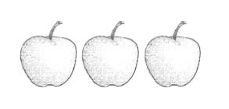
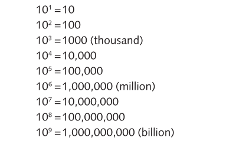
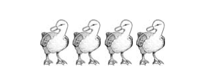
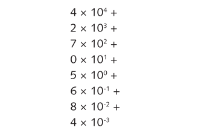

# Chapter Seven: Our Ten Digits (我们的十个数字)

人们很容易理解，语言只不过是一种编码。我们之中的许多人在学校里至少都学过一门外语。所以我们知道，英文中的 "cat" （猫）在其他语言中可以写做gato、chat、Katze、KOIIIK或kátta。

然而，数字似乎并不是那么容易随文化的不同而改变。不论我们说什么语言，或对数字使用什么样的发音，在这个星球上几乎所有人都用以下方式来书写数字：

1　2　3　4　5　6　7　8　9　10

这难道不就是数学被称做 "通用语言" 的理由么？

数字当然是我们平常所能接触到的一种最抽象的编码。当我们看到数字：

3

不需要立刻将它与任何事物联系起来。我们可能会联想到3个苹果或者3个别的什么东西。但是当我们从上下文中得知该数字表示的是某个小孩的生日、电视频道、曲棍球赛的得分或蛋糕食谱中面粉的杯数时，也能够像认为它代表3个苹果时一样自然。因为数字最开始产生时就很抽象，所以对于我们来说，理解这样一个问题会有一点困难。这个问题就是如下数量的苹果：

并不一定要用符号 "3" 来表示。本章及下一章中的很大一部分内容将专门用来说明如下这些苹果：

同样可以用 "11" 来表示。

首先让我们遗忘数字10原有的那些特性。大多数文明都是创建在以10为基数的数字系统上的（有的时候是以5为基数），这种情况并不奇怪。最开始，人们用自己的手指来计数。如果我们人类有8个或12个手指，那么我们的计数方式就会和现在有所不同。英语中Digit（数字）这个词同时也有手指、脚趾的意思，并且还有数字的意思，这并不是巧合。而five（五）和fist（拳头）这两个单词的拥有相同的词根也是同样的道理。

在这个意义上，以10为基数或使用十进制数字系统完全是随意的。而且，英文中还对基于十的数字赋予了几乎神奇的意义，并且给了它们特有的名字：十个一年是一个十年（decade）；十个十年是一个世纪（century）；十个世纪就是一个千年（millennium）。一千个一千就是一个百万（million）；一千个百万就是一个十亿（billion）。以下都是10的各次幂。

大多数历史学家认为数字最初起源于对事物的计数，例如：人数、财产或商业交易的计数等。举个例子，如果有一个人有四只鸭子，用图画表示为：

后来，专门负责画鸭子的这个人会想： "为什么我非得要画四只鸭子？为什么我不画一只鸭子再用划线或其他事物来表示有四只鸭子呢？" 

然后直到有一天，出现了一个人，他拥有27只鸭子，这种划线的方法就显得很可笑了。

有人说： "必须想一种更好的方法。" 于是一个数字系统就诞生了。

所有早期的数字系统中，只有罗马数字沿用到了今天。我们可以在表盘上、纪念碑和雕像的日期上、一些书的页码中，或者在条款的概述中看到罗马数字，而令人最烦恼的就是电影的版权声明（必须足够快地破译位于演职人员表末尾的 "MCMLIII" 才能知道这部影片是哪一年发行的）。

27 只鸭子用罗马数字表示为：

这个概念很容易理解：X表示10个划线，V表示5个划线。

沿用到今天的罗马数字符号有：

这里，字母I表示1，可以看做是一个划线或者一根伸出的手指。字母V像一只手，表示5。两个V是一个X，代表数字10。L是50。C来自单词centum，表示100。D是500。最后一个，M来自于拉丁文mille，意为1000。

尽管我们可能不会认同，但在很长一段时间内，罗马数字被人们看做是易于加减的，这也是为什么罗马数字在欧洲作记账之用一直沿用到今天。实际上，两个罗马数字相加的时候只不过是利用几个规则将两个数合并，这个规则是：五个I是一个V，两个V是一个X，五个X是一个L，以此类推。

但是用罗马数字进行乘法和除法却很复杂。很多其他早期数字系统（像古希腊数字系统）和罗马数字系统相似，它们在用于复杂运算方面同样也存在一定的不足。尽管古希腊人发明的非凡的几何学至今仍然是高中生的一门课程，但古希腊人并不是以代数而著称的。

如今我们所用的数字系统通常被称为阿拉伯数字，也可以称为印度-阿拉伯数字系统。它起源于印度，被阿拉伯数学家带入欧洲。其中最著名的就是波斯数学家穆罕默德·伊本穆萨·奥瑞兹穆（根据这个人的名字衍生出英文单词 "algorithm" ，算法），他在公元825年左右写了一本关于代数学的书，其中就用到了印度的计数系统。其拉丁文译本可追溯到公元1120年，它对加速整个欧洲从罗马数字到阿拉伯数字系统的转变有着重要影响。

阿拉伯数字系统不同于先前的数字系统，体现在以下三点。

- 阿拉伯数字系统是和位置相关的。也就是说，一个数字的位置不同，其代表数量也不同。对于一个数而言，其数字的位置和数字的大小一样，都是很重要的（但实际上，数字的位置更重要）。100和1,000,000这两个数中都只有一个1，而我们知道，1,000,000要远远大于100。

- 实际上在早期的数字系统中也有一点是阿拉伯数字系统所没有的，那就是用来表示数字10的专门的符号。而在我们现在使用的数字系统中是没有代表10的专门符号的。

- 另一方面，实际上阿拉伯数字也有一点是几乎所有早期数字系统所没有的，而这恰恰是一个比代表数字10的符号还重要得多的符号，那就是0。

是的，就是0。小小的一个零无疑是数字和数学史上最重要的发明之一。它支持位置计数法，因此可以将25、205和250区分开来。0也简化了与位置无关的数字系统中的一些非常复杂的运算，尤其是乘法和除法。

阿拉伯数字的整体结构可以以我们读数字的方式来展现。以 4825 为例，我们读做 "四千八百二十五" ，意思就是：

**记住任何数的 0 次幂都等于 1**。

一个多位数中的每一位都有其各自特定的意义，如下图所示。这 7 个方格能代表 0～9,999,999 中的任何一个数字。

每个位置代表 10 的一个整数次幂。我们不需要一个专门的符号来表示数字 "10" ，因为我们可以将1放在不同的位置，并用 0 作为占位符。

另一个好处就是，以同样的方式将数字置于小数点右边可以表示分数。数字 42,705.684 就是：

这个数也可以写为不含除法的形式，如下：

或用 10 的幂的形式来表示：

注意，10 的幂指数是如何减小到 0 再变为负数的。

我们知道，3 加 4 等于 7。类似地，30 加 40 等于 70，300 加 400 等于 700，3000 加 4000 等于 7000。这就是阿拉伯数字的 "闪光" 之处。**任何长度的十进制数相加时，只要根据一种方法将问题分成几步即可，而每个步骤最多只是将两个一位数字相加而已**。这就是为什么以前有人会强迫你记住加法表的原因。

| +    |   0   |  1    | 2 | 3 | 4 | 5 | 6 | 7 | 8 | 9 |
| :--: | :--: | :--: | :--: | :--: | :--: | :--: | :--: | :--: | :--: | :--: |
| 0 | 0 |   1    | 2 | 3 | 4 | 5 | 6 | 7 | 8 | 9 |
| 1 | 1 | 2 | 3 | 4 | 5 | 6 | 7 | 8 | 9 | 10 |
| 2 | 2 | 3 | 4 | 5 | 6 | 7 | 8 | 9 | 10 | 11 |
| 3 | 3 | 4 | 5 | 6 | 7 | 8 | 9 | 10 | 11 | 12 |
| 4 | 4 | 5 | 6 | 7 | 8 | 9 | 10 | 11 | 12 | 13 |
| 5 | 5 | 6 | 7 | 8 | 9 | 10 | 11 | 12 | 13 | 14 |
| 6 | 6 | 7 | 8 | 9 | 10 | 11 | 12 | 13 | 14 | 15 |
| 7 | 7 | 8 | 9 | 10 | 11 | 12 | 13 |  14  |  15  | 16 |
| 8 | 8 | 9 | 10 | 11 | 12 | 13 | 14 | 15 | 16 | 17 |
| 9 | 9 | 10 | 11 | 12 | 13 | 14 | 15 | 16 | 17 | 18 |

从最上边的一行和最左边的一列分别找出要相加的两个数字，这一行与这一列的交叉点就是所要得到的和。例如，4 加 6 等于 10。

同样，当你想将两个十进制数相乘的时候，方法可能稍微复杂些，但是你仍然只需要将问题分解成几步，做加法和一位数的乘法即可。在你的小学时代你一定也被要求必须记住下面的乘法表。

|  +   |  0   |  1   |  2   |  3   |  4   |  5   |  6   |  7   |  8   |  9   |
| :--: | :--: | :--: | :--: | :--: | :--: | :--: | :--: | :--: | :--: | :--: |
|  0   |  0   |  0   |  0   |  0   |  0   |  0   |  0   |  0   |  0   |  0   |
|  1   |  0   |  1   |  2   |  3   |  4   |  5   |  6   |  7   |  8   |  9   |
|  2   |  0   |  2   |  4   |  6   |  6   |  10  |  12  |  14  |  16  |  18  |
|  3   |  0   |  3   |  6   |  9   |  7   |  15  |  18  |  21  |  24  |  27  |
|  4   |  0   |  4   |  8   |  12  |  8   |  20  |  24  |  28  |  32  |  36  |
|  5   |  0   |  5   |  10  |  15  |  9   |  25  |  30  |  35  |  40  |  45  |
|  6   |  0   |  6   |  12  |  18  |  10  |  30  |  36  |  42  |  48  |  54  |
|  7   |  0   |  7   |  14  |  21  |  11  |  35  |  42  |  49  |  56  |  63  |
|  8   |  0   |  8   |  16  |  24  |  12  |  40  |  48  |  56  |  64  |  72  |
|  9   |  0   |  9   |  18  |  27  |  13  |  45  |  54  |  63  |  72  |  81  |

位置计数系统的好处并不在于它有多么好用，而在于对非十进制的系统而言，它仍然是易于实现计数的。我们现有的计数系统并不适用于每种情况。以 10 为基数的数字系统最大的问题是它对于卡通人物没有任何意义。大多数卡通人物每只手（或爪子）只有 4 根手指，因此它们需要一个以 8 为基数的计数系统。而有意思的是，许多我们在十进制数中所了解到的知识同样适合卡通朋友们所钟爱的八进制计数系统。

