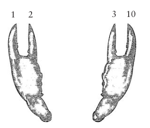
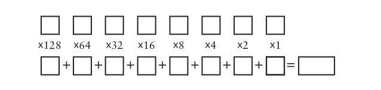

# Chapter Eight: Alternatives to Ten (十的替代品)

## New Words
> - **binary `/'baɪnərɪ/` --adj.二进制的, 二元的.**
>    + It is stored as a binary file. 它以二进制格式文件存储. 
>    + a data file in binary format. 二进制格式的数据文件. 
> - **decimal `/'desɪm(ə)l/` --adj.十进制的, 小数的.  --n.小数**
>    + decimal number 十进制数
>    + decimal point 小数点
>    + decimal system 十进制
> - **octal `/'ɒkt(ə)l/` --adj.八进制的**
>    + octal number  --n.八进制数
> - **quaternary `/kwə'tɝnəri/` --adj.由四要素构成的; 四个一组的**
> - **hexadecimal `/ˌheksə'desɪm(ə)l/` --adj.十六进制的**
>    + the hexadecimal number system. 十六进制数字系统
> - 进制英文表示
>    + B (binary) -- 2 进制
>    + 0 (octal) -- 8 进制
>    + D (decimal) -- 10 进制
>    + H (Hexadecimal) -- 16 进制

对于我们人类而言，10 是一个非常重要的数字。10 是我们大多数人拥有的手指或脚趾的数目，当然我们也希望所有人的手指和脚趾都是 10 个。因为手指非常便于计数，于是我们人类已经适应了这个以 10 为基数的数字系统。

就如前面章节中所提到的，我们现在所用的数字系统是基于10的数字系统的，或称为十进制。我们已经非常习惯这个数字系统了，因此起初也很难再构想出其他的数字系统。的确，当我们看到数字 10 的时候，我们不自觉地就会想到这个数字代表了下面这么多只鸭子：

但是，数字10之所以指的是这么多只鸭子，其唯一理由就在于这些鸭子的数目与我们的手指数目相同。如果人类的手指不是10根，我们数数的方式就会有所不同，那么10就会是另外一个含义。同样，数字 10 可以代表这么多只鸭子：

当我们认识到，10可以表示两只鸭子，我们就可以解释开关、导线、灯泡和继电器（进一步推广到计算机）是如何表示数字的了。

## ▲ Octal number system (/ base eight)  (八进制数字系统)

如果人类像卡通人物那样每只手有 4 根手指会怎样呢？我们可能就不会想到创建一个以 10 为基数的数字系统。相反我们会自然而然地、不可避免地想到创建一个以 8 为基数的数字系统。我们就不会称这个系统为十进制数字系统，而称之为八进制数字系统。

如果我们的数字系统是以 8 为基础而创建的，我们就不需要如下这个符号：

$$9$$

将这个符号给卡通人物看的话，你会得到这样的反应： "这是什么？它代表什么？" 如果继续仔细考虑一下，你会发现我们连这样的一个符号也不会需要：

$$8$$

在十进制中，10 没有特定的符号，因此在八进制中，同样也没有表示 8 的特定符号。

十进制中我们的计数方式是：0、1、2、3、4、5、6、7、8、9，然后是 10。在八进制中数字系统中计数方式是：0、1、2、3、4、5、6、7，而后是什么呢？我们已经将符号用完了。在这里唯一有意义的只有10，而在这里的正确答案恰恰就是 10。在八进制中，7 之后的下一个数字是 10。但是这个 "10" 代表的并不是人类手指的数量。在八进制中， "10" 代表的是卡通人物手指的数量。

如果继续用脚趾数下去的话，就是这样：

使用非十进制的数字系统时，你可以将 "10" 读作 "一零" ，这样可以避免一些混淆。类似地， "13" 读作 "一三" ， "20" 读作 "二零" 。要想真正避免混淆，可以将 "20" 读作 "基于8的数二零" 或 "八进制二零" 。

尽管已经用完了所有的手指和脚趾，但我们仍能够用八进制继续数下去。这与十进制基本相同，但是我们跳过了数字 8 和 9。当然，相同数字所代表的数量是不同的：

>0，
>
>1，2，3，4，5，6，7，10，
>
>11，12，13，14，15，16，17，20，
>
>21，22，23，24，25，26，27，30，
>
>31，32，33，34，35，36，37，40，
>
>41，42，43，44，45，46，47，50，
>
>51，52，53，54，55，56，57，60，
>
>61，62，63，64，65，66，67，70，
>
>71，72，73，74，75，76，77，80，
>
>...... 100，
>
>......，
>
>......

这里最后一个数字我们读做 "一零零" 。这是卡通人物手指的数量自身相乘所得的结果。

当书写十进制和八进制数时，我们可以利用下标标注来区别不同数字系统，避免混淆。下标 $TEN$ 表示十进制，$EIGHT$ 表示八进制。

这样，白雪公主遇到的小矮人数量是 $7_{TEN}$ 或 $7_{EIGHT}$；

卡通人物的手指数是 8$_{TEN}$ 或 10$_{EIGHT}$；（Read: 十进制 8 或 八进制 10）

贝多芬所写的交响曲的数目是 9$_{TEN}$ 或 11$_{EIGHT}$；

人类手指的数量是 10$_{TEN}$ 或 12$_{EIGHT}$；

一年中的月份数是 12$_{TEN}$ 或 14$_{EIGHT}$；

两个星期的天数是 14$_{TEN}$ 或 16$_{EIGHT}$；

"情人" 的生日庆祝会是 16$_{TEN}$ 或 20$_{EIGHT}$；

一天中的小时数是 24$_{TEN}$ 或 30$_{EIGHT}$；

拉丁字母表中的字母数是 26$_{TEN}$ 或 32$_{EIGHT}$；

一夸脱的液体相当于的盎司数是 32$_{TEN}$ 或 40$_{EIGHT}$；

一副纸牌的张数是 52$_{TEN}$ 或 64$_{EIGHT}$；

棋盘的格数是 64$_{TEN}$ 或 100$_{EIGHT}$；

日落大道上最有名的地址是 77$_{TEN}$ 或 115$_{EIGHT}$；

美式足球场地的面积是 100$_{TEN}$ 或 144$_{EIGHT}$；

温网首届女子单打的初赛人数是 128$_{TEN}$ 或 200$_{EIGHT}$；

孟菲斯市的面积是 256$_{TEN}$ 或 400$_{EIGHT}$。

请注意，此列表中有一些不错的八进制整数 (nice round octal$\color{red}{^{*}}$ numbers)，如 100$_{EIGHT}$、 200$_{EIGHT}$ 和 400$_{EIGHT}$。根据规定，在十进制中，好整数通常是指结尾有若干个零的数。在结尾有两个零的十进制数代表的是 100$_{TEN}$，而 100$_{TEN}$ 表示 10$_{TEN}$ 乘以 10$_{TEN}$。在八进制数中，结尾有两个零代表是 100$_{EIGHT}$，而 100$_{EIGHT}$ 表示 10$_{EIGHT}$ 乘以 10$_{EIGHT}$（或 8$_{TEN}$乘以 8$_{TEN}$，即 64$_{TEN}$）。

你可能还注意到，这些漂亮的八进制整数 100$_{EIGHT}$、 200$_{EIGHT}$ 和 400$_{EIGHT}$在十进制中分别与 64$_{TEN}$、 128$_{TEN}$ 和 256$_{TEN}$ 相等，**它们都是2的整数（0、1、2、3、4、5、......）次幂**。这是非常有意义的。例如， 400$_{EIGHT}$ 等于 4$_{EIGHT}$ 乘以 10$_{EIGHT}$ 乘以 10$_{EIGHT}$，而这里所有的数都是 2 的整数次幂。每当我们将 2 的幂乘以 2 的幂时，我们就会得到另一个 2 的幂。

下表显示了具有十进制和八进制表示形式的一些 2 的幂：
|   2 的幂   |   十进制   |   8进制   |
| :--: | :--: | :--: |
| $2^{0}$     | 1 | 1 |
| $2^{1}$      | 2 | 2 |
| $2^{2}$      | 4 | 4 |
| $2^{3}$      | 8 | 10 |
| $2^{4}$      | 16 | 20 |
| $2^{5}$      | 32 | 40 |
| $2^{6}$      | 64 | 100 |
| $2^{7}$      | 128 | 200 |
| $2^{8}$      | 256 | 400 |
| $2^{9}$      | 512 | 1000 |
| $2^{10}$      | 1024 | 2000 |
| $2^{11}$      | 2048 | 4000 |
| $2^{12}$      | 4096 | 10000 |

最右列的好整数暗示我们，十进制以外的数字系统可能对使用二进制码有所帮助。

Notice: P60 页的内容私以为讲解顺序有问题，所以下面的笔记顺序有调换，完整内容请见书本。

这样，一个八进制数 3725$_{EIGHT}$ 可以分解成如下形式：

> 3725$_{EIGHT}$= 3000$_{EIGHT}$ + 700$_{EIGHT}$ + 20$_{EIGHT}$ + 5$_{EIGHT}$

采用八进制形式的 8 的整数次幂，表现形式如下：

> 3725$_{EIGHT}$ = 3 × 1000$_{EIGHT}$ +
>
> ​						7 × 100$_{EIGHT}$ +
>
> ​						2 × 10$_{EIGHT}$ + 
>
> ​						5 × 1

在结构上，八进制数字系统与十进制数字系统并没有什么不同。它们只是在细节上存在一些差异。例如：**八进制数中每位所代表的值是该位数字乘以 8 的整数次幂的结果。**

下面是利用十进制的 8 的整数次幂写出的一种形式：

> 3725$_{EIGHT}$ = 3 × 512$_{TEN}$ +
>
> ​						7 × 64$_{TEN}$ + 
>
> ​						2 × 8$_{TEN}$ +
>
> ​						5 × 1

拆分形式为：

$\color{red}{*}$ *笔者注：下面这种写法是进制转换中 8 进制转换为 10 进制的写法，3725$_{EIGHT}$ = 2005$_{TEN}$*

> 3725$_{EIGHT}$ = 3 x $8^3$ +
>
> ​						3 x $8^2$ + 
>
> ​						3 x $8^1$ + 
>
> ​						3 x $8^0$

如果用十进制数计算出结果，会得到 2005$_{TEN}$。这就是将八进制数转化为十进制数的方法。

我们可以像进行十进制数的加法和乘法那样，对八进制数进行加法或乘法运算。不同的是，我们要采用不同的表来对各个数码进行乘法或加法运算。

**下面是八进制数的加法表**。

| **+** | **0** | **1** | **2** | **3** | **4** | **5** | **6** | **7** |
| :---: | :---: | :---: | :---: | :---: | :---: | :---: | :---: | :---: |
| **0** |   0   |   1   |   2   |   3   |   4   |   5   |   6   |   7   |
| **1** |   1   |   2   |   3   |   4   |   5   |   6   |   7   |  10   |
| **2** |   2   |   3   |   4   |   5   |   6   |   7   |  10   |  11   |
| **3** |   3   |   4   |   5   |   6   |   7   |  10   |  11   |  12   |
| **4** |   4   |   5   |   6   |   7   |  10   |  11   |  12   |  13   |
| **5** |   5   |   6   |   7   |  10   |  11   |  12   |  13   |  14   |
| **6** |   6   |   7   |  10   |  11   |  12   |  13   |  14   |  15   |
| **7** |   7   |  10   |  11   |  12   |  13   |  14   |  15   |  16   |

例如， 5$_{EIGHT}$ + 7$_{EIGHT}$ = 14$_{EIGHT}$。我们还可以将两个更长的八进制数按照与十进制相同的方法相加：

> ​    135 
>
> \+ 643 
> 
> \--------
> 
>    1000

首先要从最右的一列开始，5  加 3 等于 10，结果为 0，进位 1；1 加 3 加 4 等于 10，结果为 0，进位 1；1 加 1 加 6 等于 10。

同样，在八进制中，2 乘以 2 结果依然为 4。但是 3 乘以 3 却不等于 9。那是多少呢？在这里，3 乘以 3 结果是 11 $_{EIGHT}$，其与 9$_{TEN}$ 所代表的数量相等。

**下面为八进制乘法的乘法表**。

| **x** | **0** | **1** | **2** | **3** | **4** | **5** | **6** | **7** |
| :---: | :---: | :---: | :---: | :---: | :---: | :---: | :---: | :---: |
| **0** |   0   |   0   |   0   | 0     | 0     | 0     | 0     | 0     |
| **1** |   0   |   1   |   2   | 3     | 4     | 5     | 6     | 7     |
| **2** |   0   |   2   |   4   | 6     | 10    | 12    | 14    | 16    |
| **3** |   0   |   3   |   6   | 11    | 14    | 17    | 22    | 25    |
| **4** |   0   |   4   |  10   | 14    | 20    | 24    | 30    | 34    |
| **5** |   0   |   5   |  12   | 17    | 24    | 31    | 36    | 43    |
| **6** |   0   |   6   |  14   | 22    | 30    | 36    | 44    | 52    |
| **7** |   0   |   7   |  16   | 25    | 34    | 43    | 52    | 61    |

在这里，4 × 6等于 30$_{EIGHT}$，而 30$_{EIGHT}$与 24$_{TEN}$ 等价，也就是与十进制中的 4 × 6 相等。 

## ▲  Quaternary system (/ base four)  (四进制数字系统)

八进制数字系统与十进制数字系统一样，都是有效的。但是让我们更进一步来看，既然已经为卡通人物开发了一套数字系统，就让我们再制订一套适合龙虾的数字系统吧。实际上龙虾根本没有手指，但是在它们前爪的末端都有螯。适用于龙虾的数字系统是以4为基数的四进制（quaternary）数字系统。

四进制数字系统是像这样计数的：

>  0，
>
> 1，2，3，10，
>
> 11，12，13，20，
>
> 21，22，23，30，
>
> 31，32，33，100，
>
> 101，102，103，110，
>
> 等等。

这里我不打算在四进制数上花太多的时间，因为接下来我们即将转入一个更为重要的话题。通过下图我们可以看出四进制中每一位是如何跟 4 的某个整数次幂相对应的。

四进制数 31232 可以写做如下形式：

如果以十进制数的形式计算其结果，我们会发现 31232$_{FOUR}$ 等价于 878$_{TEN}$。

## ▲ Binary number system  (from the Latin for *two by two*) (二进制数字系统)

现在，我们要做一个跳跃并且是最远的一跳。如果我们是海豚，那么就必须用两个鳍来计数。这个数字系统称为以 2 为基数的数字系统，或二进制。这样的话我们似乎只有两个数字了，这两个数分别为 0 和 1。

0 和 1 现在已不是我们要处理的全部问题了，而我们还需要练习一下才能习惯使用二进制数。二进制数最大的问题是数字用完得很快。例如，下图就是海豚如何用它的鳍来计数的例子。

是的，在二进制中，1 的下一个数字是 10。这让人惊讶，但也并不是什么意外。**无论使用哪种计数系统，当单个的数字用完时，第一个两位数就是 10**。

二进制系统这样计数的：

> 0，
>
> 1，10，
>
> 11，100，
>
> 101，110，
>
> 111，1000，
>
> 1001，1010，
>
> 1011，1100，
>
> 1101，1110，
>
> 1111，10000，
>
> 10001……

这些数看起来似乎很大，但实际上并不是这样的。准确地说，二进制数的长度增长得很快而非数值增大得快：

人类的头的个数是 1$_{TEN}$ 或 1$_{TWO}$；

海豚身上鳍的个数是 2$_{TEN}$ 或 10$_{TWO}$；

一个大汤匙中的小茶匙的数目为 3$_{TEN}$ 或 11$_{TWO}$；

正方形的边数是 4$_{TEN}$ 或 100$_{TWO}$；

人类一只手的手指数是 5$_{TEN}$ 或 101$_{TWO}$；

昆虫的腿数是 6$_{TEN}$ 和 110$_{TWO}$；

一周中的天数是 7$_{TEN}$ 或 111$_{TWO}$；

八重奏中演奏者的人数是 8$_{TEN}$ 或 1000$_{TWO}$；

银河系中行星（包括冥王星）的总数是 9$_{TEN}$ 或 1001$_{TWO}$；

牛仔帽的重量以加仑计算为 10$_{TEN}$ 或 1010$_{TWO}$。

在一个多位二进制数中，数字的位置和2的整数次幂的对应关系为：

因此，任何一个以 1 开头而后面全是 0 的二进制数一定都是 2 的整数次幂。幂指数就等于这个二进制数中 0 的个数。

以下是 2 的各整数次幂的扩展表，它可以用来说明这条规则。

|  2 的幂  | 十进制 | 8进制 | 四进制  |      二进制      |
| :------: | :----: | :---: | :-----: | :--------------: |
| $2^{0}$  |   1    |   1   |    1    |        1         |
| $2^{1}$  |   2    |   2   |    2    |        10        |
| $2^{2}$  |   4    |   4   |   10    |       100        |
| $2^{3}$  |   8    |  10   |   20    |       1000       |
| $2^{4}$  |   16   |  20   |   100   |      10000       |
| $2^{5}$  |   32   |  40   |   200   |      100000      |
| $2^{6}$  |   64   |  100  |  1000   |     1000000      |
| $2^{7}$  |  128   |  200  |  2000   |     10000000     |
| $2^{8}$  |  256   |  400  |  10000  |    100000000     |
| $2^{9}$  |  512   | 1000  |  20000  |   10 0000 0000   |
| $2^{10}$ |  1024  | 2000  | 100000  |  100 0000 0000   |
| $2^{11}$ |  2048  | 4000  | 200000  |  1000 0000 0000  |
| $2^{12}$ |  4096  | 10000 | 1000000 | 1 0000 0000 0000 |

假定有一个二进制数 101101011010，它可以写成：

如果将各个部分以十进制数的形式相加，会得到 2048 + 512 + 256 + 64 + 16 + 8 + 2，即 2, 906$_{TEN}$。

为了更简明、更便捷地将二进制数转换为十进制数，你可能会更喜欢借助我准备的模板来进行转换：

这个模板可以将一个数转换最大长度为 8 的二进制数，但是它很容易扩展。在使用模板的时候，将 8 位二进制数填入到上面一行的格子里，每个格子一位。做 8 个乘法运算，然后将结果填入到下面一行的 8 个小格子里。再将这 8 个格子中的数相加就会得到最终结果。下面就举例说明如何得到与二进制数 10010110 相等的十进制数。

将十进制数转换成二进制数就没那么直接了。下面是一个能够帮你将 0～255 范围内的十进制数转换为二进制数的模板。

这个转换实际上比看上去要麻烦得多，因此一定要仔细地按照下面的指导来操作。将整个十进制数（小于或等于255）填入到上面一行最左端的格子中。用第一个除数（128）去除这个数。所得的商填入正下方的格子（左下角的格子），余数填入右边的格子（上面一行左数第二个格子）。用第一个余数再除以下一个除数 64。依照模板的顺序用同样的方法继续进行下去。

要记住，每次求得的商只能是0或者1。如果被除数小于除数，商为0，余数就是被除数。如果被除数大于或等于除数，那么商为1，余数就是被除数减去除数所得之差。下面以 150 为例进行转换。

如果需要对两个二进制数进行加法或乘法，直接运算可能会比转换成十进制再进行运算要简单些。这将是你真正喜欢二进制数的地方。想象一下，如果你记住了如下表格，掌握加法将是一件多么迅速的事情啊。

从最右一列开始：1加0等于1。右边第二列：0加1等于1。第三列：1加1等于0，进1。第四列：1（进位）加0加0等于1。第五列：0 加 1 等于 1。第六列：1 加 1 等于 0，进 1。第七列：1（进位）加1加0等于10。

乘法表甚至比加法表还要简单，因为该表可以由两个基本的乘法规则推导出来：任何数乘以0结果都为0，任何数乘以1，结果都是这个数本身。

以下是 13$_{TEN}$与 11$_{TEN}$的二进制乘法运算过程：

结果为 143$_{TEN}$。

人们在使用二进制数的时候通常将它们写成带有前导零的形式（即第一个1的左边有零）。例如0011，而不是写做11。这样写不会改变量字的大小，仅仅是为了美观。例如，以下是前16个二进制数以及与它们等价的十进制数。

让我们再看一下这一列二进制数。仔细考虑这4个垂直列中每一列的1和0，注意它们在一列中自上而下是以怎样的规律交替的。

●最右边的一列一直在0和1之间交替。

●右数第二列是在每两个0和两个1之间相互交替。

●下一列是在每四个0和每四个1之间相互交替。

●再下一列是在每八个0和每八个1之间相互交替。

这是很有条理的，难道不是么？事实上，只要再重复这16个数字并且在每个数字的前面加一个1就可以很容易地写出后面的16个数字。

从另外一种角度来看：当以二进制计数的时候，最右边的一位（最低位）以0和1交替。每当该位由1变为0，从右边数的第二位（次低位）也随之改变——不是由0变到1，就是由1变到0。因此，每次只要有一个二进制数码的值由1变到0，紧挨着的高位数字也会发生变化，而且其变化不是由0到1就是由1到0。

在书写一个比较大的十进制数的时候，通常在每三位数字之间用一个逗号隔开，这样会让人很清楚地读出数字的大小。例如，当你看到数字12000000时，你可能不得不去数一下其中0的个数才知道这个数是多少，但是，如果数字写做12,000,000，你一眼就会知道它是一千二百万。

二进制数的位长度增加得特别快。例如，一千二百万在二进制中应表示为：101101110001101100000000。为了让二进制数更易读，通常在每四个数字之间用一个连字符来分开，例如，1011-0111-0001-1011-0000-0000，或者每四位空出一个空格：1011 0111 0001 1011 0000 0000。本书的后面，我们将看到更简单的二进制数的表示方法。

通过将数字系统减少至只有0和1两个数字的二进制数字系统，我们已经讨论得足够深入。不可能再找到比二进制数字系统更简单的数字系统了。此外，二进制数字系统还在算术与电子技术之间架起了一座桥梁。在之前的章节中，我们所看到的开关、电线、灯泡，还有继电器等物体，都可以用来表示二进制数0和1。

电线可以表示二进制数字。如果有电流流过这根电线就代表二进制数字1，如果没有，则代表二进制数字0。

开关可以表示二进制数字。如果开关接通（或闭合）就代表二进制数字1，如果开关关断（或断开），则代表二进制数字0。

灯泡可以表示二进制数字。如果灯泡点亮，就代表二进制数字1，如果没点亮，则代表二进制数字0。

电报继电器可以表示二进制数字。如果继电器闭合，就代表二进制数字1，如果断开，则代表二进制数字0。

二进制数与计算机之间有着紧密的联系。

大约在1948年，美国数学家约翰·威尔德·特克（John Wilder Turkey，生于1915年）就意识到随着计算机的普及，二进制数很可能会在未来发挥更重要的作用。他决定创造一个新的、更短的词语来代替使用起来很不方便的五音节词——binary digit。他曾经考虑使用 bigit 和 binit，但是最终他还是选用了这个短小、简单、精巧而且非常可爱的词——bit。

