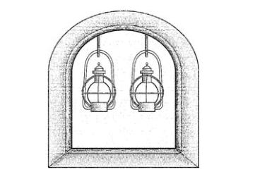
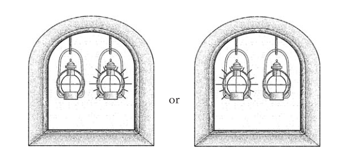
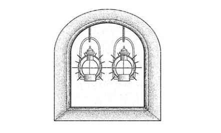
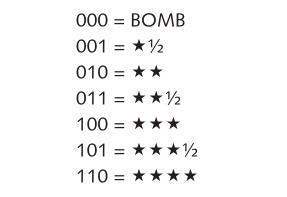
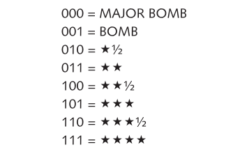
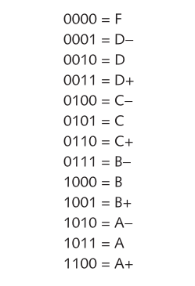
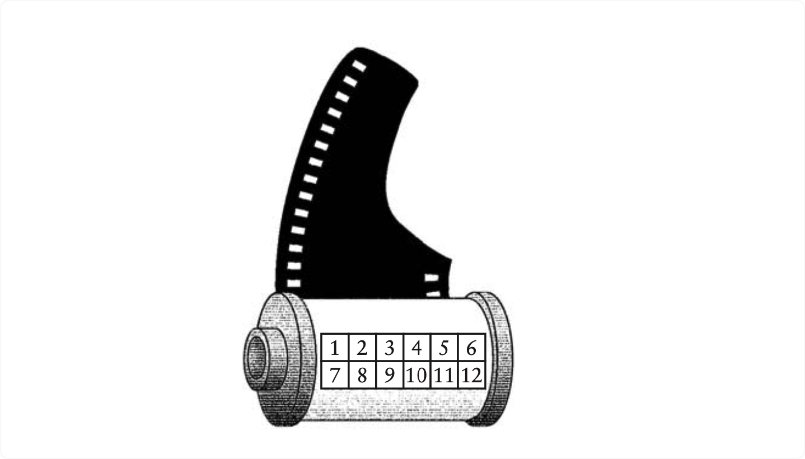
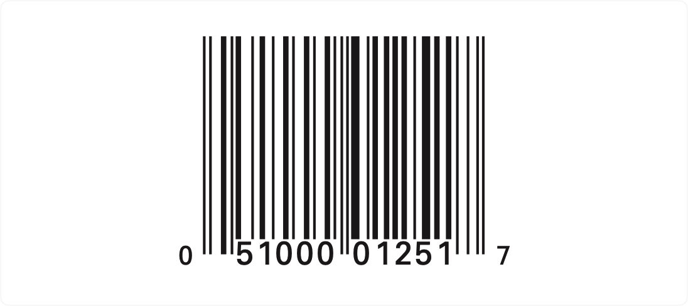

# Chapter Nine: Bit by Bit by Bit (二进制数)

托尼·奥兰多 <a id="footnote_quote_txt009_1" class="footnote_quote" href="part0016.html#footnote_content_txt009_1">[1]</a>在他1973年所写的一首歌中这样请求他挚爱的人： "请在橡树上系上一条黄丝带" 。他没有要求爱人进行详细的解释或者进行过多的讨论。他不想听到任何的 "如果" 、 "而且" 和 "但是" 。尽管这首歌是根据那些可能在真实生活中发生过的复杂感情和动人的往事所写的，但这个男人真正想要的答案仅仅是一个简单的 "是" 或 "不是" 。他希望在树上系一条黄丝带来表示 "是的，尽管你做了很多错事，并且入狱三年，但我依然希望你可以回来和我共同生活。" 他希望用树上没有系黄丝带来表示： "你连停在这里都别想。" 

这是两个界线分明、相互排斥的答案。托尼·奥兰多并没有唱 "如果你想考虑一下，就系半条黄丝带吧" 或者 "如果你不再爱我，但我们依然是好朋友，就请系上蓝丝带吧。" 相反，他将问题简化得非常非常简单。

还有几个和系黄丝带具有同样效果的例子（但可能无法用在诗里）：选择一种交通标志放在院子外面，来表示 "请进" 或 "此路不通" 。

或者在门上挂一个牌子：上面写着 "关门" 或 "营业" 。

或者用窗子里的一盏灯的亮灭来表示： "关闭" 或 "打开" 。

如果这就是你想说的，你可以选择很多方法来表示 "是" 或者 "不是" 。你不需要用一句话、一个单词甚至一个字母来表达。你所需要的只是一个比特，也就是只需要一个 0 或 1 即可。

就如前面章节所提到的，十进制与其他数字系统相比并没有什么不同，只是我们通常使用它来计数。很明显，我们使用十进制数字系统是因为我们有十个手指。如果我们将数字系统建成八进制数字系统（如果我们是卡通人物）或四进制数字系统（如果 我们是龙虾），甚至二进制数字系统（如果我们是海豚），也是合乎情理的。

但是二进制数字系统存在一点特殊性。这个特殊性就在于它是人们所能得到的最简单的数字系统。二进制数字系统中只有两个数字—— 0 和 1。如果想进一步简化这个数字系统，就只好把1去掉，最后我们就剩下的就只有一个数字0了。但仅用一个0是做不了任何事情的。

==单词 "`bit（比特）`" 被创造出来代表英文 "binary digit"==，它的确是和计算机有关的词语中最可爱的一个。当然，这个词也有它一般的意义： "一小部分，程度很低或数量很少" 。这个意义很贴切，因为 1 比特——一个二进制数字位——确实是一个非常小的量。

- bit `/bɪt/`   --n.(二进制) 位, 比特; 少量

- digit `/ˈdɪdʒɪt/` -n.〔从0到9的任何一个〕数字

通常当一个新的词语出现的时候，它都会有自己新的意义。比特这个词也是这样的。1  比特的意思并不仅仅是海豚用来计数的二进制数字位所包含的意义。**在计算机时代，比特被看做是组成信息块的基本单位。**

这是一个大胆的声明。当然，二进制数不是传达信息的唯一方法。字母、单词、莫尔斯码、布莱叶盲文和十进制数都可以来表达信息。关键在于，比特所传递的信息量极少。**1 比特 (a bit) 是可能存在的最小的信息量。任何小于 1 比特的内容都根本算不上是信息**。由于1比特表示的是可能存在的最小信息量，那么复杂一些的信息就可以用多位二进制数来表达（我们说比特传递的信息量 "小" ，并不是说它传送的信息不重要。事实上黄丝带对于与它相关的两个人来说是一个非常重要的信息）。

 "听，我的孩子，你们很快就能听到保罗·里威尔（Paul Revere）午夜的马蹄声。" 亨利·沃兹沃思·朗福罗（Henry Wadsworth Longfellow）写到。尽管他在描述保罗·里威尔是如何通知美国人英国殖民者入侵的消息时不一定与史实完全一致，然而他确实提供了一个耐人寻味的利用二进制传递重要信息的例子：

>
>他对他的朋友说： "今晚如果从镇里来的英国军队通过海路或陆路入侵，你就在北教堂钟楼的拱门处高高挂起提灯作为特殊信号——一盏提灯表示从英军从陆路进军，两盏则表示英军从海路入侵……" 

总结起来就是说，保罗·里威尔的朋友有两盏提灯。*如果英国军队从陆路进犯，他会在教堂钟楼上挂起一盏提灯。如果英国从海路进军，他会将两盏提灯都在教堂钟楼上挂起。*

然而，朗福罗并没有明确地提到所有的可能性。他留下了第三种可能的情况没有说，那就是英军根本没有入侵。朗福罗已经暗示，如果是这样的话可以通过不在教堂钟楼上挂提灯来表示。

假设两盏提灯实际上是永久固定在教堂钟楼上的。通常它们不会被点亮。

这代表英军还没有入侵。如果一盏提灯亮起：

表示英军从陆路入侵。如果两盏灯都被点亮：

表示英军正由海路入侵。

**每一盏提灯都代表一个比特。点亮的提灯表示比特值为  1；未点亮的提灯表示比特值为  0**。托尼·奥兰多已经向我们证明了传送只有两种可能性的信息只需要一个比特。如果保罗·里威尔只需要被告知英军将要入侵（而不管他们将从何处入侵），一盏提灯就足够了。这盏提灯亮起表示入侵，不亮则表示今夜无事。

要表达包含三种可能性的消息，则还需要再加一盏提灯。如果有了第二盏提灯，这两盏提灯在一起可以表达四种可能的信息：

> 00 = 英军今晚不会入侵
>
> 01 = 英军正由陆路入侵
>
> 10 = 英军正由陆路入侵
>
> 11 = 英军正由海路入侵

保罗·里威尔将三种可能性用两盏提灯来传送的做法事实上是相当老道的。用通信理论的术语来说，**他运用了 "冗余" （redundancy）来抵消噪声的影响。通信理论中，噪声（noise）是指影响通信效果的所有事物。电话线上的静电就是一个影响电话通信的鲜明例子。然而，电话通信通常都能成功，因为即使存在噪声，语音中仍存在大量的冗余。我们要理解对方的意思，并不需要听清对方所说的每个词的每个音节**。
- redundancy `/rɪˈdʌndənsi/` --n.冗余；裁员
- noise `/nɔɪz/` --n.噪音、杂声

在上述例子中，噪声是指黑夜中暗淡的光线以及保罗·里威尔距钟楼的距离，这两个因素都能让他分辨不出点亮的是哪盏提灯。以下就是朗福罗诗中至关重要的一段：

> 哦！他站在与钟楼等高的位置观察，
>
> 一丝摇曳的微光，接下来，有一盏灯亮了！
>
> 他跳上马鞍，调转马头，
>
> 徘徊、凝视，直到看清所有的灯，
>
> 钟楼上的第二盏也灯亮了起来！
>

那当然不是说保罗·里威尔正在分辨到底是哪盏灯先亮的问题。

这里最本质的概念就是，信息是指多个可能性中的一种。例如，当我们与一个人交谈的时候，我们所说的每个字都是对字典中所有字的一个选择。如果我们将所有字典中的字从1到351482编号，我们可以用数字准确地进行交谈，而无需使用单词。（当然，交谈双方都需要有一本字典，字典上标注着每个数字所代表的是什么字，并且他们还需要有足够的耐心。）

换句话说，所有可以被转换成对两种或多种可能性的选择的信息，都可以用比特来表示。不用说，人类有很多形式的交流是不能用对非此即彼的可能性的选择来表示的，但这些交流形式对我们人类的生存又是至关重要的。这就是人类为什么没有与计算机之间创建起浪漫的关系的原因（无论如何，我们都希望这种情况不会发生）。如果你无法用语言、图画或声音来表达某种事物的时候，你就也无法将这个信息用比特的形式来编码。当然，你也不会想去这么做。

竖起拇指或者不竖起拇指就是一个比特的信息。两个人是否竖起拇指——就如影评人罗杰·艾伯特和刚去世不久的珍妮·西斯科对新影片给出他们的评价时那样——传达了两个比特的信息（我们且不论他们对电影所做了什么评价；我们所关心的只是他们的拇指）。这里有四种可能性，可以用两个比特位来表示：

> 00 = 他们都不喜欢这部电影
>
> 01 = 西斯科讨厌它，艾伯特喜欢它
>
> 10 = 西斯科喜欢它，艾伯特讨厌它
>
> 11 = 他们都喜欢这部电影

第一个比特位表示西斯科的意见，为 0 表示西斯科讨厌这个部电影，为 1 表示喜欢。同样的，第二位表示艾伯特的意见。

因此，如果你的朋友问你： "对于电影 Impolite Encounter，西斯科和艾伯特的评论如何？" 你不必回答 "西斯科翘起了大拇指，艾伯特却没有。" 或者 "西斯科喜欢这部电影，而艾伯特不喜欢。" 你可以简短地回答： "10"。 只要你的朋友知道哪一位表示西斯科的意见，哪一位表示艾伯特的意见，并且知道 1 表示竖起拇指，0 表示没有，你的回答就会很容易理解。但是，前提是你和你的朋友都知道编码的含义。

我们也可以一开始就声明值为 1 的比特位表示没有竖起拇指，值为 0 的比特位表示竖起了，这可能有点违反常规。通常我们会认为值为 1 的比特表示赞成，而值为 0 的比特则表示反对，但是实际上这是可以任意调换的。只要每个使用代码的人知道 0 和 1 都具体表示什么意义即可。

某一位或一连串比特位所表示的意义通常是和上下文有关的。系在一棵橡树上的黄色丝带可能仅仅是对于把它系在那里的人和希望在那里看到它的人才有意义。改变丝带的颜色、系丝带的树或者系丝带的日期，它就可能成为一块没有任何意义的破布。同样，想从西斯科和艾伯特的手势中得到有用的信息，我们至少需要知道他们讨论的是哪部电影。

如果你保留了一份西斯科和艾伯特对于电影的评价和投票结果，你就可以在反映他们意见的比特信息中再添加一个比特位，来表示你自己的看法。添加第三个比特位将使得其代表的信息可能性扩展到 8 种：

> 000 = 西斯科讨厌它，艾伯特讨厌它，我讨厌它
>
> 001 = 西斯科讨厌它，艾伯特讨厌它，我喜欢它
>
> 010 = 西斯科讨厌它，艾伯特喜欢它，我讨厌它
>
> 011 = 西斯科讨厌它，艾伯特喜欢它，我喜欢它
>
> 100 = 西斯科喜欢它，艾伯特讨厌它，我讨厌它
>
> 101 = 西斯科喜欢它，艾伯特讨厌它，我喜欢它
>
> 110 = 西斯科喜欢它，艾伯特喜欢它，我讨厌它
>
> 111 = 西斯科喜欢它，艾伯特喜欢它，我喜欢它

利用二进制表示信息的一个额外的好处就是我们可以清楚地知道我们是否已经想到了所有的可能性。我们知道在这种情况下有且仅有 8 种可能性，不多也不少。如果用 3 个比特位，只能从 0 数到 7，后面不会再有其他的三位二进制数存在了。

在描述西斯科和艾伯特意见的比特位中，你可能一直在考虑一个非常重要而且令人不安的问题，这个问题就是：对于李纳德·马丁的 "电影及电视指南" 我们该怎么办呢？毕竟李纳德·马丁不用手指来评价电影，他用的是一种更传统的星级系统来评价。

要想知道需多少个马丁比特，首先必须了解这个系统的一些情况。马丁给电影的评价是1～4颗星，并且中间可以有半颗星，为了好玩，实际上他不会给电影只评一颗星，而是用 "BOMB（炸弹）" 来代替。这里总共有7种可能性，也就意味着我们可以用三个比特位来表示某个评价等级了：

你可能会问： "111 呢？" 在这里，这个编码不代表任何意义。它没有定义。如果二进制代码 111 被用来表示马丁的评价，那么你就会知道一定是出错了（计算机有可能会出现这样的错误，因为人不会给出这样的评分）。

之前提到过，当我们用两个比特位来表示西斯科和艾伯特的评价时，左边一位表示的是西斯科的意见，右边一位表示的则是艾伯特的意见。在上述马丁的评分系统中，每个单独的比特位都有确定的意义吗？是的，当然有。如果将比特码的数值加2，再除以2，我们就得到了马丁评分中对应的星星的数量。但这仅仅是由于我们以一种合乎人们对数字含义体验的方式定义了编码。我们同样也可以将编码作如下定义：

只要每个人都明白它的意义，这个编码就与先前的编码同样有效。

如果马丁遇到了一部甚至连一颗星都不值得给的电影，他会给出半颗星。他也当然会有足够的编码来表示半星选项。此时，编码会像下面这样定义：

但是，如果他遇到了一部连半颗星都不值得给的电影，他就决定给它没有星的级别（ATOMIC BOMB？），这时他就得再添加一个比特位了。因为已经没有三个比特位的代码可以用了。

《娱乐周刊》杂志常常举行一些评级活动，评级的对象除了电影之外还有电视节目、CD、书籍、CD-ROM、网站等其他一些东西。等级的范围是从A+～F（尽管似乎只有波利·舒尔的电影才能堪此殊荣）。计算一下，一共有 13 个可能的等级。我们需要用4个比特位来表示这些等级。

这里我们有3个编码没有用到，即1101，1110 和 1111，加上这 3 个总共有 16 个编码。

无论何时我们谈到比特，通常所指的都是一定数目的比特位。我们拥有的比特位数越多，所能表示的不同可能性就越多。

当然，在十进制中也是同样的道理。例如，电话号码的区号有多少位呢？区号共有 3 位十进制数，如果所有的区号都使用的话（实际上我们并没有都使用，但这里不考虑这个问题），一共就会有 10$^3$ = 1000 个号码，即 000～999。区号是 212 的 7 位电话号码会有多少种可能呢？10$^7$ = 1,0000,000 个。区号是212 并且以 260 开头的电话号码会有多少个呢？10$^4$，即 10,000 个。

类似的，在二进制中，可能有的编码数等于 2 的整数次幂，其幂指数就是比特位的位数。

| Number of Bits | Number of Codes |
| :------------: | :-------------: |
| 1              | 2$^1$ = 2       |
| 2              | 2$^2$ = 4       |
| 3              | 2$^3$ = 8       |
| 4              | 2$^4$ = 16       |
| 5              | 2$^5$ = 32      |
| 6              | 2$^6$ = 64      |
| 7              | 2$^7$ = 128     |
| 8              | 2$^8$ = 256     |
| 9              | 2$^9$ = 512     |
| 10             | 2$^{10}$ = 1024 |

每增加一个比特位就会将编码的数量增加一倍。

如果已知所要用到编码的数量，如何计算需要多少比特位呢？换句话说，在上表中，如何才能由码字数反推出比特位数呢？

所要用到的方法叫做以 2 为底的对数运算，对数运算是指数运算的逆运算。我们知道 2 的 7 次幂等于 128。那么以 2 为底的 128 的对数就是 7。用数学符号来表示：

$$
2^7$ = 128 \tag{}
$$

等价于：

$$
log_{2}{128} = 7
$$

因此，如果以 2 为底的 128 的对数是 7，以2为底256的对数就是8。那么，以2为底200的对数是多少呢？大约是7.64，但实际上并不需要知道具体的值。如果我们要用二进制来表示200种不同的事物，共需要8个比特位。

比特通常无法从日常观察中找到，它深藏于电子设备中。我们看不到压缩磁盘（CD）、数字手表或计算机中被编码的比特，但有时比特也会清晰地呈现在我们眼前。

下面就是一个例子。如果你有一台相机是使用35毫米胶片的，观察一下它的卷轴。这样拿住胶卷：

你可以看到像国际象棋棋盘那样银黑交错排列的方格，这些方格在图中已经用数字1～12进行了标注。这叫做DX编码，这12个方格实际上是12个比特位。一个银色的方格代表值为1的比特，一个黑色的方格代表值为0的比特。方格1和方格7通常是银色的（代表1）。

这些比特代表什么意思呢？你可能会知道，有些胶片比其他胶片对光更敏感些。这种对光的敏感程度称做胶片速度。人们会说某种对光非常敏感的胶片 "很快" ，那是因为这种胶片的曝光速度极快。胶片的曝光速度是由美国标准协会ASA（American Standards Association）来制定等级的。最常用的等级有100、200和400。ASA等级不仅以十进制数字的形式印在胶卷的外包装和暗盒上，它还以比特的形式进行了编码。

胶卷总共有24个ASA等级，它们是：

要对ASA等级进行编码需要多少个比特位呢？答案是5个。我们知道24是16，比24要小。25是32，而这个数又超过了所需的码字数。

与胶片速度对应的比特值如下表所示。

大多数现代的35毫米照相机胶片都使用这些码字（除了那些要手动进行曝光的相机和具有内置式测光表但需要手动设定曝光速度的相机以外）。如果你观察一下照相机内部放胶卷的地方，就会发现在胶卷筒内部有6个金属的触点，对应着胶片的金属方格（1～6号）。银色方格实际上是胶卷暗盒中的金属，即导体；涂有颜料的黑色方格，是绝缘体。

照相机中的电路产生一个电流流入方格1，方块1通常是银色的。这支电流有可能流经（也可能未流经）方格2～6上的5个触点，这取决于方格是纯银还是涂有颜料的。这样，如果照相机在触点4和触点5上检测到了电流，而在触点2、3和6上却没有检测到，那么这个胶片的速度就是400 ASA。这样，照相机就可以据此来调整胶片的曝光时间了。

假设胶片速度是50、100、200或400 ASA，那么廉价的相机就只需读取方格2和方格3上的电流。

多数照相机不需要读取或使用方格8～12。方格8、9和10被用来对这卷胶卷进行编码，方格11和方格12指出曝光范围（exposure latitude），这取决于胶片是用于黑白冲洗、彩色冲洗，还是做彩色幻灯片。

也许最常见的二进制数的表现形式就是无所不在的通用产品代码（UPC，Universal Product Code），这个小条形码出现在差不多我们日常所购买的所有商品的包装上。UPC已经成为计算机逐步进入人们日常生活的标志之一。

尽管UPC经常会使人们瞎猜疑，但是它其实是无辜的。使用它的初衷仅仅是为了实现零售业的结算和存货管理的自动化，而且它在这方面的应用也很成功。当UPC与一个设计精巧的结账系统结合使用时，顾客会得到一张逐项开列的消费清单，这点是传统的现金出纳员所无法做到的。

有趣的是，UPC也是二进制码，尽管乍看起来它并不太像。将UPC解码并看看UPC到底是怎样工作的，就明白了。

在最常见的形式中，UPC是由30条不同宽度的垂直黑色条纹组成的，它们的间隔宽度也不同，条纹下面标有数字。例如，以下是Campbell公司出品的10 3/4盎司的罐装鸡汁面汤包上的UPC。

我们要试着将条形码形象地看成是细条和黑条、窄间隙和宽间隙的排列，事实上，这就是观察条形码的一种方式。在UPC中，黑色条纹有四种不同的宽度，宽条纹的宽度分别是最细条纹宽度的两倍、三倍或四倍。同样，宽间隔的宽度分别是最窄间隔宽度的两倍、三倍或四倍。

但是，另一种解读UPC的方式就是将它们看做一列比特位。记住整个条形码不是在收银台的扫描仪所 "看到" 的那样。扫描仪所读到的并不是下面一排的数字，因为这需要更精密的光学识别（OCR，Optical Character Recognition）技术。扫描仪只识别整个条形码的一条窄带，条形码做得很大是为了便于结算台的操作人员用扫描仪对准。扫描仪所看到的那一个UPC断面可以这样表示：

看起来与莫尔斯码很像，不是吗？

当计算机从左向右扫描这个信息时，它会首先给遇到的第一个黑条分配一个值为1的比特，给与这个黑条相邻的白色间隙分配一个值为0的比特。随后的条纹和间隙被读做一行中的一系列比特，每个系列的比特可以是1位、2位、3位或4位，而这个位数取决于条纹和空隙的宽度。本例中扫描仪所扫描到的条形码与比特位之间的关系可以简单的表示为：

因此，整个UPC只不过是一串95位二进制数。在本例中，这些比特可以做如下分组。

前3位通常都是101，这就是最左边的护线，它帮助计算机扫描仪定位。从护线中，扫描仪可以确定代表单个比特的条和间隙的宽度是多少。否则，所有包装上的UPC就都得采用指定的大小了。

最左边的护线之后是6组比特串，每串含有7个比特位。其中每一组都可以是数字0～9的编码，后面我会做一个简短的说明。接下来是一个5比特位的中间护线，这是一个固定的模式（始终是01010），它是一个内置式的检错码。如果计算机扫描仪没有在应有的位置找到中间护线，它就无法破解UPC码。这条中间护线是用来预防条形码被篡改或被印错的一种方法。

中间护线后面仍然是6组比特串，每组中含有7个比特位。之后是最右边的护线，最右边的护线通常都为101。最右边的护线可以实现UPC的反向扫描（也就是从右到左扫描），这一点我们将在后面解释。

因此，整个UPC对12个数字进行了编码。UPC的左边含有6个编码数字，每个数字占有7个比特位。你可以利用如下的表格来解码。

注意，这里每个7位编码都是以0开头，以1结尾的。如果扫描仪遇到了一个位于左边的7位编码，这个编码是以1开头以0结尾的，那么它就知道自己没有将UPC正确地读入或者条形码被篡改了。另外我们还注意到每组编码都仅有两组连续为1的比特位，这就暗示每个数字对应着UPC码中的两个垂直条纹。

你也会发现，上表中每组编码都含有奇数个1。这是另一种检查错误和一致性的方法，称为奇偶校验。如果一组比特位中含有偶数个1，它就称为偶校验；如果含有奇数个1，那么它就称为奇校验。这样看来，所有这些编码都拥有奇校验。

破解右边的6组7位编码要用到下表。

这些编码都是之前编码的补码：之前出现0的地方，现在都换成了1，反之亦然。这些编码都是以1开头，以0结尾的。除此之外，每组编码都含有偶数个1，属于偶校验。

现在，我们就可以解读UPC了。运用以上两个表格，我们可以确定，Campbell公司的10 3/4盎司罐装鸡汁面汤包上的12个数字为：

0　51000　01251　7

太令人失望了。就如你所看到的，这与UPC下面印刷的数字完全相同（这样做是很有意义的，在扫描仪由于某种原因无法解读出条形码时，收银员就可以手动输入这些数字，毫无疑问你也看到过这一幕）。我们没有必要了解解码的全部过程，况且，我们也无法从中解码出任何秘密信息。不过，关于UPC的解码工作已经没有什么可做了，那30根竖条已经变成了12个数字。

第一个数字（在这里是0）被称为数字系统符。0意味着这是一个常规的UPC。如果UPC出现在杂货店中那些需要称重的商品上，例如肉、农产品，这个编码就会是2。票券的UPC的第一个数字通常是5。

接下来的5个数字表示制造商编码。这种情况下，51000就是Campbell公司的编码。所有Campbell公司的产品都有这个编码。后面的5位代码（01251）是这个公司的某种商品的编码，上例中这个数字就是指10 3/4盎司罐装鸡汁面。只有和制造商编码同时出现的时候这个编码才有意义。另一个公司的鸡汁面会有另外一个编码，01251在另外一个公司可能是指一种完全不同的产品。

与大家通常的想法相反，UPC不包含物品的价格信息。价格信息可以从商店使用的与该扫描仪相连的计算机中检索到。

最后一个数字（在这里是7）称为模校验字符。这个字符可用来进行另外一种错误检验。为了了解它是如何工作的，我们将前11个数字（在这个例子中是0 51000 01251）各用一个字母来代替：

$$
A　BCDEF　GHIJK
$$
然后，计算下式的值：

$$
3 * ( A + C + E + G + I + K ) + (B + D + F + H + J)
$$

从离这个值最近并且大于或等于它的一个10的整倍数中减去它，其结果称为模校验字符（modulo check character）。在Campbell鸡汁面的例子中，有：

$$
    3 * (0 + 1 + 0 + 0 + 2 + 1) + (5 + 0 + 0 + 1 + 5) = 3 * 4 + 11 = 23
$$

紧挨 23 并大于或等于 23 的 10 的整倍数是 30，因此：

$$
    30－23 = 7
$$

这就是印在外包装上并以 UPC 形式编码的模校验字符，这是一种冗余措施。如果扫描仪没有扫描到与计算机计算结果相同的模校验字符，那么计算机就视这个UPC无效。

通常情况下，要表示0～9的十进制数字只需要4个比特位就足够了。UPC中每个数字用了7个比特位。这样，UPC总共享了95个比特位来表示11个有效的十进制数。实际上，UPC中还有空白位置（相当于9个0比特），它们位于左、右护线的两侧。这就意味着，整个UPC需要113个比特位来编码11个十进制数，平均每个十进制数所用的比特位超过了10个！

如我们所看到的，有部分冗余对于检错来讲是必要的。这种商品编码如果能够被顾客用笔轻易地改动，那么这种产品编码措施也就没有任何意义了。

UPC可以从两个方向读，这一点是非常方便的。如果扫描装置解码的第一个数是符合偶校验（即7位编码中有偶数个1）的，扫描仪就会知道，它正从右向左扫描UPC码。计算机就会使用如下表来解码。

以下是对左边数字的解码表。

所有这些7位编码都与由左向右扫描时得到的UPC完全不同。这里不会有模棱两可的现象存在。

在这本书中我们是从莫尔斯码开始接触编码的，莫尔斯码是由点和划组成的，且点和划之间由一定的时间间隔分开。尽管莫尔斯码乍看上去并不像是由0和1组成的，然而它们却是等价的。

回顾一下莫尔斯码的编码规则：划的长度等于点长度的三倍；单个字母内，点或划之间以长度与点相等的空格来分开；单词内的各个字母之间用长度等于划的空格分隔；各单词之间由长度等于两倍的划的空格分开。

- **Note：**作者这里的说法和上面第一章的 `Additional Info: 下图来自维基百科` 的定义稍有不同
  
  > 国际摩尔斯电码
    1. 一点的长度是一个单位，
    2. 一划是三个单位，
    3. 在一个字母中点划之间的间隔是一点。
    4. 两个字母之间的间隔是三点（一划）。
    5. 两个单词之间的间隔是七点。

让我们将分析简化一些，假设一个划的长度是点长度的两倍，而不是三倍。这就意味着一个点就是一个值为1的比特位，一个划是两个值为1的比特位，空格则是值为0的比特位。

下面是第2章中莫尔斯码的基本表。

以下是转化为比特的结果。

注意，这里所有编码都是以1开头，以两个0结尾。结尾处的两个0代表单词内各个字母之间的空格。单词之间的空格编码则是另外一对0。因此，在莫尔斯码中 "hi there" 通常是这样表示的：

但是，当莫尔斯码采用比特来表示的时候，看起来就像UPC的一个截面。

用比特的形式表示布莱叶盲文比表示莫尔斯码容易得多。布莱叶盲文是 6 位编码。其中的每一个字母都是由 6 个点组成的，这些点可能是凸起的，也可能是不凸起的。就如同在第 3 章中所提到的那样，这些点通常用数字 1～6 编号。

例如，单词 "code" 用布莱叶盲文可以这样表示：

如果突起的点代表1，平坦的点代表0，则在布莱叶盲文中，每个符号都可以用6个比特的二进制代码来表示。单词 "code" 中的四个布莱叶字母符号可以简单地写成：

100100 101010 100110 100010

这里，最左边的一位对应编号为1的位置，最右边的一位对应编号为6的位置。

在本书后面的章节可以看到，比特可以表示文字、图片、声音、音乐、电影，也可以表示产品编码、胶片速度、影评结果、英国军队的入侵，以及心爱之人的意图。但是，从根本来说，比特是数字。在用比特表示其他信息的时候我们所要做的就是计算有多少种可能性。这决定了我们需要的比特位数，以便每种可能性都可以分配到一个编号。

比特在逻辑学中也很重要。逻辑学是哲学和数学的奇特融合，其主要目的就是确定某个陈述是真还是假。真和假同样可以表示为1和0。

<a id="footnote_content_txt009_1" href="part0016.html#footnote_quote_txt009_1" class="calibre2">[1]</a>托尼·奥兰多（Tony Orlando），美国歌手，1944年出生于纽约，是一位希腊和波多黎各的混血儿，《老橡树上的黄丝带》是他的经典名曲，脍炙人口。歌曲描述一个在监狱服刑的丈夫在即将服刑期满的前夕，因担心远在家乡的妻子不接受他，写信告诉妻子，如果愿意再次接纳他，请在他出狱返家的当天，在家门口的老橡树上系上一条黄丝带；如果他没有看到黄丝带的话，他就会识相地默默离开。结果这位丈夫出狱返家时，家门口的老橡树上绑满了数以百计的黄丝带在空中飞扬，令他十分感动。后来，绑黄丝带成为全美国的一种风俗，表示迎接久别的亲人回家。——译者注

