# Chapter Ten - Logic and Switches（第 10 章 - 逻辑与开关）

**什么是真理？亚里士多德认为真理是与逻辑相关的某种事物**。

- 亚里士多德（前384年6月19日－前322年3月7日），[古希臘哲學家](https://zh.m.wikipedia.org/wiki/古希腊哲学家列表)，[柏拉圖](https://zh.m.wikipedia.org/wiki/柏拉圖)的學生、[亞歷山大大帝](https://zh.m.wikipedia.org/wiki/亚历山大大帝)的老師。

**《工具论》**（可以追溯到**公元前4世纪**）这本书收集了他的理论，这也是**最早在逻辑上做出全面阐述的著作**。对于古希腊人来说，逻辑是在追求真理的过程中的一种分析方法，因此它被人们认为是一种哲学形式。**亚里士多德的逻辑学基础是三段论法**。最著名的三段论法（但是这个三段论却并没有出现在亚里士多德的著作中）是：

> 所有男人都必有一死；
>
> 苏格拉底是男人；
>
> 因此，苏格拉底必有一死。

在三段论中，首先假定两个条件是正确的，然后再通过这两个条件推断出结论。

苏格拉底之死这种结论似乎太简单了，然而，三段论的形式其实是多种多样的。例如，以下两个由19世纪的数学家查尔斯·道奇森（也被人们称为刘易斯·卡罗尔）提出的条件：

> 所有哲人都是符合逻辑的；
>
> 一个没有逻辑的人总是非常顽固的。

上述条件的推论一点也不明显（结论是 "一些顽固的人不是哲人。" 注意，这里 "一些" 这个词的出现完全是意料之外的）。

在过去的两千多年里，数学家们都压制着亚里士多德的逻辑学，并试图用数学符号和算子限制它的发展。19世纪前期，唯一涉足这个领域的人就是莱布尼茨（1648-1716），他早年涉足了逻辑学，而后转移到了其他兴趣上（例如，与牛顿在同一时期，独立发明微积分）。

而后乔治·布尔出现了。

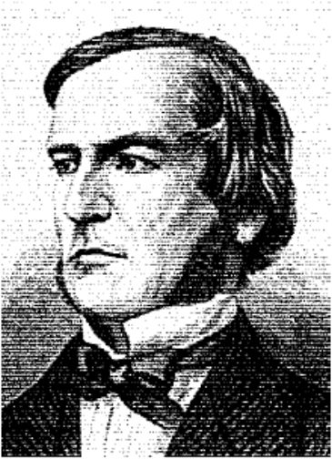

乔治·布尔于1815年出生于英格兰，降临到了这个对于他来说充满不公的世界。乔治的父亲是个鞋匠，母亲曾经做过女佣，因此，按常理在当时英国森严的等级制度下，他基本上不会做出什么有别于父辈们的事业。但是他凭借着勇于探究的精神以及父亲的帮助（乔治的父亲对科学、数学和文学都有浓厚的兴趣），乔治在年少的时候就接受了良好的教育，而这本应是上流社会中的男孩子们才能享有的特权。他学习了拉丁语、希腊语和数学。1849年，布尔凭借着他早期在数学研究上的论文成为了爱尔兰利克市皇后书院的数学系首席教授。

19世纪中叶的一些数学家一直在研究逻辑的数学定义（其中最著名的是奥古斯特·德·摩根），但在理论上有着实际突破的却是布尔。首先是一部短篇著作《逻辑的数学分析——关于演绎推理的一篇随笔》（*The Mathematical Analysis of Logic, Being an Essay Towards a Calculus of Deductive Reasoning (作为演绎推理微积分的论文)*，1847年），而后是一篇更长且更宏大的著作《思维规律的研究——逻辑与概率数学理论的基础》（*An Investigation of the Laws of Thought on Which Are Founded the Mathematical Theories of Logic and Probabilities*，1854年），通称《思维规律》（*The Laws of Thought*）。布尔死于1864年，他由于冒雨赶去上课而感染了肺炎，那一年，他年仅49岁。

布尔于1854年所发表著作，其书名就彰显了一种雄心壮志。因为**理性的人总是通过逻辑去进行思考**，如果我们找到了一种利用数学来描述逻辑的方法，也会找到一种用数学方法来描述大脑是如何工作的。当然，现在这种观点显得很是天真（然而在那个时代这确实是非常先进的思想）。

布尔发明了一种代数，这种代数看上去与传统代数非常相似，而且运算规则也非常类似。在传统的代数中，操作数（通常为字母）代表数字，算子（通常为 "+" 和 "×" ）则用来指示这些数字之间如何运算。

通常，我们应用传统代数来解决可能像这样的问题：安雅有 3 磅豆腐。贝蒂的豆腐是安雅的 2 倍。卡门的豆腐比贝蒂多 5 磅。迪尔得丽的豆腐是卡门的 3 倍。试问迪尔得丽有多少豆腐？

在解决这个问题时，我们首先要将文字叙述转化为数学语言，下面用四个字母分别表示每个人所拥有的豆腐有多少磅:

注：A = 安雅; B = 贝蒂; C = 卡门; D = 迪尔德丽 
> A = 3
>
> B = 2 × A
>
> C = B + 5
>
> D = 3 × C

将以上4个表达式带入同一式子中合并，最终可以得到一个加法和乘法混合运算的式子：
> D = 3 × C
>
> D = 3 × (B + 5)
>
> D = 3 × ((2 × A) + 5) （读作：3 乘以 2 与 A 的积加 5 的和）
>
> D = 3 × ((2 × 3) + 5)
>
> D = 33

当进行传统代数运算的时候，我们会遵循一定的规则。这些规则在实际中可能非常根深蒂固，以至于我们不再认为它们是规则，甚至可能忘记它们的名字。但**规则确实是任何形式数学运算的基础**。

首先是**加法和乘法的交换律（commutative `/kə'mjuːtətɪv/`）**。意思就是，在运算符两边的操作数可以任意调换：
> A + B = B + A
>
> A × B = B × A

相反，减法和除法则是无法应用交换律的。

**加法和乘法也遵循结合律（associative `/əˈsəʊʃətɪv/` ）-adj.联想的**，如下：
> A + (B + C) = (A + B) + C 
>
> - 读作：A 加 B 与 C 的和 = A 与 B 的和 加 C 
> - 英文读作：A plus the sum B plus C 
>
> A × (B × C) = (A × B) × C
>
> - 读作：A 乘以 B 与 C 的积 = A 与 B 的积 乘以 C

最后，**乘法遵循加法分配率（distributive `/dɪˈstrɪbjətɪv/` -adj.分发的﹐分配的）**：
> A × (B + C) = (A × B) + (A × C)
>
> - 读作：A 乘以 B 与 C 的和 = A 与 B 的积 加上 A 与 C 的积

传统代数的另一个特点就是，它是处理数字的。例如，豆腐的重量、鸭子的数量、火车行驶的距离或家庭成员的年龄。布尔的天才之处就在于他把代数从数的概念中抽离出来而使其更加抽象。在布尔代数（Boole’s algebra，现在也这样叫）中，操作数不是数字而是类（class）。简单说，一个类就是一个事物的群体，它后来也被称为集合（set）。

以猫为例。猫可以分为公猫与母猫。为了简便，用字母M代表公猫，字母F代表母猫。记住，这两个符号代表的不是数字。公猫与母猫的数量会随着小猫的出生和老猫的死去而发生变化。这两个字母分别表示两类猫——有特定特征的猫的群体。当我们提到公猫的时候，就可以使用M。

我们也可以用别的字母代表猫的颜色，例如：T可以代表褐色的猫，B可以代表黑猫，W代表白猫，O代表不在T、B或W集合中的其他颜色的猫。

仍以此为例，猫还可以分为已被绝育的和未被绝育的。我们用字母N来表示已被绝育的猫，字母U表示未被绝育的猫。

在传统的（数字的）代数中，符号 "+" 和 "×" 用来表示加法和乘法。在布尔代数中，也有 "+" 和 "×" 这样的符号，这很可能造成混淆。所有人都知道在传统代数中如何将数字相加或相乘，但是我们如何将类相加或相乘呢？

然而，在布尔代数中，并没有实际意义上的加或乘。而符号 "+" 和 "×" 表示的是完全不同的意义。

在布尔代数中，符号 "+" 表示两个集合的并集。两个集合的并集的意思就是指第一个集合中的所有元素与第二个类中所有元素的集合。例如，B+W表示的就是所有黑猫和白猫的集合。

在布尔代数中，符号 "×" 表示两个集合的交集。两个集合的交集就是指既在第一个集合中又在第二个集合中的所有元素的集合。例如，F×T代表的是所有褐色母猫的集合。像传统代数一样，我们可以将F×T写为F·T，或者简写为FT（布尔代数中的首选形式）。可以将两个字母想象成两个形容词串联在一起：褐色的母猫。

为了避免在传统代数与布尔代数间混淆，有时用符号 "∪" 和 "∩" 来代替 "+" 和 "×" 。布尔对数学方面的革命性影响是让人们熟知的符号更加抽象，因此，我决定坚持他的做法，而不是引入新的符号到他的代数中。

交换律、结合律和分配律都在布尔代数中同样成立。而且在布尔代数中，加法还可以来分配乘法，但在传统的代数中，这是不成立的：

> W + (B × F) = (W + B) × (W + F)

白猫和黑色母猫的并集与如下两个集合的交集是一样的，这两个集合分别是，白猫和黑猫的并集，白猫和母猫的并集。虽然有点难理解，但是，这个结论是成立的。

布尔代数中还有另外两个符号是非常重要的。这两个符号看起来像数字，但是它们并不是真正意义上的数字，相对于数字而言，它们有不同的意义。在布尔代数中，符号1表示 "全集" ——也就是我们所提到的所有事物。在前面的例子中，符号1表示的就是 "所有猫的集合" 。因此：

> M + F = 1

也就是说，公猫与母猫的并集是所有猫。同样的，褐色的猫、黑猫、白猫与其他颜色猫的并集也是所有猫的集合：

> T + B + W + O = 1

通过以下方法也可以得到所有猫的集合：

> N + U = 1

符号1与减号连用可以表示在全集中排除一些事物，例如，

> 1 − M

意思就是除去公猫的所有猫的集合。这个集合与母猫的集合是相等的：

> 1 − M = F

另一个要用到的符号就是0，在布尔代数中，符号0表示空集——不包含任何元素的集合。空集往往是两个互斥集合的交集，例如，母猫与公猫的交集：

F × M= 0

注意，在布尔代数中，1和0有时也同在传统代数中的应用一样。例如，所有猫与母猫的交集是母猫的集合：

1 × F= F

空集与母猫的交集还是空集：

0 × F = 0

空集与母猫的并集则是母猫：

0 + F = F

但是有时也会出现与传统代数相悖的结果。例如，所有猫与母猫的并集是所有猫的集合：

1 + F = 1

这个式子在传统代数中就是没有意义的。

由于F是母猫的集合，（1-F）是所有非母猫的猫的集合，因此这两个集合的并集是1：

F + (1-F) = 1

而这两个集合的交集为0：

F × (1-F) = 0

在历史上，这个公式代表了逻辑学上的一个重要概念：这一概念被称为矛盾律。矛盾律指出事物不可能既是它本身，同时又是它的对立面。

布尔代数中与传统代数形式上最大区别之处就是这样一个表达式：

F ×F= F

这个表达式很明确地表达了布尔代数的意义：母猫和母猫的交集依然是母猫。但是如果F代表的是数字，这个表达式就不会成立。布尔认为式子：

> $X^2$ = $X$

就是将其代数同传统代数区别开的一条语句。另一个在传统代数中看起来比较有趣的式子是：

> F + F = F

母猫和母猫的并集依然是母猫。

布尔代数提供了一种解决亚里士多德三段论的数学方法。我们再看看最著名的三段论法中的前两句，但是现在不区分性别：

所有人都难逃一死；

苏格拉底是人。

我们用P表示所有人的集合，M表示必有一死的事物，S表示苏格拉底的集合。

 "所有人都难逃一死" 是什么意思？意思就是说所有人的集合与必有一死的事物的交集是所有人：

P× M = P

命题P × M = M是错误的，因为，在必有一死的事物中，还包含猫、狗和榆树等。

 "苏格拉底是人" 这句话的意思就是苏格拉底的集合（一个很小的集合）与所有人的集合（一个很大的集合）的交集是苏格拉底：

S × P= S

根据第一个等式我们可以得到P = P × M，我们将这个等式带入到第二个等式中去：

S × (P× M) = S

根据结合律，可以写为：

(S ×P) × M= S

并且我们已知S × P = S，因此上式可以简化为：

S × M= S

到此，我们得出了结论。这个表达式告诉我们，苏格拉底的集合与必有一死的事物的集合的交集是S，也就是说，苏格拉底必有一死。如果我们让S × M = 0，会得出苏格拉底不会死。如果S × M = M，结论就会是：只有苏格拉底会死，其他任何事物都是不死的！

应用布尔代数证明这个显而易见的事实（实际上在2400年前苏格拉底自己就证明了他必有一死）似乎有点小题大做，然而布尔代数同样可以用来确定某种事物是否遵循特定的标准。或许某天你走进了一家宠物商店，对店员说： "我想要一只公猫，已绝育的，白色或褐色都可以，或者一只母猫，也要是已绝育的，除了白色任何颜色都可以；或者，只要是黑猫就可以。" 店员会对你说： "你想要的猫是在以下这样的集合里：

(M× N × (W + T)) + (F× N×(1 - W)) + B

对么？" 你会说： "是的！正是！" 

为了确定店员是正确的，你大概会去抛弃并集和交集的概念，并用OR和AND取而代之。这里将字母大写是因为，它们表示的不仅是字面意义，而表示布尔代数中的运算。做并集的时候，可以看做：第一个集合OR第二个集合。做交集的时候，可以看做：第一个集合AND第二个集合。除此之外，NOT可以看做在1后面加一个减号。总的来说：

●符号 "+" （之前作为并集的符号）现在可以用OR来表示。

●符号 "×" （之前作为交集的符号）现在可以用AND来表示。

●符号 "1-" （之前意思是从全集中去掉某些元素）现在用NOT来表示。

因此，原表达式可以写为：

> (M AND N AND (W OR T)) OR (F AND N AND (NOT W)) OR B

这样就非常接近你所说的话了。注意，这里是如何用括号表述清楚你的意图的。你想要的猫来自以下三个集合中的一个：

> (M AND N AND (W OR T))
>
> OR
>
> (F AND N AND (NOT W))
>
> OR
>
> B

有了这个公式，店员就可以做一个布尔测试了。为了避免麻烦，我采用了一种略微有点不同的布尔代数形式——字母不仅仅代表集合。这里，字母可以用数字来赋值。我们只用数字0和1。数字1代表YES，True，即这只猫是符合这样的标准的。数字0表示NO，False，即这只猫不符合这种特定标准。

首先，店员拿出了一只未绝育的褐色公猫。以下是我期望得到的猫的表达式：

> (M × N × (W + T)) + (F × N × (1 − W)) + B

以下是用0和1替换之后的式子：

> (1 × 0 × (0 + 1)) + (0 × 0 × (1 − 0)) + 0

注意，只有M和T的值为1，因为这只猫是褐色的公猫。

现在我们要做的就是化简这个表达式。如果简化结果为1，则这只猫就符合你的标准；如果简化结果为0，那么这只猫就不符合。在化简的时候要切记，我们并不是真的在进行加和乘的运算，尽管通常我们可以当做是。符号 "+" 代表OR，符号 "×" 代表AND，在大多同类的规则中适用（有时在现代课本中也使用符号 "∧" 和 "∨" 来表示AND和OR，而非用符号 "×" 和 "+" 。但是在这里符号 "+" 和 "×" 是具有特殊意义的）。

当符号 "×" 代表AND时，有以下几种可能的结果：

0 × 0 = 0

0 × 1 = 0

1 × 0 = 0

1 × 1 = 1

也就是说，只有当运算符AND左右两端都为1的时候，结果才为1。这个运算与常规的乘法是完全相同的，该规则可以总结为如下这样一个表格，这与第8章中加法和乘法表的形式类似。

当符号 "+" 表示OR的时候，有以下几种可能的结果：

0 + 0 = 0

0 + 1 = 1

1 + 0 = 0

1 + 1 = 1

如果运算符OR左右两端有一个操作数为1，则其运算结果就为1。这个运算与常规的加法类似，但是在1 + 1 = 1这里例外。运算符OR可以概括为如下这样一个表格。

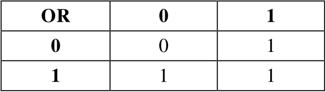

我们应用这两个表格来计算一下原表达式的结果：

(1 × 0 × 1) + (0 × 0 × 1) + 0 = 0 + 0 + 0 = 0

结果为0，意味着NO，False，这只小猫不符合标准。

接着，店员拿出了一只已绝育的白色母猫。原始表达式是：

(M × N × (W + T)) + (F × N × (1-W)) + B

将0和1带入得：

(0 × 1 ×(1 + 0)) + (1×1×(1-1)) + 0

化简得：

(0 × 1 × 1) + (1×1× 0) + 0 = 0 + 0 + 0 = 0

因此，第二只小猫也不符合标准。

然后，店员拿出了一只已绝育的灰色母猫（灰色属于其他颜色——非白色、黑色或褐色）。表达式如下：

(0 × 1 ×(0 + 0)) + (1 × 1×(1-0)) + 0

化简结果为：

(0 × 1 × 0) + (1 × 1 × 1) + 0 = 0 + 1+ 0 = 1

最后结果为1，意味着Yes，True，这个只小猫可以带回家（而且还是只漂亮的小猫！）。

当晚，在小猫蜷缩在你的腿上睡觉的时候，你突发奇想是否可以通过连通开关和灯泡的方法来确定某类猫咪是否符合你的标准（是的，你就是个奇怪的孩子）。你根本没发现，你将做出一个重要的概念上的突破。你要做的这些实验将布尔代数与电路相融合，并且可以设计和制造利用二进制进行计算的计算机。但是，不要让这些吓倒你。

在实验的开始，将灯泡和电池正常连接起来，但是，你用了两个开关，而不是一个，如下图所示。

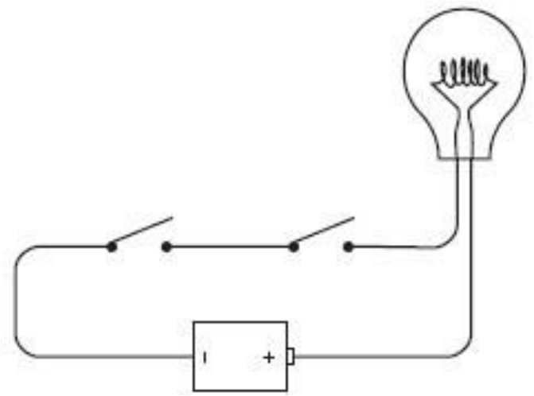

像这样一个接着一个首尾相连的接线方式称做串联（series）。如果你闭合左端的开关，什么都不会发生。

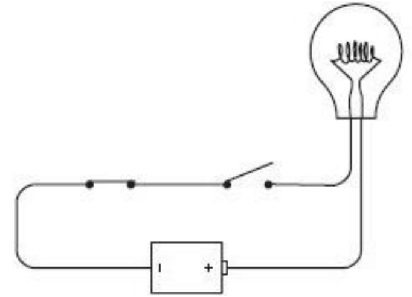

如果让左边的开关保持断开，而闭合右边的开关，同样什么都不会发生。只有当左右两个开关都闭合时灯泡才会亮，如下图所示。

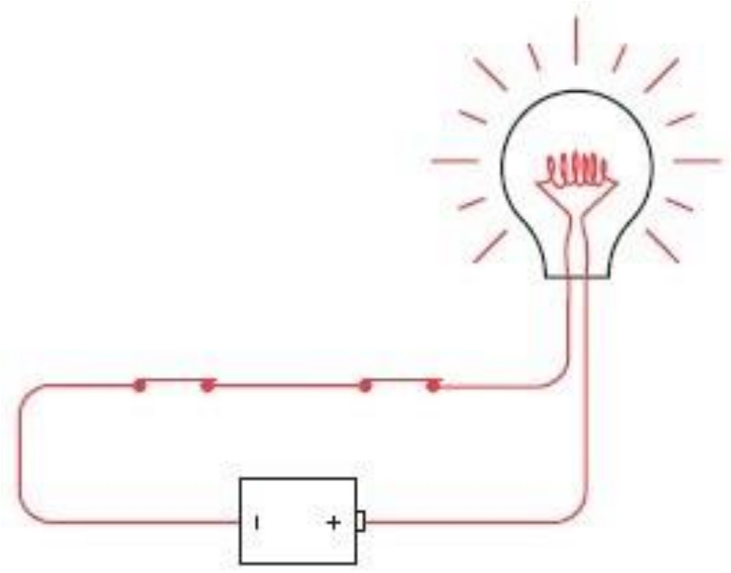

这里的关键词是 "与" 。当左右两个开关必须都是闭合的时候电流才流过回路。

这个电路是一个简单的逻辑演示。实际上，灯泡是在回答 "两个开关是否都闭合？" 这样一个问题。这个电路的运转情况，我们可以总结为如下表格。

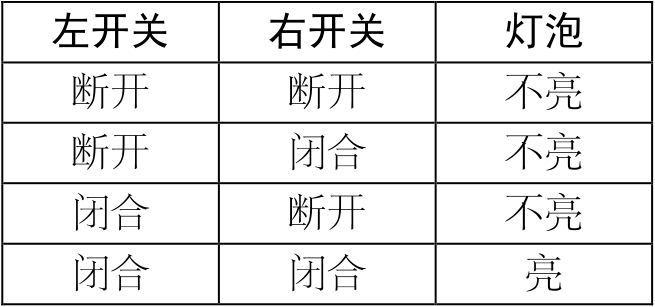

在之前的章节中，我们已经知道二进制数是如何表示信息的——而信息是无所不包的，无论是简单的数字还是罗杰·艾伯特<a id="footnote_quote_txt010_1" class="footnote_quote" href="part0017.html#footnote_content_txt010_1">[1]</a>拇指的方向都是信息。我们可以说二进制0代表 "艾伯特的拇指向下" ，二进制1代表 "艾伯特的拇指向上。" 一个开关有两个状态，因此可以代表二进制数。我们可以说0代表 "开关断开" ，1代表 "开关闭合" 。一个灯泡有两种状态，因此，它也可以用二进制数来表示。我们可以说0代表 "灯泡不亮" ，1代表 "灯泡亮" 。根据以上表述，我们可以将表格简化为如下形式。

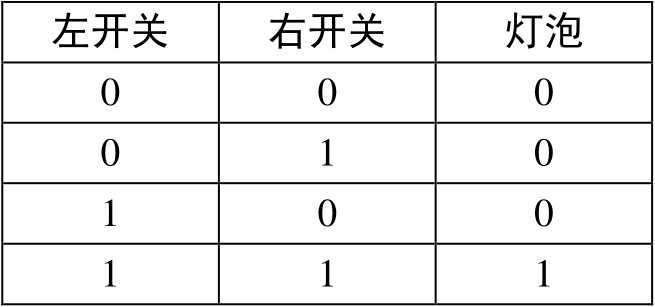

注意，如果将左边的开关和右边的开关调换位置，结果是一样的。我们不用分辨开关哪个是哪个。所以，上面的表也可以写为和AND表或OR表类似的形式。

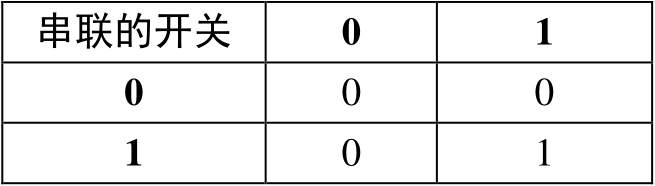

的确，这与AND表是一样的。

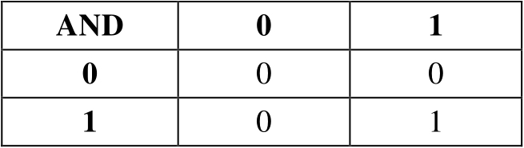

这个简单的电路演示了布尔代数中的AND运算。

接下来，稍微改变一下开关连接方式，如下图所示。

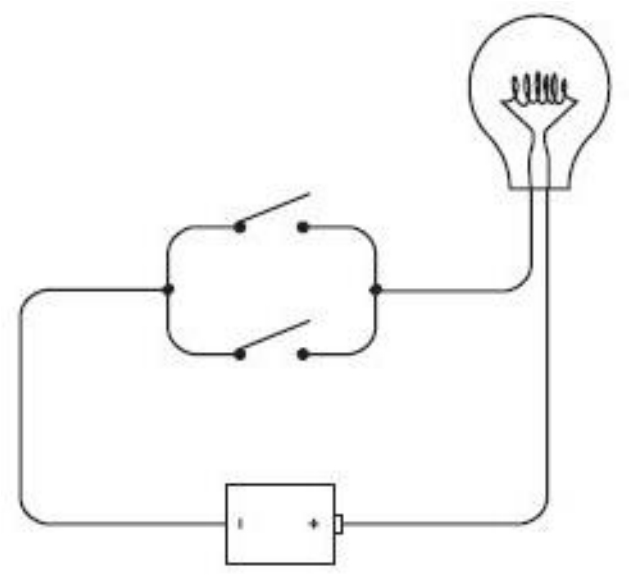

这种连接方式叫做并联（parallel）。这种连接与上一种连接的不同之处就在于，闭合上面的开关，灯泡就会亮。

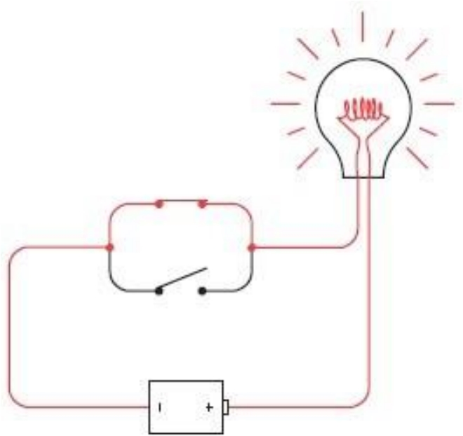

或者闭合下面的开关，灯泡也会亮。

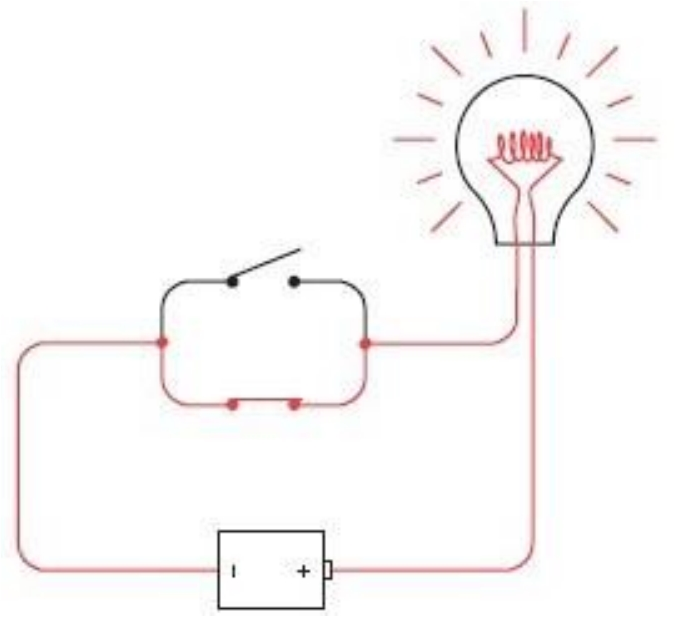

或者闭合所有的开关，灯泡还是会亮。

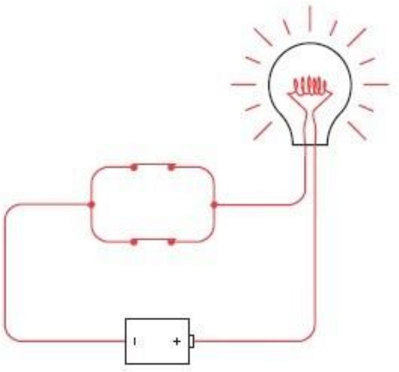

如果上面的开关闭合或者下面的开关闭合或者都闭合，灯泡都会亮。这里的关键词为 "或" 。

电路又一次做了一个逻辑上的演示。灯泡回答了 "是否有开关闭合？" 的问题。下表总结了这样一个电路的工作原理。

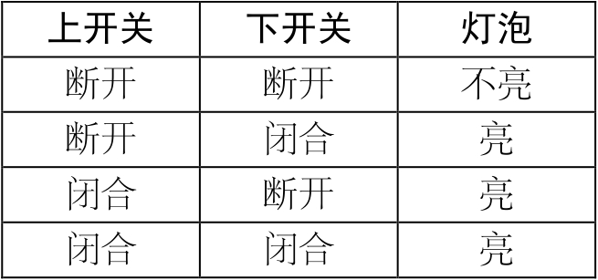

同样用0来表示开关断开或者灯泡不亮，用1表示开关闭合或灯泡亮，这个表可以写为如下形式。

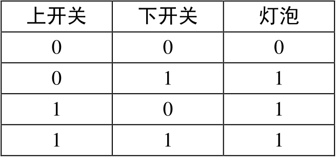

同样的，两个开关可以调换，因此上表也可以写为如下形式。

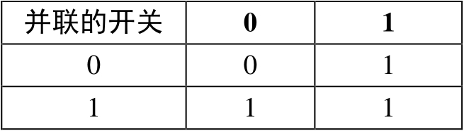

你可能已经猜到了，这与布尔代数中的OR是一样的。

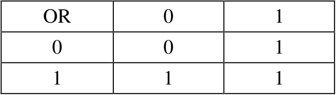

这就是说，两个开关并联相当于布尔代数中的OR运算。

最初当你走进宠物商店的时候，告诉店员： "我想要一只公猫，已绝育的，白色或褐色都可以；或者一只母猫，已绝育的，除了白色任何颜色都可以；或者一只黑猫。" 店员会得出以下表达式：

(M × N × (W+ T)) + (F × N × (1 -W)) + B

既然你知道两个开关串联表示逻辑AND（用符号 "×" 表示）；两个开关并联表示逻辑OR（用符号 "+" 表示），因此你可以将8个开关做如下连接。

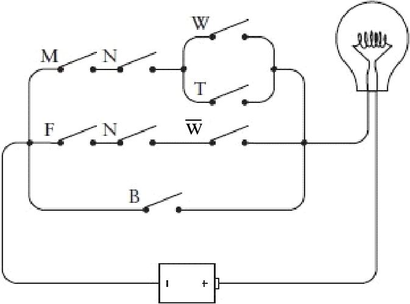

此电路中的每个开关都用一个字母来标记——与在布尔表达式中所用的字母一样（表示NOT W，它是1-W的另一种表示方式）。如果按照从左到右、从上到下的顺序遍历电路图，你就会以同样次序遇到出现在表达式中的字母。在表达式中每个符号 "×" 对应电路中的两个开关（或者两组开关）串联的点。在表达式中每个符号 "+" 对应电路中两个开关（或两组开关）并联的位置。

与之前一样，店员首先拿出了一只未绝育的褐色公猫。闭合相应的开关，如下图所示。

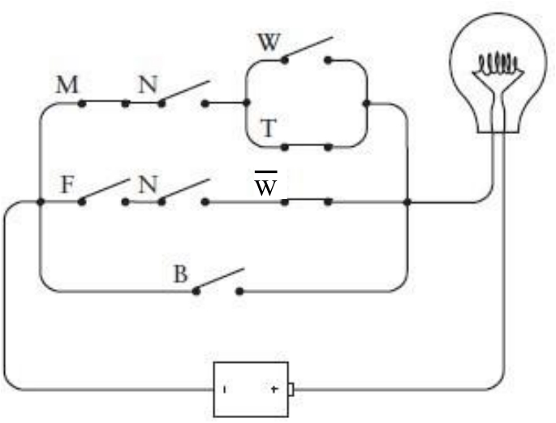

尽管开关M、T和闭合了，但是没有成功地点亮灯泡。接着，店员又拿出了一只已绝育的白色母猫。

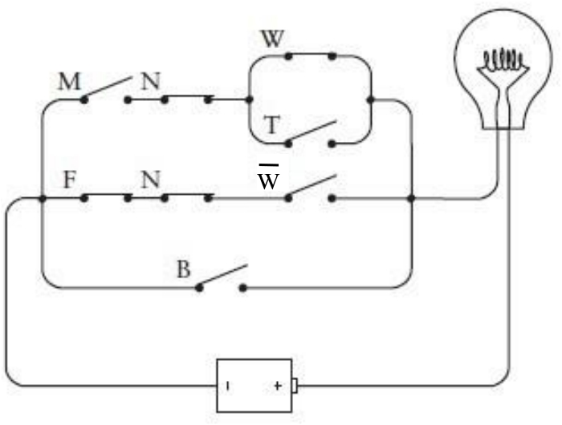

相应的开关闭合后依然没有点亮灯泡。但是，最后店员拿出了一只已绝育的灰色母猫。

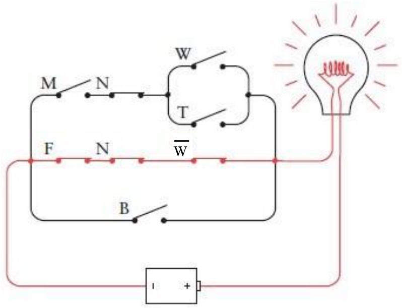

这次，灯泡被成功点亮了，表明这只猫符合你的全部要求。

乔治·布尔并没有连接这样一个电路。他没有兴趣去观察布尔表达式在开关、线路和灯泡中如何实现。当然，这其中存在的一个障碍就是，布尔死后15年人类才发明了白炽灯。但是塞缪尔·莫尔斯在1844年论证了他的电报机是可行的——早于布尔发表《思维规律的研究》10年——将电报发声器替换成上述电路中的灯泡本应该是非常简单的。

然而，在19世纪，没有人将布尔代数中的AND和OR同线路中的开关串联及并联关联到一起。没有这样的数学家，没有这样的电学家，没有这样的电报员，没有这样的人。甚至计算机革命的偶像式人物查尔斯·巴贝奇（1792-1871）也没有，他与布尔处在同一时代并且了解布尔的工作，巴贝奇奋斗了一生，他最先设计了差分机（Difference Engine）和分析发动机（Analytic Engine），这些在一个世纪之后都被看做是现代计算机的前身。本来有些东西可以帮到巴贝奇的，那是什么呢？我们现在知道，那就是根据一台电报器来创建计算机，而非使用齿轮和杠杆来实现计算。

是的，就是电报器。

<a id="footnote_content_txt010_1" href="part0017.html#footnote_quote_txt010_1" class="calibre2">[1]</a>美国影评家—译者注

