# Chapter Eleven: Gates (门)

在遥远的未来，关于20世纪的早期计算机史早已成为人们印象中模煳的记忆，那时很可能有些人会认为 **"logic gates" (逻辑门)** 装置是以著名的微软公司创始人的名字来命名的`[1]`。其实不然。就像我们所看到的一样，逻辑门与普通的让水通过或者让人通过的门是非常类似的。**在逻辑学中，逻辑门的工作方式非常简单——让电流通过或阻止电流通过。**

- `[1]`: Bill Gates 中的 Gates 在英文中有 "门" 的意思 -- 译者注。

在上一章中，你走进了一家宠物店，并且说："我想要一只公猫(male)，已绝育(neuter)的，白色(white) 或 褐色(tan) 都可以；或者一只母猫(female)，已绝育的，除了白色任何颜色都可以；或者，只要是一只黑猫(black)就行。"

- neuter `/'njuːtə/` -adj.(名词、代词等)中性的；阉割(动物)

 这句话被总结为如下布尔表达式：
$$
(M \times N \times (W + T)) + (F \times N \times (1 - W)) + B
$$

同样也可以用这样一个由开关和灯泡组成的电路来表示，如下图所示。

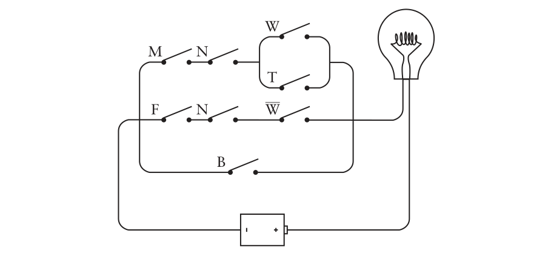

**这样的电路有时被称为网络（network），而如今这个词更多地被用来描述计算机之间的连接，而不仅指多个开关的集合。**

尽管这个电路中的所有元件早在19世纪就都已经被发明出来了，但在那个时代，没有人意识到布尔表达式可以在电路中实现。这个等价关系直到20世纪30年代才被发现。主要贡献人是克洛德·艾尔伍德·香农（生于1916）。1938年，香农在麻省理工学院完成了那篇题为《继电器和开关电路的符号分析》（A Symbolic Analysis of Relay and Switching Circuits）的著名硕士论文，在文中阐述了这个问题（10年之后，他又发表了论文 "通信的数学原理" ，即The Mathematical Theory of Communication，这是第一篇使用 "bit" 这个词来表示二进制数字的文章）。

- (1) symbolic `/sɪm'bɒlɪk/` -adj.象征的，象征性的
    + a meeting of symbolic importance. 具有重要象征意义的一次会议
- (2) relay `/'riːleɪ/` -n.继电器，中继；轮班，轮换；接力赛
    + time relay. 时间继电器
    + relay race 接力赛
- (3) circuit `/'sɜːkɪt/` -n.环形道路；电路，线路；
    + We did a circuit of the old city. 我们绕着老城走了一圈。
    + an electrical circuit. 电路。

1938年以前，人们已经知道，当两个开关串联的时候，要同时闭合它们，电流才能通过；当两个开关并联的时候，闭合其中任何一个都可以使电路连通。但是没有人像香农那样能清晰严谨地阐述：**电子工程师可以运用布尔代数的所有工具去设计开关电路**。此外，**如果你简化了一个描述网络的布尔表达式，那么你也可以简化相应的网络。**

例如，你想要的猫可以用下列表达式描述：

$$
(M \times N \times (W + T)) + (F \times N \times (1 - W)) + B
$$

利用结合律，我们可以重新排列由 $AND (\times)$ 连接的变量，并将表达式写为如下形式：

$$
(N \times M \times (W + T)) + (N \times F \times (1 - W)) + B
$$

为了讲清楚这里是如何变换的，我将定义两个新的符号, $X$ 和 $Y$. 

$$
X = M \times (W + T) \\
Y = F \times (1 - W)
$$

现在，描述你想要的小猫的表达式可以写为：
$$
(N \times X) + (N \times Y) + B
$$

化简后，我们可以将 $X$ 和 $Y$ 表达式代回去。

注意，变量 $N$ 在表达式中出现了两次。利用分配率，表达式可以写为只有一个 $N$ 的形式：

$$
(N \times (X + Y)) + B
$$

现在将 $X$ 和 $Y$ 的表达式带入：

$$
(N \times ((M \times (W + T)) + (F \times (1 - W))) + B
$$

由于括号太多，这个表达式看起来并不简单。但是这个表达式中少了一个变量，也就意味着在网络中少了一个开关。以下就是简化(revise `/rɪ'vaɪz/` -vt.改变，修正)后的电路图。

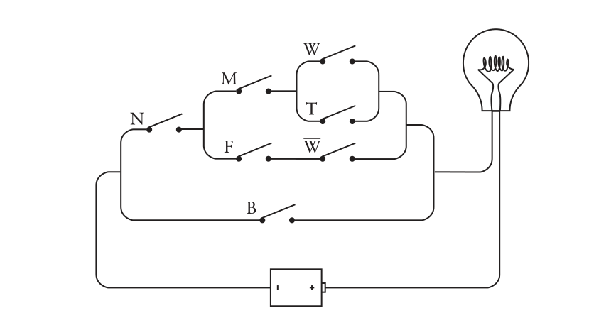

确实，证明修改前后的两个电路功能等价要比去证明两个表达式功能相同简单许多。

事实上，网络中仍然有三个开关是多余的。理论上讲，你只需要四个开关来定义你心目中的猫咪即可。这是为什么呢？每个开关都是一个二进制数。你可以设定一个开关代表猫的性别（开关断开表示是公的，而闭合表示是母的），另一个开关闭合表示猫是否有生育能力（开关断开表示未绝育，而闭合则表示已绝育）。另两个开关用来表示猫的颜色。这里有四种可能出现的颜色（白色、黑色、褐色和其他颜色），而我们知道，四种选择可以用两个二进制位来定义，于是你需要的就是两个颜色开关。例如，两个开关同时断开表示白色，一个闭合表示黑色，另一个闭合表示褐色，同时闭合表示其他颜色。

现在让我们制作一个用来选猫咪的控制面板。这个控制面板上只有四个开关（与你家墙上控制灯开闭的开关很相似），此外面板上还安装了一个灯泡，如下图所示。

开关打到上面是指开关闭合，反之是指开关断开。或许用来表示猫咪颜色的两个开关标记有点难于理解，这是为了将面板做得简洁而不得已导致的一个小缺憾。在表示颜色的两个开关中，左边的叫做B，意思是说只要它闭合（如上图所示）就表示黑色。两个开关中右边的那个叫做T，意思是说只要它闭合的时候就表示褐色。如果两个开关都闭合则表示其他颜色，这个选择叫做O。两个开关都断开的时候表示白色，用W表示，字母写在下部。

**在计算机术语中，开关是一种输入设备（input device），输入是控制电路行为方式的信息**。在本例中，输入开关对应于 4 个二进制数信息，这些信息用来描述一只猫。**输出设备（output device）就是灯泡**。如果开关描述了一只符合标准的猫，灯泡就会亮。比如上面控制面板所示的开关就表示了一只未绝育的黑色母猫。这只猫符合你的标准，因此灯泡是亮的。

现在我们要做的就是设计一个电路来控制这个面板工作。

前面提到，香农的论文题目是《继电器与开关电路的符号分析》。这里的继电器与之前我们在第6章提到的电报系统中的继电器很类似。然而在香农发表论文的时候，继电器已经被广泛地用于其他领域，特别是在庞大的电话系统网络中。

**继电器像开关一样，可以串联或并联在电路中执行简单的逻辑任务。这种继电器的组合叫做逻辑门（logic gates）**。这里提到的逻辑门执行 "简单" 逻辑任务是指逻辑门只完成最基本的功能。继电器优于开关之处就在于，继电器可以被其他继电器所控制，而不必由人工控制。这就意味着，这些简单的逻辑门组合起来可以实现更复杂的功能，例如一些简单的算术操作。事实上，下一章中，我们就将介绍如何利用电线、开关、灯泡、电池和电报继电器来制作一个加法器（尽管它只能用于二进制数计算）。

前面提到过，继电器对于电报系统的工作而言是至关重要的。在长距离情况下，连接电报站的电线具有很高的电阻。这就需要采取一些措施来接收微弱信号并把它增强后再发射出去。继电器就是通过电磁铁控制开关来实现这一目的的。实际上，**继电器是通过放大微弱信号来生成强信号的**。

就我们的目的而言，我们对于继电器放大微弱信号的功能并不感兴趣。**我们真正感兴趣的是继电器可以作为一个电流控制而非人工控制的开关**。我们可以将继电器、开关、灯泡和两节电池按照下图连接。

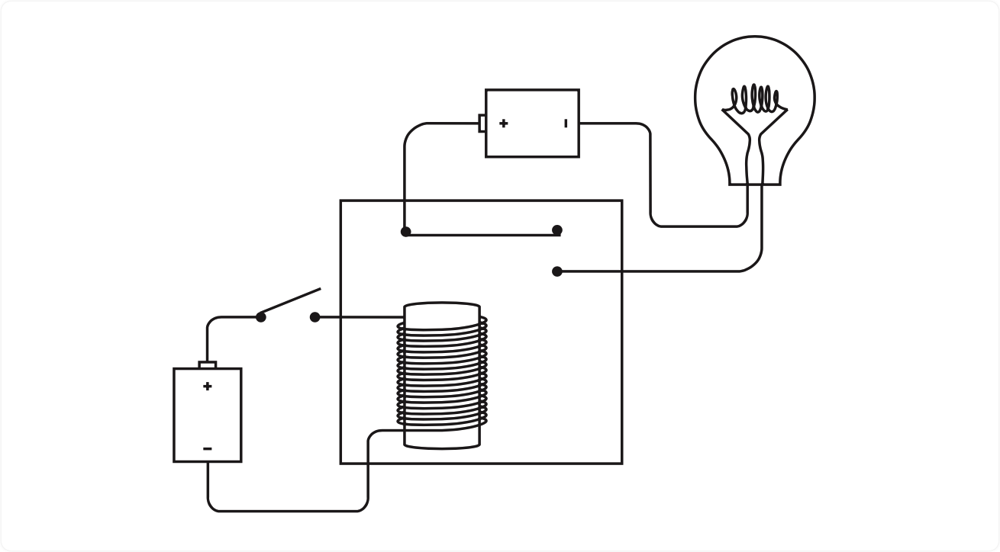

注意，左边的开关是断开的，灯泡没有发光。**当闭合开关的时候，左端电池产生电流流过缠在铁芯上的圆线圈。于是铁芯产生了磁性，将上面的弹性金属簧片拉下，使回路接通，灯泡发光**。

> 

**当电磁铁将金属簧片拉下来时，我们称继电器被 "触发" （triggered）**。当左边的开关断开的时候，铁芯的磁性消失，金属簧片回到原位。

这看起来似乎是一种间接控制灯泡发光的方法，而实际上它就是这样的。如果我们只关心点亮开关，完全可以将继电器省略掉，但我们所关心的并不仅仅是点亮灯泡。我们还有更宏大的目标。

在这一章中，（在逻辑门创建之前）我们将多次运用继电器，因此就需要将上面那幅电路图简化。我们可以利用接地的方式减少一些电线。在这种情况下，大地仅代表了一个公共端，并不是真正意义上的物理接地。

> 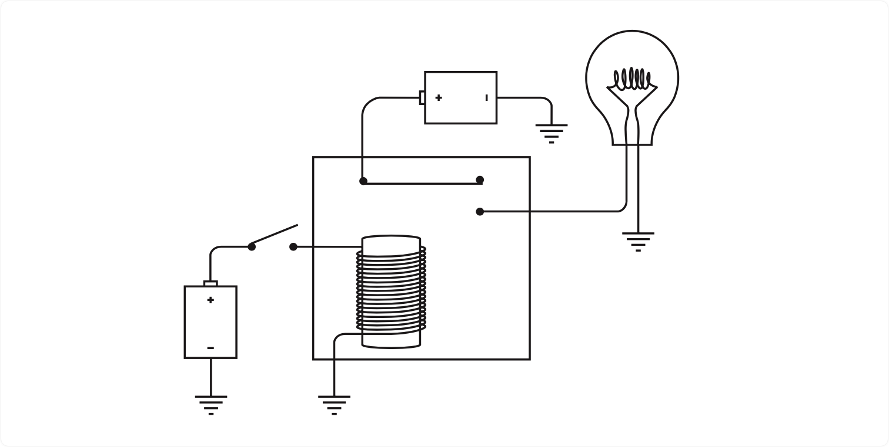

这看起来并不像简化的结果，但到现在我们还没有完成。注意两节电池的负极都是接地的。因此，我们可以看到这样的符号。

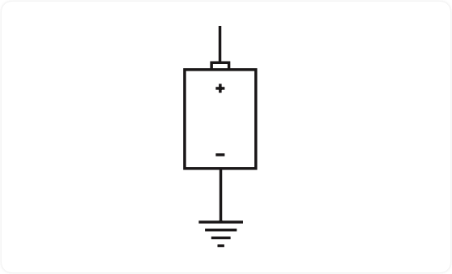

和第5章、第6章中一样，可以==**用大写字母V（代表电压）来代替上图中的电池**==。这样，继电器看上去就如下图所示。

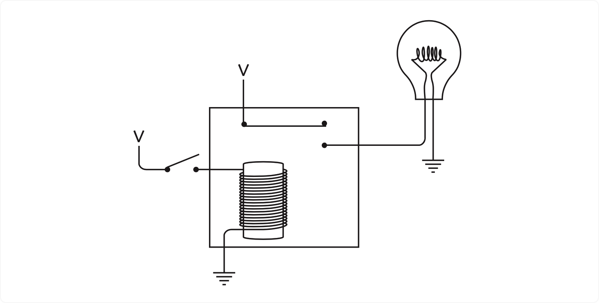

- *Added by W1033：我自己感觉这个图实际上并不好理解，V 来代替电池，但电池明明是朝下的，这个 V 处的导线开口却是朝上的，这一点我真的很费解。*

开关闭合，电流从 V 端流出，经过电磁铁芯流到大地上。产生磁效应吸合金属簧片，从而连通了 V、灯泡和地之间的电路，使灯泡发光。

> 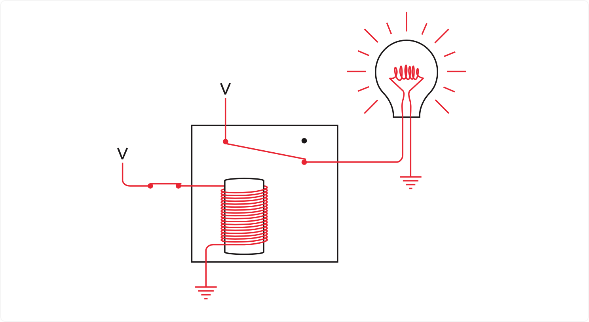

上面的图显示了两个电源和两个接地端。但是在这一章的所有电路中，所有电源，即 "V" 是可以彼此互连的，接地端也如此。在本章和下一章的电路中，所有继电器网络和逻辑门只需要一节电池，尽管可能是一节很大容量的电池。例如，上述电路图可以画为如下只用一节电池的方式。

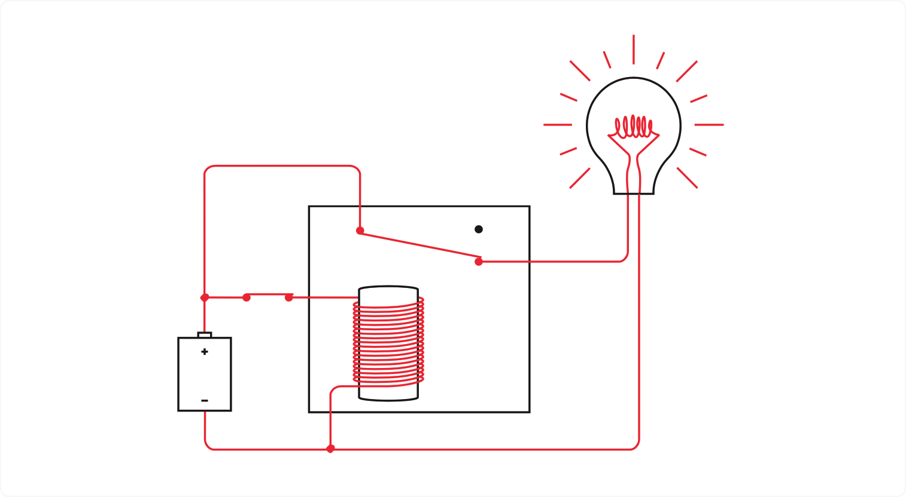

但是，这个电路图中没有清楚地表明，为什么我们要使用继电器。可以先不看回路，单单看继电器，像前面的控制面板一样，从输出和输入开始。

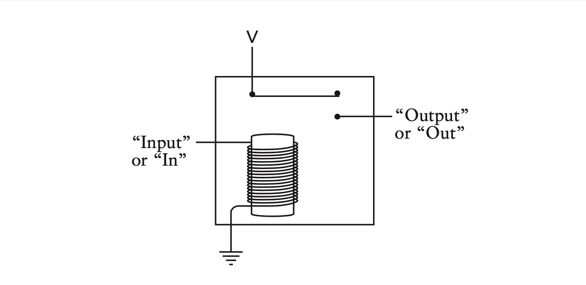

当电流流经输入时（例如，用一个开关把输入连到 "V" 端），电磁铁就会被触发，输出就得到一个电压。

继电器的输入不一定只能是开关，其输出也未必只限于灯泡。一个继电器的输出可以连到另一个继电器的输入，例如下面这个电路：

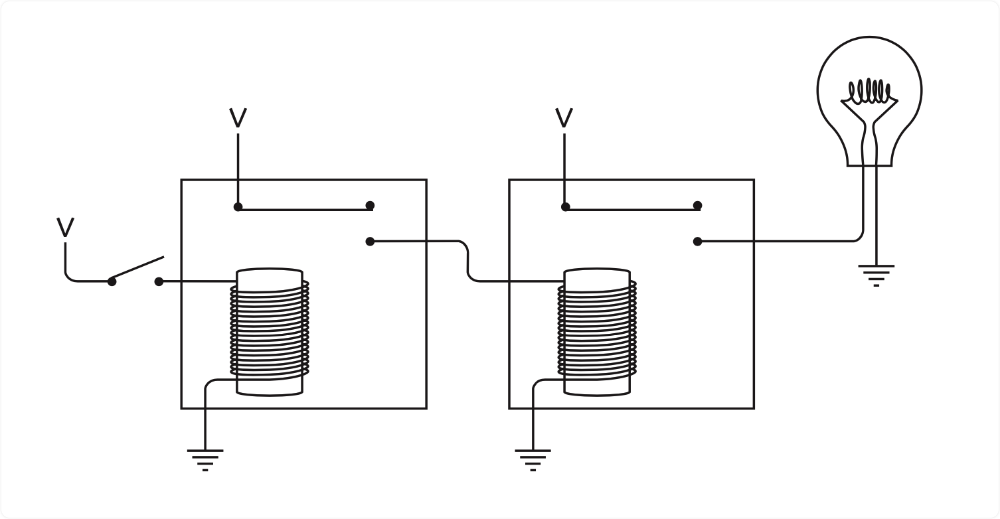

**当开关闭合，第一个继电器被触发，提供电压给第二个继电器**。于是第二个继电器被触发，使灯泡发光。

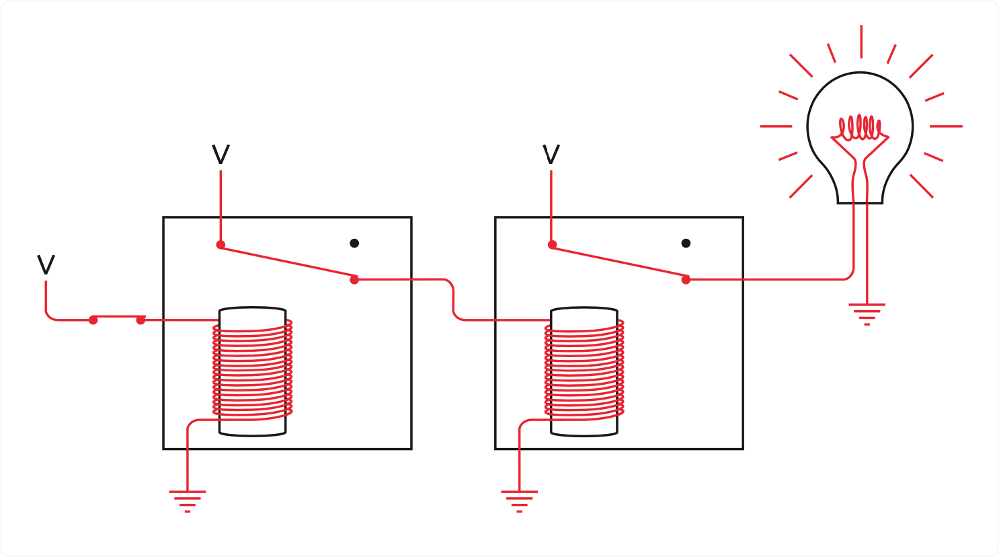

**连接继电器是创建逻辑门的关键**。

实际上，灯泡可以采用两种方式连接到继电器上。注意，弹性金属簧片是被电磁铁拉下来的。平时，金属簧片与上端触点相接触，当电磁铁拉动它时，它就会与下端触点相接触。我们之前一直把金属簧片与下方触点接触作为继电器的输出，而其实也可以把它与上方触点相接触作为输出。当我们这样使用的时候，继电器的输出恰好相反，当输入开关断开的时候，灯泡发光。

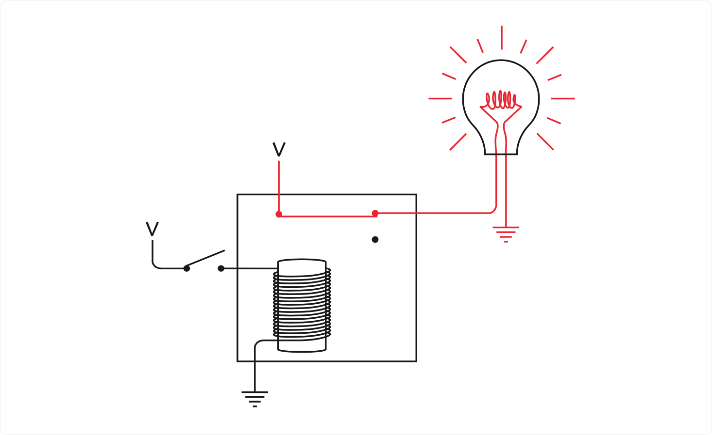

当输入开关闭合时，灯泡熄灭。

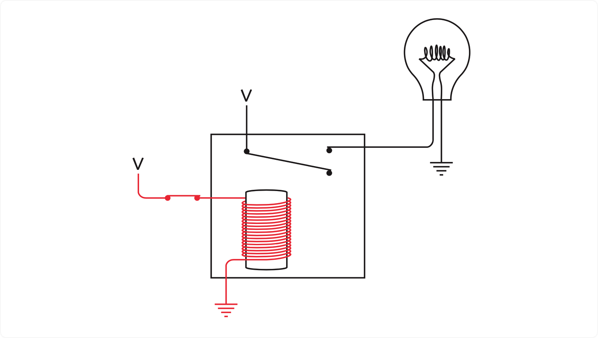

用开关术语来说，这种继电器叫做**双掷继电器**。**它拥有两个输出，但是这两个输出在电的极性上是对立的——当一端有电压时，另一端就没有**。

另外，如果想象不出现代继电器是什么样子，你可以在你们当地电器行的简易透明包装中看到一些。有些继电器就像方形小冰块一样大，如零件型号为275-260和275-214的继电器就是这种大小的继电器，而且它们也十分耐用。这些继电器内部的元件被封在一个干净的塑料外壳里，因此你可以看到电磁铁和金属簧片。本章和下一章所描述的电路都使用的是元件号为275-240的继电器，这种继电器体积小（大约一块口香糖大小）而且价格便宜（每个2.99美分）。

## ▲ 与门 (AND)

> 重要笔记摘录：
>
> 1. 与门电路图连接方式：两个继电器**串联**。
>
>    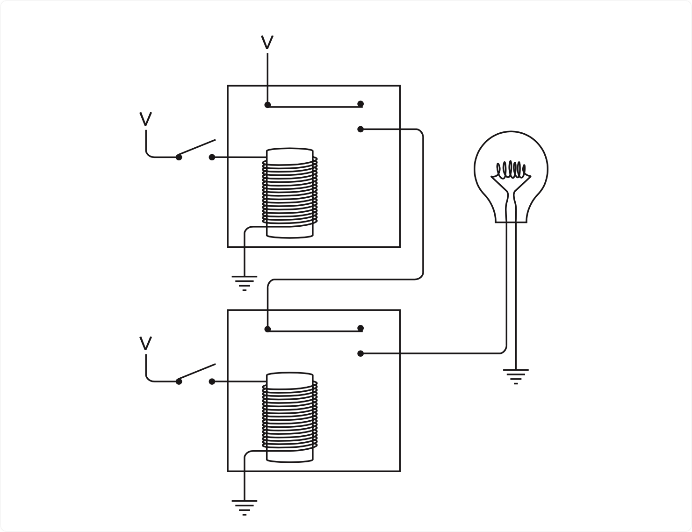
>
> 2. 电气工程师使用的与门符号：
>
>    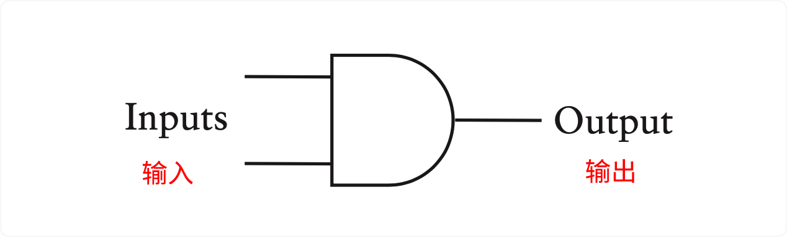
>
> 3. 与门的输入与输出之间的关系图：
>
>     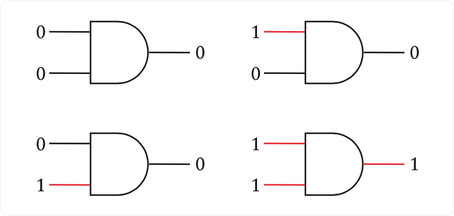
>
>     和关系表：
>
>     | AND  |  0   |  1   |
>     | :--: | :--: | :--: |
>     |  0   |  0   |  0   |
>     |  1   |  0   |  1   |
>     
>     - 注：0 和 0 与等于 0，1 和 0 与等于 0，0 和 1 与等于 0，1 和 1 与等于 1。
>

前面提到，两个开关可以串联，同样地，两个继电器也可以串联。

上面继电器的输出为下面继电器提供电压。如上图所示，当两个开关都断开的时候，灯泡不发光。我们先闭合上面的开关。

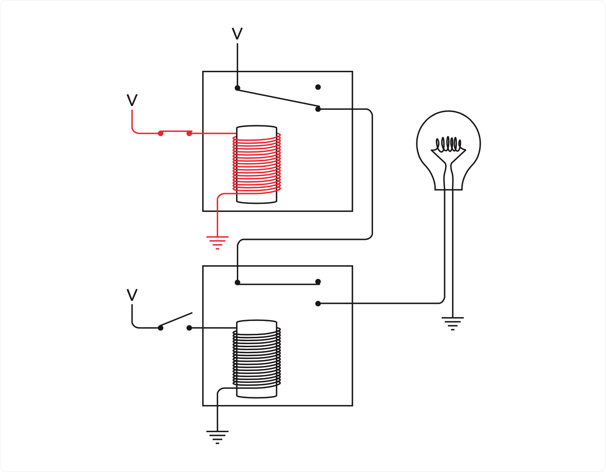

灯泡仍然不亮，因为下面的开关一直是断开的，这个继电器没有被触发。我们现在断开上面的开关，并闭合下面的开关。

灯泡仍然不亮。由于上面的继电器没有被触发，电流无法流过灯泡。只有两个开关都闭合的时候灯泡才会被点亮。

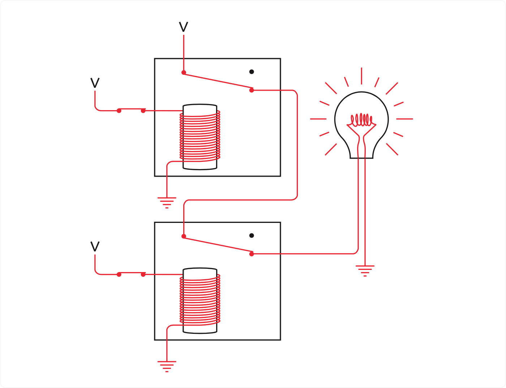

这时，两个继电器都被触发，电流从V流经灯泡后流入到地中。

就像两个开关串联一样，这两个继电器也执行了逻辑操作。只有当两个继电器都被触发的时候灯泡才会亮。这样两个继电器的串联被称为一个 "与门" 。为了避免复杂的图示，电气工程师用如下专门的符号表示一个与门。

- Hint： 

**这是四个基本逻辑门中的一个。与门有两个输入端（上图中的左端）和一个输出端（上图中的右端）。这样表示的与门通常输入在左边，输出在右边**。这是因为人们习惯于由左向右的阅读方式，在读电路图的时候也会由左向右。但与门也可以画成输入在上端、右端或者下端。

有两个继电器、两个开关和一个灯泡的原始电路图如下所示。

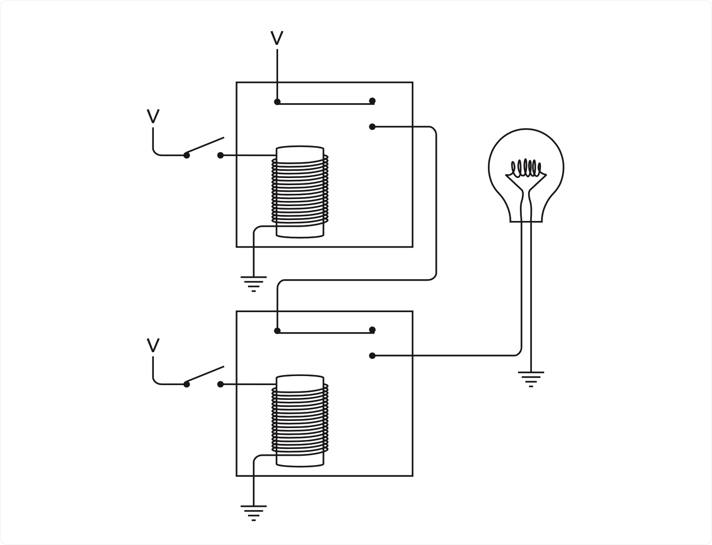

使用 "与门" 符号，上图可以画为如下所示的图。

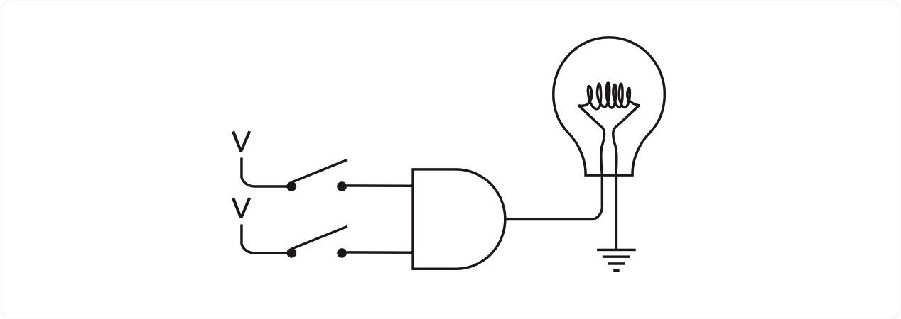

注意，与门的符号不仅仅代替了两个串联的继电器，而且还暗示着上面的继电器与电源相连，两个继电器都接地。只有当上面的开关与下面的开关都闭合的时候，灯泡才会发光。这就是称它为 "与门" 的原因。

与门的输入未必一定要和开关相连，而且输出也不一定只能与灯泡相连。我们真正要处理的是输入端的电压和输出端的电压。例如，一个与门的输出可以作为另一个与门的输入，如下所示。

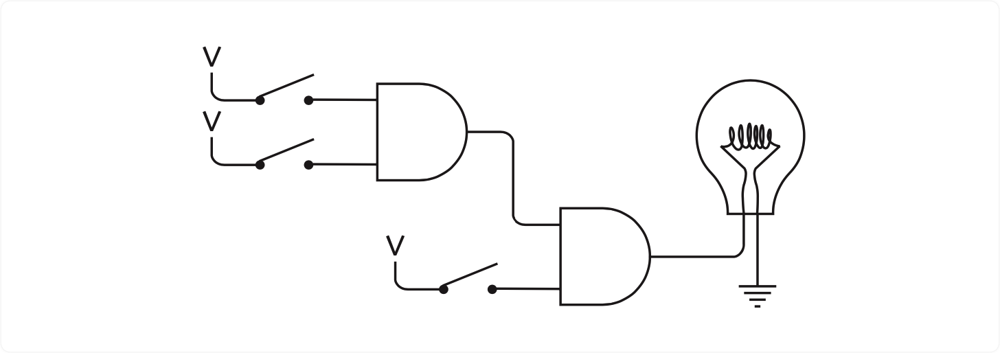

只有当三个开关全部闭合的时候，灯泡才会亮。只有当上面两个开关全闭合的时候，第一个与门的输出才会触发第二个与门中的第一个继电器。而最下面的开关闭合会触发第二个与门中的第二个触发器。

如果我们将低电平视为0，将高电平视为1，那么与门的输入和输出之间的关系如下所示。

像两个开关串联一样，与门的输入与输出之间的关系同样可用下表来描述。

| AND  |  0   |  1   |
| :--: | :--: | :--: |
|  0   |  0   |  0   |
|  1   |  0   |  1   |

同样可以让与门有多个输入端。例如，将三个继电器串联，如下图所示。

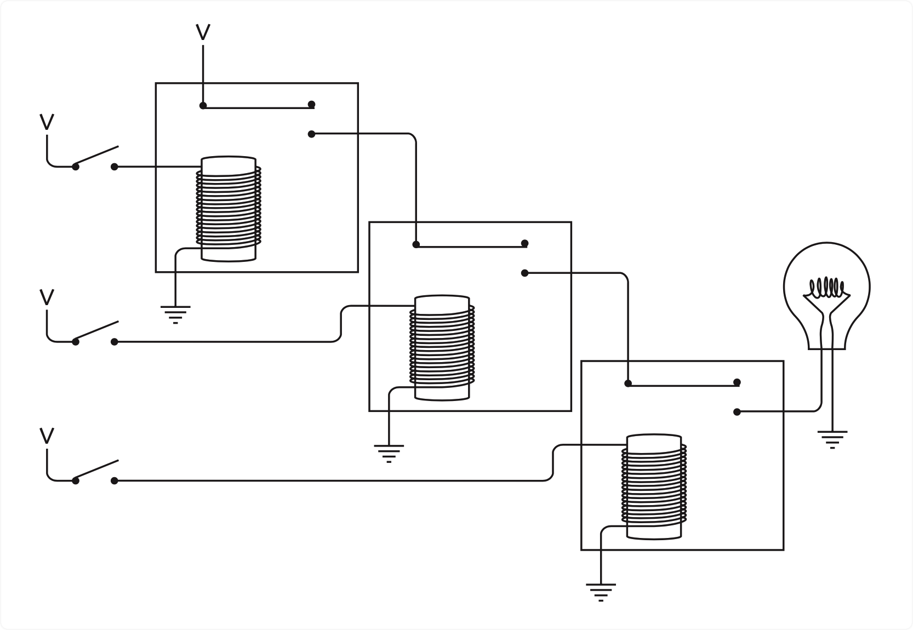

只有当三个开关全部闭合时灯泡才会发光。这个结构可以用如下符号来表示。

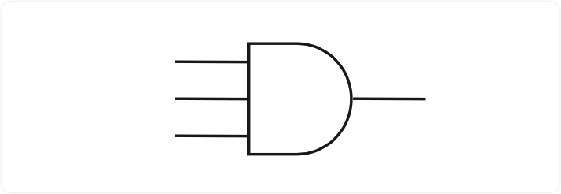

它被称为三输入端与门。

## ▲ 或门 (OR)

> 重要内容摘录：
>
> 1. 或门电路图连接方式：两个继电器**并联**。
>
>    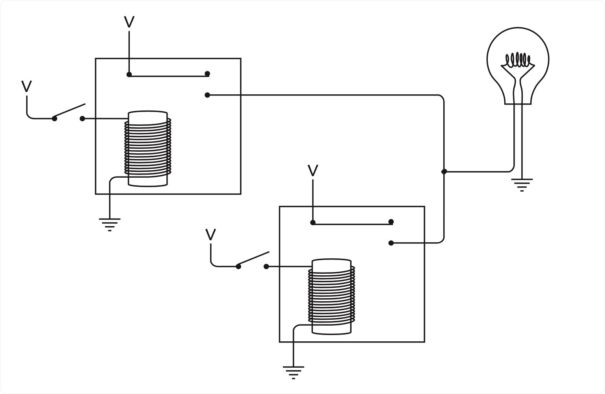
>
> 2. 电气工程师使用的或门符号：
>
>     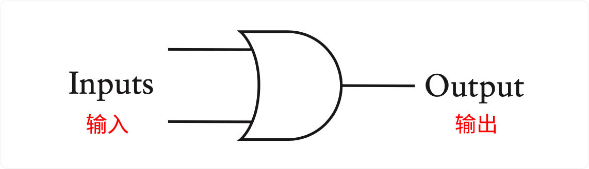
>
> 3. 或门的输入与输出之间的关系图：
>
>     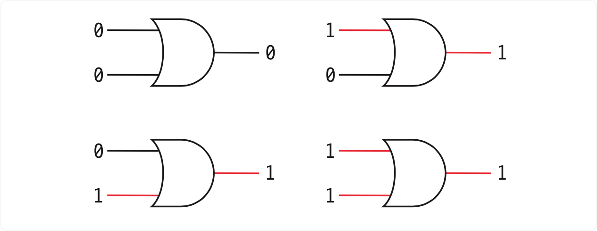
>
>     和关系表：
>
>     |  OR  |  0   |  1   |
>    | :--: | :--: | :--: |
>     |  0   |  0   |  1   |
>     |  1   |  1   |  1   |
>    
>    - 注：0 和 0 或等于 0，1 和 0 或等于 1，0 和 1 或等于 1，1 和 1 或等于 1。
>

以下逻辑门是由两个继电器并联而成。

注意两个继电器的输出是接在一起的，这个连在一起的输出为灯泡提供了电源。任何一个继电器都能点亮灯泡。例如，如果闭合上面的开关，灯泡会亮。这时，灯泡从左边的继电器得到了电源供应。

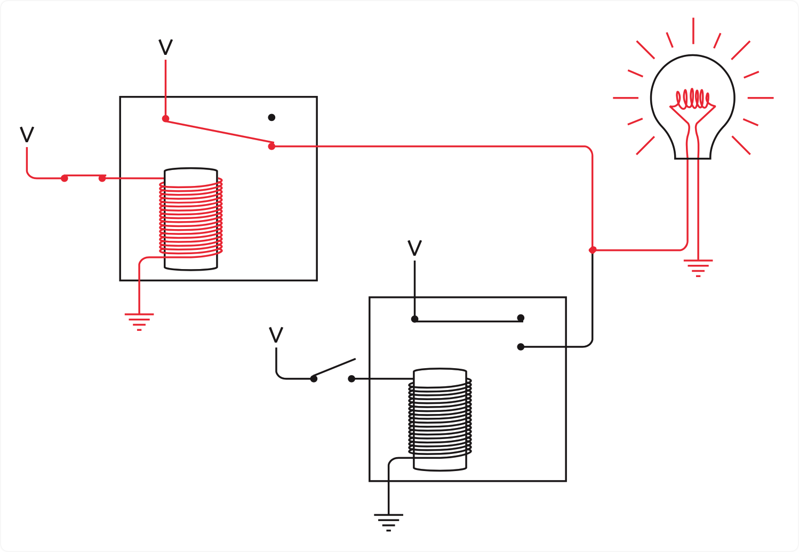

同样的，如果我们将上面的开关断开，并闭合下面的开关，灯泡也会发光。

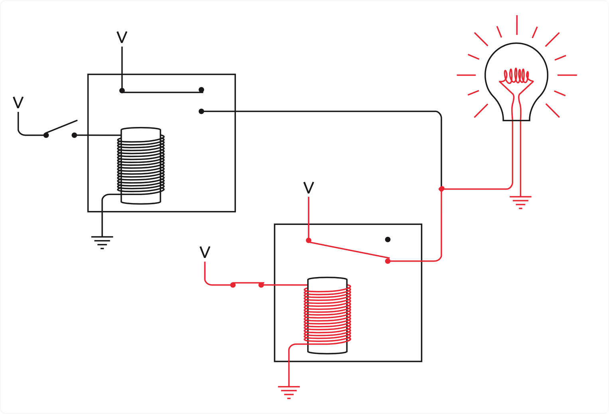

如果两个开关都闭合，灯泡也会亮。

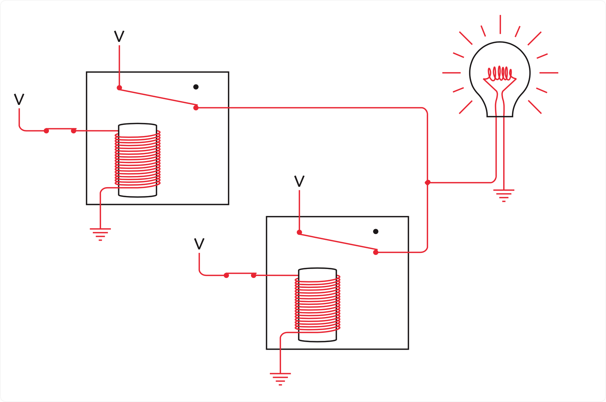

显而易见，当上面的开关或下面的开关闭合，灯泡都会发光，这里的关键词是 "或" ，因此这样的门被称为 "或门" 。电气工程师用如下符号表示或门。

它和与门的符号稍微有点相似，但是输入端的一边是弧线，像英文单词 "OR" 中字母 "O" 一样（这样可以帮你分清它们）。

或门的两个输入中，只要有一个加上电压，输出就是高电平。如果将低电平看做0，高电平看做1，那么或门也有四种可能的组合状态。

像总结与门一样，我们可以将或门的输入和输出关系总结为一个表，如下所示。

|  OR  |  0   |  1   |
| :--: | :--: | :--: |
|  0   |  0   |  1   |
|  1   |  1   |  1   |

或门也可以有多个输入端（只要任一个输入端为1，其输出端就为1，只有所有的输入端都为0时，输出端才为0）。

## ▲ 反相器 (inverter)

前面解释了为什么我们所用的继电器叫双掷继电器，这是因为其输出有两种不同的连接方式。通常在开关断开的时候，灯泡不会亮。

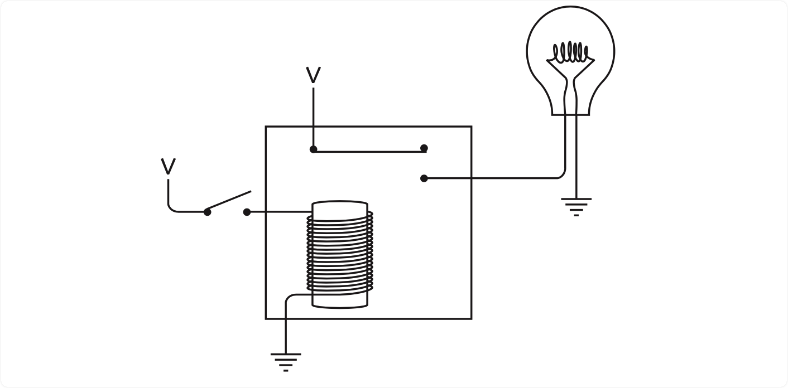

当开关闭合时，灯泡发光。

也可以用另外一种连接方式，使开关断开时灯泡被点亮。

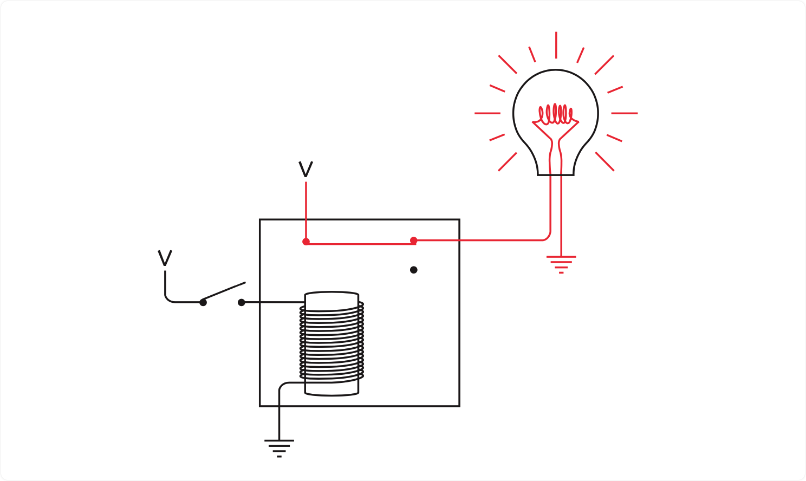

这样的话，开关闭合，灯泡就会熄灭。以这种方式连接的继电器叫做反向器（inverter）。

>  **反向器不是逻辑门（一个逻辑门通常有两个或多个输入）**，尽管如此，它的用处还是很广。**反向器可以用如下的专门符号来表示**。
>
> 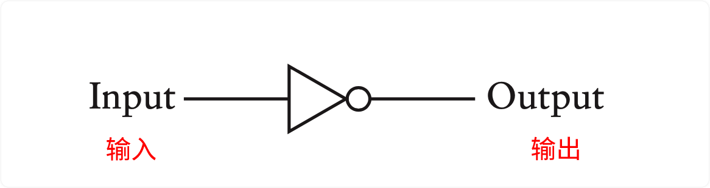
>
> 
>
> **由于它能将 0（低电平）转换为 1（高电平)，因此被称为反向器，反过来也是一样的**。
>
> 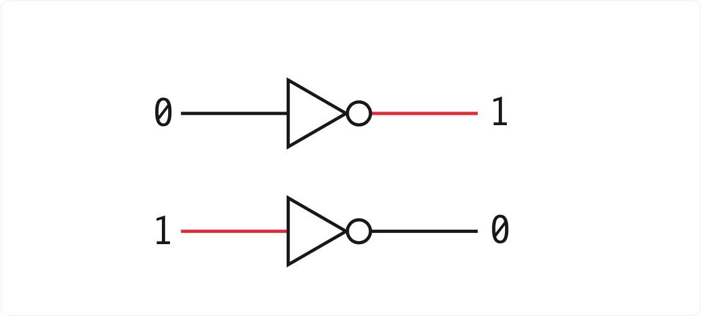

利用反向器、与门和或门，我们就可以着手去设计一个自动选择理想猫咪的控制面板了。首先从开关开始，第一个开关闭合表示母猫，断开表示公猫。因此，我们可以得到两个信号，把它们分别叫做 F 和 M，如下图所示。

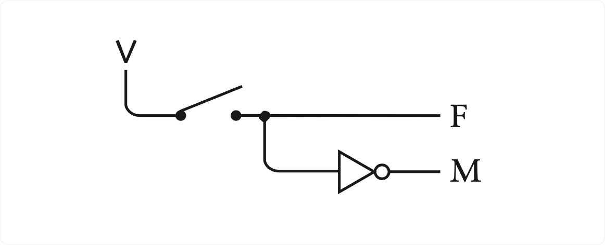

当 F 为 1 时，M 为 0，反之亦然。同样，第二个开关闭合表示这只猫已绝育，断开则表示这只猫未绝育。

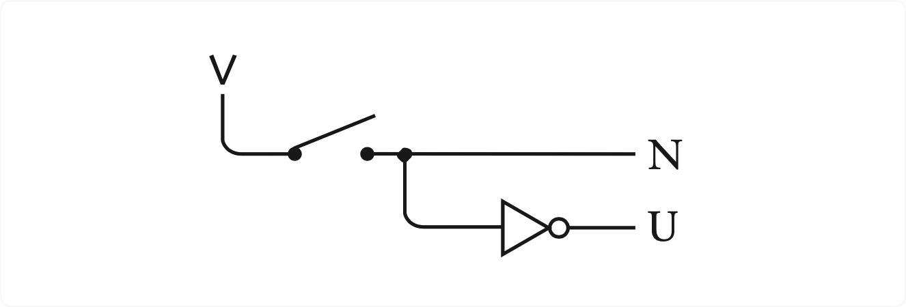

下面两个开关更加复杂。两个开关的不同组合分别表示四种不同的颜色。以下为两个接有电源的开关。

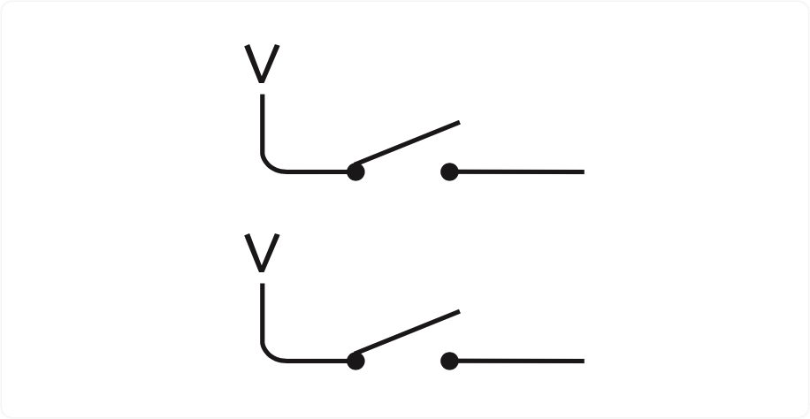

当两个开关都断开时（如上图所示），表示白色。以下就是如何运用两个反向器和一个与门来得到W信号的方式。如果你选择一只白猫，W就为高电平（1）；否则，就为低电平（0）。

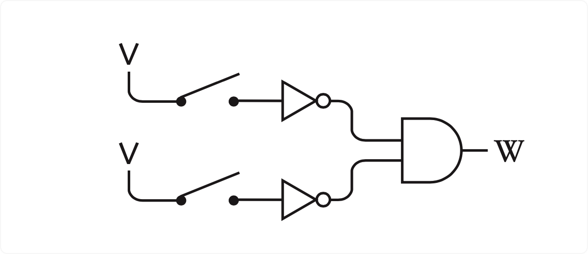

当两个开关断开时，两个反向器的输入均为0，两个反向器的输出（也就是与门的输入）都为1。这就意味着与门的输出为1。如果有一个开关闭合，与门的输出就为0。

要想用闭合第一个开关表示一只黑猫，可以利用一个反向器和一个与门实现。

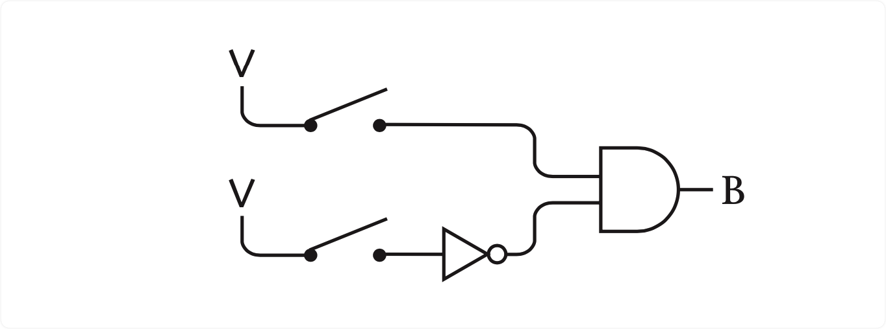

只有当第一个开关闭合而第二个开关断开的时候，与门输出才为1。同样，如果第二个开关闭合而第一个开关断开，与门的输出也为1，我们用此来表示褐色的猫。

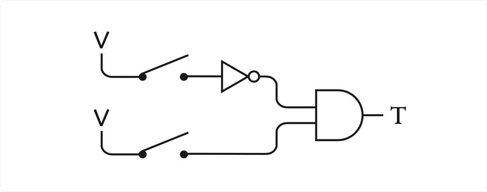

如果两个开关同时闭合则表示其他颜色的猫。

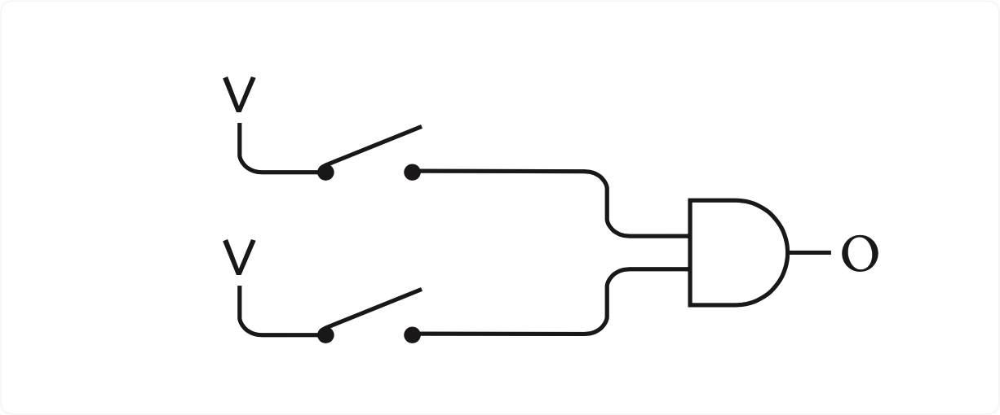

现在，我们将四个小电路合并成一个大电路（**按照惯例，黑实心点表示交叉线之间是连接的，没有黑实心点的交叉线则表示仅仅是穿过，没有连接**）。

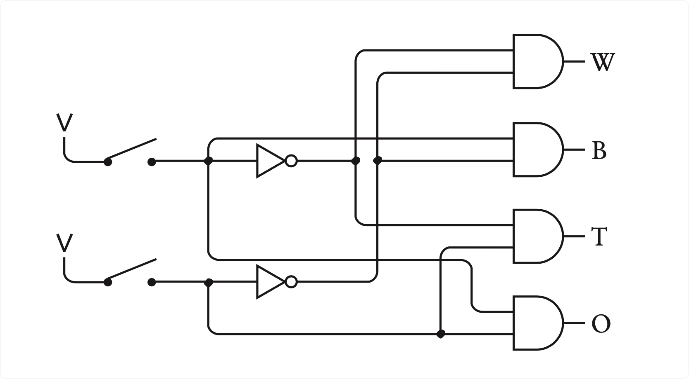

这个电路看起来非常复杂，但是如果你仔细地沿着线路走，看清每个与门的输入是从哪来的，而暂不论这些输入去向何方，电路的工作原理就会一目了然。如果两个开关都断开，输出信号 W 就为 1，其他都为 0。如果第一个开关闭合，则输出信号 B 为 1，其他为 0，依此类推。

在连接门和反向器的时候有一些规则，影响它们的连接方式：**一个门（或反向器）的输出可以作为一个或多个其他门（或反向器）的输入。但是两个或多个门（或反向器）的输出是不可以相互连接的**。

**这个由 4 个与门和 2 个反向器连接成的电路叫做 "2-4 译码器"** 。输入为 2 个二进制位，各种组合共表示 4 个不同的值。输出是 4 个信号，任何时刻只能有一个是 1，至于哪一个是 1 取决于两个输入。利用同样的原理，我们可以构造出 3-8 译码器或者 4-16 译码器，等等。

简化过的选择猫咪的表达式为：

> $(N × ((M × (W + T)) + (F × N × (1 - W)))) + B$
>
> 
>
> 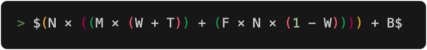

在这个表达式中，每个加号（$+$），必定对应电路中的一个或门。对于每一个乘号（$×$），则对应一个与门，电路图如下所示。

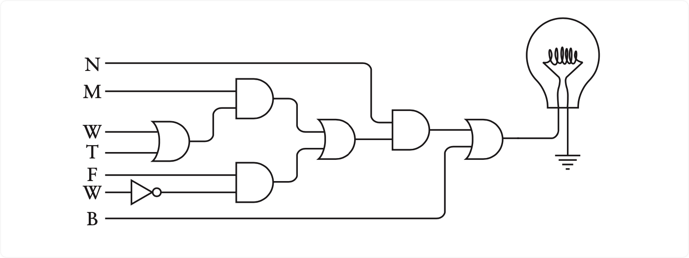

电路图左侧的字母由上到下的顺序与它们表达式中出现的顺序一样。这些信号来源于与反向器相连的开关和 2-4 译码器的输出。请注意用来表示表达式中（1-W）部分的反向器的用法。

这时，你可能会说： "这一堆继电器太多了！" ，是的，确实如此。**每个与门和或门中有两个继电器，一个反向器中有一个继电器**。但是我在这里要说的就是你必须习惯它 (I’d say the only realistic response is, “Get used to it.” ) 。之后的章节中我们还会用到更多的继电器。还好你不用真的买来并在家中自己连接它们。

下面要介绍另外两种本章要用到的逻辑门。

## ▲ 或非门（NOR）

> 重要笔记摘录：
>
> 1. 或非门电路图连接方式：两个继电器**串联**。 (注：连接方式和与门(AND) 相同)
>
>    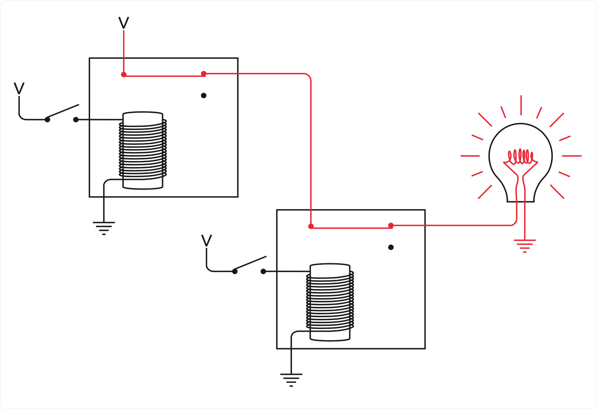
>
> 2. 电气工程师使用的或非门符号：
>
>    
>
>    或
>
>    
>
> 3. 或非门的输入与输出之间的关系图：
>
>    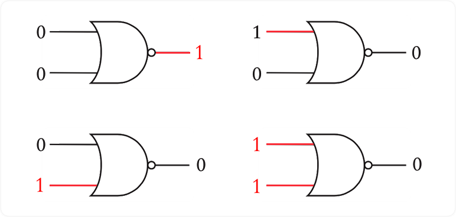
>
>    关系表：（注：结果与或门(OR) 刚好相反。）
>
>    | NOR  |  0   |  1   |
>    | :--: | :--: | :--: |
>    |  0   |  1   |  0   |
>    |  1   |  0   |  0   |
>    
>    - 注：0 和 0 或非等于 1，1 和 0 或非等于 0，0 和 1 或非等于 0，1 和 1 或非等于 0。
>

这两个门都会用到这样一个继电器，该继电器在未被触发时，其输出为高电平（这是用在反向器中的输出）。例如，在下面这种配置中，第一个继电器的输出为第二个继电器提供电源。当两个继电器全都断开时，灯泡发光。

如果上面的开关闭合，灯泡就会熄灭。

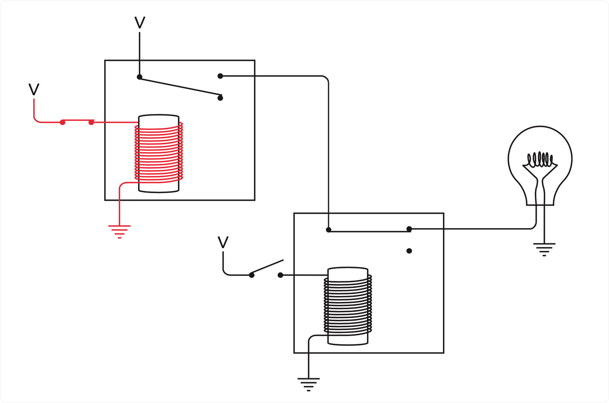

灯泡熄灭是由于第二个继电器没有电源供应。同样的，如果下面的开关闭合，灯泡也会熄灭。

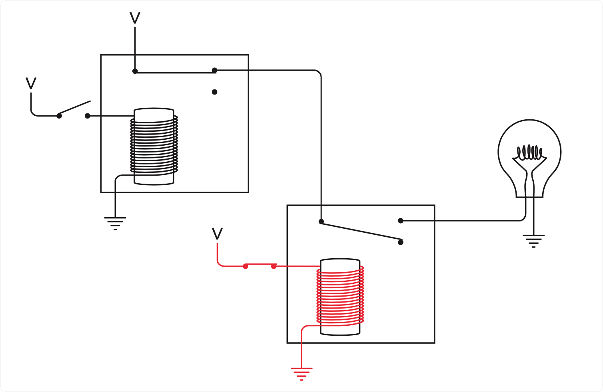

如果两个开关全部闭合，灯泡也不亮。

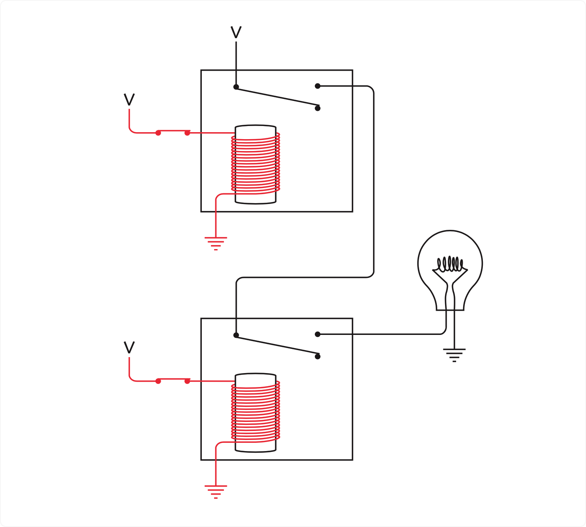

这些结果恰恰与或门相反，这个门称为 "==或非门==" ，简称 ==NOR==，用以下符号表示。

除去输出部分的小圆圈，这个符号与或门非常相像。小圆圈表示 "反向" ，所以或非门也可用下面的符号表示。

或非门的输出如下表所示。

| NOR  |  0   |  1   |
| :--: | :--: | :--: |
|  0   |  1   |  0   |
|  1   |  0   |  0   |

**这个表所显示的结果与或门正好相反，在或门中，两个输入中有一个为 1 输出就为 1，只有两个输入都为 0，输出才为 0**。

## ▲ 与非门（NAND）

> 重要笔记摘录：
>
> 1. 与非门电路图连接方式：两个继电器**并联**。 (注：连接方式和或门(OR) 相同)
>
>    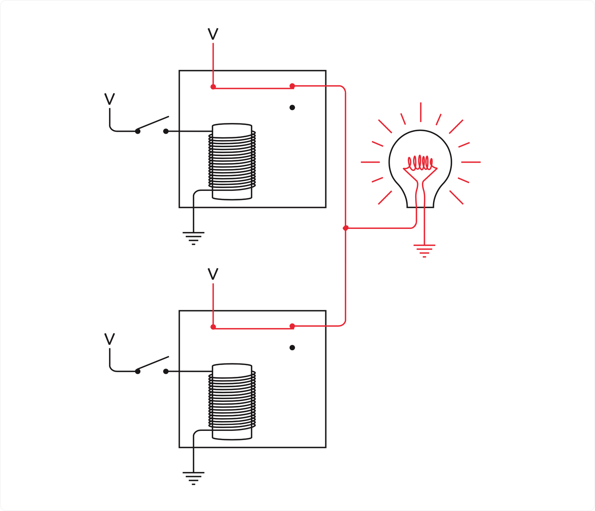
>
> 2. 电气工程师使用的与非门符号：
>
>    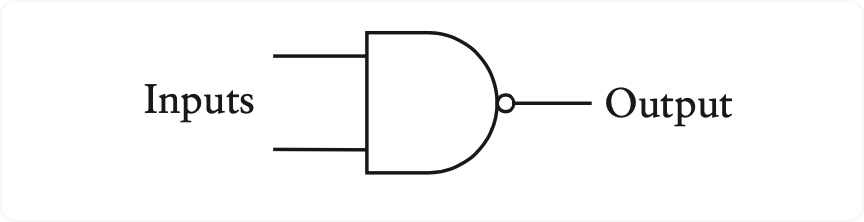
>
> 3. 与非门的输入与输出之间的关系图：
>
>    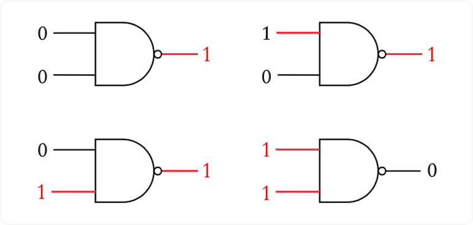
>
>    关系表：（注：结果和 与门(AND) 刚好相反。）
>
>    | NAND |  0   |  1   |
>     | :--: | :--: | :--: |
>    |  0   |  1   |  1   |
>     |  1   |  1   |  0   |
>    
>    - 注：0 和 0 与非等于 1，1 和 0 与非等于 1，0 和 1 与非等于 1，1 和 1 与非等于0。
>

下面是另一种连接两个继电器的方法。

在这种情况下，两个输出连接在一起，与或门的布局类似（注：并联），但是却采用了另一种输出接法。灯泡在两个开关全断开时被点亮。

当上面的开关闭合时，灯泡依然是亮的。

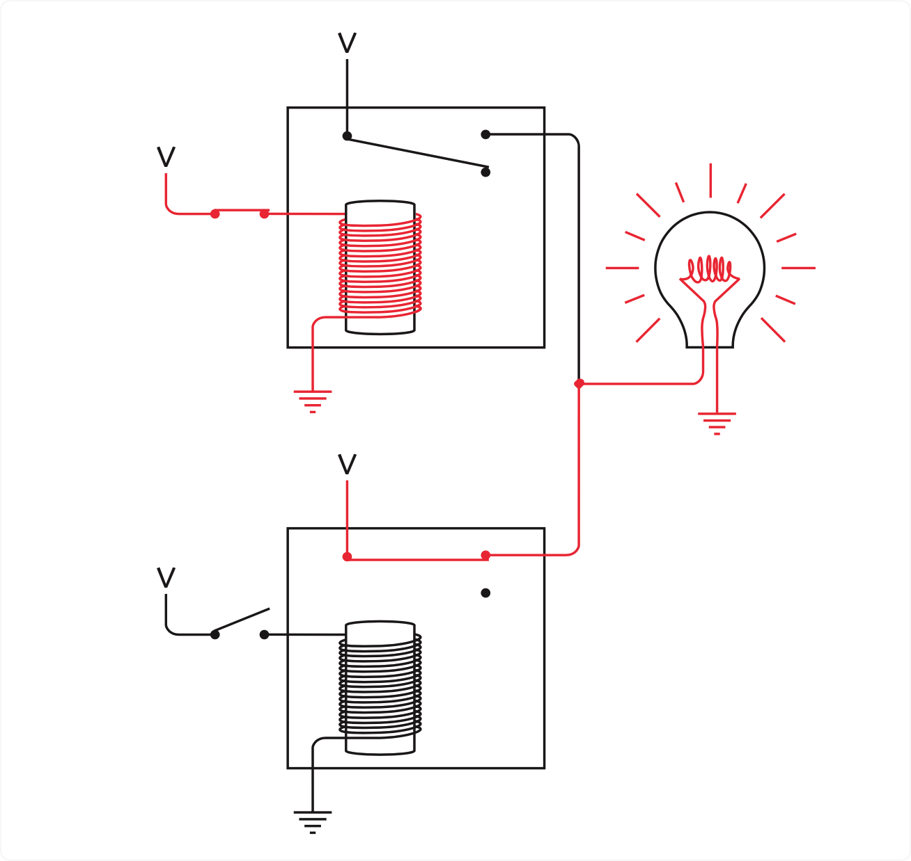

同样，当只有下面的开关闭合时，灯泡也依然是亮的。

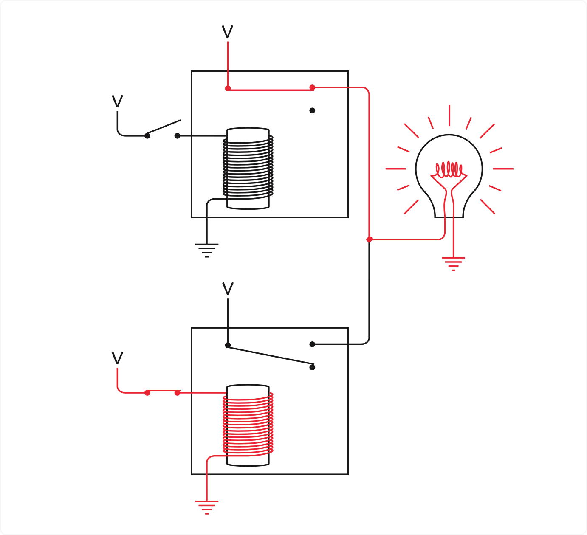

只有当两个开关全闭合的时候，灯泡才会熄灭。

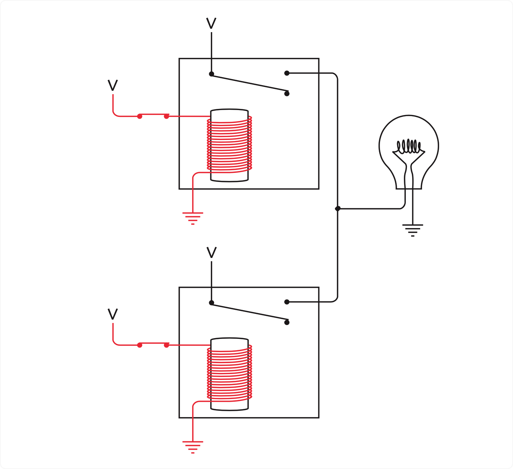

这一结果和与门恰恰相反。这种逻辑门被称为==与非门==，或简称==NAND==。与非门的符号和与门类似，但在输出部位多了一个小圆圈，意思是输出和与门正好相反。

与非门的输出如下表所示。

| NAND |  0   |  1   |
| :--: | :--: | :--: |
|  0   |  1   |  1   |
|  1   |  1   |  0   |

注意与非门的输出是和与门完全相反的。与门只有当输入全为 1 的时候输出才为 1，否则输出就为 0。

到此为止，我们已经看到可以用四种不同的方式来连接有两个输入、一个输出的继电器，每一种方式的行为功能都不一样。为了避免重复画继电器，我们将它们称为逻辑门，并用电气工程师们所使用的专门符号来表示它们。特定逻辑门的输出取决于它的输入，输出与输入的关系可总结为以下几个表格。

现在，我们已经有四个逻辑门和一个反向器。把这些工具组合到一起其实就是原始的==继电器== （注：继电器讲解见第 6 章），如下图所示。

> 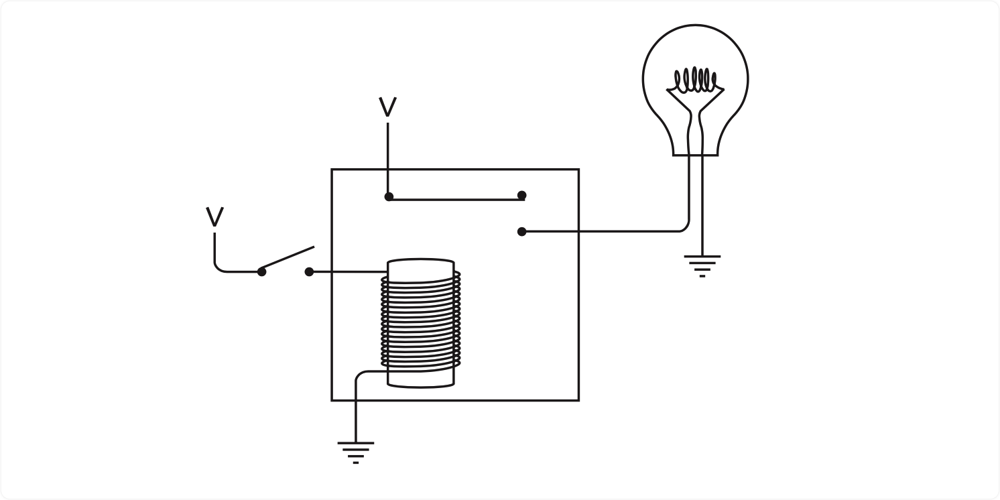

## ▲ 缓冲器（buffer）

这叫做==缓冲器 (buffer)==，可用如下符号表示。

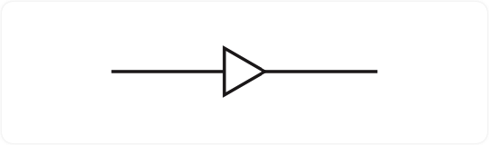

除了输入端的小圆圈，这个符号与反向器是很相似的。很明显，缓冲器 "没有什么作用" ，它的输入与输出是相同的。

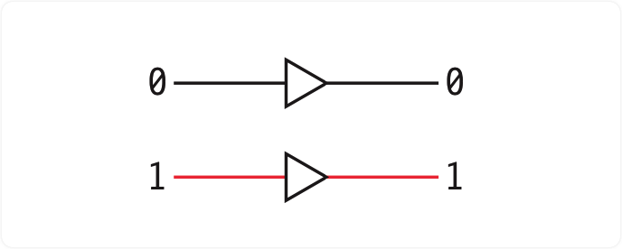

但是在输入信号很微弱的时候，缓冲器就可以派上用场。之前提到过，这也就是很多年前在电报机中使用继电器的原因。另外，缓冲器还可以用于延迟一个信号。这是因为继电器需要一点时间——几分之一秒——才会被触发。

本书从这里开始，继电器将会极少出现了。取而代之地，以后的电路会由缓冲器、反向器、四种基本逻辑门和其他由逻辑门组成的复杂电路（如 2-4 译码器）组成。当然，所有这些器件也是由继电器构成的，但我们用不着直接使用它了。

前面在创建 2-4 译码器的时候，曾出现过这样一个小电路。

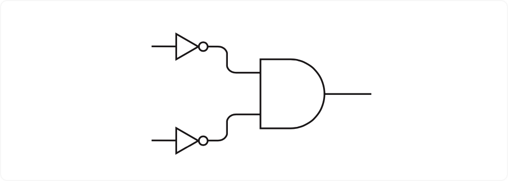

两个输入信号经过反向器后作为与门的输入。这样的组合有时可以去掉反向器而画成如下的形式。

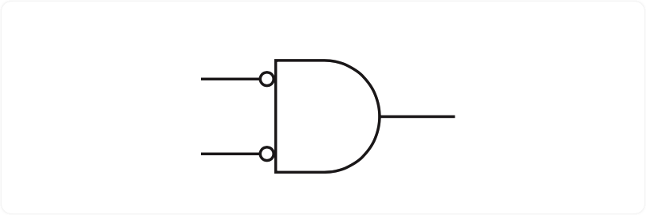

注意与门输入端的小圆圈。这些小圆圈表示信号在那一点被反转——**将 0（低电平）转换为 1（高电平）**，反之亦然。

实际上，**带有两个反向输入的与门** 和 **或非门** 是**等价**的。

只有当输入都为 0 的时候，其输出才为 1。

类似的，带有两个反向输入的或门和与非门也是等价的。

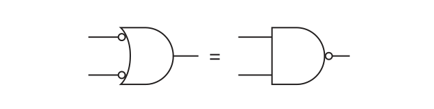

只有当输入全为 1 时，输出才为 0。

这两组等价关系就是摩根定律在电路中的实现。摩根是维多利亚女王时代的另一位数学家，比布尔大 9 岁，于 1847 年发表《形式逻辑》（Formal Logic）一书，与布尔的《逻辑的数学分析》（The Mathematical Analysis of Logic）恰好同一天出版（据说是同一天）。实际上，布尔研究逻辑的灵感正源于一场公开的争论，这个争论就发生在摩根和另一个被指剽窃的英国数学家之间（历史最后证实摩根是清白的）。摩根很早就发现了布尔的洞察力。他无私地鼓励布尔，并帮助他开展研究，而今天除了他的这个著名定律之外，他几乎已被人们所遗忘。

摩根定律可以简单地表示为如下形式：

A 和 B 是两个布尔操作数。在第一个表达式中，两个操作数先被取反，再进行与运算。这与两个操作数进行或运算后再取反（即或非）的结果是一样的。在第二个表达式中，两个操作数先取反，再进行或运算，这和两个操作数先做与运算后再取反（即与非）的结果是等价的。

摩根定律是简化布尔表达式的一种重要手段，因此也可以用来简化电路。从历史的角度来说，这正是香农的论文带给电气工程师们的真正意义。但在本书中简化电路不是重点，我们关注的是让一切有效地运转而不是以最简的形式运转。我们下面要做的就是一台加法器。

## ▲ 异或门（XOR） 

- 详细讲解见 第 12 章

> 重要笔记摘录：
>
> 1. 异或门电路图连接方式：
>     
>    
>
> 2. 电气工程师使用的异或门符号：
>
>    
>
> 3. 异或门的输入与输出之间的关系图：
>
>    
>
>    关系表：（注：和或门只有最后 1 x 1 不同）
>
>    | XOR  |  0   |  1   |
>    | :--: | :--: | :--: |
>    |  0   |  0   |  1   |
>    |  1   |  1   |  0   |
> 
> 

## ▲ 同或门（XNOR）

