# Chapter Twelve: A Binary Adding Machine (二进制加法器)


加法是算术运算中最基本的运算，因此如果想搭建一台计算机（这也正是本书所隐含的内容），那么首先就要造出可以计算两个数的和的器件。当你真正面对它时，就会发现，原来**加法计算就是计算机要做的唯一工作**。如果我们可以造出加法器，同样地，就可以利用加法来实现减法、乘法和除法，计算按揭付款，引导火箭飞到火星、下棋，以及填写我们的话费账单。

这一章中我们要创建的加法器与现代的计算器和计算机来比，将会很庞大、很笨拙、很慢，而且运转起来噪声不断。最有趣的是我们用来制作加法器的全部零件，都是像开关、灯泡、导线、电池、逻辑门、已经预先连接在各种逻辑门中的继电器等这些在之前的章节中学过的非常简单的电子器件。这个加法器所包含的所有器件早在 120 多年前就已经被发明出来了。我们并不用在房间中实际搭建出什么，相反地，可以在纸上以及我们的头脑中来搭建这个加法器。

这个加法器完全用于二进制数的计算，而且没有现代加法器那么便利。你不能使用键盘来给出需要相加的两个数，相反所要用到的是一排开关。计算结果是通过一排灯泡来显示的，而非以数字的形式来显示。

但是，这个加法器确实可以将两个数相加，其方法与计算机计算加法的方式非常相似。


计算二进制数加法与计算十进制数加法非常相似。如果你想要让 245 和 673 这两个十进制数相加，你会把这个问题分解为几个简单的步骤。每个步骤只需要将两个十进制数相加。在这个例子中，首先要将 5 和 3 相加。生活中，记住加法表能更快地解决问题。

二进制数加法与十进制数加法最大的不同就在于二进制数加法中用到了一个更为简单的加法表。

| + 加法 (sum) |  0   |        1        |
| :----------: | :--: | :-------------: |
|      0       |  0   |        1        |
|      1       |  1   | 10（读： 一零） |

如果你是一头鲸鱼并且在学校中学习了这个表格，你会大声说出：

```
0 加 0 等于 0； (0 plus 0 equals 0.)
0 加 1 等于 1； (0 plus 1 equals 1.)
1 加 0 等于 1； (1 plus 0 equals 1.)
1 加 1 等于 0，进位 1。 (1 plus 1 equals 0, carry the 1.)
```

以上加法表可以重新写为下面带有前导零的形式，这样每个结果就都是一个 2 位的值。

|  + 加法 (sum)  |  0   |  1   |
| :--: | :--: | :--: |
|  0   |  00   |  01   |
|  1   |  01   |  10  |

像这样，一对二进制数相加的结果中具有两个数码，其中一位叫做==**加法位（sum bit）**==，另一位则叫做 ==**进位位（carry bit)**== (例如，1 加 1 等于 0，进位为 1）。下面我们将二进制数加法表分成两个表格，

第一个是表示加法的。

| + 加法 (sum) |  0   |  1   |
| :----------: | :--: | :--: |
|      0       |  0   |  1   |
|      1       |  1   |  0   |

第二个是表示进位的。

| + 进位 (carry) |  0   |  1   |
| :------------: | :--: | :--: |
|       0        |  0   |  0   |
|       1        |  0   |  1   |

用这种方法来看二进制加法非常方便，因为在我们的加法器中加法与进位是分别进行的。搭建一个二进制加法器需要我们首先设计一个电路，通过该电路执行这些操作。完全用二进制数，问题将在很大程度上得以简化，因为，电路中的所有器件，像开关、灯泡、导线等都可以用来表示二进制数的位。

与十进制数加法一样，我们将**两个二进制数字串由右向左依次逐列相加**。

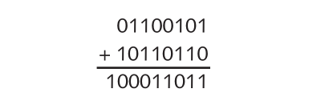

注意，在我们将从右边数的第 3 列的数相加的时候，会有一个 1 进位到下一列中。这在第 6、第 7、第 8 列也是一样的。

想要让多大的二进制数相加？由于仅仅在头脑中来搭建加法器，所我们可以搭建出一个能够让非常长的二进制数相加的加法器。

但是经过理智的考虑之后，**我们决定让搭建起来的二进制加法器最高能够执行的加法长度为 8 位。也就是说，我们想要相加的二进制数，其范围是从 0000-0000 到 1111-1111，即十进制数的 0 到 255。两个 8 位二进制数的和最大可为 1-1111-1110，即 510**。

加法器的控制面板如下图所示。

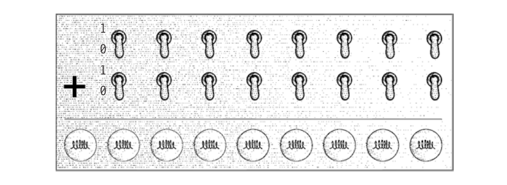

在这个面板中，有两排开关，每排 8 个。这些开关就是输入设备，我们将用它们来 "输入" 两个 8 位二进制数。在这套输入设备中，开关断开（关）即表示 0，闭合（开）表示 1，这与你房间墙上的开关是一样的。面板底部的输出设备是一排灯泡，共 9 个。这些灯泡用来显示结果。不发光的灯泡表示 0，发光的灯泡表示 1。这里有 9 个灯泡，因为两个 8 位二进制数的相加结果可能是一个 9 位的二进制数。

加法器的其他部分是以各种形式连接起来的逻辑门。开关将触发逻辑门中的继电器来点亮相应的灯泡。

例如，如果我们要将 0110-0101 和 1011-0110（之前例子中的两个数：245 和 673 ）相加，则要将相应的开关置于下图所示位置。

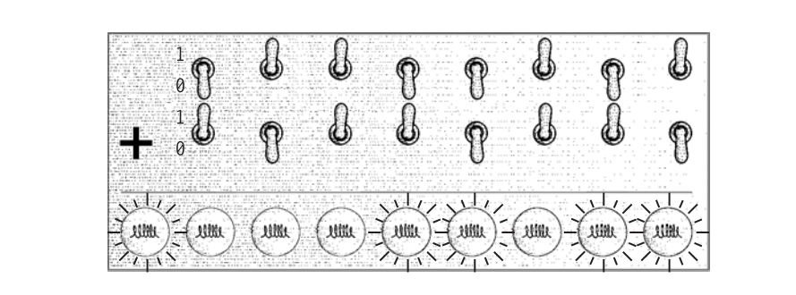

灯泡发光显示结果为：1-0001-1011（然而，这只是一个希望的结果，因为我们还没有将加法器真正搭建出来！）

在上一章中提到过，本书中我们将会用到许多继电器。这个 8 位二进制加法器中所用到的继电器不少于 144 个，其中我们用来相加的 8 对二进制位，每对都需要 18个继电器。如果将全部电路展示出来，你一定会崩溃的。没有人能看懂以各种方式连接起来的144个继电器所表达的意义。

## ▲ 进进位 (carry bit)

相反地，我们要利用逻辑门来分阶段地处理这个问题。当看到进位（两个 1 相加就会产生一个进位）结果表的时候，或许你已经看出来逻辑门和二进制加法的一些相关性了。

| + 进位（carry） |  0   |  1   |
| :-------------: | :--: | :--: |
|        0        |  0   |  0   |
|        1        |  0   |  1   |

你可能意识到了，**这（进位）和上一章中与门的输出结果是一样的**。

| 与门 (AND) |  0   |  1   |
| :--------: | :--: | :--: |
|     0      |  0   |  0   |
|     1      |  0   |  1   |

因此，利用与门可以计算两个二进制数加法的进位。

## ▲ 异或门 (XOR) / 加法位 (sum bit)

到此，我们着实取得了一些进展。下面我们要做的就是利用继电器来实现下表。

| + 加法 (sum) |  0   |  1   |
| :----------: | :--: | :--: |
|      0       |  0   |  1   |
|      1       |  1   |  0   |

这是在作两个二进制数加法时需要解决的另一个问题。加法位的情况并不像进位位那样简单，但是我们即将实现它。

首先我们要知道，或门和我们想要的结果很相似，除了右下角的结果。

| 或门 (OR) |  0   |  1   |
| :-------: | :--: | :--: |
|     0     |  0   |  1   |
|     1     |  1   |  1   |

与非门同样和我们想要的结果很相似，除了左上角的结果。

| 与非门 (NAND) |  0   |  1   |
| :-----------: | :--: | :--: |
|       0       |  1   |  1   |
|       1       |  1   |  0   |

下面我们将或门和与非门连接到相同的输入上，如下图所示。

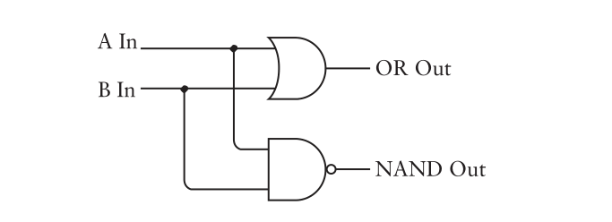

下表总结了或门和与非门的输出，并将其与我们想要的结果进行了对比。

| 输入 A (A In) | 输入B (B In) | 或门输出 (OR Out) | 与非门输出 (NAND Out) | 想要的结果 (What we want) |
| :-----------: | :----------: | :---------------: | :-------------------: | :-----------------------: |
|       0       |      0       |         0         |           1           |             0             |
|       0       |      1       |         1         |           1           |             1             |
|       1       |      0       |         1         |           1           |             1             |
|       1       |      1       |         1         |           0           |             0             |

注意，我们想要的是 1，那么这种情况只有在或门和与非门的输出都为 1 时才会出现。这表明两个输出端可以通过一个与门连接到一起。

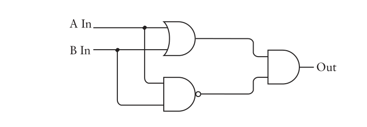


这就是我们想要的结果。

注意，在整个电路中仍然有两个输入和一个输出。两个输入同时作为 或门 和 与非门 的输入。或门 和 与非门 的输出又分别作为一个 与门 的输入，最后得出了我们想要的结果。

| 输入 A (A In) | 输入B (B In) | 或门输出 (OR Out) | 与非门输出 (NAND Out) | 与门输出 (AND Out) |
| :-----------: | :----------: | :---------------: | :-------------------: | :----------------: |
|       0       |      0       |         0         |           1           |         0          |
|       0       |      1       |         1         |           1           |         1          |
|       1       |      0       |         1         |           1           |         1          |
|       1       |      1       |         1         |           0           |         0          |

实际上这个电路有个专门的名称，叫做==**异或门**==，简写为==**XOR**==。

之所以称为**异或门**是因为若想其输出结果为 1，要么仅让输入 A 为 1，要么仅让输入 B 为 1，两输入端都为 1 则输出为 0。为了不把或门、与非门和与门都画出来，我们可以使用一个电气工程师所采用的特定电气符号来表示异或门。

> 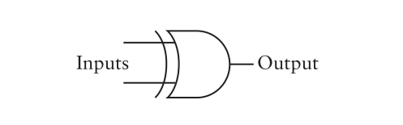

异或门在输入端比或门多出了一条曲线，除此之外它看上去和或门非常相像。异或门的特征如下表所示。

| 异或门 (XOR) |  0   |  1   |
| :----------: | :--: | :--: |
|      0       |  0   |  1   |
|      1       |  1   |  0   |

异或门是本书中详细介绍的最后一个逻辑门（第6个门有时会在电气工程中介绍到。它称做同或门，因为只有当两个输入相同的时候，其输出才为1。同或门所给出的输出刚好与异或门相反，因此同或门的符号和异或门相同，但在输出端多了个小圆圈）。

## ▲ 同或门 (XNOR)

*Additional Info: 同或门属于笔者补充信息，书本如上所说没有详细讲解。*

同或门(XNOR) 的电路图如下，整个电路中仍然有两个输入和一个输出。两个输入同时作为 或非门 和 与门 的输入。或非门 和 与门 的输出又分别作为一个 或门 的输入，最后得出了我们想要的结果。

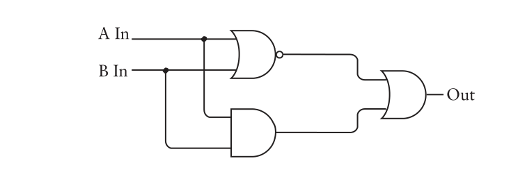

表格如下：

| 输入 A (A In) | 输入B (B In) | 或非门输出 (XOR Out) | 与门输出 (AND Out) | 或门输出 (OR Out) |
| :-----------: | :----------: | :------------------: | :----------------: | :---------------: |
|       0       |      0       |          1           |         0          |         1         |
|       0       |      1       |          0           |         0          |         0         |
|       1       |      0       |          0           |         0          |         0         |
|       1       |      1       |          0           |         1          |         1         |

注:  0 和 0 同或得 1，0 和 1 同或得 0，1 和 0 同或得 0，1 和 1 同或得 1。

> 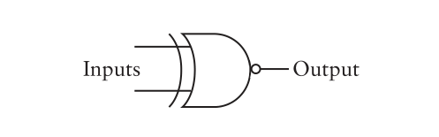
>
> 关系表：
>
> | 同或门 (XNOR) |  0   |  1   |
> | :-----------: | :--: | :--: |
> |       0       |  1   |  0   |
> |       1       |  0   |  1   |


## ▲ 半加器 (Half Adder)

让我们回顾一下到目前为止所了解的内容。将两个二进制数相加将产生一个加法位和一个进位位。


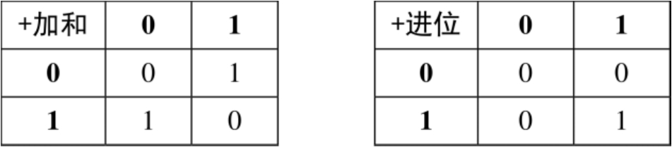

可以利用下面这两个逻辑门来实现这些结果。

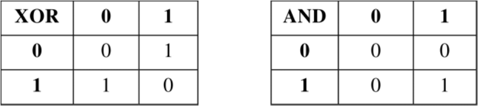

两个二进制数相加的结果是由异或门的输出给出的，而进位位是由与门的输出给出的。因此我们可以将与门和异或门连在一起来计算两个二进制数（即A和B）的和。

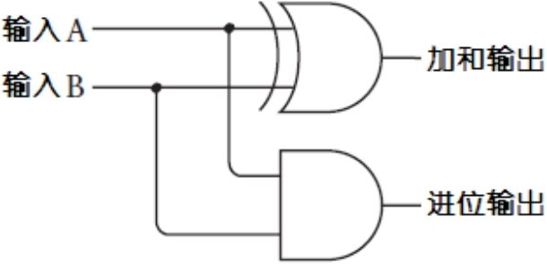

为了避免重复画与门和异或门，你可以采用如下这种简单的表示方式。

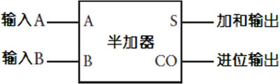

这个符号被称为半加器（Half Adder）。之所以叫半加器是有原因的，它将两个二进制数相加，得出一个加法位和一个进位位。但是绝大多数二进制数是多于1位的。半加器没有做到的是将之前一次的加法可能产生的进位位纳入下一次运算。例如，假设我们要将如下两个二进制数相加。

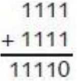

我们只能将半加器用于最右面一列的相加：1加1等于0，进位1。对于从右面算起的第二列，由于进位位的存在，实际上需要将三个二进制数相加，而随后每一列的加法都是这样的。随后的每一列二进制数相加都需要将进位位算进来。


为了对三个二进制数进行加法运算，我们需要将两个半加器和一个或门做如下连接。


要理解它的工作原理，首先从最左边第一个半加器的输入A和输入B开始，其输出是一个加和及相应的进位。这个和必须与前一列的进位输入相加，然后再把它们输入到第二个半加器中。第二个半加器的输出和是最后的结果。两个半加器的进位输出又被输入到一个或门中。你可能会觉得，这里还需要一个半加法器，这当然是可行的。但是如果你了解了所有的可能性之后，你会发现，两个半加法器的进位输出是不会同时为1的。或门在这里已经足够，因为或门除了在输入都为1的时候以外，其他情况下结果和异或门结果相同。


## ▲ 全加器 (Full Adder)

为了避免重复地画上面的那个图，我们用以下形式来替代上图中的一堆符号，它称为全加器（Full Adder）。

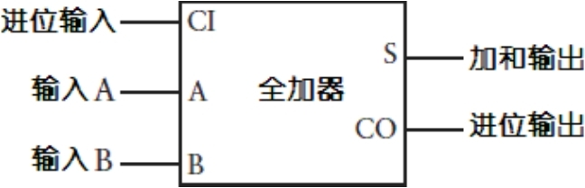

以下表格总结了全加法器所有可能的输入组合以及对应的输出结果。

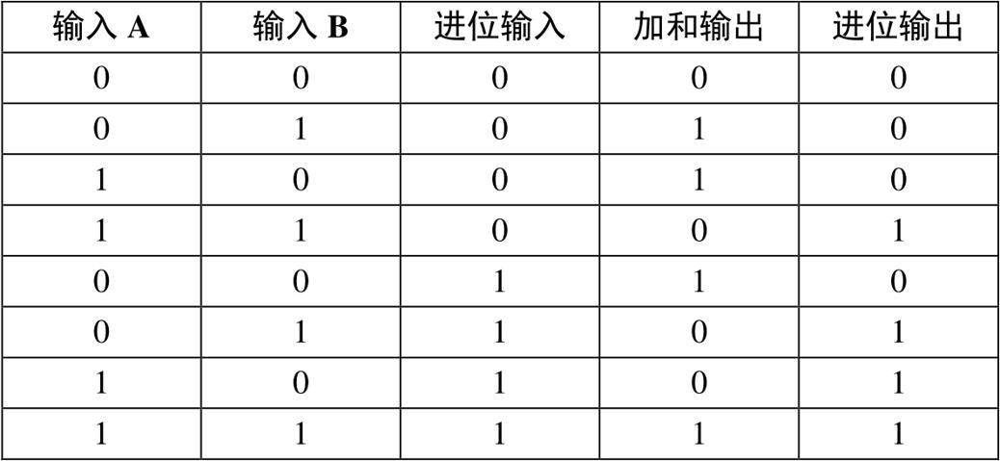

在本章前面曾经提到过，我们的加法器需要144个继电器。下面就来解释一下这个数目是如何得到的。每个与门、或门和与非门都需要两个继电器，因此一个异或门中就包含6个继电器。一个半加器是由一个异或门和一个与门组成的，因此一个半加器就需要8个继电器。每个全加器由两个半加器和一个或门组成，所以它要18个继电器。我们需要8个全加器来制作8位二进制加法器。因而总共需要144个继电器。

再来看看之前提到的由灯泡和开关所组成的控制面板。现在我们可以开始将开关和灯泡连接到全加器了。

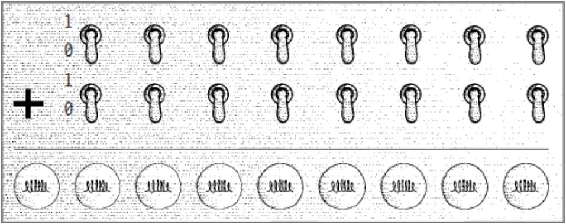

首先将最右端的两个开关和最右端的一个灯泡连接到一个全加器上。

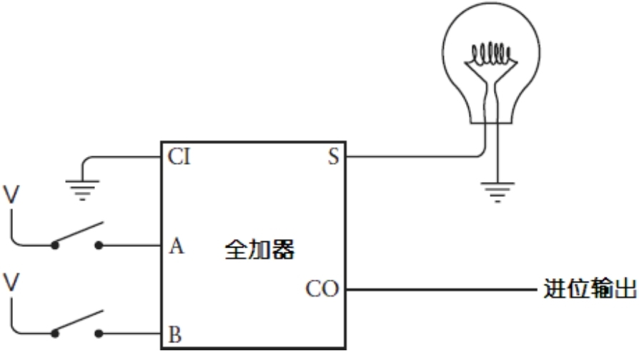

当把两个二进制数相加时，第1列的处理方式与其他列有所不同。因为后面的几列可能包括来自前面加法的进位，而第1列不会，所以全加器的进位输入端是接地的，这表示第1列的进位输入是一个0。第1列二进制数相加后很可能会产生一个进位输出，这个进位输出是下一列加法的输入。

对于接下来的两个二进制位和灯泡，可以按如下办法来连接全加器。

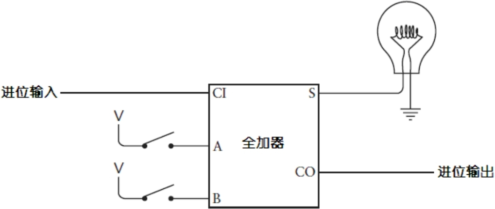


第一个全加器的进位输出就是第二个全加器的进位输入。随后的每列二进制数都以同样的方式连接。每一列进位输出都是下一列的进位输入。

最终，第8个灯泡和最后一对开关将以如下方式连接到全加法器上。

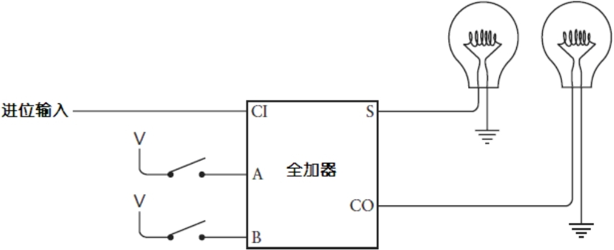

这里，最后一个进位输出将被连接到第9个灯泡上。

至此，我们就大功告成了。

还可以用另一种方式来看这 8 个全加器的连接，每个全加器的进位输出都作为下一个全加器的进位输入。

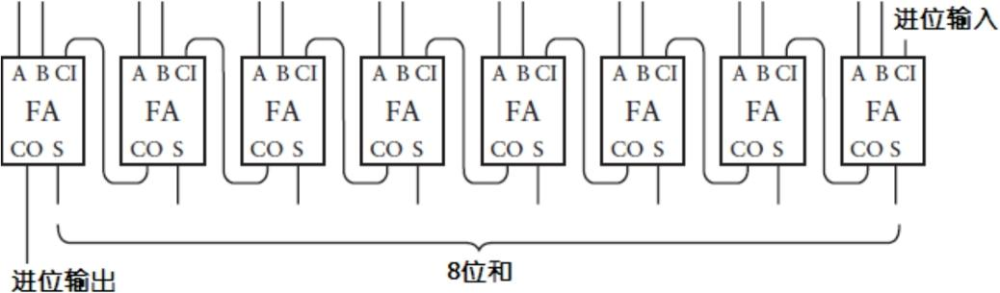

下面是画成一个盒子的完整的8位二进制加法器，输入标记为A<span class="subscript">0</span>～A<span class="subscript">7</span>和B<span class="subscript">0</span>～B<span class="subscript">7</span>，输出标记为S<span class="subscript">0</span>～S<span class="subscript">7</span>。

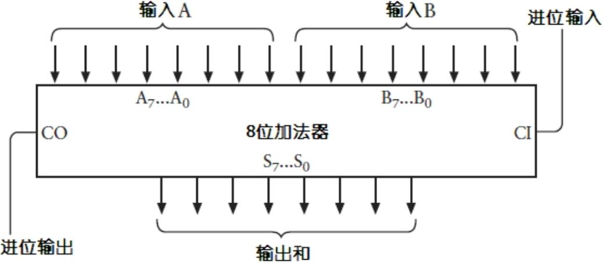


这就是表示多位数字中各位数字的常用方法。A<span class="subscript">0</span>、B0 和 S0 是最低有效位，或者说是最右边的一位。A<span class="subscript">7</span>、B<span class="subscript">7</span>和S<span class="subscript">7</span>是最高有效位，或者说是最左边的一位。例如，下面演示了这样一列带有下标的字母是如何用来表示一个二进制数 0110-1001 的。

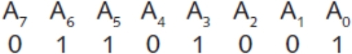

下标从0开始，并且向着高有效位的方向递增，因为它们和2的乘方数（幂）相对应。

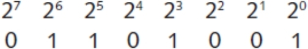

如果把下面一排的每个二进制位和其对应的2的幂相乘再依次相加，你就会得到0110-1001的十进制数表示64 + 32 + 8 + 1，即105。

另一种8位二进制加法器可用下图表示。

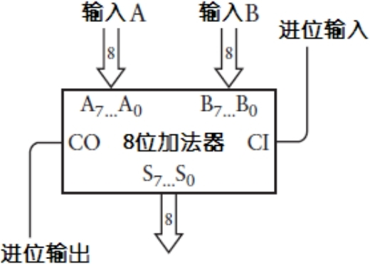

双线箭头包含了8个输入端，代表一组8个独立的信号。它们被标识为A<span class="subscript">7</span>…A<span class="subscript">0</span>、B<span class="subscript">7</span>…B<span class="subscript">0</span>、S<span class="subscript">7</span>…S<span class="subscript">0</span>，同样也表示一个8位二进制数。

一旦你搭建起了8位二进制加法器，你就可以再搭建另外一个加法器。把它们级联起来就可以很容易地扩展出一个16位加法器。

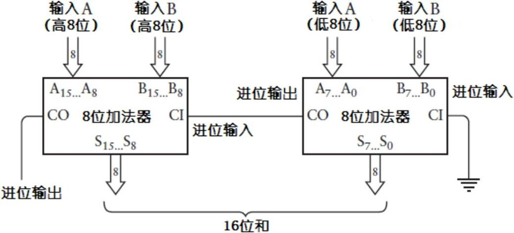


右边加法器的进位输出被连接到了左边加法器的进位输入上。左边加法器的输入包含了两个加数的高8位，而得到的结果也是最终加和的高8位。

你可能会问： "这真的就是计算机进行加法运算时所采用的方式么？" 

基本上来说，是的。但也并不完全是。

首先，可以制作一个比这个算得更快的加法器。如果你看一下这个电路是如何工作的，最低有效位的一对数字相加所得出的一个进位输出，将要参与接下来的一对数字的加法运算，由此得到的一个进位输出又要参与再下一对数字的加法运算，依此类推。加法器的总体速度等于数字的位数乘以全加器器件的速度，这被称做行波进位（ripple carry，或脉冲进位）。更快的加法器运用了一个被称为 "前置进位" 的电路来提高运算的速度。

其次，也是最重要的，计算机已经不再使用继电器了！尽管它曾经被使用过。第一台数字计算机在20世纪30年代被建造完成，当时所使用的就是继电器，后来也使用过真空管。今天的计算机使用的是晶体管。在被用到计算机中时，晶体管的工作方式与继电器基本相同，但是正如我们即将了解到的，晶体管要比继电器计算速度更快、体积更小，而且噪声更弱、耗能也更低，而且更便宜。搭建一个8位加法器依然需要144个晶体管（如果你用前置进位法代替行波进位，将会用到更多的晶体管），但是电路却是极小的。


