# Chapter Thirteen: But What About Subtraction? (如何实现减法)

当你确信继电器连接到一起真的可以实现二进制数加法的时候，你可能会问： "那么如何实现减法呢？" 本章后续的内容会帮你解答这个问题，因此提出这样的问题并不是说你在没事找事，而实际上这表明你是相当有察觉力的。加法和减法在某些方面相互补充，但在机制方面这两个运算则是不同的。**加法是始终从两个加数的最右列向最左列进行计算的。每一列的进位加到下一列中**。**在减法中没有进位，而是有借位——一种与加法存在本质区别的麻烦机制**。

## ▲ 减数小于被减数的减法（十进制）

例如，我们来看一个典型的借位减法的题目：

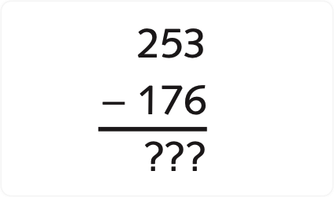

要解决这个问题，首先从最右列着手。我们看到，6 是大于 3 的，因此从 5 上借 1，再用 13 减去 6，得到结果为 7。由于我们已经在 5 上借了 1，因此，现在实际上那一位是 4，而 4 是小于 7 的，因此继续从 2 上借 1，14 减 7 结果为 7。而由于在 2 上借了 1，实际上这一位是 1，从中减去 1，结果为 0。因此，最后的结果应为 77：

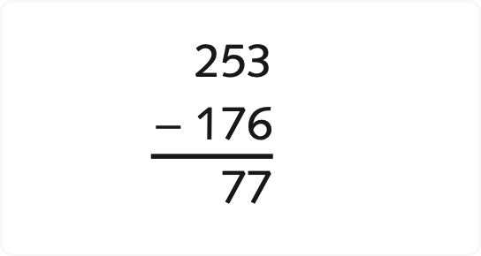

如何才能通过一连串逻辑门来实现这个反逻辑呢？

然而，我们并不打算这样做。相反，我们打算用一个小技巧来让减法不涉及借位。这会使波洛尼厄斯 `[1]`（既不是欠债人也不是出借人）满意，我们其他人也一样。此外，由于减法与计算机中以二进制编码的存储有关，详细地了解减法也是很重要的。

- `[1]`波洛尼厄斯是莎士比亚著名戏剧《哈姆莱特》中的一位世故的御前大臣，他在第一幕第三场向他即将离家外出的儿子说了一大段告诫的话，其中有一句： "不要向人告贷，也不要借钱给人。因为向人告贷的结果，容易养成因循懒惰的习惯；而把债款放了出去，往往不但丢了本钱，而且还失去了朋友。" 后来，美国经济学家范里安在其所著的《微观经济学：现代观点》一书中使用了 "波洛尼厄斯" 一词，该词就成为了经济学中的一个概念。经济学在研究消费者进行跨时期的消费行为时，把这种既不向别人借钱、也不借钱给别人的状态叫作 "波洛尼厄斯点" 。因此，这里的 "波洛尼厄斯" 也就表示既不向别人借钱、也不借钱给别人的人。——译者注

为了便于表达，将进行减法的两个数分别用 **被减数 (minuend)** 和 **减数 (subtrahend)** 表示。从被减数中减去减数，得到的结果叫做 **差 (difference)**。

- minuend `/'mɪnjʊ,ɛnd/` -n.[数]被减数
- Subtrahend `/'sʌbtrə,hɛnd/` -n.[数]减数
- difference `/ˈdɪfərəns/` -n.差别，差异

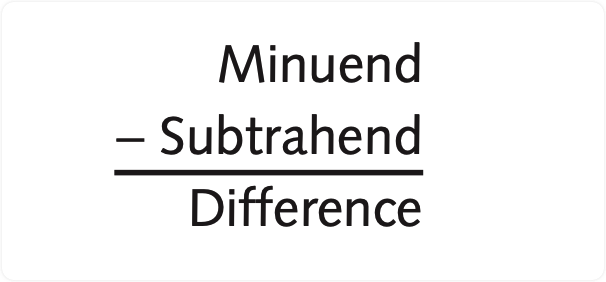

为了避免借位，**首先要从 999 中减去减数**，而不是从原来的被减数中减去减数。

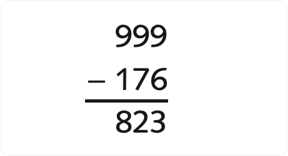

由于操作数是三位数，所以这里使用 999。如果操作数是 4 位，则用 9999。**从一串 9 中减去一个数叫做对 9 求补数**。176 对 9 的补数是 823。反之亦然：823 对 9 的补数是 176。这样的好处就是无论减数是多少，计算对 9 的补数都不需要借位。

- 补数：一个数的 "补数" 是与这个数**相加**而得到 10（或 100、1000... 等，视有几位数而定）的数。
- 更多补数的讲解见 数学仓库笔记。

**计算出减数对 9 的补数后，将补数与原来的被减数相加**：

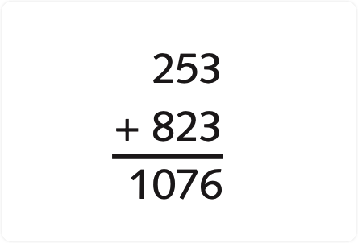

**最后再将结果加 1，并减去1000**。

到此，我们就得到了结果。答案与先前的相同，而且没有用到借位。

为什么这种方法行得通呢？原题目是这样的：

$$
253- 176
$$

在这个式子中加上一个数再减去这个数，结果是相同的。因此先加上1000，再减去1000：

$$
253- 176 + 1000 - 1000
$$

这个式子与下式等价：

$$
253- 176 + 999 + 1 - 1000
$$

然后用以下方式将数字重新组合：

$$
253 + (999 - 176) + 1 - 1000
$$

这个式子与刚才描述过的用 9 的补数进行的计算是相同的。我们用两个减法和两个加法来替代一个减法，而在这个过程中避免了烦琐的借位。

## ▲ 减数大于被减数的减法（十进制）

如果减数大于被减数会怎么样呢？例如以下问题：

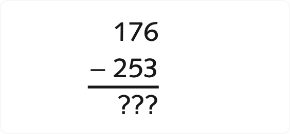

通常遇到这个问题时你可能会说： "这里减数大于被减数，因此要将减数和被减数交换来执行减法，然后给结果取个相反数。" 你可能在脑子里将这两个数交换，而写出这样的答案：

如果希望求解这个问题而不使用借位的话，就要采用与之前稍微不同的方法。

**首先要像前面一样，用 999 减去减数 253，计算出对 9 的补数：**

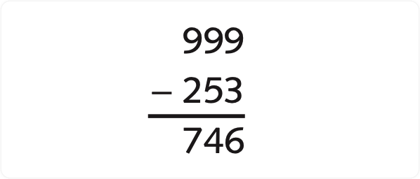

**然后，把该数对 9 的补数与被减数相加：**

在前面的例子中，下一步应该加 1，并减去 1000 来得到最终结果。但是在这里，这种方法并不适用。因为你会遇到 923 减去1000 的情况，这又导致了借位。

由于我们之前已经加了999，这里再减去999：

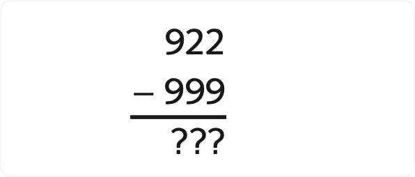

到这里，我们会意识到这个问题的结果是负数，因此需要将减数与被减数交换，用 999 减去 922。这里没有用到借位，结果与我们期望的相同：

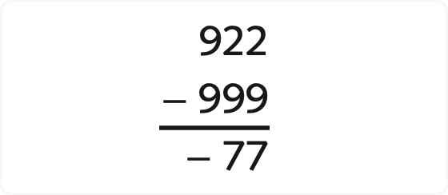

- *Added 即：$999 - 253 + 176 - 999$*

## ▲ 减数小于被减数的减法（二进制）

同样的技巧可以用于二进制数中，而且实际上这要比十进制数简单。让我们一起来看看该如何操作。

原来的减法题目是：

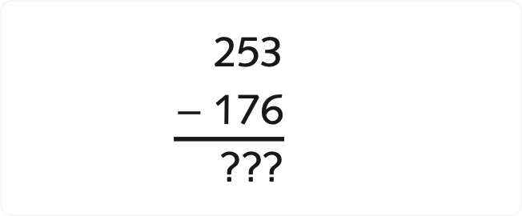

将这些数字转化为二进制数，问题变为：

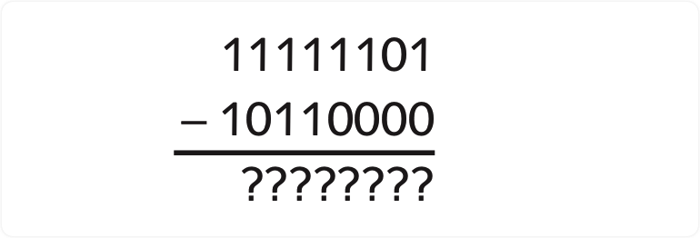

**第一步，用 1111-1111（即 255）减去减数：** **(即：先求：减数对 1 的补数)**

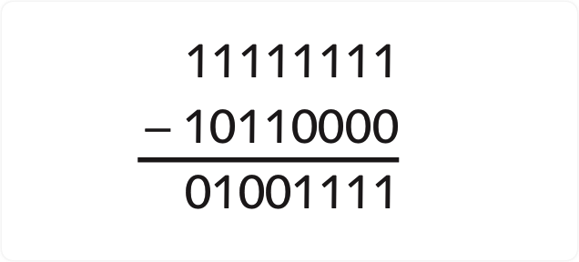

当计算十进制数减法的时候，减数是从一串 9 中减去的，结果称为 9 的补数。**在二进制数减法中，减数是从一串 1 中减去的，结果称为 1 的补数**。但是请注意，**我们在求对 1 的补数时并不需要用到减法**。**在求对 1 的补数时，只需将原来的二进制数中的 1 变为 0，将 0 变为 1 即可**。**因此对 1 求补数有时也会称为相反数（negation）或反码（inverse）**。这里你可能会想起第 11 章中的反向器，它的作用就是将 0 变为 1，将 1 变为 0。

- negation `/nɪˈɡeɪʃən/` -n.否定，拒绝。
- inverse `/'ɪnvɜːs/` -n.相反。-adj.相反的。

**第二步，将减数对 1 的补数与被减数相加：**

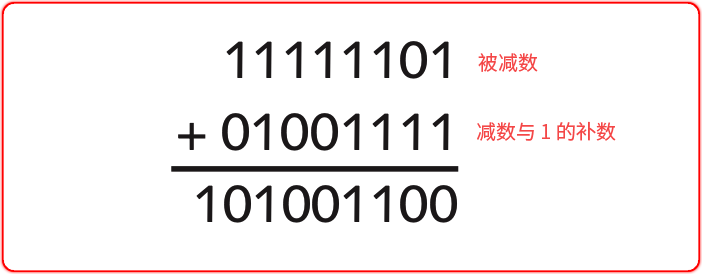

图 (1)

**第三步，将上式所得结果加 1：**

**第四步，减去 1-0000-0000（即 256）：**

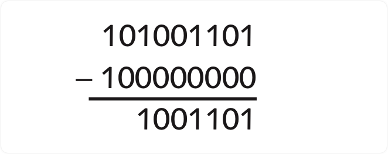

结果就等于十进制数的 77。

## ▲ 减数大于被减数的减法（二进制）

我们把这两个数颠倒位置后再做一遍。在十进制中，减法题目对应于：

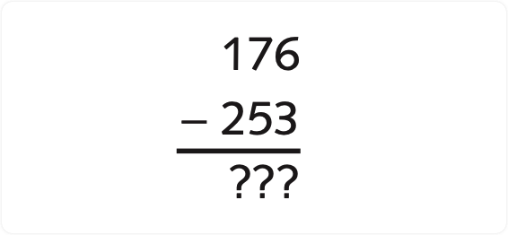

而用二进制表示为：

**第一步，用 1111-1111 减去减数，得到对 1 的补数：**

**第 2 步，将减数对 1 的补数与被减数相加：**

现在我们要用某种方法在结果中减去 1111-1111。当减数小于被减数的时候，我们将结果加 1 再减 1-0000-0000 来完成计算。但是你无法在不借位的情况下做到这一点。所以，我们先用 1111-1111 减去所得结果：

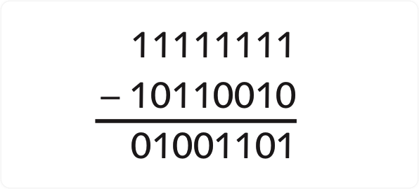

这里又一次用到了将各位取反来求得结果的方法，但是这个结果是 77，而真正的答案应该是 -77。

## ▲ 8 位加/减器

到这里，我们已经有了足够的条件来改造上一章所搭建的加法器，并让它像实现加法一样来实现减法运算。为了不让问题太复杂，**这个新的加/减法器只执行在减数小于被减数的减法操作，即结果为正数的操作**。

该加法器的核心是由逻辑门集成的 8 位全加器。

你可能还记得，输入 $A_0 - A_7$ 及 $B_0 - B_7$ 与两排分别表示两个要相加的 8 位二进制数的开关相连。进位输入接地。与 $S_0 - S_7$ 表示结果的 8 个灯泡相连。由于这个加法有可能得到 9 位数值，进位输出端也连接了一个灯泡。

- 注：下图实际上只做了一个操作，即上面加了红框的 `图(1)`

控制面板示意如下图所示。

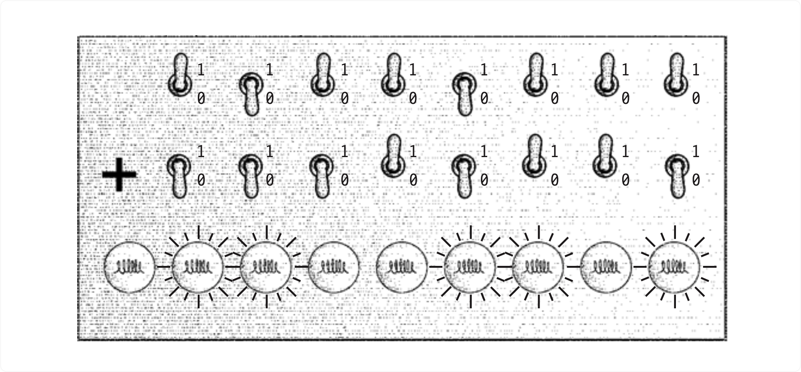

在上图中，开关所表示的是 183（即 10110111）与 22（即 00010110）相加，结果如灯泡所示为 205（即 11001101）。

8 位加/减法器所用的新面板较从前做了些许的改动。它增设了一个开关，用以选择做加法还是做减法。

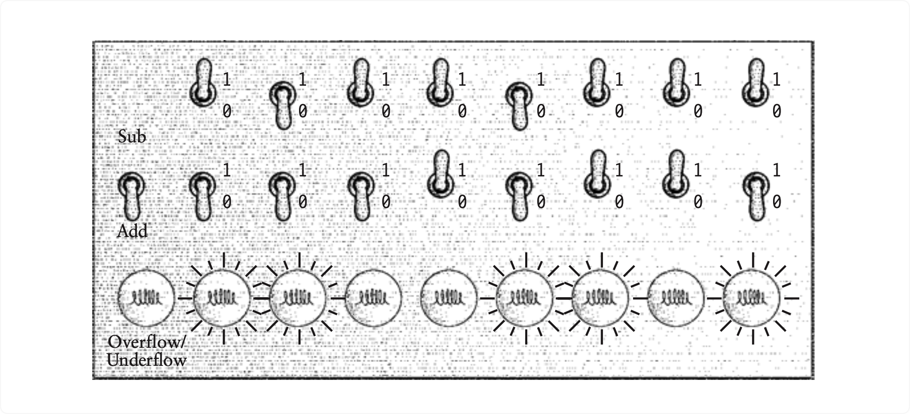

如上图所示，这个开关向下断开时表示选择加法运算，反之向上接通则表示选择减法运算。此外，右侧的 8 个灯泡用于表示计算结果。这里，第 9 个灯泡表示 "上溢/下溢" 。这个灯泡表明了正在计算的数字是一个不能用 8 个灯泡来表示的数字。如果在加法中得到了大于 255$^{\color{red}{(1)}}$（上溢，overflow）或在减法中得到了负数（下溢，underflow）这个灯泡就会发光。当减数大于被减数的时候，就会得到一个负数。

- `(1)` 为什么大于 255，看上面加红框的 `图(1)`

加法器中新增的主要部分就是一个用来求 8 位二进制数对 1 补数的电路。之前提到，**二进制数对 1 求补数相当于对其每位取反**，因此我们计算8 位二进制数补数的时候可以简单地应用 8 个反向器。

问题是，该电路只会对输入求反，而我们要的是一台既能做加法又能做减法的机器，因此就要求该电路当且仅当进行减法运算时才实现反转。电路可以改造为如下图所示。

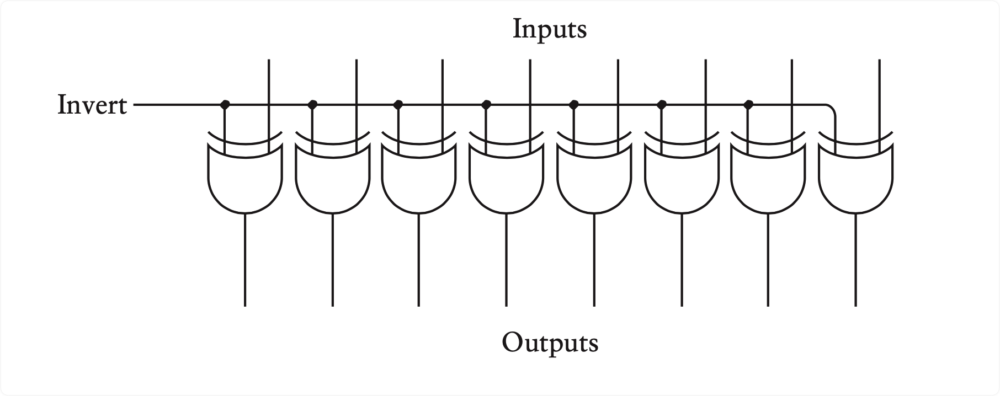

标记为 "取反" 的信号将被输入到每一个异或门中。回想一下异或门的工作方式，如下表所示。

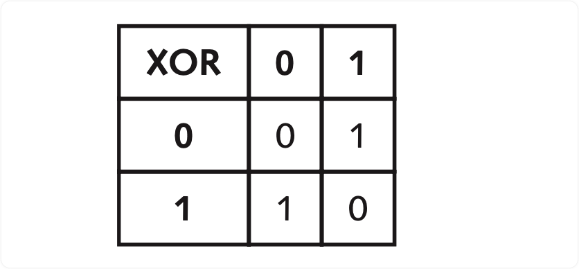

因此，如果 "取反" 信号是 0，则 8 个异或门输出与输入相同。例如，如果输入是 0110-0001，那么输出也为 0110-0001。如果 "取反" 信号为 1，则输出信号反置。例如，如果输入为 0110-0001，输出则为 1001-1110。

**将 8 个异或门合并起来画成一个器件，称为** **==求补器（One’s Complement）==**，如下所示。

将一个求补器，一个 8 位二进制加法器和一个异或门做如下连接。

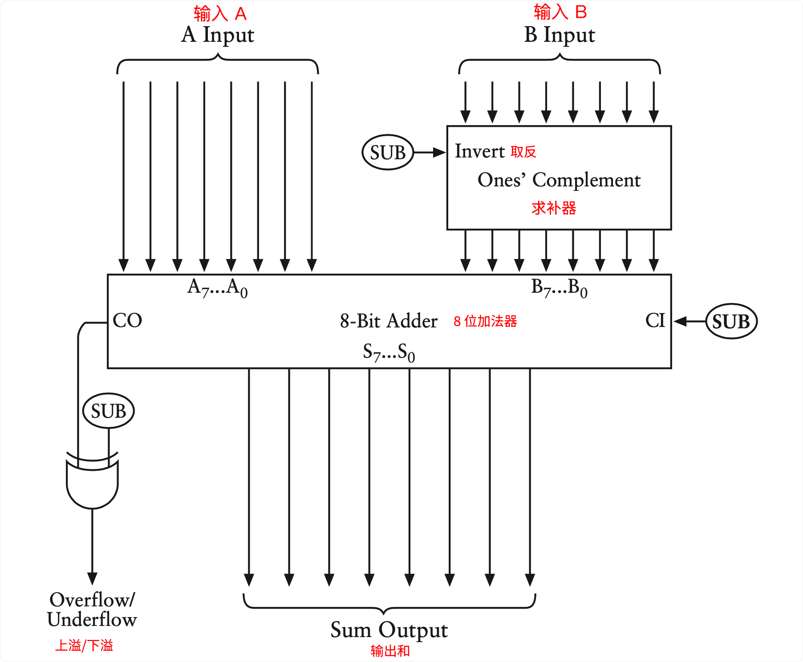

注意，这里三个信号都标识为 "SUB" ，这就是加/减法转换开关。当该信号为 0 的时候，其进行的是加法运算，为 1 时进行的则是减法运算。在减法中，输入B（第二排开关）在送入加法器之前，需先通过求补电路进行取反。此外，在做减法时，我们通过设定 CI（Carry In 进位输入）为1 来使得结果加 1。而在加法中，求补电路将不起作用，且输入 CI 为 0。

加法器的 SUB 信号和 CO（进位输出）作为异或门的输入来控制表示上溢/下溢的灯泡。如果 SUB 信号为 0（表示进行加法运算），则当加法器CO 输出为 1 时灯亮，意思是加法计算结果大于 255。

当进行减法运算的时候，如果减数（输入B）小于被减数（输入A），这时加法器的 CO 输出为 1。这表示减法的最后一步要减去 1-0000-0000。也就是说减数要大于被减数，结果为负。上面所示器件现在还不能表示负数。因此，上溢/下溢指示灯仅在加法器的 CO 输出为 0 时才会亮起。

你应该会庆幸自己问了这个问题： "减法该如何实现呢？" 

本章一直在谈论负数，但是并没有提到负数在二进制中是如何表示的。你可能设想二进制会同十进制一样应用传统的负数符号。例如: -77 在二进制中为 -1001101。这样做当然可以，但是应用二进制数的目的恰恰就在于只希望用 0 和 1 来表示所有的东西，当然也包括负号。

当然，你可以简单地用一个二进制位来表示负号，当这一位为 1 的时候就表示负数，为 0 则表示正数，尽管这样也是可行的，但还远远不够。**还有另一种方法可以解决负数的表示问题，而且它还可以很轻松地让负数和正数相加。这种方法的缺点是必须提前算一下可能遇到的所有数字的位数。**

让我们来想一想。通常用来表示正数和负数的方法，其好处就在于能表示所有的正数、负数。我们将 0 想象为这个无限延伸的序列的中点。这个序列中正数沿着一个方向延伸，而负数则按照另一个方向延伸：

`..., -1000000, -999999, -999998, ... -3, -2, -1, 0, 1, 2, 3, ... , 999998, 999999, 1000000, ...`

---

---

---

---

---

---

但是，如果我们并不需要无限大或无限小的数，而且在开始的时候我们就可以预知所使用的数字的范围，那情况就有所不同了。

以支票账户为例，这里人们通常会遇到负数。假设我的账户余额不超过500美元，并且银行给了我们500美元的无息预支额度，意思就是账户余额数值应该是一个在499美元到-500美元之间的数。假设我们不会一次取出500美元，我们也不会支出多于500美元的金额，这里我们用到的只是美元，不涉及美分。

这些假设表明账户能处理的额度是介于-500到499之间，总共1000个数。这个约束说明只用三位十进制数，且不用负号就可以表示所有需要的数字。我们并不需要用到从500到999之间的正数，因为我们所需要的数的最大值为499。因此从500到999的三位数可以用来表示负数。具体情况如下：

用500表示-500

用501表示-499

用502表示-498

……

用998表示-2

用999表示-1

用000表示0

用001表示1

用002表示2

……

用497表示497

用498表示498

用499表示499

也就是说，以5，6，7，8或9开头的三位数实际上表示的都是负数，而不是把数字写成这样：

-500，-499，-498 …-4，-3，-2，-1，0，1，2，3，4 … 497，498，499

用这种表示法，我们可以将它们写成：

500，501，502 … 996，997，998，999，000，001，002，003，004 … 497，498，499

注意，这就形成了一个循环排序。最小的负数（500）看起来像是最大正数（499）的延续。而数字999（实际上是-1）是比0小1的第一个负数。如果我们在999上加1，通常会得到1000。由于我们处理的是三位数，这个结果实际上就是000。

这种标记方法称为10的补数（ten’s complement）。为了将三位负数转化为10的补数，我们用999减去它再加1。也就是说，对10求补数就是对9的补数再加1。例如想要得到-255对10的补数，用999减去255得到744，然后再加1，得到745。

你可能听说过： "减一个数就等于加一个负数。" 你可能会回答： "实际上还是减去了这个数。" 然而，利用10的补数，我们将不会再用到减法。所有的步骤都用加法来进行。

假设你有一个余额为143美元的支票账户。你开了一张78美元的支票，也就意味着要将一个值为负的78美元加到143美元上。-78对10的补数为999-078+1，即922。因此新余额为143美元+922美元，相当于65美元（忽略溢出）。如果我们又开了一张150美元的支票，需要在余额上加上-150，-150对10求补数为850。因此先前的余额加上850等于915，就是新的账户余额。而这个余额实际上是-85美元。

这样的机制在二进制中被称为2的补数。以8位二进制数为例。范围为00000000～11111111，对应十进制中的0～255。但是如果你还想表示负数的话，则以1开头的每个8位数都表示一个负数，如下表所示。

现在所表示的数的范围是-128～+127。最高有效位（最左位）作为符号位（sign bit）。符号位中，1表示负数，0表示正数。

为了计算2的补数，则首先要计算1的补数，然后再加1。这等价于将每位取反再加1。例如，十进制数125写为二进制为01111101。为了表示-125的对2的补数，首先将01111101的每位取反，得到10000010，再加1，得到10000011。可以根据前面的表格核实一下结果。用同样的步骤，每位取反再加1，可以将数值还原。

这个系统为我们提供了一种不用负号就能表示正、负数的方法。同样也让我们自由地将正数和负数用加法法则相加。例如，将与-127和124等价的两个二进制数相加。利用上面的表格，可以简单地写为：

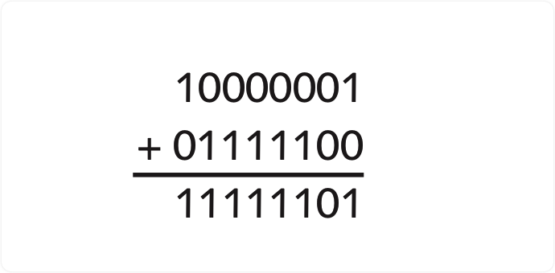

结果等于十进制的-3。

要注意的是，这里涉及了上溢和下溢情况，即结果大于127或小于-128。例如，将125与它自身相加：

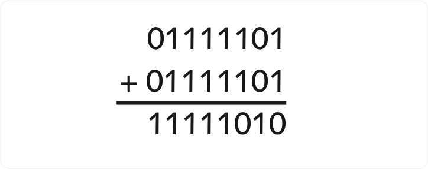

由于最高位为1，结果代表一个负数，相当于十进制的数-6。将-125与它本身相加也会出现同样的情况：

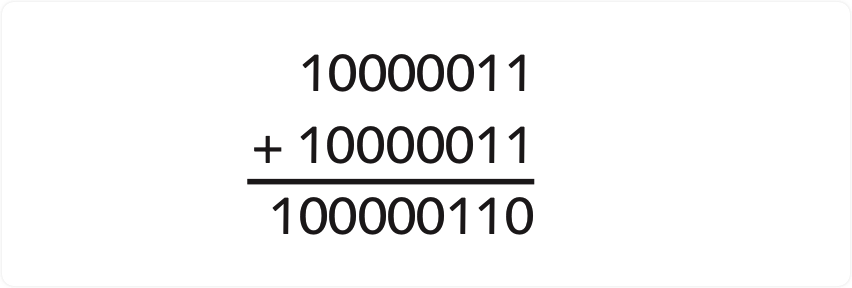

在一开始，我们规定所处理的数值为8位，因此最左位被忽略。右边8位相当于十进制的+6。

一般来说，如果两个操作数的符号相同，而结果的符号与操作数的符号不相同，这样的加法就是无效的。

现在，二进制数可以有两种不同的使用方法。二进制数可以是有符号的，也可以是无符号的。无符号的8位二进制数所表示的范围是0～255。有符号的8位二进制表示的范围是-128～127。无论是有符号的还是无符号的，数字本身是无法显示的。例如，如果有一个人问： "有一个8位二进制数，值为10110110。它相当于十进制的多少？" 你必须先问： "它是有符号数还是无符号数？它可能为 -74 或者 182。" 

这就是二进制数的麻烦之处，它们只是一些 0 和 1，本身并没有任何含义。

