# Code: The Hidden Language of Computer Hardware and Software

编码:隐匿在计算机软硬件背后的语言

- [美] Charles Petzold
- 左飞/薛佟佟

## TOC

- Chapter One: Best Friends (至亲密友)
- Chapter Two: Codes and Combinations (编码与组合)
- Chapter Three: Braille and Binary Codes (布莱叶盲文与二进制码)
- Chapter Four: Anatomy of a Flashlight (手电筒的剖析)
- Chapter Five: Seeing Around Corners (绕过拐角的通信)
- Chapter Six: Telegraphs and Relays (电报机与继电器)
- Chapter Seven: Our Ten Digits (我们的十个数字)
- Chapter Eight: Alternatives to Ten (十的替代品)
- Chapter Nine: Bit by Bit by Bit (二进制数)
- Chapter Ten: Logic and Switches (逻辑与开关)
- Chapter Eleven: Gates (Not Bill) (门)
- Chapter Twelve: A Binary Adding Machine (二进制加法器)
- Chapter Thirteen: But What About Subtraction? (如何实现减法)
- Chapter Fourteen: Feedback and Flip-Flops (反馈与触发器)
- Chapter Fifteen: Bytes and Hex (字节与十六进制)
- Chapter Sixteen: An Assemblage of Memory (存储器组织)
- Chapter Seventeen: Automation (自动操作)
- Chapter Eighteen: From Abaci to Chips (从算盘到芯片)
- Chapter Nineteen: Two Classic Microprocessors (两种典型的微处理器)
- Chapter Twenty: ASCII and a Cast of Characters (ASCII 码和字符转换)
- Chapter Twenty-One: Get on the Bus (总线)
- Chapter Twenty-Two: The Operating System (操作系统)
- Chapter Twenty-Three: Fixed Point, Floating Point (定点数和浮点数)
- Chapter Twenty-Four: Languages High and Low (高级语言与低级语言)
- Chapter Twenty-Five: The Graphical Revolution (图形化革命)

## 译者序

在想到要给《编码——隐匿在计算机软硬件背后的语言》（Code: The Hidden Language of Computer Hardware and Software）写一篇序言的时候，内心就不由得激动起来。能够翻译这部经典之作实属吾辈之荣幸。早在一年多之前，电子工业出版社的编辑跟我提到这本书的翻译之事时，我便有颇大的兴趣。一是由于该书作者Charles Petzold 的鼎鼎大名，二是由于该部作品本身内容之不凡。

作为Windows编程界的一位传奇人物，Charles Petzold 早在1994年就作为仅有的七人之一（并且是唯一的作家）被《视窗杂志》和Microsoft公司授予Windows Pioneer奖。而作为一名世界顶级的技术作家，他的大作Programming Windows则是尽人皆知的Win32 API编程经典，是学习Windows编程的必读之作。令我们欣喜的是，除了Windows程序设计方面的著作，Petzold 还撰写了这部讲述计算机工作原理的书籍，而且同样堪称经典。

本书的翻译过程漫长而又愉快，书中的精彩内容不断给我们以惊喜。Petzold 采用的叙述方式奇特却又如此自然，他首先从历史的角度审视了计算机技术的发展脉络，继而自底向上地将计算机体系结构方面的知识娓娓道来。在Petzold 的笔触下，导线、灯泡以及触发器等简单部件，通过精妙的组装，竟然构建出了一台电子计算机，令我们在翻译的过程中不禁有动手一试的冲动，但总是又被他精彩的笔触所吸引而欲罢不能。Petzold 在这本技术书籍里旁征博引，从美国当红的影评人到百年之前的布莱叶盲文，从史密斯·索尼亚的滑尺到冯·诺依曼的构想，从石破天惊的论文《思维之际》到图形化革命，看似信手拈来，然则处处别出心裁。

这些被有机结合起来的零星知识，仿佛又把我带回了大学的课堂。所涉及的问题包括计算机体系结构、汇编语言及数字电子技术等等。那些已经久远而又模煳的知识骤然间变得异常清晰而且格外生动。这些知识原本只会出现在高校的计算机专业课堂里，令人惊奇的是，尽管遍布于世界各地的本书读者往往有着各不相同的专业背景，而这却丝毫不影响本书内容所带给他们的震撼！

所谓经典，就是历尽岁月的洗涤，依然毫不褪色，然其光彩却历久弥新。我想本书被奉为经典之作当之无愧。

为了能够将该书的精彩原原本本地呈现给广大中国读者，并在保证质量的前提下力争让该书早日与广大读者见面，本书的译者始终秉持着谨慎严肃的态度，对许多词句都推敲再三，力求精益求精。在此期间，我们得到了许多师长和友人的支持与帮助，感激之情溢于言表。特别是南京航空航天大学丁秋林教授，他对我们的翻译工作给予了极大的支持，并欣然为本书提笔作序，在此我们对丁教授表示诚挚的谢意。

参与本书翻译工作的人员还有初甲林、刘悦、高新、高阳、邓明强和赵德志。此外赵学健、欧阳键两位博士也参与了部分章节的审校工作，在此也向他们一并表示感谢。

在本书即将付梓之际，除了激动喜悦之外，译者又多了一份惶恐，尽管我们几经校对，并在翻译过程中始终以谨慎求实的态度对一些技术细节和翻译方式反复讨论，力求表意准确。然而限于时间仓促，纰漏和欠缺之处在所难免，言语之中有失偏颇之处，还望读者不吝赐教和批评。联系信箱：beckham@vip.163.com。

薛佟佟

2009年秋于南京

## 作者序
在真正开始撰写这本书之前，纷繁的思绪在我的脑海中已经萦绕了近十年之久。但从着手写作，一直到出版，我不断反复地问着自己一个问题：这本书是讲什么的？

关于这个问题我总是找不到合适的答案。我想说： "这本书将带领大家通过一段信息技术革命的旅程重新感触现代计算机技术。" 语毕，我内心纠结，这个回答真的将这本书的内容完整诠释出来了吗？

最后我不得不承认： "这本书其实是讲述计算机如何工作的。" 

我之所以有些底气不足，那是因为我已经猜到了某些读者的反应：“嗨，这种书我早就读过了。” 但我会立刻告诉他：“不，这种书你并没有读过。”对于这点，我坚信不疑。因为这本书并不是讲“计算机——如何——工作”。书中并没有用一张又一张描述磁盘的插图，用各种箭头解释数据是如何被输送到计算机的，书里面也没有装载着一节又一节“0，1数据”的“火车”图片。明喻与暗喻是文学描述中精妙的辅助手段，但它们常常掩盖了科学技术的真正光芒。

我还听过另一个说法： "人们不愿意了解计算机如何工作。" 对于这句话我毫无保留地赞同，因为就我个人来说，也是在不经意之间才体会到理解事物如何运作这一过程是多么有趣。但是这并不意味着我对世上一切事物的运作机制都感兴趣，都有所了解，因此我绝对不会在任何场合向大家解释我房间里冰箱的工作原理。

然而与此同时，经常有人向我问起一些涉及计算机内部运行机理的问题。一个常见的例子就是：**‘存储器(storage)’ 与 ‘内存(memory)’ 有何区别?**

对于计算机用户而言，这个问题要是搞不清楚，的确 "寸步难行" ，可以看到，市场上考察个人计算机的存储性能，最主要的就是这两个概念。即便对于最初级的计算机用户来说，他们也一定需要了解到底多少 "兆字节" 或多少 "吉字节" 的存储器才能应对运行在其上的程序。如果进一步去思考，这些初级用户或许更加想了解计算机中的 "文件" 是什么概念，甚至连带这些文件如何从存储器加载进内存，又如何从内存存储到存储器，他们也非常期望学习这些知识。

像这类 "存储器-内存" 问题的解答大都使用模拟法： "内存就好比你的办公桌，而存储器就好比你的文件柜。" 就问题本身而言，它的确给出了满意的回答。但我对此答案并不满意，主要原因在于这个答案将计算机的体系结构与办公室的结构等同起来，**但是内存与存储器的区别其实是在逻辑层面上的，它体现着计算机体系结构的实际需求与存储器客观性能之间的矛盾，简单地说就是我们找不到一种同时具备这两种存储器所有优点的存储媒介，这些优点就包括存储速度块、存储容量大、非易失性等等。今天的计算机都采用 "冯·诺依曼体系结构" ——五十年来它一直是计算机体系结构的主导，而内存与存储器的区分也正是由于这种体系结构的不足所导致的**。

还有一些计算机用户问我这样一个问题： "为什么Macintosh环境下的程序不能在Windows下运行？" 我想立刻回答这个问题，但在我刚刚张开嘴的时候就立刻意识到，这个问题涉及太多的技术细节，要想彻底搞清楚，那提问的这位朋友也一定非准备和我来一次 "茶话会" 不可。

我希望这本书能够成为大家理解这些问题的 "助手" ，这种理解我希望不是抽象层面上的，而是具有一定深度的，这种深度甚至不逊于 "电气工程师" 和 "程序员" 的理解。我同时也非常希望大家能够理解：计算机是二十世纪技术领域的 "登峰造极之作" ，它是一种值得欣赏、具有 "美" 学文化底蕴的人类伟大成果，这种 "美" 不需要明喻与暗喻的额外修饰。

**计算机拥有与生俱来的层次化体系结构，这种结构的底层是晶体管，其顶层则是计算机显示器上所呈现的信息**。自底向上分析该结构的每一层——这也是本书的编写结构——其实这一切并没有人们想象中那么难。当然，现代计算机的内部结构不断推陈出新，但其本质上仍然是一些常见且简捷的操作集合。

尽管今天的计算机比起25年前，以及50年前的都复杂许多，但它们在本质上是完全一致的。**学习技术发展史的重要意义正在于此：追溯的历史越久远，技术的脉络就变得越清晰。因此，我们需要做的就是确定某些关键的历史阶段，在这些阶段，技术最天然、最本质的一面将清晰可见**。

在这本书中，我回溯了自己所能找得到资料的计算机发展史。令我自己也感到惊讶的是，有时竟然一直追溯到19世纪，甚至使用了早期的电报设备来演示计算机是如何构建的。至少从理论角度来看，本书的前17章中提到过的所有设备，都可以利用已经存在了一个世纪的简单电子器件来构造。

这些古董级技术的使用令本书蒙上了一层怀旧的面纱。我要强调的是 **Code** 是这样一本书，它永远不会被命名为诸如 The Faster New Faster Thing 或 Business @ the Speed of a Digital Nervous System。**在这本书中， "bit"  定义在第70页， "byte"  的定义则出现于第186页。晶体管直到第146页才被介绍**，而且只是顺便提及而已。

在对计算机工作原理介绍方面，本书将会一直深入到本质（例如，只有少数书会去介绍计算机处理器的实际工作机制），但整本书的节奏是相对缓和的。在保证内容深度的基础上，我尽量使读者在学习的旅程中保持轻松愉悦的心情。

我最后还是要说，书里面没有那种装载着一节又一节  "0，1数据"  的  "火车"  图片。

Charles Petzold   

2000年8月16日

## Chapter One: Best Friends (至亲密友)

你今年10岁，你最好的朋友就住在街对过。事实上，你们各自卧室的窗户正好彼此相对。每当夜幕降临，父母就如同往常一样，早早地催促你该上床睡觉了，但是你和你的朋友还想交流想法，交换见闻，分享各自的秘密，或者扯扯闲话，开开玩笑，聊聊梦想。这本无可厚非。无论怎样，渴望交流本来就是人类最主要的天性之一。

当卧室里的灯依然亮着的时候，你可以和朋友互相挥手，使用各种手势或简单的肢体语言，来表达一两个想法。但是，要表达复杂的想法可能就比较困难了。而且一旦父母宣布 “关灯”，这种交流似乎也不可能继续下去。

如何交流呢？或许可以打电话？10岁小孩的房间里会有电话吗？即使有，无论电话在哪里，你们的谈话都有可能被偷听。如果你家里的电脑连接了电话线，它可能帮上忙，而且不会发出声响，但是——等等，电脑也不会在你的房间里。

你和朋友所采用的方法就是使用手电筒。众所周知，手电筒是为了让孩子们能够躲在被子下看书而发明的；在天黑后用手电筒来交流信息似乎也是理想的选择。它们当然是很安静的，并且光线是高度定向的，同时光线也不会渗漏出卧室而引起家人的疑心。

手电筒能用来交谈吗？这当然值得一试。我们在一年级的时候学习怎样在纸上写字母和单词，因此，把同样的方法运用到手电筒上似乎也是有道理的。只需要站在窗户边，用光来画出字母。对于字母 “O”，打开手电筒，在空气中划一个圈，然后关掉手电筒。对于字母 “I”，竖着划一下。但是，你很快就会发现，这个方法也不太行得通。当你看着朋友的手电筒在空中圈圈点点时，会发现很难在头脑中组合出那么多复杂的笔画。这些旋转和倾斜的光线都太不准确了。

或许大家都曾经在电影里看到这样的情节，两个水手在海上通过灯的亮灭来互相发送信号。而在另一部电影里，一个间谍转动一面镜子将太阳光反射到另一个房间里，从而向被俘的同伙传递信息。或许那正是解决问题的办法。如此一来，你就可以发明一种简单的技术。在这个方案里，字符表里的每个字符对应一连串的手电筒闪烁。“A” 是闪一次，“B” 是闪两次，“C” 是闪三次，依此类推， “Z” 就是闪 26 次。单词 BAD 可以用闪 2 次，闪 1 次，闪 4 次这样的一个组合来表示，而且在字符之间设置的小停顿使这个单词不至于被误认为是闪 7 次的字母 “G”。另外，单词之间停顿可以稍长些。

这似乎很有希望，采用这种方案的好处是你不必在空中比划手电筒了，只要对准方向和按开关就行了。但是这种方案也有一个不足，那就是如果你想发送的第一个消息是 “How are you？”，那么你将总计需要让手电筒闪131次！而且，这还是忽略了标点符号的，你还没有设计闪多少次来对应一个问号。

但是这已经离答案更近一些了。我们能够肯定的是，在此之前一定有人也遇到过类似的问题，而你解决这个问题的思路也是非常正确的。等到了白天，跑一趟图书馆，查查资料，你发现了一个被称为**莫尔斯电码 (Morse Code)**的伟大发明。这正是你想找的，尽管你现在必须重新学习如何去 “写”字母表里的字母。

它们的不同之处在于：在你发明的系统里，字母表里的每个字母就是用一定数目的闪光表示的，闪 1 下为 “A”，闪 26 下为 “Z”。而在**莫尔斯电码里，则有两种闪烁——短闪和长闪**。当然这使得莫尔斯电码更加复杂，但是在实际应用里它被证明是更为有效的。句子 “How are you?” 现在只要闪 32 下（包含一些短闪和一些长闪），而不再是131 下，而且这其中还包括了一个代表问号的编码。

当问及莫尔斯电码是如何工作的时候，人们并不会谈论 “短闪”与 “长闪”。相反，**他们使用 “点（dot）”和 “划（dash）”**，因为这是在打印纸上显示编码的一个便利方法。在**莫尔斯电码里，字母表里的每个字母都与一个点划序列相对应**，正如下表所示。

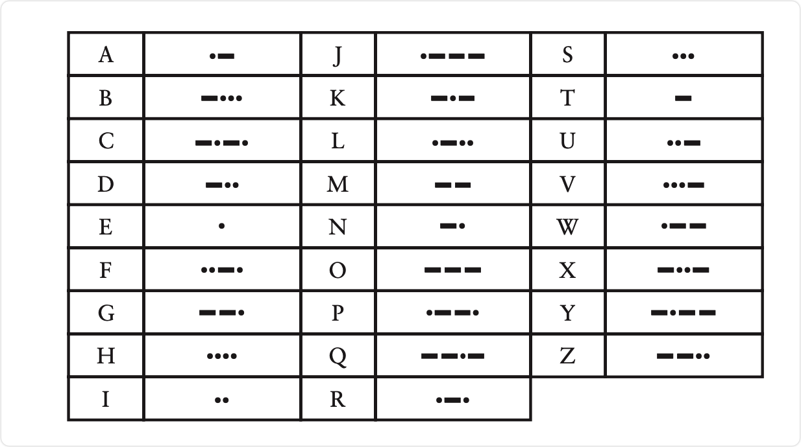

Additional Info: 下图来自维基百科。

>

虽然莫尔斯电码和计算机毫无关系，但是，熟悉编码的本质对于深入理解计算机软硬件内部结构以及隐匿在其后的语言将大有裨益。

在这本书里，编码这个词的意思是指一种用来在机器和人之间传递信息的方式。换句话说，编码就是交流。有时候我们认为编码就是指秘密的东西（密码）。但是大部分编码不是这样的。毕竟，大部分编码必须易于理解，因为它们是人类交流的基础。

在《百年孤独》这本书的开篇里，加西亚·马尔克斯回忆了一个时代，那时 “这个世界刚刚出现，以至于很多东西缺乏命名，这时就有必要亲自用手指明这些事物”。我们赋予这些东西名字时往往是很随意的。这就好比说为什么猫不被叫做 “狗”而狗不被叫做 “猫”一样，没有什么理由可言。你可以说英语词汇就是一类编码。

对任何能听见我们的声音并理解我们所说的语言的人来说，我们发出的声音所形成的词语是一种可识别的编码。我们将这个编码称为 “口头话语（the spoken word）” 或 “言辞（speech）”。对于写在纸上（或刻在石头上、木头上，或者在空气中比划）的词，我们还有其他的编码方式。这种编码以手写字符或打印在报纸、杂志以及书本上的字符形式出现。我们叫它 “书面语言（the written word）” 或 “文本（text）”。在许多语言里，语言和文字之间存在着很紧密的联系。例如，英语中的字母和字母组合与它们的发音（或多或少）存在一定的对应性。

对于那些丧失听说能力的的聋哑人而言，人们发明了另一种编码来帮助他们进行面对面的交流。这就是手语。手语通过手和臂膀形成的动作和姿势来传达词语中的单个字符或者整个词语，以及基本的概念。对于那些失明的人，书面语言可以用布莱叶盲文（Braille）来替代。这种文字使用一系列凸起的点来代表字母、字母串以及整个单词。当话语必须快速抄成文本时，缩写和速记都是很有用的。

我们使用各种不同的编码来为我们自己的交流服务，因为有些编码有时比其他编码更便捷。例如，话语的编码不能存储在纸上，因此，书写的编码就被用来替代话语的编码。如果在黑暗的环境下，而且交流的双方之间有一定的距离，那么通过讲话或者文字来进行秘密的信息交换几乎是不可能的，因此，莫尔斯编码就成了一个方便的选择。如果一种编码可以用在其他编码无法取代的地方，那么它就是一种有用的编码。

我们将会看见，各种类型的编码也用在计算机里来存储和传递数字、声音、音乐、图片和电影。计算机不能直接处理人类的编码，因为计算机无法通过与人类的眼睛、耳朵、嘴巴和手指完全相同的方式来接收人类发出的信息。然而，计算机技术的一个最新趋势，已使得我们的个人计算机能够获取、存储、处理和呈现一切用于与人类沟通的信息，无论视觉信息（文字和图片），还是听觉信息（口语、声音和音乐），或两者的相结合（动画和电影）。所有这些类型的信息都需要它们各自的编码，就像人类说话需要一套器官（嘴和耳朵）而写作和阅读需要另一套（手和眼）一样。

甚至前面所列的莫尔斯编码表，其本身就是一种类型的编码。在这个表中，每个字母由一系列的 "点" 和 "划" 来表示。然而实际上我们不能发送 "点" 和 "划" ，相反，我们发送与 "点" 和 "划" 对应的闪烁光。

当使用手电筒发送莫尔斯编码时，迅速地打开和关闭开关代表一个 "点" （快闪），让闪光时间保持得相对长一些代表 "划" （慢速闪光）。例如在发送字母A时，首先以非常快的速度打开并关闭手电，然后再以稍慢的速度进行一次。在发送下一个字符前，需要暂停一会。**在此约定，一个 "划" 的时长是 "点" 的 3 倍**。例如，如果一个 "点" 的时长是 1 秒钟，那么一个 "划" 的时长就应当是 3 秒钟。（在现实中，莫尔斯编码的传输速度远比这要快得多）。接收者看到一个短促的闪烁和一个拖长的闪光后，就知道这是一个 A 了。

**在莫尔斯编码中， "点" 和 "划" 之间的停顿是至关重要的**。例如，当发送一个字母 A 时，在发送的 "点" 和 "划" 之间，手电筒要关闭一段时间，这相当于一个点的闪烁时长（**如果 "点" 的时长是 1 秒钟，那么 "点" 和 "划" 之间的停顿也应该是 1 秒钟**）。**对于同一个单词中的字母，则通过较长的停顿来分隔，这大约相当于一个 "划" 的时长（或者说是 3 秒钟，如果一个 "划" 的时长就是 3 秒钟的话**）。下图以 "hello" 的莫尔斯编码为例，说明字母之间的停顿（间隙）。

> 1. 一点的长度是一个单位。(The length of a dot is one unit.)
> 2. 一划的长度是三个单位。(A dash is three units.)
> 3. 在一个字母中点与划之间的间隔是一点。(The space between parts of the same letter is one unit.)
> 4. 两个字母间的间隔是三点（即：一划）(The space between letters is three units.)
> 5. 两个单词之间的间隔是 7 点。(The space between words is seven units.)

单词之间则通过相当于两个 "划" 的时长来分隔（如果一个 "划" 的时长为 3 秒钟，那么这个停顿就应当为 6 秒钟）。例如下图是 "hi there" 所对应的编码。

- NOTICE: 书上说两个单词的间隔是 2 划，也就是 6 点，但维基百科上说两个单词之间的间隔是 7 点。 

手电筒开和关的时长并没有限定。它们都与一个 "点" 的时长相关，而这依赖于手电筒开关能以多快的速度扳动，以及莫尔斯编码的发送者能以多快的速度记下一个指定字符。对于一个快速发送者，他的 "划" 的时长，也许只相当于一个慢速发送者的 "点" 的时长。这会带来一个小问题，即阅读莫尔斯编码信息会变得很困难，但是经过一两个字母之后，接收者通常就可以分清楚哪一个是 "点" ，哪一个是 "划" 了。

乍一看，莫尔斯编码的定义与打字机字母的排列一样都是随意的。这里的定义是指字母表中的字母与各种 "点" 和 "划" 的组合序列之间的对应关系。然而，仔细研究之后，我们就会发现事实并非完全如此。简单且短促的编码，被分配给字母表中使用频率较高的字母，例如 E (一点) 和 T (一划)。拼字比赛选手和 "幸运轮" 的粉丝们可能会很快意识到这一点。而不太常用的字母，比如 Q 和 Z（这只会让选手在拼字中得到 10 分）则被分配以较长的编码。

几乎每个人都知道一点儿莫尔斯编码。三个点、三个划，再加三个点就表示SOS，即国际求救信号。SOS不是一个缩写，这只是一个易于记忆的莫尔斯编码序列。在第二次世界大战期间，英国广播公司一些无线电广播以贝多芬第五交响曲的片段来作为节目的前奏——BAH，BAH，BAH，BAHMMMMM，而贝多芬绝不会想到他所谱写的这段乐曲可以表示为莫尔斯编码的V，即胜利（Victory）之意。

莫尔斯编码的一个缺点是，它没有区分大写字母和小写字母。但是除了可以代表字母外，莫尔斯编码还使用一组由点和划组成的五元序列来表示数字，如下所示。

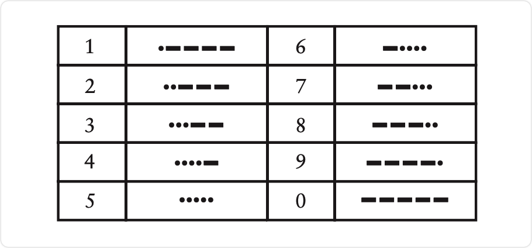

这些编码至少比字母编码更有规律一些。大部分标点符号由 5 个、6 个或者 7 个 "点" 和 "划" 的组合序列来表示，如下所示。

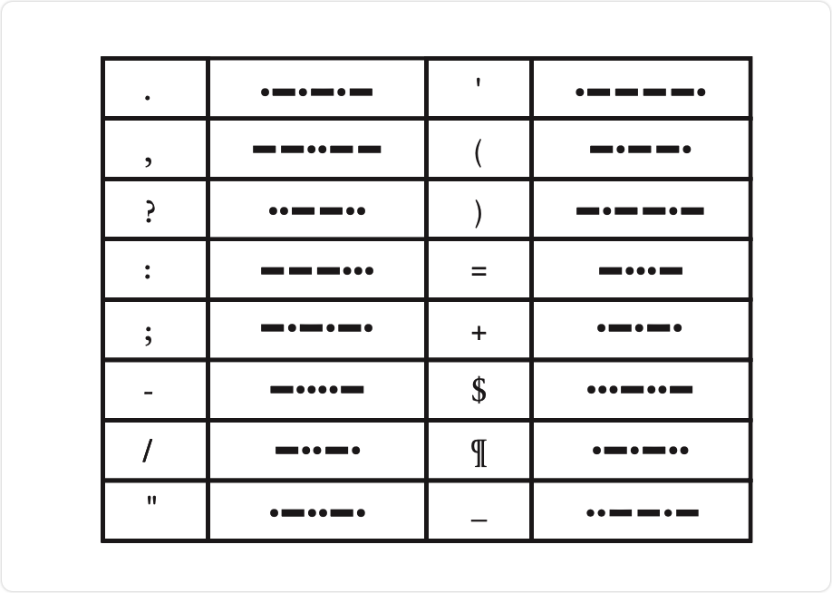

还有一些编码则用来表示某些欧洲语言中的重音字母，以及用于特殊目的的速记序列。如 SOS 的编码就是这样的一个速记序列：必须连续地传递这三个字母，而且字母之间只有一个点的停顿时间。

如果有一个专门为此设计的手电筒的话，你会发现和朋友之间通过莫尔斯编码交流将变得更加简单。除了一个可以滑动的开关外，这种手电筒还有一个按钮开关用来控制灯光的明灭。在一些实际应用中，可以达到每分钟传递5到6个单词的速度——虽然这仍比讲话慢得多（讲话的速度在每分钟100个单词左右），但这已经足够了。

当你和朋友最终熟记了莫尔斯编码之后（这是能熟练地收发编码的唯一方法），你们甚至可以在口语中使用它，用来取代正常的语言。为了使编码发送的速度最快，你可以把 "点" 读作 "嘀（dib）" ，把 "划" 读作 "嗒（dab）" 。文字也可以用同样的方式简化成 "点" 和 "划" 的序列，莫尔斯编码的口语版把讲话内容缩减到只剩下两个声音了。

问题的关键就在于数字 2。两种闪烁，两种声音。事实上，两个不同的事物，只要经过适当的组合，就可以表示所有类型的信息，这的确是千真万确的。

## Chapter Two: Codes and Combinations (编码与组合)

莫尔斯码（Morse Code）是由塞缪尔·莫尔斯发明的（1791-1872），在本书的其他章节中我们还将频繁地提到他。莫尔斯码其实是伴随着电报机的问世而被发明的，关于电报机，我们在后面也将做详细的探讨。正如通过研究莫尔斯码我们可以很方便地理解编码的本质一样，通过电报机来了解计算机硬件也是个不错的途径。

大多数人都会发现莫尔斯码的发送比接收更为简单。即使你并没有熟记莫尔斯码，也可以很方便地使用下面这张按字母表顺序排列的表格。

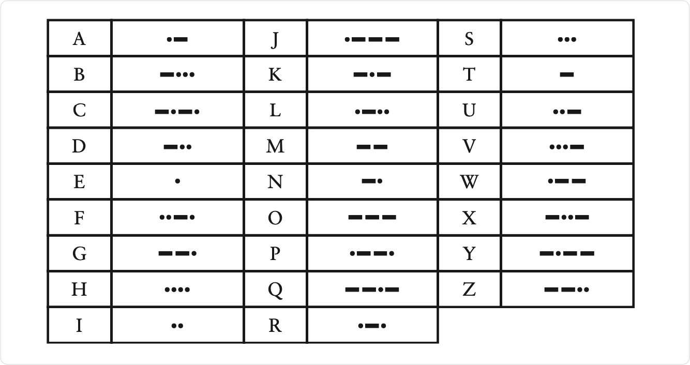

比起发送莫尔斯码，接收编码并进行解码要费时费力得多，因为译码者不得不根据一串由 "点" 、 "划" 组成的晦涩的编码序列来反查字母。例如，如果你接收到一串形如 "划-点-划-划" 的编码，那么你就必须从表的第一个字母开始逐个搜寻，直到找到与这串编码相符的字母 "Y" 为止。

问题就出在这里，因为我们现在只有一张提供 "字母→莫尔斯码" 的编码表，而缺少一张可以实现反向查询的 "莫尔斯码→字母" 译码表。在开始学习莫尔斯码的初级阶段，如果有这样的一个表无疑将是很方便的。但是要创建这样一张表，谈何容易。似乎这些字母对应的 "点-划" 序列并没有什么规律。

所以忘掉字母序列吧。或许根据编码中所包含点、划的多少来对其进行分组，是一个更好的组织这些编码的方法。例如，一个仅包含一个点或一个划的莫尔斯码只能代表两个字母： "E" 或 "T" 。

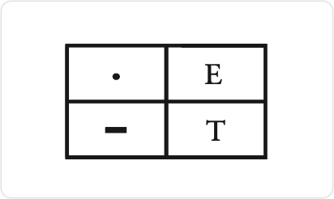

一组含有 2 个点或划的编码组合，可以给我们呈现出 4 个字母——I，A，N和M。

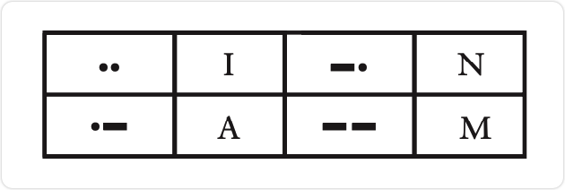

一组含有3个点或划的莫尔斯码可以为我们表示更多的字母。

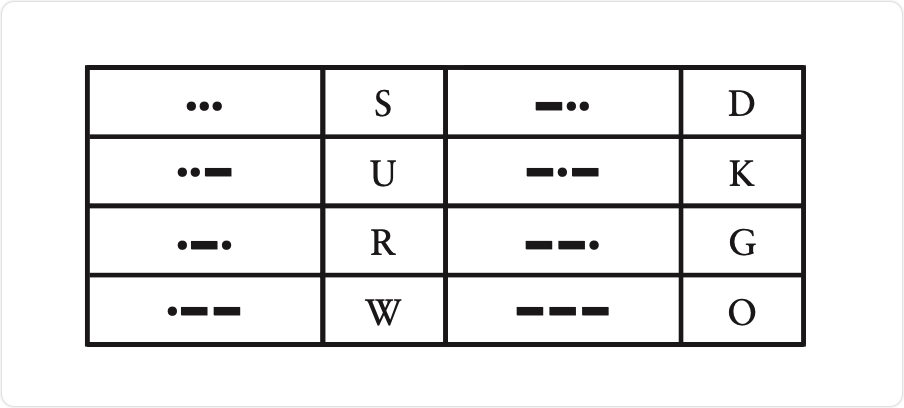

最后（如果我们不想考虑存在数字和标点符号的莫尔斯码的情况），一串由 4 个点或划组成的莫尔斯码就可以表示 16 个字符。

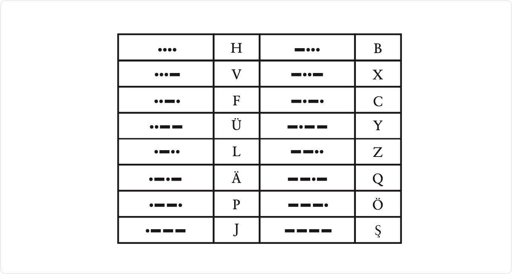

综合以上数据来看，这四张表包含了 2 ＋ 4 ＋ 8 ＋ 16 组码字，总共表示了 30 个字母，比拉丁字母表的 26 个字母还要多出 4 个。所以，你会注意到最后一个表中有 4 组编码是用来表示重音字母的。

当有人给你发送莫尔斯码的时候，上述四张表可能会让你的解码工作变得轻松很多。当接收到某一代表特定字母的码字后，你就可以知道其中所包含的 "点" 和 "划" 的数目，那么你至少可以很快找到对应的表格去进行查找。每个表格都组织得很规整，全部是 "点" 的码字被排在左上角，而全部是 "划" 的则被排在右下角。

你发现这四张表格在大小上的规律了么？注意看，每个表格所包含的码字数目都是前一张的两倍。这其实很好理解：每个表格所含有的码字，可以看成是在前一张表格所包含的全部码字上再加一个 "点" ，或者再加一个 "划" 而组成的新码字。

我们可以用如下这样一个列表来总结这个有趣的规律。

在这四个表中，每张表的码字数都是前一张表码字数量的两倍，因此如果第一张表含有2个码字，那么第二张表则含有2 × 2 个码字，而第三个表就有 2 × 2 × 2 个码字。下面用另一种方式呈现这个规律。

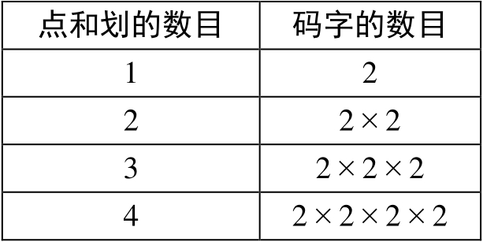

当然，如果我们遇到了数字的自乘，就可以通过幂的方式来表示它。例如，2 × 2 × 2 × 2 可以记作  $2^4$（2 的 4次幂）。数字 2、4、8 和 16 都是以 2 为底数的幂值，因为你可以通过使其自身乘 2 来得到它们。由此我们的总结列表也可以写成下面这种样子。

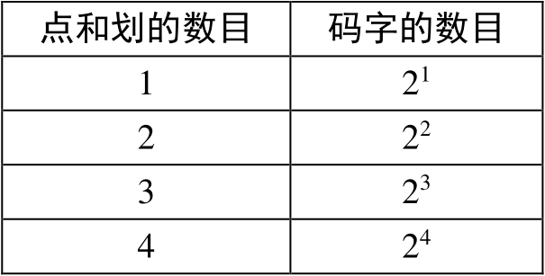

现在这个表已经变得很简洁了。如果知道了码字中 "点" 和 "划" 的数目，那么以这个数目为指数的 2 的幂运算结果就是其总共可以表示的码字数。我们可以用下面这个简单的公式来概括上述表格所表示的内容：

码字的数目 = 2 "点" 和 "划" 的数目

使用 2 的幂值的形式可以表示很多码字，在下一章中，我们还将接触另外一个例子。

为了让莫尔斯码的解码过程更加简单，或许画张图会有所帮助，例如下面这张树型图。

这张图给出了所有字母及其所对应的由 "点" 和 "划" 组成的连续序列。当对一串码字进行解码时，我们需要沿着箭头从左向右进行搜寻。以 "点-划-点" 的码字为例来说，当你需要找出这串码字所代表的字母时，应首先从图的左边开始，选择 "点" 的分支；然后继续沿着箭头向右选择 "划" ，接着又是一个 "点" 。找到最后一个 "点" 时结果就会紧随其后出现了，没错就是字母 "R" 。

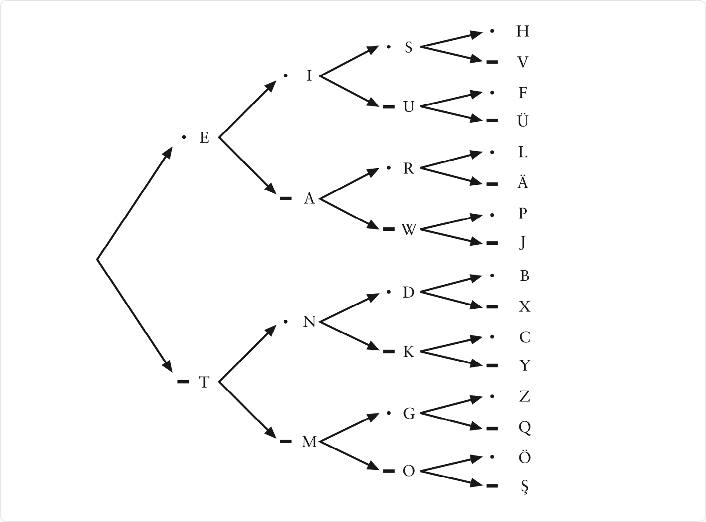

如果仔细想一想，你就会发现构建这样一个表对于定义莫尔斯码规范来说是很必要的。首先，它确保了我们不会对不同的字母定义相同的码字。其次，通过这个表我们可以用尽可能短的码字来表示所有的字母，而避免产生编码长度上的浪费。

我们可以继续加长码字至 5 位或者更长，不过这可能超出页面打印边界。一串由 5 个 "点" 或 "划" 组成的编码串可以为我们提供 32（2 × 2 × 2 × 2 × 2，或 25）种扩展的码字。对于莫尔斯码中定义的 10 个数字和 16 个标点符号来说，通常这已经足够了，而实际上数字确实就是使用 5 位的莫尔斯码来表示的。但是在很多其他编码方式中，5 位码字常用来表示重音字母而不是标点符号。

为了把所有的标点符号也都包含进去，编码系统必须要扩展到 6 位了！扩展后将为我们提供 64（2 × 2 × 2 × 2 × 2 × 2，即26）种新增的码字，这样总共的码字就达到了 2 + 4 + 8 + 16 + 32 + 64，也就是 126 种！这对莫尔斯码来说有点太多了，甚至还留下了很多 "未定义" 的码字。这里 "未定义" 用来表示那些不代表任何字符的码字。如果你在接收莫尔斯码的时候收到了一个未定义码字，可以肯定发送方一定是出了差错。

我们很容易就能得到这样一个小公式：

码字的数目 = 2编码的位数

利用它就可以继续计算出更长位数的点划序列所能表示的码字数目了。

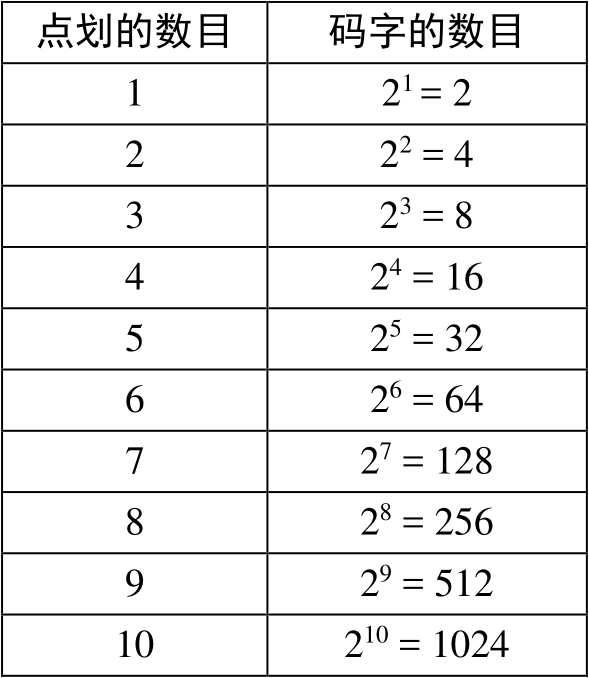

幸运的是，我们并不需要写出所有可能的码字来计算码字的总数目。我们需要做的只是让 2 不断地与自己相乘。

**莫尔斯码也被称作二进制码（Binary Code），因为这种编码的组成元素只有两个—— "点" 和 "划" 。这跟硬币有些类似，因为硬币落到地上只能是正面朝上或反面朝上。二元对象（例如硬币）和二进制码（例如莫尔斯码）常常使用 2 的乘方来进行描述。**

上面所做的关于二进制编码的分析工作，其实是数学的一个分支，称作 "组合学" 或 "组合分析" ，而我们所作的分析则只能说是一个简单的练习。传统意义上来说，因为组合分析涉及类似像扔硬币、掷骰子这样的需要对其组合数目进行推算的问题，所以它经常被应用到概率和统计学中。但是它对于我们理解码字的组合与分解也是十分有帮助的。

## Chapter Three: Braille and Binary Codes (布莱叶盲文与二进制码)

塞缪尔·莫尔斯并不是第一个将书面语言的字母成功编码的人。实际上，在因自己的名字被用来命名某种编码方式而名声大噪的人中，莫尔斯先生也不是第一人。这项荣誉应该归一个法国盲人小伙子所有。尽管他比莫尔斯要晚出生18年，但是他很早就创建了自己的编码规范。他的生平鲜为人知，尽管关于他的故事流传至今的为数不多，但这也足以构成一个引人注目的传奇。

刘易斯·布莱叶（Louis Braille）于 1809 年生于法国的库普雷，这是一个距离巴黎市东只有25英里的小镇。布莱叶的父亲是一个马具匠人。在布莱叶3岁的时候——一个本不该在父亲的工作间玩耍的年纪——他不小心被一个尖锐的工具刺伤了一只眼睛。伤口感染也影响到了他的另外一只眼睛，最后使他的双目完全失明。按常理，布莱叶将在无知和贫困当中度过自己的一生（就像当时大部分盲人那样），但是小刘易斯对知识的渴望和过人的智慧很快被人们所发现。他最初同其他孩子一样在镇上的小学上学，后来在他 10 岁的时候，在小镇牧师和一名学校老师的帮助下，布莱叶被送往巴黎皇家盲人学校学习。

很显然，盲人教育中一个主要的障碍就是盲人无法阅读印刷的书籍。瓦伦丁·霍伊（1745-1822），巴黎皇家盲人学校的创始人，曾发明过一种在纸面上印下凸起文字的系统，这样盲人就可以通过触摸的方式来进行阅读了。但是这种文字系统使用起来很困难，而且使用这种方法来印刷的书籍也非常少。

霍伊先生视力健全，因此他被自身的感知模式所禁锢。对他来说，一个字母 A 就是一个 A，而且字母 A 在记录时也必须看起来（或者感觉起来）像一个 A（如果让他用手电筒交流的话，估计他会像我们最开始所做的那样，试图在空中比划出要表达的字母，但其实我们发现这法子根本不灵）。霍伊先生或许没有意识到，有一种完全不同于印刷字母的文字系统可能更加适合盲人阅读。

这种非常规编码方式的起源说出来可能有些出人意料。查尔斯·巴比尔（Charles Barbier），法国军队的一位军官，在1819年发明了一种他自称为 "écriture nocturne" （也叫 "夜间书写" ）的文字系统。他在厚纸上使用凸起的点和划的组合来表示文字，这样当部队需要无声交流的时候，即使光线很暗，士兵们也可以通过这些符号互相传递信息。他们使用一个锥形的铁笔在厚纸的背面书写，这样纸的正面就会有相应的凸起。然后人们就可以使用手指触摸这些凸起的点和划来进行阅读了。

巴比尔文字系统的缺点是太过复杂了。该系统并非使用与字母表相对应的点划编码串来表示字母，而是用与读音相对应的编码串表示，因此有时仅仅是为了表示一个单词，就不得不使用很多的码字。如果只是传递简短的消息，这个系统用起来倒还不错；但是在表示长文本的时候，就明显力不从心，就更别说用来对整本书进行编码了。

布莱叶在12岁的时候就很熟悉巴比尔的这种文字系统了。他特别喜欢使用凸起的点，不仅仅因为凸起的点通过手指就可以很容易实现阅读，还因为它们 "写" 起来也很简单。在教室里，一个盲人学生如果有了纸张和铁笔，他就可以做笔记，而且同时还能阅读记下来的文字。刘易斯·布莱叶开始不辞辛劳地改进这个文字系统，3年以后（那时他15岁）就创建成了自己的系统，而这个系统中的一些基本规范，直到今天仍在被人们所使用。在很长一段时间内，这种新的文字系统只被他们学校内部的人们所熟悉，但是渐渐地，布莱叶盲文传播到了世界的各个角落。1835 年，刘易斯·布莱叶患上了肺结核。1852 年，就在布莱叶 43 岁生日刚过完不久，病魔无情地夺走了他的生命。

如今，在引导盲人进入文字殿堂的道路上，改进后的布莱叶盲文系统与磁带录音书进行着竞争，但是布莱叶盲文仍然是不可替代的工具，特别是对于又聋又盲的人来说，布莱叶盲文仍然是他们打开阅读大门的唯一钥匙。近些年来，布莱叶盲文被越来越多地应用到公共场所中，使得盲人朋友们可以越来越方便地使用电梯、自动取款机等设备。

在这一章中我们将解析布莱叶盲文，来看看它是如何工作的。我们并不是要真的学习布莱叶盲文，而且也无须刻意记住什么关于它的内容。我们仅仅希望从中窥探到编码的一些本质。

在布莱叶盲文中，每个在书写文字中用到的符号——具体来说就是字母、数字和标点符号——都被编码成为 2 × 3 的点码单元中的一个或者多个凸起的点。这个点码单元包含的点通常使用1到6的数字来编号。

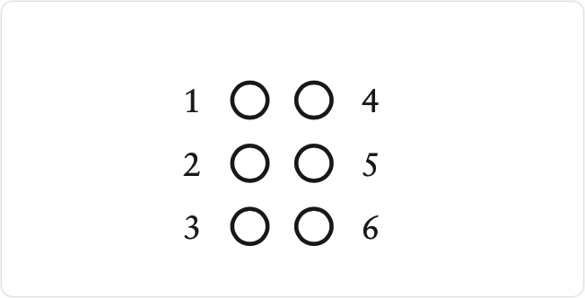

在现代应用中，使用特殊的打印机或轧花机可以将布莱叶盲文印到纸张上。

即使只是用布莱叶盲文在本书中印上几页，造价也实在是有点儿高，所以我在书中使用一种符号来表示布莱叶盲文。在这种表示方法中，点码单元中所有的6个点都会被表示出来。大点表示这是一个凸起的点，小点则表示其对应的位置是平的。例如，下面的布莱叶盲文：

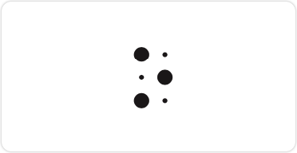

其中，第1，3，5点是凸起的，而第2，4，6点的位置是平的。

令我们感兴趣的是，这些点码都是二进制的。一个单独的点不是平的就是凸起的。也就是说我们可以把在莫尔斯编码中学到的知识应用到布莱叶盲文的分析中！我们现在已经知道，每组有6个点，并且每个点有平和凸两种状态，因此6个可平可凸的点的组合数就是 2 × 2 × 2 × 2 × 2 × 2，即 26，也就是 64。

因此，布莱叶盲文系统能够表示 64 个不同的码字。下图就是所有可能的 64 种码字。

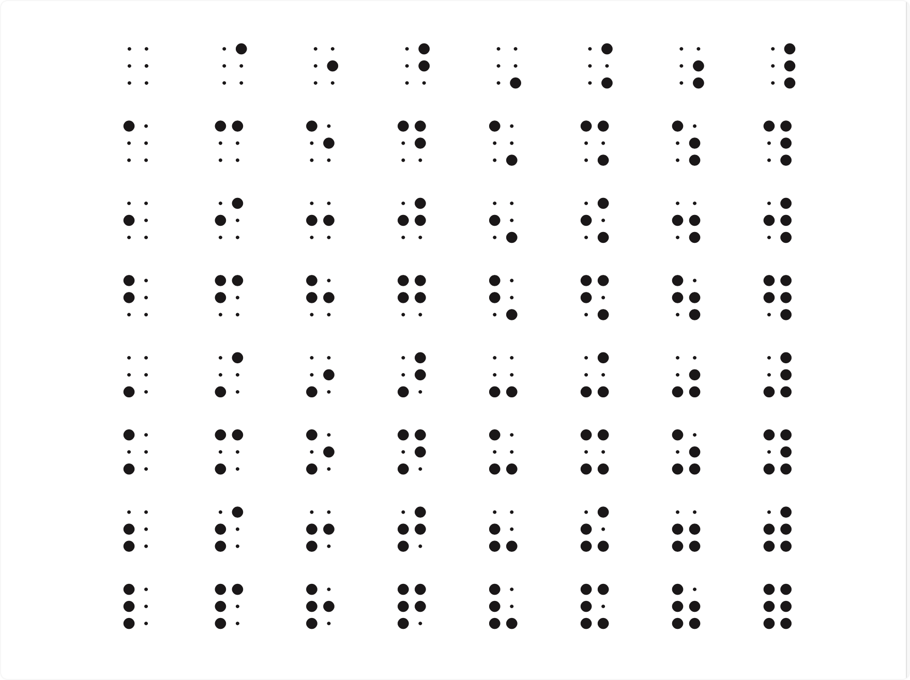

假如我们发现布莱叶盲文中用到的码字数目少于64，我们可能就会问，为什么 64 个可能的码字中有一些被遗弃不用呢？假如我们发现布莱叶盲文中用到的码字数目超过 64，问题就更严重了，我们会怀疑自己的智商，甚至怀疑基本的数学原理——到底 2 加 2 是不是等于 4。

还是让我们来开始解析布莱叶盲文吧，首先看看基本的小写字母表。

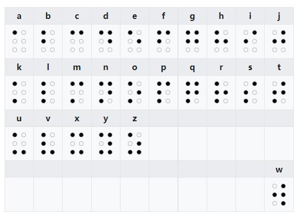

或

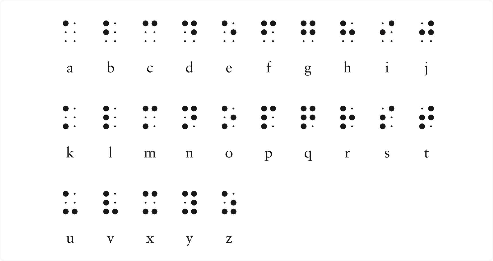

例如，词组 "you and me" 用布莱叶盲文表示成如下组合：

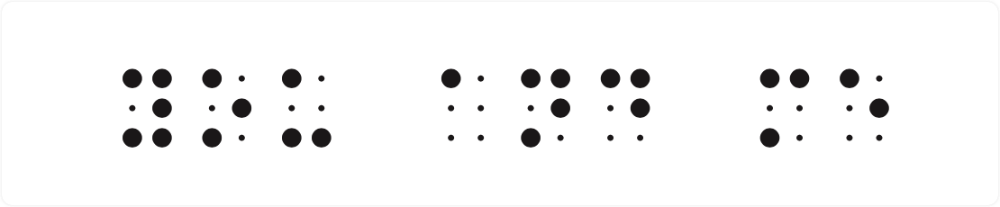

**注意，一个单词中每个字母所对应的点码单元之间都用一小块空白分开；而单词之间则用一个大的空格（实际上是没有凸点的点码单元）所分隔开来。**

这就是刘易斯·布莱叶制订的布莱叶盲文的基本规范，至少它对于拉丁字母很适用。布莱叶还制订了表示重音符号字母的编码，这在法语中要经常要用到。注意这里没有 "w" 这个字母的编码，因为在传统的法语中不会用到它（别担心，这个字母最后会出现的，下文将作讲解）。到此为止，64 个码字中只使用了 25 个。

经过仔细的检查，你会发现，**从我们列举的那个三排布莱叶盲文的例子（小写字母表）中，可以总结出一个规律。第一排（字母 a 到 j）只用到了点码单元中最上面的四个点——第1、2、4 和 5 点。第二排在复用了第一排的编码的基础上，把第 3 点改为凸点。第三排也沿用了同样的规律，只是将第 3 和 6 点改为凸点。**

自从刘易斯·布莱叶发明布莱叶盲文以来，其应用已经扩展到各个领域。目前在英文出版物中最常用的盲文系统被称为二级布莱叶盲文（Grade 2 Braille）。二级布莱叶盲文使用了很多缩写，以便于保存树型结构和提高阅读速度。例如，如果字母的码字单独出现，它们就表示一个普通的单词。以下三排图样（包含 "完整的" 第三排）为我们展示了这些单词的码字。

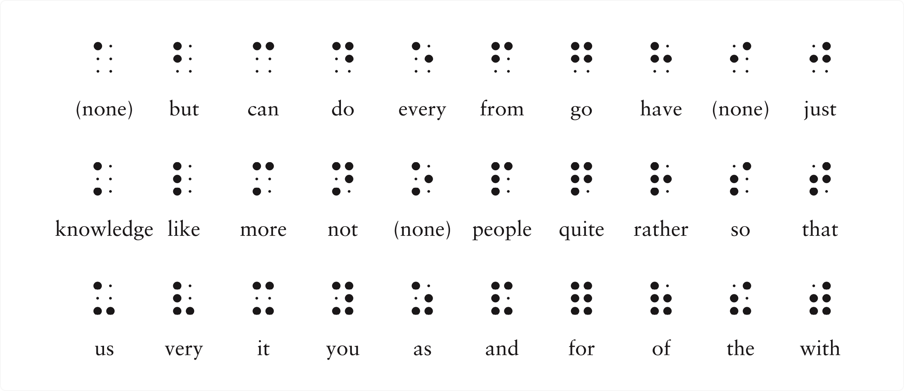

因此，短语 "you and me" 使用二级布莱叶盲文就可以表示为：

到目前为止，我们已经描述了 31 个码字——单词间的大空格（即没有凸点的点码单元）以及总共3排每排10个的字母和单词码字。与理论上可以达到的最多码字数—— 64 相比，我们还差得远呢。正如从下面的分析中我们将看到的那样，在二级布莱叶盲文里，没有任何的码字会被浪费。

首先，我们可以使用字母a到j的码字加 6 号凸点的组合。这些新码字通常用来表示单词中字母串的缩写，还有我们前面所担心的 w 字母（像上文的二级布莱叶盲文单词编码一样，表示 w 字母的编码也可以表示一个单词）。

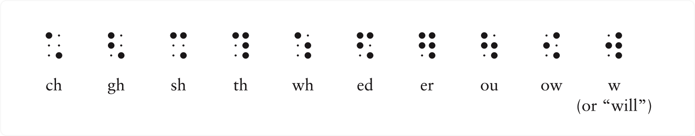

例如，单词 "about" 使用二级布莱叶盲文可以记作：

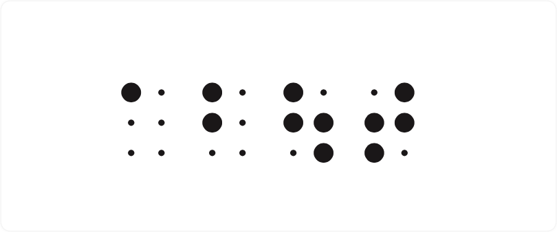

然后，我们取从 a 到 j 的码字， "降低" 它们使用的点位，只用到编号为 2、3、5 和 6 的点，这样就得到了新的码字。根据上下文环境，它们将被用来表示一些标点符号或者字符串缩写。

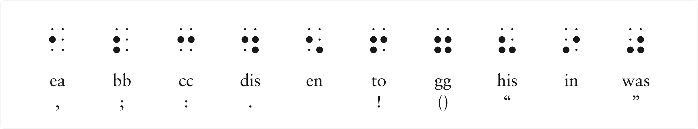

前 4 个码字分别表示逗号、分号、冒号和句号。需要注意的是，左右括号使用的是相同的码字，但是开闭引号使用的却是不同的码字。

目前为止我们已经定义了 51 个码字了。 "占用 3、4、5 和 6 号点" 的码字还有很多组没有被定义，下面的 6 组就是这些被遗漏的码字，我们也用它们来表示一些字符串缩写和其他的标点符号。

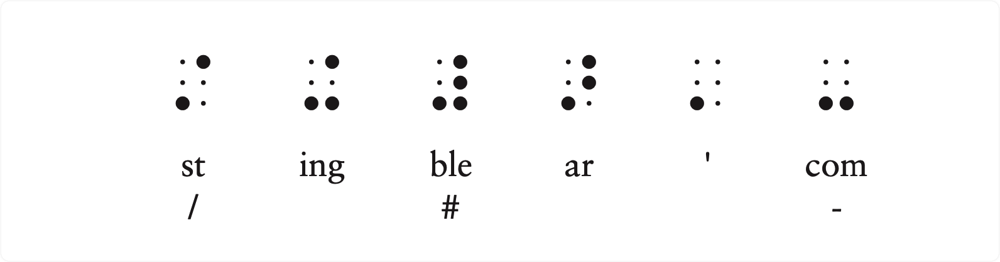

**表示字符串缩写 "ble" 的码字很重要，因为当它不是用来作为单词的一部分时，它的出现就意味着之后的码字应被译为数字。表示数字的码字与表示字母 a 到 j 的码字是相同的。**

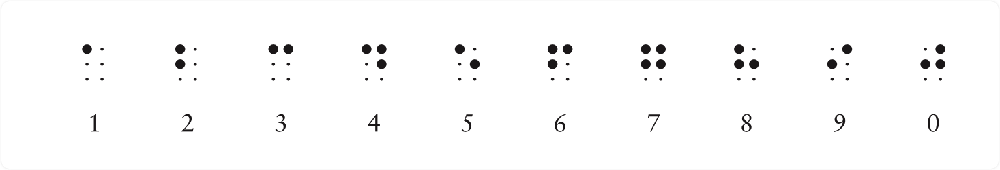

因此，下面这组编码：

表示的就是数字 256。

如果你还要继续下去，那么我们还需要定义7个码字才算完全用满原有的 64 个码字。它们是：

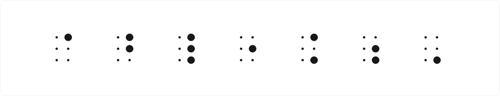

第一个码字（4号点凸起）用来表示音调符号（accent indicator）。其他的码字则用来表示缩写的前缀或者其他的功能：

上表的第 5 个码字，根据上下文用来表示小数点或者强调符号（emphasis indicator）。

第 6 个码字，表示与 "数字标识符" 相对应的 "字母标识符" （letter indicator）。

**最后，我们还有 6 号凸点——大写标识符**。**这个符号表示跟随它的字母大写**。例如，我们可以把这套文字系统的原创者的名字(刘易斯·布莱叶(Louis Braille)) 记做：

这串编码分别表示了一个大写字母标识符、字母 l、缩写字符串 ou、字母 i 和 s，以及一个空格，再加一个大写字母标识符，还有字母 b、r、a、i、l、l 和 e。（在实际应用中，可能会把名字末尾不发音的 2 个字母省略掉，以进一步压缩编码）

综上所述，我们将 6 位二进制码（其实是6个点）所能表示的全部64种可能的编码都罗列了一遍。而且这 64 组编码中有很大一部分，根据上下文的不同将有着双重身份。**尤其值得注意的是数字标识符和取消 "数字标识状态" 的字母标识符。它们改变了后面编码的意义——从表示字母到表示数字，又从表示数字回到表示字母。像这样的编码通常被称作 "优先码" （precedence codes）或者 "换档码" （shift codes）。它们改变著作用域内编码的含义，直到作用域结束。**

**大写字母标识符表示紧随它的字母（而且仅仅是紧随它的字母）应该被译为大写。类似这样的编码被称为 "逃逸码" （escape codes）。逃逸码让你 "逃离" 对编码串单调的、一成不变的解析，而转入一种新的解析方式中。在以后的章节中我们将看到，在使用二进制码对书面语言进行编码时，换档码和逃逸码是相当常见的。**

注意：以下的笔记还没有和书本校验，请直接看电子书

## 13　如何实现减法
当你确信继电器连接到一起真的可以实现二进制数加法的时候，你可能会问： "那么如何实现减法呢？" 本章后续的内容会帮你解答这个问题，因此提出这样的问题并不是说你在没事找事，而实际上这表明你是相当有察觉力的。加法和减法在某些方面相互补充，但在机制方面这两个运算则是不同的。加法是始终从两个加数的最右列向最左列进行计算的。每一列的进位加到下一列中。在减法中没有进位，而是有借位——一种与加法存在本质区别的麻烦机制。

例如，我们来看一个典型的借位减法的题目：

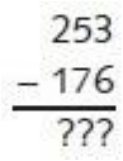

要解决这个问题，首先从最右列着手。我们看到，6是大于3的，因此从5上借1，再用13减去6，得到结果为7。由于我们已经在5上借了1，因此，现在实际上那一位是4，而4是小于7的，因此继续从2上借1，14减7结果为7。而由于在2上借了1，实际上这一位是1，从中减去1，结果为0。因此，最后的结果应为77：

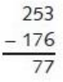

如何才能通过一连串逻辑门来实现这个反逻辑呢？

然而，我们并不打算这样做。相反，我们打算用一个小技巧来让减法不涉及借位。这会使波洛尼厄斯<a id="footnote_quote_txt013_1" class="footnote_quote" href="part0020.html#footnote_content_txt013_1">[1]</a>（既不是欠债人也不是出借人）满意，我们其他人也一样。此外，由于减法与计算机中以二进制编码的存储有关，详细地了解减法也是很重要的。

为了便于表达，将进行减法的两个数分别用被减数（minuend）和减数（subtrahend）表示。从被减数中减去减数，得到的结果叫做差（difference）。

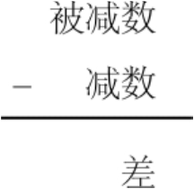

为了避免借位，首先要从999中减去减数，而不是从原来的被减数中减去减数。

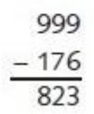

由于操作数是三位数，所以这里使用999。如果操作数是4位，则用9999。从一串9中减去一个数叫做对9求补数。176对9的补数是823。反之亦然：823对9的补数是176。这样的好处就是无论减数是多少，计算对9的补数都不需要借位。

计算出减数对9的补数后，将补数与原来的被减数相加：

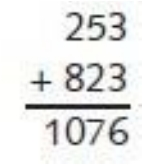

最后再将结果加1，并减去1000。

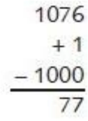

到此，我们就得到了结果。答案与先前的相同，而且没有用到借位。

为什么这种方法行得通呢？原题目是这样的：

253- 176

在这个式子中加上一个数再减去这个数，结果是相同的。因此先加上1000，再减去1000：

253- 176 + 1000 - 1000

这个式子与下式等价：

253- 176 + 999 + 1 - 1000

然后用以下方式将数字重新组合：

253 + (999 - 176) + 1 - 1000

这个式子与刚才描述过的用9的补数进行的计算是相同的。我们用两个减法和两个加法来替代一个减法，而在这个过程中避免了烦琐的借位。

如果减数大于被减数会怎么样呢？例如以下问题：

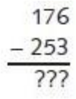

通常遇到这个问题时你可能会说： "这里减数大于被减数，因此要将减数和被减数交换来执行减法，然后给结果取个相反数。" 你可能在脑子里将这两个数交换，而写出这样的答案：

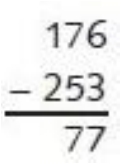

如果希望求解这个问题而不使用借位的话，就要采用与之前稍微不同的方法。首先要像前面一样，用999减去减数253，计算出对9的补数：

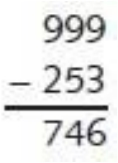

把该数对9的补数与被减数相加：

在前面的例子中，下一步应该加1，并减去1000来得到最终结果。但是在这里，这种方法并不适用。因为你会遇到923减去1000的情况，这又导致了借位。

由于我们之前已经加了999，这里再减去999：

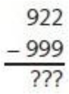

到这里，我们会意识到这个问题的结果是负数，因此需要将减数与被减数交换，用999减去922。这里没有用到借位，结果与我们期望的相同：

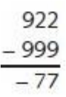

同样的技巧可以用于二进制数中，而且实际上这要比十进制数简单。让我们一起来看看该如何操作。

原来的减法题目是：

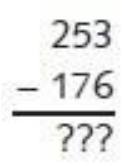

将这些数字转化为二进制数，问题变为：

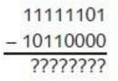

第一步，用11111111（即255）减去减数：

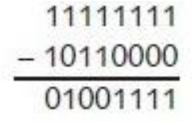

当计算十进制数减法的时候，减数是从一串9中减去的，结果称为9的补数。在二进制数减法中，减数是从一串1中减去的，结果称为1的补数。但是请注意，我们在求对1的补数时并不需要用到减法。在求对1的补数时，只需将原来的二进制数中的1变为0，将0变为1即可。因此对1求补数有时也会称为相反数（negation）或反码（inverse）。这里你可能会想起第11章中的反向器，它的作用就是将0变为1，将1变为0。

第二步，将减数对1的补数与被减数相加：

第三步，将上式所得结果加1：

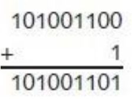

第四步，减去100000000（即256）：

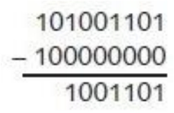

结果就等于十进制数的77。

我们把这两个数颠倒位置后再做一遍。在十进制中，减法题目对应于：

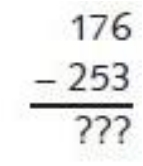

而用二进制表示为：

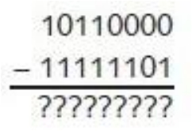

第一步，用11111111减去减数，得到对1的补数：

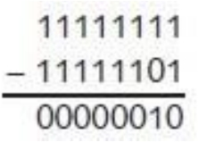

第二步，将减数对1的补数与被减数相加：

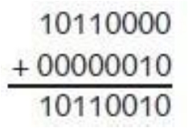

现在我们要用某种方法在结果中减去11111111。当减数小于被减数的时候，我们将结果加1再减100000000来完成计算。但是你无法在不借位的情况下做到这一点。所以，我们先用11111111减去所得结果：

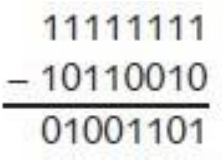

这里又一次用到了将各位取反来求得结果的方法，但是这个结果是77，而真正的答案应该是-77。

到这里，我们已经有了足够的条件来改造上一章所搭建的加法器，并让它像实现加法一样来实现减法运算。为了不让问题太复杂，这个新的加/减法器只执行在减数小于被减数的减法操作，即结果为正数的操作。

该加法器的核心是由逻辑门集成的8位全加器。

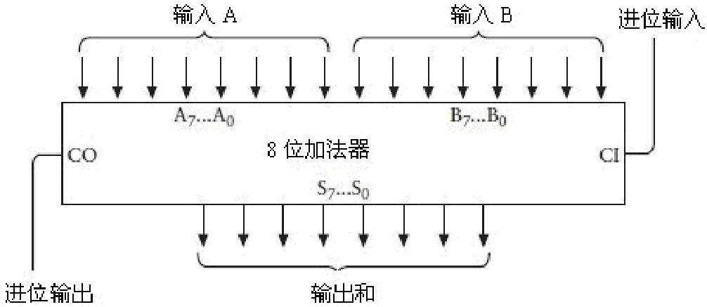

你可能还记得，输入A0～A7及B0～B7与两排分别表示两个要相加的8位二进制数的开关相连。进位输入接地。S0～S7与表示结果的8个灯泡相连。由于这个加法有可能得到9位数值，进位输出端也连接了一个灯泡。

控制面板示意如下图所示。

在上图中，开关所表示的是183（即10110111）与22（即00010110）相加，结果如灯泡所示为205（即11001101）。

8位加/减法器所用的新面板较从前做了些许的改动。它增设了一个开关，用以选择做加法还是做减法。

如上图所示，这个开关向下断开时表示选择加法运算，反之向上接通则表示选择减法运算。此外，右侧的8个灯泡用于表示计算结果。这里，第9个灯泡表示 "上溢/下溢" 。这个灯泡表明了正在计算的数字是一个不能用8个灯泡来表示的数字。如果在加法中得到了大于255（上溢，overflow）或在减法中得到了负数（下溢，underflow）这个灯泡就会发光。当减数大于被减数的时候，就会得到一个负数。

加法器中新增的主要部分就是一个用来求8位二进制数对1补数的电路。之前提到，二进制数对1求补数相当于对其每位取反，因此我们计算8位二进制数补数的时候可以简单地应用8个反向器。

问题是，该电路只会对输入求反，而我们要的是一台既能做加法又能做减法的机器，因此就要求该电路当且仅当进行减法运算时才实现反转。电路可以改造为如下图所示。

标记为 "取反" 的信号将被输入到每一个异或门中。回想一下异或门的工作方式，如下表所示。

因此，如果 "取反" 信号是0，则8个异或门输出与输入相同。例如，如果输入是01100001，那么输出也为01100001。如果 "取反" 信号为1，则输出信号反置。例如，如果输入为01100001，输出则为10011110。

将8个异或门合并起来画成一个器件，称为求补器（One’s Complement），如下所示。

将一个求补器，一个8位二进制加法器和一个异或门做如下连接。

注意，这里三个信号都标识为 "SUB" ，这就是加/减法转换开关。当该信号为0的时候，其进行的是加法运算，为1时进行的则是减法运算。在减法中，输入B（第二排开关）在送入加法器之前，需先通过求补电路进行取反。此外，在做减法时，我们通过设定CI（进位输入）为1来使得结果加1。而在加法中，求补电路将不起作用，且输入CI为0。

加法器的SUB信号和CO（进位输出）输出作为异或门的输入来控制表示上溢/下溢的灯泡。如果SUB信号为0（表示进行加法运算），则当加法器CO输出为1时灯亮，意思是加法计算结果大于255。

当进行减法运算的时候，如果减数（输入B）小于被减数（输入A），这时加法器的CO输出为1。这表示减法的最后一步要减去100000000。也就是说减数要大于被减数，结果为负。上面所示器件现在还不能表示负数。因此，上溢/下溢指示灯仅在加法器的CO输出为0时才会亮起。

你应该会庆幸自己问了这个问题： "减法该如何实现呢？" 

本章一直在谈论负数，但是并没有提到负数在二进制中是如何表示的。你可能设想二进制会同十进制一样应用传统的负数符号。例如，-77在二进制中为-1001101。这样做当然可以，但是应用二进制数的目的恰恰就在于只希望用0和1来表示所有的东西，当然也包括负号。

当然，你可以简单地用一个二进制位来表示负号，当这一位为1的时候就表示负数，为0则表示正数，尽管这样也是可行的，但还远远不够。还有另一种方法可以解决负数的表示问题，而且它还可以很轻松地让负数和正数相加。这种方法的缺点是必须提前算一下可能遇到的所有数字的位数。

让我们来想一想。通常用来表示正数和负数的方法，其好处就在于能表示所有的正数、负数。我们将0想象为这个无限延伸的序列的中点。这个序列中正数沿着一个方向延伸，而负数则按照另一个方向延伸：

…-1000000，-999999…-3，-2，-1，0，1，2，3…999999，1000000…

但是，如果我们并不需要无限大或无限小的数，而且在开始的时候我们就可以预知所使用的数字的范围，那情况就有所不同了。

以支票账户为例，这里人们通常会遇到负数。假设我的账户余额不超过500美元，并且银行给了我们500美元的无息预支额度，意思就是账户余额数值应该是一个在499美元到-500美元之间的数。假设我们不会一次取出500美元，我们也不会支出多于500美元的金额，这里我们用到的只是美元，不涉及美分。

这些假设表明账户能处理的额度是介于-500到499之间，总共1000个数。这个约束说明只用三位十进制数，且不用负号就可以表示所有需要的数字。我们并不需要用到从500到999之间的正数，因为我们所需要的数的最大值为499。因此从500到999的三位数可以用来表示负数。具体情况如下：

用500表示-500

用501表示-499

用502表示-498

……

用998表示-2

用999表示-1

用000表示0

用001表示1

用002表示2

……

用497表示497

用498表示498

用499表示499

也就是说，以5，6，7，8或9开头的三位数实际上表示的都是负数，而不是把数字写成这样：

-500，-499，-498 …-4，-3，-2，-1，0，1，2，3，4 … 497，498，499

用这种表示法，我们可以将它们写成：

500，501，502 … 996，997，998，999，000，001，002，003，004 … 497，498，499

注意，这就形成了一个循环排序。最小的负数（500）看起来像是最大正数（499）的延续。而数字999（实际上是-1）是比0小1的第一个负数。如果我们在999上加1，通常会得到1000。由于我们处理的是三位数，这个结果实际上就是000。

这种标记方法称为10的补数（ten’s complement）。为了将三位负数转化为10的补数，我们用999减去它再加1。也就是说，对10求补数就是对9的补数再加1。例如想要得到-255对10的补数，用999减去255得到744，然后再加1，得到745。

你可能听说过： "减一个数就等于加一个负数。" 你可能会回答： "实际上还是减去了这个数。" 然而，利用10的补数，我们将不会再用到减法。所有的步骤都用加法来进行。

假设你有一个余额为143美元的支票账户。你开了一张78美元的支票，也就意味着要将一个值为负的78美元加到143美元上。-78对10的补数为999-078+1，即922。因此新余额为143美元+922美元，相当于65美元（忽略溢出）。如果我们又开了一张150美元的支票，需要在余额上加上-150，-150对10求补数为850。因此先前的余额加上850等于915，就是新的账户余额。而这个余额实际上是-85美元。

这样的机制在二进制中被称为2的补数。以8位二进制数为例。范围为00000000～11111111，对应十进制中的0～255。但是如果你还想表示负数的话，则以1开头的每个8位数都表示一个负数，如下表所示。

现在所表示的数的范围是-128～+127。最高有效位（最左位）作为符号位（sign bit）。符号位中，1表示负数，0表示正数。

为了计算2的补数，则首先要计算1的补数，然后再加1。这等价于将每位取反再加1。例如，十进制数125写为二进制为01111101。为了表示-125的对2的补数，首先将01111101的每位取反，得到10000010，再加1，得到10000011。可以根据前面的表格核实一下结果。用同样的步骤，每位取反再加1，可以将数值还原。

这个系统为我们提供了一种不用负号就能表示正、负数的方法。同样也让我们自由地将正数和负数用加法法则相加。例如，将与-127和124等价的两个二进制数相加。利用上面的表格，可以简单地写为：

结果等于十进制的-3。

要注意的是，这里涉及了上溢和下溢情况，即结果大于127或小于-128。例如，将125与它自身相加：

由于最高位为1，结果代表一个负数，相当于十进制的数-6。将-125与它本身相加也会出现同样的情况：

在一开始，我们规定所处理的数值为8位，因此最左位被忽略。右边8位相当于十进制的+6。

一般来说，如果两个操作数的符号相同，而结果的符号与操作数的符号不相同，这样的加法就是无效的。

现在，二进制数可以有两种不同的使用方法。二进制数可以是有符号的，也可以是无符号的。无符号的8位二进制数所表示的范围是0～255。有符号的8位二进制表示的范围是-128～127。无论是有符号的还是无符号的，数字本身是无法显示的。例如，如果有一个人问： "有一个8位二进制数，值为10110110。它相当于十进制的多少？" 你必须先问： "它是有符号数还是无符号数？它可能为-74或者182。" 

这就是二进制数的麻烦之处，它们只是一些0和1，本身并没有任何含义。

<a id="footnote_content_txt013_1" href="part0020.html#footnote_quote_txt013_1" class="calibre2">[1]</a>波洛尼厄斯是莎士比亚著名戏剧《哈姆莱特》中的一位世故的御前大臣，他在第一幕第三场向他即将离家外出的儿子说了一大段告诫的话，其中有一句： "不要向人告贷，也不要借钱给人。因为向人告贷的结果，容易养成因循懒惰的习惯；而把债款放了出去，往往不但丢了本钱，而且还失去了朋友。" 后来，美国经济学家范里安在其所著的《微观经济学：现代观点》一书中使用了 "波洛尼厄斯" 一词，该词就成为了经济学中的一个概念。经济学在研究消费者进行跨时期的消费行为时，把这种既不向别人借钱、也不借钱给别人的状态叫作 "波洛尼厄斯点" 。因此，这里的 "波洛尼厄斯" 也就表示既不向别人借钱、也不借钱给别人的人。——译者注

## 14　反馈与触发器
电可以让物体运动，这个道理人人都懂。只要稍微扫视一下我们的房间就会发现：很多电器中都装了电动机，比如钟表、电扇、食品加工器，以及CD播放器等。电同样可以使扩音器中的磁芯振动，正因为如此我们的音响设备、电视机才能够产生声音，播放语音和音乐。有一类设备或许能很清晰地阐释电能驱使物体运动的最简单也最具代表性的方式，然而由于这类设备正在被能够实现同样功能的电子器件逐步取代，它们正在迅速地消失。在我看来，最令人赞叹的例子应该算是电子蜂鸣器和电铃了。

将继电器、电池、开关按如下形式连接。

如果你认为这个系统看起来有点古怪，说明你还没有发挥出想象力。或许以前我们没见过采用这种连接方式的继电器，因为我们通常所见过的继电器，其输入和输出是分开的，而这里却构成了一个回路。当开关闭合后，电路就连通了。

连通的电路使得电磁铁把金属簧片拉了下来。

当金属簧片的位置变化时，电路不再连通，电磁铁不再具有磁性，金属簧片又弹回原位。

如此一来，电路又一次连通了。从整个过程来看：开关一旦闭合，金属簧片就会上下跳动——电路也会随之连通或断开——声音也就会随之发出。如果金属簧片发出了一种刺耳的声音，这套系统就成为了一个蜂鸣器。如果金属簧片前端是一把小锤子，旁边只要放上一个锣，就构成了一个电铃。

有两种方法可以使继电器连接成为一个蜂鸣器，下面再给出一种方法的描述，在示意图中包含了一个标准电压符号和一个接地符号。

看到这幅图你或许立刻想起了第11章介绍过的反向器，因此电路可以简化为如下图所示。

正如你所记得的那样，当反向器的输入是0的时候，它的输出就为1；而当其输入为1时，输出就为0。电路中的开关一旦闭合，反向器中的继电器就会在连通与断开这两种状态之间反复交替。你也可以将电路中的开关省去，这样就可以使反向器连续地工作，如下所示。

这幅图似乎在表达着一种矛盾的逻辑，反向器的输出与其输入是相反的，但是在这里，输出同时又是输入！然而，我们要牢牢记住，反向器在本质上就是一个继电器，而继电器将状态取反以得到另一个状态是需要一点点时间的。所以，即使输入和输出是相同的，输出也会很快地改变，成为输入的相反状态（当然，输出随即也会很快改变输入，如此反复）。

电路的输出是什么呢？其实就是要么提供电压，要么不提供电压，在两者之间切换。我们也可以换种方式来表达——输出结果要么是0，要么是1。

我们把这种电路称为振荡器（oscillator），它和我们先前学到的所有东西存在本质上的区别。在此之前我们讲过的所有的电路，其状态的改变都依靠人为的干预，通常是通过改变开关状态来实现的。但是振荡器却在不需要人干涉的情况下，可以完全自发地工作。

当然，单独的一个振荡器用处并不大，但是在本章的后面和接下来的几章里，我们会发现，在与其他电路连接后所组成的自动控制系统中，振荡器有着举足轻重的作用。为了使不同组件同步工作，所有计算机都配备着某种振荡器。

当采用0和1的交替序列来表示振荡器的输出时，我们一般使用下面这样的图来形象地描述输出。

我们可以通过这幅图来充分地了解电路的输出，水平坐标代表时间，垂直坐标用来表示输出是0还是1。

这幅图表示随着时间的推移，振荡器的输出在0和1之间按照固有的规律交替变化。正因为这一点，振荡器又经常被称为时钟（clock），通过振荡进行计数也是一种计时方式。

振荡器运行速度究竟有多快呢？换句话说，金属簧片多久会振动一次？或者每秒钟振动多少次呢？这很大程度上依赖于继电器的内部构造。你容易想到，一个又大又重的继电器只能缓慢地上下摆动；而一个又小又轻的继电器却可以高速地跳动。

振荡器从某个初始状态开始，经过一段时间又回到先前初始状态的这一段间隔定义为振荡器的一个循环（cycle），或者称为一个周期，如下图所示。

一个循环所占用的时间就是该振荡器的周期（period）。假设我们使用的振荡器的周期恰好是0.05s，任取一个时间点，将其设置为起始状态点，我们把它标注为零点，就可以在水平轴上标出相应的时间。

周期的倒数就是振荡器的频率（frequency）。在这个例子中振荡器的周期是0.05s，那么其频率就是1÷0.05s，即振荡器每秒钟产生20次循环，而相应的输出每秒钟也变化20次。

每秒钟的循环次数与每小时穿越的英里数、每平方英尺的重量、每份食物的卡路里数等概念一样都是很容易理解的，但这种描述方法已不常用。为了纪念发送和接收无线电波的第一人——亨利希·鲁道夫·赫兹（1857-1894），后人使用 "赫兹" 这个词来表示这一概念。这种用法起源于20世纪20年代的德国，几十年之后逐渐被其他国家所广泛采纳。

这样，上述振荡器的频率就是20赫兹，记做20 Hz。

目前为止，我们还只是在猜测一个振荡器的速度。在本章后面我们将构建一种可以测量振荡器速度的元件。

在此之前，让我们先来看看采用特殊方式连接的一对或非门。或非门的特点是只有在两个输入端都没有电压时，输出端才产生电压。

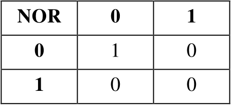

下面是一个包含两个或非门、两个开关和一个灯泡的电路。

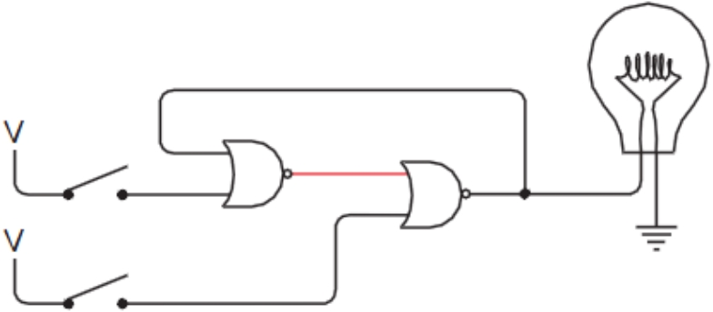

值得注意的是这种特殊的弯曲的连线方式：左边或非门的输出是右边或非门的输入，而右边或非门的输出是左边或非门的输入。这种连接方式我们称之为反馈（feedback）。系统的输出返回给输入这种形式和我们在振荡器中讨论的情况很相似。接下来你将会看到，本章大部分电路都具备这种特质。

在初始状态下，电路中只有左边的或非门输出电流，这是因为其两个输入均为0。让我们闭合上面的开关，左边或非门将立刻输出0，右边或非门的输出也会随之变为1，这时灯泡将被点亮。

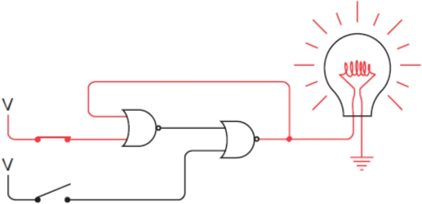

奇妙的是，这时一旦你关闭上边的开关，灯炮依然闪闪发光。这是因为由于左边或非门的输入中有一个为1，其输出依然是0，因而左边或非门的输出不变，所以灯泡仍然亮着。

难道你不觉得有点奇怪吗？两个开关都断开——和第一幅场景描述的是一模一样——但这里的灯泡却仍发光。这与我们先前所见过的所有情况都完全不同。先前遇到的电路其输出依赖且仅依赖于其输入，这次的结论与以前的大相径庭。无论上面的开关怎么调整其状态，灯泡总是亮着。这个开关对电路毫无影响，究其原因可以发现这是由于左边或非门的输出一直为0。

现在来试试闭合下面的开关。我们会发现右边或非门的输入中有一个立刻变为1，其输出就相应地变为0，灯泡随之熄灭。左边或非门的输出此刻变为1。

这时你再去断开下面的开关就会发现，灯泡一直处在熄灭状态。

此时的电路状态与初始时是一样的。但是这次无论你怎么改变下面开关的状态，灯泡丝毫不受影响。我们将先前的情况一起总结一下：

●接通上面的开关，灯泡被点亮，断开此开关灯泡仍然亮着。

●接通下面的开关，灯泡被熄灭，断开此开关灯泡仍然不亮。

电路的奇怪之处是：同样是在两个开关都断开的状态下，灯泡有时亮着，有时却不亮。当两个开关都断开时，电路有两个稳定态，这类电路统称为触发器（Flip-Flop），Flip-Flop这个单词也可以有 "沙滩鞋" 或者是 "政治策略" 的意思。触发器是在1918年被发明的，发明者是英国无线电物理学家威廉姆·亨利·艾克里斯（1875-1966）和F.W.乔丹（信息不详）。

触发器电路可以保持信息，它可以 "记住" 某些信息。特别地，对于本章先前所讲述的触发器，它可以记住最近一次是哪个开关先闭合。如果你遇到这样一种触发器，如果它的灯泡是亮着的，你就可以推测出最后一次连通的是上面的开关；而如果灯泡不亮则可推测出最后一次连通的是下面的开关。

触发器和跷跷板有着很强的相似性。跷跷板也有两个稳定状态，它不会长期停留在不稳定的中间位置。通过观察跷跷板，我们很容易推测出哪边最后一次被压下来。

尽管你现在可能还没感受到这一点，但触发器的的确确是一种必不可少的工具。它们可以让电路 "记住" 之前发生了什么事情。想象一下，如果你没有了记忆力，该如何去数数，我们不记得刚刚数过的数，当然也就无法确定下一个数是什么！同理，一个能计数的电路（本章后面要讲到）必定需要触发器。

触发器种类繁多，先前所讲述的是最简单的一种R-S（Reset-Set，复位/置位）触发器。我们通常把两个或非门绘制成另一种形式，加上标识符就得到了下面这幅图。

我们通常用Q来表示用于点亮灯泡的输出的状态。另一个输出（读做Q反）是对Q的取反。Q是0，就是1，反之亦然。输入端S（Set）用来置位，R（Reset）用来复位。你可以把 "置位" 理解为把Q设为1，而 "复位" 是把Q设为0。当状态S为1时（对应于先前触发器中上面的开关闭合的情况），此时Q变为1而变为0；当R状态为1时（对应于前面图中闭合下面的开关的情况），此时Q变为0而变为1。当S和R均为0时，输出保持Q原来的状态不变。我们把结论总结如下表所示。

这类表称为功能表（function table）、逻辑表（logic table）或真值表（truth table）。它表达了不同输入组合所对应的不同输出结果。因为R-S触发器仅有两个输入端，所以不同的输入组合共有4种，分别对应于表中的4行。

注意表中倒数第2行，这一行输入S和R均为0，而输出标识为Q和。这表示当S和R输入均为0时，Q和端的输出保持为S、R同时被设为0以前的输出值。表中最后一行表示S和R均为1的输入组合是被禁止或者不合法的。不要误解为你会因此被逮捕，而是说如果S、R状态同时为1时，Q和均会为零，这与Q和互反的假设关系相矛盾。所以当使用R-S触发器进行电路设计时，R、S输入同时为1的情况一定要避免。

R-S触发器可以简化为带有输入和输出标志的小框图，就像下面画的这样。

R-S触发器最突出的特点在于，它可以记住哪个输入端的最终状态为1。但是有时候我们需要一种记忆能力更加强大的电路，例如能记住在某个特定时间点上的一个信号是0还是1。

在构造具备这种功能的电路之前，让我们先来思考一下它的具体行为。这个电路存在两个输入。其中一个我们称之为数据端（Data）。与所有数字信号一样，数据端取值为0或1；另一个输入被称为保持位（Hold That Bit），保持位的作用就是使当前的状态被 "记住" ，通常情况下保持位被设置为0，在这种情况下数据端对电路不产生影响。当保持位置1时，数据端的值就会在电路系统中被 "记住" 。随后保持位又置为0，这时电路已经 "记住" 了数据端的最后一次输入，而之后数据端的输入无论如何变化都不会对电路产生影响。

我们可以把状态转化的过程以真值表的形式表示如下。

在前两种情况下，保持位为1，输出Q与数据端输入相同；后面两种情况下，保持位为0，输出端Q和其前一个状态保持一致。值得注意的是，保持位为0意味着输出将不再变化，也就是说不再被数据端所影响，我们可以进一步将真值表简化为如下所示。

X表示 "其取值情况与结果无关" ，只要保持位的值为0，那么数据位对电路的输出没有影响，电路的输出和其前一个状态相同。

如果使用先前学过的R-S触发器来实现这种具有保持位的功能系统，那么我们的电路需要在输入端增加两个与门，下图所给出了该系统的实现电路。

回忆一下与门，它的特点是只有在输入端都为1的状态下，输出才为1。在上面这幅图中，输出端Q为0，为1。

只要保持位为0，则置位端对于输出结果不会有任何影响。

同样，复位信号对输出也无任何影响。

当保持位信号为1时，这套电路系统就和先前讲过的R-S触发器功能一致。

这时由于上面与门的输出和复位端输入相同，而下面与门的输出和置位端输入相同，所以电路系统的功能和普通的R-S触发器是一样的。

但是我们离目标还差一点。我们只想要两个输入，而不是三个，怎么解决这个问题呢？先回忆一下R-S触发器的功能表：两个输入端同时为1是非法的，要尽量避免；而两个输入端同时为0是无意义的，因为那种情况下输出就会保持不变。我们只要将保持位设置为0，就完全可以实现相同的功能。

由此可以总结出，真正有意义的输入可以是S为0，R为1或者是R为0，S为1的情形。如果把数据端信号看做置位信号，把它取反后的值看做复位端信号，我们可以画出相应的电路图如下所示。

在上图所表示的情况下，所有输入均为0，而输出Q也为0（此时为1）。可以看出只要保持位为0，电路输出就丝毫不受输入端的影响。

当保持位为1时，电路反映出数据端输入的值。

现在Q端的输出和数据输入是一致的，而端则正好相反。现在保持位又回到0，如下图所示。

这时，电路会 "记得" 当保持位最后一次置1时数据端输入的值，数据端的变化对此没有影响。例如，数据端再置回0对输出将不会产生影响。

这个电路称为电平触发的D型触发器，D（Data）表示数据端输入。所谓电平触发是指当保持位输入为某一特定电平（本例中为 "1" ）时，触发器才保存数据端的输入值（很快，我们将看到另一种形式的触发器）。

通常情况下，当这种电路出现在书中的时候，输入端是不会被标记为保持位的，而是被标记为时钟（clock）。当然，这种信号并不是真正的时钟，但是在某些情况下它却具有类似时钟的属性，即它可以在0和1之间有规律地来回变化。但是现在时钟仅仅用来指示什么时候保存数据。

通常把数据端简写为D，时钟端简写为Clk，其功能表如下所示。

这个电路也就是所谓的电平触发的D型锁存器，它表示电路锁存住一位数据并保持它，以便将来使用。这个电路也可以被称为1位存储器。在本书的第16章将会介绍如何将多个1位存储器连接起来构成多位存储器。

在锁存器中保存多位值通常是很有用的。假如你想用第12章的加法器把3个8位数相加，可以在开关的第1行中存入第1个加数，以同样的方式把第2个加数存入第2行，但是必须记下第一次相加的结果。然后你需要把这个结果输入到开关的一行中，再把第3个加数输入到开关的另一行中。而你实际上不必输入中间结果，你应该能够在第一次计算之后直接使用它。

可以使用锁存器来解决这个问题。我们在一个小盒子里布置8个锁存器，如前所述，每个锁存器包括两个或非门、两个与门以及一个反相器。所有的时钟输入端都互相连在一起。结果如下图所示。

这个锁存器可以一次保存8位数。上面的8个输入端依次标记为D0～D7，下面的8个输出端被标记为Q0～Q7。左边的输入是时钟（Clk），时钟信号通常为0。当时钟信号为1时，D端输入的8位值被送到Q端输出。当时钟信号为0时，这8位值将保持不变，直到时钟信号再次被置1。

也可以将8位锁存器的8个数据输入端和8个Q输出端画为两组线，如下图所示。

下面是8位加法器的图示。

通常（先不考虑上一章讲到的减法器），8个A输入端和8个B输入端连接到开关上，CI（进位输入）接地，而8个S（计算和）输出以及CO（进位输出）端连接到灯泡上。

经过改进，8位加法器的8个S输出端既与灯泡相连，又连接到8位锁存器的数据（D）输入端。标记为 "保存" （Save）的开关是锁存器的时钟输入，用来存放加法器的运算结果。

标识为2-1选择器的方块是让你用一个开关来选择加法器的B端输入是取自第2排开关还是取自锁存器的Q端输出。当开关闭合时，就选择了用8位锁存器的输出作为B端输入。2-1选择器使用了8个如下所示的电路。

如果选择端（Select）输入是1，那么或门的输出和B端的输入就是一致的。这是因为上面与门的输出和B端输入是一样的，而下面与门的输出是0。类似的，如果选择端的输入是0，那么或门的输出则和A端输入一致。总结起来如下表所示。

改进后的加法器中包含了8个这样的1位选择器。所有的选择端输入信号都是连在一起的。

改进后的加法器不能很好地处理进位输出（CO）信号。如果两个数的相加使得进位输出信号为1，那么当下个数被加进来的时候，这个信号将被忽略掉。一个可能的解决方案是将加法器、锁存器、选择器均设置为16位宽，或者至少应该比你可能遇到的最大的和的位数多一位。这个问题留到第17章具体讲述。

对于加法器来说，一个更好的改进方法是去掉一整排8个开关。但是首先要对D触发器做一些修改，为它加一个或门和一个称为清零（Clear）的输入信号。清零信号通常为0，但当它为1时，Q输出为0，如下图所示。

无论其他信号是什么，清零信号总是强制使Q输出为0，以达到使触发器清零的目的。

也许你还不明白为什么要设置这个信号，为什么不能通过把数据输入端置0和把时钟输入端置1来使触发器清零呢？这也许是因为我们无法精确控制数据端的输入信息的缘故。我们可能有一组8个锁存器，它们连着8位加法器的输出端，如下图所示。

注意，标识为 "相加" （Add）的开关现在控制着锁存器的时钟输入。

你可能会发现这个加法器比前面的那个好用，特别是当你需要加上一长串数字时。首先按下清零开关，这个操作会使锁存器的输出为0，并且熄灭了所有的灯泡，同时使8位加法器的第2行输入全为0。然后，通过开关输入第一个加数，并且闭合 "相加" 开关，这个加数的值就反映在灯泡上。再输入第二个加数并再次闭合 "相加" 开关。由开关输入的8位操作数加到前面的结果上，所得的和体现到灯泡上。反复如此操作，可以连续进行很多次加运算。

前面提到过，我们所设计的D触发器是电平触发的，也就是说为了使数据端的值保存在锁存器中，必须把时钟端的输入从0变为1（即高电平）。但是，当时钟端输入为1时，数据端的输入是可以改变的，这时数据端输入的任何改变都会反映在Q和的输出值中。

对某些应用而言，电平触发时钟输入已经足够用了；但是对另外一些应用来说，边沿触发（edge-triggered）时钟输入则更有效。对于边沿触发器而言，只有当时钟从0跳变到1时，才会引起输出的改变。它们的区别在于，在电平触发器中，当时钟输入为0时，数据端输入的任何改变都不会影响输出；而在边沿触发器中，当时钟输入为1时，数据端输入的改变也不会影响输出。只有在时钟输入从0变到1的瞬间，数据端的输入才会影响边沿触发器的输出。

边沿触发的D型触发器是由两级R-S触发器按如下方式连接而成的。

这里，时钟端的输入既控制着第一级R-S触发器，也控制着第二级，但是要注意的是时钟信号在第一级中进行了取反操作，这意味着除了当时钟信号为0时保存数据外，第一级R-S触发器和D型触发器工作原理完全一致。第一级R-S触发器的输出是第二级的输入，当时钟信号为1时，它们都被保存。一言概之，只有当时钟信号由0变为1时，数据端输入才被保存下来。

进一步分析，下图为一个处于非工作状态的触发器，其数据输入和时钟输入均为0，且Q输出也为0。

现在使数据端输入为1，如下图所示。

这改变了第一级触发器的状态，因为时钟输入取反变为1。但第二级触发器状态保持不变，因为时钟输入仍然为0。现在把时钟输入变为1。

这就引起了第二级触发器输出的改变，使Q输出变为1。不同点在于，无论数据端输入发生何种变化（比方说变为0）都不会影响Q的输出。

只有在时钟输入从0变化到1的瞬间Q和输出才发生变化。

边沿触发的D型触发器的功能表需要一个新的符号来表示从0到1的瞬时变化，即用一个向上的箭头（↑）表示，如下表所示。

表中箭头表示当时钟端由0变为1时（称为时钟信号的 "正跳变" ， "负跳变" 是指从1变为0），Q端输出与数据端输入是相同的。触发器的符号如下图所示。

图中的小三角符号表示触发器是边沿触发的。

下面展示的是一个使用边沿D型触发器的电路，这个电路是不能用电平触发形式复制出来的。先回忆一下本章开始构造的振荡器，其输出在0和1之间变化。

把振荡器的输出与边沿触发的D型触发器的时钟端输入连接，同时把端输出连接到本身的D输入端。

这个触发器的输出同时又是它自己的输入。反馈紧接着反馈！（实际上，这种构造可能是有问题的，振荡器是由状态来回迅速改变的继电器构成的，其输出与构成触发器的继电器相连，而这些其他的继电器不一定能跟得上振荡器的速度。为了避免这些问题，这里假设振荡器中的继电器比电路中其他地方的继电器速度要慢得多）

仔细看一看下面的功能表就可以明白在电路中发生的情况了，电路启动时，假设时钟输入为0且Q输出也为0，则端输出为1，而是和D端输入相连的。

当时钟输入从0变为1时，Q输出与D输入相同。

但是由于的输出变为0，因此D输入也变为0。现在时钟输入为1，如下表所示。

当时钟输入变回0时，不会影响到输出，如下表所示。

现在时钟端输入又变为1。由于D输入为0，那么Q输出为0且输出为1。

所以D输入也变为1，如下表所示。

以上发生的现象可以简单总结为：每当时钟输入由0变为1时，Q端输出就发生变化，或者从0到1，或者由1到0。下面的时序图可以更加清楚地说明这个问题。

当时钟端Clk输入由0变为1时，D的值（与的值相同）被输出到Q端。当下一次Clk信号由0变为1时，D和的值同样会改变。

如果这个振荡器的频率是20Hz（即20个周期的时间为1s），那么Q的输出频率是它的一半，即10Hz，由于这个原因，这种电路称为分频器（frequency divider），它的输出反馈到触发器的数据端输入D。

当然，分频器的输出可以作为另一个分频器的Clk输入，并再一次进行分频。下面是三个分频器连接在一起的示意图。

上图顶部的4个信号变化规律如下图所示。

这里只给出了这幅图的一部分，因为这个电路会重复上述过程周而复始地变化下去。在这幅图中，你有没有发现眼熟的东西呢？

提示一下，把这些信号标上0和1。

现在看出来了么？试着把这个图顺时针旋转90°，然后读一读每一行的4位数字，它们分别对应了十进制中的0～15中的一个数。

0～Q7标记，在最右边的Q0是第一个触发器的输出。如果将灯泡连到这些输出端上，就可以将8位数字读出来。

这样一个计数器的时序图可以将8个输出分别表示出来，也可以将它们作为整体一起表示出来，如下图所示。

时钟信号的每一个正跳变发生时，一些Q输出可能会改变，而另外一些可能不变，但总体上来说它们所表示的二进制编码递增了1。

本章前面提到过可以找到某种方法来确定振荡器频率，现在已经找到这种方法了。如果把一个振荡器连接到8位计数器的时钟输入端上，那么这个计数器会显示出振荡器经过的循环次数。当计数器总数达到11111111（十进制的255），它又返回为00000000。使用计数器确定振荡器频率的最简单的方法就是把计数器的8个输出端分别接到8只灯泡上。当所有的输出都是0时（即所有灯泡都是熄灭的），启动一个秒表计时；当所有灯泡都点亮时，停止秒表计时。这就是振荡器循环256次所需要的时间。假设这个时间为10s，则振荡器的频率是256÷10，即25.6 Hz。

随着触发器功能的增加，它的结构也变得更加复杂，下面给出了一个带预置和清零功能的边沿型D触发器。

通常情况下，预置和清零信号输入会覆盖时钟和数据端输入，且两个输入都为0，当预置信号为1时，Q变为1，变为0。当清零信号为1，Q变为0，变为1（同R-S触发器中的S和R输入端一样，预置和清零信号不能同时为1）。除此之外，该触发器工作原理是和普通边沿D触发器是一样的。

电路图符号可以简单地用下图来代替。

现在，我们已经懂得如何使用继电器来做加法、减法和计数了，这是一件很有成就感的事情，因为我们使用的硬件是100多年前就存在的东西。我们还有更多未知领域要去探索，请稍事休息，停止思考那些构造方面的问题，回过头再来看看数字方面的问题吧。

## 15　字节与十六进制
通过对上一章中两类改进加法机的剖析，我们学习了数据路径（Data Path）这个概念。纵观整个电路的脉络，每8个比特流为一组，如潺潺溪流般在器件与器件之间流动。其实，这8位比特流就是加法器、锁存器以及数据选择器的输入形式，同时它也是这些器件单元的输出形式。这8位的比特流可以用开关的不同状态组合所定义，而且可以用灯泡的亮灭来显示。这样一来，这些电路中数据路径的位宽（bits wide）就是8。为什么我们要把它定义为 "8" 位呢？为什么没有定义为6位、7位、9位或10位呢？

要想用偷懒的方式回答上面这个问题也很简单，答案就是这些加法机都是对第12章中原始加法机的改进，而它所 "流传" 下来的位宽恰好就是8位。但是追根究底，原始加法机偏偏是8位其实没有什么特别的原因。只不过在每次使用8位位宽时，一切工作都显得非常方便——一种优雅的比特化（biteful）的比特流。或许大家已经感觉到我在极力隐瞒一些东西，无法否认，其实我心中一直都很清楚（或许你也知道）：8比特代表一个字节（byte）。

字节这个词最早起源于1956年前后，由IBM公司提出。最早的拼写方式是bite，但为了避免与bit混淆用y代替了i。曾几何时，字节仅表示某一数据路径上的位数，直到20世纪60年代中叶，在IBM的360系统的发展下（一种大规模复杂的商用计算机），字节这个词逐渐开始用来表示一组8比特数据。

由于有8位，一个字节的取值范围为00000000到11111111。相应地，它还可以表示成为0～255之间的正整数，如果将一个数的补码作为其相对应的负数，那么一个字节可以表示在-128～127范围内的正、负整数。一个给定的字节可以代表28，即256种不同事物中的一个。

让我们再来看看 "8" 这个数字，当8作为比特流的一种尺度，它的确表现出了非常完美的特质。字节在很多方面都比单独的比特更胜一筹。IBM采用字节有一个很重要的原因，就是这样一来数字就可以按照BCD形式（第23章中将会讲述）方便地保存。在本章随后的讲述中，我们会发现凑巧的是：全世界大部分书面语言（除了中文、日文以及朝鲜文中使用的象形文字体系）的基本字符数都少于256，所以字节是一种理想的保存文本的手段。字节同样适合表示黑白图像中的灰度值，这是由于肉眼能区分的灰度约为256种。当一个字节无法表示所有信息（如刚提到的中文、日文以及朝鲜文中使用的象形文字体系等），我们只需采用两个字节——就可以表示216也就是65536个不同的物体——这也是一种很好的解决方案。

字节的一半——即4比特——我们称之为半字节（nibble，也可拼写成nybble），在计算机这个领域，它并不像字节那样经常使用。

由于字节在计算机内部出现的频率较高，如果可以使用一种简洁的方式将它的内在含义准确表达出来，将会为我们带来很多方便。假如一个8位二进制数表示为10110110，这种表达方式自然而又直观，但它还不够简洁。

我们完全可以采用十进制表示法来表示字节，但从二进制转换到十进制需要进行一系列计算——计算方法并不复杂，但是比较麻烦。我曾在第8章曾介绍过一种直观的计算方法。因为每一位二进制数对应着2的不同幂，因此我们可以把二进制数写到第一行，在底下写出每一位二进制数对应的2的乘方数，然后采用 "列相乘、行相加" 就可以得到对应的十进制数。下图表示了10110110的转换过程。

把十进制数转换为二进制数就需要一点点技巧了。我们可以用这个十进制数不断除以递减排列的2的幂，每除一次得到的商就是所要求的二进制数中的一位，而余数成为下一次运算的除数，它的作用是除以下一个较小一点的2的幂。下图表示了十进制数182转换成二进制形式的过程。

第8章对这种计算方法有更详细的描述。不过，在十进制数和二进制数之间进行转换还需用到一些工具，例如要借助笔和纸进行一系列演算。

第8章中我们还学到了八进制数，也称为八进制数字系统。这种系统仅使用到了数字0、1、2、3、4、5、6还有7。八进制数和二进制数之间的转换简洁方便，只要记住0～7这8个数字所对应的3位二进制数即可。下面这张表就表示了这种对应关系。

假如要把一个二进制数（如10110110）转化为8进制，可以从最右端的数字开始。每3比特看做一组，这样每组便对应着一个八进制数：

10110110这个字节很容易就表示为八进制数266。这种方法简洁明了，八进制用来表示字节不失为一个好方法。但还是有那么一点美中不足。

字节可以表示的二进制数的范围为00000000～11111111，如果采用八进制表示，那么相对应的范围也随之变成了000～377。仔细分析下先前的例子，我们从右到左把3位二进制数对应于中间以及最靠右的八进制数，而最靠左的八进制数却是由2位二进制数对应的。如果我们将16位二进制数直接表示为八进制会得到如下结果：

如果我们把这个16位二进制数平分为两个字节并将其分别表示为八进制数会得到如下所示的不同结果：

为了使多字节值能和分开表示的单字节值取得一致，我们需要一种可以等分单个字节的系统，按照这种思想，我们可以把每个字节等分成4组，每组2比特（基于4的计数系统）；还可以等分为2组，每组4比特（基于16的计数系统）。

基于16的计数系统（Base 16），对于我们而言是一种全新的系统。基于16的计数系统也被称为十六进制（hexadecimal），这个单词很容易让我们产生混淆。这是因为很多以hexa-为前缀的单词（比如Hexagon， Hexapod以及Hexameter）都会与6或多或少有些联系。而hexadecimal这个词却偏偏代表了16（Sixteen）这个含义。虽然在《微软出版物风格与技术手册》（The Microsoft Manual of Style for Technical Publications）中明确说明 "请勿将十六进制缩写为hex" ，但包括我在内的绝大多数人还总是在不经意间使用这种缩写。

十六进制还有其他一些特别之处。比如在十进制中，我们通常可以用下面这种方式计数：

我们仔细回忆一下在八进制中，8和9这两个数字是不需要的，就像下面这样：

同理，四进制计数中我们也不需要4、5、6、7这些数字，就像下面这样：

在二进制中，这一切变得更加简单，我们所需要的只有0和1：

十六进制计数和上面所讲的这一系列情况是完全不同的，它需要比十进制更多的数字来计数。十六进制的计数过程将会是下面这种形式：

上图中10（准确地来说是一个1紧挨着一个0）这个数字代表的准确含义实际上应该是十进制中的16。图中的问号表明我们还需要6个符号来完整表示十六进制系统。这些符号究竟是什么？它们出于何处？仔细想想，原有的计数系统中的符号都有自己的唯一身份，所以应该而且必须引入新的符号。寻找6个新符号对我们来说是小菜一碟，例如下面这几个符号：

不像我们所使用的大多数数字符号，上面列出的每个符号都很容易识记，而且其背后都隐含着实际数字意义，这种形象的符号使得它们便于记忆。比如这个10加仑的牛仔帽、一个橄榄球（11个人组成一支橄榄球队）、一打（12个）面包圈、一只黑猫（使人们想起不吉利的13）、一轮满月（一般出现在后弦月14天之后的夜晚），一把匕首让人们联想到凯撒大帝（Julius Caesar）在三月的月中（第15日）被刺杀。

两个十六进制数可以完整地代表一个字节。这也意味着一个十六进制数恰好由4位二进制数组成，即半字节。下面这张表描述了如何在二进制、十六进制、十进制数之间进行转换。

让我们再来看看如何把字节10110110转换成十六进制。

无论是多字节还是单字节，我们都可以进行转换。

一个字节能且只能由一对十六进制数来表示。

只可惜（或许你也松了口气）我们不打算用橄榄球或一打面包圈来表示十六进制数。虽然这种方案完全可行，但它不是很方便也不够正规，有时还会让人感到迷惑。事实上十六进制中缺少的6个符号由6个拉丁字母来表示，就像下面这样：

下面这张表描述了正规的二进制、十六进制、十进制转换的过程。

这样一来字节10110110就可以表示为十六进制的B6，而不用画一个橄榄球那么麻烦。我们再回忆回忆前面的章节，下面举一个完整的进制转换的例子（用下标代表进制），比如：

10110110TWO（101101102）

它的四进制形式表示为：

2312FOUR（23124）

它的八进制形式表示为：

266EITHT（2668）

它的十进制形式表示为：

182TEN（18210）

与此类似，它的十六进制形式可以表示为：

B6SIXTEEN（B616）

但是这种写法有点累赘，幸好还有几种表达十六进制数通用方法。你还可以用如下方法表示：

B6HEX

在本书中将使用一种更加简洁实用的方法，那就是用一个小写的h紧跟在数字后边表示这个数是以十六进制表示的，就像这样：

B6h

通过分析可以得到十六进制数的每一位代表16的不同整数幂的倍数，如下图所示。

十六进制数9A48Ch可以表示为如下形式：

这个数用16的乘方表示可以写为：

也可以将16的幂进一步展开，写为如下形式：

我们可以仔细想想，如果只把一个数字（比如9，A，4，8和C中的任何一个）单独列举出来，而且不使用任何下标来指明其进制数，这种做法并不会产生二义性。无论在十进制还是十六进制下，一个单独的9仅代表9；而A的出现也说明了它本身是一个十六进制数——等价于十进制中的10。

我们可以拿起笔和纸进行演算了，把十六进制数转换成十进制数：

运算的最后结果是631,948。这就是一个十六进制数转换成为十进制数的完整过程。

下面给出了一种模板，它可以帮助我们把4位十六进制转换成为十进制。

下面我们来看一个例子，把79ACh转化成为十进制数。需要牢记在心的就是A和C分别代表10和12。

十进制数转换为十六进制数通常涉及除法运算。我们知道，小于或等于255的数用1个字节就足以表示，也就是两个十六进制数。如何来求出这两个数呢？通常可以用这个数除以16，分别得到商和余数，商作为结果保留，而余数则作为下次运算的除数。我们举一个先前讲过的例子来进一步阐述运算法则：十进制数182，除以16，商为11（在十六进制中表示为B），余数为6，所以它的十六进制为B6h。

如果被转化的十进制数小于65,536，那么就可以使用少于4位的十六进制数来表示。下面给出一个十进制向十六进制数转化的一个模板。

使用时首先把十进制写到左上角的方框里。这个方框代表着第一个被除数，然后除以第一个除数4096，得到的商放到被除数所对应的下面的方框里，而将余数放到被除数右边的方框里。这时将余数作为新的被除数去除以256。利用这个规则，通过反复迭代就可以得到最终结果。下面这幅图向我们展示了十进制数31,148转换成十六进制数的过程。

显而易见，十进制数的10和12代表着十六进制中的A和C，计算得到的最后结果就是79ACh。

这个方法存在一个小小的问题，那就是如果使用计算器帮助你进行除法运算，它不会显示每步运算得到的余数是多少。如果让计算器去运算31,148除以4096，它的屏幕上只会出现7.6044921875。我们可以用倒推的方法计算余数，用4096乘以7（得到28,672），从31,148中减去它，这是一种办法。也可以用4096乘以0.6044921875，也就是计算器运算结果的小数部分（现在市面上很多计算器已经具备了十进制和十六进制数之间的转换功能）。

还有一种转换小于65,535的十六进制数的方法，首先我们把原数通过除以256的方式将其分为两个字节。接下来对于每个字节，再分别除以16。下图是运算过程使用到的模板。

我们采用自顶向下的方式。每一次除法完成后，就将其得到的商放入除数左下方的方框里，而余数进入右边的方框里。下图举例说明了十进制数51,966的转换过程。

最后我们得到了四个1位的十六进制数字，其十进制值分别是12、10、15和14，转换过来就是CAFE，无论怎么看它都更像一个单词，很难想象它其实是一个数字（我想应该没人愿意点一杯叫做56,495的东西，然后把它当作咖啡喝下去吧）！

对于每种计数系统，我们都可以描绘出相应的操作运算表，下面是十六进制的加法运算表。

使用这张表可以方便地仿照一般的加法运算来对十六进制数进行加运算，如下例所示：

回忆一下第13章的内容，我们讨论过可以用一个2的补数来表示与其相对应的负数。如果我们处理的是带符号的8位二进制数，那么所有负数的最高位都为1。在十六进制系统中，最高位为8、9、A、B、C、D、E或F的两位带符号数都是负数，因为这些十六进制数对应的二进制数的最高位为1。例如99h可以表示无符号的十进制数153（你必须清楚它是单字节的无符号数），也可以表示十进制的-103（这时它被看做有符号数）。

奇妙的是，99h这个十六进制字节从某种意义上来讲，也代表着十进制的99！我们都非常想知道原因，不过这种说法似乎和先前所学到的所有东西相抵触。我会在第23章中进行详细解释。但在此之前，我们必须先讨论一下存储器方面的知识。

## 16　存储器组织
每天清晨，我们将自己从沉睡中唤醒，这时大脑的空白会很快被记忆填充。我们立刻会意识到自己身在何方，最近做了些什么事情，有什么计划和打算。有的事情我们很快就能想起来，但有时，我们大脑处于失忆状态，有那么几分钟发现自己什么都想不起来（就拿我来说，有时我就是想不起来怎么我上床时还穿着袜子），但总的来说，我们总是能够与自己的过去保持足够的连续性，继续新的生活，展开人生新的一页。

显然，人类的记忆似乎没有什么规律。仔细回想高中的几何课，或许你一下子就能想到是谁坐在你前面，或许你清晰地记得当老师讲到QED（quod erat demonstrandum，证明与推论）这个概念的时候消防演习开始了。

人类的记忆也并非能面面俱到。书面记录这种技术的引入，从某种层面来讲，就是为了弥补人类记忆容易遗漏这一缺陷。或许在某天夜里凌晨三点，你从床上一跃而起，脑海中突然出现某个剧本的绝妙灵感。你立刻抓起床边提前预备的笔和纸，将它们全部记下防止遗忘，然后才安然入睡。一觉醒来的清晨，再次浏览这个绝妙的灵感，一个新的剧本构想跃然纸上（剧本的内容就是 "一次邂逅，汽车追尾与爆炸" ?仅此而已吗？）或许远不如此。

我们总是将需要的记住的内容事先记下来，在需要时拿出来阅读；习惯于将可能用到的事物先存起来，在需要时将它们取出。从技术角度来讲，这个过程称为先存储后访问。存储器的职责和作用就在于此，它负责保障这两个过程之间信息完好无损。我们每次存储信息都要利用不同种类的存储器。比如，保存文本信息的不二之选就是纸张，而磁带则更适于存储音乐和电影。

电报继电器（Telegraph Relays）——以一定形式组织起来构成逻辑门，然后再形成触发器——同样具备保存信息的能力。在前面章节中我们讨论过，一个触发器可以对1位信息进行存储。这样的存储能力要存储一大堆的信息还远远不够，但它却为我们达到目标迈出了坚实的一步。其实知道了如何存储1位信息，很容易就可以想象出如何存储2位、3位或更多位信息。

在第14章的学习过程中，我们一起讨论过由一个反向器、两个与门和两个或非门构成的D型电平触发器，如下图所示。

当时钟输入为1，Q端输出与数据端输入保持一致。但当时钟输入跳变为0时，Q端输出将保持数据端最后一次的输入。除非时钟输入再次还原为1，之后的数据端输入不会影响输出。此触发器的真值表如下。

在第14章的讨论中，这种触发器可以由两种不同特性的电路来实现，而在本章我们仅选择其中一种——目的就只是为了保存1位信息。为了更加清楚地表述，我们给输入和输出端重新命名，使其名称与功能相符，如下图所示。

从结构上来讲，这套电路与先前所学到的是同一种触发器，只是命名的方式不尽相同，现在Q输出端被称为数据输出端（Data Out），时钟输入端（在第14章叫做保持位）命名为写操作端（Write）。就像信息可以被记录在纸上一样，写操作端的信号同样使得数据输入（Data In）信号被写入（Written Into），也可以称之为被存储（stored）到电路中。一般情况下，如果写操作端为0，则数据输入信号的状态对输出无影响。而当我们想把数据输入信号存储在触发器中时，可以把写入信号应先置1后置为0。在第14章讲到过，这种类型的电路也被称为锁存器，因为存储进去的数据就好像被锁住了一样。下面给出了1位锁存器简化框图，框图未画出其内部结构中的部件。

我们很容易想到如何把多个1位锁存器组织成为多位锁存器，所要做的就是把写操作端的信号连接到系统中，就像下面这样。

图中显示的8位锁存器其输入和输出端各有8个。另外还包括一个写操作端，在非工作状态下一般为0。如果要把一个8位二进制数存储在锁存器中，首先要把写操作端置1，然后置0。我们同样可以把这个锁存器以框图的形式表现出来，就像下面这样。

为了和先前提到的1位锁存器保持一致，我们将它可以画成下面这种形式。

还有另一种方法集成8个1位锁存器，但其结构并不像上面的这样直观。假设我们只想用一个数据输入和输出信号端，而且希望锁存器能将输入信号数据分8次独立存储，这个任务可以在长达一天内完成，或者可能迅速在下一分钟内搞定。最后一项要求就是我们还希望能够通过观察数据输出信号端确定实际的8位输出。

换句话说，在这种锁存器中我们只想存储8个单独的比特，而不是存储1个8位二进制数。

为什么会有这种需求呢？原因可能在于仅有一个灯泡！

我们知道现在所需要的是8个1位锁存器。先不去考虑数据如何存储在这些锁存器中，把重点放在如何用一个灯泡来确定锁存器的数据输出信号。最简单的方法就是把这个灯泡依次连接到每个锁存器上，分若干次来测试各个锁存器的输出，但是我们要追求更加自动化的方法。用开关来选择想要检查的锁存器是一个好的办法。

究竟需要多少个开关才能解决问题呢？我们可以把这个过程进一步抽象，问题变成了怎么样从8个物体中选出一个我们想要的，我们需要3个开关。这是因为通过3个开关连通与闭合的排列组合，总共可表示出8个不同的值：000、001、010、011、100、101、110和111。

现在我们手头上已有8个1位锁存器、3个开关、1个灯泡，此外在开关和灯泡之间还有另外一种装置，如下图所示。

这个 "额外装置" 就是图中的神秘盒子，顶部带有8个输入端，左侧也带有3个输入端。通过三个开关的闭合和断开，对顶部的输入进行8选1操作，输出结果被传递到其底部连接的灯泡，使其发光。

上图标注的 "这是什么装置？" 到底是什么呢？我们先前曾碰见过类似的东西，当时讨论的装置没有这么多的输入端。这种装置曾出现在第14章中第一个改进的加法机的电路中。在该电路中要在一行开关和一个锁存器的输出之间选择一个，作为加法器的输入，当时称其为2-1选择器。而我们现在所需要的正是8-1数据选择器（8-Line-to-1-Line Data Selector）。

8-1选择器有8个数据输入端（在其顶部），以及3个选择输入端（在其左侧）。选择输入端的功能就是选择一个输入端数据，然后使其在输出端输出。如果选择输入端为000，则将D0锁存器的值输出；若选择端为111，则D7锁存器的值将被输出；若选择端为101，则相应地输出D5的值。系统的真值表如下所示。

8-1选择器主要组成部件为：三个反向器、八个4端口输入与门、一个8端口输入或门，系统的组织结构如下图所示。

这个电路看上去线路密布，要理解它是如何工作的，最好方式就是一起来看一个例子。假设S2初始化为1，S1初始化为0，S0初始化为1。从顶部开始的第6个与门的输入由S0、、S2组成，初始状态下它们全为1。其余与门的这三项输入数据都与第6个与门不尽相同，这使得其余与门输出全部为0。若D5变为0意味着第6个与门输出为0；反之第6个与门输出则为1。对最右边的或门也可以按照同样的方式理解。我们可以总结出下面这个结论：若选择端为101，则数据输出端与D5的输出保持一致。

让我们重新理一下思路，想想自己究竟要干什么。我们的目的是通过某种方式连接8个1位锁存器，使自己能够从一个输入信号端写入数据，还能从一个输出信号端鉴别出数据。现在我们已经成功地使用了一个8-1选择器对8个锁存器进行了选择操作，并将相应锁存器的数据输出，下面是电路的结构图。

到这里我们只走完了长征的一半。既然输出端已经满足了要求，现在把注意力集中到输入端。

输入端包括了数据输入信号及写操作信号。可以把所有数据输入信号在锁存器的输入端连接在一起。但8个写入信号是不可以连在一起的，因为我们很可能要向每个锁存器依次写入数据。除此之外还需要一个独立的写入信号，它能被路由到任意（且唯一）的锁存器上，系统的结构可用下图表示。

为了能圆满完成任务，我们需要另外一款电路元件，而且这款元件与8-1选择器功能类似，但它的作用正好相反。我们所说的正是3-8译码器（3-to-8 Decoder）。前面的章节中我们曾学习过一个简易的数据译码器（Data Decoder）——在第11章中为了选择喜欢的猫咪的毛色，我们把开关以一定方式进行连接使其具有选择功能。

3-8译码器的输出端口共有8个。在任何时刻，译码器只会有一个锁存器的输出为1，其余均为0。每一个输出端的结果都是由S0、S1、S2这三个信号的排列组合决定的。而数据的输出和输入一致，如下图所示。

我想再次强调一遍：注意从上往下数的第6个与门，它的输入包括S0、、S2。没有任何一个与门具有和它相同的三个输入。在这种情况下，如果选择输入端为101，则除了O5要根据情况进行判定外，其余与门输出都为0。这个时候，若数据端输入为0，则O5随之输出为0；相应的，若数据端输入为1，则O5输出为1。译码器的逻辑表可以如下表所示。

将8个锁存器加入到电路就形成了完整的系统。

值得注意的是，译码器和选择器具有相同的选择信号，在上图中这三个信号一起被称为地址端口（Address）。地址的作用就像我们平时使用的邮箱号，长度为三位的地址决定了8个锁存器中的哪一个将被引用。在3-8译码器的输入端，地址起到了决定哪些锁存器可以被写操作端的信号触发来保存数据的作用。在输出端（图的下半部分），8-1选择器通过地址来选择8个锁存器中的一个，最后将其输出。

这种配置下的锁存器在有的资料中也被称为读/写存储器（read/write memory），但更普遍的叫法是随机访问存储器（Random Access Memory），或RAM（和单词animal发音类似）。可以认为我们讨论的这种存储器是可存储8个独立比特的RAM，它的简化结构图如下所示。

上图所示的电路之所以能够被称为存储器是因为它可以保存信息。而能够被称为读/写存储器是因为它不仅可以在每个锁存器中存储新的数据（可以把这种功能称为写数据），而且我们还可以检查每个锁存器都保存了什么数据（可以把这种功能称为读数据）。之所以可以被称为随机访问存储器，是因为读写操作很自由，我们只需要改变地址及相关的输入，就可以从8个锁存器中读出或写入需要的数据。相反，一些其他类型的存储器必须按顺序读取——也就是说，如果想要读取地址为101的数据，你将不得不先把地址为100的数据读出来。

将RAM进行特殊的配置可形成RAM阵列（Array），我们所讨论的这种RAM阵列以8×1（读做8乘1）的方式组织起来。阵列以1比特作为存储单位，共存储8个单位的数据。所以这个RAM阵列中能存储的位数等于8与1的乘积。

RAM阵列的组合形式多种多样。比如我们可以通过共享地址的方式可以把两个8×1的RAM阵列连接起来，如下图所示。

我们把这两个8×1的RAM阵列的地址和输出都分别看成一个整体，这样就得到了一个8×2的 RAM阵列，如下图所示。

这个RAM阵列可存储的二进制数依然是8个，但每个数的位宽为2位。

我们还可以把两个8×1的RAM阵列看做是两个锁存器，使用一个2-1选择器和一个1-2译码器就可以把它们按照单个锁存器连接方式进行集成，下面给出了这种方案的电路图。

 "选择" 端之所以连接到译码器和选择器，主要作用是在两个8×1 RAM阵列中选择一个，本质上它扮演了第4根地址线的角色。因此这种结构实质上是一种16×1 的RAM 阵列，如下图所示。

上图所示的RAM阵列存储容量为16个单位，每个单位占1位。

RAM阵列的存储容量与其地址输入端的数量有直接的联系。在没有地址输入端的情况下（只有1位锁存器和8位锁存器的情况），只能存储1个单位的数据；当存在1个地址输入端时，可以存储2个单位的数据；有两个地址输入端时，可以存储4个单位的数据；有3个地址输入端时，可以存储8个单位的数据；有4个地址输入端时，可以存储16个单位的数据。我们可以把它们之间的关系归纳成如下等式：

RAM阵列的存储容量 = 2地址输入端的个数

前面已经向大家演示了怎么搭建小型RAM阵列，你可能会问：为什么不搭建一个大规模的RAM阵列呢？就像下面这样。

上图所示的RAM阵列可存储8192个比特的信息，每8个比特为一组，共分为1024个组。因为2的10次方恰好是1024，所以地址端共有10个输入端口。电路还包括8位的数据输入端和8位的数据输出端。

从专业的角度来讲，这个RAM 阵列的存储容量为1024个字节。就好比一个邮局放置了1024个邮箱，而每个邮箱里面都可以存放1字节大小的邮件（希望不是垃圾邮件）。

1024字节通常简称为1 千字节（kilobyte），1K这种称呼不可避免地要引起许多混淆。其中它的前缀kilo（源于希腊文khilioi，意思为1000），经常在公制系统中用到。比如1千克（ kilogram）代表着 1000 克（grams）； 1 千米（kilometer）代表着 1000 米（meter）。有所不同的是，这里所说的1千字节却代表着 1024个字节——并非1000个字节。

它们之间不同的根本原因在于公制系统是基于10的幂的计数系统，而计算机采用的是基于2的幂的计数系统，它们之间没有交集。比如10的幂为10、100、1000、10000、100000等，而2的幂为2、4、8、16、32、64等。我们可以证明不存在一对整数a和b使得10的a次幂与2的b次幂相等。

但是偶尔也会碰见非常接近的数字。事实的确如此，1000十分接近1024，用数学化的描述方法可以称这种关系为 "约等于" ，这样我们可以得到相应的数学表达式：

210 ≈ 103

这个表达式并非空穴来风，它真正的意义在于表明2的某次幂和10的某次幂几乎相等。我们利用这一巧合可以很方便地把1024个字节的存储空间用1千字节来表示。

千字节可以简写为KB。这样我们可以说前面所讲过的那个RAM阵列存储能力为1024个字节，也可以说成是1KB。

绝不能认为1KB的RAM阵列的存储能力为1000字节，它实际上是大于1000字节，是1024个字节，为了准确而清晰地表达你脑海中的数据，我们可以使用 "1 KB" " 或 "1千字节" 这两种通用的表述方式。

存储容量为1KB的存储系统由8个数据输入端、8个数据输出端和10个地址输入端所组成。由于这些字节是由10个地址输入端来标识和访问的，所以这种RAM阵列存储容量为210个字节。如果我们再加上一条地址线，它的存储容量将变成原来的两倍。下面的公式表示了存储容量的翻倍的过程。

请注意最左侧一排的数字也以2的幂的顺序逐步递增。

我们把1024个字节简化成为了1 KB，相同的逻辑，我们把1024 KB统称为1兆字节（megabyte，希腊文中的mega意味着宏大），兆字节通常缩写为MB。下面这个例子表示了兆字节为单位的存储容量翻倍的过程。

希腊文中的giga意味着巨大，1024 MB也就被顺其自然地称为1吉（gigabyte）字节，缩写为GB。

同理，1太字节（terabyte，teras希腊语意思为巨人）表示240个字节（约为1012），也就是1,099,511,627, 776个字节，太字节的缩写为TB。

1 KB近似为1000个字节，1 MB近似为100万个字节，1 GB近似为10亿个字节，1 TB近似为1万亿个字节。

比TB还高数量级平时一般很少使用，比如250个字节表示为1批字节（petabyte），计算出来就是1,125,899,906,842,624个字节，约等于一千万亿，即1015字节。1安字节（exabyte）代表260个字节，也就是1,152,921,504,606,846,976个字节，约为100万的3次方，即1018。

我们来补充一些生活中的基本常识。在写本书时（1999年），家用电脑的随机存储器的容量一般为32 MB、64 MB或128 MB（为了避免混淆，这里的任何描述都不涉及硬盘驱动器的任何内容，范围仅仅限定为RAM），通过计算可以得到它们的存储大小分别为33,554,432个字节、67,108,864个字节和134,217,728个字节。

简洁明了是我们人类交流方式的一大特色。比如，家中电脑内存大小如果为65,536字节，我们会说 "我的是64 K（这句话很可能是在1980年听到的）" ；家中电脑内存大小如果为33,554 ,432字节，我们会说 "我的是32 M" 。有少数电脑配备了1,073,741,824字节的内存，他们或许会说 "我的可是上了G的（有时这句话的英文表述会让人误以为你在谈论音乐——I’ve got a gig）" 。

有时人们可能会用到千比特或兆比特（注意是比特而不是字节），这只是极少数情况。当我们讨论涉及存储器的相关问题时，通常使用的是字节数而非比特（需要的时候可以通过把字节数乘以8将其转换成比特）。有一种情况下我们会经常用到千比特和兆比特，那就是在描述在线路中流动的数据时，很多句子中经常会出现千比特每秒（kbps）或兆比特每秒（mbps）这些用语。例如，一台56K的调制解调器指的是其数据处理速度为56千比特每秒，而不是56千字节每秒。

既然我们已经学会如何构造任意大小的RAM阵列，接下来继续对这个问题深究下去。假设现在已经构造好了一个容量为65,536字节的存储器组织，如下图所示。

为什么选择大小为64 KB的RAM阵列？而非32 KB或128 KB？因为65,536是一个约整数，转换为幂的形式就是216，这个RAM阵列需要配备16位的寻址端。换句话说，该地址恰好可以用2个字节表示。将地址范围转化为十六进制就是 0000h～FFFFh。

我前面也提到过，64 KB的内存是1980年的个人电脑的主流配置，但它的确不是用电报继电器组成的。我们可以用继电器来组成一块内存吗？我也相信你不想这么做。在我们先前的讨论中，存储每个比特需要9个继电器，推算一下64K×8的RAM阵列就需要至少500万个继电器！

如果用一种控制面板来辅助我们管理对这块64KB存储器的操作——包括写数据和读数据，一切将会直观明了。在这款控制面板上，有16个开关用于控制地址位，还有8个开关用来控制要输入的8比特数据。写操作端也用一个开关来表示，8个灯泡用来显示8位数据，这个控制面板如下图所示。

初始状态下所有的开关均置为0。其中右下角有一个标识为控制端（takeover）的开关，这个开关的作用是确定由控制面板还是由外部所连接的其他电路来控制存储器。如果其他电路连接到与控制面板相连的存储器，这时控制端置0（如图所示），此时存储器由其他电路系统接管，控制面板上的其他开关将不起任何作用；当控制端置1时，控制面板将重新获得对存储器的控制能力。

这种功能可以用一些2-1选择器来实现。仔细数一下会发现，我们需要25个2-1选择器——其中包括16个地址输入端、8个数据输入端，以及1个写操作端。电路如下图所示。

当控制端开关断开时，RAM阵列的地址端、数据输入和写操作端的数据全部来源于外部信号，也就是在2-1选择器的左上角的输入信号；当控制端开关闭合，RAM阵列的地址端、数据输入端和写操作端的数据来源于控制面板开关发出的信号。但最终RAM阵列的输出信号都会传输到8个灯泡上或其他可能的地方。

下面这幅是控制面板与64K×8 RAM阵列的逻辑结构框图。

当控制端开关闭合时，通过操作16个地址开关，可以选择65,536个地址中的任何一个，灯泡的状态将表示该地址中所保存的8位数据。我们可以使用8个数据开关表示出一个新数，然后把写操作端置1，从而将数据写入存储器。

64K×8的RAM阵列和控制面板这一组合的确很实用，它可以帮助我们存储65,536个8位数据并且读取其中的任意一个。与此同时，我们也给其他部件提供了接入系统的机会——需要接入系统的通常是一些电路部件——这些部件可以轻易地读取并利用存储器中存放的数据，还可以把数据写入存储器。

关于存储器有一个问题尤其值得我们注意，而且需要特别注意。在学习第11章的时候，我们曾介绍过逻辑门的概念及原理，但是没有画出组成逻辑门的单个继电器的结构图。特别是，当时没有指明每个继电器都与某个电源连接在一起。只要继电器连通，电流就会流过电磁线圈并产生磁场，继而吸下金属片。

一个辛辛苦苦装满65,536字节珍贵数据的64 K×8 RAM阵列，如果断掉电源，会发生什么事情呢？首先所有的电磁铁都将因为没有电流而失去磁性，随着 "梆" 的一声，金属片将弹回原位，所有继电器将还原到未触发状态。RAM中存储的数据呢？它们将如风中残烛般消失在黑暗中。

正因为如此，随机访问存储器也被称为易失性（volatile）存储器。为了保证存储的数据不丢失，易失性存储器需要恒定的电流。

## 17　自动操作
我们人类的创造能力与勤奋精神常常令我感叹不已，但人类的本性却是相当懒惰的。举个简单而又常见的例子，我们总是不情愿工作。我们对工作的反感是如此的强烈——当然人类也很聪明——以至于情愿花费大量的时间去设计并制造一些设备，哪怕这些设备只能将工作时间缩减几分钟。悠闲地躺在吊床上，看着自己刚发明的新奇工具自动修剪草坪，没有什么事情能比这更让我们快乐的神经为之一动了。

很可惜，我并不打算在本章中介绍自动割草机的设计。在这里我们将学会设计更加先进的机器，目标就是要使加减法的过程自动化，这听起来有些难以置信。但是，本章最终设计出的机器用途将十分广泛，因为它可以解决所有能用加、减法处理的问题，而事实上现实中的很多问题都是可以用加法与减法来解决的。

当然，随着机器变得越来越精密，其复杂程度也越来越高，因此对其构造的某些部分理解起来比较困难。因此如果你略去了某些复杂的细节，这也是在情理之中，没有人会为此责怪你。有时，我们会感到焦躁不安，甚至厌倦，发誓再也不会为了解决一个复杂的数学难题而去求助于某些电子或机械设备。但是请保持耐心，在本章的末尾我们将会设计出一种机器，我们可以称它为计算机（Computer）。

回忆我们曾在第14章讨论过的一个加法器。这个版本的加法器包括一个8位的锁存器，用于对8个开关的输入数据进行迭代求和。下面是其结构图。

从图中可以看出，8位锁存器利用触发器来保存8位数据。使用这个设备时，首先需要按下清零开关使锁存器中的内容全部都变为0，然后通过开关输入第一个数。加法器只是简单地将这个数字和锁存器输出的0进行求和，因此相加的结果与原先输入的数字是一样的。按下相加开关可以把这个数保存在锁存器中，最后会点亮某些灯泡以显示它。现在通过开关输入第二个数，加法器把它与已经存放在锁存器中的第一个数相加。再次按下相加开关，就可以把相加的结果存入锁存器中，并通过灯泡显示这个结果。通过这种方式，可以把一串数相加并显示运行结果。显然，这种设计方案存在一个缺陷：8个灯泡无法显示大于255的数。

对于第14章所介绍的这种电路，目前为止只讲到了一种锁存器，它是电平触发（level triggered）的。在电平触发的锁存器中，为了保存数据必须将时钟输入端首先置1，然后回置为0。当时钟输入端为1时，锁存器的数据输入端可以改变，而这些变化将会影响到数据输出。在第14章的后半部分还介绍了边沿触发（edge-triggered）的锁存器，这种锁存器在时钟输入从0跳变为1的瞬间保存数据。边沿触发器在很多方面更加易于使用，因此假定本章用到的所有触发器都是边沿触发的。

用来累加多个数的锁存器称做累加器（accumulator）。在本章的后面将会看到累加器不仅仅做简单的累加，它还充当着锁存器的角色，保存第一个数，并且和下一个数做加法或减法运算。

很显然，上面的加法器存在着一个很大的缺陷：假如要把100个二进制数加起来，你必须端坐于加法器前，并且耐心地输入所有的数并累加起来。但是当你终于完成时，却发现其中有两个数输错了，而你只能重复一遍所有的工作。

但是，也许并非如此。在前一章我们使用了大约500万个继电器构造了一个64 KB的RAM阵列。除此之外，我们还把一个控制面板连接到电路帮助我们工作，闭合它的控制（Takeover，有些书中也称 "接管" ）端开关后，就可以使用其他开关来控制RAM阵列的读写。下面是64 KB RAM阵列结构图。

如果把这100个二进制数输入到RAM阵列中而不是直接输入到加法器中，一旦需要修改一些数据，我们的工作将会变得容易得多。

因此我们所现在面临的挑战就是如何把RAM阵列和累加器连接起来。很显然，RAM阵列的输出信号可以替代加法器的开关。而你也许想不到，用一个16位的计数器（比如我们在14章构造的那种）就可以控制RAM阵列的地址信号。在这个电路中，RAM阵列的数据输入信号和写操作端信号可以省去。修改后的电路结构如下图所示。

当然，这并不是迄今发明的最易于使用的计算设备。要使用它，首先要闭合清零开关，这样做的目的是，清除锁存器中的内容并把16位计数器的输出置为0000h，然后闭合RAM控制面板的控制端开关。现在你可以从地址0000h开始输入一组你想要相加的8位数。如果有100个数，那么它们将被存放在0000h～0063h的地址空间中（也应该把RAM阵列中未使用的单元设置为00h）。然后闭合RAM控制面板的控制端开关（这样控制面板就不再控制RAM阵列了），同时断开清零开关。做完了这些，我们可以静静地坐下来，观察灯泡显示运算结果。

让我们来看一下它是怎样工作的：当清零开关第一次断开时，RAM阵列的地址输入是0000h。RAM阵列的该地址中存放的8位数值是加法器的输入数据。加法器的另一个输入数据为00h，因为此时锁存器也已经清零了振荡器提供的时钟信号——一个可以在0，1之间快速切换的信号。清零开关断开后，当时钟信号由0跳变为1时，将有两件事同时发生：锁存器保存加法器的计算结果，同时16位计数器增1，指向RAM阵列的下一个地址单元。清零开关断开之后，时钟信号第一次从0跳变为1时，锁存器就将第一个数值保存下来，同时计数器增加为0001h；当时钟发生第二次跳变时，锁存器保存之前两个数的求和结果，同时计数器增加为0002h；按这种方式往复操作。

要注意的是，这里首先做了一些假设。最主要的一点就是，振荡器要足够慢以使电路的其他部分可以工作。每次时钟振荡的过程中，在加法器输出有效的结果之前，一些继电器必须去触发其他继电器。

这个电路存在的一个缺陷是：我们没有办法使它停下来。在某一个时刻，所有灯泡会停止发光，因为RAM阵列的剩余部分存放的数都是00h。这时，你可以读取二进制的运算结果。但是当计数器达到FFFFh时，它会重新回滚（roll over）到0000h（这就好像汽车的里程表一样），这时自动加法器会再一次把所有的数累加到已经计算出来的结果中去。

这个加法器还存在另一个问题：它只能做加法运算，并且只能做8位数的加法。在这个RAM阵列中，不但每一个数要小于255，而且任意个数相加的结果也要小于255。此外，该加法器也不能处理减法运算，尽管可以用2的补数表示负数，但在这种情况下加法器能处理的数字的范围被限制在-128到127之间。要处理更大的数（例如，16位数）的话，一个简单的方法是：把RAM阵列、加法器、锁存器的位宽全都加倍，同时增加8个灯泡。但这些投资在我们看来是不合算的。

当然，这里提到这个问题的原因是最终我们要解决它。但首先来关注另一个问题：如果你不需要把100个数加在一起呢？如果你想做的是用自动加法器把50对数分别相加，得出50个不同的结果呢？或者你需要一种万能机，它可以方便地对两个数，10个数甚至100个数求和，并且所有的计算结果都可以很方便地使用。

先前提到的自动加法器都是用连接在锁存器上的灯泡来显示运行结果的，但是如果你想对50对数分别求和的时候，这就不是一个好的方法了。你可能会想到把运算结果存回到RAM阵列中去，这样的话，就可以在适当的时候用RAM阵列的控制面板来检查运算结果。为了实现这个目的，控制面板上专门设计了灯泡。

这意味着我们可以去掉与锁存器连接的灯泡，取而代之的是把锁存器的输出端连接到RAM阵列的数据输入端，这样就可以把计算结果写回到RAM阵列中去，如下图所示。

上图中略去了自动加法器的其他部分，其中包括振荡器和清零开关，这是因为我们不再需要特别标注计数器和锁存器的清零及时钟输入。此外，既然我们现在已经开始利用RAM的数据输入，因此需要一种用来控制RAM写入信号的方法。

现在我们不需要担心电路能否工作，而要把注意力集中到急需解决的问题上来。目前的当务之急是如何配置一个自动加法器，使它不仅仅可以对一组数字做累加运算，还希望它能够自主地确定要累加多少个数字，而且还能记住在RAM中存放了多少个计算结果，这样就可以简化查询工作。

例如，假设我们先要对三个数进行求和，然后对两个数进行求和，最后再对三个数进行求和。想象一下，我们可以把这些数保存在RAM阵列中以0000h开始的一组空间中，这些数存储在RAM阵列中的具体形式如下图所示。

本书中将用这样的形式表示一小段存储器。方格表示的是存储器的内容。存储器的每一个字节写在一个方格里。地址标记在方格的左边，并不是每一个地址都需要标记，因为地址是线性的，所以总是可以通过计算确定某个方格对应的地址。方格右边是关于该存储单元内容的注释，这些标记的单元就是我们想要自动加法器保存三个计算结果的位置（尽管这些方格画出来是空的，但是存储单元内并不是空的，它们总是保存着一些东西，就算只是一些随机数，但此时存放的是一些没有用的数）。

或许大家都有一种冲动，想亲自去做十六进制计算，并把结果填到那些小格子中去，但这并不是实验的目的，我们想要自动加法器为我们做这些加法。

我们并不希望自动加法器成为单任务系统——在它的第一个版本中，只是把RAM地址中的内容加到称为累加器的8位锁存器中——实际上我们希望它能做四件事：进行加法操作，首先它要把一个字节从存储器中传送到累加器中，这个操作称为加载（Load）。第二个操作把存储器中的一个字节加（Add）到累加器的内容中去。第三个操作把累加器中的计算结果取出并存放到存储器中。另外我们需要用一个方法令自动加法器停（Halt）下来。

我们借助具体的例子详细介绍这一过程，以上文提到的自动加法器所做的运算为例来说明。

（1）把0000h地址处的内容加载到累加器。

（2）把0001h地址处的内容加到累加器中。

（3）把0002h地址处的内容加到累加器中。

（4）把累加器中的内容存储到0003h地址处。

（5）把0004h地址处的内容加载到累加器。

（6）把0005h地址处的内容加到累加器。

（7）把累加器中的内容存储到0006h地址处。

（8）把0007h地址处的内容加载到累加器。

（9）把0008h地址处的内容加到累加器。

（10）把0009h地址处的内容加到累加器。

（11）把累加器中的内容存储到000Ah地址处。

（12）令自动加法器停止工作。

这里要注意，同最初的自动加法器一样，存储器中的每一个字节的地址仍然是以0000h为起点线性排列的。最初的加法器只是简单地把存储器指定地址的内容和累加器中的内容相加，在某些情况下需要这样做。但是有时我们需要把存储器中的某个值直接加载到累加器，或者把累加器中的值直接保存到存储器。做完了这些工作，算得上万事俱备只欠东风了，我们还希望自动加法器能方便地停下来，以便于查看RAM阵列中存放的值。

该如何来完成这些工作呢？能不能仅仅简单地向RAM阵列中输入一组数，然后期待自动加法器正确地完成所有工作呢？答案是否定的。对于RAM阵列中的每一个数，我们还需要用一些数字代码来标识加法器要做的每一项工作：加载、相加、保存和终止。

也许存放这些代码的最简单的方法（但肯定不是代价最小的）是把它们存放在一个独立的RAM阵列中。这个RAM应该和第一个RAM同时被访问。但是这个RAM中存放的是不需要求和的数，而是一些数字代码，用来标记自动加法器对第一个RAM中指定地址要做的一种操作。这两个RAM可以分别被标记为 "数据" （第一个RAM阵列）和 "代码" （第二个RAM阵列）。其结构如下图所示。

我们已经清楚地认识到新的自动加法器能够把数据求和的结果写入到第一个RAM阵列（标记为 "数据" ），而新的RAM阵列（标记为 "代码" ）则只能通过控制面板写入。

我们需要四个代码来标记新的自动加法器需要做的四个操作，这些代码可以任意指定。如下所示的是一种方案。

为了使上面讨论的三组加法得以正常执行，你需要通过控制面板把如下值存入代码RAM阵列。

比较一下该RAM阵列与存放累加数据的RAM阵列中的内容，你会发现，代码RAM 阵列中存放的每一个代码都对应着数据RAM中要被加载或者加到累加器中的数，或者对应需要存回到数据RAM中的某个数。以这种方式使用的数字代码常常被称为指令码（instruction code）或操作码（operation code，opcode）。它们指示电路要执行的某种操作。

如前所述，最初的自动加法器的8位锁存器的输出要作为数据RAM阵列的输入，这就是Save指令的功能。还需要做另一个改变：以前8位加法器的输出是8位锁存器的输入，但现在为了执行Load指令，数据RAM阵列的输出有时也要作为8位锁存器的输入，这种新的变化需要一个2-1选择器来实现。改进后的自动加法器如下图所示。

图中略去了一些组件，但是仍然清晰地描述了各个组件之间的8位数据通路。16位的计数器为两个RAM阵列提供地址输入。通常，数据RAM阵列的输出传入到8位加法器执行加操作。8位锁存器的输入可以是数据RAM阵列的输出（当执行Load指令时），也可以是加法器的输出（当执行Add指令时），这种情况下就需要2-1选择器。通常，锁存器电路的输出又流回到加法器中，但是当执行Save指令时，它就成为了数据RAM阵列的输入数据。

上图缺少的是控制所有这些组件的信号，它们统称为控制信号，包括16位计数器的 "时钟" 输入和 "清零" 输入，8位锁存器的 "时钟" 输入和 "清零" 输入，数据RAM阵列的 "写" （W）输入，2-1选择器的 "选择" （S）输入。其中的一些信号很明显是基于代码RAM阵列的输出，例如，如果代码RAM阵列输出是Load指令，那么2-1选择器的 "选择" 输入必须是0（即选择数据RAM的输出）。只有当操作码是指令Store时，数据RAM阵列的 "写" （W）输入必须是1。这些控制信号可以通过逻辑门的各种组合来实现。

利用最少的附加硬件和一些新增的操作码，可以让这个电路从累加器中减去一个数。第1步是向操作码表增加一些代码。

对于Add和Subtract的代码，其区别仅在于最低有效位，我们称该位为C0。如果操作码为21h，除了数据RAM阵列的数据传入加法器之前要取反，并且加法器进位输入置1之外，电路所做的操作与执行Add指令所做的操作相同。在这个增加了一个反相器的改进电路中，C0信号可以完成这两项任务。改进后的电路结构图如下。

假设现在要把56h和2Ah相加，然后再从中减去38h，可以按照下图中两个RAM阵列中的代码（操作码）和数据（操作数）完成该运算。

Load操作完成之后，累加器中的值更新为56h，加法操作完成后累加器中的值为56h与2Ah的和，即80h。Subtract操作使数据RAM阵列的下一个值（38h）按位取反，得到C7h。当加法器的进位输入置1时，取反得到C7h，然后使其与80h相加：

最后的结果是48h。（在十进制中，86加42再减去56等于72）

还有一个一直没有找到合适的解决办法的问题：加法器及连接到它的所有设备的宽度只有8位。以前提出过的一个解决办法是把两个8位加法器（其他的大部分设备也用两个）连在一起，构成一个16位的设备。

但还有代价更小的解决办法，假如你想把两个16位的数相加，比如：

这种16位的加法先单独处理最右边的字节（通常称之为低字节）：

然后再计算最左边的字节，即高字节的和：

得到相同的结果99D7h。因此，如果我们把两个16位的数用这种方式保存在存储器中，就像下面这样：

运算结果D7h将被保存到地址0002h，而结果99h将被保存到地址0005h。

当然并非所有的情况都是这样处理，只是上面的例子中用到了这种方法。如果要把76ABh和236Ch这两个16位的数相加该怎么做呢？在这个例子中，对两个数的低字节求和时将会产生一个进位：

产生的这个进位必须与两个数的高字节的和再相加：

最后的计算结果为9A17h。

我们能够改进自动加法器的电路，使它可以正确地进行16位数的加法操作吗？答案是肯定的，我们需要做的仅仅是在第一步运算时保存低字节数运算的进位输出，并把它作为下一步高字节数运算的进位输入。如何保存1位呢？1位锁存器就是最好的选择了，该锁存器应该被称为进位锁存器（Carry latch）。

为了使用进位锁存器，还需要另一个操作码，我们称之为 "进位加法" （Add with Carry）。当进行8位数加法时，使用的是常规的Add指令。加法器的进位输入是0，它的进位输出将会保存到进位锁存器（尽管它根本不会被用到）。

如果要对两个16位的数进行加法运算，我们仍然使用常规的Add指令对两个低字节数进行加法运算。加法器的进位输入是0，而其进位输出被锁存到进位锁存器中。当把两个高字节数相加时，要使用新的Add with Carry指令。在这种情况下，两个数相加时要用进位锁存器的输出作为加法器的进位输入。因此，如果第一步低字节数的加法运算有进位，则该进位将用于第二步高字节数的加法运算；如果没有进位，则进位锁存器的输出是0。

如果要进行16位数的减法运算，则还需要一个新的指令，称为 "借位减法" （Subtract and Borrow）。通常，Subtract指令需要将减数取反并且把加法器的进位输入置1。进位输出通常不是1，因此应该被忽略。但对16位数进行减法运算时，进位输出应该保存在进位锁存器中。在进行第二步的高字节减法运算时，锁存器保存的结果应该作为加法器的进位输入。

在加入了Add with Carry和Subtract and Borrow之后，目前我们已经有了7个操作码，如下表所示。

在执行减法或借位减法运算时，送入加法器中的操作数需要进行取反预处理。加法器的进位输出是进位锁存器的数据输入。无论何时，执行加法、减法、进位加法或借位减法中的任一种运算，进位锁存器都是同步的。当执行减法运算，或进位锁存器的数据输入为1且正在执行进位加法或者借位减法运算时，8位加法器的进位输入都是置1的。

需要记住的是，只有当前一次的加法或者进位加法操作使加法器产生进位输出时，Add with Carry指令才会使8位加法器的进位输入置1。因此，只要进行多字节数加法运算，不管实际是否需要，都应该使用Add with Carry指令。为了保证编码的正确，使前面提到16位加法正常进行，可用如下方法。

不论操作数是什么，该方法都可以正确执行。

增加了两个新的操作码之后，我们已经极大地扩展了加法器的功能，它不再局限于8位数的加法运算。通过执行进位加法操作，可以对16位数、24位数、32位数、40位数，甚至更多位的数进行加法运算。假如要进行两个32位数7A892BCDh和65A872FFh的加法运算，我们仅需要1条Add指令和3条Add with Carry指令，如下图所示。

当然，把这些数依次输入存储器并不是最好的做法。因为你不但要使用开关来输入这些数，而且保存这些数的存储单元的地址也不是连续的。例如，7A892BCDh从最低字节开始，每个字节依次保存在0000h，0003h，0006h，0009h中。而为了得到最后的结果，还需要检查0002h，0005h，0008h，000Bh这几个地址中的数。

除此之外，当前设计的自动加法器不允许在随后的计算中重复使用前面的计算结果。假设我们要对三个8位数求和，然后再从中减去一个8位数并保存结果。这可能需要一条Load指令，两条Add指令，一条Subtract指令以及一条Store指令。但如果想从原来的求和结果（3个8位数的和）中减去另一个数该怎么做呢？这个求和结果已经不能被访问了，每次我们使用它的时候都必须重新计算。

产生上述情况的原因就在于我们构造的自动加法器具有如下的特性：它的代码存储器和数据存储器是同步的、顺序的，并且都从0000h开始寻址。代码存储器中的每一条指令对应数据存储器中相同地址的存储单元。一旦执行了一条Store指令，相应的，就会有一个数被保存到数据存储器中，而这个数将不能重新加载到累加器。

要解决这个难题，需要对自动加法器的设计做一个根本性的且程度极大的修改。这个想法实现起来似乎非常困难，但是很快你就会发现（我希望是这样）改进后的加法器具有更高的灵活性。

现在让我们立刻开始吧，目前已经有了7个操作码，如下所示。

每一个操作码在存储器中占1个字节。现在除了Halt操作码外，我希望每一个指令在存储器中仅占据3个字节的空间，其中第一个字节为代码本身，另外的两个字节用来存放1个16位存储器单元地址。对于Load指令来说，后两个字节保存的地址用来指明数据RAM阵列的一个存储单元，该单元存放的是需要被加载到累加器中的字节。对于Add，Subtract，Add with Carry，Subtract with Borrow指令来说，该地址指明的存储单元所保存的是要从累加器中加上或减去的字节。对于Store指令来说，该地址指明的是累加器中的内容将要保存到的存储单元地址。

例如，当前加法器所能进行的最简单的运算就是对两个数求和。为了执行这个操作，需要按下面的方式设置代码RAM阵列和数据RAM阵列。

在改进的自动加法器中，每条指令（除了Halt指令）需要3个字节。

每一条指令的代码（除了Halt指令）后跟两个字节，用来指明数据RAM阵列中16位的存储地址。这三个地址恰巧是0000h，0001h和0002h，但它们可以是任何其他可用的地址。

前面讲到了如何用Add或Add with Carry指令来对两个16位数——比如76ABh和232Ch求和。必须把两个数的低字节保存到存储器的0000h和0001h地址，把其高字节保存到0003h和0004h地址，运算的结果分别保存在0002h和0005h。

通过这种变化，我们可以用一种更合理的方式来保存这两个操作数及其运算结果，可能会把它们保存到我们从未用到过的存储区域。

这6个存储单元不必像上图中这样全都连在一起，它们可以分散在整个64 KB数据RAM阵列的任意位置。为了把这些地址中的数相加，代码RAM阵列中的指令必须用以下方式设置。

可以看到，保存在地址4001h和4003h处的两个低字节数先执行加法，其结果保存在4005h地址处。两个高字节数（分别保存在4000h和4002h处）通过Add with Carry指令相加，其结果保存在地址4004h处。如果去掉Halt指令并向代码RAM中加入更多指令，随后的计算可以通过引用地址很方便地使用原来的那些操作数及其结果。

实现该设计的关键是把代码RAM阵列的数据输出到3个8位锁存器中。每个锁存器保存该3字节指令的一个字节。第一个锁存器保存指令代码本身，第二个锁存器保存地址的高字节，第三个锁存器保存地址的低字节。第二个和第三个锁存器的输出构成了数据RAM阵列的16位地址。

从存储器中取出指令的过程称为取指令（instruction fetch）。在我们设计的加法器中，每一条指令的长度是3个字节。因为每次从存储器取回一个字节，所以取每条指令需要的时间为3个时钟周期。此外，一个完整的指令周期需要4个时钟周期。这些变化必然使得控制信号更加复杂。

机器响应指令码做一系列操作的过程称为执行（execute）指令，但这并不能表明机器是一种有生命的东西，因为它不能自行分析机器代码并决定该做什么。每一种机器码用其唯一的方式触发多种控制信号，从而引发机器执行各种操作。

注意，为了让上面的加法器更加有用，我们牺牲了运算速度。使用同样的振荡器，它的运算速度只有本章提到的第一个加法器的1/4。这验证了一个称为TANSTAAFL的工程准则，它的意思是 "天下没有免费的午餐" 。通常上帝总是很公平的，你改进了机器的某个方面，则其他方面就会受到损失，有得就有失。

如果不使用继电器构造这个电路的话，很显然，两个64 KB 的RAM阵列构成了电路中最主要的部分。事实上早就应该放弃这些部件了，甚至从一开始就应该决定只需要一个1 KB的存储器。如果能确定所有的数据都可以存放在0000h～03FFh的地址空间中，那么使用一个小于64 KB的存储器加法器也可以很好地工作。

但是你现在仍然可能不在意使用了2个RAM阵列。事实上，确实不必要在意。前面介绍了两种RAM阵列，一个用来存放指令码，另一个用来存放操作数据——这种设计使得自动加法器的结构非常清晰和易于使用。但现在我们使用3字节长的指令格式，第二个和第三个字节用来指明操作数的存储地址，因此就没有必要再使用两个独立的RAM阵列。操作码和操作数可以存放在同一个RAM阵列。

为了实现这个设计，我们需要一个2-1选择器来确定如何对RAM阵列寻址。通常，和前面的方式相同，我们用一个16位的计数器来计算地址。数据RAM阵列的输出仍然连接到3个锁存器，分别用来保存指令代码及其对应操作数的16位地址，其16位的地址输出是2-1选择器的第二种输入。地址被锁存后，可以通过选择器将其作为RAM阵列的地址输入。

我们已经对原电路做了不少改进，现在可以把操作指令和操作数据保存在同一个RAM阵列中。例如，下图演示了如何把两个8位数相加，然后从结果中再减去一个8位数。

通常，指令从0000h开始存放，这是因为当计数器复位后从该位置访问RAM阵列。最后的Halt指令存放在000Ch地址。我们可以把这3个操作数及它们的运算结果保存在RAM阵列的任何地址（当然这不包括最开始的13个字节，因为它们已经用来存放操作指令），所以我们选择在从0010h地址开始保存操作数。

假设现在你发现需要在原来的结果中再加两个数，你可以向存储器中输入一些新的指令以替换原来所有的指令，但是你可能不愿意这么做。或许你更倾向于在原指令的地址后增加一些新的指令。第一步要做的就是把000Ch地址处的Halt指令替换为一个Load指令。但你仍然需要增加两条Add指令，一条Store指令，以及一条新的Halt指令。唯一的问题是，现在0010h地址已经保存了一些数据，因此需要把这些数据转移到较高的地址空间中，然后还需要修改那些指向这些地址空间的指令。

试想一下，把操作码和操作数存放在同一个RAM阵列并不是一个急于解决的问题。但可以肯定的是，这是一个迟早要解决的问题，不如现在就找一个解决办法吧。在当前的例子中，也许你更愿意从0020h地址开始存放新的指令，并从0030h处开始存放新的操作数据。

注意，第一条Load指令所指向的地址为0013h，这个位置保存着第一次运算的结果。

现在，两部分指令的位置分别起始于地址0000h和0020h，而两部分操作数据的地址分别起始于0010h和0030h。我们希望自动加法器从0000h开始执行所有指令完成计算任务。

我们必须移除000Ch处的Halt指令，这里的移除是指用其他代码替换它。但仅仅如此是不够的，问题在于不论我们用什么来替换Halt指令，保存在地址000Ch的字节都会被当做指令代码。更糟糕的是，从这个位置开始，存储器中每隔3个字节的地址：000Fh，0012h，0015h，0018h，001Bh以及001Eh，这些地址保存的字节也会被当做指令代码来处理。如果其中的一个字节恰好为11h（这是Store指令的代码）将会发生什么？如果Store指令后面的2个字节的地址所指向的位置刚好为0023h，那又会发生什么呢？它导致的结果是，加法器将累加器中的内容写入这个地址，而这个地址中已经保存了重要的数据。即使这些情况都没有发生，加法器从存储器的001Eh地址之后取到的下一条指令的位置将是0021h，不是0020h，而事实上0020h才是下一条指令的存储地址。

要是保留000Ch地址处的Halt指令，我们能寻求到更好的解决办法吗？

不过，我们可以用一个称为Jump（跳转）的新指令来替换Halt指令。现在把它加入到指令表。

通常情况下自动加法器是以顺序方式对RAM阵列寻址的。Jump指令改变了机器的这种寻址方式，取而代之的是从某个指定的地址开始寻址。这种指令有时也被称作分支（branch）指令或者Goto指令，即 "转到另一个位置" 。

在上面的例子中，我们可以用一个Jump指令来替换000Ch地址处的Halt指令。

30h即Jump指令的代码。其后的两个字节中存放的16位地址就是自动加法器要执行的下一条指令的地址。

因此在上面的例子中，自动加法器仍然从0000h地址开始，依次执行一条Load指令，一条Add指令，一条Subtract指令和一条Store指令。之后执行一条Jump指令，跳转至地址0020h继续依次执行一条Load指令，两条Add指令，一条Store指令，最后执行一条Halt指令。

Jump指令通过作用于16位计数器实现其功能。无论何时，只要自动加法器遇到Jump指令，计数器就会被强制输出该Jump指令后的16位地址。这可以通过16位计数器的D型边沿触发器的预置（Pre）和清零（Clr）输入来实现：

这里要再次声明，在正常的操作下，Pre和Clr端的输入都应该是0。但是，当Pre=1，Q=1；当Clr=1，则Q=0。

如果你希望向一个触发器加载一个新的值（用A表示，代表地址），可以像下图所示这样连接。

通常，置位信号为0。此时，触发器的预置端输入为0，在复位信号不为1的情况下，清零信号也为0。在这种情况下，触发器就可以独立清零，而不受置位信号的影响。当置位信号为1时，如果A为1，则清零输入为0，预置输入为1；如果A为0，则预置输入0，清零输入为1。这就意味着Q端将被设置为与A端相同的值。

我们需要为16位计数器的每一位设置一个这样的触发器。一旦加载了某个特定的值，计数器就会从该值开始计数。

然而，这对电路的改动并不是很大。从RAM阵列锁存得到的16位地址既可以作为2-1选择器（它允许该地址作为RAM阵列的地址输入）的输入，也可以作为16位计数器置位信号的输入。

显然，只有当指令代码为30h并且其后的16位地址被锁存时，我们才必须确保置位信号为1。

毋庸置疑，Jump指令的确很有用。但与之相比，一个在我们想要的情况下跳转的指令更加有用，这种指令称做条件跳转（Conditional Jump）。也许说明该命令重要性的最好方法是这样一个问题：怎样让自动加法器进行两个8位数的乘法运算？例如，我们如何利用自动加法器得到像A7h与1Ch相乘这种简单运算的结果呢？

这其实很简单。两个8位数相乘得到一个16位数，为了方便起见，把该乘法运算中涉及的3个数均表示为16位数。第一步确定要把乘数和乘积保存到什么位置。

大家都知道A7h和1Ch相乘的结果（即十进制的28）和把28个A7h累加的结果相同。因此保存在地址1004h和1005h的字节实际上是累加的结果。下图演示了如何把A7h加到该地址。

当这6条指令执行完毕之后，存储器1004h和1005h地址保存的16位数与A7h乘以1的结果相同。因此，为了使存放于该地址的值等于A7h与1Ch相乘的结果，要把这6条指令再反复执行27次。为了达到这个目的，可以在0012h地址开始把这6条指令连续输入27次；也可以在0012h处保存一个Halt指令，然后将复位键连续按28次得到最终结果。

当然，这两种方式都不是很理想。它们都要求你做重复做许多遍烦琐的事情：输入一系列指令或者反复按复位键，而重复的次数就等于乘数。你当然是不会愿意用这种方式来进行16位数乘法运算的。

但如果在地址0012h处放置一条Jump指令会怎样呢？这个指令使得计数器再次从0000h处开始计数。

这的确是一个巧妙的方法。第一次执行完指令之后，位于存储器的1004h和1005h地址的16位数等于A7h乘1，然后Jump指令使下一条指令从存储器顶部开始执行。第二次执行指令后，该16位数等于A7h乘2，最后其结果可以等于A7h乘1Ch。但是，这个过程不会停止下来，它会一直反复执行下去。

我们需要的是这样一种Jump指令，它只让这个过程重复执行所需要的次数，这种指令就是条件跳转指令，它并不难实现。要实现它，要做的第一步是增加一个与进位锁存器类似的1位锁存器。该锁存器被称为零锁存器（Zero latch），这是因为只有当8位加法器的输出全部为0时，它锁存的值才是1。

使或非门的输出为1的唯一方法是其所有的输入全为0。与进位锁存器的时钟输入一样，只有当Add、Subtract、Add with Carry、Subtract with Borrow这些指令执行时，零锁存器才锁存1个数，该数称做零标志位（Zero flag）。注意，它是以一种似乎是相反的方式工作的：当加法器的输出全为0时，零标志位等于1；当加法器的输出不全为0时，零标志位等于0。

有了进位锁存器和零锁存器以后，我们可以为指令表新增4条指令。

例如，非零转移指令（Jump If Not Zero）只有在零锁存器的输出为0时才会跳转到指定的地址。换言之，如果上一步的加法、减法、进位加法、或者借位减法等运算的结果为0时，将不会发生跳转。为了实现这个设计，只需要在常规跳转命令的控制信号之上再加一个控制信号：如果指令是Jump If Not Zero，那么只有当零标志位是0时，16位计数器才被触发。

下图中0012h地址之后的指令即两个数相乘所用到的上表中的所有指令。

第一次循环之后，位于地址0004h和0005h处的16位数等于A7h与1的乘积，这和我们的设计相符。在上图中，地址1003h处的字节通过Load指令载入到累加器，该字节是1Ch。把这个数和001Eh地址的字节相加后，恰好遇到的是Halt指令，当然这是一个合法的数。FFh与1Ch相加的结果与从1Ch中减去1的结果相同，都是1Bh，因为这个数不等于0，所以零标志位是0，1Bh这个结果会存回到1003h地址。下一条要执行的指令是Jump If Not Zero，零标志位没有置为1，因此发生跳转。接下来要执行的一条指令位于0000h地址。

需要记住的是，Store指令不会影响零标志位的值。只有Add、Subtract、Add with Carry、Subtract with Borrow这些指令才能影响零标志位的值，因此它的值与最近执行上述某个指令时所设置的值相同。

经过两次循环后，1004h和1005h地址所保存的16位数等于A7h与2的乘积。1Bh与FFh的和等于1Ah，不为0，因此仍然返回到顶部执行。

当执行到第28次循环时，1004h和1005h地址保存的16位数等于A7h和1Ch的乘积。1003h地址保存的值是1，它和FFh相加的结果是0，因此零标志位被置位！Jump If Not Zero指令不会再跳转到0000h地址，相反，下一条要执行的指令即Halt指令。这样，我们就完成了全部的工作。

现在可以断言，我们一直不断完善的这组硬件构成的机器确实可以被称为计算机（computer）。当然，它还很原始，但毕竟是一台真正的计算机。条件跳转指令将它与我们以往设计的加法器区别开来，能否控制重复操作或者循环（looping）是计算机（computer）和计算器（calculator）的区别。这里演示了该机器如何用条件跳转实现两个数的乘法运算，用类似的方法还可以进行两个数的除法运算。而且，这不仅仅局限于8位数，它可以对16位、24位、32位，甚至更高位的数进行加、减、乘、除运算。而且，既然它能完成这些运算，那么对于开平方根、取对数、三角函数等运算也完全可以胜任。

既然我们已经装配了一台计算机，因此可以使用计算机相关词汇了。

我们装配的计算机属于数字计算机（digital computer），因为它只处理离散数据。曾经还有一种仿真信号计算机（analog computer），但现在已经非常少见了。（数字数据就是离散数据，即这些数据是一些确定的离散值；仿真数据是连续的，并且在整个取值区间变化。）

一台数字计算机主要由4部分构成：处理器（processor）、存储器（memory），至少一个输入（input）设备和一个输出（output）设备。我们装配的计算机中，存储器是64 KB的RAM阵列，输入和输出设备分别是RAM阵列控制面板上的开关和灯泡。这些开关和灯泡可以让我们向存储器中输入数据，并可以检查运算结果。

除了上述3种设备之外的其他设备都归类于处理器。处理器也被称作中央处理单元（central processing unit）或者CPU。更通俗的说法是将其称作计算机的大脑，但本文将避免使用这样的词，因为我们所设计的处理器称不上是大脑（今天，微处理器这个词使用得非常普遍，它是一种非常小的处理器，可以通过本书第18章讲到的技术来构造它。但本章中通过继电器构造的机器无论如何也称不上 "微小" 的）。

我们设计的处理器为8位处理器。累加器的宽度为8位，而且大部分数据通路都是8位的宽度。唯一的16位数据通路是RAM阵列的地址通路。如果该通路也采用8位宽度的话，存储器容量最多就只有256字节，而不再是65536字节，这样处理器的功能会受到很大的限制。

处理器包括若干组件。毫无疑问累加器就是其中一个，它只是一个简单锁存器，用来保存处理器内部的部分数据。在我们所设计的计算机中，8位反相器和8位加法器一起构成了算术逻辑单元（Arithmetic Logic Unit），即ALU。该ALU只能进行算术运算，最主要的是加法和减法运算。在更加复杂的计算机中（我们会在后面的章节看到），ALU还可以进行逻辑运算，比如 "与" （AND）， "或" （OR）， "异或" （XOR）等。16位的计数器被称做程序计数器（PC，Program Counter）。

我们的计算机是由继电器、电线、开关，以及灯泡构造而成的，这些东西都叫做硬件（hardware）。与之对应，输入到存储器中的指令和数值被称做软件（software）。之所以把 "硬" 改成了 "软" ，是因为相对于硬件而言，指令和数据更容易修改。

当我们在计算机领域进行讨论时， "软件" 这个词几乎与 "计算机程序" （computer program），或 "程序" （program）等术语是同义的，编写软件也称为计算机程序设计（computer programming）。我们确定用一些指令让计算机实现两个数相乘的过程就是在进行计算机程序设计。

通常，在计算机程序中，我们能够把代码（即指令本身）和数据（即代码要处理的数）区别开。但有时它们之间的界限也不是很明显，比如Halt指令（FFh）就可以有两种功能，除了作为代码时表示停止执行外还能代表数值-1。

计算机程序设计有时也被称做编写代码（writing code），或编码（coding），也许你经常会听到： "我整个假期都在编码" ， "我一直干到今天早上，敲出了很多行代码" 。计算机程序设计人员有时也被称做编码员（coders），尽管有些人可能认为这是一个贬义词。程序员更喜欢被别人称做 "软件工程师" （software engineers）。

能够被处理器响应的操作码（比如Load指令和Store指令的代码10h和11h），称做机器码（machine codes），或机器语言（machine language）。计算机能够理解和响应机器码，其原理和人类能够读写语言是类似的，因此这里使用了 "语言" 来描述它。

一直以来，我们都在使用很长的短语来引用机器所执行的指令，比如Add with Carry指令。通常而言，机器码都分配了对应的简短助记符，这些助记符都用大写字母表示，包括2个或3个字符。下面是一系列上述计算机大致能够识别的机器码的助记符。

当这些助记符与另外一对短语结合使用时，其作用更加突出。例如，对于这样一条长语句 "把1003h地址处的字节加载到累加器" ，我们可以用如下简洁的句子替代：

位于助记符右侧的A和[1003h]称为参数（argument），它们是这个Load指令的操作对象。参数由两部分组成，左边的操作数称为目标（destination）操作数（A代表累加器），右边的操作数称为源（source）操作数。方括号 "[]" 表明要加载到累加器的不是1003h这个数值，而是位于存储器地址1003h的数值。

类似的，指令 "把001Eh地址的字节加到累加器" ，可以简写为：

指令 "把累加器中的内容保存到1003h地址" ，可简写为：

注意，在上面的语句中，目标操作数（Store指令在存储器中的位置）仍然在左边，源操作数在右边。这就决定了累加器中的内容必须要保存到存储器的1003h地址。 "如果零标志位不是1则跳转到0000h地址处" 这个冗长的语句可以简明地表示为：

注意，这里没有使用方括号，这是因为跳转指令要转移到的地址是0000h，而不是保存于0000h地址的值，即0000h地址就是跳转指令的操作数。

用缩写的形式表示指令是很方便的，因为在这种形式下指令以可读的方式顺序列出而不必画出存储器的空间分配情况。通过在一个十六进制地址后面加一个冒号，可以表示某个指令保存在某个特定地址空间，例如：

下面的语句表示了数据在特定地址空间的存储情况。

你可能已经注意到了，上面的两个字节都是以逗号分开的，它表示第一个字节保存在左侧的地址空间中，第二个字节保存在该地址后的下一个地址空间中。上面的三条语句等价于下面的这条语句：

因此上面讨论的乘法程序可以用如下一系列语句来表示：

使用空格和空行的目的仅仅是为了人们更方便地阅读程序。

在编码时最好不要使用实际的数字地址，因为它们是可变的。例如，如果要把数值保存在存储器的2000h～2005h地址空间中，你需要在程序中重复多次写这些语句。用标号（label）来指代存储器中的地址空间是个较好的办法。这些标号是一些简单的单词，或是类似单词的字符串。上面的代码可以改写为：

注意，NUM1，NUM2，RESULT这些标号都是指存储器中保存两个字节的地址单元。在这些语句中，NUM1+1，NUM2+1和RESULT+1分别指标号NUM1，NUM2，RESULT后的第二个字节。注意，NEG1（negative one）用来标记HLT指令。

最后，如果你可能忘记这些语句所表示的意思，那么可以在该语句后面加注释（comment），这些注释可以用我们人类的自然语言表述，然后通过分号与程序语句分隔开。

这里给出的是一种计算机程序设计语言，称为汇编语言（assembly language）。它是全数字的机器语言和指令的文字描述的一种结合体。同时它用标号表示存储器地址。人们有时候会混淆机器语言和汇编语言，这是因为它们是对同一种事物的不同描述方式。每一条汇编语句都对应着机器语言中的某些特定字节。

如果你想为本章所设计的计算机编写程序，那么可能首先想到的是用汇编语言来编写（在纸上）。在你确定程序无误并准备验证其运行结果的时候，你需要手工对其汇编：这就意味着要把每一条汇编语句转换成与之对应的机器语言，这仍然要在纸上操作。完成之后，你需要通过开关把这些机器码输入到RAM阵列中并运行该程序，也就是让计算机执行这些指令。

对于学习计算机程序设计的人来说，应该尽早了解 "错误" （bug）这个术语。当你编写代码时——特别是采用机器语言——是非常容易出错的。输入一个错误的操作数已经很不妙了，如果输错的是一个指令代码的话，情况会怎样呢？当你准备输入10h（Load指令）的时候，却输入了11h（Store指令），造成的后果是：期望的数据不会被机器加载，而该地址的数据还会被累加器中的内容替换掉。

一些错误可能导致意想不到的结果。假设你使用Jump指令跳转到一个地址，而该地址没有存放任何合法的指令，或者你偶然误用Store指令覆盖了其他指令，类似的情况都有可能发生（而且会经常发生）。

甚至上述乘法程序中就存在着一个错误。如果你把程序执行两次，第二次得到的将会是A7h与256相乘的结果，并且程序会把这个结果与第一次运算的结果相加。这是因为程序执行一次之后，1003h地址保存的数值是0。当第二次执行时，FFh与这个0相加的结果不是0，因此程序会继续执行直到它变为0。

我们已经利用该机器完成了乘法运算，用类似的方法也可以进行除法运算。同时，前面也讲过，利用这些基本功能还可以进行平方根、对数、三角函数等运算。机器所需要的仅仅是能够做加、减法的硬件以及利用条件跳转指令执行代码的方法。正如程序员经常挂在嘴边的一句话： "我可以用软件完成其他工作" ，这些工作我们都可以编程实现。

当然，软件可能是很复杂的。有很多专门讲授程序员如何用算法（algorithm）解决特殊问题的书，本书不打算讲这些内容。目前我们一直讨论的都是自然数，并没有考虑如何在计算机中表示十进制小数，本书将在第23章讨论这个问题。

前面不止一次强调过，这些硬件部件早在100年前就发明出来了。但是，本章所设计的计算机在当时却并没有被创造出来。当继电器计算机在20世纪30年代中期被设计出来的时候，很多包含在其中的概念还并不为人所知，直到1945年左右世人才开始慢慢了解它们。例如，在当时，人们仍然尝试在计算机中使用十进制数而不是二进制数；而且计算机程序也不是完全存储在存储器中的，有时候它们会被保存在纸带上。特别是在早期的计算机中，存储器非常昂贵并且体积庞大，不论在100年前还是在今天，用500万个电报继电器构建一个64 KB的RAM阵列都是令人感到荒唐的事。

当回顾完计算器和计算机这一段历史，让我们展望一下未来。或许有一天我们会发现：没有必要建造一个如此复杂的继电器计算机。正像在第12章所讨论过的那样，继电器最终会被真空管和晶体管这类电子器件所替代。或许我们还会发现，已经有人创造出一种全新的设备，它的处理器及存储器的能力与我们所设计出的不相上下，但是，这种机器精致小巧，甚至可以放在我们的掌心。

## 18　从算盘到芯片
自古以来，人们为了尽量简化数学计算，绞尽脑汁发明了很多精巧的工具和机器。虽然人类的计数能力与生俱来，但需要帮助是在所难免的。每个人都是各有所长、各有所短，所以经常会遇到一些自身无法解决的问题。

在人类社会早期，人们借助数字这种工具来帮助自己记录物品和财产。包括古希腊以及美洲土著在内的很多文化中，人们借助小卵石或者谷粒进行计数。在欧洲，这些古老的计数方式演变成了计数板，而在中东，则演变成为我们较为熟悉的由骨架和算珠组成的算盘（abacus），算盘的样子就像下面这幅图所示。

尽管人们通常将算盘与亚洲文化，尤其是中国文化联系到一起，但它似乎是在公元1200年左右由商人带到中国的。

很多人不喜欢做乘法和除法，但仍然有一小部分人对此进行了一些研究。苏格兰数学家约翰·纳皮尔（John Napier，1550-1617）就是这小部分人中的一员，为了简化某些操作，他发明了对数。例如两个数乘积就可以简单地表示为其对数之和。因此，如果要得到两个数的乘积，可以采取以下步骤：首先在对数表中查出这两个数的值，然后将其值相加，最后在对数表中逆向搜寻出其乘积。

在随后的400年时间里，一些最伟大的思想家一直致力于创建对数表这项工作，与此同时，另外一些人则设计出一些小装置期望代替对数表。其中，一种带对数刻度的滑尺久负盛名，它由埃德蒙·甘特（Edmund Gunter ，1581-1626）发明，而威廉·奥特雷德（William Oughtred，1574- 1660）对其进行了改进。1976年当克鲁夫&amp;艾萨（Keuffel &amp; Esser）公司将其制造的最后一个滑尺赠送给华盛顿史密斯索尼亚（Smithsonian）学院时，滑尺也就宣布退出了历史舞台，导致其退出的原因是手持计算器的出现。

纳皮尔发明了另外一种由刻在骨头、牛角、象牙上的数字条组成的乘法辅助器，称为纳皮尔骨架（Napier’s Bones）。在1620年左右，威廉·斯奇卡（Wilhelm Schickard，1592-1635）制造出了最早的机械计算器，它类似于已经初步具备了自动功能的纳皮尔骨架。由相互连接的车轮、齿轮以及水平仪组成的一种计算器几乎在同一时期出现，身为数学家以及哲学家的布莱兹·帕斯卡（Blaise Pascal，1623-1662）和哥特福瑞德·武赫勒姆·范·莱布尼兹（Gottfried Wilhelm von Leibniz，1646-1716）是这种机械计算器的两个最主要的发明者。

你一定对8位加法器以及能对多于8位的数进行运算的加法器中的进位过程记忆犹新，因为这实在是太烦琐了。起初，进位仅被看做是加法运算中的 "一碟小菜" ，但它却成了加法器的核心问题。换句话讲，尽管我们设计了一个除了进位功能以外其他功能都俱全的加法器，这样的器件离 "大功告成" 还是很远！

评价老式计算器的一个关键是其进位处理能否成功，例如帕斯卡的设计，他的进位机制禁止进行减法运算，在进行减法运算时，采用的是加上9的补数的方式（在第13章中介绍过）。直到19世纪后半叶，真正意义上的机械计算器才得以出现并为人们所使用。

约瑟夫·玛丽·杰奎德（Joseph Marie Jacquard，1752-1834）发明的一种奇妙的自动织布机对计算的历史产生了深远的影响，其程度甚至不亚于其在纺织行业产生的影响。杰奎德织布机（大约于1801年出现）使用打孔的金属卡片（很像钢琴上面的金属卡片）控制织物上的图案。杰奎德使用了大约1万张卡片完成了一幅杰作，那就是用黑白线织成的自画像。

在18世纪（直到20世纪40年代），计算机就好比一个以计算维持生计的人，而计算能力就好比计算机的生命线。在这个用天上星辰进行航海导航的时期，经常要用到对数表，而三角函数表对航海导航也非常重要。此外，如果你想要发表新数学表，就需要使用许多台计算机，让它们一起工作，最后将所有的结果汇总成一张表。当然，从初始计算到设置打印最终结果，每一个阶段都可能会出现意想不到的错误。

为了消除数学表中错误，英国数学家和经济学家查尔斯·巴贝芝（Charles Babbage，1791-1871，见右图）勤奋工作，他和塞缪尔·莫尔斯（Samuel Morse）差不多是同时代的人。

在那个时期，数学表（例如对数表）并没有计算表中每一项的确切对数值，因为那样做将耗费太多时间。取而代之的方法是选择性的对数计算，即选取一些数字进行对数计算，而对于介于这些数字之间的数的对数则采用插补法进行填充，即差分法（differences），通过相对简单的计算求得结果。

大约在1820年，巴贝芝认为他可以设计制造一台可以自动建表，甚至可以自动设置打印类型的机器，这种机器可以完全消除上述错误。因此他设想出了差分机（Difference Engine），从本质上讲差分机是一个大型机械加法器。在差分机中，多位的十进制数通过可以啮合在10个不同位置的轮子表示，而负数用10的补数来表示。尽管早期一些模型表明巴贝芝的设计是完全可行的，而且他也获得了英国政府的一些资金支持（当然不是很多），但差分机却从来没有完成过，在1833年，巴贝芝放弃了这项工作。

可正在那个时候，巴贝芝有了一个更好的想法，那就是解析机（Analytical Engine），他的后半生一直都在不断重复地设计与修改（其间还制作过几个小模型以及部分构件）这个机器，直到其生命的尽头。解析机是19世纪最接近于计算机的器件，在巴贝芝的设计中，解析机包含一个存储部件（类似于现在存储器的概念）和一个运算部件（类似于算术逻辑单元）。乘法可以通过重复的加法运算求解，同样的，除法可以通过重复的减法求解。

解析机最令人着迷的地方在于，可以使用改造的杰奎德织布机中的卡片来编程。正如奥古斯塔·艾达·拜伦（Augusta Ada Byron，1815-1852），即拉弗雷斯女伯爵对解析机的评价（这句话出于她翻译的一篇由意大利数学家撰写的关于巴贝芝解析机的文章）： "我们可以肯定地说，正如杰奎德提花织布机织出了花瓣和树叶，解析机编织出了代数的结构模型。" 

巴贝芝大概是第一个意识到条件跳转在计算机中重要性的人，关于这个问题，奥古斯塔·艾达曾写下这样一段话 "操作循环（cycle），应该这样去理解：

它意味着某个操作集（set of operations）重复执行的次数不止一次。它的次数可以是仅仅两次或者是无限次，但它们实际上都是组成操作集的操作被重复执行了。在很多实例的分析中，我们经常会看到由一个或多个循环构成的重复组群（recurring group），也就是循环中包含的一个循环或者多个循环。" 

尽管在1853年差分机最终由一对父子——乔治（George）和爱德华·舒尔茨（Edvard Scheutz）制造出来，但已经被人们遗忘了好多年的巴贝芝设计的差分机，直到20世纪30年代才因为人们开始探索20世纪计算机的起源时而重新被提起。那时，巴贝芝所做的一些工作已经都被后来的技术超越，除了超前的自动化观念，他所做的工作对20世纪计算机工程来说几乎没有可以利用的。

计算史上另一个转折点源于美利坚合众国宪法第一条第二款。这一款其中要求每10年进行一次人口普查。1880年的人口普查要求登记居民的年龄、性别以及国籍信息，每一次人口普查的数据采集工作都要花费大约7年的时间。

人口普查局的官员们担心1890年的人口普查的数据采集和处理可能会花费10年以上的时间，因此他们研究了在工作中使用自动系统的可能性，并选择了由赫尔曼·霍尔瑞斯（Herman Hollerith，1860-1929）开发的机器，他曾在1880年人口普查中进行过相关工作。

霍尔瑞斯的设计需要使用大小为寸马尼拉（manila）穿孔卡片（尽管霍尔瑞斯不了解巴贝芝是怎样在解析机中利用卡片编制程序的，但他对杰奎德织布机中如何使用卡片却非常熟悉）。卡片上的孔按24列每列12个位置排列，共计288个位置。这些点代表了在人口普查中需要记录的一个人的特征，人口普查工作人员通过在卡片适当的位置上打1/4英寸的方孔来标记上述的特征。

在读本书时你可能会习惯性地想到二进制编码，而且你或许立刻会猜想，可以利用卡片上的288个穿孔来存储288位的信息，但是卡片的使用方式并非如此。

举例来说，在纯二进制系统中使用的人口普查卡片上应该有一个位置代表性别，在该位置穿孔则代表男性，不穿孔则代表女性（或与此相反）。但是在霍尔瑞斯设计的卡片中使用了两个位置代表性别，其中第一位置穿孔代表男性，另外一个位置穿孔代表女性。同样的，人口普查工作者通过两个穿孔来标识普查对象的年龄，第一个穿孔指定一个以5年为间隔的范围：如0～4，5～9，10～14，等等。第二个穿孔则表示对象处于该年龄段（5年）中的哪一年，即可推算出对象的准确年龄。对年龄进行编码共计需要28个打孔位置，而在纯二进制系统中只需要7个位置就可以对0～127的所有年龄进行编码。

霍尔瑞斯在记录人口普查信息时没有中使用二进制系统是可以理解的：对于1890年人口普查工作者来说，将年龄转换为二进制数字，这个要求太高了。穿孔卡片系统不能是完全的二进制系统，这里还有一个实际的原因，真正的二进制系统可以产生（几乎）所有孔都被打穿的情况，这将使得卡片极易碎裂，而且看上去也不美观。

可以对人口普查的数据做统计分析或将其制作成表格（tabulated）。比如，你希望了解每一个人口普查行政区中居住着多少人，当然，人口的年龄段的分布也是一个比较令人感兴趣的信息。为了达到这些目的，霍尔瑞斯制造了制表机，它是组合了人工操作以及自动功能的半自动化工具。操作人员把一个有288个弹簧针的板子压到每一个卡片上，每一根弹簧针对应于卡片上的一个穿孔位置，当弹簧针与水银池中的水银接触时，形成通路，这个电路触发电磁体即可进行十进制计数。

霍尔瑞斯在卡片分类机上也使用了电磁体。例如，如果需要收集所统记的每一种职业中人员的年龄分布信息，首先需要将卡片按照职业进行分类，然后分别对每种职业中人员的年龄信息进行统计。分类机使用和制表机中一样的手压方式，不同之处在于分类机使用的电磁体可以将26个间隔区域中任意一个的舱口打开。操作者把对应的卡片通过舱口放入间隔区域，之后再手动关闭舱口。

在1890年人口普查中使用这种自动化技术的实验取得了令人瞩目的成就，在这个实验中总共加工处理了超过6200万张卡片，数据量是1880年人口普查的两倍，但时间却只用了后者的三分之一，自此，霍尔瑞斯和他的发明闻名四海。1895年，他还到访了莫斯科，俄国人欣喜地购买了他的设备，并于1897年将其首次应用在俄国人口普查中。

赫尔曼·霍尔瑞斯此后一发不可收十。1896年，他创办制表机公司（Tabulating Machine Company），租借并出售其穿孔卡片设备。到1911年，由于公司的合并，制表机公司更名为计算制表记录公司（Computing-Tabulating-Recording Company），或者叫做C-T-R公司。再到1915年，托马斯 J·华盛顿（Thomas J.Watson，1874-1956）成为C-T-R公司的总裁，他在1924年将公司的名字更改为国际商业机器公司（International Business Machines Corporation），即IBM。

到1928年，在1890年人口普查中最初使用的卡片逐渐演变为著名的IBM卡片， "do not spindle, fold, or mutilate" ，这种卡片有80列12行，使用了将近50年，甚至在其后期，还有人把它们叫做霍尔瑞斯卡片。关于这些卡片的遗留问题将在第20、21和24章中进一步的讲述。

进入到20世纪之前，让我们重新审视一下19世纪这一百年。因为主题所限，本书更多的关注的是数字性质的发明，其中包括电报、盲人用点字法、巴贝芝机器，以及霍尔瑞斯卡片。而在与数字概念以及相关设备打交道时，你会发现整个世界皆为数字。但是，19世纪的发现和发明确切的来讲不是数字的。实际上，通过感官所认识的大自然中只有很少一部分是数字的，更多的时候表现为不可分割的整体。

尽管霍尔瑞斯在他的制表机以及分类机中使用了继电器（relays），但是人们直到20世纪30年代中期才开始用继电器来构建计算机——它们最终被叫做机电化（electromechanical）计算机。在这些机器中使用的继电器不同于一般的电报继电器，后者的主要作用是为了完善电话系统的路由控制。

早期的继电式计算机与上一章中的继电式计算机不是同一个概念（我们随后会学到，从20世纪70年代开始，这种继电式计算机依靠微处理器进行计算）。需要特别说明的一点，尽管现代计算机内部使用二进制数，但早期的继电式计算机并非如此。

我们的继电式计算机与早期的继电式计算机存在另外一个不同点，那就是在20世纪30年代，没有人能够疯狂到用继电器制造出524,288位的存储器！资金的花费、空间的占用和能源的耗费使得制造如此大的存储器变得不大可能。可得到的极少存储器也只用来存储中间结果，而程序本身则存储在一些物理媒介上面，例如带穿孔的纸带。实际上，将代码和程序放入到存储器进行处理是后来发明的做法。

下面按时间顺序进行介绍，第一台继电式计算机由康拉德·楚泽（Conrad Zuse，1910-1995）制造，1935年还是工科学生的他在其父母位于柏林的家中制造了这台机器。这台机器中使用了二进制数，但其早期的版本中使用的是机械存储器而非继电器。楚泽使用老式35毫米电影胶片进行穿孔，然后在上面编制程序。

1937年，贝尔电话实验室（Bell Telephone Laboratories）的乔治·史提必兹（George Stibitz，1904-1995）将一对电话继电器带回了家中，并在他厨房的桌子上连接了一个1位加法器，后来他妻子将其称之为K机器（K是厨房 "kitchen" 的头一个字母），这个实验促使1939年贝尔实验室中复数计算机的诞生。

同一时期，哈佛大学研究生霍华德·艾肯（Howard Aiken，1900-1973）要寻找做大量的重复计算的方法，而正是他的这一需求促使哈佛大学与IBM合作，并最终在1943年创造出一台自动连续可控计算机（Automated Sequence Controlled Calculator ，ASCC），也就是闻名于世的Harvard Mark I。这是第一台可以打印表格的数字计算机，它最终将查尔斯·巴贝芝的梦想付诸于现实。Mark II是最大的继电式计算机，使用了13,000个继电器。哈佛大学计算机实验室当时的主任是艾肯，也正是他讲授了计算机科学的第一次课。

对于构造计算机来说，继电器不是最完美的设备，因为它们是机械性的，利用金属片的弯曲和伸直状态进行工作，而频繁的工作可能导致其断裂，另外如果接触点之间有污垢或者卡住纸屑，也会导致继电器失效。1947年发生了一件著名的事故，人们从Mark II计算机的一个继电器中发现了一只飞蛾。格蕾丝·莫瑞·赫柏（Grace Murray Hopper，1906-1992）于1944加入了艾肯的团队，日后成为了计算机编程语言领域非常著名的人物。他将上面提到的那只飞蛾用带子绑在计算机日志（logbook）上，并在其边上注明 "第一个被发现的有生命的bug" 。

真空管（vacuum tube）是一种可以替代继电器的元件，它是由约翰·安布罗斯·弗莱明（John Ambrose Fleming，1849-1945）和李·德·福雷斯特（Lee de Forest，1873-1961）在进行无线电通信连接研究时开发出来的。到20世纪40年代，真空管已经被广泛应用于放大电话信号，实际上，那时几乎每一个家庭都拥有一台带有发光二极管可控收音机，它们能放大无线信号，并且把它们变成还原为人们能听见的声音。真空管同样可以通过连接成与门、或门、与非门，以及与或门——这一点很像继电器。

究竟是由继电器还是由真空管组成这些逻辑门并不重要，重要的是这些逻辑门可以被装配组合成加法器、选择器、解码器、触发器，以及计数器。不论真空管何时取代继电器，前面章节中讲述的关于基于继电器部件的一切同样是有效的。

真空管同样存在自身的问题，比如，价格昂贵、耗电量大，以及产生的热量太多。可是，其最大的问题是真空管最终会被烧坏，如同人活一世一样，是无法改变的事实。那时，拥有真空管收音机的人们习惯于定期更换真空管，而电话系统设计时有很多冗余的真空管，所以一个真空管的报废有时并不是什么大事（不管怎样，人们不会期待电话系统是完美无瑕的）。可是在计算机中，当一个真空管烧坏时并不可能立刻被检测到，此外，一台计算机拥有数量巨大的真空管，按统计学来分析，每隔几分钟就会烧坏一个。

用真空管取代继电器的最大好处在于真空管的状态可以在百万分之一秒（μs）内发生转变。真空管状态转变（开关的打开与关闭）的速度比继电器要快1000倍，继电器在其最好状态下状态的转变也需要1ms，即千分之一秒。十分有趣的是在计算机的早期发展中，计算速度并不是主要考虑的问题，而这个时期的计算速度与从纸张或者电影胶片中读取程序的速度有关。由于当时的计算机都按照这种方式构建，因此采用真空管比继电器到底计算速度提升了多少，并不重要。

但是在20世纪40年代初期，新设计的计算机中真空管开始取代继电器。到1945年，真空管已经完全取代了继电器。虽然继电器计算机被称为电动机械计算机，但真空管是第一台电子计算机的基础。

在英国，巨像（Colossus）计算机（1943年首次投入使用）用来破译德国名为 "Enigma" 代码生成器产生的代码，艾伦·M·图灵（Alan M.Turing，1912-1954）为这个项目（以及英国后来几个的计算机项目）做出了巨大贡献，图灵撰写了两篇非常有影响的论文，这使他如今成为计算机领域的鼎鼎大名的人物。第一篇论文发表于1937年，首次提出了 "可计算性" （computability）这个概念，用来分析哪些事情计算机可以做到，哪些做不到。他为计算机构想了一个抽象模型，这就是现在为人所熟知的图灵机（Turing Machine）。图灵第二篇非常有名的论文是关于人工智能的，在这篇论文中他介绍了一种测试机器智能的方法，即现在为人熟知的图灵测试法（Turing Test）。

在摩尔电子工程学院（宾夕法尼亚大学），J·普利斯普·埃克特（J.Presper Eckert，1919-1995）和约翰·莫克利（John Mauchly，1907-1980）设计了ENIAC（Electronic Numerical Integrator and Computer，电子数字积分计算机），使用了18,000个真空管并最终在1945年底完成。按全部吨位算（大约30吨），ENIAC是曾经（或许以后也是）制造出来的最大的计算机。到1977年，人们可以在Radio Shack买到速度更快的计算机。埃克特和莫克利想为计算机申请专利，可是却被竞争者约翰·V·安塔纳索夫（John V.Atanasoff，1903-1995）阻扰了，他更早一步设计了一台电子计算机，但它运行得并不顺畅。

ENIAC吸引了数学家约翰·冯·诺依曼（John von Neumann，1903- 1957）的眼球。从1930年开始，出生在匈牙利的冯·诺依曼就定居美国。作为一名令公众瞩目的人物，因其仅凭自己的大脑就能进行复杂的数学计算而闻名，冯·诺依曼当时是普林斯顿高级研究院的一名数学教授，研究范围很广，从量子力学到游戏应用，甚至到经济理论。

约翰·冯·诺依曼协助设计的ENIAC的后续产品EDVAC（Electronic Discrete Variable Automatic Computer）。特别是在1946年与亚瑟·W·伯克斯（Arthur W.Burks ）和荷曼·哥斯廷（Herman H.Goldstine）共同执笔的题为 "电子计算器件逻辑设计的初步分析及讨论（Preliminary Discussion of the Logical Design of an Electronic Computing Instrument）" 的论文中，他描述了几个EDVAC比ENIAC更加先进的特点。EDVAC的设计者们感觉到计算机内部中应当使用二进制数，而ENIAC使用的是十进制数。同时他们认为计算机中应当拥有尽可能大容量的存储器，这些存储器应该用来存储程序代码和程序执行中产生的数据（再说明一下，这些在ENIAC中都是不能实现的，对于ENIAC来说，编程不过是扳动开关和插拔电线的事情）。这些指令在存储器中是顺序存放的，而且可以由程序计数器进行寻址，但允许条件跳转。这就是著名的 "存储程序概念" （stored-program concept）。

这些设计上的决策是计算机历史中非常重要的一个进化阶段，现在我们称之为 "冯·诺依曼结构" 。上一章中设计的计算机就是一个经典冯·诺依曼计算机。但是伴随着冯·诺依曼结构，又出现冯·诺依曼瓶颈（von Neumann bottleneck）。在冯·诺依曼计算机中，为了执行指令通常需要花费大量的时间先将这些指令从存储器中取出来。我们仔细回忆一下，第17章中最后设计的计算机需要花费3/4的时间用来取指令。

在EDVAC的那个时期，考虑到成本效益，用真空管制造大容量存储器是不可行的，因此那时提出了一些临时的替代方案。其中一个成功的方案是 "水银延迟线路存储器" （mercury delay line memory），它使用5英尺水银真空管，在管子的一端每隔1μs向水银发送一个短脉冲，这些短脉冲大约需要1ms到达管子的另一端（可以如同检测声波一样检测到这些短脉冲，并折回开始端），因此一个水银管可以存储大约1024位的信息。

直到20世纪50年代中期人们才开发出了 "磁芯存储器" （magnetic core memory）。众多的被磁化的小金属环由电线串起来组成了磁芯存储器。每一个小金属环可以存储1位信息。磁芯存储器沿用了很长一段时间才被别的技术取代，所以常常会听见老一辈程序员们把存储器的访问过程叫做 "访问磁芯" 。

20世纪40年代，对计算机本质进行概念化设想的并非只有约翰·冯·诺依曼一人。

克劳德·香农（Claude Shannon，生于1916年）是另外一个非常有影响力的思想家。在第11章中讨论了他1938年的硕士论文，正是这篇文章确定了开关、继电器以及布尔代数之间的关系。在1948年为贝尔电话实验室工作期间，香农在Bell System Technical Journal上发表了一篇题为 "通信过程中的代数理论" （A Mathematical Theory of Communication）的文章，在这篇文章中他不仅将 "位" 的概念介绍给了世界，更开创了一个新的研究领域，即著名的 "信息论" （information theory）。信息论研究的是数字信息在有噪声（这些噪声通常阻止信息的通过）的情况下传输，以及如何弥补因噪声产生的损失。1949年，他撰写了第一篇关于如何编程可以让计算机下棋的文章，1952年他设计了一个通过继电器控制的机械鼠，它可以在一个迷宫中记住路径。骑单车、变戏法这些耍宝也使得香农在贝尔实验室声名鹊起。

诺博尔特·韦纳（Norbert Wiener，1894-1964）从哈佛大学获得数学博士学位时只有18岁，其撰写的Cybernetics, or Control and Communication in the Animal and Machine（1948年）一书使他闻名于世。他使用新创词汇 "控制论" （cybernetics：源于希腊语舵手）表示人类和动物的生物过程同计算机和机器人的机械原理之间的关系。福斯文化中，人们普遍使用cyber作为前缀表示与计算机相关的一切，最著名的一个词，数百万台计算机通过因特网相连被称做 "cyberspace" （网络空间），这个词源于计算机科幻小说作家威廉·吉布森（William Gibson）在1984年发表的小说Neuromancer中 "cyberpunk" 一词。

1948年，埃克特与莫奇利（Eckert-Mauchly）计算机公司（后来成为雷明顿兰德公司一部分）开始开发第一台商用计算机——通用自动计算机，或者称为UNIVAC。这台机器于1951年完成，此后就被送到了人口普查局。UNIVAC在网络应用方面的首次亮相在哥伦比亚广播公司，它被用来预测1952年的总统选举结果。沃尔特·克朗凯特（Walter Cronkite）将UNIVAC称做 "electronic brain" （电脑）。同样是在1952年，IBM发布了其第一个商用计算机系统，代号701。

自此开始了漫长的公司和政府的计算历史。尽管这段历史很有趣，但我们要追踪另一段历史——如何缩减计算机成本和体积以及让其走入寻常百姓家，这开始于1947年一个鲜为人知的电子技术突破。

许多年以来，贝尔电话实验室是一个让天才们对他们感兴趣的一切事物进行研究的地方。非常幸运的是，他们其中的一些人对计算机有浓厚的兴趣。上面提到的乔治和香农就是在贝尔实验室工作时对早期的计算机发展做出了重大贡献。后来，在20世纪70年代，贝尔实验室成为很有影响的计算机操作系统UNIX和编程语言C的诞生地，我们将在下面章节中介绍。

当AT&amp;T（美国电话电报公司）正式将科学与技术的研究同其他的业务分割时，贝尔实验室内部结构发生了改变，在1925年1月1日成立了子公司。贝尔公司的最初目的是发展改良电话系统的相关技术，幸运的是在这种非常模煳的目标下可以做很多技术研究，但是对于电话系统而言，一个显而易见的长期目标是通过电线不失真的传播语音信号。

从1912年开始，贝尔系统致力于真空管放大器的研究，为了能让电话系统使用真空管，对其进行了相当数量的研究和设计方面的改进。尽管做了大量的工作，真空管仍然有许多必须改进的地方。真空管体积太大、耗能大，并且最终会烧毁，但是，它们在当时是唯一的选择。

1947年12月16日，当贝尔实验室的两个物理学家约翰·巴丁（John Bardeen，1908-1991）和沃尔特·布兰坦（Walter Brattain，1902-1987）制作出另一种放大器时，所有的一切都发生了改变。这种新型的放大器用一块锗（一种半导体元素）平板和一条黄金薄片制成。一周之后，他们将这个东西演示给他们的老板威廉·肖克利（William Shockley，1910-1989）。这就是第一个 "晶体管" （transistor），它被一些人称为20世纪最重要的发明之一。

晶体管并不是凭空产生的。因为早在8年前，即1939年12月29日，肖克利在他的笔记本上写道 "今天我突然想到，使用半导体来制作放大器从原理上讲比使用真空管更为可能。" 在晶体管诞生后的几十年里，人们不断地完善它。1956年肖克利、巴丁和布兰坦 "因为他们在半导体上的研究以及晶体管效应的发现" 获得了当年的诺贝尔物理学奖。

在本书的开始部分探讨了导体和绝缘体。导体因为它们可以有利于电流的通过而得名。铜、银以及金都是很好的导体，元素周期表中这三种元素同属一列并非巧合。

前面谈到过，原子中的电子分布在原子核外，并围绕原子核运动。这三种导体的共同特征是在原子核最外层都有一个单独的电子，而这个电子可以很容易地与原子中的其他电子剥离，因此可以自由移动形成电流。与导体对应的是绝缘体——比如橡胶和塑料——几乎不能导电。

锗元素和硅元素（以及一些化合物）被称为 "半导体" （semiconductor），之所以称为 "半导体" 并不是因为它们的导电性能是导体的一半，而是因为它们的导电系数可以通过多种方式操控。半导体的原子核在最外层有4个电子，是外层所能拥有的最大电子数目的一半。纯半导体中，原子之间形成稳定的化学键以及类似金刚石的结构。这种半导体不是良好的导体。

但是，半导体可以掺入一些杂质，即与某些杂质组合。一种类型的杂质称做N型（N表示negative）半导体，它们为原子之间的结合提供额外的电子。另外一种类型的杂质被称做P型半导体。

把一个P型半导体夹在两个N型半导体之间可以使之成为一个放大器。这就是著名的NPN晶体管，其三部分分别为集电极（collector）、基极（base），以及发射极（emitter）。

下面是NPN晶体管原理示意图。

在基极施加微小的电压就可以控制非常大的电压从集电极到发射极。如果在基极没有施加电压，那么晶体管将不起作用。

晶体管通常封装在直径为四分之一英寸的小金属罐中，并伸出三根金属线，外形如下图所示。

晶体管开创了固态电子器件的时代，即指晶体管不再需要真空而是使用固体制造，尤其是使用半导体以及当今最为常见的硅来制造。除了体积比真空管更小，晶体管需要的电量更小，产生的热量更少，而且持久耐用。随身携带一个真空管收音机是无法想象的一件事情。但晶体管收音机不同，它可以由一节电池供电，而且不会发烫。1954年，对于一些幸运的人来说，或许在圣诞节早上打开礼物盒时能获得一件可以随身携带的晶体管收音机。德州仪器公司，半导体革命中一个非常重要的公司，制造了第一批可以随身携带的晶体管收音机。

可是，晶体管真正的商业应用却始于助听器。为了纪念亚历山大·格雷厄姆·贝尔（Alexander Graham Bell）为聋人奉献毕生精力，AT&amp;T公司允许助听器制造商无偿使用晶体管技术。晶体管电视机诞生于1960年，到现在电子管的应用几乎已经消失了（可是，并非完全消失，一些高保真音响爱好者以及电子吉他弹奏者较热衷于电子管设备，他们更喜欢真空管放大器产生的音质）。

1956年，肖克利离开了贝尔实验室成立了肖克利半导体实验室（Shockley Semiconductor Laboratories）。他回到了自己出生的地方，加利福尼亚帕罗奥图市。他的公司是第一个落户于该地区的大公司。其他的半导体和计算机公司立刻也在该地区创建基业，旧金山南部的这个地区现在被人称为硅谷（Silicon Valley）。

开发真空管的最初目的是为了放大电信号，但是它们同样可以应用在逻辑门的开关上，作用与晶体管一样。下面你将看到非常类似于继电器形式的由晶体管构造的与门。只有当A和B输入同时为1时晶体管才可以导通电流，从而输出为1。电阻的作用是预防短路。

按照下图右边的方式连接两个晶体管可以组成一个或门。在与门中，上端晶体管的发射极连接下端晶体管的集电极。在或门中，两个晶体管的集电极都与电压源连接，两个发射极相互连接。

使用继电器构造逻辑门以及其他的部件的方法对于晶体管同样是有效的。继电器、真空管以及晶体管最初都是为了开发放大器设计的，但是通过相似方式连接可以组成逻辑门，而计算机则是由这些部件构成的。1956年诞生了第一台晶体管计算机，随后的几年里，在新型计算机设计中电子管就被淘汰了。

有一个疑问：晶体管肯定可以使计算机更加可靠、体积更小以及需要的电量更少，但晶体管可以使计算机的结构变得更简单么？

答案是否定的。晶体管允许在更小的空间里安装更多的逻辑门，但是你还是要考虑这些组件之间的互连问题。把晶体管连接起来构造逻辑门，与把继电器和真空管连接起来构造逻辑门一样困难。在某些方面来看，这更加困难，因为晶体管更加小而且不容易被控制。如果你想用晶体管制造第17章中的计算机和64 KB的RAM，设计工作的重要部分应当是构造某种可以放置所有部件的结构。而你的大部分的体力劳动是在数百万只晶体管之中连接数百万根线，这是很乏味的。

可是，我们已经发现晶体管的某些组合具有特定功能，可以重复利用。一对晶体管可以连接成门，而门常常可以连接成振荡器、加法器、选择器，以及解码器。振荡器可以组成多位锁存器或者RAM阵列。如果把晶体管预先连接成常见的构件，再用其来组装计算机会更加容易。

这种设想由英国物理学家杰弗里（Geoffrey Dummer，生于1909年）在1952年5月的一次演讲中提出，他说： "我希望展望未来，" ，接下来他提出了以下观点：

 "随着晶体管的出现以及半导体研究的广泛开展，现在也许可以设想将来会出现不采用连线而是由固体块组成的电子设备。这种固体块可能由绝缘层、导体层、整流层以及放大层四个层次组成，将不同层次的隔离区连接起来即可实现电子功能。" 

然而，真正可以使用的产品还需要再等上几年。

1958年7月，德州仪器公司的杰克·基尔比（Jack Kilby，生于1923年）想到了一个可以在一块硅片制造出多个晶体管、电阻和其他电子元件的方法，而他并不知道杰弗里预言。6个月过后，也就是1959年1月，罗伯特·诺依斯（Robert Noyce，1927-1990）也想到了类似的方法。诺依斯起初是为肖克利半导体实验室工作，但在1957年，他与其他7位科学家离开了肖克利半导体实验室创办了仙童（Fairchild）半导体公司。

在技术的发展史中，同时产生一项发明是较常见的，这可能超出了人们的想象。尽管基尔比比诺依斯早6个月发明了这种设备，而且德州仪器公司先于仙童公司申请专利，但却是诺依斯首先获得了专利。因此产生了法律上的纠纷，但过了10年后，问题才得到令双方都满意的解决。尽管基尔比和诺依斯并没有在一起共事，但今天他们俩被称为集成电路，或者叫做IC（更通俗的说法是芯片）的共同发明者。

集成电路需要经过非常复杂的工艺流程才可以制造出来，包括将硅片分层，然后非常精确地掺入杂质以及蚀刻不同的区域形成微小组件。开发一种新的集成电路尽管很昂贵，但可以大量生产中获得效益——产量越大，价格就越便宜。

实际上，硅片是薄而且易碎的，因此它必须被安全地封装起来，这样不仅可以起到保护作用，还可以为芯片内部的部件与其他芯片之间的连接提供某种便利。集成电路有几种不同的封装方式，但最为常见的是采用矩形塑料双排直插式（或称为DIP），提供14、16或者40个管脚。

上图是一个有16个管脚的芯片。将芯片上的凹槽朝左放置（如图），用1到16对管脚进行编号，从左下角开始，环绕到右端，依次为1～16，16号管脚位于左边最上端。管脚之间的距离正好是1/10英寸。

纵观20世纪60年代，太空项目以及军备竞赛推动了早期的集成电路市场的发展。在民用方面，第一台用集成电路构造的商品是极点公司（Zenith）在1964年出售的助听器。1971年，德州仪器公司开始出售第一批便携计算器，同年，脉冲星公司（Pulsar）出售了第一块电子手表（电子手表中的集成电路当然不是刚才图示的例子那样的）。随后其他利用了集成电路的产品陆续出现。

1965年，戈登·E·摩尔（Gordon E.Moore，当时在仙童公司工作，后来成为英特尔公司的合伙创办人）发现从1959年以后，技术在以这样一种方式发展：同一块芯片上可以集成的晶体管的数目每年翻一倍。他预测这种趋势将会持续。真实的发展速度比摩尔的发现稍慢一些，因此摩尔定律（最终命名）被修正为：每18个月同一块芯片上集成晶体管数目就会翻一倍。这仍是一个令人吃惊的速度，它解释了为什么刚刚过了几年就家用计算机好像已经过时了。一些人相信直到2015年摩尔定律仍然有效。

发展的早期，人们常常谈论小规模集成电路（small-scale integration），即SSI，指那些逻辑门小少10个的芯片；中规模集成电路（medium-scale integration），即MSI（包含10到100个逻辑门）；大规模集成电路（large-scale integration），即LSI（包含100到5000个逻辑门）。随后的术语为特大规模集成电路（very-large-scale integration），即VLSI（包含5000到50,000个逻辑门）；超大规模集成电路（super-large-scale integration），即SLSI（包含50,000到100,000个逻辑门）；超特大规模集成电路（ultra-large-scale integration，超过100,000个逻辑门）。

本章的剩余部分以及下一章，我想将时间停留在20世纪70年代中期，此时正是第一部《星球大战》电影发行前的时代，而VLSI处于萌芽阶段。那时，人们使用几种不同的技术来制造集成电路的组件。有时每一种技术被称之为一个IC家族，到20世纪70年代中期，有两个 "家族" 盛行开来：TTL和CMOS。

TTL代表transistor-transistor logic（晶体管-晶体管逻辑）。20世纪70年代中期，如果你身为一名数字电路设计师（用IC设计大规模电路），那么一本1.25英寸厚、由德州仪器公司在1973年出版的名为The TTL Data Book for Design Engineers（《TTL工程师设计数据手册》，以下简称《TTL数据手册》的书将会是你书桌上的常客。这是一本德州仪器和其他几个公司出售的TTL集成电路7400系列完整的参考书，由之所以这样称呼是因为这个IC "家族" 的每一名 "成员" 都是以数字74开头。

7400系列中的每一个集成电路都是由以特定方式连接的预留逻辑门组成。一些芯片提供简单的预留的逻辑门，设计者可以用它们来组成更大规模的组件；另外一些芯片则提供通用组件，例如：触发器、加法器、选择器以及解码器。

7400系列中第一个集成电路标号即为7400，在《TTL数据手册》中这样描述它—— "四个双输入正与非门" 。这意味着这个特殊的集成电路包含四个双输入与非门。 "正" 与门则是指1对应为有电压，而0对应为没有电压。下图是一个14管脚的芯片，数据手册中的一张小图显示了管脚对应的输入与输出。

上面这张图为芯片的俯视图（管脚在下面），小凹槽位于左边。

14号管脚标注为，与符号V一样，用来代表电压（顺便说一下，大写字母V的双下标代表电压源。下标的字母C指晶体管的电压输入端，即集电极，collector）。7号管脚标注的GND代表接地（ground）。在特定电路中使用的所有集成电路都必须有接电源端与接地端。

拿TTL7400系列来说，值必须介于4.75V和5.25V之间。换句话讲，电压必须在的范围。电压低于4.75V时，芯片将无法工作。而高于5.25V时，芯片将被烧坏。即便有一个5V的电池，那也不能用来对TTL进行供电，因为电池的电压不可能刚好适合这些芯片。通常情况下，TTL需要从墙上接入电源。

7400芯片中每一个与非门有两个输入端和一个输出端，且相互独立工作。上一章中已经区分了输入为1（有电压）或者为0（无电压）的情况。实际上，与非门的输入端电压可以为0V（接地）到5V（）范围内的任一值。TTL中，当电压介于0～0.8V任一值则可以认为是逻辑 "0" ，而介于2～5V则可以认为是逻辑 "1" 。0.8～2V范围的电压输入则应当尽量避免。

TTL的典型输出是以0.2V表示逻辑 "0" ，以3.4V表示逻辑 "1" 。考虑到电压值不稳定，有时会有一些波动，集成电路的输入和输出端有时不用 "0" 和 "1" 表示，而是用 "低" 和 "高" 表示。此外，有时候低电压可以表示逻辑 "1" ，而高电压则可以表示逻辑 "0" ，这种配置称为 "负逻辑" 。7400芯片被称为 "四个双输入正与非门" ，而这里的 "正" 则代表了上述所讲的正逻辑。

如果TTL的典型输出0.2 V代表逻辑 "0" ，而3.4 V代表逻辑 "1" ，那么这个输出电压确实是在输入允许的范围内，即逻辑 "0" 为0～0 .8 V，且逻辑 "1" 为2～5 V，这就是TTL可以隔离噪声的原因。逻辑 "1" 输出的电压哪怕下降1.4V也仍可以作为逻辑 "1" 的高电压输入，同样的，逻辑 "0" 输出的电压哪怕升高0.6V也仍可以作为逻辑 "0" 的低电压输入。

影响一个集成电路性能的最重要因素可以认为是传播时间（propagation time），也就是输入端发生变化引起输出端发生相应变化所需要的时间。

通常以纳秒来衡量芯片的传播时间，缩写为nsec，即ns。1纳秒是非常短的时间。千分之一秒称为毫秒，百万分之一秒称之为微秒，那么十亿分之一秒则称为纳秒。7400芯片中与非门的传播时间应该保证小于22 ns，即0.000000022s。

感觉不到纳秒长短的并非只有你一人。地球上的所有人对纳秒只有概念上的理解，除此之外别无所有。纳秒比人类感觉到的任何事情都要短暂得多，以至于永远无法理解它。任何解释只会将纳秒变得更加难以捉摸。比如，当你拿着一本离你脸部距离为1英尺的书时，那么纳秒可以定义为光从书页到你的眼睛的时间，但这种解释可以使你更好地认识纳秒么？

然而，纳秒使计算机成为可能。正如在第17章中看到的，计算机处理器迟钝地做着简单的事情——从存储器中取出一个字节放到寄存器中，再将两个字节相加，然后将结果存放回存储器。迅速地完成这些操作是计算机（并非第17章中的计算机，而是当今使用的计算机）能完成任何实际工作的唯一原因。诺依斯说过： "当更好地认识了纳秒后，从概念上来讲计算机操作是相当简单的" 。

继续阅读《TTL数据手册》会发现书中很多熟悉的小条目。7402芯片有4个双输入或非门，7404芯片有6个反相器，7408芯片有4个双输入与门，7432芯片有4个双输入或门，以及7430芯片有一个8输入与非门，如下图所示。

缩写Nc表示无连接（no connection）。

7474芯片是另一个较为熟悉的芯片。它是一个 "带预置和清零的双Ｄ型正边沿触发器" ，如下图所示。

《TTL数据手册》中甚至还囊括了这个芯片中每个触发器的逻辑图。

除了使用的是与非门外，你会发现上面的这个图与第14章结尾的图很相似。《TTL数据手册》中的逻辑表也稍微不同。

表格中， "H" 代表高电平， "L" 代表低电平。当然，可以将这些想象成1和0。在触发器中，预置（Pre）和清零输入（Clr）通常为0；这里通常为1。

继续阅读《TTL数据手册》会发现，7483芯片是一个4位二进制全加法器，74151是一个8-1的数据选择器，74154芯片是一个4-16的解码器，74161芯片是一个4位同步二进制计数器，以及74175芯片是一个带清零的4输入D型触发器。从上述芯片中挑出两种可以制作一个8位锁存器。

现在你应该知道我是怎么想出从第11章中就开始使用的这么多不同种类的组件的，这些都是从《TTL数据手册》借鉴而来。

作为一名数字电路设计工程师，你应当多花点时间看完《TTL数据手册》这本书，使自己熟悉用得到的TTL芯片类型。一旦你熟知了使用的工具，那么就可以使用TTL芯片构造一台第17章中的计算机。将芯片连接起来比将一个个的晶体管连接起来容易得多，但你可能不会考虑使用TTL来做64KB RAM阵列。1973年出版的《TTL数据手册》中，列出的容量最大的RAM芯片仅仅只有位，制造64 KB需要2048个芯片！对制造存储器来讲，TTL绝非最好的技术。关于存储器将在第21章中详细讨论。

或许你想使用更好一点的振荡器。只要将TTL反相器的输出连接到输入，就会获得一个振荡器，而且其振荡频率更容易计算。这种振荡器使用石英晶体制造相当简单，石英晶体放在带有两个引线的密封小扁罐中。这些石英晶体的振荡频率在一个特定的值，通常情况下是每秒至少振荡一百万个周期，称1兆赫兹，缩写为MHz。如果要使用TTL制造第17章中的计算机，那么需要时钟频率为10 MHz才可以使其运行良好，每条指令执行时间为400 ns。当然，这比使用继电器来做任何我们所构想的事情都要快。

芯片家族中另一位明星（至今仍是）是CMOS，CMOS表示互补金属氧化物半导体（complementary metal-oxide semiconductor）。如果你是一名20世纪70年代中期的使用CMOS集成电路进行电路设计的爱好者，那么可能会使用到一本名为《CMOS数据手册》的书作为参考源，该书由美国国家半导体公司出版，可以在当地的Radio Shack商店买到，书中涵盖了CMOS家族中4000系列的IC的信息。

TTL供电电压要求在4.75～5.25V范围内。而对于CMOS来说，范围在3～18V内的电压均可，这是非常灵活的。此外，CMOS相比TTL需要更少的能量，这使得用电池运行小型CMOS电路变得可行。CMOS的缺点是速度慢，比如，在供电电压为5伏的情况下，CMOS 4008 4位全加器可以保证的传播时间只有750 ns。CMOS芯片的传播速度会随着电压提高而提高——10V时为250ns，15伏时为190 ns，但仍不能与TTL4位加法器的24 ns的传播时间相媲美（25年前，TTL的速度与CMOS低功率之间的权衡是非常清晰的，斗转星移，今天TTL已经拥有了低功率版本而CMOS也有了高速版本）。

在实际应用中，芯片的连接是在一个塑料 "面包板" （如下图所示）完成的。

每一短行有5个孔，在塑料板背面这5个孔通过电线相连。把芯片插入到面包板中，芯片将横跨在中间长槽的两侧，芯片的管脚则分别插到槽两侧的孔里，这样芯片的每一个管脚都会与其他四个孔里的管脚相连接，通过在孔之间连接电线可以实现芯片之间的连接。

使用一种叫做 "钢丝包装" （wire-wrapping）的技术可以使芯片之间连接更加牢固，芯片插入到带有几个长长的方柱的插槽中，如下图所示。

每一个柱体对应芯片的一个管脚，而插口本身则插入到事先穿孔的薄板中。在板子的另一面，使用特殊的钢丝包装枪将每一个柱体周围紧紧包上绝缘线。柱体的直角边缘则从绝缘线中破出，与导线相连。

如果实际应用中使用集成电路制造一个特定的电路，那可能会用到 "印刷电路板" （printed circuit board）。很久以前，这是集成电路爱好者做的事情。这种电路板上面布满了洞，并且被一层薄铜片覆盖。基本上，可以让防酸物质覆盖铜片上所有你想保护的地方，而使用酸蚀刻剩余的部分，接着就可以将集成电路的插口（或者是集成电路本身）直接焊接到电路板上的铜片上，但由于集成电路中存在很多互相连接，仅覆盖一层铜片通常情况下无法完成电路，所以商业制造的印刷电路板有多层互连。

到20世纪70年代早期，使用集成电路在一块电路板上制造一个完整的计算机处理器变得可能，实际上这距离将整个处理器放入一块芯片中，只是一个时间问题。虽然德州仪器公司在1971年为一块单芯片计算机提交了专利申请，但真正制造出一块这种单片机芯片的荣誉却属于英特尔公司（英特尔公司成立于1968年，由仙童公司以前的雇员罗伯特·诺伊斯和戈登·摩尔合伙创办）。1970年，英特尔发售了第一款产品，一个可以存储1024位数据的芯片，在当时这是单一芯片中可以存储的最大位数。

英特尔在为日本吉康（Busicom）公司生产的可编程计算器设计芯片的过程中，决定采取一种不同的方法。正如英特尔工程师特德·霍夫（Ted Hoff）说的： "我想让它成为一个具有通用功能的计算机，进而可以通过编程成为一个计算器，而不是使这个设备成为一个只有一些编程能力的计算器，" 这导致了Intel 4004的产生，它是第一块 "计算机芯片" ，或者叫做 "微处理器" 。1971年11月，4040芯片已经可以得到使用，它拥有2300个晶体管（依照摩尔定律，18年后微处理器包含的晶体管数将是这个数字的4000倍，或者说是1000万。这是一个相当精确的预测）。

我们已经知道4004芯片包含的晶体管数目，下面是4004芯片另外三种重要的特征。自4004芯片开始，在比较微处理器性能时，通常采用三个衡量标准。

第一个标准：4004是一个4位微处理器，这意味着处理器中数据通路宽度只有4位。每次做加、减运算时，它只能处理4位的数字。对比来看，第17章中的计算机数据通路是8位，因此被称为8位处理器。我们即将看到8位处理器很快就超越了4位处理器。但技术并没有停止于此，20世纪70年代末期，16位微处理器已经得到了应用。回想一下第17章中的内容，以及在8位处理器中进行两个16位数加法所必需的指令码，你就会欣喜地发现16位处理器带来的优势。到20世纪80年代中期，32位微处理器诞生了，并自此一直作为家用计算机的主要处理器。

第二个标准：4004每秒最大时钟频率为108,000周期，即108 KHz。时钟频率是指连接到微处理器并驱动它运行的振荡器的最大频率，超过此时钟频率，微处理器将不能正常工作。到1999年，家用计算机的微处理器已经达到了500 MHz——比4004要快5000倍。

第三个标准：4004的可寻址存储器只有640字节，现在来看这个数字小得有点荒唐，但这与当时可得的存储芯片的容量是一致的。下一章中你将会看到，两年之中微处理器的寻址能力就达到了64 KB，与第17章中计算机的能力比肩。1999年英特尔生产的芯片可以寻址64 TB的空间，尽管当时多数人的家用电脑RAM容量还不到256 MB。

上述三个数字指标并不能影响一台计算机的计算能力。比如，4位处理器同样可以实现32位数字加法，只不过是将其简单拆分为4位的数来进行。某种意义上讲，所有的数字计算机都是相同的，如果一台处理器从硬件上无法做到另外一台可以做到的事情，那么它可以通过软件途径做到，最终它们可以完成相同的事情，这是1937年图灵在论文里面关于可计算性的一种定义。

然而，速度是处理器之间的根本不同点，同时速度也是我们使用计算机的一大原因。

最大时钟频率（maximum clock speed），也称为主频，是影响处理器速度的决定性因素之一。时钟频率决定了执行一条指令所需要的时间，处理器的数据位宽也影响处理器的速度。尽管4位处理器可以完成32位数字的加法，但速度是不能与32位处理器相媲美的。然而，令人感到迷惑的是，处理器可寻址存储器的最大空间对处理器速度也是有影响的，首先，可寻址存储器看上去只反映了处理器的某些能力，尤其是在需要大容量存储器的前提下进行数据处理的能力，而与处理器速度无关。但其实，处理器可以利用某些存储器地址去控制其他的介质来存取信息，这样就绕开了存储器容量的限制（比如，假设在特定的存储器地址写入一个字节就在一个纸带上穿一个孔，而从存储器中读出一个字节等于从纸带上读取一个孔一样）。可是这种处理办法会降低整个计算机的速度——这就又回到了速度问题！

当然，这三个数字只能粗略地反映微处理器操作的速度，它们并不能体现出微处理器的内部构造以及机器指令代码的效率和能力。随着处理器变得越来越复杂，以前通过软件完成的任务都可以在处理器上完成，我们将会在后面的章节中看到这方面的例子。

即使所有的计算机具有相同的计算能力，即使它们只能做和图灵设计的早期计算机一样简单的事情，但有一点是无法回避的，那就是处理器的速度最终决定了其用途。比如那些表现比人脑还慢的计算机是毫无用处的，跟进一步来说，如果处理器需要用一分钟来画一帧图像，那么对于现代计算机而言，要想在其屏幕上播放电影也是不可能实现的。

回到20世纪70年代中期，虽然4004有很多局限性，但毕竟只是个开始。到1972年4月，英特尔发布了8008芯片——一个时钟频率为200 KHz、可寻址空间为16 KB的8位微处理器（瞧，用三个数字来总结一个处理器是多么简单的事）。后来在1974年5月，英特尔公司和摩托罗拉公司同时发布了8008微处理器的改进版，正是两款芯片改变了整个世界。

## 19　两种典型的微处理器
微处理器——正是它，将计算机中央处理器的所有构成组件整合在一起，集成在一个硅芯片上——诞生于1971年。它的诞生有着很好的开端：第一个微处理器，即Intel 4004系列，包括了2300个晶体管。到现在，大约三十年过去了，家用计算机的微处理器中的晶体管数量也逐步逼近10,000,000个。

从本质上说，微处理器实际上所做的工作一直没有变。在现在的芯片上，新增的几百万个晶体管所做的很多事情令我们眼前一亮，但我们正处于微处理器探索的初期，过多的关心这些当代的芯片并不合适，因为它们只会分散我们的注意力而无法帮助我们去学习与理解它。为了更清晰地认识微处理器是如何工作的，让我们首先来看一下最原始的微处理器。

我们要讨论的微处理器出现于1974年。在这一年，英特尔公司在4月推出了8080处理器，摩托罗拉公司——从20世纪50年代生产半导体和晶体管——在8月推出了6800处理器。不仅如此，当年还有其他的一些微处理器面世。同年，得克萨斯仪器设备公司（Texas Instruments）推出了4位的处理器TMS 1000，它用于多种计算器、玩具和设备；国家半导体公司（National Semiconductor）推出了PACE——首个16位微处理器。但当我们回顾历史的时候就会发现，8080和6800是两个最具有重大历史意义的芯片。

英特尔为8080最初定的价格为360美元，这个价格对IBM的System/360来说是极大的讽刺。System/360是大型机处理系统，用户大都是一些大公司，售价动辄几百万美元（今天，你用1.95美元就可以买到一块8080芯片）。这并不是说8080可以与System/360相提并论，但在几年之内，IBM自己也关注起这些非常小的计算机。

8080是一个8位的微处理器，它包括6000个晶体管，运行的时钟频率为2 MHz，寻址空间为64 KB。摩托罗拉的6800（今天的售价也是1.95美元）包括4000个晶体管，其寻址空间也是64 KB。第一个版本的6800的运行速度为1 MHz，但摩托罗拉于1977年推出了运行速度分别为1.5 MHz和2 MHz的版本。

这些芯片被称为 "单芯片微处理器" （single-chip microprocessors），不太准确的说法是 "单芯片的计算机" 。处理器只是计算机的一部分。除了处理器之外，计算机还需要其他一些设备，至少要包括一些随机访问的存储器（RAM），一些方便用户把信息输入计算机的设备（输入设备），一些使用户能够把信息从计算机中读取出来的设备（输出设备），以及其他一些能把所有构件连接在一块的芯片。本书会在第21章详细介绍这些构件。

现在，让我们来仔细研究一下微处理器本身。当描述微处理器的时候，我们总是习惯用一些框图来阐明其内部的构件及其连接情况。然而，在第17章我们已经使用了数不清的框图来描述它，现在我们将观察微处理器和外部设备的交互过程，以此来认识其内部的结构和工作原理。换句话说，为了弄清微处理器的工作原理，我们把它视做一个不需要详细研究其内部操作的黑盒。取而代之的方法是通过观测芯片的输入、输出信号，特别是芯片的指令集来理解微处理器的工作原理。

8080和6800都是40个管脚的集成电路。这些芯片最常见的IC封装大约为2英寸长，1/2英寸宽，1/8英寸厚。

当然，你所看到的只是外部的封装。其内部的硅晶片是非常小的，例如在早期的8位微处理器中，硅晶片还不到1/4平方英寸。外包装可以保护内部的硅晶片，并且通过管脚提供了处理器的输入和输出访问接入点。下面给出了8080的40个管脚的功能说明图。

本书中我们所创建的所有电气或电子设备都需要某种电源来供电。8080的一个特殊的地方就是它需要三种电源电压：管脚20必须接到5V的电压；管脚11需要接到-5V的电压；管脚28需接12V的电压；管脚2接地。（英特尔在1976年发布了8085芯片，目的就是简化对这些电源的要求）

其他的管脚都标有箭头。从芯片引出的箭头表明这是一个输出（output）信号，这种信号由微处理器控制，计算机的其他芯片对该信号响应。指向芯片的箭头表明该信号是一个输入（input）信号，该信号由其他芯片发出，并由8080芯片对其响应。还一些管脚既是输入又是输出。

第17章所设计的处理器需要一个振荡器来使其工作。8080需要两个不同的同步时钟输入，它们的频率都是2 MHz，分别标记为和，位于管脚22和15上。这些信号可以很方便地由英特尔生产的8224时钟信号发生器产生。为8224连接一个18 MHz的石英晶体后，它基本上就可以完成其余工作了。

一个微处理器通常有多个用来寻址存储器的输出信号。用于寻址的输出信号的数目与微处理器的可寻址空间大小直接相关。8080有16个用于寻址的输出信号，标记为～，因此它的可寻址空间大小为，即65,536字节。

8080是一个8位的微处理器，可以一次从存储器读取或向存储器写入8位数据。该芯片还包括标记为～的8个信号，这些信号是芯片仅有的几个既可以用做输入又可以用做输出的信号。当微处理器从存储器中读取一个字节时，这些管脚的功能是输入；当微处理器向存储器写入一个字节时，其功能又变成了输出。

芯片的其余10个管脚是控制信号（control signals）。例如，RESET（复位）输入用于控制微处理器的复位。输出信号的功能是指明微处理器需要向RAM中写入数据（信号对应于RAM阵列的写输入）。此外，当芯片读取指令时，在某些时刻一些控制信号会出现在～管脚处。使用8080芯片构建的计算机系统通常使用8228系统控制芯片来锁存附加的控制信号。本章在后面将会讲述一些控制信号。但8080的控制信号是极其复杂的，因此，除非你准备用该芯片搭建一台计算机，否则最好不要在这些控制信号上过多花费时间。

假设8080微处理器连接了一个64KB的存储器，这样我们就能独立地读写数据而不依赖于微处理器。

8080芯片复位后，它把锁存在存储器0000h地址处的字节读入微处理器，通过在地址信号端～输出16个0实现该过程。它读取的字节必须是8080指令，读取该字节的过程被称为取指令（instruction fetch）。

在第17章设计的计算机中，所有的指令（除了HLT指令）都是3个字节长，包括1字节的操作码和2字节的地址。在8080中，指令的长度可以是1字节、2字节，或者3字节。有些指令使8080从存储器的一个特定地址读取字节到微处理器，有些指令使8080将一个字节从微处理器写入存储器的特定地址；还有些指令使8080在其内部执行而不需要访问RAM。8080执行完第一条指令后，接着从存储器读取第二条指令，并依此类推。这些指令组合在一起构成了计算机程序，可以用来做一些很有趣的事情。

当8080以最高速度2 MHz运行时，每个时钟周期是500ns（1 ÷ 2,000,000 = 0.000000500s）。第17章中的计算机的所有指令都需要4个时钟周期，8080的每条指令需要4～18个时钟周期，这就意味着每条指令的执行时间为2～9μs。

也许了解某个特定微处理器的功能的最好办法就是全面地测试其完整的指令集。

第17章最后完成的计算机仅包括12条指令。一个8位处理器的指令数很容易达到256，每一条指令的操作码就是一个特定的8位数（如果某些指令包含2字节的操作码，其指令集会更大）。8080虽然没有这么多指令，但是其指令数也已经达到了244。这看起来似乎是很多，但从总体上说，其功能并不比第17章的计算机强大。例如，如果想利用8080进行乘法或除法运算，你仍然需要自己写一小段代码。

在第17章曾经讲到过，为了方便地引用指令，我们为处理器的每一条指令的操作码都指派了一个特殊的助记符，而且其中的一些助记符是可以带有参数的。这种助记符只是在我们使用操作码时提供方便，它对于处理器是没有帮助的，处理器只能读取字节，对于助记符组成的文本的含义一无所知（为了讲解清楚，本书选用了Intel 8080说明文档中用到的部分助记符为例来说明）。

第17章设计的计算机的指令集包括两条非常重要的指令，我们称之为加载（Load）和保存（Store）。每条指令占3个字节。在Load指令中，第一个字节是操作码，其后的两个字节是要加载的操作数的16位地址。当处理器执行加载指令时，会把该指定地址中的字节加载到累加器。与之相似，当Store指令被执行时，累加器中的内容被保存到该指令指定的地址中。

我们可以用助记符把上述代码简写为以下形式：

这里的A表示累加器（它既是Load指令的目的操作数也是Store指令的源操作数），aaaa表示16位的存储器地址，通常用4个16进制的数来表示一个地址。

同第17章的累加器一样，8080的8位累加器也记做A。8080也有与第17章的计算机的Load指令和Store指令功能相同的两条指令，它们也称做加载（Load）和保存（Store）。在8080中，加载指令和保存指令的操作码分别是32h和3Ah，每个操作后面也同样跟着一个16位的地址。在8080中，它们的助记符分别是STA（Store Accumulator，表示加载到累加器）和LDA（Load Accumulator，表示保存到累加器）：

8080芯片的微处理器的内部除累加器外还设置了6个寄存器（register），每个寄存器可以存放一个8位的数。这些寄存器和累加器非常相似，事实上累加器被视为一种特殊的寄存器。这6个寄存器和累加器一样，本质上都是锁存器。处理器既可以把数据从存储器读入寄存器，也可以把数据从寄存器存回存储器。当然，其他的寄存器没有累加器所具有的丰富的功能，例如，当把两个8位数相加时，其结果总是保存到累加器而不会保存到其他寄存器。

在8080中用B，C，D，E，H和L来表示新增的6个寄存器。人们通常会问以下两个问题： "为什么不使用F和G来表示？" ，以及 "I，J和K用来代表什么？" 答案是，使用H和L来命名寄存器是因为它们具有特殊的含义，H可以代表高（High）而L可以代表低（Low）。通常把两个8位的寄存器H和L合起来构成一个16位的寄存器对（register pair），称做HL，H用来保存高字节而L用来保存低字节。这个16位的值通常用来对存储器寻址，我们将在下面看到它是怎样以简单的方式工作的。

寄存器是计算机必不可少的部件吗？为什么在第17章搭建的计算机中并没有寄存器的踪迹？从理论上讲，这些寄存器不是必需的，在第17章也没有用到它们，但在实际应用中使用它们将带来很大的方便。很多计算机程序都同时用到多个数据，将这些数据存放在寄存器比存放在存储器更便于访问，因为程序访问内存的次数越少其执行速度就越快。

在8080中有一条指令至少用到了63个操作码，这条指令就是MOV，即Move的缩写。其实该指令是一条单字节指令，它主要用来把一个寄存器中的内容转移到另一个寄存器（也可能就是原来的寄存器）。因为8080微处理器设计了7个寄存器（包括累加器在内），因此应用中使用大量的MOV指令是很正常的。

下面列出了前32条MOV指令。再一次提醒你，两个参数中左侧的是目标操作数，右侧的是源操作数。

这些指令使用起来非常方便。利用上面的指令可以方便地把一个寄存器存放的数据转移到另一个寄存器。下面让我们研究一下以HL寄存器对作为操作数的4条指令。

前面讲过LDA指令，它可以把单字节的操作数从存储器转移到累加器；LDA操作码后面直接跟着该操作数的16位地址。在上面列出的指令中，MOV指令把字节从存储器转移到B寄存器，但该字节的16位地址却存放在HL寄存器对中。HL是怎样得到16位存储器地址的呢？这并不难解决，有很多方法可以做到，比如通过某种计算实现。

总而言之，对于下面这两条指令：

它们的功能都是把一个字节从内存读入微处理器，但它们寻址存储器的方式并不相同。第一种方式称做直接寻址（direct addressing）；第二种方式称做间接寻址（indexed addressing）。

下面列出了其余32条MOV指令，我们看到HL保存的16位存储器地址也可以作为目标操作数。

其中的一些指令如：

并不会执行有意义的操作。而指令：

是不存在的，事实上，与之对应的指令是HLT（Halt）即停止指令，也就是说该指令的意义是停止。

研究MOV操作码的位模式能更好地了解它，MOV操作码由8位组成：

其中ddd这3位是目标操作数的代码，sss这3位是源操作数的代码。它们所表示的意义如下：

例如，指令

对应的操作码为：

01101011

用十六进制数可表示为6Bh。这与前面列出的表格是一致的。

可以设想一下，在8080的内部可能是这样的：标记为sss的3位用于8-1数据选择器，标记为ddd的3位用来控制3-8译码器以此确定哪一个寄存器锁存了值。

寄存器B和C也可以组合成16位的寄存器对BC，同样我们还可以用Ｄ和E组成寄存器对DE。如果这些寄存器对也包含要读取或保存的字节的存储器地址，则可以用下面的指令实现：

另一种类型的传送（Move）指令称做传送立即数（Move Immediate），它的助记符写做MVI。传送立即数指令是一个双字节指令，第一个字节为操作码，第二个是数据。这个单字节数据从存储器转移到某个寄存器，或者转移到存储器中的某个存储单元，该存储单元由HL寄存器对寻址。

例如，当指令：

执行后，寄存器E存放的字节是37h。这就是我们要介绍的第三种寻址方式——立即数寻址（immediate addressing）。

下面将列出一个操作码集，包括32个操作码，它们能完成4种基本的算术运算，这些运算在第17章设计处理器时我们已经熟悉了，它们是加法（ADD）、进位加法（ADC）、减法（SUB）和借位减法（SBB）。可以看到，在所有的例子中，累加器始终用于存放其中的一个操作数，同时用来保存计算结果。这些指令如下。

假如累加器A存放的字节是35h，累加器B存放的字节是22h，经过减法运算：

累加器中的值变为22h，即两个字节的差。

如果累加器A中的值为35h，寄存器H和L中的值分别是10h和7Ch，而存储器地址107Ch处的字节为4Ah，指令：

把累加器中的值（35h）与寄存器对HL寻址（107Ch）存储器得到的数值（4Ah）相加，并把计算结果（7Fh）保存到累加器。

在8080中，使用ADC指令和SBB指令可以对16位数、24位数、32位数甚至更高位的数进行加法、减法运算。例如，假设现在寄存器对BC和DE各自保存了一个16位的数，我们要把这两个数相加，并且把结果保存在寄存器对BC中。具体做法如下：

在上面的计算中，用ADD指令对低字节相加，用ADC指令对高字节相加。低字节相加产生的进位会进入高字节的运算中。在这段简短的代码中，我们用到了4个MOV指令，这是因为在8080中只能利用累加器进行加法运算，操作数在累加器和寄存器之间来回地传送，因此在8080的代码中会大量使用MOV指令。

现在我们来讨论8080的标志位（flag）。第17章设计的处理器已经有了CF（进位标志位）和ZF（零标志位）两个标志位，在8080中又新增了3个标志位，包括符号标志位SF，奇偶标志位PF和辅助进位标志位AF。在8080中，用一个专门的8位寄存器来存放所有标志位，该寄存器称做程序状态字（Program Status Word，PSW）。不同的指令对标志位有不同的影响，LDA、STA或MOV指令始终都不会影响标志位，而ADD、SUB、ADC以及SBB指令会影响标志位的状态，具体情况如下。

●如果运算结果的最高位是1，那么符号标志位SF标志位置1，表示该计算结果是负数。

●如果运算结果为0，则零标志位ZF置0。

●如果运算结果中 "1" 的位数是偶数，即具有偶数性（even parity），则奇偶标志位PF置1；反之，如果 "1" 的位数是奇数，即运算结果具有奇数性（odd parity），则PF置0。由于PF的这个特点，有时会被用来进行简单的错误检查。PF在8080程序中并不常用。

●进位标志位CF的情况和第17章描述的稍有不同，当ADD和ADC运算产生进位或者SUB和SBB运算不发生借位时，CF都置1。

●辅助进位标志位AF只有在运算结果的低4位向高4位有进位时才置1。它只用于DAA（Decimal Adjust Accumulator，十进制调整累加器）指令中。

下面的两条指令会直接影响进位标志位CF。

第17章设计的计算机可以执行ADD、ADC、SUB和SBB指令（虽然缺乏灵活性），而8080功能更为强大，它还可以执行AND（与）、OR（或）、XOR（异或）等逻辑运算。不论是算术运算还是逻辑运算，都是由8080处理器的算术逻辑单元（ALU）来完成的。

以下是8080的算术运算和逻辑运算指令。

AND、XOR和OR都是按位运算（bitwise operations）指令，也就是说对于这些逻辑运算指令，其操作数的每一个对应位都是独立运算的，例如：

保存到累加器的结果将会是05h。假如我们把3条指令换作OR，则最终的结果将会是5Fh；如果换作XOR，则结果又变成了5Ah。

CMP（Compare，比较）指令同SUB指令类似，也是把两个数相减，不同之处在于它并不在累加器中保存计算结果，计算的目的是为了设置标志位。这个标志位的值可以告诉我们两个操作数之间的大小关系。例如，我们考虑下面的指令：

MVI　B, 25h

CMP　A, B

指令执行后，累加器A中的值并没有变化。改变的是标志位的值，如果A中的值等于25h，则零标志位ZF置1；如果A中的值小于25h，则进位标志位CF置1。

同样的，也可以对立即数进行这8种算术逻辑操作。

例如，可以用下面的这条指令来替代上面列出的两条指令：

CPI　A, 25h

下面是两种特别的8080指令。

CMA是Complement Accumulator的简写。它对累加器中的数按位取反，即把0变为1，1变为0。例如，累加器中的数如果是01100101，使用CMA命令后，累加器中的数按位取反，得到10011010。我们还可以使用如下指令对累加器中的数取反：

XRI　A, FFh

前面提到过，DAA是Decimal Adjust Accumulator的缩写，即十进制调整累加器，它可能是8080中最复杂的一条指令。在8080微处理器中专门设计了一个完整的小部件用来执行该指令。

DAA指令提供了一种用二进制码表示十进制数的方法，称为BCD码（binary-coded decimal），程序员可以在该指令的帮助下实现十进制数的算术运算。BCD码采用的表示方式为，每4位为一段，每段所能表示数的范围是：0000～1001，对应十进制数的0～9。因为1字节有8位故可分割为2个段，因此在BCD码格式下，一个字节可以表示两位十进制数。

假设累加器A存放的是BCD码表示的27h，显然它就对应十进制数的27（通常，十六进制的27h对应的十进制数是39）。同时假设寄存器B中存放着BCD码表示的94h。假如执行如下指令：

MVI　A, 27h

MVI　B, 94h

ADD　A, B

累加器中存放的最终结果是BBh，当然，这肯定不是BCD码。因为BCD码中每4位组成的段所能表示的十进制数不会超过9。然而，当我们执行指令：

DAA

那么累加器最后所保存的值是21h，而且进位标志位CF置1。因为十进制的27与94相加的结果为121。由此可以看到，使用BCD码进行十进制的算术运算是很方便的。

在8080程序中，经常会对一个数进行加1或减1运算。在第17章的乘法程序中，为了实现对一个数减1，我们把该数与FFh相加，它是-1的补码。8080提供了专门的指令用来对寄存器或存储器中的数进行加1（称作增量）或减1（称作减量）操作。

INR和DCR都是单字节指令，它们可以影响除CF（Carry Flag）之外的所有标志位。

8080还包括4个循环移位（Rotate）指令，这些指令可以把累加器中的内容向左或向右移动1位，它们的具体功能如下。

这些指令只对进位标志位CF有影响。

假设累加器中存放的数是A7h，即二进制的10100111。RLC指令使其每一位都向左移一位。最终的结果是，最低位（左端为低位，右端为高位）移出顶端移至尾部成为最高位，这条指令也会影响CF的状态。在这个例子中CF置1，最后的结果为01001111。RRC指令以同样的方式进行右移位操作。如果移位之前的数是10100111，执行RRC之后将变为11010011，同时CF置1。

较之RLC和RRC，RAL和RAR指令的工作方式稍有不同。执行RAL指令时，累加器中的数仍然按位左移，把CF中原来的值移至累加器中数值的最后一位，同时把累加器中数据的原最高位移至CF。例如，假设累加器中移位之前的数是10100111且CF为0，执行RAL指令后，累加器中的数变为01001110而CF变为1。类似的，如果执行的是RAR指令，累加器中的数变为01010011而CF变为1。

当我们在程序中需要对某个数进行乘2（左移）或除2（右移）运算时，使用移位操作会使运算变得非常简单。

我们通常把微处理器可以寻址访问的存储器称为随机访问存储器（random access memory，RAM），主要的原因是：只要提供了存储器地址（有多种方式），微处理器可以用非常简便的方式访问存储器的任意存储单元。RAM就像一本书，我们可以翻到它的任意一页。这种方式很方便，它不像存储在一个微缩胶片上的整个星期的报纸，为了阅读星期六的内容，我们需要扫描几乎整个星期的内容。同样，它也比读取磁带快得多，因为当我们要听最后一首歌时，需要快进磁带的一整面。微缩胶片和磁带都不是随机访问的，它们是顺序访问（sequential access）的。

显然，随机访问存储器是非常好的一种寻址方式，对于经常访问存储器的微处理器来说更是如此。然而，在某些情况下使用不同的寻址方式访问存储器也是有好处的。例如，下面例子中的这种存储方式既不是随机的也不是顺序的：假设你在办公室工作，有人会到你办公桌前为你分配任务，每一项工作都用到某种文件夹。这些工作通常有这样的特点，在你完成某项工作之前首先要做另一项相关工作，并用到另一个文件夹。因此你只能放下第一个文件夹，并在它上面打开一个第二个文件夹继续工作。现在又有一个人给你分配了一个比前一项优先级更高的工作，于是你打开第三个文件夹放在前面两个上，继续工作。而这项工作也需要先做一项相关工作，于是你只好再打开第四个文件夹，现在你的办公桌上已经堆叠了四个文件夹了。

你可能已经注意到了，事实上，这些堆叠的文件夹很有序地保存了你干活的顺序轨迹。最上面的文件夹总是代表优先级最高的工作，完成该工作之后就可以做接下来的工作了，依此类推。最后当你处理完办公桌上最后一个文件夹（即接受的第一个任务）后，就可以回家了。

这种形式的存储器称作堆栈（stack）。使用堆栈时，我们以从底部到顶部的顺序把数据存入堆栈，并以相反的顺序把数据从堆栈中取出，因此该技术也称作后进先出存储器（last-in-first-out，LIFO）。堆栈的特点是，最先保存到堆栈中的数据最后被取出，而最后保存的数据则被最先取出。

同样，在计算机中也可以使用堆栈，当然计算机中的堆栈保存的是数据而不是工作。大量的实践证明，在计算机中使用堆栈技术是十分方便的。通常把将数据存入堆栈的过程称作压入（push），把从堆栈取出数据的过程称作弹出（pop）。

假设你正在编写一个汇编语言程序，需要用到寄存器A、B、C来存储数据。在编写程序的过程中，你注意到程序需要做一个小的计算，并且该计算也需要用到寄存器A、B、C。你希望在完成该计算之后仍然回到原来的地方，并且仍然使用寄存器A、B、C中原先存放的数据。

为了保存寄存器A、B、C原先存放的数据，可以简单地把这些数据保存到存储器中不同的地址中，需要进行的计算完成之后，再把这些数据从存储器转移到寄存器。但这种方式需要记录数据存放的地址。有了堆栈的概念之后，我们可以用一种更清晰的方式来处理这个问题，即把这些寄存器中的数据依次存放到堆栈中。

PUSH　　A

PUSH　　B

PUSH　　C

稍后将具体解释这些指令实际的意义。现在需要知道的是，这些指令以某种方式把寄存器中的内容保存到先进后出存储器。这些指令执行之后，寄存器中原有的数据将妥善地保存下来，你就可以放心地使用这些寄存器进行别的工作了。为了取回原来的数据，可以使用POP指令把它们从堆栈中弹出，当然弹出的顺序和原来压入的顺序是相反的。相应的POP指令如下所示。

POP　　　C

POP　　　B

POP　　　A

再次谨记：后进先出。如果POP指令的顺序弄错了，将会引起严重的错误。

我们可以在程序中多次用到堆栈而不会引起混乱，这是堆栈机制的一个特殊优势。例如，在我们要编写的程序中已经把寄存器A、B、C中的数保存到了堆栈，在程序的另一段又需要把寄存器C、D、E中的数保存到堆栈，可以使用下面的指令：

PUSH　　C

PUSH　　D

PUSH　　E

当然，在该段程序中还需要使用一些指令将保存到堆栈中的数据取回至寄存器，这些指令是：

POP　　　E

POP　　　D

POP　　　C

显然，由于先进后出的原则，这些数据在先前存放的C、B、A中的数据之前弹出堆栈。

堆栈的功能是怎样实现的呢？首先，堆栈其实就是一段普通的RAM存储空间，只是这段空间相对独立不另作他用。8080微处理器设置了一个专门的16位寄存器对这段存储空间寻址，这个特殊的寄存器称为堆栈指针（SP，Stack Pointer）。

在我们所举的例子中，对于8080来说使用PUSH和POP对寄存器操作实际上是不准确的。在8080中，执行PUSH指令实际上是把16位的数据保存到堆栈，执行POP指令是把这些数据从堆栈中取回至寄存器。因此，对于上面的如PUSH C，POP C等指令，我们对其进行如下的修改。

PUSH　BC指令将寄存器B和C中的数据保存到堆栈，而POP　BC则将这些数据从堆栈取回到寄存器B和C中，并且保持原来的顺序。最后一行指令中的PSW代表程序状态字，如前所述，这是一个8位的寄存器，用于保存标志位。最后一行的PUSH和POP指令的操作对象实际上是累加器和PSW，即压入和弹出堆栈的数据由累加器和PSW中的内容组成。如果你想把所有寄存器中的数据及全部标志位都保存到堆栈，可以使用下面的指令：

堆栈是怎样工作的呢？我们假设堆栈指针是8000h，当执行PUSH BC指令时将会引发以下操作。

●堆栈指针减1，变为7FFFh。

●寄存器B中的内容被保存到堆栈指针指向的地址，即存储器地址7FFFh处。

●堆栈指针减1，变为7FFEh。

●寄存器C中的内容被保存到堆栈指针指向的地址，即存储器地址7FFEh处。

类似的，在堆栈指针仍为7FFEh的情况下，执行POP BC指令时会将上面的步骤反过来执行一遍：

●堆栈指针指向的地址（7FFEh）的内容加载到累加器C。

●堆栈指针加1，变为7FFFh。

●堆栈指针指向的地址（7FFFh）的内容加载到累加器B。

●堆栈指针加1，变为8000h。

每执行一条PUSH指令，堆栈都会增加两个字节，这可能会导致程序出现一些小错误——堆栈可能会不断增大，最终覆盖掉存储器中保存的程序所必需的代码或数据。这种错误被称作堆栈上溢（stack overflow）。类似的，如果在程序中过多地使用了POP指令，则会过早地取完堆栈中的数据从而导致类似的错误，这种情况称为堆栈下溢（stack underflow）。

如果8080连接的是一个64 KB的存储器，你可能会把堆栈指针初始化为0000h。当执行第一条PUSH指令时，堆栈指针会减1变为FFFFh，即存储器的最后一个的存储单元。这时，堆栈的初始位置将会是存储器的最高地址，因为程序的代码通常从0000h开始存放，因此两者将保持非常远的距离。

8080使用LXI指令为堆栈寄存器赋值，LXI是Load Extended Immediate的缩写，即加载扩展的立即数。下面的这些指令将把操作码后的两个字节保存到16位寄存器对中。

指令：

和下面两条指令等价：

MVI　B, 52h

MVI　C, 7Ah

LXI指令节省了一个字节。而且上表中最后一条LXI指令为栈指针赋了一个特殊的值。通常下面的指令会作为微处理器复位后首先执行的指令之一。

类似的，还可以对寄存器对和堆栈指针进行加1或减1操作，即把它们看做16位寄存器。

对于要讨论的16位指令，我们可以再看一些例子。下面的指令把由任意2个寄存器组成的16位寄存器对的内容加到寄存器对HL中。

这些指令可以减少操作的字节数。例如，上面的第一条指令一般情况下需要6个字节。

DAD指令一般用来计算存储器地址，只对进位标志位CF有影响。

接下来我们来认识一下各种各样的指令。下面两条指令的特点是操作码后面都跟着2字节的地址，第一条指令把HL寄存器对的内容保存到该地址，第二条指令把该地址的内容加载到HL寄存器对。

寄存器L的数据保存在地址aaaa，而寄存器H的数据保存在地址aaaa+1。

下面的两条指令把寄存器对HL保存的数据加载到程序计数器和堆栈指针。

PCHL指令本质上是一种Jump指令，它把HL保存的存储器地址加载到程序计数器，而8080处理器要执行的下一条指令就是程序计数器所指明的存储器地址中存放的指令。SPHL指令可以作为另一种为堆栈指针赋值的指令。

下面的两条指令中，第一条将HL保存的数据与堆栈顶部的两个字节进行交换；第二条指令将HL保存的数据和寄存器对DE保存的数据进行交换。

除了刚讲过的PCHL指令外，目前为止还没有介绍过8080的跳转指令。如第17章所述，在处理器中专门设置了一个称为程序计数器PC的寄存器，它用来保存处理器将要取出并执行的指令的存储地址。通常，处理器在PC的指引下顺序执行存储器中存放的指令，但有一些指令，如Jump（跳转）、Branch（分支）或Goto（无条件转移）——使处理器脱离原来的执行顺序。这些指令使PC重新加载另外的值，处理器要执行的下一条指令存放于存储器的其他位置，而不在按原来的顺序寻址。

当然，原始的普通跳转指令的确有一定的作用，但从第17章得来的经验可以知道，条件跳转（conditional jump）指令的作用更大。条件跳转指令使处理器根据某些标志位的值转移到特定的地址，这些标志位可以是进位标志位CF、零标志位ZF等。正是由于条件跳转指令的引入，第17章所设计的自动加法器才成为一般意义上的数字计算机。

8080有5个标志位，其中有4个可用于条件跳转指令。8080支持9种不同的跳转指令，包括了非条件跳转指令，还包含根据ZF（Zero Flag）、CF（Carry Flag）、PF（Parity Flag）以及SF（Sign Flag）是否为1而跳转的条件跳转指令。

在介绍这些指令之前，首先来介绍与Jump指令相关的另外两种指令。第一种是Call（调用）指令，它和Jump指令类似，但是有所不同的是：执行Call指令后，程序计数器（Program Counter，在这部分讲解中简称PC）加载一个新的地址，而处理器会把原来的地址保存起来，保存到何处呢？最好的选择自然是堆栈了。

这种策略使Call指令有效地记录了 "从何处跳转" （where it jumped from），即保存了跳转之前的相关信息。堆栈中保存的地址可以使处理器最后返回到转移之前的位置。用于返回的指令称为Return（返回）。Return指令从堆栈中弹出两个字节，并把它们加载到PC中，这样就完成了返回到跳转点的工作。

对于任何处理器来说，Call和Return指令都非常重要。在它们的帮助下，程序员可以在程序中使用子程序（subroutine），子程序是一段频繁使用的完成特定功能的代码（这里的 "频繁" 意味着 "不止一次" ）。对于汇编语言来说，子程序是其基本的组成部分。

让我们来看一个使用子程序的例子。假设你在编写一个汇编语言程序，在程序的某个位置你需要把两个字节相乘，因此你编写了一段用于两个数相乘的代码，然后继续向下写，在程序的另一个位置你发现需要再一次对两个字节相乘。因为你已经写过把两个字节相乘的代码，所以只需要重复使用这些代码就可以了。但是怎么做呢？只是简单地把这些代码重复输入到存储器吗？我们希望不是，因为这样做不仅耽误时间而且浪费存储空间，一个更好的方法是跳转到先前写的那段乘法代码所在的位置。但是普通的Jump指令不能完成这个操作，因为在执行乘法之后不能准确地返回程序的当前位置。因此你需要使用Call指令和Return指令来帮助你实现这个功能。

用来实现两个数相乘的一组指令可以作为一个子程序。下面我们将看到这个子程序。在第17章的乘法程序中，被乘数（还有乘积）被保存在存储器的特定位置；而在8080的子程序中，乘数和被乘数分别存放在寄存器B和寄存器C中，乘积保存到16位寄存器对HL中。8080中的乘法子程序如下：

注意，上述子程序的第一行有一个标志Multiply。当然，实际上这个标志对应着子程序在存储器中的起始地址。该子程序在开始处使用了两个PUSH指令，这是因为通常在子程序的起始处要保存程序用到的寄存器。

保存寄存器后，子程序下面要做的是把寄存器H和L置0。尽管可以使用MVI（转移立即数）指令代替SUB指令来实现该操作，但这样会用到4个字节而不是2个字节的指令。子程序执行成功后，运算结果会保存到寄存器对HL中。

接下来子程序把寄存器B中的数（即乘数）转移到累加器A，并判断该数是否为0。如果为0，则乘法子程序结束，因为乘数为0。由于寄存器H和L已经为0，所以子程序可以使用JZ（Jump If Zero）指令跳转到程序最后的两条POP指令。

如果乘数不是0，子程序会把寄存器B置为0。现在寄存器对BC存放的是16位的被乘数，而累加器中存放的是乘数。接下来DAD指令会把BC（被乘数）加到HL（运算结果）中。A中的乘数减1，如果结果不为0，则执行JNZ（非零跳转）指令，该指令会使BC再次加到HL。这个循环会继续执行，直到循环的次数等于乘数为止（当然也可以利用8080的移位指令编写一个更有效率的乘法子程序）。

在程序中使用如下指令来调用这个乘法子程序，例如，把25h和12h相乘：

CALL指令把PC的值保存到堆栈中，被保存的这个值是CALL指令的下一条指令的地址，然后CALL指令将使程序跳转到标志为Multiply的指令，即子程序的起始处。当子程序得到计算结果后，执行RET（返回）指令，该指令使保存在堆栈的PC的值弹出，并重新设置到PC，之后程序将继续执行CALL指令后面的指令。

8080指令集包括条件CALL指令和条件Return指令，但它们使用的频率比条件跳转指令小得多。下面的表格完整地列出了这些指令。

正如你大概所了解的，存储器并不是连接在微处理器上的唯一设备。一个完整的计算机系统通常需要输入/输出设备（I/O）以实现人机交互。输入/输出设备通常包括键盘和显示器等。

微处理器是如何与外围设备（peripheral，除存储器外，与微处理器连接的所有设备都可以称为外围设备）互相通信的呢？外围设备配备了与存储器类似的接口，微处理器通过与某种外围设备对应的特定地址（即接口）对其进行读写操作。在某些微处理器中，外围设备实际上占用了一些通常用来寻址存储器的地址，这种结构称作内存图像I/O（memory-mapped I/O）。但在8080中，除了常规的65536个地址外，另外增加了256个地址专门用来访问输入/输出设备，它们被称作I/O端口（I/O ports）。I/O地址信号标记为～，但I/O的访问方式与存储器的访问方式不同，两者的区分由8228系统控制芯片的锁存信号来标识。

OUT（输出）指令把累加器中的内容写入到紧跟该指令后的字节所寻址的端口（port）。IN（输入）指令把一个字节从端口读入到累加器。它们的格式如下所示。

外围设备有时候需要获得处理器的注意。例如，当你按下键盘的某个键时，处理器应该马上注意到这个事件。这个过程由一个称为中断（interrupt）的机制实现，这是一个由外围设备产生的信号，连接至8080的INT输入端。

但是，当8080复位后，就不再响应中断。程序必须执行EI（Enable Interrupt）指令来允许中断，然后执行DI（Disable Interrupts）禁止中断。这两条指令如下所示。

8080的INTE输出信号用来指明何时允许中断。当外围设备需要中断微处理器的当前工作时，它需要把8080的INT输入信号置为1。8080通过从存储器中取出指令来响应该中断，同时控制信号指明有中断发生。外围设备通常提供下列指令来响应8080微处理器。

上面列出的这些指令都称作Restart（重新启动）指令，在其执行的过程中也会把当前PC中的数据保存到堆栈，这一点与CALL指令类似。但Restart指令在保存PC数据之后会立刻跳转到特定的地址，而且是根据参数的不同将跳转到不同的地址：比如RST 0将跳转到地址0000h处，RST 1将跳转到地址00008h处，依此类推，最后的RST 7将跳转到地址0038h处。这些地址存放的代码都是用来处理中断的。例如，由键盘引起的中断将执行RST 4指令，程序将跳转到地址0020h处，该地址存放的代码将负责从键盘读入数据（完整的过程将在第21章讲述）。

目前为止，我们已经介绍了243个操作码。在前255个数中，有12个没有作为操作码使用，它们是：08h，10h，18h，20h，28h，30h，38h，CBh，D9h，DDh，EDh和FDh。下面还需要讲到一个操作码。

NOP代表（即声明）no op（no operation，无操作）。NOP指令使处理器什么操作也不执行。这样做有什么好处呢？填空，即保持处理器的运行状态而不做任何事情。8080可以执行一批NOP指令而不会引起任何错误事件的发生。

本章不准备详细介绍Motorola 6800微处理器，因为在构造和功能方面它与8080非常相似。下面是6800的40个管脚的功能描述图。

在上图中，表示接地，代表5V的电源。同8080一样，6800也有16个地址输出信号端和8个数据信号端，其中数据信号端既可以用于输入信号也可以用于输出信号。它还有一个RESET信号端和一个（read/write，读/写）信号。信号代表中断请求。与8080相比，6800的时钟信号较为简单，6800没有设计独立的I/O端口，所有的输入/输出设备的地址都是存储器地址空间的一部分。

6800有一个16位的程序计数器PC、一个16位的堆栈指针SP、一个8位的状态寄存器（用来保存标志位），以及两个8位的累加器A、B。A和B都可以用做累加器（而不是把B作为普通的寄存器），因为A和B的功能完全相同，任何用A做的工作都可以用B实现。与8080不同，6800没有设置其他的8位寄存器。

6800设置了一个16位的索引寄存器（index register），它可以用来保存16位的地址，其功能与8080的HL寄存器对相似。对于6800的大部分指令来说，它们的地址都可以由索引寄存器与紧跟在操作码后的字节相加得到。

尽管6800实现的操作与8080大致相同——加载、保存、加法、减法、移位、跳转、调用等，但对应的操作码和助记符是完全不同的。例如，下面列出了6800的转移（Branch）指令集。

与8080不同，6800没有设置奇偶标志位，而是设置了一个溢出标志位（Overflow flag）。上面的转移指令中有一些依赖于标志位的组合（combinations of flags）。

当然，8080和6800的指令集是不同的，虽然这两款芯片于同一年发布，但它们是由属于不同公司的两组不同的工程师设计的。这就造成了它们之间的不兼容，因此它们不能执行对方的机器码，为一种芯片编写的汇编语言程序也不能在另一种芯片上执行。如何编写能在不同类型处理器上执行的计算机程序是第24章的主题。

8080和6800的另一个有趣的区别是：在两个处理器中，LDA指令都从存储器的特定地址将数据加载到累加器。例如，在8080中，下面的字节序列：

将把存储器地址347Bh处的字节加载到累加器。现在对比一下6800的LDA指令，它使用6800扩展寻址模式（6800 extended addressing mode）：

上面的这组字节序列将把存储器7B34h地址处的字节加载到累加器。

两者的区别是很微妙的。当然，你可能已经注意到了操作码的不同：8080的操作码是3Ah，而6800的操作码是B6h。但是两种微处理器对紧跟在操作码后的地址的处理方式是不同的，8080假设低字节在前，高字节在后；而6800假设高字节在前，低字节在后。

Intel和Motorola的微处理器在保存多字节数据问题上的根本区别从未得到解决。直到今天，英特尔的微处理器在保存多字节数据时，仍然把最低有效字节放在最前面（也就是说，在最低地址处），而Motorola的微处理器在保存多字节数据时，仍然把最高有效字节放在最前面。

这两种不同的方式分别称为little-endian（Intel方式）和big-endian（Motorola方式）。争论两者之间哪一种方式更好是件有趣的事，但在这么做之前，先要知道big-endian这个术语出自乔纳森・斯威夫特（Jonathan Swift）的Gulliver’s Travels，指的是刘普特（Lilliput）和布鲁夫思科（Belfuscu）之间关于在吃鸡蛋之前应该把鸡蛋的哪一头敲碎的争论。因此，这种争论可能是没有意义的（另一方面，坦白地说，在本书第17章设计的计算机所采用的方式我个人并不喜欢）。尽管不能确定那一种方式本质上是 "对的" ，这种差别确实造成了附加的兼容性问题，这种问题通常会在采用little-endian和big-endian系统的机器共享信息时出现。

这两种微处理器后来的发展如何呢？8080被应用在一些人所谓的第一台个人电脑（personal computer）上，更准确地说应该是用于第一台家用电脑（home computer）上。下图是Altair 8800，它曾登上了1975年1月的Popular Electronics杂志的封面。

当你看到Altair 8800时，前面板上的灯泡和开关会让你感到似曾相识。这个界面和第16章介绍64 KB RAM阵列时的初始 "控制面板" 的界面是类似的。

在8080之后，Intel又推出了8085芯片，而具有更重大意义的是Z-80芯片的出现。Z-80是由Zilog公司制造的，该公司是英特尔公司的竞争对手，由英特尔的前雇员费德瑞克·菲戈金（Federico Faggin）创立，费德瑞克·菲戈金曾在4004芯片的研制过程中做出重要贡献。Z-80和8080完全兼容，并且增加了许多非常有用的指令。1977年，Z-80曾被应用在Radio Shack TRS-80 Model 1上。

同样是在1977年，由斯蒂夫·乔布斯（Steven Jobs）和史蒂芬·沃兹内卡（Stephen Wozniak）创立的苹果计算机公司推出了新一代产品AppleⅡ。AppleⅡ既没有使用8080也没有使用6800，而是使用了基于MOS技术的更加便宜的6502芯片，它是6800的改进加强版本。

1978年6月，英特尔公司推出了8086芯片，这是一个16位的微处理器，可以寻址1MB的地址空间。8086的操作码与8080不兼容，但它包含了乘法指令和除法指令。一年后，英特尔推出了8088芯片，其内部结构与8086完全相同，但在外部仍以字节为单位（即外部接口为8位）访问存储器，所以该芯片能使用为8080设计的较为流行的8位的外围芯片（8-bit support chips）。IBM在5150个人计算机中使用了8088芯片，这种计算机通常称为IBM PC，于1981年秋季推出。

IBM大举进军个人计算机（Personal Computer，有时也简称为PC）市场对业界产生了重大影响，许多公司都推出了与个人计算机兼容的机器（兼容的含义将在随后的几章里详细讨论）。多年以来， "IBM PC兼容" 也暗示了 "Intel inside" （即内部使用了Intel微处理器），这里特指Intel x86系列微处理器。x86系列微处理器包括1982年发布的186芯片和286芯片，1985年发布的32位386芯片，1989年发布的486芯片。从1993年开始，英特尔公司推出Intel奔腾（Intel Pentium）系列微处理器，而这个系列如今被广泛地应用于PC兼容机。虽然这些处理器的指令集都在不断扩展，但是它们仍然支持始于8086的所有早期处理器的操作码。

苹果公司的Macintosh于1984年首次发布，它采用摩托罗拉的68000微处理器，68000是16位微处理器，是6800的下一代产品。68000及其后续产品（通常称为68K系列）是已发布的处理器中最受欢迎的一类。

从1994年开始，Macintosh计算机开始使用PowerPC微处理器，该处理器是由摩托罗拉，IBM以及苹果公司联合开发的。PowerPC是采用RISC（Reduced Instruction Set Computing，精简指令集计算机）微处理器体系结构来设计的，其目的是通过某些方面的简化来提高处理器的速度。在RISC计算机中，通常指令都是等长的（PowerPC中是32位），只有加载和保存两种指令能访问存储器，并且尽量简化指令的操作。RISC处理器设置了大量的寄存器，这样就能避免频繁访问存储器以提其高运行速度。

PowerPC拥有完全不同的指令集，因此不能执行68K系列微处理器的代码。然而，目前Macintosh计算机使用的PowerPC微处理器可以仿真（emulate）68K系列微处理器。运行在PowerPC上的仿真程序逐一检查68K程序的操作码，并执行相应的操作。它执行的速度没有PowerPC本身的代码那么快，但可以正常工作。

根据摩尔定律（Moore’s Law），微处理器中的晶体管数量每18个月翻一倍，人们不禁要问：增加的这些大量的晶体管用来做什么呢？

一些晶体管用来适应处理器不断增加的数据宽度——从4位、8位、16位到32位；另一些新增的晶体管用来应对新的指令。例如，现在大部分微处理器都支持用于浮点数的指令（将在第23章详细介绍）；还有一些新增的指令用来执行重复计算，以便在计算机屏幕上呈现图片和电影。

现代处理器使用多种技术来提高其运行速度。其中一种就是流水线技术（pipelining），即处理器在执行一条指令的同时读取下一条指令，尽管Jump指令在一定程度上会改变这种流程。现代处理器还包括一个Cache（高速缓冲存储器），它是一个设置在处理器内部，访问速度非常快的RAM阵列，用来存放处理器最近要执行的指令。由于计算机程序经常执行一些小的指令循环，使用Cache可以避免反复加载这些指令。上面提到的这些提高运行速度的策略都需要在处理器内部增加更多的逻辑组件和晶体管。

正如前面所提到的，微处理器只是整个计算机系统的一部分（尽管是最重要的一部分）。我们会在第21章构造这样一个系统，但首先要学习如何处理存储器中的数据，包括操作码和数字，我们要对这些数据进行编码。让我们从心态上回归到小学一年级，像孩子们学习读写一样学习如何编码吧。

## 20　ASCII码和字符转换
数字计算机中的存储器唯一可以存储的是比特，因此如果要想在计算机上处理信息，就必须把它们按位存储。通过先前的学习，我们已经掌握了如何用比特来表示数字和机器码。现在我们面临的一大挑战就是如何用它来存储文本。毕竟，人类所积累的大部分信息，都是以各种文本形式保存的。文本信息聚集最多的地方之一就是图书馆，数不清的书、杂志和报纸所提供的都是文本信息。当然，我们现在已经使用计算机来存放图像和影音信息了，不过为了易于理解，我们还是先从如何使用计算机存放文本开始讲解。

为了将文本表示为数字形式，我们需要构建一种系统来为每一个字母赋予一个唯一的编码。数字和标点符号也算做文本的一种形式，所以它们也必须拥有自己的编码。简而言之，所有由符号所表示的字母和数字（Alphanumeric）都需要编码。具有这种功能的系统被称为字符编码集（Coded Character Set），系统内的每个独立编码称为字符编码（Character Codes）。

许多疑问也随之而来，而要解决的第一个问题是：构成这些编码究竟需要多少比特？要想回答这个问题就需要我们从长计议了。

当考虑用比特来表示文本的时候，切忌好高骛远。我们经常会看到书页上，或报刊和杂志的栏目上所有的内容被整齐地组织在一起。所有的段落都划分为宽度相等的文本行，但我们要注意，这种排版的形式永远只是文本之外的事物。当曾在某个杂志上细细品味过的一个故事，几年后与我们在另外一本书中重逢时，我们回忆起的往往是故事本身而不是文本的排版，没有人会因为行与行间距的不同而把它们当成两个故事。

我极力想阐述一个重要的观点，那就是文本与其印刷在纸上时采用的二维排版格式是两码事。充分发挥想象力，将文本看成是一维的由字母、数字和标点符号组成的数据流吧。当然，有时为了标明一句话的开始和结尾，还需要一些额外的编码。

还是先前所描述的例子，曾在某个杂志上细细品味过的一个故事，几年后出现在另外一本书中，但是文章的字体发生了变化，这算是一个问题吗？当年的杂志上是这样印刷的：

而现在书中的写法变成了下面这样：

Call me Ishmael.

这些区别是我们所在意的吗？答案往往是否定的。字体改变了文本的表现形式，但故事本身的内容并没有因此而改变。字体是可以变来变去的。但这并无大碍。

还有一种简化问题的方法：我们可以总是使用毫无修饰的文本。没有斜体、粗体、下划线、颜色、空心体、上标、下标以及音标，同样的，这里没有元音字母标识等符号，只有赤条条的拉丁字母，这些字母组成了英语中99%的文本。

在先前对莫尔斯码和布莱叶盲文的学习中，我们了解了如何将字母表中的字符以二进制的形式表现出来。这些系统在适合的场合很好用，但要想用到计算机中却是难上加难。就拿莫尔斯码来说，它是变量自适应长度（Variable-Width）编码：常用字符的编码较短，而不常用字符的编码较长。这样的编码非常适合电报系统，但并不适用于计算机。另外，莫尔斯码并不区分字母的大小写。

布莱叶盲文编码使用固定宽度，非常适合计算机使用。每一个字符对应着6比特的编码，并且用到了转义（Escape）码对大小写进行了区分。转义码用来表明下一个字符为大写。这也就是说，每个大写字母都需要两组编码来表示。布莱叶盲文中用移位（Shift）码表示数字：移位码后紧跟的编码都被看做数字，直到遇到下一个移位码，此时系统又将后面的内容当做字母。

我们的目标是开发一个字符编码集，使用这个编码集，系统可以将如下的句子转换成为一系列的编码：

I have 27 sisters.

每一个字符的编码都会占据一定的比特。有的编码用来表示字母，有的用来表示标点符号，还有一些用来表示数字。甚至於单词间的空格也需要单独的编码。上面的句子中共18个字符（包括字间空格），对这样一个句子进行编码后得到的连续字符通常被称为文本字符串（string）。

我们需要对字符串中的数字进行编码，例如上面的句子中的27。或许大家会感到疑惑，因为之前我们都是用比特来表示数字的。最简单的，也是最容易想到的做法就是使用二进制数10和111作为2和7的编码。但是这里却不适用。在这个句子中，可以像处理其他的字符一样来处理2和7。它们的编码可以和本身表示的含义无关。

1874年由法国电报服务公司（French Telegraph Service）职员埃米尔·波多（Emile Baudot）发明了可以打印的电报机，划时代的波多电传码也应运而生。即使在今天来看，这种编码十分 "经济划算" ，每一个文本字符都采用5位编码。这种编码1877年被法国电报服务公司采纳，后来经唐纳德·默里（Donald Murray）修改，最终在1931年被当年的CCITT组织（Comité Consultatif International Télégraphique et Téléphonique），即现在的国际电信联盟（ITU）定为标准。该编码的正式名称是国际电报字母表第二号（International Telegraph Alphabet No.2）或ITA - 2，在美国常常被称为波多印字电报制（Baudot），不过更准确地说，叫做默里（Murray）编码。

随着20世纪的到来，Baudot被广泛应用于电传打字机（teletypewriters）。Baudot电传打字机配备了一个输入键盘，这款键盘有些像打字机，但只有30个键和一个空格键。电传打字机键盘上的每一个键实质上都起到了转换器的作用，它负责产生二进制编码并且通过输出电缆逐位传输出去。电传打字机也具备打印功能，通过输入电缆读取编码，触发电磁铁，从而将字符打印在纸上。

由于Baudot对每个字符采用5位编码，整个系统由32个编码所组成，这些编码的十六进制取值范围从00h到1Fh。下表给出了32个不同编码的十六进制形式及其所对应的字母表中的字符。

编码00h被保留了下来，没有指派给任何值。剩下的31个编码中，字母表中的字符占了26个，其余5个用来调整格式，如上表中的楷体排版的语句所示。

编码04h用来表示空格，通常用于分隔单词。编码02h和08h表示的是掉头和换行。这些都是电传打字机中的专用术语。当使用电传打字机上打字，一旦到了一行的末尾时，我们通常会按下一个操作杆或按钮。这个操作其实包括两个动作：第一个动作是，使打印机的滑架回到起始位置，这样打印下一行时可以从纸的最左边开始，这就是掉头。第二个动作是，将打印机的滑架移至正在使用中的位置的下一行，这就是换行。在Baudot编码系统中，这两个编码由专门的按键产生。Baudot电传打字机在打印的时候会响应这两个编码以完成相应的操作。

Baudot系统里怎么没有数字和标点符号呢？其实这是因为编码1Bh中暗藏玄机，它的实际作用是数字转义（Figure Shift）。数字转义编码后的所有的编码都会被解释为数字或标点符号，直到遇到字符转义编码（1Fh），一切就又被解释为字符。下表展示了十六进制编码以及所对应的数字和标点符号。

其实在ITU规范化的编码方案中，05h、0Bh和16h是留做他用的，官方说法为 "国内使用" 。表中列出的是这几个编码在美国使用时的含义。某些欧洲国家将这些编码代表重音符号。响铃编码令电传打字机发出清脆的铃声。 "Who Are You" 编码用来让打字员激活身份识别机制。

像莫尔斯码一样，这种5位的编码并没有提供区分大、小写的方法。下面这个句子：

表示成编码的十六进制数据流就是：

请注意三个转义码的使用：1Bh出现在数字之前，1Fh出现在数字之后，而数字结束之后又出现了1Bh。这一行编码以掉头、换行符结尾。

问题出来了，如果把相同的数据流再一次输入到电传打印机，情况就大不一样了，如下所示：

I SPENNT $25 TODAY.

8‘03,5 $25 TODAY.

怎么会这样？这是由于在接收到第二行编码之前打印机接收到的最后一个转义码是数字转义码，所以当遇见第二行开头几个编码时，打印机将它们解释成数字。

这种问题产生的根源就是采用了转义码，这的确很让人头痛。尽管Baudot电传码是很简洁实用的编码，但是，我们更加希望采用能唯一表示字符、数字及标点符号的编码方案，如果还能对大、小写进行区分那就更好不过了。

如果想知道比Baudot更好用的编码系统中一个编码需要多少比特，我们需要做几个小加法：所有的大小写字母加起来共需52个编码，0～9数字需要10个编码，加起来共有62个，如果算上一些标点符号，数量超过了64个，也就是说，一个编码至少需要6比特。但无论如何字符数应该不超过128个，而且应该远远不够128个，也就是说编码长度不会超过8位。

所以，答案就是7。在采用7位编码时，不需要转义字符，而且可以区分字母的大小写。

这些字符编码是什么样子的呢？其实我们可以随意编码。如果我们要去打造一台自己的计算机，计算机硬件的每一个部分都要亲自制作，计算机内部的程序也要亲手编写，而且不打算把这台计算机与其他的进行连接，那么就完全可以构造自己的编码系统。其实也很简单，就是给每一个字符指派一个唯一的编码。

但是这种自己制造计算机，并且独立使用的情况实在是太少了，所以所有人都遵循并使用统一化的编码，计算机的存在才有意义。这样一来，使用不同方法制造出的计算机之间就可以互相兼容，甚至可以互相交流文本信息。

这样一来，随意的编码就显得不太合适了。当我们使用计算机来处理文本时，如果字母表中字母的编码是按顺序来的，就会给我们的工作带来很多便利，显而易见的优点就是，字母的排序和分类将变得简单易行。

幸运的是，这种标准已经存在并且被广泛使用，它被称为美国信息交换标准码（American Standard Code for Information Interchange），简称为ASCII码，发音很像ASS-key。从1967年正式公布至今，它一直是计算机产业中最重要的标准。不过还有一个大的例外（后面会讲到），无论何时，当你在计算机上处理文本时，总会在不经意间使用到ASCII码。

ASCII码是7位编码，它的二进制取值范围为0000000～1111111，对应于十六进制就是00h～7Fh。现在我们一起来讨论下ASCII码，但我不建议从开始学起，因为相对于后面的编码，前32个编码理解起来还有一点难度。所以我们从第2组32个编码开始学习，它包括标点符号和10个数字。下表列出了这32个字符及相应的十六进制编码。

值得注意的是20h代表空格符，它的作用是将单词或句子隔开。

接下来的32个编码是大写字母和一些附加的标点符号的编码。除了@符号和下画线之外，其余的符号很难在打字机上找到。它们真正出现的地方是标准计算机键盘，下表列出了这些字符及相应的十六进制编码。

Hello, you!

转换成ASCII码，用十六进制数表示如下：

48 65 6C 6F 2C 20 79 6F 75 21

这段编码中，除了普通的字符，逗号（编码2C）、空格（编码20）和感叹号（编码21）容易遗漏，需要额外注意。我们再来看一个例子：

I am 12 years old.

它用ASCII码表示为：

49 20 61 6D 20 31 32 20 79 65 61 72 73 20 6F 6C 64 2E

有意思的是数字12的表示方法。在这段编码串中，它被表示成十六进制数31h和32h，也就是数字1和2的ASCII码的组合。当数字12以文本流的身份出现时，不应该用十六进制码01h和02h，或者BCD码12h，或者0Ch来表示。因为这些编码在ASCII码中表示其他的意思。

在ASCII码中，一个大写字母与其对应的小写字母的ASCII码值相差20h。这种规律大大简化了程序代码的编写，例如一段将特定的字符串变成大写的程序。假设有一个字符串存放在内存的某个区域，每个字符占据一个字节。下面是一段8080子程序，初始状态下字符串的首地址存放在寄存器HL中；寄存器C存放字符串的长度，也就是字符的个数。

还有另外一种方法也可以将小写字母减去20h而转换成大写字母，如下所示：

ANI指令（AND Immediate）用来 "与" 一个立即数。在上面这个例子中，累加器中的数值与DFh执行 "按位与" 操作，其中DFh转换成二进制数就是11011111。 "按位与" 操作就是把两个数分别转换成二进制，然后将对应的位进行 "与" 操作。这个例子中，除了自左向右数的第3位被置成0外，A中的其他位均被保留。通过将这一位设置为0，我们实现了将小写字母的ASCII码转换成大写字母的目的。

The New Yorker）杂志，可以看到杂志每页有3栏，每栏包含60行，每行约有40个字符，这样算下来每页大致包含7200个字符（也可以说成字节）。

《纽约时报》（New York Times）每一页包含6栏。假如页面都是文字而不包含标题和图片（这其实是不大可能的），那么可以认为每栏包含155行，每行大约容纳35个字符，这样算下来整个页面共包含32,550个字符，即32 KB。

一般来讲精装书每页大约包含500个单词。根据统计，每个单词平均占用5个字母——更确切地来讲应该是6个字母，因为单词与单词之间是通过空格来分隔的，所以要一并统计在内。这样算下来，书的每一页大约包含3000个字符。假设每本书平均页数为333，这个估计或许和实际不符，但如果这样估算的话，每本书平均容量为1 MB。

不得不承认的是，书与书之间千差万别，所以上面这些也只是估算，下面列举出一些实际数据。

斯科特·菲茨杰拉德（F.Scott Fitzgerald）的《了不起的盖茨比》（The Great Gatsby）大约300 KB。

塞林格（J.D.Salinger）的《麦田守望者》（Catcher in the Rye）大约400 KB。

马克· 吐温（Mark Twain）的《哈克贝里· 弗恩历险记》（The Adventures of Huckleberry Finn）大约540 KB。

约翰·斯坦贝克（John Steinbeck）的《愤怒的葡萄 / 怒火之花》（The Grapes of Wrath）大约1MB。

赫尔曼·梅尔维尔（Herman Melville）的《白鲸》（Moby Dick）大约1.3 MB。

亨利·菲尔丁（Henry Fielding）的《弃儿汤姆·琼斯的历史》（The History of Tom Jones）大约2.25 MB。

玛格丽特·米切尔（Margaret Mitchell）的《乱世佳人》（Gone With the Wind）大约2.5 MB。

斯蒂芬·金（Stephen King）的《末日逼近》（The Stand）大约2.7 MB。

列夫·托尔斯泰（Leo Tolstoy）的《战争与和平》（War and Peace）大约3.9 MB。

马塞尔·普鲁斯特（Marcel Proust）的《追忆似水年华》（Remembrance of Things Post）大约7.7 MB。

美国国会图书馆（The United States Library of Congress）藏书约为2000万本，大概有20万亿字符，从存储器角度来说，数据总量为20 TB（这还不包括图书馆中的大量珍贵照片和录音资料）。

尽管ASCII码是计算机领域最重要的标准，但它并不是十全十美的。它的问题就蕴含在它的全称中——American Standard Code for Information Interchange，它是太美国化了！即使那些以英语为主要语言的国家，ASCII码也并不适用。ASCII码中包含美元符号，而英镑符号怎么找不到呢？还有西欧国家语言中用到的重音符号在哪里？更别说使用非拉丁字母的希腊文（Greek）、阿拉伯文（Arabic）、希伯来文（Hebrew）和西里尔文（Cyrillic）等欧洲国家了。此外，印度及东南亚地区用到的婆罗门手记、北印度的Devanagari方言、孟加拉语、泰语、西藏语也并没有在ASCII码中出现。简单的7位编码在面对数以万计的中国、日本、韩国的象形文字，以及奇怪的朝鲜文音节时也显得力不从心。

在ASCII码的发展历程中，尽管没有在引入非拉丁字母方面做过工作，但开发者也一直在积极思考与改进编码系统，使其适用于其他国家。根据公布的ASCII码标准，有10个ASCII码保留位（40h、5Bh、5Ch、5Dh、5Eh、60h、7Bh、7Ch、7Dh和7Eh）可被重新定义，这样就便于特定国家的使用。另外，英镑符号（￡）可以在需要时替换特殊符号（#），通用货币符号（¤）可以在需要时替换美元符号（$）。当然，为使得这一替换过程不发生混淆，如果在文本文件中使用了这些重定义的符号，相关人员都必须知道这些变化。

大多数计算机系统采用8位编码来存储字符，我们也自然地想到设计一种扩展的ASCII字符集，这样可以包含256个字符，比原先扩展了一倍。在这种字符集中，编码00h～7Fh与原ASCII码保持一致；编码80h～FFh可以用来引入其他字符。这项技术已经被用来定义附加的字符编码，比如前面提到过的重音字母以及非拉丁字母。下面这个例子是对96个额外字符的ASCII码扩展，称为第1号拉丁字母表（Latin Alphabet No.1），其中包括A0h～FFh字符编码。在该表中，每个字符的十六进制编码的高半字节由第一行给出，低半字节由第一列给出，如下表所示。

编码A0h对应的字符为不中断空格（No-Break Space）。通常计算机在对文本进行排版时，会将其划分为行和段，行与行之间以空格符号区分（空格所对应的ASCII码为20h）。编码A0h显示为空格，但是并不表示行与行之间被断开。比如在 "WW II" 这样一段文字中就可以使用不中断空格。编码ADh被定义为软连字符（soft hyphen），它的用途是连接同一单词之间的音节，在一个单词被不得已划分在两行时就会用到它。

只可惜问题也随之而来，近几十年来出现了许多不同版本的扩展的ASCII码，多个不同的版本严重影响了编码的一致性，导致了混淆和不兼容。ASCII码被扩展到极致，有的甚至可以对中文、日文和朝鲜文进行编码。其中有一种流行的编码——Shift-JIS，即日本工业标准（Japanese Industrial Standard），利用81h～9Fh表示双字节字符编码的初始字节。通过这种手段，Shift -JIS可对额外的约6000个字符进行编码。只可惜Shift-JIS并不是唯一的采用这种技术的编码系统。在亚洲地区，还有三个类似的双字节字符编码系统（double-byte character sets，DBCS）同样也很流行。

双字节字符集的确有很多版本，但兼容性并不是它最主要的问题。它的另一个缺陷是，一些字符，特别是通用的ASCII码字符，是用单个字节编码表示的，相比而言，成千上万的象形文字则是双字节编码，这在无形之中增加了使用这种字符集的难度。

业界一直有一个目标，那就是创建一个独一无二的字符编码系统，它可以用于世界上所有语言文字，从1988年开始，几大著名计算机公司合作研究出一种用来替代ASCII码的编码系统，取名为Unicode（统一化字符编码标准）。相对于ASCII的7位编码，Unicode采用了16位编码，每一个字符需要2个字节。也就是说Unicode的字符编码范围为0000h～FFFFh，总共可以表示65,536个不同字符。全世界所有的人类语言，尤其是经常出现在计算机通信过程中的语言，都可以使用同一个编码系统，而且这种系统还具备很高的扩展性。

Unicode编码其实并不是从零开始设计的，前128个字符编码——即0000h～007Fh——与ASCII码是一致的。Unicode编码中的00A0h～00FFh与先前讲到的第1号拉丁字母表是一致的。全世界很多标准也被一同收录在Unicode中。

尽管相对于之前讲过的一些字符编码系统，可以说Unicode做出了有效地改进，但这也不能确保它被全世界广泛采纳。ASCII码，包括数不清的有一点小缺陷的扩展ASCII码已经在计算机领域根深蒂固，想一下子就取代它们并不是轻而易举的。

对于Unicode来讲，它唯一的问题，就是它改变了字符与存储空间之间 "单字符，单字节" 的等价对应关系。采用ASCII编码方式存储的著作《怒火之花》，其所占据的存储空间约为1 MB。而如果采用Unicode编码，约占2 MB。为了使编码系统兼容，Unicode在存储空间上付出了相应的代价。

## 21　总　线
在一台计算机中，中央处理器无疑是最重要的部件，但它并不是唯一的部件。随机访问存储器（Random Access Memory，RAM）也是计算机不可或缺的部件，它存放着处理器要执行的机器代码指令。通过怎样的方法才能把指令加载到RAM中？怎样才能把程序的结果变得可见呢？或许你一下子就想到了输入设备（Input Device）和输出设备（Output Device）。回想一下前面讲过的内容，RAM是易失性存储器——换言之，当掉电的时候其中的内容就会丢失。所以，长期存储设备也是一台计算机必不可少的部件，只有这样，代码和数据才能够被永久保存，不会因为掉电而丢失重要的数据。

搭建一台完整的计算机还需要很多集成电路，这些集成电路都必须挂载（mounted）到电路板上。在一些小型的机器中，一块电路板足以容纳所有的集成电路，但这种情况并不常见。我们通常所看到的是另一种情况：计算机中各部件按照功能被分别安装在两个或更多的电路板上。这些电路板之间通过总线（bus）通信。如果对总线做一个简单的概括，可以认为总线就是数字信号的集合，而这些信号被提供给计算机上的每块电路板。通常把这些信号划分为如下四类。

●地址信号。这些信号是由微处理器产生，通常用来对RAM进行寻址操作，当然也可以用来对连接到计算机的其他设备进行寻址操作。

●数据输出信号。这些信号也是由微处理器产生的，用来把数据写入到RAM或其他设备。这里特别要注意区分术语输入（input）和输出（output），来自微处理器的数据输出信号会变成RAM和其他设备的数据输入信号。

●数据输入信号。这些信号是由计算机的其他部分提供的，并由微处理器读取。通常情况下，数据输入信号由RAM输出，这就解释了微处理器是怎样从内存中读取内容的。其实，其他部件也可以给微处理器提供数据输入信号。

●控制信号。这些信号是多种多样的，通常与计算机内所用的特定的微处理器相对应。控制信号可以产生于微处理器，也可以由与微处理器通信的其他设备产生。比如，当微处理器要把一些数据写入到特定内存单元时，它所使用的信号就是控制信号。

还有一点需要说明：总线还可以为计算机上不同电路板供电。

回顾一下总线的发展历程。在家用计算机领域，早期比较流行的就是S-100总线，1975年第一台家用计算机MITS Altair就率先采用了这种总线。尽管一开始，S-100总线只是基于8080微处理器的，后来经过改进，也开始适用于其他处理器，例如6800。一块S-100电路板的规格是5.3×10英寸，其中有一边是要插到一个插槽上的，这个插槽有100个连接器（这就是名为S-100的原因）。

每台S-100计算机都有一块很大的被称为母板（motherboard或mainboard）的电路板，它有若干相互连接的S-100总线插槽（可能有12个）。有时候，这些插槽也被称为扩展插槽（expansion slots）。S-100电路板（也称为扩展板，expansion boards）就插在这些插槽中。8080微处理器及支持芯片（第19章提到过的其中的一些）分布在一块S-100电路板上，而RAM分布在一块或多块其他电路板上。

S-100总线是专门为8080芯片而设计的，有16个地址信号，8个数据输入信号及8个数据输出信号（仔细回忆一下，8080本身并不区分数据输入和输出信号，这项工作是由电路板上的其他支持芯片完成的）。总线上也含有8个中断信号，其他设备需要CPU立即做出响应时，便会产生这些信号。下面我们看一个例子（本章的后面也要讲到），当某个按键按下时，键盘可能就会产生一个中断信号。接下来8080会执行一段小程序，检测出是什么按键被按下，并做出响应。通常，在安装了8080的电路板上有一个被称为Intel 8214优先级中断控制单元的芯片，就是专门用来处理中断的。当中断发生时，这个芯片会产生一个中断信号并送给8080。8080识别出这个中断后，此芯片就会提供一个RST（Restart，重启）指令，在这条指令的作用下，微处理器会把当前程序计数器的值保存下来，并依据中断类型，跳转到地址0000h、0008h、0010h、0018h、0020h、0028h、0030h或0038h处执行。

如果你在设计一个新的计算机系统，而这个系统中采用新的总线类型，你可以选择把总线规范公布于众（也可以通过其他方式发布出去）或者使其保密，决定权在于你。

一旦一条指定总线的规范公布开来，其他制造商——称为第三方（third-party）制造商——就可以设计并销售采用了这种总线的扩展板了。这些额外扩展板不仅加强了计算机的实用性，还使其更加满足实际需求。计算机的销售情况越好，扩展板的市场前景也就越好。正是由于这个原因，设计者在设计多数小型计算机系统时，都会坚持开放体系结构（Open Architecture）的原则，这样一来，其他制造商就可以生产计算机的外设。最终会有一条总线成为工业标准。在今天， "标准" 已经成为个人计算机产业的一个重要组成部分。

1981年秋，最著名的开放体系结构个人计算机——IBM的PC问世。IBM公布了PC的技术参考资料（technical reference），里面包含了整台计算机的全部电路图，IBM为其制造的扩展板的资料也在其中。这个手册可是很重要的资料，它的出现使得很多制造商可以生产自己的PC扩展板，实际上，这创造出了整个PC的克隆体——其实与IBM 的PC几乎完全相同，运行的软件也一样。

在如今的桌面计算机领域，从起初的IBM的PC发展而来的计算机数量庞大，占据约90%的市场份额。尽管IBM本身只占很小一部分，但事实上，如果起初的PC采用的是封闭体系结构（closed architecture）且设计是私有化（proprietary）的，其所占的市场份额会更少。苹果公司的麦金托什（Macintosh）起初采用的是封闭体系结构，尽管也曾部分考虑过开放的问题，这也就解释了为什么Macintosh在如今的桌面计算机市场上只占有不到10%的份额。（请记住这一点：一个计算机系统可以是在开放体系结构下设计的，也可以是在封闭体系结构下设计的，无论是哪种情况，其他公司都可以为其设计软件。但也有例外的情况，某些视频游戏的开发商会限制其他公司开发其专用系统上的软件）。

最初的IBM PC采用的是Intel 8088微处理器，可以寻址1 MB的存储单元。虽然8088内部是一个16位的微处理器，但外部却只能寻址8位的存储器。工业标准体系结构（Industry Standard Architecture，ISA）总线，是IBM为最初的PC设计的。扩展板上有62针的连接插头。有20个地址信号，8个复用的数据输入/输出信号，6个中断请求信号及3个直接存储器访问（Direct Memory Access，DMA）请求信号。DMA可以使存储设备（本章最后我们会讲到）快速地执行存储操作，这比采用其他方法快得多。通常情况下，所有读/写内存的操作都是由微处理器来完成的，但采用了DMA后，其他设备可以不通过微处理器而获得总线的控制权，进而直接对内存进行读写。

在S-100系统中，所有的部件都安放在扩展板上。就拿IBM PC来说，微处理器、支持芯片及一些RAM都安装在一块系统板上，系统板（system board）是IBM的 "内部称呼" ，但它常常也被称为母板或主板。

1984年，IBM推出了个人计算机AT，采用的是16位的Intel 80286微处理器，这个微处理器可以寻址16 MB的存储单元。IBM保留了原有的总线，但添加了一个36针的插槽。这个插槽包括7个地址信号（其实只需4个）、8个数据输入/输出信号、5个中断请求信号以及4个DMA请求信号，这些信号都是新增的。

微处理器所使用的数据宽度（从8位到16位再到32位）和输出的地址信号的数目在不断增长，当这些超出总线的承受能力时，总线就需要升级换代了。如果微处理器的处理速度很快时，也会出现这种情况。早期的总线是为当时的微处理器而设计的，它们的时钟频率一般是几兆赫兹而不是几百兆赫兹。如果设计出来的总线不适合高速传输的话，就会出现射频干扰（RFI），这会使附近的收音机和电视机产生静电或其他噪声。

1987年，IBM推出了微信道体系结构（Micro Channel Architecture，MCA）总线。这种总线的某些部分已经成为IBM的专利，如果其他公司使用这种总线，IBM就会从中收取授权费用。也许就正是由于这个原因，MCA才没能成为一种工业标准。然而就在1988年，9家公司（并不包括IBM）联合推出的32位EISA（Extended Industry Standard Architecture）总线取代了MAC，成为了工业标准。近几年，Intel公司设计的外围部件互连（PCI）总线已普遍使用在PC兼容机上。

计算机上的各种不同的部件是如何工作的呢？为了能更好地理解，让我们再次回到20世纪70年代中期去看一看。想象一下，我们正在为Altair设计电路板，或者是在为自己设计的8080或6800计算机做这样的事情。我们不仅要考虑为计算机设计一些存储器，用键盘作为输入，用电视机作为输出；还要考虑关上计算机时，如何把存储器中的内容保存下来。如何把这些部件添加到计算机中呢？下面就来看看能实现这个功能的各种接口（Interface）。

现在回想一下第16章所讲的内容，RAM阵列有地址输入、数据输入，以及数据输出信号，另外还有一个用来把数据写入存储器的控制信号。RAM阵列能存放的数据的数量是和地址输入信号的个数有关的，它们之间有着如下的关系：

RAM阵列中数字的个数= 2地址信号的个数

讲到这里你可能会问，数据输入、输出信号又有怎样的作用呢？其实它们决定着所存储的数值的大小（位数）。

20世纪70年代中期，2102是用于家用计算机的一款流行的存储器芯片。其管脚分布如下图所示。

它也是MOS（metal-oxide semiconductor）家族中的一员，与8080和6800微处理器所采用的技术相同。MOS半导体管很容易与TTL芯片连接起来；通常情况下，其内部晶体管的密度要比TTL高，但速度却不如TTL快。

这个芯片存储容量可以达到1024位，这个数值可以根据地址信号（A0～A9）、数据输出（DO）和数据输入（DI）信号（输入和输出复用一个信号线）的数目计算出来。你所使用2102芯片型号不同，访问时间（read access time，指从芯片接收到地址信息到输出有效数据所需的时间）也是各有差异，从350 ns～1000 ns不等。当需要从存储器中读取数据时，（读/写）信号置1；当向芯片中写入数据的时候，这个信号要置0，而且至少要持续170～550 ns的时间，也是由所使用的2102芯片的型号决定的。

这里我们不得不提到的一个信号就是信号，也称片选信号。该信号置1时，芯片不被选中，意思就是说，不会响应信号。其实，信号的作用不止这些，对芯片还有其他重要的作用，下面我们将简单描述一下。

想想看，若让你为8位的微处理器组织存储器的话，你会怎么做呢？是选择按8位存储形式，还是1位存储形式？你肯定会选择前者。如果想存储整个字节，则至少需要8个这样的2102芯片。具体的做法就是，把8个芯片对应的地址信号、及信号连接起来，如下图所示。

实际上，这是一个1024×8位的RAM阵列，或者说是容量为1 KB的RAM。

把存储器芯片安装在一块电路板上，这是很符合实际的做法。那么，到底一块电路板上能安装多少块这样的芯片呢？如果是紧紧排列在一起的话，一块S-100板就能容纳64个。这样一来，就提供了一个8 KB的存储空间。一般我们不这样做，更合适的方法是，用32个芯片组成一个4 KB的存储器。为了存储完整的字节，而连接在一起的芯片的集合，称为存储体（bank）。例如，一个4 KB大小的存储器板就由4个存储体组成，而每个存储体又包含8个芯片。

8位微处理器，例如8080、6800，有16位地址，可用来寻址64 KB 的存储空间。如果你制作了一个包含4个存储体、大小为4 KB的存储器板，则存储器板上的16位地址信号就有如下所示的功能。

下面详细解释一下这16位地址信号。A0～A9直接与RAM芯片相连接；A10和A11用来选择4个存储体中要被寻址的那一个；A12～A15确定哪些地址申请用这块存储器板，换言之，就是这块存储器板响应哪些地址。微处理器整个存储空间的大小是64 KB，被划分成16个不同的区域，每个区域的大小是4 KB，我们设计的4KB存储器板占用了其中一个区域。这16个区域划分情况如下。

0000h～0FFFh

1000h～1FFFh

2000h～2FFFh

……

F000h～FFFFh

举例说明，假定4 KB存储器板使用了A000h～AFFFh地址区域。这就意味着，第一个存储体占用了地址A000h～A3FFh，第二个占用了地址A400h～A700h，第三个占用了地址A800h～ABFFh，剩下的AC00h～AFFFh地址空间分给了第四个存储体。

你完全可以制作一块4 KB存储器板，在用到它的时候再灵活确定其地址范围。要获得这样的灵活性，可以使用一种名为双列直插式封装（dual inline package，DIP）开关的器件。在DIP中，有一系列极小的开关（从2到12个不等）。DIP是可以插在标准的IC插槽中的，如下图所示。

在一种称为比较器（comparator）的电路中，你可以把这个开关和总线上地址信号的高4位连接起来，就像下面这样。

回想一下前面讲过的内容，异或（XOR）门电路在两个输入端中只有一个是高电平时，输出才为高电平；当两个输入端同时为低电平或高电平时，输出是低电平。

例如，如果把A13和A15对应的开关闭合，就意味着让存储器板能响应存储器空间A000h～AFFFh。若总线上的地址信号A12、A13、A14和A15与开关上设置的值相同的话，四个异或（XOR）门的输出都是0，或非（NOR）门的输出为1，如下图所示。

接下来我们把Equal信号和一个2-4译码器联合起来使用，就能为四个存储体中的每一个都产生一个信号，便于对存储体进行选择。具体连接图如下图所示。

例如，若想选择第三个存储体，把A10、A11分别置 0和1就可以了。

现在回想一下在第16章中阐述过的如何组织RAM阵列，这一过程的细节是十分繁琐的，你可能会认为我们还需要8个4-1选择器，用来从4个存储体中选择正确的数据输出信号。但我们并没有这么做，下面来讨论下原因。

通常情况下，TTL兼容集成电路的输出信号要么大于2.2V（逻辑1）要么小于0.4V（逻辑0）。试想一下，如果把输出信号连接起来会发生什么呢？一个集成电路的输出为1，另一个集成电路的输出为0，若把这两个输出连接在一起，结果又是什么呢？恐怕谁也无法回答。就是由于这种不确定性，一般不会把集成电路的输出信号连接在一起。

2102芯片的数据输出信号是三态（tri-state）的，也就是说，除了逻辑0和逻辑1之外，数据输出信号还有第三种状态。我们必须清楚地认识这种状态——它其实是一种 "真空" 态，就像芯片的引脚上什么也没连一样。当片选信号（）为1的时，2102芯片的数据输出信号就会进入这种状态。这样一来，我们可以把4个存储体相应的数据输出信号连接在一起，并且可以把8个输出复用作为总线的8个数据输入信号。

之所以强调三态输出的概念，是因为它对总线的操作是至关重要的。几乎所有连接在总线上的器件都使用由总线传递而来的数据输入信号。但不管何时，连接在总线上的电路板中只有一个能确定总线数据输入信号的类型，其他电路板处于三种状态中的无效状态。

或许大家听说过，2102是一款静态随机访问存储器芯片（Static Random Access Memory，SRAM），它与动态访问存储器（Dynamic Random Access Memory，DRAM）是不同的。通常对于每1位存储空间，SRAM需要用4个晶体管（在第16章中讲过将触发器作为存储器用，其用到的晶体管更多），而DRAM只需要1个晶体管，但DRAM需要较复杂的外围支持电路，这正是它的缺点。

SRAM芯片，例如2102，在电源持续供电的情况下，其内容就能保留下来；一旦掉电，其内容就会丢失。在这方面，DRAM和SRAM很类似。但不同的是，DRAM芯片在使用时需要定期访问其存储器中的内容，尽管有时并不需要这些内容。这一过程称之为更新（refresh）周期，每秒钟都必须进行几百次。这种做法就好像为不让某人入睡而每隔一段时间就用手肘轻推他一样。

尽管业界在使用DRAM上有些争论，但近年来，DRAM芯片的容量日益增加，使得DRAM最终成为标准。1975年，英特尔公司推出了一款DRAM芯片，容量为16,384位。其实，DRAM芯片在容量上基本每三年翻两番，符合摩尔定律。如今，计算机主板上一般都配备内存插槽，这些内存插槽可以容纳几块小存储器板，分为单列直插内存模块（single inline memory modules，SIMM）和双列直插内存模块（dual inline memory module，DIMM）两种，里面包含好几个DRAM芯片。如今，花费不到300美元就可以买到128 MB的DIMM了。

既然已经知道如何制作存储器板了，应该没有人会把微处理器的整个存储空间都分配给存储器，必须留些空间给输出设备。

电子射线管（cathode-ray tube，CRT）——20世纪上半个世纪，在家庭中常见的物件，它从外观上看就像电视机一样——已经成为最常见的计算机输出设备了。我们称连接到计算机上的CRT为视频显示器（video display）或监视器（monitor），而称可以为视频显示器提供信号的电子元件为视频适配器（video display adapter）。通常在计算机中，视频适配器是独立存在的，它们拥有自己的电路板，也就是我们常说的显卡（video board）。

表面上看来，视频显示器或电视机的二维图像很复杂，但实际上它是由一束连续的光束射线迅速扫描屏幕而形成的。射线从屏幕左上角开始，从左到右进行扫描，到达屏幕边缘后又折回向左，进行第二行扫描。我们称每一个水平行为扫描行（scan line），称射线回到每个扫描行的开始位置为水平回归（horizontal retrace）。当完成了对最后一行的扫描时，射线不会停下来，它会从屏幕的右下角返回到屏幕的左上角（垂直回归，vertical retrace），并重复上一过程。就拿美国的电视信号来说，每秒钟要进行60次（称为场频，field rate）这样的扫描。由于扫描的速度很快，所以不会看到图像出现闪烁的现象。

电视机采用的是隔行（interlaced）扫描技术，情况要复杂些。我们先来看一下帧（frame）的概念，帧是一个完整的静态视频图像，两个场（field）才能形成一个单独的帧。整个帧的扫描线分由两个场来完成——偶数扫描线属于第一个场，奇数扫描线属于第二个场。这里要说明一下水平扫描频率（horizontal scan rate）的概念，即扫描每个水平行的速率，例如15,750 Hz。把这个数除以60 Hz，结果是262.5行，这正是每个场所包含的扫描线的数目，整个帧的扫描线的数目是场的两倍，也即525行。

不管隔行扫描技术是怎样实现的，组成视频图像的连续射线都是由一个连续的信号所控制。虽然一套电视节目的声音和图像部分是一起播出的，但若想把它们广播出去或者通过有线电视系统传送出去，就不得不分开进行。这里所说的视频信号其实与VCR、录像机、摄像机及一些电视机上的视频输入或输出信号是一样的。

黑白电视机的视频信号十分简单且易于理解（彩色电视机要稍微复杂些）。每秒钟扫描60次，扫描信号包含一个垂直同步脉冲（vertical sync pulse），用来指示一个场的开始。这个脉冲为0 V，宽度约为400 ms。相比较而言，水平同步脉冲（horizontal sync pulse）则用来指示每个扫描行的开始：视频信号为0 V，宽度为5 ms，每秒钟出现15,750次。在两个水平同步脉冲之间，信号的电压是在0.5～2.0 V范围内变化的，其中0.5 V表示黑色，2.0V表示是白色，处于两者之间的电压则表示一定的灰度。

正是由于上述原因，电视才会出现部分是数字图像、部分却是仿真图像的情况。虽然在垂直方向上，图像被分为525行，但每个扫描行的电压却是连续变化的——用来仿真图像的可视强度。这并不等于说，电压可以随意地变化。事实上，电视机能响应的信号变化频率是有上限的，我们称这一上限为电视机带宽（bandwidth）。

在通信领域中，带宽是极其重要的概念，某个特定的传输媒介能够传输的信息量都是受带宽限制的。以电视机为例，带宽限制了视频信号从黑到白然后又回到黑这一变化的速率。对于美国的广播电视来说，带宽大约为4.2 MHz。

一旦我们把视频显示器连接到计算机上，就不该把它作为仿真和数字的混合设备来对待，把它看做是完完全全的数字设备更合适一些。从计算机的角度来说，我们可以很方便地把视频图像想象成由离散点组成的矩形网格，这些离散点称为像素（这一术语来自picture element）。

水平扫描行上像素的个数是受带宽严格限制的。在这里，我把带宽定义为视频信号从黑到白然后又回到黑的变化速率。如果电视机的带宽为4.2 MHz，它就允许2个像素每秒420万次的变化，或者——用2×4,200,000除以水平扫描速率15,750——每个水平扫描行有533个像素。但并不是所有的像素都可用，约1/3的像素被隐藏了起来——处于图像的远端或射线的水平回归中。这样算来，水平扫描行上可用的像素约为320个。

与水平方向类似，垂直方向上525个像素也不是都可用。原因是，像素在屏幕的顶部、底部以及垂直回归期间都会有所损失。当计算机采用电视机作为显示器时，就不依赖于隔行扫描技术了，垂直方向上有着合理的像素数目200。

因此我们可以说，早期普通电视机上的视频适配器的分辨率为320×200，即水平方向上有320个像素、垂直方向上有200个像素。

如何确定上面网格中像素的总数呢？你可以去数一下，也可以简单地用320乘以200得出结果64,000。每个像素可以是黑色或白色，或者为某一特定的颜色，这要取决于视频适配器的配置。

现在我们想在显示器上显示出一些文本字符，那么到底能显示出多少呢？很明显，这取决于每个字符所用的像素数。下面是一种可行的方法，每个字符使用8×8的网格（64个像素）。

上图中显示出的字符对应的ASCII码在20h～7Fh区间（在00h～1Fh的ASCII码字符都是无法显示的字符）。

每个字符都被定义为一个7位的ASCII码，但每个字符也与64比特（位）相关，这64比特决定了字符会显示为什么样子。当然，你也可以把这64位信息当做代码看待。

上面我们对字符进行了定义，使用这些定义，分辨率为320×200视频显示器的每一屏就能显示25行、每行40个字符，足够把艾米·洛威尔（Amy Lowell，1874-1925）的一首短诗显示出来，看看下面的图。

视频适配器中必须配置一些RAM，用以存储所显示的内容；微处理器也必须能够向此RAM中写入数据以改变显示器上显示的内容。更方便的是，这个RAM也是微处理器存储空间的一部分。那么，上面描述的显示适配器需要多大的RAM呢？

这个问题并不太好回答！我们只能说，结果可能处于1 KB～192 KB之间。

我们从最简单的情况去考虑。怎样减少显示适配器的内存需求呢？一种方法是限制适配器的功能，让其只显示文本。我们已经明确地知道，视频显示器的每屏幕能显示25行、每行40个字符，也可以说，总共能显示1000个字符。这样一来，视频卡上的RAM只需存储这1000个字符的7位ASCII码。1000×7bit，大小约为1024字节，即1 KB。

字符生成器（character generator）也是视频适配器板上的一部分，包含了所有ASCII码字符的像素图，这点前面已经讲过。通常，它是只读存储器（read-only memory），即ROM。它是一种集成电路，在生产时里面已经填入了数据，固定的地址输出的数据是不变的。ROM中并没有数据输入信号，这点与RAM不同。

你可以把ROM看成是可以进行代码转换的电路。每片ROM都有7个地址信号（用来表示ASCII码）及64个数据输出信号，里面存储了128个ASCII码字符的8×8像素图。因此，ROM可以实现7位ASCII码到64位码（定义了字符显示的外观）的转换。但是你有没有想过，64个数据输出信号会使芯片变得很大。更合适的做法是，用10个地址信号和8个输出信号。其中7个地址信号是用来确定ASCII码字符的（这7个地址位来自视频板上RAM的数据输出）。其他三个地址信号则用来表示行。举个例子来说，最高行用000表示，最低行用111表示。8个输出位就是每行的8个像素。

我们来做个假设，ASCII码为41h，就是大写的字母A。总共有8行，每行8位。下表给出了字母A的10位地址（ASCII码和行代码之间用空格分开）和数据输出信号。

从上表中，你能看出以0为背景、用1表示的字母A吗？

只显示文本的视频显示适配器还必须支持光标（Cursor）功能。光标是一个小小的下画线，用来表明从键盘上输入的下一字符会在屏幕的什么位置显示出来。光标所在的行和列常被存储在两个8位的寄存器中，这两个寄存器也是视频板的一部分，而且微处理器可以对其进行写操作。

有的显示适配器不仅仅只显示文本，还可以显示其他数据，我们称这样的显示适配器为图形适配器（图形显卡）。通过向图形显卡上的RAM写入数据，微处理器就可以画出图形了，当然能显示各种大小和样式的文本。相比较而言，图形显卡要比只显示文本的显卡所需的存储空间更大。320×200的图形显卡有64,000个像素，如果每个像素需要1位RAM，那么这样的图形显卡就需要64,000位的RAM，即8000字节。然而，这只是最低的要求。1位是和1个像素相对应的，只能用来表示两种颜色——例如黑白两色。0可能对应于黑色像素，1可能对应于白色像素。

让我们仔细观察一下黑白电视机，很快会发现，它们不仅仅只显示黑色和白色，还能显示不同灰度的色彩。为了让图形显卡拥有这种功能，通常每个像素对应于RAM中的一整个字节，其中00h表示的是黑色，FFh表示的是白色，介于两者之间的数值对应不同的灰度。一个320×200的视频板若能显示256种灰度，就需要64,000字节的RAM。这与一直在讨论的某个8位微处理器的整个地址空间非常接近。

如果想显示出丰富多彩的颜色，每个像素就需要至少3个字节。如果现在你手头有放大镜的话，不妨用它观察一下彩色电视机或计算机视频显示器，你会发现，每种颜色都是由红、绿、蓝三原色的不同组合而形成的。为了获取所有的颜色，三原色中每种颜色的强度都需要用一个字节来表示。这么算来，就需要192,000字节的RAM（更多有关彩色图形的内容将在本书最后一章介绍）。

图形显卡到底能显示出多少种不同的颜色呢？这与每个像素所赋予的比特数是有关的。对于这种关系，你可能会感到很熟悉，因为本书中讲到的很多编码都与之类似，它们都涉及2的幂，它们之间的关系如下：

颜色数量= 2每个像素赋予的比特数

在标准的电视机上，320×200的分辨率是所能达到的最高分辨率。正是由于这样的原因，我们要为计算机特制显示器，以使其具有比电视机更高的带宽。1981年，第一台显示器随IBM PC一起销售，它可以显示25行，每行80个字符。这正是使用在IBM大型机上的CRT显示器能显示的字符数目。对于IBM来说，80个字符具有特殊的意义，为什么这样说呢？因为它和IBM的打孔卡片（punch card）上的字符数目一样。的确，早期连接到主机上的CRT显示器常被用来显示打孔卡片上的内容。偶尔，你会听到有人称只显示字符的视频显示器为卡片，当然这是一种过时的叫法。

这么多年以来，视频适配器的分辨率以及能显示的颜色不断增加，这两者也成为了视频显示适配器的重要参数。到了1987年，水平640像素、垂直480像素的视频适配器被IBM的PS/2个人计算机和苹果公司的Macintosh II机采用，这种适配器的出现起到了里程碑的作用，因为从那时起640×480就是视频分辨率的最低标准了。

640×480的分辨率具有很重要的意义。也许你可能无法相信，它之所以那么重要，是因为它和托马斯·爱迪生（Thomas Edison，1847-1931）有关。大概在1889年，爱迪生及他的工程师威廉·肯尼迪·劳里·迪克生（William Kennedy Laurie Dickson）正在进行活动电影摄影机和活动电影放映机的研究，他们决定：让电影图像的宽比高多出1/3。图像的宽和高之比，称为屏幕长宽比（aspect ratio）。通常，我们把爱迪生和迪克生所确定的这个比表示成1.33:1，或者不想使用小数点的话，就表示成4:3。60多年了，大多数电影一直采用这个比例，电视机也是如此。但在20世纪50年代早期，好莱坞引入宽屏（widescreen）技术，与电视展开竞争，并最终打破了这个比例。

多数计算机的显示器的长宽比也是4:3，如果你不信的话，可以用尺子实际量一下，就可以证明我所说非虚。640×480分辨率也是这个比例。这就说明（打个比方）100个像素的水平线和100个像素的垂直线有着相同的物理长度。对于计算机图形学来说，这是个非常重要的特性，我们称为正方形像素（square pixel）。

如今，视频适配器和显示器都支持640×480的分辨率，但同样也支持多种其他的视频模式，包括800×600、1024×768、1280×960、1600×1200。

我们常常认为计算机的显示器和键盘之间存在某种联系——在键盘上输入什么，显示器就会显示什么——但物理上它们是分开的。

其实键盘上的每个按键就是一个简单的开关。按键按下，开关就会闭合。现在个人计算机的键盘有100多个按键，但类似于打字机的键盘可能只有48个按键。

如果要让连接到计算机上的键盘能正常工作的话，就需要配备一些硬件来为每个按键提供唯一的代码，以便区分哪一个按键被按下了。假定这个代码就是按键的ASCII码，这样可行吗？你的答案或许是肯定的，但要设计出能识别ASCII码的硬件却是不切实际的。举例来说，键盘上的按键A对应的ASCII码可能是41h，也可能是61h，具体是哪个，还取决于用户是否按下了Shift键；另外，现在计算机键盘上有很多的按键并没有ASCII码与之对应。我们称键盘硬件提供的代码为扫描码（scan code）。当按下键盘上的某个按键时，一小段计算机程序就会计算出这个按键对应的ASCII码（如果有的话）。

这里为了避免键盘硬件的电路图太复杂，假设键盘上只有16个按键。任何一个按键被按下，键盘硬件就会产生一个4位的代码，二进制数值范围是0000到1111。

键盘硬件包含了一些前面曾讲过的部件，如下图所示。

上图左下部分所示的是键盘的16个按键，简单地用开关表示。4位的计数器在按键对应的16个编码间快速且重复地循环着，循环的速度必须足够快，以保证在按下并松开一个按键之前循环已经结束。

4位计数器的输出同样也是2-4译码器和4-1数据选择器的输入。在没有按键按下的情况下，选择器的输入全都不为1，因此，其输出也不为1；一旦有某个按键被按下，而且与4位计数器某一特定输出相对应，那么选择器的输出就为1。例如，如果右上角对角线方向的第二个开关被按下，且计数器的输出是0110，选择器就会输出1，如下图所示。

0110就是这个按键的代码。在这个按键按下的情况下，计数器的其他输出都不会使选择器的输出为1，也就是说每个按键都代码都是唯一的。

扫描码的位数是由键盘上按键的数目确定的。如果键盘上有64个键，就需要6位的扫描码，也就需要一个6位的计数器。用一个3-8译码器和一个8-1选择器就可以把这些按键组成一个8×8的阵列。如果键盘上的按键数目为65～128个，就需要7位的扫描码。你就可以用一个4-16译码器和一个8-1的选择器（或者一个3-8译码器和一个16-1选择器）把这些按键组成一个8×16的阵列。

在这个电路中，接下来将会发生什么事情呢？这取决于键盘接口。每个按键都应该在RAM中拥有1位的存储空间，这是设计键盘硬件时该考虑的事情。而且这些RAM是由计数器寻址的，RAM的内容为0或1，具体是什么值取决于按键按下（RAM为1）与否（RAM为0）。微处理器是可以读取RAM中的内容的，并通过内容判断每个按键的状态。

中断信号是键盘接口一个很有用的信号。回想一下前面讲过的内容，我们知道8080有一个输入信号允许外部设备中断当前微处理器正进行的工作。微处理器是通过从内存中读取一条指令来响应中断的，通常是一条RST指令。这条指令使微处理器跳转到内存中一个特定的区域并执行其中的中断处理程序。

最后，我们要介绍一下能够长期存储信息的外围设备。前面曾提到，无论是用继电器、电子管，还是用晶体管作为介质构成随机访问存储器，一旦掉电，它存储的内容就会丢失。正因如此，能够在掉电时长期保存信息的存储器，是一台完整的计算机不可或缺的组成部分。长期以来，人们通过在纸上或卡片上打孔来保存永久信息，IBM打孔卡片是其中典型的代表。在早期小型计算机中，为了能够长久保存程序和数据，通常在滚动的纸带上打孔，而在需要时，这些程序和数据可以从纸带加载到内存。

打孔卡片和纸带的使用也不是尽善尽美的，它也存在一些问题。首先是介质的不可重用性，一旦打孔卡片或纸带被打孔后就很难还原为原来的状态。其次是效率很低，假如你有机会看到当时纸带上保留的某一比特信息，就会发现这种做法实在太浪费纸带了。

正是由于这些原因，打孔卡片和纸带慢慢退出了历史的舞台。磁介质存储器（magnetic storage）逐渐发展成目前最为流行的长期存储器。磁介质存储器的起源要追溯到1878年，这一年美国工程师奥柏林·史密斯（Oberlin Smith，1840-1926）描述了它的工作原理。1898年，即工作原理被提出20年后，第一块可用的磁介质存储器问世，它由丹麦发明家巴尔德马尔·波尔森（Valdemar Poulsen，1869-1942）制造。波尔森后来发明了录音电话机，当家里没人时，通过它可以记录收到的电话信息。声音通过电磁铁和可变长度的金属丝来记录，其中电磁铁是电报机里很常见的部件，它根据声音的高低来磁化金属丝。当磁化的金属丝切割电磁线圈运动的时候，产生的电流强度与其磁化程度有关。不论使用何种磁化介质，记录和读取信息都是利用电磁铁的磁头（head）来完成的。

1928年，澳大利亚发明家弗里茨·佛勒玛（Fritz Phleumer）发明了一种磁记录设备，并为其申请了专利。此设备采用在生产香烟上的金属带时所用的技术，将铁粒子覆盖在很长的纸带上。不久以后，纸带被强度更高的醋酸盐纤维素取代，而一种更耐久、更知名的记录介质也从此诞生——卷轴式磁带，它被包装在塑料盒里，可以很方便地使用。对于记录和回放音乐及视频来说，卷轴式磁带无疑是很受欢迎的介质。

1950年，雷明顿兰德公司（Remington Rand）发明了第一个用于记录计算机数字数据的商用磁带系统。当时，磁带的容量有限，一个0.5英寸的卷轴式磁带容量只有几兆字节。在早期家用计算机中，常见的盒式磁带录音机被人们用来保存信息。通过调用一些小的程序，可以将内存块中的内容保存到磁带上，以后再需要时还可以从磁带调入内存中。在第一代IBM PC上，有一个专为连接盒式磁带存储器而设计的接头。至今，磁带仍然是一种很通用的存储介质，对于那些想要长期保存的文档，磁带更是首要的选择。但是，磁盘并不是最理想的存储介质，想要快速地移动到磁盘的任一位置是不可能的，它只能顺序访问，频繁地快进和倒带会花费很多时间。

以几何学角度来看，磁盘是能够实现快速访问的介质。磁盘围绕其中心旋转，连到臂上的一个或多个磁头从磁盘外沿向中间移动，通过磁头可以快速访问磁盘上的任何区域。

在记录声音信息方面，磁盘实际上要早于磁带。早在1956年，IBM公司就发明了世界上首款用来存储计算机数据的磁盘驱动器，称为RAMAC（Random Access Method of Accounting and Control，计算与控制过程中的随机访问模式），它由50个金属盘片组成，直径2英尺，存储量为5 MB。

自从磁盘被用作记录信息以来，它的体积越来越小而容量越来越大，习惯上将磁盘分为软盘（floppy disk）和硬盘（hard disk，或fixed disk）。软盘是由单面覆盖磁性物质的塑料片组成，外面由厚纸板或塑料包装，起到保护作用（塑料包装主要是防止磁盘弯折，虽然现在的磁盘看起来不像以前的软盘那么松软，而且还有很多的区别，但软盘这个名字一直在用，延续至今）。在使用软盘的时候，必须将其插入到软盘驱动器，软盘驱动器是一个连接到计算机的部件，通过它可以读/写磁盘中的内容。早期的软盘直径为8英寸，第一代IBM PC使用的是5.25英寸的软盘，不过，现在最流行的是3.5英寸的软盘。软盘有很大的灵活性，可以实现在不同计算机之间传递数据。对商用软件来说，磁盘仍然是一个不可或缺的发行媒介。

硬盘是由多个金属磁盘构成的，它永久驻留在驱动器里。相对于软盘来说，它的存取速度更快、存储量更大，唯一的缺点是硬盘本身是固定的，不能移动。

磁盘的表面被划分成许多同心圆，称为磁道（tracks），每个磁道又被划分成像圆饼切片形状的扇区（sectors），每个扇区可以存放一定数量的字节，通常为512字节。第一代IBM PC上使用的软盘只有一面可以存储信息，直径5.25英寸，被划分成40个磁道，每个磁道8个扇区，每个扇区存储512字节数据。通过计算，每个软盘可以存储163,840字节数据，即160 KB。现今PC兼容机使用的软盘通常有两面，每面80个磁道，每个磁道18个扇区，每个扇区512字节，总的磁盘容量是1,474,560字节，即1440 KB。

1983年，IBM 在其PC/XT上率先使用了硬盘驱动器，当时硬盘的容量仅仅只有10 MB。自此之后的16年里，硬盘的容量扩大了上百倍，而价格一直在下降。1999年，20 GB（200亿字节）容量的硬盘驱动器诞生了，而售价却不到400美元。

软盘和硬盘通常有它们自己的电气接口，除此之外，为了能和微处理器交互数据，这些电气接口与微处理器之间还需要有额外的接口与之相连。现在流行的硬盘驱动器标准接口有：小型计算机系统接口（Small Computer System Interface，SCSI）；增强的小型设备接口（Enhanced Small Device Interface，ESDI）和集成设备电气接口（Integrated Device Electronics，IDE）。这些接口都利用直接内存访问（direct memory access，DMA）技术来使用总线，DMA可以不经过微处理器，实现数据在随机访问存储器和硬盘之间直接传送。这样的传送是以块为单位进行的，每次传输的块大小是磁盘扇区字节数的倍数，通常是512字节。

由于经常听到关于兆字节和吉字节之类的相关术语方面的谈论，让很多家用计算机的初学者感到困惑：到底随机访问存储器和磁盘存储器有什么区别？不过最近几年推出了一条分类规则，这让人们对术语的困惑减少了许多。这条规则规定：memory（内存）仅仅表示半导体随机访问存储器；storage（存储器）用来指任何的存储设备，通常包括软盘、硬盘和磁带。在本书中，尽量遵循这些规则，它的确能够给我们带来许多好处。

实际上，存储的信息是否易失，是随机访问存储器与磁介质存储器的主要区别。随机访问存储器是易失性存储设备，一旦掉电，存储内容将会消失；而磁介质存储器是永久性存储设备，像软盘和磁盘，除非故意删除或写覆盖，否则数据将会一直保留不变。如果对微处理器的工作原理很了解，就会观察到随机访问存储器和磁介质存储器之间的显著区别，例如当微处理器发出一个地址信号，通常是寻址随机访问存储器，而非磁介质存储器。

微处理器不能直接从磁盘读取数据，需要将所需的数据从磁盘调入内存（随机访问存储器），然后它才能对其访问，当然这需要额外的步骤。微处理器还需要执行一段小程序，这段程序会访问磁盘，并将数据从磁盘调入内存。

关于随机访问存储器和磁介质存储器之间的差别，有个形象的比喻可以帮助我们加深理解：随机访问存储器就像办公桌的桌面，上面的任何东西都可以拿来直接使用；而磁介质存储器就像一个文件柜，里面的东西不能直接使用，如果想要使用放在文件柜里的某件东西，你需要站起来，走到文件柜前，查找需要的文件，然后带回桌面。如果桌面太拥挤，没有空间放置需要的文件，还需要把桌面上暂时不用的东西先放回到文件柜中。

这个比喻恰到好处，实际上，存储在磁盘上的数据的确是以文件（files）作为实体来存放的。存储和检索文件是操作系统（Operating System）很重要的一个功能，关于操作系统的相关知识，下一章将会进行专门介绍。

## 22　操作系统
一直以来，有一种想法在我们脑子里涌动：亲手去组装——在想象中进行虚拟组装也可以——一台近似完整的计算机。一块微处理器、一些随机访问存储器、一款键盘、一台视频显示器和一个磁盘驱动器是这台计算机所拥有的部件。当所有的硬件各就各位，我们激动地盯着计算机的开关，伸出手来给它上电，将这台计算机从沉睡中唤醒。或许上面描述的这一切会在你的脑海中产生一副维克多·弗兰肯斯坦<a id="footnote_quote_txt022_1" class="footnote_quote" href="part0029.html#footnote_content_txt022_1">[1]</a>（Victor Frankenstein）组装怪物时的场景，甚至你或许还会想起老木偶匠盖比特（Geppetto）正在雕刻木偶匹诺曹（Pinocchio）的情形。

但我们还是漏了一些东西，既不是雷霆万钧的威力，也不是对着流星许下的纯洁愿望。让我们继续投入到工作中：运行这台新组装的计算机，请告诉我你眼前出现了什么?

当阴极射线管加热之后，一串排列整齐——而又完全随机的——ASCII码字符阵列出现在屏幕上。不出我们所料，掉电的时候，半导体存储器中的内容就会被全部清零；而首次给它上电的时候，它将处于随机且不可预测的状态。同样，我们用来构建微处理器的所有RAM都包含随机的字节。如果可能，开机后微处理器会将这些随机字节解释为机器代码并执行。不用担心会因此发生什么糟糕的事情——计算机不会因此而坏掉——但是，计算机也无法完成任何有意义的工作。

这里我们漏掉的就是软件。当一个微处理器首次上电或复位时，它会从特定的内存地址开始执行机器代码。在英特尔的8080系统中，这个地址就是0000h。在一台设计精良的计算机中，通过上电启动，将会有一条机器代码指令被载入到该内存地址中（一般情况下是一段程序的第一条指令）。

机器代码指令是怎么加载到那个内存地址中的呢？把软件安装到一台新设计的计算机的过程，可能是整个过程中最令人困惑的部分了，怎样理解它呢？让我们先从第16章所讲的一个控制面板入手吧，这个控制面板的功能是把字节写入随机访问存储器，之后还可将其读出。

与前面介绍过的有所不同，这个控制面板上设计了一个复位开关。复位开关与微处理器的复位输入相连接。一旦复位开关闭合（置1），微处理器就会停止工作；当此开关断开后（置0），微处理器就开始执行机器代码。

使用此控制面板的方法是：打开复位开关，微处理器复位并停止执行机器代码；打开控制开关，就会接收总线上的地址信号和数据信号。在该状态下，你可以通过开关A0～A15来指定一个16位的存储器地址；通过灯泡～的明灭组合来显示该存储器地址中的8位数据。那么怎样把一个新的字节写入到此地址中呢？首先通过开关～来设置想要写入的字节，然后把写入开关先打开再关闭。当你已经完成向存储器中插入字节的工作后，关上控制及复位开关，微处理器就会执行程序。

上面这个过程展示了向这台我们刚刚打造出来的计算机输入第一条机器代码的步骤。不言而喻，这是一个耗时耗力的过程。在这个过程中一些小错误是在所难免的。看看你的手指，或许已经磨出了水泡，你的大脑也感觉一片混乱，而这一切都是工作的代价。

但当你开始用视频显示器显示程序运行的结果时，到底是什么使这一切都变得简单、方便呢？上一章中我们讲到只显示字符的视频显示器，它有一个1 KB的随机访问存储器，可以存储25行、每行40个字符的ASCII码。程序将要显示的内容写入到此存储器中，其方法与向计算机中其他存储器中写入数据的方法一样。

尽管把程序的输出结果显示在视频显示器上看似简单，实则不然。例如，你编写了一个程序用来完成某个计算任务，如果计算结果是4Bh，不能将这个值直接写入到视频显示器的内存中。如果犯了这样的错误，屏幕上显示的将是字母K，因为此字母的对应ASCII码的值正是4Bh。4Bh由两个字符组成，其中4对应的ASCII码是34h， B对应的ASCII码是42h，应该将这两个ASCII码写到视频显示器存储器上，才能在显示器上看到期望的数值。这里再强调一下，8位二进制数可以表示两位十六进制数字，因此必须将每一位十六进制数字对应的ASCII码，写入到视频显示器的存储器中才能显示这个数。

这种转换可以通过编写小的程序来实现。下面是一段8080汇编程序，功能是把存储在累加器中的十六进制数（假设这个数介于00h与0Fh之间）的每一位转换成对应的ASCII码：

通过两次调用NibbleToAscii，下面的程序实现了把累加器A中的一个字节转换成两个ASCII码对应的数字，分别存放在寄存器B和C中。

通过这些程序，可以把一个用十六进制表示的字节显示在视频显示器上。进一步来讲，如果想把它转换成十进制数，还需要做些别的工作。这个过程与把一个数从十六进制转换成十进制的过程（用10除几次）十分相似。

记住，到此为止实际上你还没有将汇编语言程序写入到内存。你需要把汇编语言写到纸上，将它们转换成机器代码后才写入到内存中。直到第24章我们一直都会采用这种 "手工汇编" 的方式。

控制面板的确不需要很多硬件支持，但它不便于使用，因为它有着最糟糕的输入/输出形式。我们甚至可以从头开始独立建造一台计算机，但仍然无法改变这样糟糕的输入/输出方式——通过按键输入0和1——这的确让人尴尬。如何把控制面板去掉是要解决的首要问题。

实现按键来控制输入/输出的不二之选就是键盘。前面我们已经搭建了一个计算机键盘，每次有按键按下的时候，就会产生一个中断信号送至微处理器。计算机内有中断控制芯片，通过执行一条RST指令使得微处理器响应这次中断，例如RST 1，微处理器执行这条指令，把当前程序计数器的值压入到堆栈中，然后跳转到地址0008h处。可以直接在这片地址空间上输入一些代码（使用控制面板），这些代码称为键盘处理程序（keyboard handler）。

为了使复位后微处理器能正常工作，微处理器在复位的时侯需要执行一些代码，称为初始化代码（initialization code）。堆栈指针在运行初始化代码的时候会被设置，以保证堆栈处在内存的有效区域内。为了不让屏幕上显示随机字符，初始化代码还把视频显示器内存中的每个字节设置成十六进制数20h，在ASCII码中这是一个空格符。此外，初始化代码还要把光标定位在第一行第一列的位置——OUT（Output）指令可以完成这一操作：光标在视频显示器上是以下画线的形式出现的——它可以显示出下一个要输入字符的位置。为了使微处理器能响应键盘中断，必须设置EI指令开中断，而HLT指令可以使微处理器停止工作。

上面讲述的就是初始化代码的作用。执行了HLT指令后，计算机则处于停机状态。为了把计算机从停机状态唤醒，只能通过控制面板的复位信号或者键盘的中断信号来实现。

键盘处理程序的规模要远大于初始化代码，这个程序才是真正响应键盘事件的代码段。

任何时候，只要键盘上的一个按键被按下，微处理器就会响应本次中断，并从初始化代码末尾的HLT语句跳转到键盘处理程序。键盘处理程序利用IN（Input）指令用来检查是哪个按键被按下，并根据这个按键执行相关的操作（就是说，键盘处理程序对每个按键进行相应的处理），然后执行RET（Return）指令以返回HLT语句，等待另一个键盘中断。

当你按下字母、数字或者是标点符号键的时候，键盘扫描程序就会启用键盘扫描码，并根据Shift键是按下与否确定相应的ASCII码。接下来我们要做的，就是要把这个ASCII码写到视频显示器的内存中，当然这不是随意的，而是要写在光标所在的位置。这样的一个过程，我们可以很形象地称之为按键到显示器的回显（echoing）。光标会随着字符的写入而移动，换言之，它总会出现在刚显示的字符后面的空格处。通过键盘，可以输入一串字符，然后把它们在屏幕上显示出来。

当按下回退键（相应的ASCII码值是08h）时，最后写入视频显示器内存中的字符会被键盘处理程序删除（其实并不复杂——我们只要把空格符对应的ASCII码——20h写入到那个内存位置处就行了）。在这个过程中，光标会移回一格。

通常我们在输入一行字符时，错误是难免的，这时就需要用退格键来改正错误，然后按下掉头键。掉头键并不难找到，键盘上标有 "Enter" 字样的按键就是。打字员在电动打字机上按下 "Return" 键表示已经完成一行文字的输入，同时也表明他们已经做好了输入下一行的准备，光标会指向下一行的开始。同样，在计算机中 "Enter" 键用来实现相同的功能，结束一行的输入并转到下一行。

当键盘处理程序对 "Return" 或 "Enter" 键（对应的ASCII码是0Dh）进行处理时，它把视频显示器内存中的这一行文本解释为计算机的一条命令（command），换言之，键盘处理程序的任务是执行此命令。实际上，在键盘处理程序内含有一个命令处理程序（command processor），它可以解释如下三条命令：W命令、D命令和R命令。下面我们来深入地理解一下它们。

首先是W命令。它是以W开头的文本行，此命令用来把若干字节写入（Write）到内存中。例如输入到屏幕上的一行内容如下所示：

运行这条命令，命令处理程序会从内存地址1020h处开始，把35、4F等十六进制表示的字节写入内存中。要完成这项工作，键盘处理程序需要把ASCII码转换成字节——前面讲过把字节转换成ASCII码，这里其实就是它的逆变换。

接下来是D命令。它是以D开头的文本行，此命令用来把内存中的一些字节显示（Display）出来。例如输入到屏幕上的一行内容如下所示：

D　1030

接收到命令后，命令处理程序会把从地址1030h开始的11个字节的内容显示出来（这里之所以说是11个字节，是因为在一个每行可以容纳40个字符的显示器上，除去显示命令与地址标识，后面能显示的也只有这么多了）。有了这条命令，就可以很方便地查看内存中的内容了。

最后是R命令。它是以R开头的文本行，表示运行（Run）。该命令的形式如下：

R　1000

执行此命令意味着 "处理器会运行从地址1000h开始的一段程序" 。首先命令处理程序把1000h存储在寄存器对HL中，接着执行指令PCHL，这条指令的功能是，把HL所存储的值加载到程序计数器中，然后跳转到程序计数器指向的地址并运行程序。

键盘处理程序及命令处理程序简化了很多工作，可以说是计算机发展的一个里程碑。一旦使用了它，就无须理会那个令人难以忍受的控制面板了。我们不得不承认，使用键盘输入更简单、更快、更好，这是其他方法无法媲美的。

但是，你仍然没有摆脱之前的老问题，一旦关掉电源，你辛辛苦苦所输入的数据会全部消失。当然，你可以把所有新代码存到只读存储器（ROM）中。还记得上一章中，我们讲到的那个ROM芯片吗？它就包含了把ASCII码字符显示到视频显示器上所需的全部点阵模式。这里假定，这些数据在厂家制造芯片时已经配置好了，当然你也可以对ROM芯片进行编程。可编程只读存储器（Programmable Read-Only Memory，PROM）只能编程一次；而可擦除可编程只读存储器（Erasable Programmable Read-Only Memory，EPROM）可重复擦除和写入，该芯片的正面开有一个玻璃窗口，让紫外线透过这个孔照射内部芯片就可以擦除其中的内容了。

回忆前面曾讲过的内容，你一定会想起，RAM板与一个DIP开关相连，有了这个开关就可以设定RAM板的起始地址了。8080系统在初始化时，其中一个RAM板的起始地址被设置为0000h。但是如果有ROM的话，这个地址就会被其占用，而RAM板则转到更高的地址。

命令处理程序的使用极大地推动了计算机的发展，通过它不仅可以更快地向存储器输入数据，更重要的是，计算机变得可交互（interactive）了。当你通过键盘输入一些内容，计算机会立即做出响应，把你所输入的内容显示出来。

将命令处理程序存储到ROM后，就可以执行操作了：把内存中的数据写入到磁盘驱动器（可能是按照与磁盘的扇区大小一致的块的形式），然后再把数据读回到内存中。因为掉电的时候，RAM中的内容会丢失，所以与RAM相比，把程序和数据存储到磁盘中会更安全（它们不会因为突然断电而丢失数据），就灵活性来说，也比存储到ROM中要好。

仅仅有上面的命令还是不够的，还需要向命令处理程序中添加新命令。例如，S命令表示存储（Store）：

运行这条命令后，在磁盘的第2面、第15道、第3扇区中将存放起始地址为2080h的内存块数据（被存放内存块的大小是由磁盘扇区的大小决定的）。类似地，还可以通过加载（Load）命令，把磁盘上相应扇区的内容写回到内存中，如下所示：

当然，还要把存储的位置记录下来，这是必须要做的。你可以用手头上的纸和笔来完成。需要注意的是：你不能把位于某个地址处的代码又加载到内存的另外一个地址中，如果这样的话，程序将不能正常运行。具体来说，程序代码在内存中改变位置后，其跳转（Jump）和调用（Call）指令标识的依然是原来的地址，所以运行时会报错。也存在这样的情况，程序比磁盘的扇区大，这时就需要多个扇区来存放程序。而磁盘上某些扇区已被其他程序或数据占用了，而另外一些扇区是空闲的，可能在磁盘上找不到一块足够大的、连续的扇区来存放程序。

最后，所有的东西存储在磁盘的什么位置，都需要你手工地记录下来，这个工作挺多，也挺麻烦。出于这个原因，文件系统（file system）应运而生。

文件系统是磁盘存储的一种方法，就是把数据组织成文件（file）。简单地说，文件是相关数据的集合，占用磁盘上一个或多个扇区。更重要的是，你可以为每个文件命名，这有助于记下文件里存放的内容。想象一下，磁盘是不是类似于一个文件柜，每个文件都有个小标签，标签上有文件的名称。

操作系统（operating system）是许多软件构成的庞大程序集合，文件系统就是其中的一部分。前面讲到的键盘处理程序和命令处理程序最终也能经过拓展，演变成为操作系统。那么操作系统到底能够做些什么、又是如何工作的呢？这里撇开操作系统漫长的发展演化过程，把重点放在刚才提出的问题上，目的就是试图让大家了解操作系统的工作机制。

如果你对操作系统的发展史有一定了解的话，你就会知道CP/M（Control Program for Micros）是最重要的8位微处理器操作系统，它是20世纪70年代中期由加里·基尔代尔（Gary Kildall，生于1942年）专门为Intel 8080微处理器而开发的，加里后来成了DRI（Digital Research Incorporated）公司的创始人。

CP/M操作系统是存放在磁盘上的。单面、8英寸的磁盘是早期的CP/M最常用的存储介质，它有77个磁道，每个磁道有26个扇区，每个扇区的大小是128个字节（总共算下来共有256,256个字节），CP/M系统存放在磁盘最开始的两个磁道。在启动计算机时，需要把CP/M从磁盘调入到计算机的内存中，下面将介绍这一过程是如何进行的。

上面我们讲过，存放CP/M本身只占用2个磁道，那么剩下的75个磁道用来存储文件。CP/M的文件系统固然简单，但两个最基本的要求还是可以满足的。首先，每个文件在磁盘中都有属于自己的名字，便于识别，这个名字也是存放在磁盘中的；实际上，文件以及读取这些文件需要的所有信息也是一起存储在磁盘中的。其次，文件存储在磁盘中不一定要占据连续的扇区空间，可以想象，由于大小不同的文件会被经常地创建和删除，磁盘上的可用空间就会很零碎。那么如何将文件存储在零碎的空间里呢？这主要得益于文件系统具有很强大的管理功能，它可以把一个大文件分散存储在不连续的磁盘上。

上面曾提到过剩下的75个磁道中的扇区用来存放文件，这些扇区按分配块（allocation blocks）进行分组。每个分配块中有8个扇区，总计1024个字节（每个扇区大小是128字节）。可以计算，在磁盘上共有243个分配块，编号为0～242。

目录（directory）区占用最开始的两个分配块（编号为0和1，总共2048字节）中。目录区是磁盘中的一个非常重要的区域，磁盘文件中每个文件的名字和其他一些重要信息都存储在该区域，根据目录就能够很方便、高效地查找文件。存放目录也需要占用空间，磁盘上每个文件对应的目录项（directory entry）大小均为32字节，由于目录区大小为2048字节，所以这个磁盘上最多可以存放64（2048/32）个文件。

为了能够根据目录找到相应的文件，每一个32字节的目录项包含以下信息。

在目录项中，第一个字节用来设置文件的共享属性，只有文件系统被两个或更多人同时共享时才设置此字节为1。在CP/M中，这个字节跟第13、14字节一样，通常设置为0。

CP/M中每个文件的文件名由两部分构成，第一部分称为文件名（filename），文件名最多由8个字符构成，目录项的第1～8字节用来存储文件名。第二部分称为文件类型（file type），最多由3个字符表示，这些字符存储在目录项的第9～11字节中。我们会经常遇到一些常见的标准文件类型，例如：TXT表示文本文件（此文件只包含ASCII码）；COM（command的简写）表示这个文件中存放的是8080机器码指令，或者说是一段程序。当命名一个文件时，通过一个点来隔开这两部分，如下所示：

MYLETTER.TXT

CALC.COM

人们习惯形象地称这种文件命名方式为8.3，就是说在点号隔开的前半部分最多有8个字母，后半部分最多有3个字母。

接下来介绍一下如何利用目录项查找文件。目录项中的第16～31字节是磁盘存储表，它能够标明文件所存放的分配块。假设磁盘存储表的前4项分别为14h、15h、07h、23h，其余项全为0，这表明文件占用了4个分配块的空间，大小为4 KB，而实际上文件可能并没有用完4 KB空间，因为最后一个分配块往往只有部分扇区被使用。目录项的第15字节表明最后一个分配块到底用到了多少个128字节的扇区。

磁盘存储表的长度为16字节，最多可以容纳16,384字节（16 KB）的文件，如果文件的长度超过16 KB，就需要用多个目录项来表示，这种方法称为扩展（extents）。如果一个大文件使用目录项扩展来，则将第一个目录项的第12字节设置为0，第二个目录项的第12字节则设置为1，依此类推。

文本文件对我们并不陌生，通常也称之为ASCII文件（ASCII file）、纯文本文件（text-only file）或纯ASCII文件（pure-ASCII file），当然还有其他一些类似的名称。ASCII码（包括换行符和掉头符）是文本文件中唯一包含的字符，文本文件通俗易懂，便于浏览。除了文本文件外，其余的文件称为二进制文件（binary file），在CM/P中，COM文件存放的是二进制的8080机器码，它是二进制文件。

假设一个小文件中包含三个16位数，如：5A48h、78BFh和F510h。如果此文件是二进制文件，只要6字节就可以了。

这是采用Intel格式来存储的，放在前面的是低位，放在后面的是高位。并不是所有的数据都是按照这种格式来存储的，例如为Motorola处理器编写的程序更倾向于按以下的方式来组织文件：

假如上面的三个16位数用ASCII文本文件来存放，则文件中保存的数据如下所示：

上面的这些字节是数字和字母的ASCII码表示形式，用掉头符（0Dh）和换行符（0Ah）来表示每一个数的结束。因为文本文件可以不通过解释相应的ASCII字节串来显示字符，而是将字符本身直接显示，所以显得更加方便，如下所示：

也可以用如下的形式来表示包含这三个数的ASCII文本文件：

这是用十进制数的ASCII码形式来表示上述三个数，这两种表示形式是等价的，如下所示：

显然，文本文件更易于人们阅读，同样，与十六进制相比，十进制更符合人们的习惯，没理由使用十六进制而拒绝十进制。

前面曾提到过，磁盘最开始的两个磁道存储CP/M系统本身，而CP/M在磁盘上是无法运行的，必须将其加载到内存里。只读存储器（ROM）在CP/M计算机中使用得并不多，只需要用它来存放一小段称为引导程序（bootstrap loader，操作系统的其余部分可以通这段代码的自举操作被高效地引导）的代码即可。开机启动时，磁盘上最开始的128字节的扇区内容，会首先由引导程序加载到内存并运行，这个扇区包含有特定的代码，可以把CP/M中的其余部分加载到内存中，整个过程称为操作系统的引导（booting）。

操作系统的引导过程完成后，随机存储器（RAM）的最高地址区域用来存放CP/M，加载完CP/M后，整个内存空间的组织结构如下所示。

该图仅仅粗略地表示出了内存各构成部分，没有按比例刻画各部分所占内存的大小。控制台命令处理程序（Console Command Processor，CCP）、基本磁盘操作系统（Basic Disk Operating System，BDOS）和基本输入/输出系统（Basic Input/Output System，BIOS）是CP/M的三个组成部分，这三个部分只占用了6 KB大小的内存空间。在拥有64 KB内存空间的计算机中，大约58 KB被临时程序区（Transient Program Area，TPA）占用，但是这58 KB空间一开始时是空的。

控制台命令处理程序的功能和以前讨论过的命令处理程序是一样的。在这里，键盘和显示器组成了控制台（console）。控制台命令处理程序显示如下所示的命令提示符（prompt）：

在命令提示符后面可以输入一些信息。大多数计算机可能有不止一个磁盘驱动器，第一个磁盘驱动器标为A，CP/M被装载到该驱动器中。在命令提示符后面敲入命令并按掉头（Enter）键，控制台命令处理程序会执行该命令，然后将执行的结果显示到屏幕上。执行完命令后，命令提示符又会显示在屏幕上，等待下一次输入。

控制台命令处理程序只能识别一部分命令，其中最重要的命令是：

该命令用于显示磁盘的目录信息，换句话说，它列出了存储在磁盘上的所有文件。然而有时候需要查看具有特定名字和类型的文件，这时候就可以在命令中使用像 "？" 和 "*" 这样的特殊字符来限定。如果想显示当前目录下所有的文本文件，可以使用如下指令：

而

则显示所有文件名由5个字符构成，其中第一个字符是A，最后一个字符是B的文件。

如果想删除磁盘中的文件，要用到命令ERA，它是Erase的缩写，例如：

用来删除名为MYLETTER.TXT的文件，而运行下面的命令：

则所有的文本文件都被删除。一旦删除文件，此文件的目录项及其所占用的磁盘空间都将被释放。

REN也是一个常用命令，它是Rename的缩写，此命令可以改变文件名。如果想显示文本文件的内容，可以使用TYPE 命令，这条命令的功能还不仅如此，要知道文本文件中仅包含ASCII码，所以屏幕上文件的内容也可以通过这条命令来浏览，例如：

表示查看MYLETER.TXT文件的内容。SAVE命令用来保存文件，它可把临时存储区域中的一个或多个256字节的内存块保存到磁盘中，并且给这个内存块指定一个名字。

当然，上述所介绍的都是CP/M可识别的命令，如果你输入一个不能被CP/M识别的命令，CP/M就会默认为输入的是保存在磁盘上的一个程序名。而程序通常是以文件形式存储的，其文件类型为COM，代表着命令。控制台命令处理程序负责在磁盘上查找此文件，如果找到，此文件会被CP/M从磁盘加载到临时程序区域，该区域的地址从0100h开始，一旦文件被调入内存即可运行。上面从流程的角度介绍了磁盘中的文件是如何被运行的，下面举个例子来说明。假如在CP/M命令提示符后面输入：

如果在磁盘中存在名为CALC.COM的文件，则该文件会被控制台命令处理程序调入到以地址0100h开始的内存中，接着控制台命令处理程序会转到该地址并执行这段程序。

前面介绍了如何将机器码指令插入到内存空间的任意位置并执行。但是存储在磁盘上的CP/M程序并不能被随意存放到内存中的任意位置，它必须被加载到指定的位置，在这里是以0100h开始的内存空间。

CP/M由一些实用的程序组成，如PIP（Peripheral Interchange Program），即外设交换程序，通过它可以复制文件。ED是文本编辑器，可以创建和修改文本文件。在CP/M系统中，有很多像PIP和ED一样的程序，它们很小但可以完成简单的事务处理，这类程序称为实用（utility）程序。仅仅有这些小的简单程序是远远不够的，还有一些大的商业化应用程序（application），比如字处理软件或计算机电子报表软件等，在CP/M系统中，这些软件的使用会给你的工作带来很大方便。当然，如果你是一个程序开发高手，也可以自己动手编写这些软件，这些程序的存储类型都是COM文件类型。

在CP/M（跟许多操作系统一样）中，我们了解了很多内容，比如如何利用命令和实用程序对文件进行基本操作，如何将程序加载到内存中并运行等。操作系统的功能远不止如此，下面将介绍它的第三个重要功能。

前面提到过，把输出信息写到视频显示器上，或者从键盘读取输入的内容，或者读/写磁盘中的文件，这些都是运行在CP/M下的程序常常要做的操作。这就需要CP/M程序能够直接向视频显示器的内存写入输出内容，也需要CP/M程序能够访问键盘硬件来捕获所输入的内容，还需要CP/M程序能够访问磁盘驱动器来读/写磁盘扇区，然而在通常情况下程序本身是很难直接做到的。

那么有没有别的方法来实现上述的要求呢？答案是肯定的，这些常用事务由CP/M中的子程序集来完成，在CP/M下运行的程序通过调用这些子程序即可完成相应的操作。这些子程序都是专门设计的，计算机中的所有硬件都可以很容易地通过它们来访问，如视频显示器、键盘、磁盘驱动器等，而程序员无须关心这些外设实际是如何连接的。更重要的是，像磁道、扇区这类信息，程序没有必要知道，这些工作都是由CP/M来完成的，它可以负责读/写磁盘上的文件。

操作系统提供的第三个主要功能是让程序能够方便地访问计算机的硬件，操作系统提供的这种访问操作称为API（Application Programming Interface），即应用程序接口。

那么如何设置和使用API呢？在CP/M下运行的程序，可以通过将寄存器C设置为特定的值（称为功能值），并且运行如下指令：

来使用API。例如，你从键盘上按下了一个键，程序会通过执行下面的指令来获取此键对应的ASCII码：

并且将这个键的ASCII码值保存在累加器A中。类似的，运行这条命令：

在视频显示器上当前的光标位置将显示累加器A中的ASCII码字符，然后光标移到下一个位置。

如果程序要新建一个文件，它首先将文件名所在区域的地址保存在寄存器对DE中，接着执行如下代码：

执行此命令，CP/M会在磁盘上新建一个空文件。程序可以利用CP/M提供的其他功能来向空文件中写入内容，最后关闭（close）文件，关闭文件意味着文件使用完毕，不需要在对该文件执行任何操作了。当然，该文件可以再次被此程序和其他程序打开（open）并读取内容。

CALL 5指令到底如何工作呢？CP/M在内存中地址为0005h处设置了一条JMP（Jump）指令，它跳转到CP/M基本磁盘操作系统（Basic Disk Operating System，BDOS）中的某个位置。这个区域包含许多小程序，CP/M的每一项功能都可由它们完成。BDOS，顾名思义，它的主要功能是维护磁盘上的文件系统。文件系统经常要与终端设备打交道，所以BDOS经常要调用CP/M基本输入/输出系统（Basic Input And Output System，BIOS）中的一些子程序。这里顺便提一下，BIOS可以对硬件进行访问，比如键盘、视频显示器和磁盘驱动器等。实际上，BIOS是CP/M中唯一需要了解计算机中硬件的程序，其他一些对硬件的操作都可通过调用BIOS中的子程序来实现。控制台命令处理程序通过调用BDOS的子程序来实现自己所有的功能，而在CP/M中运行的程序也是这样。

对于计算机硬件来说，API是一个与设备无关（device-independent）的接口。换言之，对于特定的机器上键盘的工作机制、视频显示器的工作机制以及磁盘扇区的读/写机制，在CP/M下编写的程序不需要知道也没有必要知道。程序使用CP/M提供的功能便可完成对键盘、视频显示器和磁盘驱动器操作，简言之，API屏蔽了硬件之间的差异。有了API，尽管不同计算机硬件差别很大，其访问外设的方式也不尽相同，但CP/M程序都可以在上面运行，从而实现了CP/M程序的跨平台（这里要求所有CP/M程序必须运行在Intel 8080微处理器上，或者运行在能执行Intel 8080指令的处理器上，例如Intel 8085或Zilog Z-80处理器）。所以，在使用CP/M系统的计算机中，程序对硬件访问是通过CP/M来实现的。如果没有标准的API，程序必须根据不同型号的计算机进行相应的修改后，才能访问硬件。

CP/M是8080中非常流行的操作系统，曾经辉煌一时，至今仍有重要的历史意义。16位操作系统QDOS（Quick and Dirty Operating System）的开发在很多方面都借鉴了CP/M的思想。QDOS当初是专为英特尔公司的16位8086和8088芯片而设计的，它出自西雅图计算机产品公司（Seattle computer product）的提姆·帕特森之手。QDOS最终更名为 86-DOS，并被微软公式买断版权。1981年，随着IBM第一代PC诞生，微软公司也将86-DOS更名为MS-DOS（Microsoft Disk Operating System），并以此名授权给IBM公司用作第一代个人计算机的操作系统。这就是著名的MS-DOS系统，在现在的计算机中也会经常看到它的身影。虽然16位版本的CP/M（称为CP/M-86）也可用于IBM PC，但由于MS-DOS的影响力更大，其很快成为了标准。其他生产IBM PC兼容机的厂商也被授权使用MS-DOS（在IBM 计算机上称为PC-DOS）系统。

CP/M的文件系统在MS-DOS没有被继续使用，在MS-DOS中，文件系统是以文件分配表（FAT，File Allocation Table的简写）的形式来组织的，Microsoft公司早在1977年就开始使用FAT了。FAT的基本思想是：将磁盘空间分成簇（cluster）——簇的大小由磁盘空间的大小来决定——从512字节到16 K字节不等，每个文件占用若干簇。文件的目录项只记录文件起始（starting）簇的位置，而磁盘上每一簇的下一簇的位置由FAT来记录。

每个目录项在MS-DOS磁盘上占用32字节，其命名形式跟CP/M上的8.3形式一样，只是使用的术语有些区别：最后的三个字符称做文件扩展名，而非CP/M中的文件类型。MS-DOS目录项中没有包含分配块列表，它主要包含如下所示的有用信息：文件的最后修改的日期、时间和文件的大小等。

实际上，MS-DOS的早期版本与CP/M在结构上很类似，只是IBM PC本身在ROM中已经包含了一套完整的BIOS了，所以在MS-DOS中不再需要BIOS。在MS-DOS 中，命令处理器是一个命名为COMMAND.COM的文件。MS-DOS有两种运行程序：一是以COM为扩展名的文件，其大小不能超过64 KB，二是更大一些的程序，以EXE（意思是可以被执行）为文件的扩展名，表明文件本身是可执行的。

尽管MS-DOS起初支持API函数的CALL 5接口，但不久Microsoft为新的程序重新设计了一款新的接口。这个新的接口使用了8086的一个称为软件中断（software interrupt）的功能，说起软件中断，它与子程序调用很类似，只不过程序不必知道它所调用的子程序的确切地址。通过执行INT 21h这条指令，程序可以调用MS-DOS的API功能。

从理论上讲，应用程序并不能直接访问计算机的硬件，如果它要访问计算机的硬件，可以通过操作系统提供的接口来进行。然而实际上，在20世纪70年代末和80年代初，由于计算机上运行的都是小型操作系统，许多应用程序往往都绕过它们，这种情况在处理有关视频显示器任务的时候显得特别明显。为什么会这样呢？因为如果程序把字节直接写入视频显示存储器，它的执行速度要远快于不直接写入视频显示存储器。事实上，对于一些程序——比如要将图形显示在视频显示器上——操作系统就显得 "心有余而力不足" ，这就需要在操作系统之外另作处理。也许正是因为MS-DOS系统卓越的 "反传统性" ，使得大多数程序员都很热衷于它，它可以让程序员编写的程序最大限度地达到硬件的最快速度，更加充分地发挥硬件的性能。

恰恰是这个原因，运行在IBM PC上的流行软件通常依赖于IBM PC这个硬件平台，换句话说，就是这些软件是根据IBM PC的硬件特点编制的。为了和IBM PC竞争，其他机器制造商不得不沿袭这些特点。如果不这样做的话，再流行的软件也将流行不起来，因为它不能在这些机器上运行。所以在软件的显著位置往往会出现 "与IBM PC百分之百兼容" 的字样，这同时体现了软件对硬件的要求。

微软于1983年3月发布了MS-DOS 2.0版本，与最开始的版本相比，它加强了对硬盘驱动器的管理。虽然当时的硬盘容量很小（按今天的标准），但是发展很快，没经过多久，硬盘的容量变得越来越大。这带来了不少问题，硬盘容量越大存储的文件也就越多，存储的文件越多，当然，查找某个指定的文件或组织文件也就越困难。

为了解决上述问题，MS-DOS 2.0引入了层次文件系统（hierarchical file system），它只是在原有MS-DOS的文件系统上做了一些小的改动。前面介绍过，目录存储在磁盘中特定区域，它是一个文件列表，包含了文件存储在磁盘位置的信息。在层次文件系统中，有些文件其本身可能就是目录，也就是说这些文件包含其他文件，其中的一些可能还是目录。在磁盘中，目录的称法也是有讲究的，常规的目录称为根目录（root directory），子目录（subdirectories）是包含在其他目录里的目录。有了目录（有时称文件夹，folder），就可以很方便地对相关文件进行分组，所以目录在磁盘文件的管理中起着非常重要的作用。

讲到操作系统，我们不能不提到著名的UNIX系统，它在操作系统的发展史上有着举足轻重的地位。实际上，层次文件系统和MS-DOS 2.0的其他很多功能都是从UNIX操作系统借鉴而来的。UNIX操作系统是20世纪70年代初在贝尔实验室开发的，肯·汤普森（Ken Thompson，生于1943年）和丹尼斯·里奇（Dennis Ritchie，生于1941年）是此系统的主要开发者。UNIX系统（包括名字本身）的发展历程在这里要提一下，UNIX系统来源于早期的Multics（Multiplex Information and Computing Services，表示多路复用信息和计算业务），Multics是贝尔实验室和MIT（麻省理工大学）和GE（通用电气公司）合作开发的一个项目，开发初期由于Multics没能达到预定的目的而且进度缓慢，加之昂贵的开发代价，1969年贝尔实验室退出了该项目，但肯·汤普森和丹尼斯·里奇继续对此进行了开发，为了区别于Multics，取名为UNIX。

对于计算机核心程序开发的精英们来说，UNIX无疑是最受欢迎的操作系统。以前大部分操作系统是针对特定的计算机硬件平台开发的，但UNIX打破了常规，它不针对具体的计算机硬件平台，具有很好的可移植性（portable），也就意味着它在各种机器上都可以运行。

在开发UNIX的时候，贝尔实验室是电信业巨头AT&amp;T（American Telephone &amp; Telegraph，美国电话电报公司）旗下的一员，为了限制AT&amp;T在电话业务的垄断地位，法院裁定禁止AT&amp;T销售UNIX系统，AT&amp;T被迫将它授权给别人。因此从1973年初，很多大学、公司和政府机构被授权使用和研究UNIX，这在一定程度上促进了UNIX的发展。1983年，AT&amp;T获准重返计算机业务并发布了它自己的UNIX版本。

由于UNIX的广泛授权导致了许多不同版本共存的情况，它们使用着不同的名字，运行在不同的计算机上，并由不同的经销商销售。由于UNIX的影响力和开源性，使得很多人将精力投入到UNIX中并推动着它的不断发展。当人们向UNIX中添加新的组件时，无形之中流行着一种不成文的 "UNIX思想" 。在这种思想的指导下，人们都使用文本文件作为公用文件形式。许多UNIX实用程序读取文本文件，利用它提供的一些功能做些处理，然后将其写入另一个文本文件。因此可以用链的形式来组织UNIX实用程序，然后对这些文本文件做相应的处理。

在20世纪60-70年代，计算机不仅体积庞大而且价格昂贵，仅仅为一个人服务显然不太现实，为了能够让多个人同时使用计算机，必须有相应操作系统来支持，这也就是开发UNIX系统的最初目的。使用UNIX系统的计算机通过时分复用（time sharing）技术——这种技术允许多个用户同时与计算机进行交互——来达到这个目的。计算机连接多个配备了显示器和键盘的终端（terminals），每个用户通过这些终端访问计算机。通过在所有终端间的快速切换，使用户感觉这台计算机似乎只为自己工作，而其实计算机同时在为多个用户服务。

如果在一个操作系统上可以同时运行多个程序，则称此系统为多任务（multitasking）操作系统。显然，与CP/M和MS-DOS这样的单任务的系统相比，这种操作系统要复杂得多。正是由于支持多任务这种功能，文件系统变得很复杂，因为同一个文件可能被多个用户同时访问。程序的运行需要占用内存空间，多任务系统就要考虑内存的分配问题，也就是说需要进行内存管理（memory management）。也许你会有疑问，多道程序并行运行需要占用大量内存，如果内存不够怎么办？为此，操作系统引入了虚拟内存（virtual memory）技术。虚拟内存是指，在磁盘上划出部分空间用做保存临时文件，程序把暂时不需要用的内存块放到临时文件里，待需要时再把它调入内存。。

UNIX能够存在并发展到现在是无数人共同努力的结晶，如今FSF（Free Software Foundation，自由软件基金会）和GNU项目为推动UNIX的发展注入了新的活力，它们都是由理乍得·斯塔门（Richard Stallman）创建的。GNU意味着： "GNU与UNIX，既要划清界限又相辅相成" 。GNU项目的宗旨是：创建一个与UNIX系统兼容，但不受私有权限制的操作系统和开发环境。在这个项目的推动下，涌现出了许多和UNIX兼容的实用程序和工具，其中最著名的要算Linux系统。Linux系统的内核（Core与Kernel都可以表示内核的意思）和UNIX的是完全兼容的，它的大部分程序是由芬兰的李纳斯·托沃兹（Linus Torvalds）完成的。由于Linux系统的开源性，近年来已成为非常流行的操作系统。

从20世纪80年代中期开始，开发大型的、复杂度更高的系统成为了操作系统发展的一大趋势，例如苹果公司的Macintosh系统和微软的Windows系统，它们融合了图形和高级可视化视频显示技术，使应用程序变得更易于使用。关于图形和可视化方面的发展趋势，我们将在本书的最后一章进一步介绍。

<a id="footnote_content_txt022_1" href="part0029.html#footnote_quote_txt022_1" class="calibre2">[1]</a> "弗兰肯斯坦" 是英国著名小说家玛丽·雪莱（Mary Shelley）创作的同名小说中一个疯狂科学家的名字。小说中，弗兰肯斯坦用许多碎尸块拼接成一个 "人" ，并用闪电将其激活。玛丽·雪莱是英国著名浪漫主义诗人雪莱的妻子，被誉为科幻小说之母。

## 23　定点数和浮点数
数字就是数字，整数、分数以及百分数等各种类型的数字与我们形影不离，它几乎出现在我们生活的所有角落。例如你加班2.75小时，而公司按正常工作时间的1.5倍支付你工资，你用这些钱买了半盒鸡蛋并交了8.25%的销售税。就算你不是数字研究方面的专家，也可能对这种 "数字生活" 非常熟悉。我们还经常听到类似这样的统计信息 "美国每个家庭的平均人口是2.6人" ，但谁也不会为了满足这个数字表达的真实含义而把人拆解掉（这种事情想起来都觉得恐怖）。

在计算机存储器中，整数和分数之间的转换并不是这么随意。现在我们应该清楚，计算机中的一切数据都是以位的形式存储的，这就意味着所有的数都表示为二进制形式。但另一个不可否认的事实是，某些类型的数比其他类型更容易用位的形式来表示。

我们将从整数的二进制表示开始，这里的整数被数学家称做 "自然数" （positive whole numbers），即计算机程序员口中的 "正整数" （positive integers），之后将介绍如何利用2的补数来表示 "负整数" （negative integers），该方法可以让正数和负数的相加变得非常简单。下面的表格列出了8位、16位、32位二进制数所能表示的正整数及其2的补数的范围。

我们所要介绍的整数部分就是这些。除此之外，数学家还定义了用两个整数的比值表示的一类数，称做有理数（rational number）或分数（fraction）。例如，3/4是一个有理数，因为它是整数3和4的比。我们也可以把3/4表示成十进制小数的形式，即0.75。尽管我们可以把它写成十进制数的形式，但它实际上代表一个分数，即75/100。

如第7章所述，在十进制数字系统中，小数点左边的数的每一位都和10的正整数次幂相关，而其右边的数的每一位都和10的负整数次幂相关。我们在第7章用到了42705.684这个实例，现在，我们把它表示为以下等价形式：

上面的除号表达了该位置的数与10的负整数次幂相关的情况，用下面的表达方式可以不用除号：

最后，我们将该数表示为10的幂的形式：

有一些有理数很难表示成小数，最明显的一个例子是1/3，如果用3来除1，会得到这样的结果：

0.3333333333333333333333333333333333333333333333333333333333…

在小数点的后面将会有无数个3。通过在第一个3的上面加一条短横线，可以将这个无限循环的数简单表示为：

尽管如此，把1/3表示为小数还不是很方便，但它毕竟是一个有理数，因为在本质上它是两个整数的比。类似的，1/7可以表示为：

0.1428571428571428571428571428571428571428571428571428571…

或

无理数（irrational number）是一些更加奇特的数，如2的平方根等。它们不能表示为两个整数的比，这就意味着其小数部分是无穷的，而且毫无规律，没有循环，例如：

下面这个数学方程序的正数解就是2的平方根：

如果某个数不是任何以整数为系数的代数方程的解，那么这个数称做超越数（transcendental，所有的超越数都是无理数，但是反之不成立）。就是一个典型的超越数，它是圆的周长与其直径的比值，可以近似的表示为：

e是另一个典型的超越数，它是数学表达式：

当n趋向无穷大时的值，近似的值为：

目前我们所讨论过的所有数——有理数和无理数——统称为实数（real numbers）。使用实数定义它们的目的是为了将其与虚数（imaginary numbers）区别开来，虚数是负数的平方根。实数和虚数一起构成了复数（complex numbers）。不管名称如何，它们都有重要的作用，例如，虚数确实存在于现实世界，它在解决电子学的某些高级问题中有重要应用。

我们习惯于把数字看做连续（continuous）的，任意给出两个有理数，都可以找出一个位于它们之间的数。实际上，只需要取这两个数的平均值即可。但是，数字计算机对连续数据却无能为力，因为二进制中的每一位非0即1，两者之间没有任何数。这一特点决定了数字计算机只能处理离散（discrete）数据。二进制数的位数直接决定了所能表示的离散数值的个数。例如，如果你选择的二进制位数是32，则所能表示的自然数的范围是0～4,294,967,295。如果想要在计算机中存储4.5这个数，则需要选择新的方法并做一些其他方面的改进。

小数也可以表示为二进制数吗？当然可以，最简单的方法可能就是使用BCD码（二进制编码的十进制数）。如第19章所述，BCD码是将十进制数以二进制的形式进行编码，0～9之间的每一个数都需要用4位来表示，如下表所示。

BCD编码在程序处理用美元和美分表示的钱款、账户时特别有用。银行和保险公司是非常典型的两类整日与钱打交道的机构，这些机构所使用的计算机程序中，大多数小数所占用的存储空间仅仅相当于两个十进制数所占用的位数。

通常把两个BCD数字存放在一个字节，这种方式称为压缩BCD（packed BCD）。由于2的补数不和BCD数一起使用，因此压缩BCD通常需要增加1位用来标识数的正负，该位被称做符号位（sign bit）。用一整个字节保存某个特定的BCD数是很方便的，但要为这个短小的符号位牺牲4位或8位的存储空间。

让我们来看一个例子，假设计算机程序所要处理的钱款数目在+/-100万美元之间，这就意味着，需要表示的钱的数目的范围是，因此保存在存储器中的每一笔钱的金额都需要5个字节。因此，－4,325,120.25可以表示为下面5个字节：

00010100　00110010　01010001　00100000　00100101

将每个字节转换成十六进制数，上面的数可以等价地表示成：

注意，最左边的半个字节所构成的1用来指明该数是负数，这个1即符号位。如果这半个字节所构成的数是0，则说明该数是正数。组成该数的每一个数字都需要用4位来表示，从十六进制的表示形式中可以很直观地看到这一点。

如果要表示的数的范围扩大到，则我们需要用6个字节来实现，其中5个字节用来表示10个数字，另一个字节整个用来做符号位。

这种基于二进制的存储和标记方式也被称作定点格式（fixed-point format），所谓的 "定点" 是指小数点的位置总是在数的某个特定位置——在本例中，它位于两位小数之前。值得注意的是，有关小数点位置的计数信息并没有与整个数字一起存储。所以，使用定点小数的程序必须知道小数点的位置。你可以设计有任意小数码的定点小数，并且可以在程序中混合使用它们，但程序中对这些数进行算术运算的部分都需要知道小数点的位置，这样才能正确地对其做各种运算处理。

如果可以确定程序用到的数字不会大到超过预定的存储空间，并且这些数的小数码不会很多，那么使用定点格式的小数将是一个很好的选择。在表示非常大或非常小的数时，使用定点格式数是绝对不合适的。假设需要保留一块内存空间用来存放以英尺为单位的距离数据，可能存在的问题是某些距离的长度可能超出范围。地球与太阳之间的距离是490,000,000,000英尺，而氢原子的半径只有0.000,000,000,26英尺，如果采用定点格式的存储方案，为了存储这些极大或极小的数需要12个字节。

科学家和工程师们喜欢使用一种称为 "科学计数法" （scientific notation）的方法来记录这类较大或较小的数，利用这种计数系统可以更好地在计算机中存储这些数。科学计数法把每个数表示成有效位与10的幂的乘积的形式，这样就可以避免写一长串的0，因此这种计数方式特别适合表示极大或极小的数。采用科学计数法，下面这个数：

490,000,000,000

可以记为：

而

0.00000000026

可以表示为：

在上面的两个例子中，4.9和2.6被称做小数部分或者首数（characteristic），有时候也被称作尾数（mantissa，这个词通常与对数运算一起使用）。在计算机术语中这一部分被称做有效数（significand），因此为了保持一致，这里把科学计数法表示形式中的这一部分也称作有效数。

采用科学计数法表示的数可以分为两部分，其中指数（exponent）部分用来表示10的几次幂。在第一个例子中，指数是11，第二个例子中指数是－10。指数可以表明小数点相对于有效数移动的距离。

为了便于操作，一般规定有效数的取值范围是大于或等于1而小于10。尽管下面列出的各种写法表示的都是同一个数：

但是上面等式中的第一种写法是最恰当的。这种写法有时被称做科学计数法的规范化式（normalized）。

这里需要说明，指数的正负性只是表明了数的大小，它并不能指明数本身的正负性。下面列出两个负数的科学计数法表示形式：

与-58,125,000相等。而

则与

-0.000,000,058,125

相等。

在计算机中，对于小数的存储方式，除了定点格式外还有另外一种选择，它被称做浮点格式（floating-point notation）。因为浮点格式是基于科学计数法的，所以它是存储极大或极小数的理想方式。但计算机中的浮点格式是借助二进制数实现的科学计数法形式，因此我们首先要了解如何用二进制表示小数。

实际操作起来比预想的要简单。在十进制数中，小数点右边的数字与10的负整数次幂相关联；而在二进制数中，二进制小数点（就是一个简单的句点，看起来同十进制小数点一样）右边的数字和2的负整数次幂相关。例如，下面这个二进制数：

101.1101

可以用如下方式转换为十进制数：

将乘数和除数用2的整数次幂替换，就可以替换除号：

2的负整数次幂等于从1开始反复除以2，上式可以改写为：

经过这种计算，101.1101与十进制数5.8125是相等的。

在十进制的科学计数法中，规范化式的有效数应该大于或等于1且小于10；类似的，在二进制的科学计数法中，规范化式的有效数应该大于或等于1且小于10（即十进制的2）。因此，在二进制的科学计数法中，下面这个数字：

101.1101

其规范化式应该是：

这个规则暗示了这样一个有趣的现象：在规范化二进制浮点数中，小数点的左边通常只有一个1，除此之外没有其他数字。

当代大部分计算机和计算机程序在处理浮点数时所遵循的标准是由IEEE（Institute of Electrical and Electronics Engineers，美国电气和电子工程师协会）于1985年制定的，ANSI（American National Standards Institute，美国国家标准局）也认可该标准。ANSI/IEEE Std 754-1985称作IEEE二进制浮点数算术运算标准（IEEE Standard for Binary Floating-Point Arithmetic）——它只有18页——相对于其他标准来说是非常简短了，但却奠定了以简便方式编码二进制浮点数的基石。

IEEE浮点数标准定义了两种基本的格式：以4个字节表示的单精度格式和以8个字节表示的双精度格式。

让我们首先来了解一下单精度格式。它的4个字节可以分为三个部分：1位的符号位（0代表正数，1代表负数），8位用做指数，最后的23位用做有效数。下表给出了单精度格式的三部分的划分方式，其中有效数的最低位在最右边。

三部分共32位，也就是4个字节。我们刚才提到过，对于二进制科学计数法的规范化式，其有效数的小数点左边有且仅有一个1，因此在IEEE浮点数标准中，这一位没有分配存储空间。在该标准中，仅存储有效数的23位小数部分，尽管存储的只有23位，但仍然称其精度为24位。我们将在下面的内容里体会24位精度的含义。

8位指数部分的取值范围是0～255，称为偏移（biased）指数，它的意思是：对于有符号指数，为了确定其实际所代表的值必须从指数中减去一个值——称做偏移量（bias）。对於单精度浮点数，其偏移量为127。

指数0和255用于特殊的目的，稍后将简单介绍。如果指数的取值范围是1～254，那么对于一个特定的数，可以用s（符号位），e（指数）以及f（有效数）来描述它：

-1的s次幂是数学上所采用的一种巧妙的方法，它的含义是：如果s = 0，则该数是正的（因为任何数的0次幂都是1）；如果s = 1，则该数是负的（因为-1的1次幂等于-1）。

表达式的中间部分是，其含义是：1的后面是小数点，小数点后面跟着23位的有效数。与2的幂相乘，其中指数等于内存中的8位的偏移指数减去127。

注意，目前为止我们还没有学习如何表达那个经常遇到却又总被遗忘的一个数字：那就是 "0" 。这是一种特殊的情况，下面我们对其进行说明。

●如果e= 0且f= 0，则该数为0。在这种情况下，通常把32位都设置为0以表示该数为0。但是符号位可以设置为1，这种数可以解释为负0。负0可以用来表示非常小的数，这些数极小以至于不能在单精度格式下用数字和指数来表示，但它们仍然小于0。

●如果e= 0且f≠ 0，则该数是合法的，但不是规范化的。这类数可以表示为：

注意，在有效数中，小数点的左边是0。

●如果e= 255且f= 0，则该数被解释为无穷大或无穷小，这取决于符号位s的值。

●如果e= 255且f ≠ 0，则该值被解释为 "不是一个数" ，通常被缩写为NaN（not a number）。NaN用来表示未知的数或非法操作的结果。

单精度浮点格式下，可以表示的规格化的最小正、负二进制数是：

小数点后面跟着23个二进制0。单精度浮点格式下，可以表示的规格化的最大正、负二进制数是：

在十进制下，这两个数近似地等于和，这也就是单精度浮点数的有效表示范围。

如前所述，10位二进制数可以近似地用3位十进制数来表示。其含义是，如果把10位都置为1，即十六进制的3FFh或十进制的1023，它近似等于把十进制数的3位都置为9，即999，可以表示为下面的约等式：

两者之间的这种关系意味着：单精度浮点数格式存放的24位二进制数大体上与7位的十进制数相等。因此，可以说单精度浮点格式提供24位的二进制精度或者7位的十进制精度。其深层的含义是什么呢？

当我们查看定点数时，其精确度是很明显的。例如，当我们表示钱款时，采用两位定点小数就可以精确到美分。但是对于采用浮点格式的数，就不能如此肯定了。其精确度依赖于指数的值，有时候浮点数可以精确到比美分还小的单位，但有时候其精确度甚至达不到美元。

这样说可能更合适：单精度浮点数的精度为，或1/16777216，或百万分之六，但其真正的含义是什么呢？

首先，这意味着在单精度浮点格式下，16,777,216和16,777,217将表示成同一个数。不仅如此，处于这两个数之间的所有的数（例如，16,777,216.5）也将被表示成同一个数。所以上面提到的3个十进制数都按32位单精度浮点数：

来存放。将该数按符号位、指数码和有效数码划分，可以表示为：

也就是：

下一个二进制浮点数可表示的最大有效数是16,777,218，即：

以同一个浮点数来表示两个不同的十进制数，有时可能成为一个问题，也可能不会。

但如果你为银行编写程序，用单精度浮点数来存放以美元、美分为单位的数字时，就会发现262144.00美元和262144.01美元在计算机中存储为同一个数：

这也是为什么人们在处理以美元、美分表示的钱款数目时更愿意使用定点数的一个原因。当使用浮点数时，你会发现它还存在着一些让人崩溃的小问题。你的程序进行了一系列计算，应该得到的结果为3.50的，但由于使用浮点数，你得到的可能是3.499999999999。这种问题在浮点数运算中经常发生，而且没有一套完整的解决方案。

如果想在程序中使用浮点格式数，但使用单精度格式又会出现各种问题，这时你可以考虑使用双精度浮点数（double-precision floating-point format）。这种类型的数需要用8个字节来表示，它的结构如下表所示。

双精度浮点数的指数偏移量是1023，或十六进制的3FFh，因此以该格式存储的数可以表示为：

上面提到的关於单精度浮点格式下的0，无穷大（小）和NaN的判断规则同样适用于双精度浮点格式。

双精度浮点格式下可以表示的最小正数或负数为：

注意，小数点的后面共有52个0。同样的，可以表示的最大数为：

其所能表示的范围，用十进制可以近似记为：

10的308次幂是一个非常巨大的数，在1的后面跟着308个0。

双精度浮点格式的有效数有53位（包括前面没有列出的那一位），大致相当于十进制的16位。与单精度浮点格式相比，这已经有了很大的改进了，但仍然不能避免两个不同的数存储为同一个结果的情况。例如，140,737,488,355,328.00和140,737,488,355,328.01在内存中存放时，会被当做同一个数来处理，它们的双精度浮点格式表示为：

42E0000000000000h

即：

当然，为浮点数发明一种在内存中的存储方式，这只是在汇编程序使用浮点数所涉及的工作的一小部分。如果你决定闭门造车，完全独立地开发一台计算机，则必须要独立编写用于浮点数加、减、乘、除运算的函数集。幸运的是，有了前面关于整数四则运算的学习，这些关于浮点数的运算就可以分解成许多小的关于整数的加、减、乘、除运算，这样就能将问题大大简化。

例如，浮点数加法中最重要一点的就是如何对有效数相加，为了能使它们的有效位匹配，需要利用指数来确定对其如何移位。假设要进行下面的加法运算：

你需要把有效数部分的11101和10010相加，但并不是简单地直接相加。两个数的指数部分的不同决定了第二个数必须相对于第一个数右移。实际上我们要做的整数加法应该是11101000加10010。最后的运算结果是：

前面我们曾列出过太阳与地球的距离以及氢原子的半径，如果把这两个数相加会是怎样的结果呢？显而易见，因为它们两者的指数相差太大，因此较小的数对结果甚至没有影响。

两个浮点数的乘法意味着要把有效数当作整数相乘，并且把指数部分相加。为了使结果规范化，一般需要对指数调整一到两次。

浮点数运算另一层次的复杂性体现在处理一些较为繁杂的函数运算，例如平方根、指数、对数和三角函数。但所有的这些运算都可以通过加、减、乘、除这四种基本的浮点数运算来实现。

例如，三角函数中的sin函数可以通过下面的一系列展开式近似计算：

参数x的值必须是弧度，360°对应的弧度范围是2π。上式中的感叹号表示阶乘运算符，它的意义是把从1到该数之间的所有整数相乘，例如。这只是简单的乘法运算，每一项的指数部分也是乘法运算。其余的部分也只是简单的除法，加法或减法运算，这些都是容易实现的。上面的算式中，唯一让人感到棘手的地方是最后的省略部分，这意味着计算会一直继续下去。然而事情并没有想象中的那么糟糕，在实际运算中，如果把弧度的取值限制在的范围内（从这个范围就可以推导出所有的正弦值），你根本不需要进行多少运算，因为大约展开12项后，就可以使结果精确到双精度浮点数要求的53位。

当然，使用计算机的目的就是帮助人们更加方便地解决问题，而编写程序来进行浮点数运算这一繁杂工作似乎和这个目的背道而驰。但这正是软件的优势所在：一旦某个人为特定的计算机编写了浮点数运算的程序，那么其他的人都可以使用它。浮点数运算在科学和工程类程序中极为重要，因此常常被赋予很高的优先级。在计算机发展的早期，为新制造的计算机做的第一项工作就是为其编写浮点数运算程序。

实际上，甚至可以直接利用计算机机器码指令来实现浮点数的运算。当然，实际做起来要比 "动动嘴皮子" 困难得多，但这也从另一个方面说明了浮点数运算的重要性。如果可以在硬件上实现浮点数算术运算——类似在16位微处理器上进行乘法和除法运算——则该机器上的所有的浮点数运算都会变得更快。

IBM公司在1954年发布了IBM 704，它是第一台将浮点数运算硬件作为可选配件的商用计算机，该机器以36位空间来存储所有的数。对于浮点数而言，其36位被分成27位的有效数，8位的指数和1位的符号位。浮点运算硬件可以直接进行加法、减法、乘法和除法运算。其他的浮点运算则必须通过软件来实现。

从1980年开始，浮点运算硬件开始应用于桌面计算机，这起始于英特尔当年发布的8087数字协同处理（Numeric Data Coprocessor）芯片，当时这种集成电路被称做数学协同处理器（math coprocessor）或浮点运算单元（floating-point unit，FPU）。8087不能独立工作，它只能与8086或8088（Intel的首个16位微处理器）芯片一起工作，因此被称做协处理器。

8087拥有40个管脚，它使用的很多信号与8086或8088完全相同。微处理器和数学协处理器通过这些信号相连。当CPU读取到一条特殊指令ESC（Escape）时——协同处理器开始接管控制权并执行下一条机器指令，该指令可以是三角函数、指数和对数等68条指令中的任一条。它所处理的数据类型遵循IEEE标准。在当时，8087被认为是市面上最高水平的集成电路。

可以把协处理器当做一个小型的自包含计算机。当响应某个特定的浮点运算机器码指令时（例如FSQRT指令，它用来计算平方根），协处理器会以固有的方式执行存放在ROM中属于自己的指令序列。这些内部指令称做微代码（microcode）。通常，这些指令都是循环的，因此不能立即得到最终的结果。虽然如此，但数学协处理器在运算速度方面仍然表现优异，与软件方法相比，其速度至少是后者的10倍。

在最初版本的IBM PC主板上，位于8080芯片的右边有1个40个管脚的插槽供8087芯片接入。但令人失望的是，这个插槽是空的，用户如果需要进行浮点数运算就必须单独购置一块8087芯片，并将其插入主板后才能使用。安装数学协处理器并不能提高所有应用程序的运行速度，因为有些应用程序——比如文字处理程序——几乎用不到浮点数运算。其他应用程序，比如电子表格处理程序，对浮点数运算依赖程度很高，在安装了数学协处理器之后，它们的执行速度有很大的提高，但并非所有的程序都是如此。

可以看到，在安装了数学协处理器后，程序员必须使用协处理器机器码指令来编写特殊的代码，因为数学协处理器不是标准硬件，因此它只能执行这些特殊的代码。而这些工作让程序员烦不胜烦。尽管他们不愿意，他们仍不得不编写自己的浮点数运算子程序（因为大多数人并没有安装数学协处理器），因此这就多了一个额外的工作——一个并不轻松的工作——在程序中支持8087芯片。最后就出现了这样的局面：如果机器上安装了数学协处理器，程序员就要学会编写相应的应用程序以支持它的运行；如果没有安装，程序员就要通过编程来仿真它进行浮点数的运算。

在随后的几年内，英特尔还发布了与286配合工作的287数学协处理器，与386配合工作的387数学协处理器。但是，在1989年发布的486DX芯片中，FPU已经内建在CPU的结构里，它不再作为一个配件供选择安装了。令人失望的是，在1991年发布的一款低端芯片486SX中，英特尔没有为该其内建FPU，而是提供了一块可选的487SX数学协处理芯片。但1993年发布的奔腾芯片中，CPU内置FPU再次成为标准，也许这是永远的标准。在1990年发布的68040芯片中，摩托罗拉首次将FPU集成在CPU中，在此之前，摩托罗拉发布了68881和68882数学协处理器来支持68000家族早期的微处理器。PowerPC芯片同样使用了内置浮点数运算硬件的技术。

浮点数运算硬件对于困惑的汇编程序员来说无疑是个惊喜的礼物，但相对于20世纪50年代开始的某些其他工作来言，这只是历史所迈出的一小步。接下来，我们的探索之旅即将到达下一站：计算机语言。

## 24　高级语言与低级语言
使用机器码编写程序就如同用牙签吃东西，伸出手臂使出较大的力气刺向食物，但每次都只获取到小小的一块，这个过程是辛苦且漫长的。同样的，每个机器码字节所能完成的工作，是你能想象到的最微小且最简单的工作——从内存获取一个数，之后加载到处理器，再把它与另一个数相加，最终将运算结果保存到内存等——正因如此，很难想象如何使用这些机器码构成一个完整的程序。

目前为止，至少对于在第22章讨论的原始模型阶段来说，我们已经取得了一定的进步，在那个阶段，我们使用过控制面板上的开关将二进制数据输入到存储器。在第22章中，介绍了如何编写一段简单的程序，让我们可以利用键盘将十六进制机器码输入计算机，以及通过视频显示设备来检查这些代码。这种改进固然可取，但仍不是我们的终极目标。

前面的章节介绍过，可以使用某些较短的助记符来关联机器码字节，这些助记符包括MOV，ADD，CALL，HLT等，通过这些类似英语的符号我们可以较方便地引用机器码。通常这些助记符的后面会跟着操作数，这可以进一步指明它所关联的机器码指令的功能。例如8080机器码字节46h，它的功能是令处理器将存储在内存特定地址的字节转移至寄存器B，而该地址由寄存器对HL中的16位数寻址。这个操作可以简单地写做：

显然，使用汇编语言编写程序要比使用机器语言简单得多，但微处理器并不能解释汇编语言。在前面的章节中我们已经学习了如何在纸上编写汇编程序，但只有当你确实准备在微处理器上运行汇编程序，才会手工对其汇编，这样就可以将汇编语言程序的语句转换成了机器语言代码，并把它们输入内存。

当然，我们希望最好由计算机能独自完成语言转换的工作。如果你的8080计算机正在运行CP/M操作系统，而且你已经拥有了所有必需的工具，那就再好不过了，因为下面我们将介绍其工作原理。

第一步，创建一个文本文件，并将汇编语言程序输入到该文本文件中。这项工作可以使用CP/M的应用程序ED.COM来完成。该程序是一个可以用来创建、修改文本文件的编辑器。假设你把该文本文件命名为PROGRAM1.ASM，其中ASM是文件类型，用来指明该文本文件的内容是由汇编语言程序组成。这个文件的内容如下：

这个文件中有两条语句我们从未接触过。第一条语句是ORG（origin），它不与任何8080指令对应，其功能是用来指明下面语句的地址从0100h地址处开始。如前所述，该地址是CP/M将程序装入内存的起始地址。

第二条语句是LXI（Load Extended Immediate）指令，其功能是将一个16位数加载到寄存器对DE。在本例中，该16位数是由标记Text提供的。该标记在程序底端的附近，位于DB（Data Byte）语句之前。DB语句我们也是第一次遇到，其后可以跟着一些字节，这些字节以逗号分隔或者用单引号括起来（如本例）。

MVI（Move Immediate）语句将数值9转移到寄存器C。CALL 5语句实现CP/M的函数调用功能。函数5的作用是：显示以寄存器对DE给出的地址为起始处的字符串，直到遇到$结束（可以看到，在程序的结尾处使用了美元符号 "$" 作为文本的结束标志，这种方式看起来很奇怪，但CP/M就是采取的这种方式）。最后的RET语句用来结束程序，并把控制权交还给CP/M（实际上，这只是结束CP/M程序的方法之一）。END语句用来指明汇编语言文件已经结束。

现在我们已经有了一个包含7行语句的文本文件，下一步要做的就是对其进行汇编，即将其转换成机器语言代码。以前这项工作是通过手工完成的，但现在我们的机器运行的是CP/M系统，可以利用CP/M中一个叫做ASM.COM的模块来完成这项工作。该模块是CP/M的汇编器（assembler）。可以在CP/M的命令行中使用下面的语句运行ASM.COM文件：

ASM PROGRAM1.ASM

ASM对PROGRAM1.ASM文件进行汇编，产生一个名为PROGRAM1.COM的新文件，PROGRAM1.COM包含了与我们编写的汇编程序相对应的机器码（实际上，该过程还包含另一个步骤，但在该操作中并不重要）。现在就可以使用CP/M的命令行来运行PROGRAM1.COM文件，程序运行的结果是显示字符串 "Hello!" 然后结束。

PROGRAM1.COM文件包含以下16个字节：

开始的3个字节是LXI指令，其后的两个字节是MVI指令，接下来的三个字节是CALL指令，紧随其后的一个字节是RET指令，最后的7个字节是ASCII码，包括5个字母 "Hello" ，感叹号 "！" 以及美元符号 "$" 。

像ASM.COM这样的汇编器程序所做的工作是：读取一个汇编语言文件（source-code，通常称做源代码文件），将其转换得到一个包含机器码的文件——可执行文件（executable file）。从宏观的角度来看，汇编器是非常简单的，因为构成汇编语言的助记符和机器码之间是一一对应的。汇编器拥有一张包括所有可能助记符及其参数的表，它逐行读取汇编语言程序，把每一行都分解成为助记符和参数，然后把这些短小的单词和字符与表中的内容匹配。通过这种匹配的过程，每一个语句都会找到与其对应的机器码指令。

注意，汇编器如何知道LXI指令必须将寄存器DE的值设置为地址0109h（Text的地址）。如果LXI指令本身被存放在地址0100h处（CP/M将程序加载至内存开始运行时的起始地址），而0109h则是Text字符串的起始地址。一般来说，程序员在使用汇编器时有很多方便之处，其中一点就是不需要关心汇编程序各部分在内存中的存放地址。

第一个编写汇编器的人需要手工对程序汇编。如果要为机器写一个新的汇编器（或者对其修改），则可以使用汇编语言编写该程序，然后使用原有的汇编器对其汇编。一旦新的汇编器通过了汇编，则它也就可以对自身进行汇编。

每当一种新的微处理器面世，就需要为其编写新的汇编器。然而，新的汇编器可以在已有的计算机上编写，并利用其汇编器进行汇编。这种方式称为交叉汇编（cross-assembler），即利用计算机A的汇编器对运行在计算机B上的程序汇编。

虽然汇编器的引入消除了汇编语言编程中重复性的劳动部分（即手动汇编部分），但汇编语言仍然存在两个主要问题。第一个问题（也许你已经意识到了），使用汇编语言编程非常乏味，因为这是在微处理器芯片级的编程，因此不得不考虑每一个微小的细节。

汇编语言存在的第二个问题是不可 "移植" （portable）。如果你为Intel 8080写了一个汇编语言程序，则该程序不能在Motorola 6800上运行，你必须在6800上重写一个相同功能的汇编语言程序。编写类似程序的过程也许没有编写第一个程序那么困难，因为你应经解决了程序的组织和算法问题，但仍然还有很多工作要做。

上一章介绍了现代微处理器集成浮点运算机器码指令的原理。不可否认，这已经为我们带来了很大的便利，但仍不能令人特别满意。一种更好的方式是：完全放弃那些实现每个基本操作的机器码指令，这些指令与处理器相关，因而导致程序缺乏移植性。我们采用的替代策略是使用一些经典的数学表达式来描述复杂的数学运算。下面是一个表达式的例子：

上式中的A，B，C代表数字，而PI = 3.14159。

这看起来不错，为什么不动手尝试一下呢？假设在某个文本文件中有这样一个表达式，那么我们可以尝试编写一个汇编语言程序来读取该文本文件，并将其中的数学表达式转换为机器码。

如果只需要计算一次该表达式，那么可以手工计算或借助计算器来完成。如果需要对A、B、C取不同的值多次计算该表达式，那么你可能要考虑使用计算机来完成这些计算。因此，代数表达式不会孤立地出现，必须考虑其前后的语句，这些语句使表达式对不同的值进行运算。

现在你所创建的东西已经触及所谓的高级程序设计语言（high-level programming language）。我们一直在介绍的汇编语言称做低级语言（low-level programming language），因为它与计算机硬件的关系相当紧密。尽管除了汇编语言以外的其他程序设计语言都可以称为 "高级语言" ，但它们之间还是有高低之分的，一些语言通常被认为比别的语言更高级。如果你是一家公司的总裁，坐在计算机前输入这些命令（也可能做得更轻松：口头发布这个命令）， "计算出本年度的收益和损耗，生成年度报表，最后打印出2000份送至每个股东" ，你所使用的才真正是一种非常高级的语言！但在实际工作中，程序设计语言还达不到这种理想化的水平。

人类语言通常都是经历了千百年复杂的互相影响、偶然演变以及不断吐故纳新才形成的，就算一些人工语言如世界语（Esperanto），也处处显露出与现实语言的渊源。但高级程序设计语言是经过深思熟虑的设计的，更加概念化的语言。设计程序设计语言所面临的一大挑战就是：如何让语言更具吸引力。因为语言定义了人们向计算机传送指令的方式，只有更易用的方式才能让人们对语言产生兴趣。据1993年的一项估算，从1950年到1993年大约有1000多种高级程序设计语言被发明出来并被应用。

然而，仅仅定义（define）高级语言，包括定义语言的语法（syntax）来表达该语言可以描述的一切事物，还远远不够；我们还需要为其编写一个编译器（compiler），编译器可以将高级语言的程序语句转换成机器码指令。同汇编器类似，编译器也是逐字逐句地读取源文件并将其分解成为短语、符号和数字的，但实现过程要比汇编器更加复杂。从某些方面来看，汇编器相对简单，因为汇编语言的语句和机器码是一一对应的。而一般的高级语言却不具备这种对应关系，编译器通常必须把一条语句转换多个机器码指令。编译器的编写非常复杂，许多书都是用全部的篇幅来讲解如何设计和构造编译器。

当然，任何事物都是具有两面性的，高级语言也不例外，它有很多优势但也存在不少缺陷。高级语言最基本的优点在于它比汇编语言易于学习并且更容易编写程序，用高级语言编写的程序通常更加清晰简明——与汇编语言不同，高级语言通常不依赖于特定的处理器，因此它们通常具有良好的可移植性。因为这种特点，使用高级语言的程序员不再需要关心最终运行程序的计算机的底层结构。当然，如果要在不同类型的处理器上运行程序，则需要用处理器对应的编译器将程序转换成对应的机器码。因此，最后生成的可执行文件仍然只适用于特定的处理器。

另一方面，有一种普遍现象：一个优秀的汇编程序员所编写的程序比编译器所产生的代码更加有效率。也就是说，从高级语言程序生成的可执行程序比相同功能的汇编语言程序更大，并且运行速度更慢（但从近年的发展来看，这种差别已变得不再明显，因为微处理器变得更加复杂，而且编译器在优化代码方面也更加成熟）。

此外，虽然高级语言提高了处理器的易用性，但并没有让其变得更强大。微处理器的任何一个功能都可以通过汇编语言实现，因此汇编语言可以高度利用处理器的功能。因为高级语言必须转化成机器码，所以它只会降低微处理器的能力。事实上，如果某种高级语言具有真正意义的可移植性，那么它将不能使用某些处理器的特有功能。

例如，许多微处理器都有移位指令。如前所述，这些指令能将累加器中的字节的每一位向左或向右移动。但事实上，几乎没有哪一种高级语言包含这种操作。如果在程序中需要进行移位操作，则必须通过乘2或除2来仿真该过程（这并不是什么坏事：事实上，许多现代编译器都是利用处理器的移位指令来实现乘以或除以2的幂的）。除此之外，许多高级语言也不包括按位逻辑运算。

在早期的家用计算机中，大部分应用程序都是用汇编语言写的，而现在除了一些特殊的应用场合之外，汇编语言已经很少使用了。而今处理器引入了一些新的硬件，可以实现流水线技术——同时有若干个指令码渐次执行——这使得汇编语言变得更加复杂且不易处理。与此同时，编译器却变得更加成熟，越来越多的程序开始使用高级语言来编写。现代计算机大容量的存储器也作为一个重要的角色，推动了这种趋势：程序员不再局限于编写运行在小内存和小磁盘上的程序。

早期的计算机设计者都曾尝试用数学符号来描述问题，但公认的第一个真正可以工作的编译器是A-0，它是为UNIVAC开发的编译器，于1952年由雷明顿兰德公司（Remington-Rand）的格瑞斯·穆雷·霍珀（Grace Murray Hopper，1906-1992）开发完成。霍珀博士的早期计算机研究工作始于1944年，那时她效力于霍华德·艾肯（Howard Aiken），主要研究MarkⅠ。在她八十多岁的时候，仍然孜孜不倦地在计算机界工作，当时她在DEC（Digital Equipment Corporation）公司从事公关事务。

FORTRAN语言是目前仍在使用的最古老的高级语言（虽然这些年来人们对其进行了大量修改）。你可能注意到了，很多计算机语言都是以大写字母命名的，这是因为它们的名字大都是由几个单词的首字母组成。FORTRAN这个名字来源于FORmula的前三个字母和TRANslation的前四个字母的组合，它由IBM在20世纪50年代中期开发，主要应用于704系列计算机。自其发布的几十年来，FORTRAN一直被认为是科学和工程应用程序开发的首选语言。它广泛地支持浮点运算，甚至支持非常复杂的数的运算（即我们上一章讲到的由实数和虚数构成的复数）。

任何一种计算机程序设计语言都有其支持者和批评者，而且人们通常只对自己喜欢的语言有热情。本书尽量以一种客观的态度来讨论某种语言，这里选取了一种语言作为原型，通过它来解释那些几乎已经销声匿迹的程序设计概念。我们的选择是ALGOL（即ALGOrithmic的缩写，有趣的是，ALGOL也是仙女座第二亮的恒星的名字）。ALGOL作为过去40年中许多曾经流行一时的通用高级语言的直接鼻祖，也非常适合用来研究高级程序设计语言的本质，该语言可看做是一粒种子，它的成长最终形成了高级语言这棵大树。直到今天，人们仍然在使用 "类ALGOL" 程序设计语言的概念。

ALGOL语言的原版由某国际委员会在1957至1958年间设计，它被称做ALGOL 58。两年后，也就是在1960年，ALGOL 58的改进版ALGOL 60面世，其最终版本是ALGOL 68。本章所采用的版本在Revised Report on the Algorithmic Language ALGOL 60说明文档中有具体描述，该文档于1962年完成并在1963年首次发行。

让我们开始写第一个ALGOL程序。假设我们使用的操作系统平台是CP/M或MS-DOS，并且安装了一个名为ALGOL.COM的编译器。该程序是一个文本文件，命名为FIRST.ALG。注意，文件类型名是ALG。

ALGOL程序以begin开始，以end作为结尾，程序的主要内容被包括在这两个语句之间。下面的程序用来显示一行文本：

通过在命令行运行ALGOL编译器对FIRST.ALG文件进行编译，其格式如下：

ALGOL编译器对这条命令很可能做出这种响应，在显示设备上给出以下提示信息：

ALGOL编译器对拼写的检查非常严格，它在这一点上比传统的语文教师更甚。因为输入程序时，误把 "end" 拼写做 "ende" ，所以编译器通过提示信息告诉我们程序中有语法错误（syntax error）。当编译器检查到 "ende" 时，它期待能遇到一个可识别的关键字（keyword），但由于上述错误，编译不能通过。

将程序中的错误改正之后，可以再次执行编译命令。由于系统平台和编译器版本的不同，有时编译器会直接生成一个可执行文件（CP/M平台下此文件名为FIRST.COM，MS-DOS平台下名为FIRST.EXE）；有时还需要再执行一个步骤才可以完成。不论是哪种情况，最后你都可以在命令行执行FIRST程序：

FIRST程序会对此响应，并显示以下内容：

注意，这里还有一个拼写错误：first被误做fist！编译器没有检查出这个错误，因此它被称为运行时错误（run-time error）——程序被执行时才出现的错误。

很明显，我们的第一个ALGOL程序中，print语句的功能是把一些信息显示到屏幕上，在本程序中是显示一行文本（从功能的角度来看，该程序与本章开始所给出的汇编程序是等价的）。ALGOL语言的正式规范中并不包括print语句，但我们假设所使用的特定ALGOL编译器包括这个便利的工具，它有时候也被称做内部函数（built-in function）。除了begin和end之外的大部分ALGOL语句都要以分号结尾。你可能注意到了print语句使用了向右缩进的格式，这并不是必要的，其作用只是为了让程序的结构更加清晰。

假设现在要编写一个用于两个数相乘的程序。每一种程序设计语言都包括变量（variable）的概念。程序中的变量可以是一个字母、一个短的字母序列，也可以是一个单词，由程序员自己决定。变量名实际上对应内存的一个存储单元，但在程序中是通过名字来访问该存储单元的，而不是直接使用存储单元的地址值。下面的程序定义了三个变量，分别命名为a，b，c:

real语句称为声明（declaration）语句，用来指明程序中要定义的变量。在该程序中，变量a，b，c被定义为实数（real）类型或浮点数类型（同时，ALGOL语言也支持使用integer关键字来定义整数型变量）。程序设计语言中的变量名通常以字母开头，变量名也可以包括数字，但前提是第一个字符必须是字母。变量名不能含有空格，也不能包含除字母和数字以外的其他大部分字符。通常编译器会规定变量名的最大长度，本章用到的变量一律以单个字母命名。

假如我们使用的特定ALGOL编译器支持IEEE浮点数标准，则本程序中所定义的三个变量每一个需要4个字节的存储空间（采用单精度格式）或8个字节的存储空间（采用双精度格式）。

声明语句之后的三个语句是赋值（assignment）语句。在ALGOL语言中，赋值语句很容易被识别，因为它的格式很固定，总是在冒号后面跟着一个等号（在大多数计算机语言中，赋值语句通常只包括等号）。赋值语句的冒号左边是一个变量，而等号右边是一个表达式，表达式的计算结果将被赋值给左边的变量。前两条赋值语句指明，变量a，b将分别被赋予一个特定的值；第三条赋值语句指明，将a和b的乘积赋值给变量c。

时至今日，我们所熟悉的乘法符号 "×" 已经不允许出现在程序设计语言中了，因为它没有被包括在ASCII和EBDCIC字符集中。大多数程序设计语言使用星号（*）来替代它作为程序中的乘号标记。尽管ALGOL使用了普遍使用的斜杠（/）作为除法标记，但在该语言仍然可以使用除法标记（÷），该标记用于整数除法，用来指明被除数与除数的倍数关系。ALGOL还使用了另一个非ASCII字符 "↑" ，该箭头符号用来做乘方运算。

最后的print语句用来显示所有变量的值。它包含文本和变量，并以逗号分隔。print语句的主要工作并不是用来显示ASCII码值的，但本程序中却做了更多的工作：将浮点数也转换成了ASCII码并显示：

接着会执行end语句，程序终止并将控制权交还给操作系统。

如果要将另外两个数相乘，则需要做以下工作：修改程序，改变变量的值，重新编译并重新运行程序，这将是一件非常烦琐的工作。为了避免这些重复工作，我们可以借助于另一个内部函数read。修改后的程序如下：

read语句的功能是读取从键盘键入的ASCII码值，并将其转换成浮点数。

循环（loop）是高级语言的重要组成部分。循环使得程序可以对同一个变量的不同取值反复执行相同的操作。假设我们要写一段程序用来计算3，5，7，9各自的平方，可以这样编写程序：

for语句将变量a的值第一次设为3，然后执行do关键字后面的语句。如果do后面要执行的语句不止一条（如本例），则必须将它们置于begin和end之间，这两个关键字定义了一个语句块（block）。第一次循环之后，for语句会依次为a赋值5，7，9并执行相同的语句块。

下面的程序中采用了for语句的另一种使用方式，这段程序用来计算3～99之间所有奇数的立方。

for语句将变量a初始化为3，并执行for后面的语句块。第一次循环结束后，变量a与step关键字后面的增量相加，这里是2。新得到的a的值是5，它将用于第二次执行语句块。变量a继续增加2并用于下一次循环，直到a的值超过99，这时for循环结束。

一般而言，程序设计语言对语法都有着非常严格的要求。在ALGOL 60中，就关键字for而言，其语法格式是：for的后面只能跟一个变量名。而英语中的这种限制宽松的多，单词for的后面可以跟所有类型的单词，例如 "for example" ， "for can" 等。尽管编译器是非常复杂的程序，但其所能解释的语言显然要比人类的语言简单得多。

大部分程序设计语言的另一个重要特征体现在条件（conditional）语句的使用。条件语句的特点是，只有当某个条件成立时才会执行另一条对应的语句。在下面的例子中，我们使用ALGOL的内部函数sqrt来计算一些数的平方根。sqrt函数的参数不能是负数，因此要在程序中通过条件测试避免这种情况。

左尖括号（&lt;）是小于号。如果程序的使用者输入的是一个小于0的数，if语句中的判断语句为真，因此第一个print语句将会被执行。反之，如果该数大于或等于0，则else关键字后面的语句块则会被执行。

本章目前所用到的变量都是一个变量对应一个值，我们也可以用一个变量对应多个值，数组（array）就是一个很好的选择。在ALGOL程序中可以这样声明一个数组：

该语句定义一个数组变量a，它可以用来存放100个不同的浮点数，这些数被称做数组元素。可以使用数组名加标号的方式来引用数组元素，例如，第一个数组元素是a[1]，第二个是a[2]，最后一个是a[100]。方括号中的数字称做数组下标（index）。

下面的程序用来计算1～100所有数的平方根，将结果保存在一个数组中，然后再通过循环将这些结果显示出来。代码如下：

程序中还定义了一个整型变量i（由于它是integer的首字母，经常被程序员用做整型变量名）。第一个for循环的执行过程中，每个数组元素被赋值为其下标的平方根；第二个for循环执行过程中，数组中的每一个元素被显示出来。

变量的类型有很多，除了我们已经介绍过的实型和整型之外，变量还可以被声明为布尔型（Boolean，该名称是为了纪念第10章提到的乔治·布尔）。布尔变量的取值只可能有两种，即true和false。在本章的最后将介绍一个用到布尔数组的例子（这个例子也将用到目前所介绍的大部分内容），来实现一个寻找素数的著名算法——爱拉托逊斯筛法（Sieve of Eratosthenes）。爱拉托逊斯（约公元前276–196年）传说是亚历山大图书馆的管理员，他因准确计算出地球的周长而永载史册。

素数是只能被1及其本身整除的一类整数。第一个素数是2（也是唯一的偶数素数），其他的素数还包括3，5，7，11，13，17，等等。

爱拉托逊斯方法以2开始的整数表开始，因为2是素数，因此所有可以被2整除的数都被排除掉（即除了2之外的全部偶数）。接下来是3，因为3是素数，因此所有能被3整除的数也被排除掉。因为4在第一个步骤中已经被排除掉，所以下一个要考虑的数是5，即排除所有5的倍数。按这种方式不断循环，最后剩下的都是素数。

下面的ALGOL程序用来筛选2～10,000之间的所有素数，程序中定义了一个布尔数组，用来对所有的数进行标识。该程序如下：

第一个for循环将数组a的每一个元素的初始值设置为布尔值true。这里的true表示该位置的数是素数，因此现在程序默认所有的数都是素数。第二个for循环的范围是1～100（100刚好是10000的平方根）。在第二个for循环中，如果判断条件成立，该数为素数，即a[i]为true，则第三个for循环则会把该数的所有小于或等于10000的倍数（除了其本身）设置为false，因为这些数都不是素数。最后的for循环用来输出所有的素数，这里的判断条件是：若a[i]为true，则i为素数。

程序设计到底是一门科学还是一门艺术呢？这的确是一个有趣的问题，一些人甚至还为此争论不休：一方面，你或许在大学里系统地学习了计算机科学（Computer Science）课程；另一方面，你又读过如唐纳德·克努斯（Donald Knuth）的名著《计算机编程艺术系列》（The Art of Computer Programming series）等著作。然而物理学家理乍得·费叶曼（Richard Feynman）曾这样写道： "从某种程度上看计算机科学像是一种工程，它的工作范畴是利用一些事物去实现其他事物。" 

在程序设计中有一种现象：如果让100个人来编写输出素数的程序，你可能会得到100个不同的解决方法。就算所有的程序员都使用 "爱拉托逊斯筛法" 来解决这个问题，其最后所写的程序也不一定与本文所写程序完全相同。如果说程序设计是一门科学，那么就不应该出现如此多的解法，而不正确的方法将会非常明显。偶尔，一个程序设计问题会诱发出极富创造性的火花或洞若观火般的觉察力，这就是所谓的程序设计的 "艺术" 。但是，程序设计的更多的时候是设计和建造，就像修建一座大桥的过程。

早期的程序设计对编程人员的要求很高，所以很多早期的程序员都是科学家或工程师，他们通常利用FORTRAN或ALGOL中的数学算法来描述并解决各自领域的问题。回顾程序设计语言发展的整个历程时，我们会发现，人们一直在努力开发一种能为更大范围的人群所使用的语言。

第一个成功地为商务系统所使用的程序设计语言是COBOL（COmmon Business Oriented Language），今天它仍然被广泛使用。COBOL于1959年开始开发，由美国工业界和国防部组成的委员会发起并实施，它的设计思路受到格瑞斯·霍珀早期编译器的影响。从某些方面来看，COBOL的设计中渗透了这种思想：使管理人员——可能并不进行实际的编码工作——但他们至少可以看懂程序代码，而且能够检测程序能否完成预定工作（实际上这种情况非常少见）。

COBOL语言广泛支持读取记录（record）和生成报表（report）。记录是按照统一方式归类整理的信息的集合。例如，保险公司一般会维护一个包括其所售的所有保险信息的大型文件，每一项保险业务称为一条单独的记录。每一条记录包括客户的姓名、出生日期等信息。早期编写的COBOL程序，大都是为了处理存储在IBM打孔卡片上的80列记录而编写的。为了尽量减少孔洞所占用的卡片空间，年份通常设计成2位而不是4位，随着时间的推移，这个设计的缺陷逐渐显露出来，最终导致在2000年出现了著名的 "千年虫问题" （millennium bug）。

在20世纪60年代中期，为了配合System/360项目的开发，IBM同时开发了程序设计语言PL/Ⅰ（Ⅰ是罗马数字中的1，因此PL/Ⅰ的含义是：Programming Language Number One）。PL/Ⅰ的设计者们想要使其融合ALGOL的块结构，FORTRAN语言的数学函数功能以及COBOL处理记录和报表的能力，但该语言却远没有达到FORTRAN和COBOL那样广泛的使用程度。

虽然FORTRAN，ALGOL，COBOL以及PL/Ⅰ都可以应用于家用计算机，但它们对于小型计算机的影响远没有BASIC语言那么深远。

BASIC（Beginner’s All-purpose Symbolic Instruction Code）由达特茅斯（Dartmouth）大学数学系的约翰·克莫尼（John Kemeny）和托马斯·克鲁兹（Thomas Kurtz）在1964年开发，该语言最初是为达特茅斯分时系统而设计的。达特茅斯大学的学生并非数学或工程专业，因此他们不应该为打孔卡片和复杂的程序语法花费太多精力，他们要做的只是端坐于计算机终端前，在数字后面输入一些BASIC语句来完成编程。BASIC语句前的数字用来指明该语句在程序中的次序。前面没有数字的语句是系统命令，如SAVE（将BASIC程序保存至磁盘），LIST（按顺序显示行）以及RUN（编译并运行程序）。BASIC手册的第一版中的第一个程序是这样的：

与ALGOL语言不同，BASIC不要求程序员指定变量的存储类型，究竟一个变量是保存为整型还是浮点型并不需要程序员担心，大部分数默认都是以浮点数格式存储的。

很多BASIC的后续版本都是解释型（interpreter）而不是编译型（compiler）。如前所述，编译器读取源文件并生成一个可执行文件；而解释器却采取边读边执行的方式，不会产生新的文件。解释器比编译器的原理简单一些，因此更容易编写，但其运行程序的速度要比后者要慢。BASIC语言应用于家用计算机的时间较晚，1975年，比尔·盖茨（Bill Gates，生于1955年）和其好友保罗·艾伦（Paul Allen，生于1953年）为Altair 8800编写了BASIC解释器，这一事件可以视为BASIC在此领域的开端，同一年他们创建了微软公司（Microsoft Corporation）。

Pascal程序设计语言继承了ALGOL的大部分结构，同时还继承了COBOL的记录处理功能，它由瑞士计算机科学教授尼尔莱斯·沃思（Niklaus Wirth，生于1934年）在20世纪60年代末开发完成。IBM PC的程序员对Pascal非常青睐，而备受欢迎Pascal版本却是大名鼎鼎的Turbo Pascal。1983年，宝兰公司（Borland International）发布了Turbo Pascal，当时的售价是49.95美元。Turbo Pascal由一名叫安德斯·海尔斯伯格（Anders Hejlsberg，生于1960年）的丹麦大学生开发，它提供了完整的集成化开发环境（integrated development environment）。程序的文本编辑器和编译器集成在一起，这样就方便了程序的调试和运行，大大加快了程序开发速度。集成化开发环境以前主要用于大型计算机，Turbo Pascal实现了在小型计算机上的突破。

Pascal对Ada的影响也非常大。Ada是为美国国防部开发应用的一种语言，它以奥古斯塔·艾达·拜伦（Augusta Ada Byron）命名。在第18章曾提到过，奥古斯塔·艾达·拜伦是查尔斯·巴贝芝的解析机发展历程的记录者。

接下来就是C，一种深受喜爱的程序设计语言。C语言主要是由贝尔电话实验室的丹尼斯·M·里奇（Dennis M.Ritchie）开发的，从1969年开始设计并于1973年开发完成。人们常常对为什么以C来命名该语言感兴趣，答案其实很简单，它是一种早期的程序设计语言B的后继者。B是BCPL（Basic CPL）语言的一种精简版本，而BCPL来源于CPL（Combined Programming Language）。

如第22章所述，UNIX操作系统在设计的过程中充分考虑到了可移植性。当时的许多操作系统都是基于某种处理器的，并且使用汇编语言编写，基本上没有可移植性可言。1973年，UNIX采用C语言编写（更准确地说，应该是重写）成功，从此以后UNIX操作系统和C语言就变得密不可分了。

C是一种风格非常简洁的语言。例如，ALGOL和Pascal使用关键字begin和end来界定程序块，而在C中这两个单词被一对大括号 "{}" 取代。下面给出一个例子，程序员常常会把一个常量和一个变量相加，比如：

在C程序中，你可以将上面的语句简写为：

如果只需要把变量加1（即增量），则该语句还可以精简成下面这样：

在16位或32位微处理器中，i++这种语句仅需要一条机器码指令就可以执行。

在本章的前面曾讲过，很多高级语言都不支持移位操作和按位布尔运算操作，而许多处理器其实支持这类操作，C语言打破了这种局限，它广泛地支持这类运算。除此之外，C语言的另一重要特征是对于指针（pointer）的支持，指针本质是数字化描述的内存地址。C语言中的很多操作与通用处理器的指令非常相似，因此C也被称为高级汇编语言（high-level assembly language）。与类ALGOL语言相比，C的操作集与通用处理器的指令集接近程度更高，或者说远胜过它们。

但是，所有的类ALGOL语言——即大多数常用程序设计语言——其设计模式都是基于冯·诺依曼计算机体系的。设计一种非冯·诺依曼体系的程序设计语言并非易事，而让人们接受并使用这种语言则更加困难。LISP（List Processing）是一种非冯·诺依曼体系程序设计语言，它主要应用于人工智能领域，由约翰·麦卡锡（John McCarthy）在20世纪50年代末期开发完成。APL（A Programming Language）是另一种全新的语言，与LISP完全不同，它同样完成于20世纪50年代末期，由肯尼斯·艾佛森（Kenneth Iverson）开发。APL的特殊之处在于，它使用一个特殊的符号集，利用其中的符号可以一次性对整个数组里的数字完成操作。

类ALGOL语言一直在程序语言领域占据着重要地位，而且近年来，此类语言在一些方面进行了改进，导致面向对象程序设计语言（object-oriented language）的产生。面向对象语言主要应用在图形化操作系统中，我们将会在下一章（也是最后一章）介绍这种操作系统。

## 25　图形化革命
对于《生活》（life）杂志的读者而言，1945年9月10日这一天的杂志像以往一样，有很多习以为常的文章和照片：第二次世界大战结束的相关新闻；讲述舞蹈家瓦斯拉夫·尼金斯基（Vaslav Nijinsky）在维也纳生活的点点滴滴；主题为美国汽车工人的图片新闻。但同时，在这一期的杂志中还有些不寻常的内容：万尼瓦尔·布什（Vannevar Bush 1890-1974）发表了一篇关于未来科学大胆猜想的文章。万·布什（人们常这样称呼他）的发明与贡献对计算机历史产生了深远的影响——其中最著名的就是他设计开发具有划时代意义的仿真计算机——微分分析器（The Differential Analyzer）——1927～1931年，当时万·布什在担任麻省理工学院（以下简称为MIT）工程学教授期间发明了这个机器。这篇文章在杂志上发表的时候，也就是1945年，布什所担任的职位是科学研究及开发办公室（Office of Scientific Research and Development，OSRD）的主任，负责美国战时科研活动的协调工作，其中就包括了曼哈顿计划（Manhattan Project）。

万·布什将自己两个月前在《大西洋月刊》（The Atlantic Monthly）上发表的一篇文章，通过浓缩精简，重新发表在《生活》杂志上，并将这篇文章最终取名为《思维之际》（As We May Think），文中描述了一种未来的发明，这项发明可以帮助科学家和研究人员更轻松地处理日益增多的技术期刊及文章。布什提出可以利用微缩胶片作为解决方案，同时他构想出了一种叫做麦克斯储存器（Memex，又名记忆扩展器）的设备，它可以对书籍、文章、录音和图片进行保存。麦克斯储存器还有一项重要的功能，那就是它可以让用户根据某个主题在所有的素材之间创建起关联，这些关联的基本来源就是我们人类的思维。他还大胆预言一种新的职业群体，他们的工作就是在繁杂的信息载体之间提炼并创建起可靠的关联。

在20世纪的那个年代，讲述辉煌未来的文章屡见不鲜，但《思维之际》这篇文章却异常耀眼。它所讲述的不是可以替代我们去做家务劳动的设备，也不是关于未来运输方式或智能机器人的故事，这个故事的主角是信息（Information），故事的主线是如何利用新技术成功的处理信息。

回顾历史，从第一台继电器计算器出现到现在为止，65年过去了，计算机的体积越来越小，处理速度越来越快，价格也越来越便宜。这一趋势极大地改变了计算的原始属性。当计算机价格变得很便宜，可以实现人手一台；当计算机体积越小、处理速度越快，软件就能发挥更大的作用，而机器就可以承担越来越多的工作。

要充分利用日益增长的运算和处理能力，较好的一种方法就是不断改进计算机系统中的关键部位，最典型的就是用户界面（User Interface）——它可以看作人机交互的轴心。人与计算机是两种完全不同形式的 "客观存在" ，只可惜在人机交互的这个过程中，与其让计算机去适应人类的特性，远不如劝服人们进行调整以适应计算机的特性来得容易。

在计算机发展早期，交互式这个概念并没有它的实际意义。人们编程时更多使用的是开关和电缆，有一部分人使用的是打孔纸带或胶片。到了20世纪50到60年代（有些观点认为这一时间可以延续到70年代），计算机已经可以使用批处理（batch processing）进行编程：程序和数据被 "分布" 在打孔卡上，然后一次性录入到计算机内存。这些工作完成之后，再由程序对数据进行分析，得出结论，最后将结果打印在纸上。

最早的交互式计算机运用的是电传打字机。我们回忆一下前面讲过的达特茅斯（Dartmouth）时分操作系统（原型出现于20世纪60年代早期），这种系统支持多个电传打字机同时工作，而且互不影响。此类系统中，用户在打字机上输入一行，计算机会相应地输出一行或多行。通常，打字机和计算机之间的信息交流是由一串ASCII码（也有可能是其他字符集）来完成的，这些ASCII码大多由字符编码组成，当然还包括像掉头、换行等一系列简单的控制字符编码。随着机器的运行，相应的事务也随着打印纸的旋转逐步推进。

阴极射线管（cathode-ray tube，CRT，这是20世纪70年代随处可见的设备）并不受这类限制。使用软件来协调整个屏幕显得更加灵活方便——这可以算得上是一种二维的信息平台。但是为了尽量保持操作系统显示输出的逻辑一致性，早期那些为小型计算机编写的软件都把CRT显示器看做 "玻璃屏幕电传打字机" ——所有内容都是一行一地显示的，当字符排到底端，屏幕被填满时，屏幕上的内容要整体向上翻滚。除了CP/M（微处理机操作系统）中的所有工具软件之外，大部分MS-DOS下的工具软件都采用这种方法——它们都仿照电传打字机的工作方式来使用视频显示器。使用电传打字机这种工作原理的操作系统有很多，或许UNIX才算是最典型的原型操作系统之一，它还一直保留着这种 "传统工艺" 。

不巧的是，ASCII码字符集不完全适用于阴极射线管的工作方式。在最原始的ASCII码设计中，编码1Bh被标识为Escape，它的主要作用是帮助字符集进行扩充。在1979年，美国国家标准协会（American National Standards Institute，ANSI）发布了一项题为 "ASCII码使用的附加控制（Additional Controls for Use with American National Standard Code for Information Interchange）" 的标准。该标准发布的初衷是为了 "适应二维字符-图像设备输入/输出控制中迫在眉睫的相关需求，其中包括阴极射线管和打印机之间的交互终端……" 

其实Escape的编码1Bh只占据一个字节，且它的含义是唯一的。Escape如果作为一串序列的前缀字符，那么这串字符序列的含义也随之改变。比如下面这串序列：

可以看出Escape 编码随后紧跟的是字符 "["  "2"  "J" 的ASCII码，现在这一串字符的含义为 "清屏" 然后移动光标至左上角。这种定义在电传打字机上是不可能出现的。下面这串序列：

即Escape编码随后紧跟的是字符 "[" 、 "5" 、 "；" 、 "2" 、 "9" 、 "H" ，这串字符的作用是把光标移到第5行的第29列。

键盘和CRT一起对远程计算机传输来的ASCII码（可能还包括Escape字符序列）做出响应，这种设备我们称之为哑终端（dumb terminal）。哑终端相对于电传打字机速度要更快，从某种程度来讲也更灵活，但从速度的提高程度上来讲，并不足以引领用户界面的革新。真正的革新出现在20世纪70年代小型计算机中——它类似于第21章我们构建的假想计算机，配备了 "视频显示存储器" ，并作为微处理器地址空间的组成部分。

第一个预示着家用计算机将与它的孪生兄弟——体积庞大、价格昂贵的大型机划分界限的标志性的事件是VisiCalc的使用。VisiCalc由丹·布莱克林（Dan Bricklin，生于1951年）和鲍勃·弗兰克斯顿（Bob Frankston，生于1949年）设计并编程实现，而这套系统于1979 年引入苹果II型电脑（Apple II）中。VisiCalc通过屏幕将一个二维电子数据表呈现给用户。在VisiCalc出现之前，数据表就是一张划分好了行、列的纸，主要用于一系列计算。VisiCalc用视频显示器将纸质材料取而代之，通过这种方式，用户可以在数据表中随处游走，在相应位置输入数据、公式，并在修改后对结果进行重新计算，为用户提供了更多的自由。

令我们惊讶与无奈的是，VisiCalc这款应用程序无法在大型机上运行。因为像VisiCalc这类程序需要以较快的速度不断更新屏幕，所以，它们直接将数据写入Apple II视频显示器所配备的RAM中。该RAM是微处理器地址空间的一部分。大型时分计算机以及哑终端之间的接口速度过慢，以至于电子报表程序无法使用。

计算机对键盘的响应速度越快，对视频显示器的更新速度越快，则人机交互就越频繁。在IBM PC刚刚推出的10年里（即20世纪80年代），几乎搭配的所有软件都是直接将输出的数据写入视频显示存储器的。当时IBM创建了一套硬件标准，其他硬件制造商参照这些标准去生产，这样软件制造商就可以绕过操作系统直接操控硬件，统一化的硬件标准确保了程序的正确运行（同时也杜绝了不能运行的情况）。如果所有同构的PC都拥有异构的视频显示器硬件接口，这种做法无异于将软件厂商推到了火坑里，因为做软件的同时还要关注硬件设计细节是不现实的。

IBM 早期PC配备的应用程序通常只有字符输出，很少有图形输出。使用文本输出大大加快了应用程序的运行速度。假设PC上配备一台第21章所描述的视频显示器，那么程序所要做的就是把字符相应的ASCII码写入内存，然后屏幕上就会显示出该字符。但是如果使用的是图形视频显示设备，那么相应的程序需要将8个或更多的字节写入到内存中，这样做的目的就是画出字符的外观并以图形的方式显示。

在计算机的发展史上，从字符显示到图形显示是一次伟大的变革，计算机在这次变革中迈出了重要的一步。然而，相对于显示文本和数字所采用的软硬件，图形化计算机的软硬件发展十分缓慢。早在1945年，约翰·冯·诺伊曼（John von Neumann）就预见了一种类似示波器的显示器，它的最大特点是可以显示图像化信息。但直到20世纪50年代早期，MIT（当时得到了IBM资助）创建了林肯实验室，实验室的主要任务就是帮助美国空军开发一种适用于防空系统的计算机，这次项目使计算机的图形化成为现实。该项目被称为半自动地面防空系统，简称SAGE（Semi-Automatic Ground Environment），项目的内容包括构建一个显示图形的屏幕，以此来帮助操作员分析海量数据。

早期的视频显示器，比如SAGE中使用的这一种显示器，与我们今天所使用的PC配套显示器不尽相同。我们日常所用的PC配套的纯平显示器属于光栅（raster）显示器。它的原理就像电视机，每一幅图像背后都是一行行的光栅线，这些光栅是电子枪（electron gun）发出光束迅速来回移动覆盖整个屏幕而形成的。我们可以把屏幕想象成一个巨大的矩形阵列，阵列的每个元素都是一个点，这些点称为像素（pixels）。在计算机内部，有一块专门供视频显示器使用的内存区域，屏幕上的每一个像素点由1个或多个比特表示。这些二进制数值不仅决定了像素点的亮度，还决定了它的颜色。

举例来讲，当今大多数计算机显示器的水平分辨率至少为640个像素值，垂直分辨率至少为480个像素，像素总和即两数之乘积：307,200。如果为每个像素赋予1比特内存空间，这时每个像素点只能有两种颜色，通常设置为黑、白两种颜色，比如可以设置让0代表黑色，1代表白色。这种视频显示器需要占据307,200比特的内存，换算过来就是38,400字节。

由于要用到的颜色数目逐渐增加，为了表示这些颜色，每个像素所需要的比特越来越多，显示适配器需要配备的存储器容量也越来越大。比如我们想使像素点具备不同的灰度，那么可以提供一个字节的存储空间。在这种处理方式下，字节00h 代表着黑色，FFh代表着白色，两者之间的值代表着不同的灰度。

CRT上的色彩空间由三个电子枪产生，每一个电子枪分别产生三原色中的一种，包括红色、绿色、蓝色（用放大镜来观察电视机或彩色计算机屏幕，你可以清楚地看到，每一幅图像都是利用许许多多不同的三原色组合显示出来的），红绿组合出黄色，红蓝组合出品红色，蓝绿组合是青色，三原色组合出白色。

在最简单的彩色显示适配器中，表示每个像素点需要3个比特。最直观的编码方式就是每一种原色对应编码中的1位。

这种方案可能只适合简单的类似卡通画的图像。真实世界出现的几乎所有颜色都是由红、绿、蓝三原色的不同色阶（levels）组合而成的。如果为每个像素赋予2个字节的存储空间，这样一来，可以给每一个原色分配5位（1位保留）存储空间，这种方法可以表示出红、绿、蓝三种颜色且每种颜色具备32种不同的色阶，这样算下来总共有32,768种不同的颜色。这种模式通常称做高彩色（high color）或数千种颜色（thousands of colors）。

我们下面尝试一下用3个字节来表示一个像素，三原色中的每一种各占一个字节。这种编码模式使红、绿、蓝各自呈现出256种不同的色阶，这样算下来共有16,777,216种不同的颜色，这种方案通常叫做全彩色（full color）或百万种颜色（millions of colors）。如果视频显示器的分辨率为640×480，即水平640像素，垂直480像素，将像素点的数量乘以表示每个像素点需要的字节数可以得到，共需要921,600字节的存储容量，即将近1MB。

每个像素所赋予的比特数有时也称做色深（color depth）或色彩分辨率（color resolution）。颜色数与单个像素被赋予的比特数的关系如下：

颜色数 = 2每个像素所赋予的比特数

如果视频适配卡配备的存储器容量有限，那么它的最大色深或色彩分辨率自然而然也受到约束。假设有一个配备了1 MB存储器的视频适配卡，在每个像素被赋予3个字节的情况下分辨率可以达到640×480。如果想把分辨率提高到800×600，存储器就不足以为每个像素赋予3个字节，必须缩减到用2个字节来表示一个像素。

虽然现在来看在显示器上使用光栅技术似乎是很自然的事情，但是在早期，这种做法并不可行，因为在当时看来，这种技术需要的存储器空间太大。在这种情况下SAGE视频显示器应运而生，它是一种矢量（vector）显示器，相比电视机，它更像一种示波器。电子枪可以通过电驱动定位到显示器任何一个像素点上，之后可以直接画出直线或曲线。由于屏幕上的图像具有持久性，不会立即消失，这样就可以利用直线和曲线形成最基本的画面。

支持光笔（light pen）是SAGE计算机的一大特色，操作者使用光笔可以改变显示器上的图像。光笔这种设备很特殊，从外观上来看是一端连有电线的笔。如果使用与之配套的软件，计算机能够感知到光笔所指的屏幕位置，随即根据光笔的位移相应地改变图像。

光笔的工作原理是什么呢？如果是第一次看到它，即使是相关领域的技术专家，也会感到困惑。理解它的关键在于光笔并不发射（emit）光——它所做的是检测（detect）光。对于CRT（无论采用的是光栅还是矢量显示技术），电子枪移动控制电路有两个最重要的功能，第一个功能是光笔一旦感知到电子枪射出的光，系统需要立即做出反应；第二个功能是系统在对其做出反应的过程中，需要确定出光笔指向的屏幕位置。

伊凡·苏泽兰（Van Sutherland，生于1938年）是最早预见到了计算机发展的一个全新领域，即交互式计算的人之一。在1963年，他演示了为SAGE计算机专门开发的名为 "画板" （sketchpad）的程序。画板不仅可以将图像信息存放在存储器中，还可以把图像在屏幕上显示出来。你还可以使用光笔在显示器上画出图像并进行修改，与此同时，计算机会对光笔的轨迹一直进行跟踪。

还有一位早期交互式计算的预言家，那就是道格拉斯·恩格尔巴特（Douglas Engelbart，生于1925年）。他曾阅读过1945年万·布什发表的文章《思维之际》，巧合的是，五年之后他开始致力于研究计算机界面显示的新方法，并为之奉献毕生精力。20世纪60年代中期，当恩格尔巴特在斯坦福研究所（Stanford Research Institute）工作时，他重新思考并设计了输入设备，提出了用五股（five-pronged）键盘作为指令输入设备（这个设备并未普及），另外还提出了一种配备轮子和按钮的设备，它的名字就是鼠标（mouse）。鼠标现在已经在全世界被广泛接受，它可以用来移动屏幕内的指针，还可以选择屏幕上出现的对象。

许多在早期热衷于交互式图形计算的科学家（但这里并不包括恩格尔巴特），他们不约而同地聚集在了施乐（Xerox）公司，幸运的是，此时的光栅显示器已经变得经济实用。施乐公司在1970年创建了帕洛阿尔托研究中心（Palo Alto Research Center，PARC），中心的主要任务之一就是协助产品开发，以此来加快公司迈入计算机产业的步伐。PARC中最著名的预言家应该算是阿伦·凯（Alan Kay，生于1940年），14岁那年，阿伦·凯在一篇罗伯特·海因莱因（Robert Heinlein）撰写的故事中，读到了万·布什提出的微缩胶片图书馆，阿伦·凯因此而深受启发，不久他构想了一种名为 "Dynabook" 的便携式计算机。

PARC着手的第一个大的工程是阿尔托（Alto），它的设计和制造完成于1972-1973年。从那个年代的标准去看，它是一个令人眼前一亮的产品。它采用落地式系统单元，配备16位处理器、2个3 MB的磁盘驱动器、128 KB的内存（最多可扩充到512 KB），还包括一个三按钮的鼠标。在Alto开发的时候，16位单芯片微处理器还未面世，所以它的处理器由将近200个集成电路组成。

Alto有许多与众不同的地方，视频显示器是其中一个方面。屏幕的大小和形状就像一张纸——8英寸宽，10英寸高。它采用光栅成像技术，水平像素值为606，垂直像素值为808，算下来共有489,648个像素。其中每个像素占据1位存储空间，即每个像素取值只有两种：黑色或白色。视频显示的专用存储器容量为64 KB，占用处理器的地址空间。

通过直接对视频显示存储器进行写操作，软件可以在屏幕上绘图或将不同字体、不同大小的文本显示在屏幕上。用户可以通过移动鼠标，在屏幕上对指针进行定位，还可以与屏幕上的对象进行交互。视频显示器与电传打字机在很多方面不尽相同，电传打字机顺序响应用户输入并按行将程序输出，而视频显示器的屏幕可以看做二维空间上的高密度的信息阵列，它还可以作为直接的用户输入源。

20世纪70年代晚期，Alto所搭配的程序逐渐凸显出很多新奇有趣的特点。比如窗口中可以容纳多个程序并同时显示在屏幕上。Alto的视频图像功能使得软件从文本的束缚中摆脱出来，使其可以更加真实地反映用户的想法。图形对象（Graphical objects，比如按钮、菜单，以及被称做图标的小图片）成为用户接口的一员。鼠标可以在多个窗口中进行选择、触发图形对象来执行程序功能。

软件的内涵就在于此，它的意义远不止仅有的用户接口，还包括与用户的亲密耦合。软件使得计算机所涵盖的应用领域变得更广，而不仅仅局限于简单的数字变换。软件之所以被设计出来，其最终目的是——引用道格拉斯·恩格尔巴特在1963发表的一篇著名论文的标题——《为了扩展人类的智慧》（For the Augmentation of Man's Intellect）。

PARC在Alto这个项目的开发成果预示着图形用户界面（Graphic User Interface，GUI）登上了历史的舞台。施乐公司并没有将Alto推向市场（价格定位3万美元以上绰绰有余）。从10年之后的今天来看，当时的Alto应该被包装成一种成功的消费产品并推向市场。

1979年，斯蒂夫·乔布斯（Steve Jobs）带领苹果公司代表团对PARC进行了访问，在那里的所见所闻给他们留下了深刻的印象。而他们却花费了三年多的时间才推出具有图形界面的计算机，这就是在1983年1月推出的苹果莉萨（Apple Lisa），可惜这套系统在当时并不被看好。而一年以后推出的麦金托什机（Macintosh）却大获成功。

最原始的Macintosh机配备有Motorola 68000微处理器、64 KB的只读存储器、128 KB的随机访问存储器、一个3.5英寸的磁盘驱动器（存储容量为400 KB）、一个键盘、一个鼠标和一个视频显示器，显示器水平像素为512，垂直像素为342（仅为9英寸的CRT对角线长度），像素总量为175,104个。每个像素赋予1位内存，只能显示黑白两色，这种配置约占22 KB的视频显示存储器。

最原始Macintosh机硬件方面很精巧，但是可更新能力很差。1984年Macintosh操作系统的诞生对于Mac（即Macintosh机）意义非凡，它的出现使得Mac变得与众不同，当时我们把这样一个操作系统称为系统软件（System Software），它就是现在著名的苹果操作系统（Mac OS）。

基于文本的单用户操作系统，如CP/M或MS-DOS，体积很小但是不支持扩展的应用程序接口（API）。关于这点在第22章进行过解释，在这些基于文本的操作系统中，没有为访问文件系统的应用程序提供一种渠道。Mac OS这种图形化操作系统所占的空间比前面提到的这两种要大得多，其中包含了上百个API函数，每一个函数都用其功能来命名。

MS-DOS操作系统是基于文本的，如果要在屏幕上以电传打字机方式将文本显示出来，使用几个简单的API函数即可，但对于Mac OS这种基于图形的操作系统，必须提供一种在屏幕上显示图像的途径，程序通过这条途径对图像进行显示。从理论上来讲，一个API函数完全可以胜任这项任务，函数的功能就是设置某个水平和垂直坐标下的像素的颜色。但在实际应用中，这种方法效率较低以至于严重影响到了图像显示的速度。

在这种需求下，如果操作系统可以提供一整套图形编程系统，那么其意义是重大的，这样的操作系统必须包含如下API函数：画线、画矩形、画椭圆（包括圆）以及画出文本。其中，线条可以是实线，可以是虚线，还可以是点线；矩形和椭圆可以具备不同的填充模式；字符可以具备不同字体和大小，还可以具备不同特效，如加粗和下画线等。图形编程系统负责规划如何将各式各样的图形对象以点阵集合的形式表示在显示器上。

如果程序在图形操作系统下运行，那么它们在显示器或打印机上画图这一过程中，使用的是一套完全相同的API。正因为如此，字处理程序在屏幕上显示出的文档，与打印出来而得到的纸质文档，看上去非常相似。这种特点称为 "所见即所得" （简写为WYSIWYG）。这是喜剧演员弗雷普·威尔森（Flip Wilson）在扮演杰拉尔丁（Geraldine）角色中的一句话，这句话也成了计算机领域的一个经典口号。

图形用户界面对用户而言是极具吸引力的，其中一个重要原因就是不同的应用程序使用着大致相同的工作原理，并且影响着用户的使用经验。这样一来操作系统就承担起了支持API函数的重任，而应用程序就可以利用这些API函数去实现用户界面的不同组件，如按钮和菜单等。GUI不仅是一种看上去简洁友好的用户环境，对于程序员而言，它还是一种重要的开发环境。程序员在开发新一代用户界面的时候可以不用从底层开始重新编写。

其实早在Macintosh问世之前，一些公司已经开始着手为IBM PC及其兼容机创建图形操作系统。这两种工作有一个显著的不同：苹果公司的硬件和软件都是由苹果公司自己设计的，因此开发人员的工作更加轻松。Macintosh系统软件只支持一种类型的磁盘驱动器、一种视频显示器，以及两种型号的打印机。而IBM PC的图形操作系统开发人员所面对的是许多不同的硬件，操作系统与不同的硬件之间需要同时兼容。

还有一点，虽然IBM PC问世的时间（1981年）较早，但MS-DOS应用程序已经在多数人心中根深蒂固，人们不愿意放弃它们。因此PC的图形操作系统必须具备一个重要的特性，那就是新的操作系统应该可以直接兼容MS-DOS应用程序，就好像MS-DOS应用程序是为新的操作系统专门设计的（Macintosh不兼容Apple II系列软件，因为它们的微处理器型号不同）。

在1985年，迪吉多科研公司（Digital Research，CP/M的后续公司）推出了图形环境管理器（Graphical Environment Manager，GEM）；VisiCorp（推出Visilalc软件的公司）推出了VisiOn；与此同时微软公司发布了Windows 1.0版本，作为一匹黑马，当时它也被很多人认为将会成为 "视窗争夺战" 的胜利者。然而直到1990年3月Windows 3.0发布，Windows才真正受到福斯瞩目。星星之火从那时开始燎原。在本书出版的2000年，约90%的小型计算机上使用的都是Windows操作系统。除了外观上的不同，Macintosh和Windows这两种操作系统所包含的API也有着天壤之别。

从原理上来分析，除了图形显示器，图形操作系统与文本操作系统相比，对硬件支持的要求并没有太多不同。从理论上来讲甚至硬盘驱动器都可以算是多余的：比如最初的Macintosh 没有配备，Windows 1.0也不需要。虽然大家都认为使用鼠标操作会更加方便，但其实Windows 1.0可以不需要鼠标。

有一点很容易想到，随着微处理器速度越来越快，内存和外存的容量越来越大，图形用户界面将更加深入人心。图形操作系统将会支持越来越多的特性，它们所占的存储空间也将越来越大。2000年左右的主流图形操作系统通常需要200 MB的硬盘空间和32 MB以上的内存。

在图形操作系统中，应用程序几乎都不使用汇编语言来开发。就拿早期的几款操作系统来看，Pascal是Macintosh下的主流开发语言。在Windows操作系统中，C语言一统江湖。还有一个不得不提到的例子，那就是PARC向我们展示的一种全新的方法。大概从1972年开始，PARC的研究员着手开始研发一种名为Smalltalk的语言，这种语言嵌入了面向对象程序设计思想（Object-Oriented Programming），也就是今天的OOP。

从传统意义上来讲，高级程序设计语言会自然而然地区分出代码（比如以set、for、if 这样的关键词开头的语句）和数据，即变量所代表的数字。这种区分毫无疑问来自于冯·诺依曼计算机的体系结构。在这样一种体系结构中，只有两种元素，一种是机器码，一种是机器码所操作的数据。

在面向对象的程序设计中，和冯·诺依曼计算机的体系结构所不同的是，对象（object）实际上是代码和数据的组合。在对象内部，与其相关联的代码决定了数据存在的意义，要理解数据的存储方式首先需要理解代码。对象如果需要与其他对象通信，则通过发送或接收消息（message）来实现这一过程，比如一个对象可以通过给另一个对象发送指令来获得相应信息。

在图形操作系统的应用程序开发过程中，面向对象语言可以算得上是一种很不错的工具，因为编程人员处理屏幕上的对象（如窗口和按钮等）的过程就是用户感知屏幕元素的过程。举例来讲，假设按钮是面向对象语言中的一个对象。屏幕上的按钮具备一定尺寸和位置，按钮上可以显示文本或小图标，这些都可以抽象成为与对象关联的数据。如果用户通过键盘或鼠标按下按钮，系统就会向按钮对象发送一个表示其被触发的消息，该按钮对象收到消息后就会调用与自身关联的代码进行响应。

小型计算机上最流行的面向对象语言是一种对传统的类似于ALGOL语言的扩展，C和Pascal就属于此类。由C扩展的面向对象语言就是赫赫有名的C++（我们可以回忆一下，两个加号放在一起等价于C语言中的自增操作）。C++的核心思想大部分来自于贝尔电话实验室（Bell Telephone Laboratories）的贾尼·斯特劳斯特卢普（Bjarne Stroustrup，生于1950年），最开始C++是作为一种转换程序，它可以把编写的程序转换成C程序（但是转换出的C程序即难看又难以理解）。转换完成之后的C程序可以像普通程序一样编译。

其实，面向对象语言能做到的，传统语言也能做到。但是编程终究是人类发明的一种解决问题的活动，面向对象语言使得编程人员多了一种可选的解决方案，这种解决方案具备更加优越的组织结构。如果你想——虽然困难重重——面向对象语言编写的一种程序，并使其在Macintosh和Windows上都可以编译后运行，这是完全可以做到的。此类程序并不直接引用API，使用的是被称为API函数的对象。Macintosh 和Windows使用两种不同的对象定义来编译程序。

许多在小型计算机上工作的编程人员已经逐渐不用命令行编译程序，而是使用集成开发环境（Integrated Development Environment，IDE）。这个环境里集成了所有需要的工具，而环境本身可以像其他图形应用程序一样运行，这样一来就大大简化了程序开发任务。还有一种称做可视化编程（Visual Programming）的技术被程序开发人员广泛利用，按钮及其他组件可以通过鼠标拖曳进行 "排版" ，从而达到在窗口交互设计的目的。

在第22章中我们一起讨论过文本文件。为了方便人们阅读，这类文件仅由ASCII字符组成。我们回想一下使用基于文本的操作系统的那个年代，文本文件是应用程序之间进行交流的理想媒介。它的最大优点是可检索性——程序可以检索多个文本文件，然后确定它们中是否有文件包含某一字符串。但如果操作系统中有一种机制用来显示不同字体、大小，以及不同效果比如斜体、黑体和下画线，那么文本文件就不再适用了。很多字处理软件其实都会使用一种自己独有的二进制格式来存储文档。文本文件同样也不适用于图形信息。

但我们要清楚的是，与文本相关的信息（比如，字体及段落版式），都可以被编码，而且编码后并不影响其可读性。这种方案的关键是选用一个适当的转换字符来标识出这些信息。在Microsoft设计的富文本文件格式（rich text format，RTF）中，大括号 "{" 和 "}" 以及反斜杠 "\" 封装了文本的格式信息，RTF也成为了应用程序间传递格式化文本的一种方法。

PostScript作为一种文本格式，将这种概念发挥到了极致。PostScript的设计者是Adobe系统的创始人之一——约翰·沃诺克（John Warnock，生于1940年）。PostScript是一种通用的图形编程语言，在2000年时主要用在高端计算机的打印机上，用于显示字符或图形。

随着硬件性能逐渐提升，价格日渐便宜，图形显示与个人计算环境的融合已是大势所趋。微处理器的处理速度越来越快，存储器价格越来越低廉，视频显示器及打印机分辨率不断增加，而且支持的颜色数目也成千上万，这一切大大推动了计算机图形界发展。

计算机图形也逐步产生了两种分支——本章的前面曾提到过这两个词，当时是为了区分图形视频显示器——这两个分支就是矢量和光栅。

矢量图形（vector graphics）在一些算法的帮助下，利用直线、曲线及填充区域生成图形。这也正是计算机辅助设计（Computer-Assisted Drawing，CAD）所应用的领域。矢量图形在工程和体系结构设计中有着十分重要的作用。矢量图形一般转化为图元文件（metafile）格式以存放到文件中。图元文件是由生成矢量图形的一系列绘制命令的集合组成的，这些命令通常已经被编码为二进制形式。

矢量图形的主要工具就是直线、曲线及填充区域。如果你想设计桥梁，使用矢量图形来实现将很简单，但如果要显示桥梁的实际结构，矢量图形就显得无能为力了。对于现实世界里的一副桥梁的整体结构图，用矢量图形来表示将会很复杂，而且困难重重。

光栅图形（也称做位图），就是为了解决这一问题应运而生的。位图（bitmap）将图像以矩阵阵列的形式进行编码，阵列中的一个单位对应着输出设备上的一个像素点。就像视频显示器一样，位图是一种空间上的概念（可以称其具有分辨率），其图像的宽度和高度都以像素为单位来表示。位图也具备色深（也可叫做颜色分辨率/颜色深度）的概念，色深是指每一个像素被赋予的比特数。位图中每个像素被赋予的比特数相同。

尽管位图从表现形式上看是二维的，但其本身的存储形式却是一串连续的字节——通常从最顶端1行像素开始，紧跟着的是第2行、第3行，等等。

有些位图产生于图形操作系统设计的绘制程序，它们都是由某个操作者利用这些程序 "手工绘制" 出来的，还有一些位图是由计算机代码通过某种算法产生的。如今很多现实中的场景都利用位图来表示（比如数码照片），要把现实世界的图像输入到计算机中，可以借助一些不同的硬件，这类设备一般统称为电荷耦合器（charge-coupled device，CCD），它是一种在光照下会起电的半导体器件。每个像素都需要一个CCD单元来进行采样。

这些设备中最原始的可以算是扫描仪（scanner）了，其原理和影印机类似，都是利用一行CCD扫过需要复印的图像的表面，比如照片。由于光感度不同，不同区域CCD累积的电荷数也不同。扫描仪的配套软件把图像转换成位图存放在文件中。

视频摄像机利用二维CCD单元阵列捕捉图像。通常被捕捉到的图像存放在录像磁带上。但其实视频输出可以直接交给视频帧采集器（video frame grabber）去处理，它的工作原理是把仿真信号转换成像素值阵列。帧采集器可以收集通用的视频源，如录像机（Video Cassette Recorder，VCR）或激光影碟机（Laser Disc Player），甚至可以用于有线电视机机顶盒。

近几年，数码相机的价格已逐渐降低到了家庭用户可以承担的水平，它们从外观上来看和一般相机几乎一样。但数码相机并不使用胶片，而是使用CCD阵列来捕捉图像并直接将其转移到相机的存储器中，之后在适当的时候转储至计算机中。

图形操作系统通常可以将位图文件以某种格式进行存储。Macintosh系统采用Paint格式，之所以叫这个名字是参考了创建这种格式的MacPaint程序（Macintosh的PICT格式同时支持位图和矢量图形，而且是它们的首选格式）。Windows里的默认的格式是BMP，位图文件通常以它作为扩展名。

位图文件可能很大，如果有方法可以让它们变小一些那就再好不过了。这种需求催生了计算机科学中的数据压缩（Data Compression）这一全新领域。

假设我们正在处理一幅每个像素占3位的图像，这种图像在本章前面曾讲过。这张图片上出现的画面是一片天空、一栋房子和一块草坪。因此，图片中可能有大片的蓝色和绿色。很可能位图的最上面一行出现了72个蓝色像素。如果有一种方法可以表示蓝色像素连续且重复了72次，那么通过这种方法表示的位图文件将会比原先的小很多。这样的压缩方法称为游程长度编码（Run-Length Encoding），即RLE。

通常办公室的传真机采用的就是RLE压缩方法，压缩过程一般在传真机通过电话线传送图像之前。由于传真机展现出的图片都是黑白两色，没有灰度和彩色，所以通常像素值都会有很长串的白色区域，适合使用RLE压缩。

这十多年里风光无限的位图文件格式是图形交换格式（Graphics Interchange Format）即GIF，由计算服务（CompuServe）公司于1987年开发。GIF文件所采用的压缩技术称为LZW，LZW源自其三位创建者的名字：Lemplel、Ziv和Welch。LZW比RLE更加强大，因为它所考虑的是像素值的模式（patterns），而RLE针对的是具有相同值的像素串。

RLE和LZW都属无损（lossless）压缩技术范畴，因为可以从压缩数据中重新生成完整的初始文件。专业一点的说法是，压缩过程是可逆的（reversible）。可逆压缩方法并不适用于所有类型的文件，这点不难证明。在某些情况下，采用这些方法 "压缩" 后的文件比初始文件还要大！

近几年来看，有损（lossy）压缩技术大行其道。有损失的压缩是不可逆的，这是由于部分原始数据在压缩过程中被丢弃了。有损压缩技术不应该用于电子报表或文字处理文档，因为在这些重要文档里面少一个数字或者字母都会 "失之毫厘，谬以千里" 。但对于压缩图像，这些损失还是可以接受的，部分数据的损失不会使图片的整体效果有太大的变化。这就是为什么有损压缩技术的思想起源于心理视觉的原因，心理视觉领域所探究的是人的视觉，并根据心理因素确定人们所看到的景象中哪些比较重要而哪些不重要。

在JPEG中，人们使用了一系列具有重大意义的位图有损压缩技术，。JPEG代表的是联合图像专家组（Joint Photography Experts Group），它涵盖了几种压缩技术，其中一些是无损的，另一些是有损的。

把图元文件转换成位图文件的方法很简单。这是由于视频显示存储器与位图在概念上保持一致。如果程序能把图元文件画在视频显示存储器中，则它也能在位图上画出图元文件。

但从位图文件到图元文件的转换却不那么容易，如果位图文件过于复杂甚至会导致无法转换。为了解决此类问题，人们发明了一项技术，那就是光学字符识别（Optical Character Recognition），或简称为OCR。对于位图上出现的一些字符（来自于传真机，或来自于页面扫描），如果需要转换成ASCII码，那么OCR就会派上用场。OCR软件会对比特流进行模式识别，然后确定其代表的字符。由于算法的复杂性，OCR软件并不能保证百分之百准确。虽然不很准确，但是OCR软件一直尝试将手写的字符也转换成ASCII码字符。

位图和图元文件都是数字化的可视信息。同理，音频信息也能转换成比特和字节。

随着1983年激光唱片（compact disc）的问世，数字化音响掀起了一轮消费狂潮，它同时也成为了最成功的电子消费品案例。CD是由飞利浦和索尼公司联合开发出的产品，一张直径为12 cm的CD可存储74分钟的数字化声音。而这个74分钟的时长因为贝多芬的第九交响曲（Beethoven’s Ninth Symphony）刚好可以存储在一张CD上。

CD中声音信息采用的编码技术被称为脉冲编码调制技术（Pulse Code Modulation），简称为PCM。名字听起来有点故弄玄虚，但从概念上讲PCM其实是一种很简单的过程。

振动是声音之源。人们发出的声音来源于声带的振动，大号的声音也来自于振动，森林里的树倒下的声音归根结底也是振动，还有很多例子，它们的振动来源于空气分子的移动。空气在被推拉的过程中，有时压缩有时放松，有时向后有时向前，这个过程每秒钟可以达到成百上千次，最终使耳膜产生振动，从而我们能够听到声音。

声波可以被仿真，一个成功的例子就是1877年爱迪生发明的第一台电唱机，它利用锡箔圆桶表面上的隆起和凹陷部位录制和播放背景音乐。直到CD的出现，这种录制技术才发生了稍许变化，圆桶变成了光盘，锡箔变成了塑料。早期的电唱机是机械化的，但是后来，电子放大器被用来放大声音。声音可以通过麦克风上配备的可变电阻转换成电流，喇叭中的电磁铁又可以将电流转换为声音。

代表声音的电流与先前所讲过信号不同，本书之前讨论过的是在 "连通——断开" 之间跳变的1/0数字信号。声波的变化是连续的，因而产生电流的电压也是如此。在这里电流产生的目的是仿真（analog）声波。为了达到这个目的，我们使用了一种新设备，通常把它叫做仿真数字转换器（Analog To Digital Converter，ADC）——所有的功能集成在了一个芯片上——将仿真电压转换成二进制数表示。一定长度的数字信号将会被ADC所输出——通常长度为8、12或16个比特——它们组合在一起表明了电压的相对级别。如果ADC的转化长度为12比特，那么电压值的取值范围为000h～FFFh，这样一来就可以区分出4096个不同的电压级别。

在一种名为脉冲编码调制（Pulse Code Modulation）的技术中，以电压形式表示的声波将以恒定的频率被转换成数值。而这些数值将以小孔的形式刻在光盘表面，通过这种方式，电压就以数值的形式被存储在CD上。要读取这些信息时，可以通过分析从CD 表面反射的激光读取到所存储的数值。在播放声音的时候这些数值又被转换成电流，这一过程利用到了数字仿真转换器（Digital-To-Analog converter，即DAC，DAC还可以用在彩色图形板上，将像素值转换成仿真信号并传输至显示器）。

声波电压在恒定的频率下被转换成了数字，该频率被称为采样率（sampling rate）。1928年，贝尔电话实验室的哈里·奈奎斯特（Harry Nyquist）通过证明得到了一个总要结论：采样频率应至少为被采样信号（即被记录和播放的信号）最大频率的两倍。人类可以听到的声音的频率范围通常为20～20,000Hz。CD使用的采样频率为每秒44,100次，比人类听觉范围最大频率的两倍还要大一些。

CD中存储的声音的动态变化范围决定了每次采样的比特数，这个范围就是CD存储声音的最高与最低频率之差。这难免给人感觉有些复杂：电流通过不断变化来仿真声波，其达到的最高峰称为声波的振幅（amplitude）。我们感知到的声音强度是振幅的两倍。1贝尔（bel，这个名称来源于Alexander Graham Bell最后一个单词的三个字母），代表着强度的10倍；1分贝（decibel）代表着1贝尔的十分之一。1分贝代表着人类所能感知到的声音最小强度变化。

如果每次采样大小为16比特，这样就能够表示96分贝的动态范围，这一范围的下限是刚好能听到的声音的阈值（低于这一值的声音是听不到的），而上限就是人们承受最大负荷声音的极限阈值。CD光盘的每个采样点就是用16比特表示的。

综上所述，CD光盘中每秒产生44,100个采样样本，每个样本占据2个字节。有时你还希望享受三維声效果，这样的话采样信息需要翻倍，则每秒总共需要176,400字节，算下来每分种需要10,584,000个字节（这是个庞大的数字，正因如此，20世纪80年代前数字记录声音的方法并没有普及）。74分钟的三維声CD需要字节数为783,216,000。

相对于仿真声音，数字化声音的优点不言而喻。特别是在仿真声音被复制的时候（例如把录音磁带转录成电唱片）难免会有些失真。而对于用数字形式表示的数字化声音而言，都可以实现无失真的转录或复制。细心观察的人会发现，过去在电话通话中，信号传输线路越长则声音越糟。这种情况已经一去不复返了，因为现在大部分电话系统都已经数字化了，即使你打跨国电话，听筒中的声音也像在对街对话一样清晰。

CD可以存储声音，也可以存储数据。专门用来存储数据的CD统称为CD-ROM（CD只读存储器），通常CD-ROM最大存储容量约为660 MB。如今许多计算机中都配备CD 驱动器，而应用程序及游戏软件都可以存储在CD-ROM中。

声音、音乐、视频逐渐走入个人计算机是在大约10年前，当时统称为多媒体（multimedia），虽然这几年发展很迅速，但这个名字已经普遍使用开来，所以也就不需要新起一个特别的名称了。如今的家用计算机都配备声卡，声卡中包含一个ADC，它可以将麦克风传输的仿真声音信号转储成为数字信号，此外还包括一个DAC，它的作用是帮助扩音器播放录制的数字声音。声音还可以按照波形文件（waveform files）方式存放于磁盘。

在我们使用家用计算机录制和播放声音的时候，其实对声音质量要求并不高，一般不会苛求达到CD的效果，所以Macintosh和Windows这两种操作系统提供了较低的采样频率，尤其是22,050 Hz、11,025 Hz和8,000 Hz这三种频率，采样信息量也保持在较少的8位，并且使用了频度录制手段。声音录制时所占的存储容量也减少到了每秒8000字节，这样算下来每分钟约占480,000字节。

很多人在科幻电影及电视剧集中看到过这样的场景，未来的计算机正在用纯正的英语与用户进行交互。只要计算机配备了录制和播放数字化声音的硬件，那么实现这个目标不过是一个软件问题。

如果要使计算机能够用易于理解的单词和句子与人交谈，有很多种方法。一种方法是预先录制句子、短语、单词还有数字，然后将它们以文件的形式存储，之后使用多种形式将其糅合在一起。这种方法常见于电话公司的信息系统中，在这种环境下只需要有限的单词、数字及其组合，因此这种方式能适用。

有一种更加通用的声音合成方法，它把ASCII码字符转换成波形数据。例如在英语拼写方面，由于存在很多不一致性，软件系统需要使用一个词典或复杂的算法来确定单词的准确发音。一个完整的单词由基本的音节（也叫做音素，phonemes）组成。一般情况下软件都需要做一些其他方面的调整。如果一个句子后紧跟着的是问号，则最后一个单词的发音频率必须相应提高。

语音识别（voice recognition）——把波形数据转换成ASCII码字符——这个是一个极其复杂的过程。其实许多人在理解口语化的方言时也有很多困难。在使用个人计算中的语音处理软件时，通常需要对软件进行样本训练，以便软件能尽量准确地转录某个人的话语。这中间涉及的问题已经大大超出了ASCII码文本转换的范畴，从本质上来讲是一个利用编程技术使得计算机 "理解" 人类语言的过程。这类问题正是人工智能（artificial Intelligence）所研究的领域。

当今计算机中的声卡还配备了小型电子音乐合成器，它能模仿128种不同的乐器和47种不同的打击乐器，这类设备被称做MIDI合成器。MIDI即乐器数字接口（Musical Instrument Digital Interface），这项发明出现于在20世纪80年代早期，由一家电子音乐合成器制造协会推出，主要用于将电子乐器组合起来，并且连到计算机上。

MIDI合成器的类型不同，它们合成乐器声音的方法也就不同，有一些方法的效果更加逼真。MIDI合成器所展现出来的特性已经超越了MIDI所定义的范畴。但其实它的功能就是以演奏声音的方式来响应短消息序列——长度通常为1、2或3个字节。MIDI消息本身就指明了所需要的乐器、将要演奏的音符，或正在演奏的音乐的休止符。

MIDI文件不仅包含了一系列MIDI消息集合，还包括了时间信息。通常一个MIDI文件 "麻雀虽小，五脏俱全" ，包含了整套演奏信息，因此可以由计算机上的MIDI合成器完整地演奏。相比于包含同样一段音乐的波形文件，MIDI文件通常要小得多。就文件的相对大小而言，如果把一个波形文件比作位图文件，则MIDI文件就好像矢量图元文件。MIDI文件的缺点来源于MIDI合成器的异构性：同样一个MIDI文件可能在一个合成器上完美演奏，但在另一个合成器上可能不堪入耳。

数字化电影是多媒体的另一片天地。把一系列静止图像快速播放，可以达到电影和电视图像中出现的物体移动效果。我们把这期间出现的单个图像称为帧（frames）。电影的播放速率为24帧/秒，北美的电视节目为30帧/秒，世界上大部分地方的电视为25帧/秒。

计算机中的电影文件一般都是由一系列附带声音的位图组合而成。但是如果不经过压缩处理，一部电影文件中的数据量将会很大。假如电影中每一帧包含的像素大小是640×480，每个像素为24位真彩色，那么每一帧的大小就为921,600字节。如果播放速度为30帧/秒，则每秒需要的存储空间为27,648,000字节。照这样计算下去，每分钟需要的空间大小为1,658,880,000字节，一部两小时的电影需要199,065,600,000字节，大约200 GB。正因如此，我们的计算机上播放的电影经常很短、分辨率很小，而且清晰度很差。

就像JEPG压缩技术可以用来减少静态图像所占的数据空间一样，MPEG压缩技术用于处理动态电影文件。MPEG全称是移动图像专家小组（Moving Pictures Experts Group）。动态图像压缩技术基于的是一种客观事实，即每一帧继承了前一帧的大部分信息，也就是说存在冗余信息。

针对不同的多媒体产品有不同的MPEG标准。MPEG-2用于高清晰度电视（high-definition television，HDTV）及数字影音光盘（digital video discs，DVD）。DVD也叫数字多用光盘（digital versatile discs），其物理大小与CD一样，但是DVD的两面都可以记录数据而且每一面有两层。在DVD中，视频信息可以压缩为原始大小的五十分之一，因此前面提到的一部两小时的电影将占据4 GB的空间，而且只占据其中一面的一层。所以一张具有两面四层的DVD盘容量可达到16 GB，容量达到了CD的25倍。如果不出预料，在未来的某一天，DVD将替代CD-ROM成为新的软件存储媒介。

随着CD-ROM和DVD-ROM的出现，这是否意味着万·布什预言的麦克斯储存器在今天成为了现实？最原始的麦克斯储存器设想中，使用的原材料是缩微胶片，但显然CD-ROM和DVD-ROM更合适担此重任。由于电子媒体易于检索，它们比物理媒体更具有优越性。可惜同时访问多个CD或DVD驱动器并不现实。我们的存储设备有一点与万·布什所提出的概念有所不同，那就是所有信息并不一定要触手可及，真正使它们达到信息共享的做法是计算机互连，这样做还可以更有效地利用存储空间。

对计算机进行公开性远程操作的第一人是乔治·史帝比兹（George Stibitz），也正是他，在20世纪30年代设计了贝尔实验室的继电器计算机。对继电器计算机的远程操作的演示地点在达特茅斯，时间是在1940年。

电话系统在线路上传输的是声音，而不是比特。在电话线路上传输比特需要先将其转换成声音，传输完之后在转换回比特。单一频率和振幅的连续声波（统称为载波，carrier）无法表达完整清晰的信息。但如果对声波进行一些调整——说得专业一点就是，对声波进行调制（modulate）使其反映两种不同的状态——通过这种方式可以表示出0和1。将比特与声波进行互相转换的设备被称做调制解调器（modem，它包括调制和解调两个功能）。调制解调器以串口（serial）形式工作，因为字节中的单个比特是一个接一个传输的，而不是一拥而上（打印机一般通过并行接口与计算机相连：整个字节由8根线并行传输）。

早期调制解调器采用了频移键控（frequency-shift keying，FSK）技术。假设调制解调器的处理速度为300 bps，而且二进制数0被调制到1070 Hz，而1被调制到1270 Hz。每个字节被夹在一个起始位和一个停止位中间，所以每个字节其实占据了10位空间。在300 bps的传输速率下，每秒传输的字节数为30个。现在许多采用先进技术的新一代调制解调器速度超过了它的100倍。

早期家用计算机的狂热爱好者可以使用计算机和调制解调器创建电子公告牌系统（Bulletin Board System，BBS），其他计算机可以接入到这个系统中并下载（download）文件，这意味着文件从远程计算机中传输到了自己的计算机。这些概念发展广泛，甚至于扩展到了大型信息服务领域中，例如线上资料库服务（CompuServe）。在大多数环境下，通信中采用的一般都是ASCII码。

Internet与这些早期的发明有本质上的差别，因为它是一种非中心化的系统。Internet从本质上来讲是一组协议的集合，这些协议是计算机之间相互通信的保证。众多的协议中，最重要的当属TCP/IP协议，它包括了传输控制协议（Transmission Control Protocol，TCP）和网际协议（Internet Protocol，IP）。这种协议使得传输过程变得规则化，不再是简单地通过线路传输ASCII码字符，而由基于TCP/IP协议的传输系统把大的数据块分割成小的包（packets），之后在传输线路上（通常是在电话线上）独立发送，最后在传输线路的另一端将数据重新组装起来。

Internet中最流行的是万维网（World Wide Web），而这一部分与图形联系最紧密。万维网采用了HTTP协议来支持其工作，HTTP（Hypertext Transfer Protocol）即超文本传输协议。几乎所有在Web页面上看到的数据都遵循一定格式，那就是HTML（Hypertext Markup Language），即超文本标记语言。其中超文本（hypertext）这个单词用来描述相关链接信息，非常类似于万·布什预言的麦克斯储存器。HTML文件可以包含指向其他Web页面的链接，这样可以轻松访问其他页面。

HTML与本章前面讨论过的富文本格式（RTF）很相似，它们都含有带有格式信息的ASCII码文本。HTML也可包含多种图片格式，例如：GIF文件、PNG（portable network graphics，便携式网络图像格式）文件，以及JFIF（JPEG文件交换格式）等。大部分万维网浏览器都支持浏览HTML文件，这是文本格式的优势所在。易检索性也是HTML被定义成文本文件的另一个优点。虽然名字可能有些让人迷惑，但HTML与我们在第19章和第24章讲到的语言不同，它并不是真正的程序设计语言。Web浏览器首先读取HTML文件，根据读取到的内容显示文本和图形并编排它们的格式。

当我们浏览某些Web页面并进行一些操作时，有一些特殊程序需要并发执行，程序中的代码可以运行在服务器端（Server，用来存储原始Web页面的计算机）或客户端（Client），我们自己的计算机就是客户端。服务器端责任重大，通常要完成一些重要的处理工作（例如解释客户端填写的在线表格），服务器端的工作可以通过公共网关接口（Common Gateway Interface，CGI）脚本来处理。而对于客户端，HTML文件可以包含简单的程序设计语言，例如著名的JavaScript。Web浏览器可以对Java Script语句进行解释，就像解释HTML文本一样。

为什么Web站点不为我们的计算机提供一个可执行程序，如果这样的话问题一下子就解决了。要回答这个问题，我们首先要明确：我们的计算机是什么样的？如果使用的是Macintosh机，那么这个可执行程序需要包含Power PC机器码，而且需要引用Mac OS中的API函数；如果是一台PC兼容机，那么这个可执行程序需要包含Intel Pentium机器码，而且需要使用Windows API函数。但计算机及图形操作系统的种类繁杂，还有许多其他类型的计算机和图形操作系统。进一步来说，我们也不想毫无目的地下载可执行文件，它们很可能来自于非信任站点而且会带有恶意行为。

上述问题的答案就在Sun公司开发的Java语言中（请勿与JavaScript混淆）。Java是一款成熟的面向对象程序设计语言，和C++有些类似。前面章节中我们讨论过编译语言（compiled languages，可产生包含机器码的可执行文件的语言）和解释语言（不可产生可执行文件的语言）之间的区别，Java是一种介于两者之间的语言。它需要经过编译，但编译的结果不是机器码，而是Java字节码（Java byte codes）。Java字节码与机器码在结构上很相似，但Java字节码可以在一种虚拟的计算机下被解释，即Java虚拟机（Java Virtual Machine，JVM）上。被编译的Java程序产生Java字节码，之后计算机仿真JVM对其进行解释。Java程序的运行可以不受限于机器与图形操作系统的类型，所以它具有平台无关性（platform- independent）。

关于如何利用电流在线路上传输信号和信息，在讲述这一点时本书利用了大段章节，但其实有一种更加行之有效的方法，那就是利用光纤——一种由玻璃或聚合体制造的光导纤维，通过从不同角度对光进行反射达到光传输效果。光信号在光纤中的传输速率可以达到千兆赫兹——即每秒十亿个比特。

展望未来，在以后的家庭和办公室中，光子似乎要替代电子承担海量信息传输的重任。比起莫尔斯码中的一 "点" 一 "划" ，比起为了与一街之隔的好友深夜交流而绞尽脑汁想出的闪光灯，光子的速度无与伦比。

