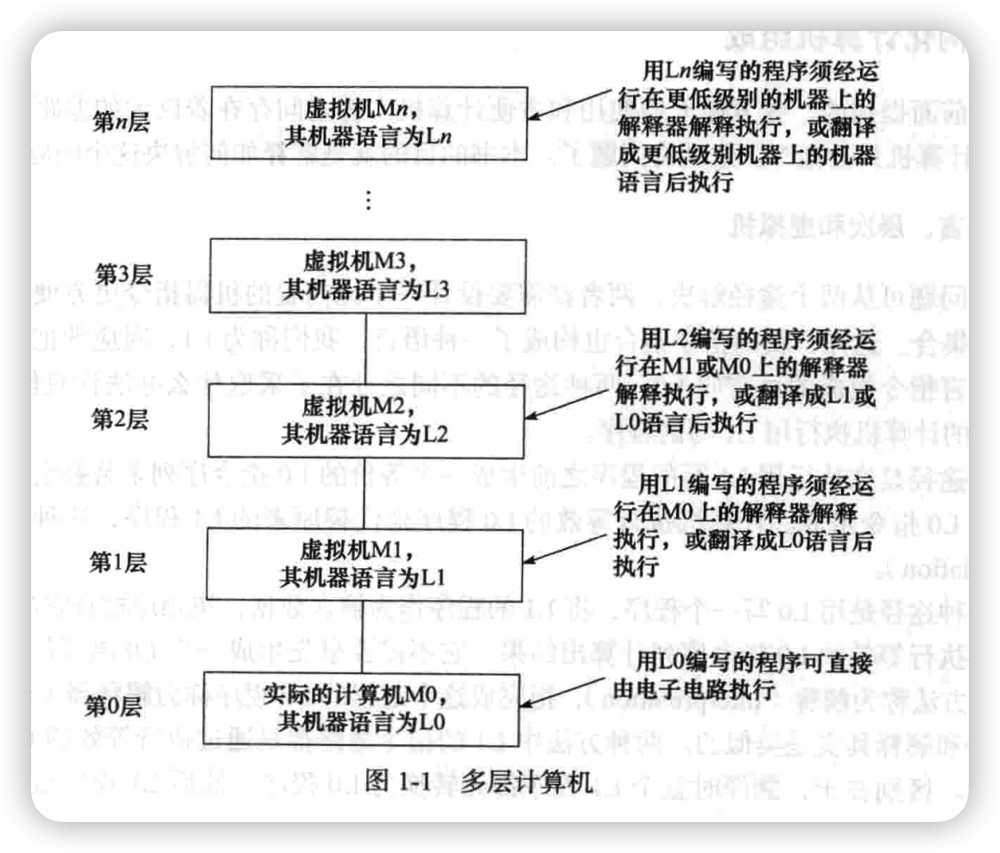
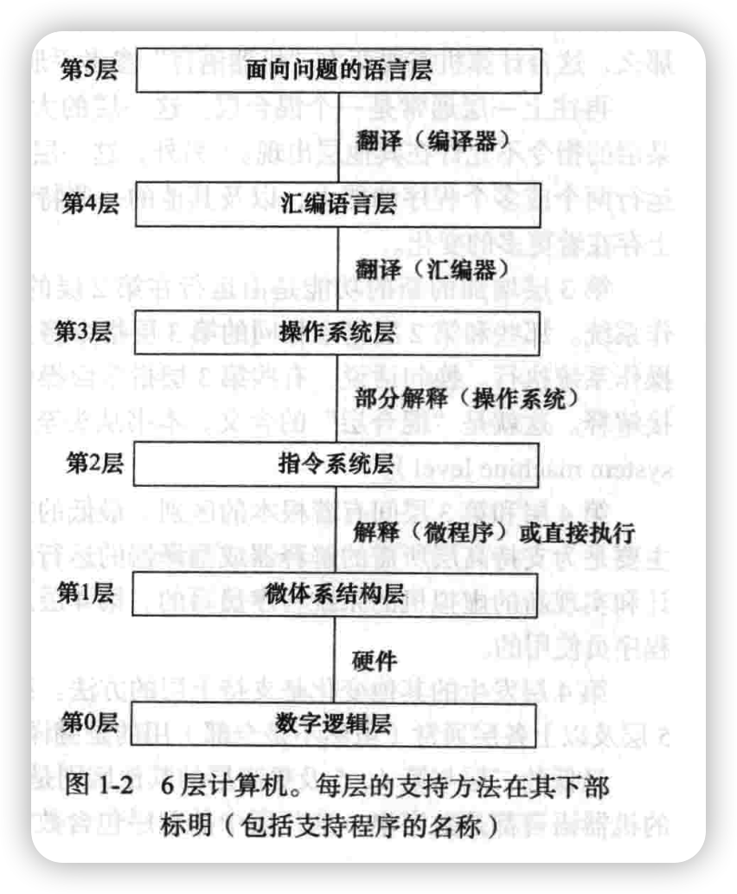

# 第 1 章 概述

"只有那些与我们挽手共同进退的爱人，才能给我们安全感和自我价值的认同" 

数字计算机是通过执行人们给出的指令来完成工作的机器。 **描述如何完成一个确定任务的指令序列称为程序(program)**。 每台计算机的电路都只能识别和直接执行有限的简单指令， 所有程序都必须在执行前转换成这些指令。 这些基本的指令几乎都不会比下面的指令复杂：
- 两个数相加。
- 检查某数是否为零。
- 将一些数据从计算机内存的某些单元复制到另外的单元中。

计算机的这些原始指令共同组成了一种可供人和计算机进行交流的语言， 我们称其为机 器语言
(machine language )。 设计一种新的计算机时， 人们必须首先决定它的机器语言中包含 哪些指令。 通常，
原始指令应尽量简单， 兼顾考虑计算机的使用要求和性能要求， 以降低实 现电路的成本和复杂度。 正
因为大多数机器语言如此简单， 使用起来才显得十分困难和乏味。

通过对计算机的这些简单描述， 我们可将计算机结构化为一系列抽象机， 每台抽象机 m 都建立在
其下层抽象机的基础上。 这样， 计算机的复杂性就在可控范围内， 计算机系统的设 计也可在有组织和
系统的状态下进行。 我们把这种方法称为结构化计算机组成(structured computer organization ),并以此命
名本书。 下一节我们将解释它的含义， 然后回顾一下计算机 发展历史和这当中一些有影响的机型。

## 1.1 结构化计算机组成
正如前面提到的， 在方便人们使用和方便计算机实现之间存在着巨大的差距。 人可能要 做 X,而计
算机只会做 Y。 这就有问题了。 本书的目的就是解释如何解决这个问题。

### 1.1.1 语言、 层次和虚拟机

这个问题可从两个途径解决， 两者都需要设计一个比内置的机器指令更方便人们使用的 新的指令
集合。 这样， 新的指令集合也构成了一种语言， 我们称为 L1,对应地把机器中内置 的机器语言指令组
成的语言叫 LOo 两种途径的不同之处在于釆取什么办法让只能执行用 L0 写的程序的计算机执行用 L1
写的程序。

一种途径是在执行用 L1 写的程序之前生成一个等价的 L0 指令序列来替换它， 生成的程 序全部由
L0 指令组成。 计算机执行等效的 L0 程序来代替原来的 L1 程序， 这种技术叫做翻 译(translation )。

另一种途径是用 L0 写一个程序， 将 L1 的程序作为输入数据， 按顺序检查它的每条指令， 然后直
接执行等效的 L0 指令序列计算出结果。 它不需要事先生成一个 L0 语言的新程序。 我 们把这种方法称
为解释(interpretation),把完成这个过程的 L0 程序称为解释器(interpreter )。

翻译和解释其实是类似的。两种方法中 L1的指令最终都是通过执行等效的 L0指令序列 来实现的。
区别在于， 翻译时整个 L1 程序都先转换为 L0 程序， 然后 L1 程序就被抛弃， 新 的 L0 程序被装入计算
机内存中执行。 执行过程中， 运行的都是新生成的 L0 程序， 控制计算 机的也是 L0 程序。

而解释时， 每条 L1 指令被检査和解码之后将立即执行， 不生成翻译后的程序。 这里,
控制计算机的是解释器。 对它来说， L1 程序仅仅只是数据。 这两种方法， 以及后来它们的综 合， 都得
到了广泛的应用。

比起理解翻译和解释这两个概念， 想象存在一种假想的以 L1 为机器语言的计算机或虚 拟
机也许更简单一些。 让我们把这种虚拟机定义为 Ml （相应地， 把原来的以 L0 为机器语言 的虚
拟机定义为 M0） ,如果这种计算机可以以足够低廉的成本得到， 那就根本不需要 L0 这 种语言或
者是执行 L0 语言程序的机器了。 人们可以简单地用 L1 写程序并让计算机直接执 行。 即使因为
使用 L1 为语言的虚拟机太贵或太复杂而不能由电子电路构成， 大家还是可以写 L1 语言的程序
° 这些程序可以用能直接被现有计算机执行的 L0 语言程序翻译或解释。 换句 话说， 大家完全可
以像虚拟机真正存在一样用它们的语言写程序。

为使翻译或解释现实可行， 两种语言 L0 和 L1 的差别不能“太” 大。 这条限制经常意味 着，
虽然 L1 比 L0 好一些， 但对于多数应用来说还不理想。 这也许会导致对提出 L1 的最初 目的——
减轻程序员不得不用一种更适合计算机的语言来描述算法的负担——有些失望。 然 而， 不应该
是绝望。

显然， 解决问题的办法是发明一种比 L1 更面向人且少面向机器的指令集来取代它， 这 个
指令集形成的语言， 我们可以称为 L2（对应的虚拟机称为 M2） 。 人们可以像用 L2 作为机 器语
言的虚拟机真正存在一样用 L2 写程序， 然后翻译成 L1 或用 L1 写成的解释器来执行。

这种发明一系列语言， 每种都比前一种更方便人们使用的步骤可以无限制地继续下去， 直
到最后找到一种合适的语言。 每种语言都以前一种为基础， 我们可以把使用这种技术的计 算机
看成一系列层（layer 或者 level） ,如图 1-1 所示， 一层在另一层之上。 最底部的语言或 层最简单，
而最上面的语言或层最复杂。

语言与虚拟机之间存在着重要的对应关系。 每种机器都有由它能执行的指令组成的机器 语言， 也
就是说， 机器定义了语言。 类似地， 语言也定义了机器——即机器要能执行用这种 语言写的所有程序。
当然， 由某种语言定义的机器真正用电子电路实现的话可能会十分复杂 和昂贵， 但我们依然可以想象
它的存在。 以 C、 C++或 Java 语言作为机器语言的机器确实会 很复杂， 但用今天的技术实现起来也不
会很难。 可是我们有充分的理由不建造这么一台机器： 与其他技术比起来， 它的成本太高。 真正实用
的设计应该同时具有成本上的优势， 仅仅具有 理论上的可行性是不够的。

一般意义上讲， 有"层的计算机可看成〃 台不同的虚拟机， 每一台的机器语言都不相同。 m 我们将
交替使用术语“层” 和“虚拟机” 表示同样的意思。 值得注意的是， 就像计算机学科 中许多其他术语
一样， “虚拟机” 还有其他的含义， 我们将在本书的后续章节中介绍。 只有用 L0 语言写的程序可以被
电子电路直接执行， 无须进行中间翻译或解释。 用 LI、 L2、 …、 L〃 写的程序必须经低层解释器解释
或翻译成对应于低层的另一种语言。

为"层虚拟机写程序的程序员不必关心下层的翻译器或解释器， 程序由计算机的结构来 保证正确
执行， 而不必管它是不是由解释器一步步地执行后交给下一个解释器或电子电路直 接执行。 对于这两
种情况， 结果都一样： 程序被执行了。

多数使用“层计算机的程序员只对顶层感兴趣， 这一层与底层的机器语言差别最大。 然 而， 那些
想了解计算机到底是如何工作的人就必须研究所有的层， 而那些设计新计算机或新 层的人也必须熟悉
顶层之外的其他层。 将计算机分为一系列层的概念和技术以及这些层的组 成细节构成了本书的主题。

### 1.1.2 现代多层次计算机
多数计算机包含两层或更多层。 甚至有多至 6 层的计算机存在， 如图 1-2 所示。 位于底
部的第0层是机器真正的硬件，它的电路执行第1层的机器语言。为保证完整性，我们还应该提到第◎层下面的一层一—设备层（device level)，因为属于电子工程领域（不属于本书范围）而没有在图1-2中画出。在这一层，设计者见到的是单个的晶体管，这些对计算机设计人员来说是最底层的元素。至于里面的晶体管是如何工作的，则是固体物理研究的课题。

在我们要研究的最底层——数字逻辑层（digital logic level)，我们感兴趣的对象是门（gate )。虽然它们由类似的元件（如晶体管）构成，但门可以作为数字设备的精确原型。每个门可以有一个或多个数字输人端（由0或1表示的信号)，可计算并输出这些输入的一些简单逻辑函数（如与和或）的结果。门最多由几个品体管构成，几个门可组成1位存储器，存放一个0 或 1。 1 位存储器可组合成（例如） 16、 32,或 64 一组， 形成寄存器。 每个寄存器（register） 可存
放一个不大于某个最大值的二进制数。 门本身也可组成主要的计算部件。 我们将在第 3 章详细讨
论数字逻辑层和门。

上面一层是微体系结构层。 在这层我们可以看到（一般） 由 8 ~ 32 个寄存器组成的寄存 器
组以及名为 ALU （ Arithmetic Logic Unit,算术逻辑部件） 的电路， ALU 可以完成一些简单 的算
术运算。 这些寄存器和 ALU 相连形成数据通路（data path ） ,供数据在其中流动。 数据 通路的
基本功能是选择一个或两个寄存器作为 ALU 的操作数（例如， 将它们相加） ， 然后将 结果存回
某个寄存器。

一些机器上数据通路的这些功能是由一个叫做微程序（microprogram） 的程序控制的， 而
另外有些机器是直接由硬件控制的。 本书的早期几个版本中， 我们都把这一层称为“微程 序层
（microprogramming level） ,因为过去这几乎都是由软件解释器实现的。 由于目前的许 多机器经
常（部分地） 由硬件直接控制数据通路， 我们把这一层改名为“微体系结构层” 来 反映这种变
化。

在由软件控制数据通路的计算机上， 微程序可看作是对第 2 层指令的解释器。 它通过数据 通
路逐条对指令进行取指、 检査和执行。 例如， 对 ADD 指令， 将首先取出指令， 对操作数寻 址并
送入寄存器， 由 ALU 求和， 最后把结果存回到指定的地方。 而在硬件直接控制数据通路 的计算
机上， 执行的步骤与此类似， 但不存在一个真正的存储程序来控制解释第 2 层的指令。

第 2 层我们称为指令系统层或 ISA 层（Instruction Set Architecture level ） 0每个计算机 制造
商都会为他们出售的计算机出版一本手册， 名为“机器语言参考手册” 或“Western Wombat 100X
型计算机的操作原理” 或其他类似的名字。 实际上， 这些手册都是关于 ISA 层 的， 而不是底下
的两层。 它们说的机器的指令集， 实际上是由微程序解释或硬件执行电路直 接执行的指令。 若
某个计算机手册为一台计算机提供两个解释器， 解释 2 个不同的 ISA 层， 那么， 这台计算机需
要两本“机器语言” 参考手册， 每个解释器一本。

再往上一层通常是一个混合层。 这一层的大多数指令和 ISA 层相同。 （也没有理由规定 某
层的指令不允许在其他层出现。 ） 另外， 这一层有新的指令集， 不同的存储器结构， 有同时 运
行两个或多个程序的能力， 以及其他的一些特性。 与第 1 层和第 2 层相比， 第 3 层在设计 上存
在着更多的变化。

第 3 层增加的新的功能是由运行在第 2 层的解释器来执行的， 历史上这一层被称为操 作系
统。 那些和第 2 层指令相同的第 3 层指令将直接交给微程序（或硬件） 执行， 而不是由 操作系
统执行。 换句话说， 有些第 3 层指令由操作系统解释， 而有些由微程序（或硬件） 直 接解释。
这就是“混合层” 的含义。 本书从头至尾把这一层称为操作系统机器层（operating system machine
level ） 。

第 4 层和第 3 层间有着根本的区别。 最低的三层并不是为普通程序员使用而设计的， 而 主
要是为支持高层所需的解释器或翻译器的运行而设计的， 这些解释器和翻译器是由专职设 计和
实现新的虚拟机的系统程序员写的。 第 4 层及以上各层才是供那些解决应用问题的应用 程序员
使用的。

第 4 层发生的其他变化是支持上层的方法。 第 2 层和第 3 层用的几乎都是解释， 而第 4、 5
层及以上各层通常（虽然不是全部） 用的是翻译。

最低的三层与第 4、 5 及更高层的其他区别是提供的语言本质的变化。 第 1、 2、 3 层提供 的
机器语言都是数字串， 这几层中的程序包含数字的长序列， 适合机器执行， 而不容易被人12 第［ 章
理解。 从第 4 层开始， 提供的语言成了能帮助人们理解的单词和助忆符。

第 4 层， 汇编语言层， 实际上是某种低层语言的符号表示。 本层为程序员写第 1、 2、 3 层程序提
供了一种比用虚拟机语言直接写这些程序更舒服的方法。 用汇编语言写的程序首先 被翻译成第 1、 2
或 3 层的语言， 然后由相应的虚拟机或硬件解释执行。 完成翻译过程的程序 称为汇编器（ assembler ） 。

第 5 层的语言通常是提供给解决现实问题的应用程序员使用的。 这些语言通常称为高级 语言
（ high-level language） 。 目前存在的高级语言有几百种， 比较知名的有 C、 C++、 Java、 Perl. Python
和 PHP。 用这些语言写的程序一般先由编译器（ compiler） 翻译成第 3 层或第 4 层语言， ,虽然偶尔也
有解释执行的。 例如， 用 Java 语言写的程序通常先被翻译成一种类似于 指令系统层的语言——Java 字
节码， 然后被解释执行。

某些情况下， 第 5 层由某一特别应用领域（ 例如代数） 的解释器组成， 提供该领域专业 人员熟悉
的运算和数据以解决该领域的问题。

总的来说， 本节应该记住的关键一点是将计算机设计成一系列的层， 每层建立在它的前 一层之上，
每层表示一个不同的抽象， 由不同的对象和操作表示。 用这种方式设计和分析计 m 算机， 我们能暂时
忽略一些无关紧要的细节， 使复杂的问题更容易理解。

每层的数据类型、 操作和特性构成了该层的体系结构。 它解决的是该层的用户能看到的 问题。 程
序员需要了解的特性， 如可用的内存有多大， 是体系结构的一部分； 而具体的实现 细节， 如用哪种技
术实现这种内存， 就不属于体系结构的内容。 计算机体系结构是研究如何 设计程序员眼中的计算机系
统的学科。 一般情况下， 计算机体系结构和计算机组成的含义基 本相同。

### 1.1.3 多层次计算机的演化
为展望多层计算机的未来， 我们首先简单回顾一下计算机的发展历史， 看一看过去这些 年中层数
和各层的属性有何变化。 用真正的计算机机器语言写的程序（ 第 1 层） 能直接由计 算机的电子电路（ 第
0 层） 执行， 不需要经过任何解释或翻译。 这些电路、 存储器及输入/ 输出设备一起， 构成了计算机的
硬件。 硬件是具体的对象——集成电路、 印制电路板、 电缆、 电源、 存储器和打印机等， 而不是抽象
的概念、 算法或指令。

而软件则正好相反， 是由算法（ 指明如何做某事的详细指令） 及其在计算机中的表 示——程序组
成。 程序可存储在硬盘、 软盘、 光盘或其他存储介质上， 但实质上， 软件是组 成程序的指令的集合，
而不是记录它们的物理介质。

早期的计算机中， 硬件和软件之间的界限十分清楚。 然而， 随着时间的推移， 由于计 算机层次的
增加、 减少和合并， 界限变得越来越模糊。 现在已经很难区分它们了（ Vahid, 2003 ） 0事实上， 本书的
一个主题就是：

硬件和软件在逻辑上是等同的。

任何由软件实现的操作都可直接由硬件来完成， 尤其是在操作被人们充分认识之后。 正 如 Karen
Panetta Lentz 所说的： “ 硬件就是固化的软件。 ” 当然， 这话反过来说也同样正确： 任何由硬件执行
的指令都可由软件来模拟。 将某些特定的功能由硬件实现而另外的功能由软 件实现， 是根据当时的成
本、 速度、 可靠性和预期的修改频率这些因素来决定的。 很少能有 确定的规则规定 X 必须由硬件实现
而 Y 必须通过编程实现， 而且这些决定也会随着计算机技 术发展的趋势和计算机应用范围的变化而改
变。 

1. 微程序技术的出现
回到 20 世纪 40 年代， 最早的计算机只有两层： 编制所有程序的 ISA 层和执行这些程序 的概 述 13
数字逻辑层。 数字逻辑层的电路非常复杂难懂， 难以生产制造， 也不可靠。

1951 年， Maurice Wilkes （剑桥大学的研究员） 提出设计一个 3 层计算机来极大地简化 硬
件设计， 并由此减少（不可靠的） 真空管的使用的主意（Wilkes, 1951 ） 0这种机器需要内 置一
个不可修改的解释器（微程序） ， 来解释执行 ISA 层的程序。 这样， 硬件就只需执行仅有 少数
指令的微程序， 而不必执行指令集大得多的 ISA 层程序， 仅需要较少的电路来实现。 由 于当时
的电子电路都是由真空管制造的， 这种简化减少了真空管的使用数量， 因此也提高了 可靠性（即
每天系统崩溃的次数） 。

20 世纪 50 年代仅生产了少量这种 3 层计算机， 60 年代就多了一些， 到 1970 年， 由微程 序
代替电路解释 ISA 层的计算机的概念处于当时的主导地位。 所有那时的主流计算机都使用 了这
项技术。

2. 操作系统的出现
在计算机的早期年代， 大多数计算机都是“自选商场” ， 程序员必须自己操纵计算机。 几 乎
每台计算机都有一个预约单， 想上机运行程序的程序员首先得预约机时， 比如周三的凌晨 3 点~ 5
点（许多程序员愿意在机房安静时上机） 。 到了预约时间， 程序员一手拿着一叠 80 列 的穿孔卡
片（一种早期的输入介质） ， 另一手拿着削好的铅笔动身前往机房， 礼貌地请前一个 程序员离
开， 然后接管计算机。
如果程序员要运行 FORTRAN 程序， 就得经历下面几个步骤：
1 ） 走向存放程序库的柜子， 找出标有 FORTRAN 编译器的绿色卡片， 放入读卡器中， m
按下“启动” 按钮。
2） 将自己编写的 FORTRAN 程序放入读卡器， 按“继续” 按钮， 计算机读入程序。
3） 计算机停下时， 再次将他的 FORTRAN 程序读一遍。 虽然有些编译器只要求输入一 次
程序， 但许多是要求读两遍或更多遍的。 每一遍都得读入一堆卡片。
4） 终于， 翻译过程接近结束了， 而程序员的心跳往往也在这时候加快， 因为若编译器发 现
程序错误， 他将不得不将错误修改后再走一遍上面的全过程。 如果没有错误， 编译器将在 卡片
上打孔输出翻译好的机器语言程序。
5） 然后,程序员将卡片上的机器语言程序同子程序库卡片一起放入读卡器， 将它们一起读
入。
6） 开始执行程序。 多数情况下计算机会不工作或在程序运行中间死机。 一般来说， 程序 员
会胡乱拨弄控制台上的开关或对着控制台的指示灯发一会儿呆。 运气好的话， 可能找到问题, 修
改程序中的错误， 然后从头再来一遍;运气不好时， 只能将内存中的内容打印出来， 即核心 转储，
带回家去研究。
这个过程， 多年来在很多计算中心中都十分相似， 只 *JOB,5494BARBARA
有很少的不同。 它使得程序员不得不掌握如何操纵计算机， ： 溫 RAN
并要学会如何处置频繁出现的计算机死机现象。 更为可气 FORTRAN 的是， 当人们抱着卡片在机
房外等着上机， 或正为分析程 程序
序不能正常工作的原因而挠头时， 计算机却无法正常工作。 .DATA
到 1960 年左右， 大家试图通过将这些工作自动化来
数据卡」
减少时间的浪费。 计算机中出现了一个常驻程序称为操作
系统， 它读入、 处理程序员提供的程序和控制卡片并执行。 *END
图 1-3 给出了第一个广为使用的操作系统， 即运行在 IBM 图 1-3 FMS 操作系统作业举例
709 上的 FMS （FORTRAN 监控系统， FORTRAN Monitor System ） 的作业。14 第［ 章
操作系统先读入*JOB 卡片， 用它上面的信息进行作业登记， 供记录使用。 （ 星号用来标 识控制
卡片， 使它们不会与程序及数据卡片混淆。 ） 然后， 再读入*FORTRAN 卡， 即从磁带 上加载 FORTRAN
编译器的指令， 加载完后， 编译器开始读入并编译用户的 FORTRAN 语言 程序。 编译完成后， 再将控
制返回给操作系统， 读入*DATA 卡， 按照卡上执行翻译好的程序 的指令， 以+DATA 卡后的卡片作为
输入数据， 执行 FORTRAN 语言程序。
虽然操作系统是为自动执行用户作业而设计的（ 正如其名称的含义） ， 但也是开发新的虚 拟机的
第一步。 *FORTRAN 卡可被看作虚拟的“ 编译程序” 指令， 同样地， *DATA 卡可被认 Qo] 为是虚拟
的“ 执行程序” 指令。 只有两条指令对构成一个新层来说少了点， 但其代表的是发 展方向。
随后的几年中， 操作系统变得越来越复杂。 新的指令、 例程和特性不断地加入到 ISA 层 中， 直到
出'现一个新层。 新层中的一些指令和 ISA 层指令完全相同， 但另外一些指令， 尤其 是输入/输出指令，
则是全新的指令。 这些新指令当时被称为操作系统宏或超级用户调用， 现在通称为系统调用。
其他方面操作系统也在不断发展。 早期的操作系统读入卡片， 然后在行式打印机上输出 结果， 这
种方式被称为批处理组织方式。 它从提交程序到结果出来通常得等待几小时， 在这 种环境下， 开发程
序十分困难。
20 世纪 60 年代初， Dartmouth 大学、 MIT 和另外一些机构的研究人员开发出允许（ 多个） 程序员
直接和主机通信的操作系统。 在这些系统中， 远程终端通过电话线和中心计算机相连， 计算机由多个
用户共享。 程序员可在办公室、 家中的车库或放置终端的任何地方输入程序， 并立即得到结果。 这些
系统称为分时系统。
在操作系统层面， 我们感兴趣的是它如何解释第 3 层中出现的而 ISA 层部不具备的指令 和特性，
而不是分时机制。 虽然我们不强调， 但你应当记住操作系统并不是仅解释 ISA 层之 上的指令。
3. 微程序技术的普及
到 1970 年， ,微程序编程已经很普遍， 设计者意识到他们可以通过扩充微程序来增加新 的指令。
也就是说， 可以通过编程来增加“ 硬件” （ 新的机器指令） 。 这个发现导致机器语言 回 指令集的爆炸
式增长， 因为设计者竞相创造出更大和更好的指令集。 许多指令并非特别需要， 因为它们的功能可以
由已有指令很容易地实现， 但新指令一般会比执行一系列已有指令快一 些。 例如， 许多机器有向一个
整数加 1 的 INC 指令， 由于这些机器上也有一条通用的加法指 令 ADD,应该说新增一条加 1（ 或者加
720 也一样） 指令是没有必要的。 不管怎样， INC 指 令比 ADD 快一点， 所以也就加进来了。
许多其他的指令也由于同样的理由加入到微程序中。 通常包括：
1） 整数乘、 除指令。
2 ） 浮点数算术指令。
3） 过程调用和返回指令。
4） 加速循环的指令。
5） 处理字符串的指令。
此外， 一旦计算机的设计者认识到增加一条指令是如此容易， 他们就开始四处寻找可以 加入到他
们的微程序中的特性。 下面就是他们找到的一些：
1） 加速包含数组（ 索引和间接寻址） 运算的特性。
2） 允许程序启动后在内存中移动的特性（ 重置功能） 。
3） 输入/输出操作完成时通知计算机的中断系统。
4） 在少量指令中挂起一个程序并启动另外一个程序的能力（ 进程切换） 。
5） 处理语音、 图像和多媒体文件的特殊指令。概 述 15
这些年来， 还有数不清的其他特性和功能被加入进来， 它们一般都是为了提高某一特定 操
作的速度。
4, 微程序的消失
微程序在它的黄金年代（20 世纪 60 年代和 20 世纪 70 年代） 成长得十分壮大。 伴随而 叵 来
的问题是它也变得越来越慢。 终于， 一些研究人员认识到， 通过取消微程序， 大规模地缩 小指令集，
并将剩下的指令直接由硬件执行（即用硬件直接控制数据通路） ， 可以提高计算机 的速度。 大家的共
识是， 计算机设计的发展画了一个圆圈， 又回到 Wilkes 发明微程序之前的 老地方了。
但历史的车轮还在继续转动。 现代处理器依然依靠微程序技术将复杂的指令翻译为可被 简
洁的硬件直接执行的内部微码。
说了这么多， 关键是想表明计算机硬件和软件的界限完全是人为划定的， 并且经常变化。 今
天的软件也许就是明天的硬件， 反过来也一样。 甚至层与层之间的界限也是模糊的。 从程 序员
的观点看， 指令实际上是怎样实现的并不重要（除非是为了提高速度） o ISA 层的程序员 可以将
他的乘法指令当作硬件指令， 而不必担心， 甚至根本不用考虑它是否真正是由硬件实 现的。 一
个人的硬件是另一个人的软件。 本书后面还会经常重复这个观点。