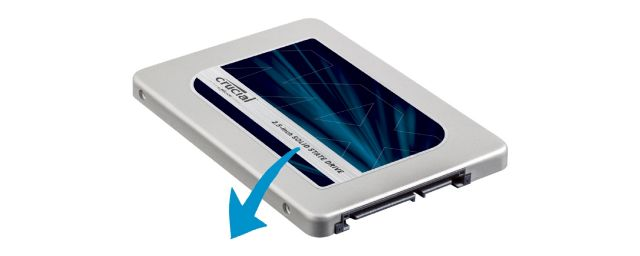
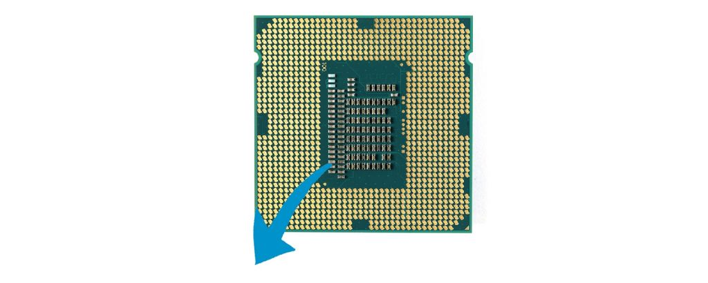
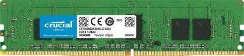

# RAM 和 ROM 知识

## ◆ 内存 RAM (random access memory 随机存储器)

> 文章来源：https://www.crucial.cn/articles/about-memory/what-does-ram-stand-for

主存(内存) RAM（发音同 ram`/ræm/`），是指随机存取存储器（random access memory，RAM）又称作“随机存储器”，是与CPU直接交换数据的内部存储器，也叫主存(内存)。它可以随时读写，而且速度很快，通常作为操作系统或其他正在运行中的程序的短时间临时数据存储媒介。

计算机首先从存储盘将用户请求的程序或文档加载到内存，然后从内存中访问每条信息。由于许多操作均依赖于内存，因此RAM 容量在系统性能方面起着至关重要的作用。

(随机存储器，就是电脑的内存条。用于存放动态数据。(也叫运行内存)系统运行的时候，需要把操作系统从 ROM 中读取出来，放在 RAM 中运行。)

### 内存的工作原理

在计算机中，内存与系统处理器和存储盘（硬盘或固态硬盘）协同工作来访问和使用数据。例如，用户希望访问电子表格中的数据并执行一些基本编辑操作，以下是计算机内部的工作流程：

1. 程序和文件位于存储盘上。

2. 系统处理器将程序数据从存储盘传输至内存进行短期访问和使用。

3. 处理器从内存中访问数据，内存容量在很大程度上决定应用程序的运行速度以及计算机处理多个任务的效率。

### 不同类型的内存

为进一步定义随机存取存储器，下面将为大家介绍不同用途的不同类型 RAM。 DRAM (Dynamic random access memory) 是较为常见的一种 RAM；它是指动态随机存取存储器，动态部分来自不断刷新的数据。此外还有一种是 SRAM (static random access memory)，也称为静态随机存取存储器，静态指的是信息不需要刷新。SRAM 速度快，但价格也较高。两种类型 的 RAM 均具有易失性，即计算机电源关闭之后将不保存其中所包含的信息。

### 内存容量选择

RAM 在计算机中运行，旨在为用户正在使用的数据提供短期访问。内存容量越大，应用程序的运行速度以及计算机处理多个任务的效率越高。用户在选购电脑或升级内存硬件时应根据需求选择合适大小的内存或内存条。

## ◆ ROM (read only memory 只读存储器)

> 笔记来源：https://zhuanlan.zhihu.com/p/71383426

ROM (read only memory) 只读存储器：对于电脑来讲就是硬盘，对于手机来讲就是内置储存，对于单片机来讲就是Flash。用于存放操作系统的软件。

我明明可以往硬盘里写数据，为什么叫只读储存器呢?

这一点在单片机上更容易解释一些：把固件(系统软件)烧录进 Flash，然后就不能修改了。不管用户怎么重新启动，怎么运用，都不会影响到固件。也就是说， 固件是不可被写入的 ，因此叫做“只读储存器”。

对于手机来讲也是这样子，内部储存中有一部分空间用于存放系统软件，不管你怎么运用也不会把系统软件用坏了。这一部分也可以理解为“只读储存器”。

实际运用的时候会把 内置储存 和 Flash 分成两个部分，一块可以被写入，一块不能被写入 。可以被写入的地方用来储存通讯录、照片、音乐、APP之类的，不可被写入的地方用来存放操作系统的软件。

手机的 ROM，从最早的 NOR Flash 发展到 NAND Flash，现在清一色全都是 eMMC 了(和TF卡是一个东西)。单片机的 Flash 还是维持在小容量的 NOR Flash。
