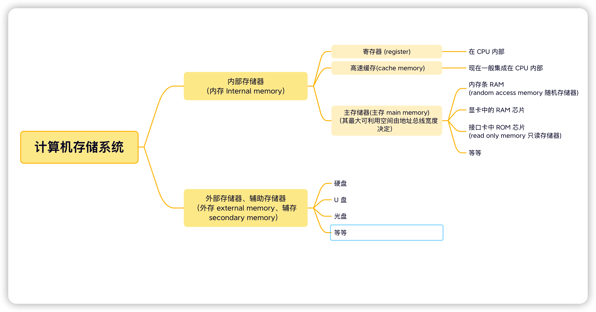
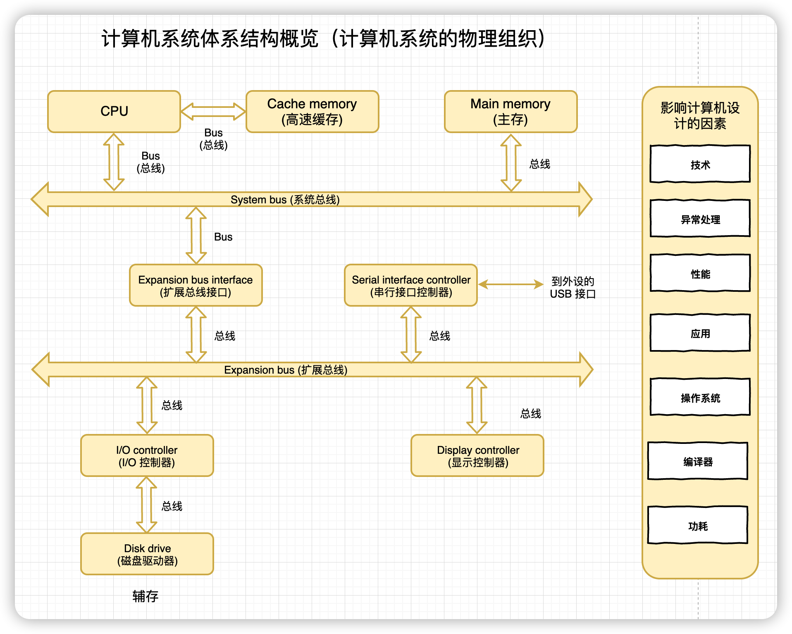

# Computer Organization and Architecture: Themes and Variations

计算机组成原理

作者: 艾伦·克莱门茨 (Alan Clements)

(中文)出版社: 机械工业出版社

中英文扫描 PDF 下载链接：

> 链接: https://pan.baidu.com/s/1U6EkdRuQsL5gPpRgEgM0nQ?pwd=em08 
>
> 提取码: em08

**Additional Info:** `./RAM和ROM知识/readme.md`

## ◆ Part 1 The Beginning (第一部分 起始篇)

### `体系结构 (Term Architecture)` 术语的 3 种用法
> Three Uses of the Term Architecture

尽管计算机文献中多次使用 “体系结构”这一术语，但它有3种不同的使用方式。

- `指令集体系结构 (Instruction Set Architecture, ISA)` 描述了程序员看到的计算机的抽象视图，并且定义了汇编语言和编程模型。之所以说它是抽象的，是因为它并没有考虑计算机的实现。
- `微体系结构 (Microarchitecture)` 描迷了一种指令集体系结构的实现方式。换句话说，微体系结构关注计算机的内部设计。
- `系统体系结构 (Systems Architecture)` 关注包括处理器、存储器、总线和外设在内的整个系统。所有设计计算机系统的人以及必须安排组件以获得最佳解决方案的人，都对系统体系结构感兴趣。

> Although the term architecture appears over and over again in computer literature, it is used in three distinct ways.
> 
> - **Instruction Set Architecture (ISA)** describes the programmer's abstract view of the computer and defines its assembly language and programming model. It is abstract because it does not take into account the implementation of the computer.
> - **Microarchitecture** describes the way in which an instruction set architecture is implemented. In other words, the microarchitecture is concerned with the internal design of a computer.
> - **Systems Architecture** is concerned with the complete system consisting of memory, buses, and peripherals. Systems architecture is of interest to all who design computer systems and who have to arrange the components to create the most cost-effective solution to a problem.

下图列出了计算机系统体系结构所涉及的内容 (下图提供了我们通过计算机系统架构旅程所涵盖的领域地图)。图中描述了计算机系统的各个部件, 从完成**信息处理的CPU**, 到**存储大量信息的磁盘驱动器**(包括笔式驱动器和固态盘), 以及**传递数据的总线**(信息高速公路)。计算机系统还包括键盘、鼠标、显示器、打印机(个人计算机内)、数码相机或 GPS 接收器(手机或导航设备中) 等**输入/输出设备**。计算机体系结构课程通常没有足够的学时介绍这些从简单的机电鼠标到极为复杂的GPS 接收器的多种多样的外部设备。

> The figure provides a map of the *territory* covered by our journey through computer systems architecture. This map introduces the parts of the computer system, from the **CPU (Central Processing Unit)** that carries out the information processing, to the **disk drives** (including pen drives and solid-state disks) that store huge quantities of data, and **the buses** (information highways) that transport data around the computer. Computer systems also include **input and output devices** such as a keyboard, mouse, display, printer (in a PC), a digital camera, or a GPS receiver (in a cell phone or navigation device). Courses in computer architecture often lack the time to cover these peripherals$^*$ that range from the simple electromechanical$^*$ mouse to the immensely$^*$ complex GPS receiver. 
>
> 
>

术语 **中央处理器 (CPU)** 一词描述了计算机系统中**负责从内存中读取指令并对其进行处理**的部分。 今天，它在很大程度上是**微处理器 (microprocessor)**的代名词。 图中计算机系统的许多元素(/组件)都有一个或多个章节专门介绍它们。 

>
> The term **Central Processing Unit (CPU)** describes the part of a computer system responsible for reading instructions (命令，指令) from memory and executing them. Today, it is largely synonymous with **microprocessor**. Many of the elements of the computer system in this diagram have one or more chapters devoted$^*$ to them. 

> Bus (总线): 〔计算机的〕总线﹐母线﹐汇流条 (a circuit that connects the main parts of a computer so that signals can be sent from one part of the computer to another. 连接计算机主要部分的电路，以便信号可以从计算机的一个部分发送到另一个部分.)

计算机体系结构领域的学生也应该了解影响计算机设计的各种因素（如上图右侧所示)。
例如，性能与计算机运行速度有关。同样，我们还对异常处理感兴趣，它是允许计算机响应外部事件的机制，例如移动鼠标或按下一个按键。功耗是当前计算的关键因素，因为它必须尽可能小。为了避免处理器因过热而损坏，高性能计算机必须降低功耗，而为了延长电池寿命，便携系统也必须减少功耗。

为什么本书的内容这样组织？

由于存在大量互相冲突的内容，选择一种有效的教材内容組织方式并不是一件容易的事。例如，我希望在书中尽可能早地讨论计算机的历史，但这也许没那么简单，因为在介绍读者所需的基本概念之前是无法介绍计算机的历史的。一种折中办法是从一些计算历史上的里程碑事件开始，而将共余的故事放在后而介绍。

不同的大学采用不同的方式讲授计算机体系结构和组成，然而，所有课程都会重点强调指令集体系结构（即计算机的指令集、寄存器结构和寻址方式)。因此，我将与计算机指令集体系结构相关的章节放在本书的开始位置。

与其他教材相比，本书将与性能有关的章节放在更为靠后的位置，这是因为我希望学生在阅读如何测量计算机的速度和性能等内容之前能够理解指令集体系结构的概念。

计算机体系结构课的教师都必须选择一款处理器用于指令集的教学。我选择的是ARM 系列微处理器，因为它的学习曲线并不陡峭，学生能够很容易地掌握 ARM 指令集的主要特点。此外，ARM 也是一种非常简洁的处理器，在工业界应用十分广泛。

计算机体系结构课有两种基本的教学方法：一种被称作自底向上(bottom-up)，另一种則是自顶向下（top-down)。自底向上方法从门开始介绍，然后是电路、系统，最后是计算机。每个新的层次都构建在之前的教学内容上，学生之所以能够理解一台计算机是如何工作的，是因为他已经了解了每个部件的工作原理。这种教学方法的问题在于学生不了解最终的设计目标，同时也有可能陷入细节之中。自顶向下的方法很适合如今的抽象和面向对象设计方法。学生从顶层计算机系統开始，逐步细化，得到更低的层次。例如，可以从高级语言开始，说明如何将高级语言编译为机器指令，然后介绍如何在框图一级实现这些指令，接下来介绍功能电路，最后以门设计电路收尾。不同的教授会选择不同的教学方法，我却认为教育的结果更多地取决于教授的能力，而不是他所选择的教学方法。我个人采用自顶向下和自底向上相结合的方法进行教学。

### 第 1 章 计算机系统体系结构

#### 1.1 什么是计算机系统体系结构

#### 1.2 体系结构和组成
##### 1.2.1 计算机系统和技术
##### 1.2.2 计算机本系結构在计算机科学中的地位

#### 1.3 计算机的发展
##### 1.3.1 机械计算机
##### 1.3.2 机电式计算机
##### 1.3.3 早期的电子计算机
##### 1.3.4 微机和 PC 革命
##### 1.3.5 摩尔定律和进步的历程
##### 1.3.6 存储技术发展 
##### 1.3.7 普适计算
##### 1.3.8 多媒体计算机

#### 1.4 存储程序计算机
##### 1.4.1 问题描述
##### 1.4.2 解决方法
##### 1.4.3 构造一个算法
##### 1.4.4 计算机需要通过什么来解决问题
##### 1.4.5 存储器 

#### 1.5 存储程序的概念

#### 1.6 计算机系统概览
##### 1.6.1 存储层次
##### 1.6.2 总线

#### 1.7 现代计算

#### 本章小结

#### 习题

### 第 2 章 计算机算术

#### 2.1 数据是什么
##### 2.1.1 位与宇节
##### 2.1.2 位模式

#### 2.2 数字
##### 2.2.1 位置记数法

#### 2.3 二进制运算

#### 2.4 有符号整数
##### 2.4.1 符号及值表示法
##### 2.4.2 二进制补码运算

#### 2.5 乘除法简介
##### 2.5.1 移位运算
##### 2.5.2 无符号二进制乘法
##### 2.5.3 快速来法
##### 2.5.4 除法

#### 2.6 浮点数
##### 2.6.1 IEEE 浮点數

#### 2.7 浮点运算

#### 2.8 浮点运算和程序员
##### 2.8.1 浮点运算中的误差传播
##### 2.8.2 生成数学函数

#### 本章小结

#### 习题

## ◆ Part 2 (第二部分 指令集系统结构)

### 第3章 体系结构与组成

#### 3.1 存储程序计算机
##### 3.1.1 扩展处理器：常量处理
##### 3.1.2 扩展处理器：流控制

#### 3.2 ISA 的组成
##### 3.2.1 寄存器
##### 3.2.2 寻址方式概述
##### 3.2.3 将令格式
##### 3.2.4 操作码与指令

#### 3.3 ARM 指令集体系结构
##### 3.3.1 ARM 寄存器集
##### 3.3.2 ARM 指令集

#### 3.4 ARM 汇编语言
##### 3.4.1 ARM 程序结构
##### 3.4.2 汇编器的实际考虑因素
##### 3.4.3 伪指令

#### 3.5 ARM 数据处理指令
##### 3.5.1 算术指令
##### 3.5.2 位操作
##### 3.5.3 移位搡作
##### 3.5.4 指令编码—一洞察 ARM 体系结构

#### 3.6 ARM 的流控制指令
##### 3.6.1 无条件分支
##### 3.6.2 条件分支
##### 3.6.3 测试与比较指令
##### 3.6.4 分支与循环结构
##### 3.6.5 条件执行

#### 3.7 ARM 寻址方式
##### 3.7.1 立即数寻址
##### 3.7.2 寄存器间接寻址 
##### 3.7.3 带偏移量的寄存器间接寻址
##### 3.7.4 ARM 的自动前索引寻址方式
##### 3.7.5 ARM 的自动后索引寻址方式
##### 3.7.6 程序计數器相相对寻址
##### 3.7.7 ARM 的 load 与 store 指令编码

#### 3.8 子程序调用与返回
##### 3.8.1 ARM 对子程序的支持
##### 3.8.2 条件子程序调用

#### 3.9 ARM 代码实例
##### 3.9.1 计算绝对值
##### 3.9.2 字节操作与拼接
##### 3.9.3 宇节逆转
##### 3.9.4 乘以 $2^n - 1$ 或 $2^n + 1$
##### 3.9.5 多条件的使用
##### 3.9.6 只用一条指令
##### 3.9.7 实现多段程序
##### 3.9.8 简单位级逻辑操作
##### 3.9.9 十六进制字符转換
##### 3.9.10 输出十六进制字符
##### 3.9.11 打印横福

#### 3.10 子程序与栈
##### 3.10.1 子程序调用与返回
##### 3.10.2 子程序嵌套 
##### 3.10.3 叶子程序

#### 3.11 数据的大小与排列
##### 3.11.1 数据组织与端格式
##### 3.11.2 数据組织和 ARM
##### 3.11.3 块移动指令

#### 3.12 整合 —— 将所有内容放在一起

#### 本章小结

#### 习题

### 第 4 章 指令集体系结构一一广度和深度
#### 4.1 数据存储和栈 
##### 4.1.1 存储和栈
##### 4.1.2 通过栈传递参数

#### 4.2 特权模式和异常

#### 4.3 MIPS：另一种 RISC
##### 4.3.1 MIPS 数据处理指令

#### 4.4 数据处理与数据传送
##### 4.4.1 不可见的交换指令
##### 4.4.2 双精度移位
##### 4.4.3 压缩和解压缩指令
##### 4.4.4 边界测试
##### 4.4.5 位字段数据
##### 4.4.6 循环

#### 4.5 存储器间接寻址

#### 4.6 压缩代码、RISC、Thumb 和 MIPS16
##### 4.6.1 Thumb 指令集体系结构
##### 4.6.2 MIPS16

#### 4.7 变长指令

#### 本章小结

#### 习题

### 第 5 章 计算机体系结构与多媒体 
#### 5.1 高性能计算应用
##### 5.1.1 图像处理

#### 5.2 多媒体的影响一重新使用 CISC

#### 5.3 SIMD 处理简介
##### 5.3.1 SIMD 技术的应用

#### 5.4 流扩展和 SIMD 技术的发展
##### 5.4.1 浮点软件扩展
##### 5.4.2 Intel 的第三层多媒体扩展
##### 5.4.3 Intel SSE3 和 SSE4 指令
##### 5.4.4 ARM 系列处理器的多媒体指令

#### 本章小结

#### 习题

## ◆ Part 3 (第三部分 组成和效能)

### 第 6 章 处理器控制

#### 6.1 通用数字处理器
##### 6.1.1  微程序
##### 6.1.2 生成徽操作

#### 6.2 RISC 的组成
##### 6.2.1 寄存器一寄存器数据通路
##### 6.2.2 单周期直通计算机的控制

#### 6.3 流水线简介
##### 6.3.1 加速比
##### 6.3.2 实现流水线
##### 6.3.3 冒险

#### 6.4 分支和分支开销
##### 6.4.1 分支方向
##### 6.4.2 流水线中分支的影响
##### 6.4.3 分支开销
##### 6.4:4 延迟分支

#### 6.5 分支预测

#### 6.6 动态分支预测
##### 6.6.1 分支目标缓冲
##### 6.6.2 两级分支预测

#### 本章小结

#### 习题

### 参考文献

