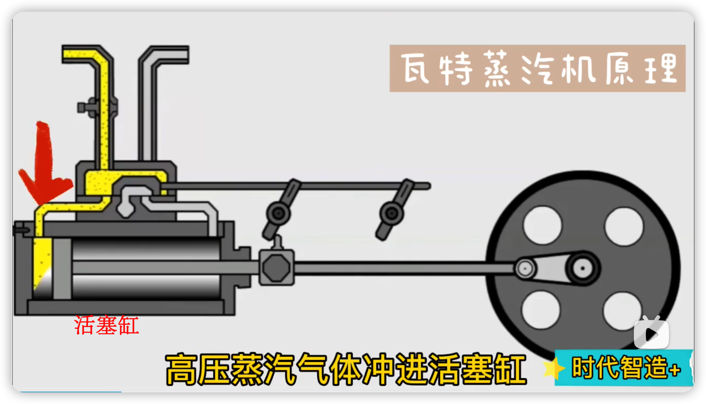
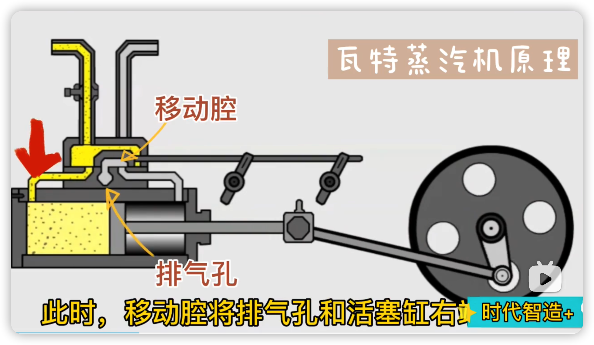
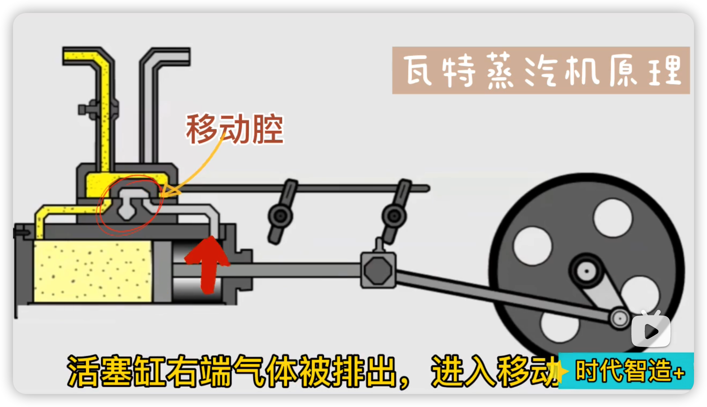
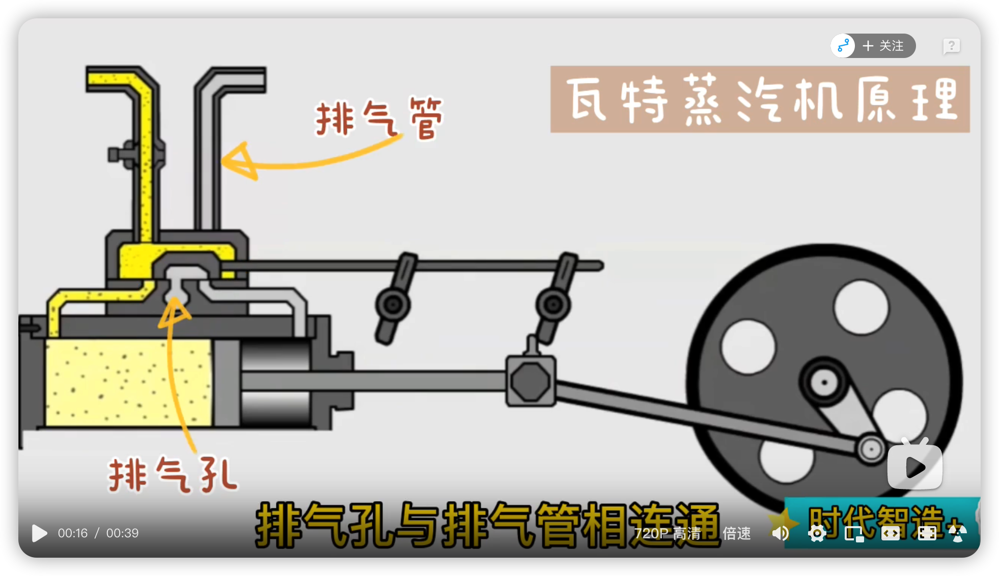
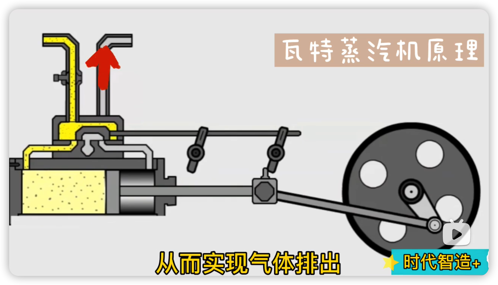
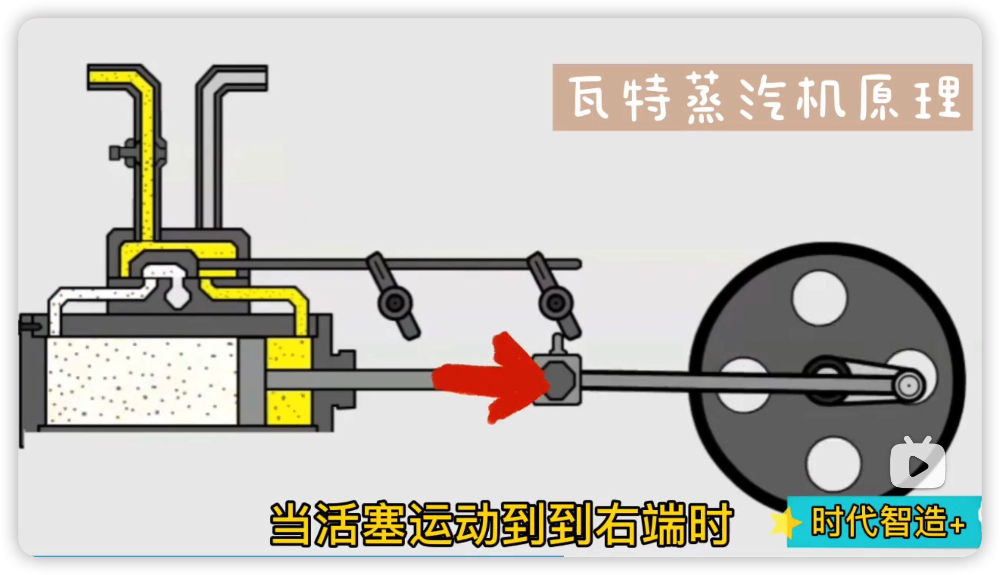
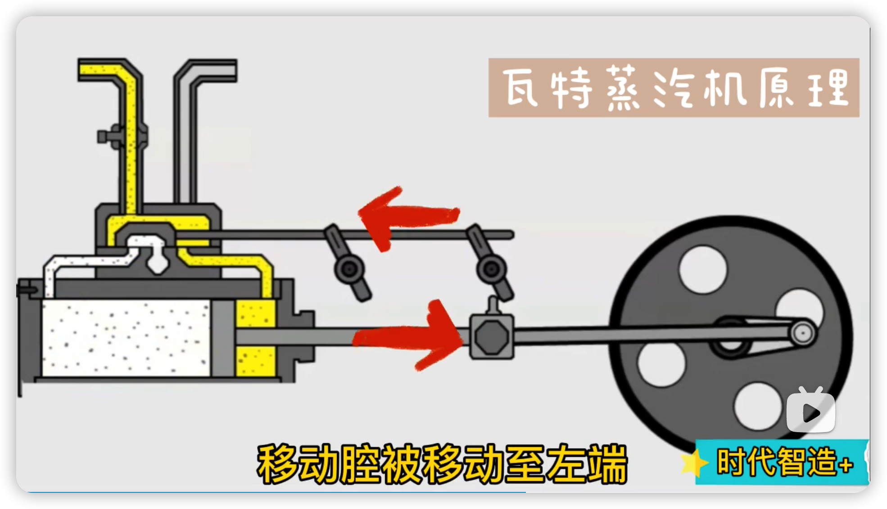
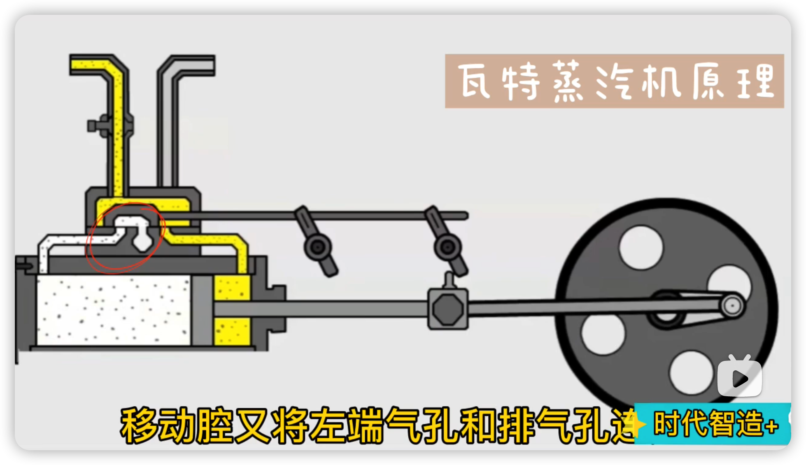
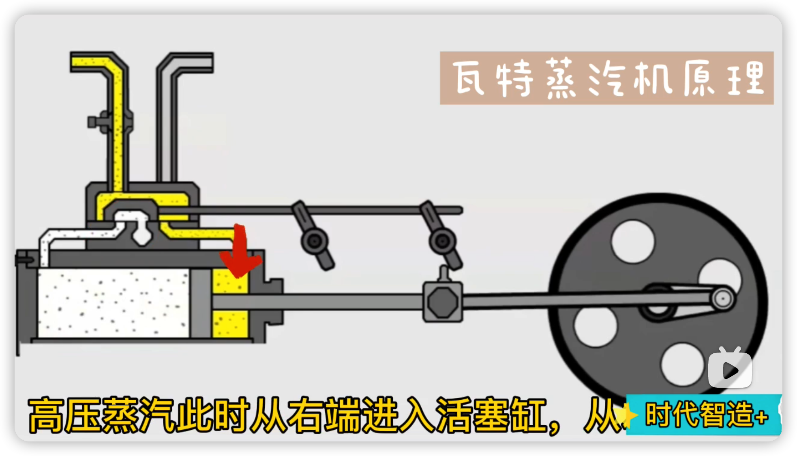
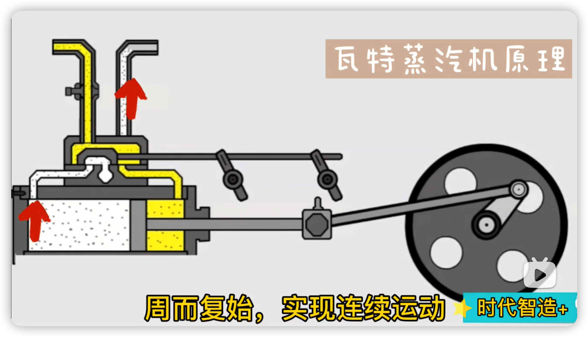

# 瓦特蒸汽机的原理

> 笔记来源 bilibili 视频: https://www.bilibili.com/video/BV1U54y1i7Cb?spm_id_from=333.337.search-card.all.click

高压蒸汽气体冲进活塞缸， 

此时，移动腔将排气孔和活塞缸右端连通，

活塞缸右端气体被排出，进入移动腔内，

排气孔和排气管相连通，(注: 上面的截图应该是 3D 图的半截面，排气孔和排气管相连接不太直观)

- > 完整的动画示例见这个视频：[【中英双字】瓦特蒸汽机原理 牵引发动机是如何工作的](https://www.bilibili.com/video/BV1hq4y1w7JM/?spm_id_from=333.337.search-card.all.click&vd_source=e92153ec1930505e455be52646a78b7c)
    >
    > 

从而实现气体排出，

当活塞运动到右端时，

移动腔被移动至左端，

移动腔又将左端气孔和排气孔连通

高压蒸汽此时从右端进入活塞缸，从左端排出气体；

周而复始，实现连续运动。